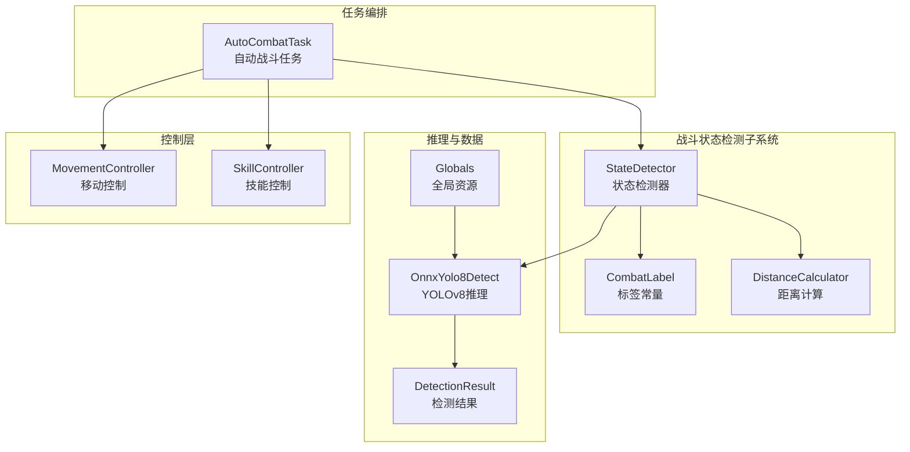
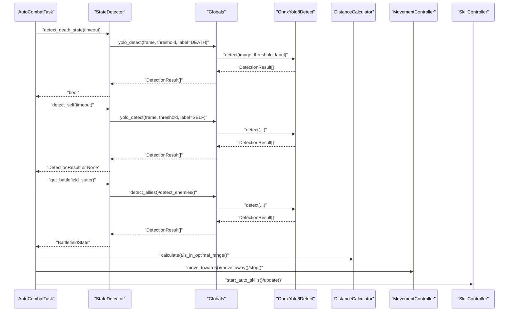
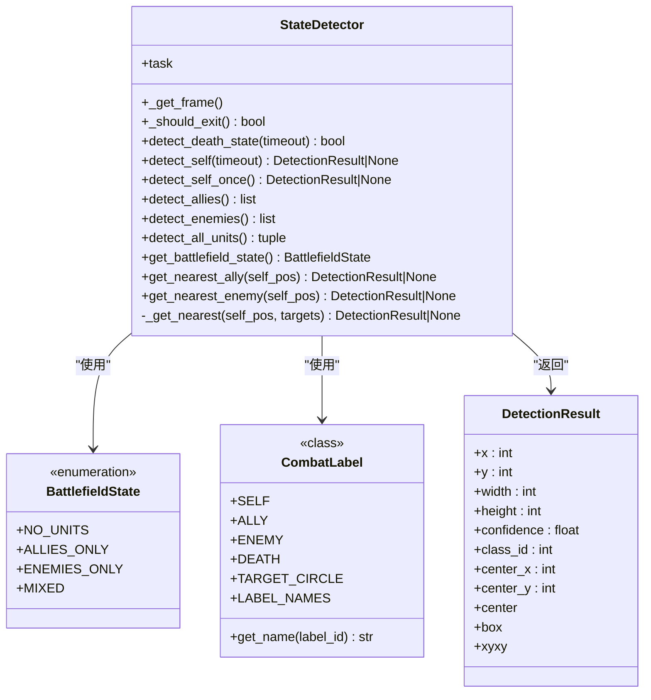
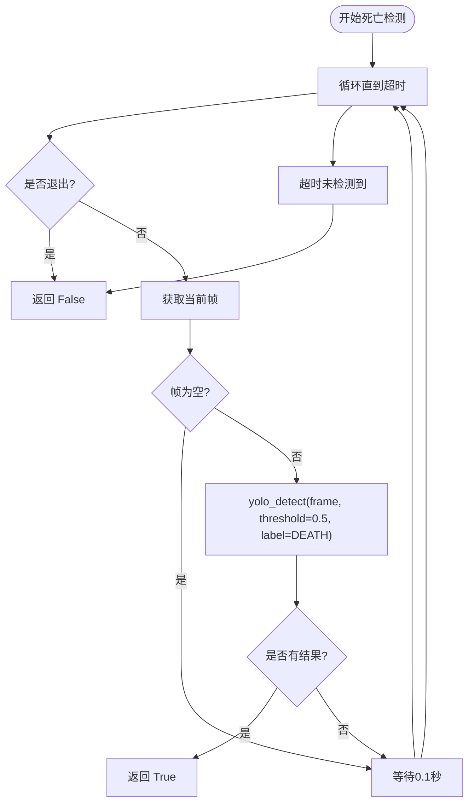
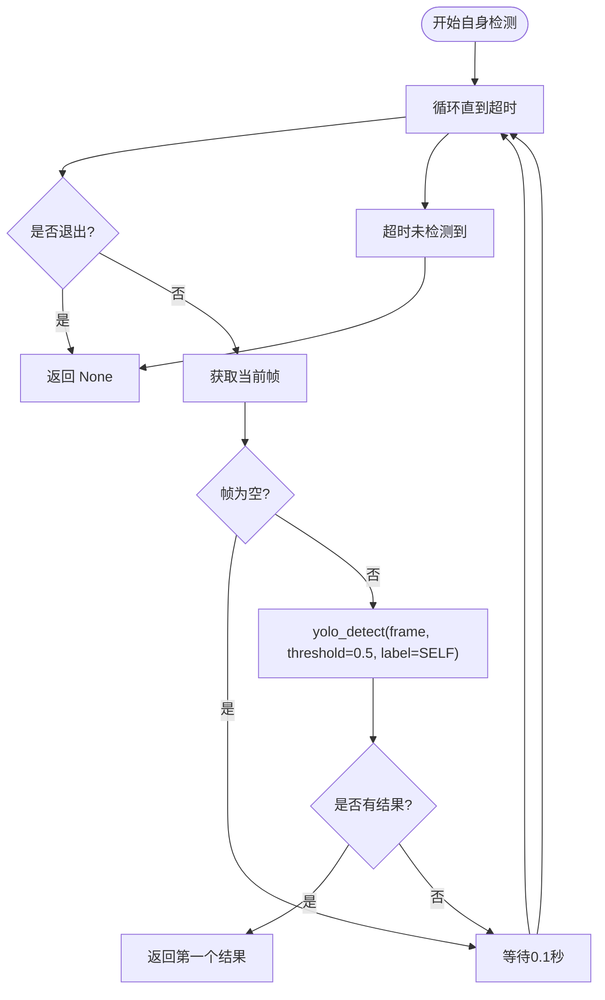
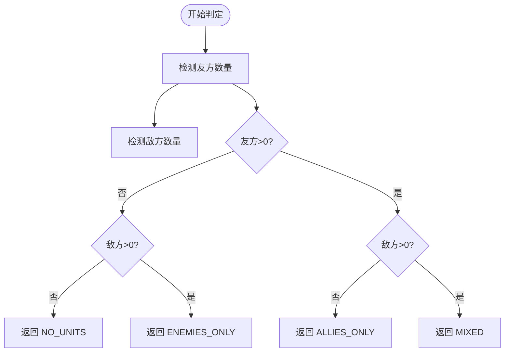
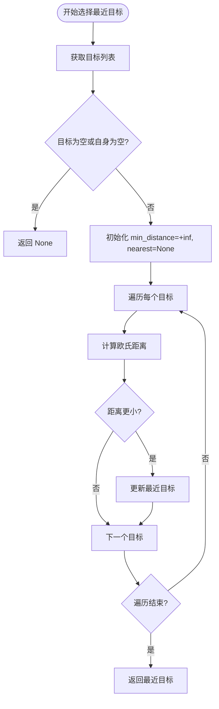
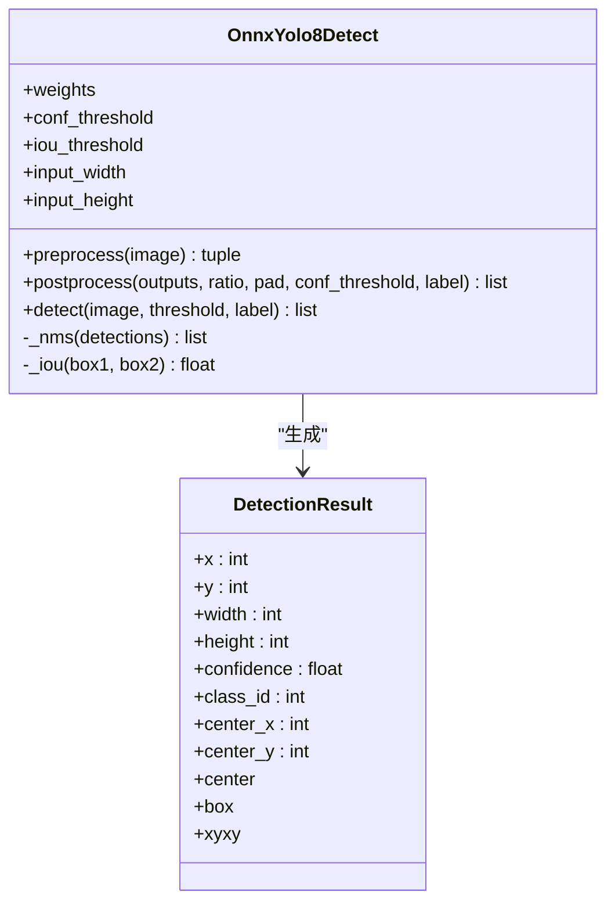
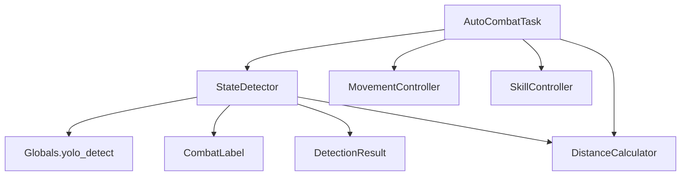

# 战斗状态检测

<cite>
**本文引用的文件**
- [state_detector.py](file://src/combat/state_detector.py)
- [labels.py](file://src/combat/labels.py)
- [OnnxYolo8Detect.py](file://src/OnnxYolo8Detect.py)
- [distance_calculator.py](file://src/combat/distance_calculator.py)
- [movement_controller.py](file://src/combat/movement_controller.py)
- [skill_controller.py](file://src/combat/skill_controller.py)
- [AutoCombatTask.py](file://src/task/AutoCombatTask.py)
- [globals.py](file://src/globals.py)
</cite>

## 目录
1. [简介](#简介)
2. [项目结构](#项目结构)
3. [核心组件](#核心组件)
4. [架构总览](#架构总览)
5. [详细组件分析](#详细组件分析)
6. [依赖关系分析](#依赖关系分析)
7. [性能考量](#性能考量)
8. [故障排查指南](#故障排查指南)
9. [结论](#结论)
10. [附录](#附录)

## 简介
本技术文档围绕战斗状态检测模块展开，重点解析 StateDetector 类的实现原理与使用方式，涵盖以下方面：
- YOLOv8 模型在战场状态检测中的应用
- 死亡状态检测、自身位置检测、友方与敌方单位检测的具体算法
- BattlefieldState 枚举的设计思路与判定逻辑
- 超时机制、检测阈值设置与性能优化策略
- 实际使用示例与常见问题调试技巧

## 项目结构
战斗状态检测模块位于 src/combat 目录，配合 AutoCombatTask 任务调度，形成“检测-决策-行动”的闭环。关键文件如下：
- state_detector.py：战斗状态检测器，封装各类检测方法与状态判定
- labels.py：YOLO 检测标签常量定义
- OnnxYolo8Detect.py：YOLOv8 ONNX 推理引擎与 DetectionResult 数据结构
- distance_calculator.py：距离计算与移动方向建议
- movement_controller.py：移动控制（PC/ADB）
- skill_controller.py：技能控制（PC/ADB）
- AutoCombatTask.py：自动战斗任务主循环与状态处理
- globals.py：全局资源管理器，提供 yolo_detect 统一入口

图表来源
- [state_detector.py:1-274](file://src/combat/state_detector.py#L1-L274)
- [labels.py:1-51](file://src/combat/labels.py#L1-L51)
- [OnnxYolo8Detect.py:1-311](file://src/OnnxYolo8Detect.py#L1-L311)
- [distance_calculator.py:1-139](file://src/combat/distance_calculator.py#L1-L139)
- [movement_controller.py:1-311](file://src/combat/movement_controller.py#L1-L311)
- [skill_controller.py:1-181](file://src/combat/skill_controller.py#L1-L181)
- [AutoCombatTask.py:1-357](file://src/task/AutoCombatTask.py#L1-L357)
- [globals.py:1-227](file://src/globals.py#L1-L227)

章节来源
- [state_detector.py:1-274](file://src/combat/state_detector.py#L1-L274)
- [labels.py:1-51](file://src/combat/labels.py#L1-L51)
- [OnnxYolo8Detect.py:1-311](file://src/OnnxYolo8Detect.py#L1-L311)
- [distance_calculator.py:1-139](file://src/combat/distance_calculator.py#L1-L139)
- [movement_controller.py:1-311](file://src/combat/movement_controller.py#L1-L311)
- [skill_controller.py:1-181](file://src/combat/skill_controller.py#L1-L181)
- [AutoCombatTask.py:1-357](file://src/task/AutoCombatTask.py#L1-L357)
- [globals.py:1-227](file://src/globals.py#L1-L227)

## 核心组件
- StateDetector：封装死亡状态检测、自身位置检测、友方/敌方检测、战场状态判定、最近目标选择等方法
- OnnxYolo8Detect：YOLOv8 ONNX 推理引擎，负责预处理、推理与后处理（NMS）
- DetectionResult：检测结果数据结构，提供中心点、边界框等属性
- CombatLabel：YOLO 检测标签常量（自己、友方、敌军、死亡状态、目标圈）
- DistanceCalculator：距离计算与移动方向建议
- MovementController/SkillController：移动与技能控制
- AutoCombatTask：主循环与状态处理
- Globals：全局资源管理器，提供 yolo_detect 统一入口

章节来源
- [state_detector.py:23-274](file://src/combat/state_detector.py#L23-L274)
- [OnnxYolo8Detect.py:17-311](file://src/OnnxYolo8Detect.py#L17-L311)
- [labels.py:8-51](file://src/combat/labels.py#L8-L51)
- [distance_calculator.py:10-139](file://src/combat/distance_calculator.py#L10-L139)
- [movement_controller.py:11-311](file://src/combat/movement_controller.py#L11-L311)
- [skill_controller.py:12-181](file://src/combat/skill_controller.py#L12-L181)
- [AutoCombatTask.py:25-357](file://src/task/AutoCombatTask.py#L25-L357)
- [globals.py:16-227](file://src/globals.py#L16-L227)

## 架构总览
StateDetector 通过 Globals 提供的 yolo_detect 接口调用 OnnxYolo8Detect 执行推理；随后根据 CombatLabel 中的标签进行分类检测，并结合 DistanceCalculator 计算最近目标与移动方向，最终由 AutoCombatTask 驱动 MovementController 与 SkillController 执行动作。

图表来源
- [AutoCombatTask.py:147-216](file://src/task/AutoCombatTask.py#L147-L216)
- [state_detector.py:51-215](file://src/combat/state_detector.py#L51-L215)
- [globals.py:200-223](file://src/globals.py#L200-L223)
- [OnnxYolo8Detect.py:230-254](file://src/OnnxYolo8Detect.py#L230-L254)
- [distance_calculator.py:35-104](file://src/combat/distance_calculator.py#L35-L104)
- [movement_controller.py:45-103](file://src/combat/movement_controller.py#L45-L103)
- [skill_controller.py:53-102](file://src/combat/skill_controller.py#L53-L102)

## 详细组件分析

### StateDetector 类
StateDetector 是战斗状态检测的核心，负责：
- 死亡状态检测：在指定超时时间内持续检测死亡标签
- 自身位置检测：在指定超时时间内检测“自己”标签
- 友方/敌方检测：一次性检测所有单位
- 战场状态判定：根据是否存在友方/敌方生成 BattlefieldState
- 最近目标选择：基于中心点欧氏距离计算最近单位

图表来源
- [state_detector.py:23-274](file://src/combat/state_detector.py#L23-L274)
- [labels.py:8-51](file://src/combat/labels.py#L8-L51)
- [OnnxYolo8Detect.py:257-311](file://src/OnnxYolo8Detect.py#L257-L311)

章节来源
- [state_detector.py:23-274](file://src/combat/state_detector.py#L23-L274)
- [labels.py:8-51](file://src/combat/labels.py#L8-L51)

#### 死亡状态检测算法
- 循环检测：在超时时间内持续调用 yolo_detect，使用 CombatLabel.DEATH 标签
- 阈值设置：固定阈值 0.5
- 退出机制：检测到结果或超时返回

图表来源
- [state_detector.py:51-86](file://src/combat/state_detector.py#L51-L86)

章节来源
- [state_detector.py:51-86](file://src/combat/state_detector.py#L51-L86)

#### 自身位置检测算法
- 超时检测：在指定超时时间内检测 CombatLabel.SELF
- 阈值设置：固定阈值 0.5
- 返回策略：检测到首个结果即返回，否则超时返回 None

图表来源
- [state_detector.py:88-123](file://src/combat/state_detector.py#L88-L123)

章节来源
- [state_detector.py:88-123](file://src/combat/state_detector.py#L88-L123)

#### 友方/敌方单位检测算法
- 一次性检测：直接调用 yolo_detect，不循环
- 阈值设置：固定阈值 0.5
- 结果返回：返回 DetectionResult 列表

章节来源
- [state_detector.py:144-180](file://src/combat/state_detector.py#L144-L180)

#### 战场状态判定逻辑
- 条件分支：根据友方与敌方数量判断
- 枚举值：NO_UNITS、ALLIES_ONLY、ENEMIES_ONLY、MIXED

图表来源
- [state_detector.py:194-214](file://src/combat/state_detector.py#L194-L214)

章节来源
- [state_detector.py:194-214](file://src/combat/state_detector.py#L194-L214)

#### 最近目标选择算法
- 输入：自身位置与目标列表
- 计算：对每个目标计算与自身的欧氏距离
- 输出：距离最小的目标

图表来源
- [state_detector.py:248-273](file://src/combat/state_detector.py#L248-L273)

章节来源
- [state_detector.py:248-273](file://src/combat/state_detector.py#L248-L273)

### YOLOv8 推理引擎（OnnxYolo8Detect）
- 预处理：图像缩放、填充、BGR->RGB、归一化、NCHW 格式
- 推理：ONNX Runtime 执行 Session.run
- 后处理：分离边界框与类别分数、置信度过滤、标签过滤、NMS、坐标还原
- DetectionResult：提供中心点、边界框、置信度等属性

图表来源
- [OnnxYolo8Detect.py:17-311](file://src/OnnxYolo8Detect.py#L17-L311)

章节来源
- [OnnxYolo8Detect.py:17-311](file://src/OnnxYolo8Detect.py#L17-L311)

### 标签常量（CombatLabel）
- SELF/ALLY/ENEMY/DEATH/TARGET_CIRCLE：对应 YOLO 模型输出类别
- LABEL_NAMES：标签 ID 到名称的映射
- get_name：根据 ID 获取标签名称

章节来源
- [labels.py:8-51](file://src/combat/labels.py#L8-L51)

### 距离计算与移动方向（DistanceCalculator）
- 计算两单位间距离：欧氏距离
- 最佳攻击距离：100~200 像素
- 方向建议：靠近/远离/停止
- 单位向量：从自身到目标的单位向量与反向单位向量

章节来源
- [distance_calculator.py:10-139](file://src/combat/distance_calculator.py#L10-L139)

### 移动与技能控制
- MovementController：支持 PC（WASD）与 ADB（虚拟摇杆）两种模式
- SkillController：支持 PC（热键）与 ADB（点击）两种模式，具备冷却控制与自动释放

章节来源
- [movement_controller.py:11-311](file://src/combat/movement_controller.py#L11-L311)
- [skill_controller.py:12-181](file://src/combat/skill_controller.py#L12-L181)

### 自动战斗任务主循环
- 死亡状态检测（10秒）
- 自身检测（15秒）
- 战场状态判断（4种）
- 根据状态执行移动与技能释放

章节来源
- [AutoCombatTask.py:147-357](file://src/task/AutoCombatTask.py#L147-L357)

## 依赖关系分析
- StateDetector 依赖：
  - Globals.yolo_detect：统一的 YOLO 检测入口
  - CombatLabel：标签常量
  - DetectionResult：检测结果数据结构
  - DistanceCalculator：距离与方向计算
- AutoCombatTask 依赖：
  - StateDetector：状态检测
  - MovementController/SkillController：行动控制
  - DistanceCalculator：距离判断

图表来源
- [state_detector.py:12-14](file://src/combat/state_detector.py#L12-L14)
- [globals.py:200-223](file://src/globals.py#L200-L223)
- [AutoCombatTask.py:16-22](file://src/task/AutoCombatTask.py#L16-L22)

章节来源
- [state_detector.py:12-14](file://src/combat/state_detector.py#L12-L14)
- [globals.py:200-223](file://src/globals.py#L200-L223)
- [AutoCombatTask.py:16-22](file://src/task/AutoCombatTask.py#L16-L22)

## 性能考量
- 检测阈值与超时
  - 固定阈值 0.5 用于死亡与自身检测；OnnxYolo8Detect 默认置信度阈值为 0.25，detect 方法可覆盖
  - 死亡检测超时 10 秒，自身检测超时 15 秒，避免长时间阻塞
- 循环节流
  - 每次循环 sleep 0.1 秒，降低 CPU 占用
- NMS 与后处理
  - OnnxYolo8Detect 使用 NMS（IoU 阈值 0.45）减少重复框，提升稳定性
- 模型加载与复用
  - Globals 延迟加载 YOLO 模型，避免重复初始化
- 距离计算
  - 使用欧氏距离，复杂度 O(n)，n 为目标数量；可通过缓存最近目标减少重复计算

章节来源
- [state_detector.py:51-123](file://src/combat/state_detector.py#L51-L123)
- [OnnxYolo8Detect.py:29-53](file://src/OnnxYolo8Detect.py#L29-L53)
- [OnnxYolo8Detect.py:184-228](file://src/OnnxYolo8Detect.py#L184-L228)
- [globals.py:174-198](file://src/globals.py#L174-L198)
- [distance_calculator.py:35-49](file://src/combat/distance_calculator.py#L35-L49)

## 故障排查指南
- YOLO 模型未安装
  - 现象：ImportError onnxruntime
  - 处理：安装 onnxruntime
  - 参考：OnnxYolo8Detect 构造函数
- YOLO 模型文件缺失
  - 现象：FileNotFoundError
  - 处理：确认 assets/Fight/fight.onnx 存在
  - 参考：Globals.yolo_model 加载逻辑
- 自身检测超时
  - 现象：15 秒内未检测到自身，抛出异常
  - 处理：检查画面是否正确、阈值是否合理、标签是否匹配
  - 参考：AutoCombatTask._main_loop
- 死亡状态误判
  - 现象：频繁返回 True
  - 处理：提高阈值、缩短超时、检查画面稳定性
  - 参考：StateDetector.detect_death_state
- 友方/敌方检测不稳定
  - 现象：检测结果波动
  - 处理：适当提高阈值、检查 NMS 阈值、确认标签 ID
  - 参考：OnnxYolo8Detect.postprocess
- 移动方向异常
  - 现象：角色不按预期移动
  - 处理：检查自身位置与目标位置、确认坐标系一致
  - 参考：MovementController、DistanceCalculator

章节来源
- [OnnxYolo8Detect.py:38-39](file://src/OnnxYolo8Detect.py#L38-L39)
- [globals.py:189-196](file://src/globals.py#L189-L196)
- [AutoCombatTask.py:179-181](file://src/task/AutoCombatTask.py#L179-L181)
- [state_detector.py:51-86](file://src/combat/state_detector.py#L51-L86)
- [OnnxYolo8Detect.py:106-182](file://src/OnnxYolo8Detect.py#L106-L182)
- [movement_controller.py:107-222](file://src/combat/movement_controller.py#L107-L222)
- [distance_calculator.py:35-104](file://src/combat/distance_calculator.py#L35-L104)

## 结论
StateDetector 以 YOLOv8 ONNX 推理为核心，结合标签常量与统一的检测入口，实现了稳定的战场状态检测能力。通过超时机制、阈值设置与 NMS 后处理，兼顾了实时性与准确性。配合 AutoCombatTask 的主循环与 MovementController/SkillController 的行动控制，形成了完整的自动战斗闭环。建议在实际部署中根据游戏画面特性微调阈值与超时参数，并关注模型加载与缓存策略以提升整体性能。

## 附录
- 使用示例（方法路径）
  - 死亡状态检测：[state_detector.py:51-86](file://src/combat/state_detector.py#L51-L86)
  - 自身位置检测：[state_detector.py:88-123](file://src/combat/state_detector.py#L88-L123)
  - 友方/敌方检测：[state_detector.py:144-180](file://src/combat/state_detector.py#L144-L180)
  - 战场状态判定：[state_detector.py:194-214](file://src/combat/state_detector.py#L194-L214)
  - 最近目标选择：[state_detector.py:248-273](file://src/combat/state_detector.py#L248-L273)
  - YOLO 检测入口：[globals.py:200-223](file://src/globals.py#L200-L223)
  - 推理引擎：[OnnxYolo8Detect.py:230-254](file://src/OnnxYolo8Detect.py#L230-L254)
  - 标签常量：[labels.py:31-50](file://src/combat/labels.py#L31-L50)
  - 距离计算：[distance_calculator.py:35-104](file://src/combat/distance_calculator.py#L35-L104)
  - 移动控制：[movement_controller.py:45-103](file://src/combat/movement_controller.py#L45-L103)
  - 技能控制：[skill_controller.py:53-102](file://src/combat/skill_controller.py#L53-L102)