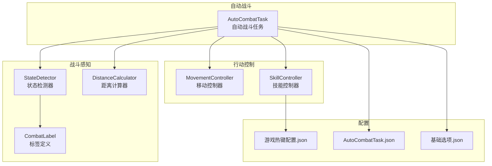
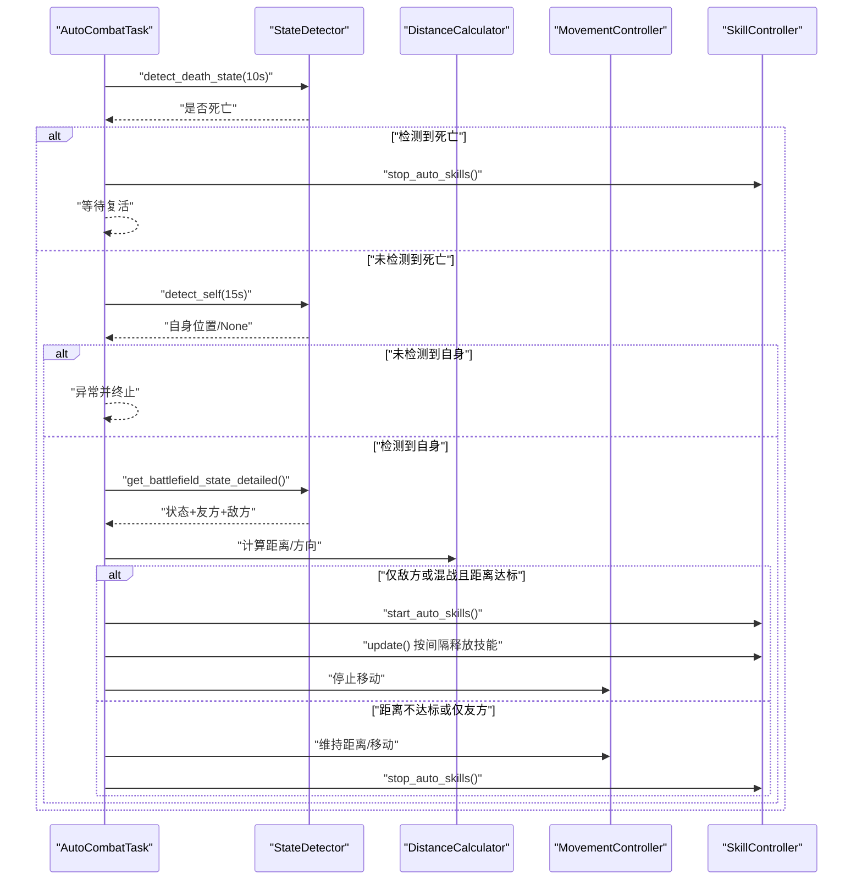
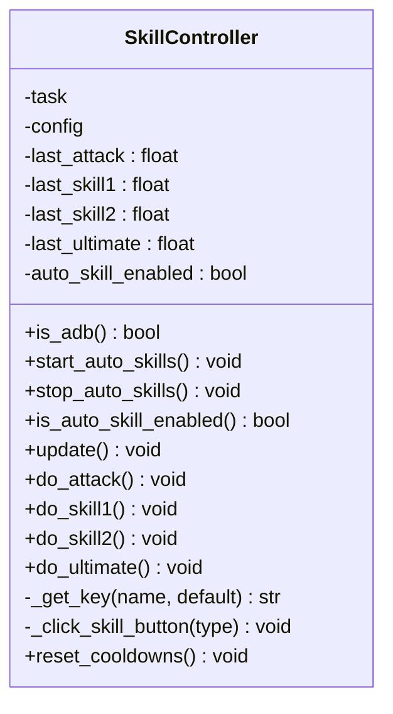
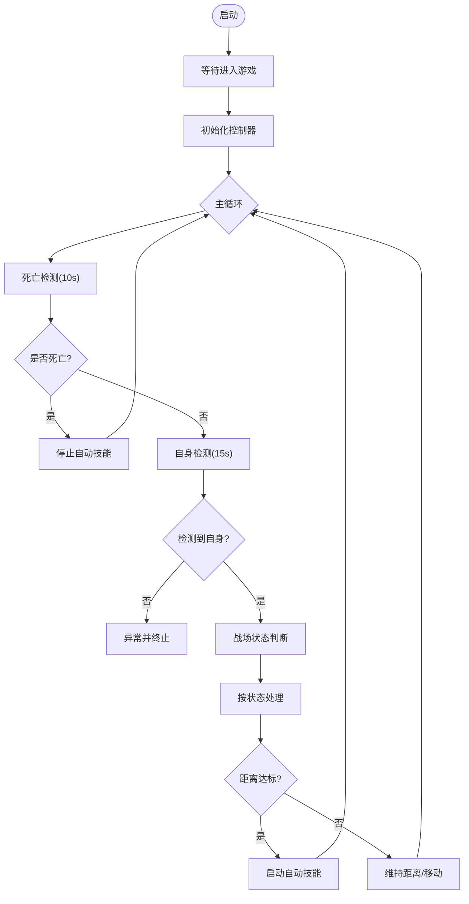
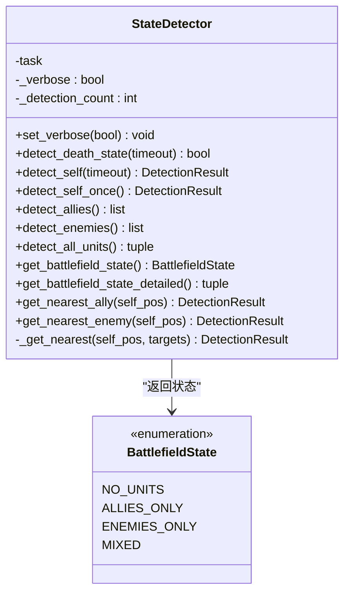
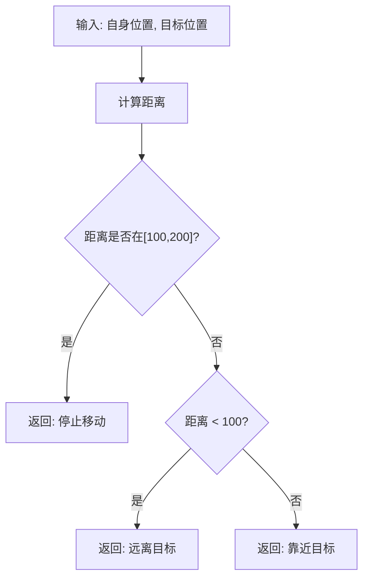
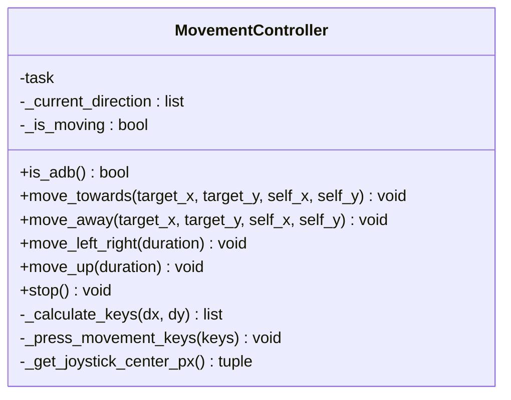
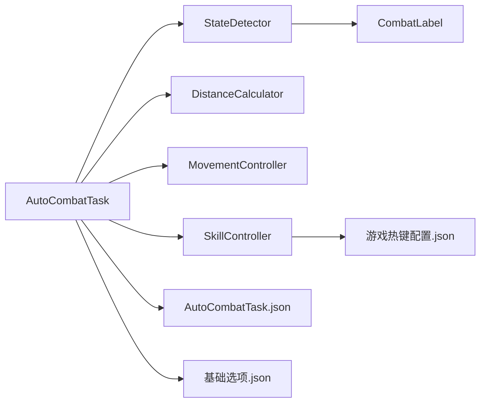

# 技能控制

<cite>
**本文引用的文件**
- [skill_controller.py](file://src/combat/skill_controller.py)
- [AutoCombatTask.py](file://src/task/AutoCombatTask.py)
- [state_detector.py](file://src/combat/state_detector.py)
- [distance_calculator.py](file://src/combat/distance_calculator.py)
- [movement_controller.py](file://src/combat/movement_controller.py)
- [labels.py](file://src/combat/labels.py)
- [游戏热键配置.json](file://configs/游戏热键配置.json)
- [AutoCombatTask.json](file://configs/AutoCombatTask.json)
- [基础选项.json](file://configs/基础选项.json)
- [BaseJumpTask.py](file://src/task/BaseJumpTask.py)
- [BackgroundManager.py](file://src/utils/BackgroundManager.py)
</cite>

## 目录
1. [简介](#简介)
2. [项目结构](#项目结构)
3. [核心组件](#核心组件)
4. [架构总览](#架构总览)
5. [详细组件分析](#详细组件分析)
6. [依赖关系分析](#依赖关系分析)
7. [性能考量](#性能考量)
8. [故障排查指南](#故障排查指南)
9. [结论](#结论)
10. [附录](#附录)

## 简介
本技术文档围绕“技能控制系统”展开，系统性阐述技能释放的决策逻辑、触发机制、冷却检测、目标选择策略、连携技能处理方式，以及智能释放算法、异常处理、配置项与扩展方法、失败调试与重试机制。该系统以自动战斗任务为核心入口，通过状态检测、距离计算与移动控制协同驱动技能释放，形成闭环的自动化战斗流程。

## 项目结构
技能控制相关代码主要位于以下模块：
- 自动战斗任务：负责整体流程编排与状态流转
- 技能控制器：封装技能释放、冷却计时与平台差异处理
- 状态检测器：基于YOLO模型识别自身、友方、敌方与死亡状态
- 距离计算器：提供距离计算与移动方向建议
- 移动控制器：封装PC端键盘与移动端触控的移动操作
- 标签定义：统一YOLO检测标签映射
- 配置系统：热键、战斗配置与基础选项

图表来源
- [AutoCombatTask.py:1-431](file://src/task/AutoCombatTask.py#L1-L431)
- [skill_controller.py:1-181](file://src/combat/skill_controller.py#L1-L181)
- [state_detector.py:1-315](file://src/combat/state_detector.py#L1-L315)
- [distance_calculator.py:1-139](file://src/combat/distance_calculator.py#L1-L139)
- [movement_controller.py:1-311](file://src/combat/movement_controller.py#L1-L311)
- [labels.py:1-51](file://src/combat/labels.py#L1-L51)
- [游戏热键配置.json:1-6](file://configs/游戏热键配置.json#L1-L6)
- [AutoCombatTask.json:1-13](file://configs/AutoCombatTask.json#L1-L13)
- [基础选项.json:1-11](file://configs/基础选项.json#L1-L11)

章节来源
- [AutoCombatTask.py:1-431](file://src/task/AutoCombatTask.py#L1-L431)
- [skill_controller.py:1-181](file://src/combat/skill_controller.py#L1-L181)
- [state_detector.py:1-315](file://src/combat/state_detector.py#L1-L315)
- [distance_calculator.py:1-139](file://src/combat/distance_calculator.py#L1-L139)
- [movement_controller.py:1-311](file://src/combat/movement_controller.py#L1-L311)
- [labels.py:1-51](file://src/combat/labels.py#L1-L51)
- [游戏热键配置.json:1-6](file://configs/游戏热键配置.json#L1-L6)
- [AutoCombatTask.json:1-13](file://configs/AutoCombatTask.json#L1-L13)
- [基础选项.json:1-11](file://configs/基础选项.json#L1-L11)

## 核心组件
- 技能控制器：负责技能释放、冷却计时、平台差异（PC/ADB）处理、按键映射与移动端点击。
- 自动战斗任务：主循环编排，按阶段执行死亡检测、自身检测、战场状态判断，并据此决定是否启动技能释放与移动。
- 状态检测器：基于YOLO模型检测自身、友方、敌方与死亡状态，提供最近目标选择能力。
- 距离计算器：提供距离计算、最佳攻击区间判断与移动方向建议。
- 移动控制器：封装PC端WASD移动与移动端虚拟摇杆滑动。
- 标签定义：统一YOLO类别映射，保证检测一致性。
- 配置系统：热键映射、战斗配置、基础选项与后台模式支持。

章节来源
- [skill_controller.py:12-181](file://src/combat/skill_controller.py#L12-L181)
- [AutoCombatTask.py:25-431](file://src/task/AutoCombatTask.py#L25-L431)
- [state_detector.py:23-315](file://src/combat/state_detector.py#L23-L315)
- [distance_calculator.py:10-139](file://src/combat/distance_calculator.py#L10-L139)
- [movement_controller.py:11-311](file://src/combat/movement_controller.py#L11-L311)
- [labels.py:8-51](file://src/combat/labels.py#L8-L51)
- [游戏热键配置.json:1-6](file://configs/游戏热键配置.json#L1-L6)
- [AutoCombatTask.json:39-50](file://configs/AutoCombatTask.json#L39-L50)
- [基础选项.json:1-11](file://configs/基础选项.json#L1-L11)

## 架构总览
技能控制的总体流程如下：
- 自动战斗任务启动后，先进行场景等待与分辨率更新，随后初始化各控制器。
- 主循环依次执行：死亡状态检测（持续10秒）、自身检测（超时15秒）、战场状态判断（四种情况）。
- 根据战场状态决定移动策略与技能释放策略：仅友方时跟随；仅敌方或混战时，保持100~200像素最佳距离，达标后启动自动技能。
- 技能控制器依据配置的间隔与冷却计时，周期性释放普通攻击、技能1、技能2与大招；在ADB模式下执行点击而非按键。

图表来源
- [AutoCombatTask.py:165-243](file://src/task/AutoCombatTask.py#L165-L243)
- [state_detector.py:62-152](file://src/combat/state_detector.py#L62-L152)
- [distance_calculator.py:35-104](file://src/combat/distance_calculator.py#L35-L104)
- [skill_controller.py:65-102](file://src/combat/skill_controller.py#L65-L102)

## 详细组件分析

### 技能控制器（SkillController）
职责与特性：
- 平台适配：自动识别PC或ADB模式，分别使用键盘按键或屏幕点击。
- 冷却管理：维护四类技能的上次释放时间，按配置间隔判定是否可释放。
- 智能释放：在自动技能启用时，周期性调用释放方法。
- 按键映射：从配置读取技能对应的按键，默认键位来自热键配置文件。
- 移动端点击：根据预设的相对坐标换算为绝对像素坐标后点击。

图表来源
- [skill_controller.py:12-181](file://src/combat/skill_controller.py#L12-L181)

章节来源
- [skill_controller.py:29-102](file://src/combat/skill_controller.py#L29-L102)
- [skill_controller.py:104-181](file://src/combat/skill_controller.py#L104-L181)

### 自动战斗任务（AutoCombatTask）
职责与特性：
- 流程编排：死亡检测（10秒）、自身检测（15秒）、战场状态判断、移动与技能释放。
- 配置驱动：默认配置含“测试模式”“详细日志”“各类技能间隔”，并支持从配置文件加载。
- 异常处理：捕获异常并记录帧信息，必要时终止并清理。
- 状态日志：按循环节拍输出状态摘要，便于调试。

图表来源
- [AutoCombatTask.py:71-243](file://src/task/AutoCombatTask.py#L71-L243)

章节来源
- [AutoCombatTask.py:33-128](file://src/task/AutoCombatTask.py#L33-L128)
- [AutoCombatTask.py:165-243](file://src/task/AutoCombatTask.py#L165-L243)

### 状态检测器（StateDetector）
职责与特性：
- 使用YOLO模型检测自身、友方、敌方与死亡状态，支持单次与多次检测。
- 提供最近目标选择（友方/敌方），用于距离计算与移动方向决策。
- 可设置详细日志模式，记录检测次数、位置与置信度。

图表来源
- [state_detector.py:23-315](file://src/combat/state_detector.py#L23-L315)

章节来源
- [state_detector.py:34-152](file://src/combat/state_detector.py#L34-L152)
- [state_detector.py:223-315](file://src/combat/state_detector.py#L223-L315)

### 距离计算器（DistanceCalculator）
职责与特性：
- 提供两点间距离计算与最佳攻击区间判断。
- 根据距离返回移动方向建议（靠近/远离/停止）。
- 提供单位向量与反向向量，用于移动控制。

图表来源
- [distance_calculator.py:35-104](file://src/combat/distance_calculator.py#L35-L104)

章节来源
- [distance_calculator.py:24-139](file://src/combat/distance_calculator.py#L24-L139)

### 移动控制器（MovementController）
职责与特性：
- PC端：根据方向计算按下对应键（WASD），支持八方向移动与停止。
- 移动端：通过虚拟摇杆滑动实现移动，支持上下左右与来回移动。
- 统一接口：对外暴露移动与停止方法，内部根据模式选择实现。

图表来源
- [movement_controller.py:11-311](file://src/combat/movement_controller.py#L11-L311)

章节来源
- [movement_controller.py:26-223](file://src/combat/movement_controller.py#L26-L223)
- [movement_controller.py:224-311](file://src/combat/movement_controller.py#L224-L311)

### 标签定义（CombatLabel）
职责与特性：
- 统一YOLO检测标签映射，包括自身、友方、敌方、死亡状态与目标圈。
- 提供标签名称查询方法，便于日志与调试。

章节来源
- [labels.py:8-51](file://src/combat/labels.py#L8-L51)

## 依赖关系分析
- AutoCombatTask 依赖 StateDetector、DistanceCalculator、MovementController、SkillController。
- SkillController 依赖配置系统（热键配置）与任务对象（发送按键/点击）。
- StateDetector 依赖 YOLO检测接口与 CombatLabel。
- MovementController 依赖任务对象（ADB模式下滑动）。
- 配置系统贯穿多个模块：AutoCombatTask.json、游戏热键配置.json、基础选项.json。

图表来源
- [AutoCombatTask.py:16-22](file://src/task/AutoCombatTask.py#L16-L22)
- [skill_controller.py:140-151](file://src/combat/skill_controller.py#L140-L151)
- [AutoCombatTask.json:1-13](file://configs/AutoCombatTask.json#L1-L13)
- [游戏热键配置.json:1-6](file://configs/游戏热键配置.json#L1-L6)
- [基础选项.json:1-11](file://configs/基础选项.json#L1-L11)

章节来源
- [AutoCombatTask.py:16-22](file://src/task/AutoCombatTask.py#L16-L22)
- [skill_controller.py:140-151](file://src/combat/skill_controller.py#L140-L151)

## 性能考量
- 检测频率与间隔：主循环每0.1秒一次，YOLO检测在关键步骤触发，避免高频重复检测造成性能压力。
- 距离计算：每次状态判断时进行距离计算，复杂度O(n)（n为目标数量），通常目标较少，开销可控。
- 技能释放：按配置间隔释放，减少无效按键/点击，降低误触概率。
- 后台模式：基础选项支持后台模式与静音，结合伪最小化减少窗口焦点切换带来的性能抖动。

[本节为通用性能讨论，无需特定文件引用]

## 故障排查指南
常见问题与处理：
- 自身检测超时：若15秒内未检测到自身，任务会记录帧信息并抛出异常。检查摄像头/截图权限、分辨率与缩放、YOLO模型可用性。
- 死亡状态持续：若10秒内持续检测到死亡状态，自动战斗会停止技能释放并等待复活，确认游戏内状态与检测阈值。
- 技能释放失败：检查热键配置是否正确、ADB模式下点击坐标是否匹配当前分辨率；查看技能冷却计时是否被重置。
- 距离判定异常：确认最佳攻击区间配置（100~200像素）与实际场景是否匹配；检查目标检测稳定性。
- 后台模式问题：若后台时窗口不在前台，可能影响截图与输入，检查基础选项中的后台模式与伪最小化设置。

章节来源
- [AutoCombatTask.py:190-242](file://src/task/AutoCombatTask.py#L190-L242)
- [state_detector.py:62-103](file://src/combat/state_detector.py#L62-L103)
- [skill_controller.py:175-181](file://src/combat/skill_controller.py#L175-L181)
- [基础选项.json:1-11](file://configs/基础选项.json#L1-L11)

## 结论
技能控制系统通过“状态检测—距离计算—移动控制—技能释放”的闭环设计，实现了在不同战场状态下的智能释放与连携策略。系统具备良好的可配置性与扩展性，支持PC与移动端两种模式，同时提供完善的异常处理与调试日志，便于在复杂场景中稳定运行。

[本节为总结性内容，无需特定文件引用]

## 附录

### 技能类型与释放时机控制
- 普通攻击：按配置间隔周期性释放，适用于持续输出与连击。
- 技能1/技能2/大招：按各自间隔释放，通常在距离达标后启动，避免无效释放。
- 连携技能：系统未内置特定连携序列，但可通过配置不同技能间隔与顺序实现类似效果；也可在任务层扩展自定义序列。

章节来源
- [skill_controller.py:77-102](file://src/combat/skill_controller.py#L77-L102)
- [AutoCombatTask.py:372-382](file://src/task/AutoCombatTask.py#L372-L382)

### 技能冷却检测与重置
- 冷却检测：技能控制器维护四类技能的上次释放时间，按当前时间减去上次释放时间与配置间隔比较。
- 重置机制：提供重置冷却计时的方法，可在异常或场景切换时调用。

章节来源
- [skill_controller.py:40-48](file://src/combat/skill_controller.py#L40-L48)
- [skill_controller.py:175-181](file://src/combat/skill_controller.py#L175-L181)

### 目标选择策略
- 最近目标：状态检测器提供最近友方与最近敌方的选择，用于距离计算与移动方向决策。
- 多目标场景：当存在多个目标时，优先选择最近者，避免误判。

章节来源
- [state_detector.py:257-315](file://src/combat/state_detector.py#L257-L315)

### 智能释放算法
- 距离优先：仅在最佳攻击区间内启动技能，区间外仅移动调整位置。
- 状态驱动：仅在存在敌方时启用技能释放，避免无意义的技能消耗。
- 平台适配：PC端按键、ADB端点击，按键映射来自热键配置。

章节来源
- [AutoCombatTask.py:372-382](file://src/task/AutoCombatTask.py#L372-L382)
- [distance_calculator.py:67-104](file://src/combat/distance_calculator.py#L67-L104)
- [skill_controller.py:104-138](file://src/combat/skill_controller.py#L104-L138)

### 配置选项与自定义扩展
- 技能配置（AutoCombatTask.json）：包含“测试模式”“详细日志”“各类技能间隔”等。
- 热键配置（游戏热键配置.json）：普通攻击、技能1、技能2、大招的按键映射。
- 基础选项（基础选项.json）：后台模式、静音、最小化伪最小化等。
- 扩展方法：可在任务层增加新的技能序列逻辑，或在技能控制器中扩展新的技能类型与释放策略。

章节来源
- [AutoCombatTask.json:1-13](file://configs/AutoCombatTask.json#L1-L13)
- [游戏热键配置.json:1-6](file://configs/游戏热键配置.json#L1-L6)
- [基础选项.json:1-11](file://configs/基础选项.json#L1-L11)
- [AutoCombatTask.py:39-50](file://src/task/AutoCombatTask.py#L39-L50)

### 异常情况处理与调试
- 死亡检测：持续10秒，检测到即停止技能并等待复活。
- 自身检测：超时15秒，记录帧信息并抛出异常。
- 日志与可视化：详细日志模式下输出检测次数、位置、距离与状态摘要，便于定位问题。
- 后台模式：结合伪最小化与静音，减少后台干扰。

章节来源
- [state_detector.py:62-103](file://src/combat/state_detector.py#L62-L103)
- [AutoCombatTask.py:210-242](file://src/task/AutoCombatTask.py#L210-L242)
- [BackgroundManager.py:18-82](file://src/utils/BackgroundManager.py#L18-L82)