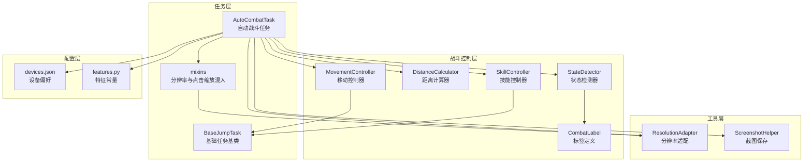
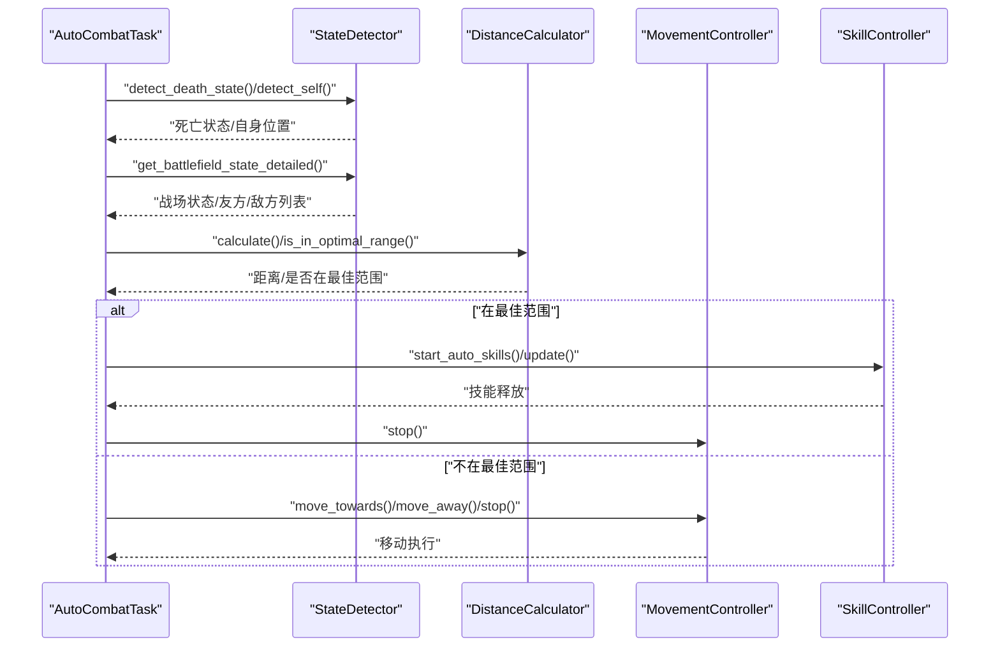
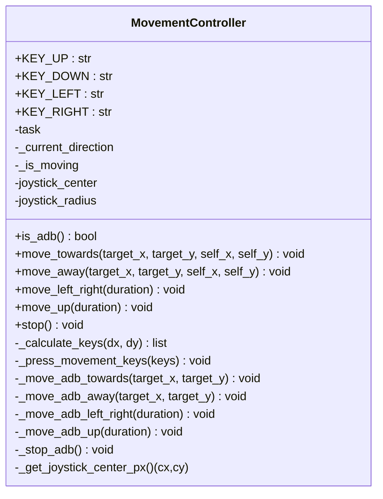
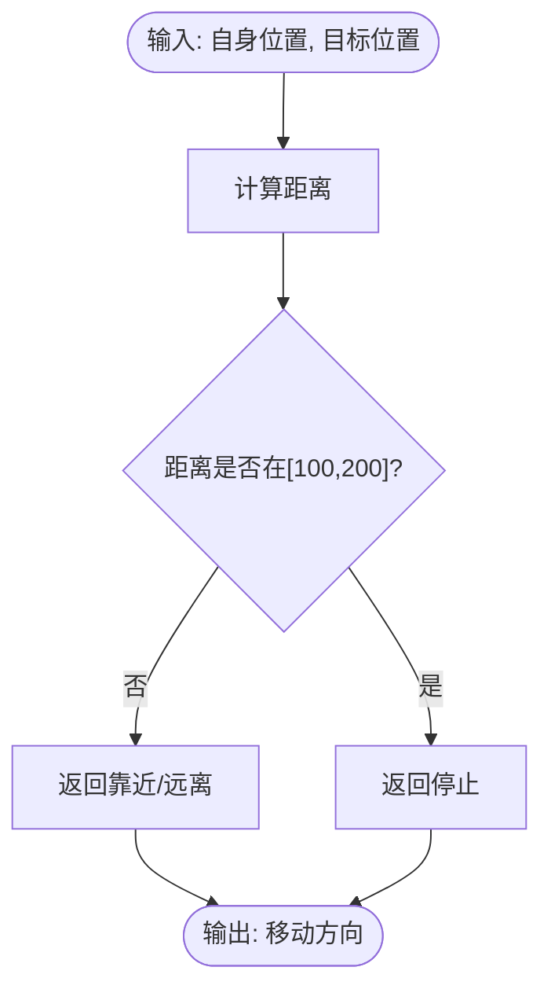
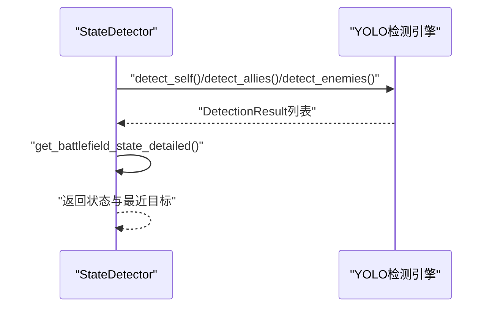
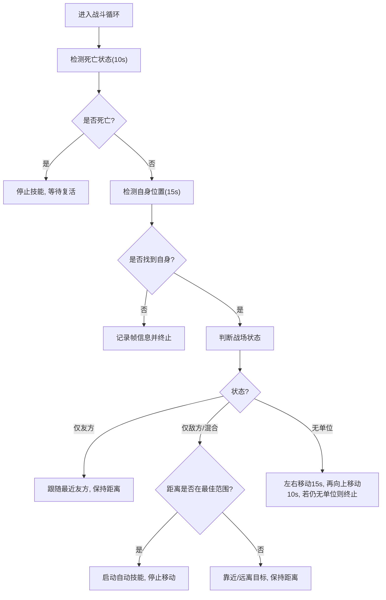
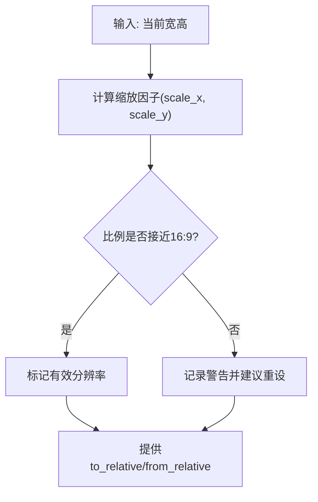
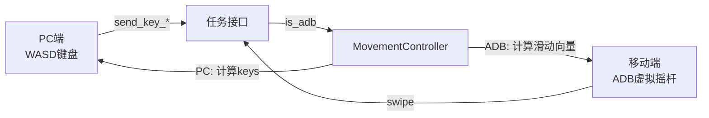
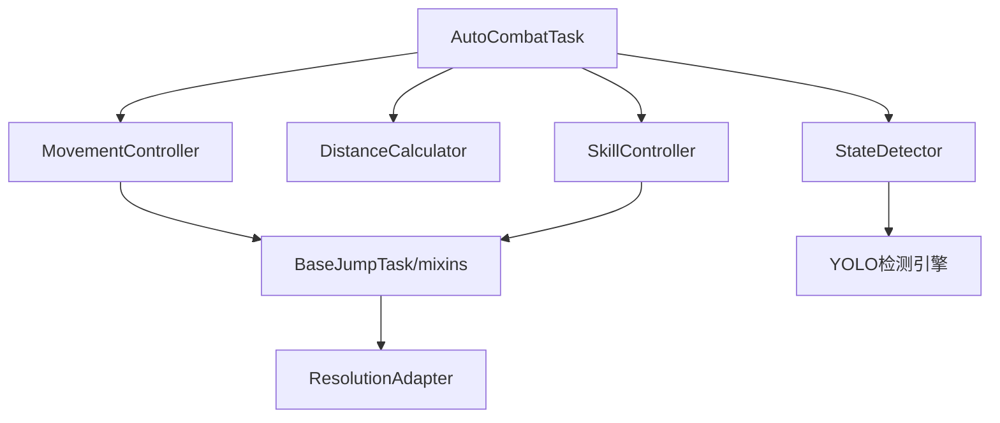

# 移动控制

<cite>
**本文引用的文件**
- [movement_controller.py](file://src/combat/movement_controller.py)
- [distance_calculator.py](file://src/combat/distance_calculator.py)
- [state_detector.py](file://src/combat/state_detector.py)
- [labels.py](file://src/combat/labels.py)
- [AutoCombatTask.py](file://src/task/AutoCombatTask.py)
- [BaseJumpTask.py](file://src/task/BaseJumpTask.py)
- [mixins.py](file://src/task/mixins.py)
- [ResolutionAdapter.py](file://src/utils/ResolutionAdapter.py)
- [ScreenshotHelper.py](file://src/utils/ScreenshotHelper.py)
- [devices.json](file://configs/devices.json)
- [features.py](file://src/constants/features.py)
</cite>

## 目录
1. [简介](#简介)
2. [项目结构](#项目结构)
3. [核心组件](#核心组件)
4. [架构总览](#架构总览)
5. [详细组件分析](#详细组件分析)
6. [依赖分析](#依赖分析)
7. [性能考虑](#性能考虑)
8. [故障排查指南](#故障排查指南)
9. [结论](#结论)
10. [附录](#附录)

## 简介
本文件面向移动控制系统，围绕自动战斗中的“移动控制”子系统，系统性阐述以下内容：
- 移动控制算法的实现原理：基于检测结果的位置计算与移动决策
- 平台适配机制：PC端WASD键盘与移动端ADB虚拟摇杆
- 移动速度控制、方向判断与路径规划策略
- 坐标系转换、分辨率适配与输入延迟处理
- 最佳实践、性能优化建议与常见异常排查

## 项目结构
移动控制相关的核心代码位于 src/combat 与 src/task 两个目录，配合 src/utils 的分辨率适配工具与 src/constants 的特征常量，形成“检测—决策—执行”的闭环。

**图表来源**
- [AutoCombatTask.py:1-431](file://src/task/AutoCombatTask.py#L1-L431)
- [BaseJumpTask.py:1-295](file://src/task/BaseJumpTask.py#L1-L295)
- [mixins.py:135-217](file://src/task/mixins.py#L135-L217)
- [state_detector.py:1-315](file://src/combat/state_detector.py#L1-L315)
- [distance_calculator.py:1-139](file://src/combat/distance_calculator.py#L1-L139)
- [movement_controller.py:1-311](file://src/combat/movement_controller.py#L1-L311)
- [skill_controller.py:1-180](file://src/combat/skill_controller.py#L1-L180)
- [labels.py:1-51](file://src/combat/labels.py#L1-L51)
- [ResolutionAdapter.py:1-163](file://src/utils/ResolutionAdapter.py#L1-L163)
- [ScreenshotHelper.py:1-68](file://src/utils/ScreenshotHelper.py#L1-L68)
- [devices.json:1-7](file://configs/devices.json#L1-L7)
- [features.py:1-86](file://src/constants/features.py#L1-L86)

**章节来源**
- [AutoCombatTask.py:1-431](file://src/task/AutoCombatTask.py#L1-L431)
- [BaseJumpTask.py:1-295](file://src/task/BaseJumpTask.py#L1-L295)
- [mixins.py:135-217](file://src/task/mixins.py#L135-L217)
- [ResolutionAdapter.py:1-163](file://src/utils/ResolutionAdapter.py#L1-L163)

## 核心组件
- 移动控制器（MovementController）：负责根据目标与自身位置计算方向，下发PC端WASD按键或移动端ADB滑动指令；支持“靠近/远离/停止”三种移动模式。
- 距离计算器（DistanceCalculator）：提供两点距离计算、最佳攻击距离区间判断、移动方向建议与单位向量获取。
- 状态检测器（StateDetector）：通过YOLO模型检测自身、友方、敌方与死亡状态，输出战场状态与最近目标。
- 自动战斗任务（AutoCombatTask）：编排检测、决策与执行流程，驱动移动与技能控制。
- 分辨率适配（ResolutionAdapter）：提供相对坐标与绝对坐标的双向转换，保障多分辨率一致性。
- 技能控制器（SkillController）：与移动控制协同，距离达标时启动自动技能释放。

**章节来源**
- [movement_controller.py:1-311](file://src/combat/movement_controller.py#L1-L311)
- [distance_calculator.py:1-139](file://src/combat/distance_calculator.py#L1-L139)
- [state_detector.py:1-315](file://src/combat/state_detector.py#L1-L315)
- [AutoCombatTask.py:1-431](file://src/task/AutoCombatTask.py#L1-L431)
- [ResolutionAdapter.py:1-163](file://src/utils/ResolutionAdapter.py#L1-L163)
- [skill_controller.py:1-180](file://src/combat/skill_controller.py#L1-L180)

## 架构总览
移动控制的执行链路如下：
- AutoCombatTask 主循环中先进行死亡状态检测与自身定位，再判断战场状态（无单位/仅友方/仅敌方/混合），依据距离计算器给出的方向建议，调用移动控制器执行移动；当距离达到最佳范围时，由技能控制器启动自动技能释放。

**图表来源**
- [AutoCombatTask.py:165-430](file://src/task/AutoCombatTask.py#L165-L430)
- [state_detector.py:62-221](file://src/combat/state_detector.py#L62-L221)
- [distance_calculator.py:35-139](file://src/combat/distance_calculator.py#L35-L139)
- [movement_controller.py:45-104](file://src/combat/movement_controller.py#L45-L104)
- [skill_controller.py:53-103](file://src/combat/skill_controller.py#L53-L103)

## 详细组件分析

### 移动控制器（MovementController）
- 平台检测：通过任务对象的 is_adb 方法判断是否为ADB模式，从而选择PC键盘或ADB滑动。
- 方向计算（PC端）：以屏幕中心为参考，计算目标与自身的dx/dy，使用角度阈值映射到WASD四键组合，避免同时按下多个键造成冲突。
- 移动模式：
  - 靠近目标：计算朝向并按下对应键
  - 远离目标：计算反向朝向并按下对应键
  - 左右来回/向上移动：用于搜索与定位
  - 停止：释放所有移动键
- ADB模式（移动端）：以屏幕左下虚拟摇杆为中心，计算单位向量并按半径缩放后执行滑动，滑动结束后自动停止。

**图表来源**
- [movement_controller.py:11-311](file://src/combat/movement_controller.py#L11-L311)

**章节来源**
- [movement_controller.py:41-104](file://src/combat/movement_controller.py#L41-L104)
- [movement_controller.py:170-223](file://src/combat/movement_controller.py#L170-L223)
- [movement_controller.py:237-310](file://src/combat/movement_controller.py#L237-L310)

### 距离计算器（DistanceCalculator）
- 提供两点间距离计算与最佳攻击距离区间判断（默认100~200像素）
- 根据距离返回“靠近/远离/停止”的移动方向建议
- 提供从自身到目标的单位向量与反向单位向量，便于路径规划与平滑移动

**图表来源**
- [distance_calculator.py:35-104](file://src/combat/distance_calculator.py#L35-L104)

**章节来源**
- [distance_calculator.py:24-104](file://src/combat/distance_calculator.py#L24-L104)

### 状态检测器（StateDetector）
- 使用YOLO模型检测自身、友方、敌方与死亡状态，支持单次检测与循环检测
- 提供战场状态枚举（无单位/仅友方/仅敌方/混合）与最近目标查询
- 详细日志模式下输出检测次数、位置与置信度，便于调试

**图表来源**
- [state_detector.py:105-221](file://src/combat/state_detector.py#L105-L221)
- [labels.py:8-51](file://src/combat/labels.py#L8-L51)

**章节来源**
- [state_detector.py:62-221](file://src/combat/state_detector.py#L62-L221)
- [labels.py:8-51](file://src/combat/labels.py#L8-L51)

### 自动战斗任务（AutoCombatTask）
- 主循环：死亡状态检测（10秒）、自身检测（15秒）、战场状态判断、移动与技能控制
- 距离维持策略：根据距离计算器的建议，调用移动控制器执行靠近/远离/停止
- 搜索与定位：在无单位场景下，先左右移动搜索，再向上移动扩展视野，若仍无单位则报错终止

**图表来源**
- [AutoCombatTask.py:165-430](file://src/task/AutoCombatTask.py#L165-L430)
- [distance_calculator.py:67-104](file://src/combat/distance_calculator.py#L67-L104)
- [movement_controller.py:45-104](file://src/combat/movement_controller.py#L45-L104)
- [skill_controller.py:53-103](file://src/combat/skill_controller.py#L53-L103)

**章节来源**
- [AutoCombatTask.py:165-430](file://src/task/AutoCombatTask.py#L165-L430)

### 分辨率适配与坐标转换（ResolutionAdapter）
- 提供相对坐标与绝对坐标的双向转换，支持矩形框缩放
- 检查当前分辨率与16:9比例的匹配度，给出推荐重设尺寸
- 与任务混入结合，实现点击与区域检测的跨分辨率一致性

**图表来源**
- [ResolutionAdapter.py:34-120](file://src/utils/ResolutionAdapter.py#L34-L120)
- [mixins.py:135-217](file://src/task/mixins.py#L135-L217)

**章节来源**
- [ResolutionAdapter.py:1-163](file://src/utils/ResolutionAdapter.py#L1-L163)
- [mixins.py:135-217](file://src/task/mixins.py#L135-L217)

### 平台适配机制（PC端WASD vs 移动端ADB）
- PC端：通过任务对象的 send_key/send_key_down/send_key_up 接口下发WASD按键
- 移动端：通过任务对象的 swipe 接口在虚拟摇杆区域内滑动，滑动方向由单位向量决定，滑动长度按摇杆半径缩放
- 设备偏好：通过 devices.json 指定首选设备类型与捕获方式，影响任务的输入行为

**图表来源**
- [movement_controller.py:41-44](file://src/combat/movement_controller.py#L41-L44)
- [movement_controller.py:170-204](file://src/combat/movement_controller.py#L170-L204)
- [movement_controller.py:237-261](file://src/combat/movement_controller.py#L237-L261)
- [devices.json:1-7](file://configs/devices.json#L1-L7)

**章节来源**
- [movement_controller.py:41-44](file://src/combat/movement_controller.py#L41-L44)
- [movement_controller.py:237-261](file://src/combat/movement_controller.py#L237-L261)
- [devices.json:1-7](file://configs/devices.json#L1-L7)

## 依赖分析
- 组件耦合
  - AutoCombatTask 依赖 StateDetector、DistanceCalculator、MovementController、SkillController
  - MovementController 与 SkillController 依赖任务对象提供的输入接口（send_key、swipe、click）
  - ResolutionAdapter 通过混入在任务层被广泛使用，保证坐标一致性
- 外部依赖
  - YOLO检测引擎（通过 og.my_app.yolo_detect）用于单位检测
  - 图像采集与OCR能力（通过任务基类与混入）

**图表来源**
- [AutoCombatTask.py:16-22](file://src/task/AutoCombatTask.py#L16-L22)
- [state_detector.py:89-93](file://src/combat/state_detector.py#L89-L93)
- [mixins.py:135-217](file://src/task/mixins.py#L135-L217)

**章节来源**
- [AutoCombatTask.py:16-22](file://src/task/AutoCombatTask.py#L16-L22)
- [state_detector.py:89-93](file://src/combat/state_detector.py#L89-L93)
- [mixins.py:135-217](file://src/task/mixins.py#L135-L217)

## 性能考虑
- 检测频率与循环节拍
  - AutoCombatTask 主循环每轮sleep约0.1秒，YOLO检测在必要步骤中进行，避免不必要的重复检测
- 输入延迟与稳定性
  - PC端：按键按下与释放成对出现，避免长按导致的持续移动；移动方向变更时先释放旧键再按新键
  - ADB端：滑动时长固定且较短，减少滑动惯性带来的误判
- 距离与方向计算
  - 使用单位向量与阈值判断，降低浮点误差累积；最佳距离区间避免频繁启停
- 分辨率适配
  - 通过相对坐标与缩放因子统一不同分辨率下的操作区域，减少因分辨率变化导致的误触与偏差

[本节为通用指导，无需列出具体文件来源]

## 故障排查指南
- 自身检测超时
  - 现象：15秒内未检测到自身位置，任务抛出异常并记录帧信息
  - 排查：确认截图可用性、YOLO模型加载、标签配置正确；查看详细日志中的检测次数与置信度
  - 参考
    - [AutoCombatTask.py:209-220](file://src/task/AutoCombatTask.py#L209-L220)
    - [state_detector.py:105-152](file://src/combat/state_detector.py#L105-L152)
- 无单位搜索超时
  - 现象：25秒内未检测到任何单位，任务终止
  - 排查：检查摇杆区域与滑动半径配置；确认ADB连接与权限
  - 参考
    - [AutoCombatTask.py:299-338](file://src/task/AutoCombatTask.py#L299-L338)
- 死亡状态检测持续触发
  - 现象：10秒内多次检测到死亡状态
  - 排查：确认死亡标签配置；检查帧采样与置信度阈值
  - 参考
    - [state_detector.py:62-103](file://src/combat/state_detector.py#L62-L103)
- 分辨率不匹配
  - 现象：点击位置偏移、识别不稳定
  - 排查：使用分辨率适配工具检查比例与推荐尺寸；在任务中启用缩放接口
  - 参考
    - [ResolutionAdapter.py:107-143](file://src/utils/ResolutionAdapter.py#L107-L143)
    - [mixins.py:135-217](file://src/task/mixins.py#L135-L217)
- 截图与保存
  - 建议：在异常时保存截图与特征模板，辅助定位问题
  - 参考
    - [ScreenshotHelper.py:17-44](file://src/utils/ScreenshotHelper.py#L17-L44)

**章节来源**
- [AutoCombatTask.py:209-220](file://src/task/AutoCombatTask.py#L209-L220)
- [AutoCombatTask.py:299-338](file://src/task/AutoCombatTask.py#L299-L338)
- [state_detector.py:62-103](file://src/combat/state_detector.py#L62-L103)
- [ResolutionAdapter.py:107-143](file://src/utils/ResolutionAdapter.py#L107-L143)
- [mixins.py:135-217](file://src/task/mixins.py#L135-L217)
- [ScreenshotHelper.py:17-44](file://src/utils/ScreenshotHelper.py#L17-L44)

## 结论
移动控制系统通过“检测—决策—执行”的清晰分层，实现了跨平台的一致行为：PC端以WASD精确控制，移动端以ADB虚拟摇杆稳定滑动。配合距离计算器与分辨率适配工具，系统在多分辨率与多场景下具备良好的鲁棒性。建议在实际部署中关注输入延迟、检测稳定性与异常处理，以获得更流畅的自动战斗体验。

[本节为总结性内容，无需列出具体文件来源]

## 附录
- 最佳实践
  - 在移动前先释放旧方向键，避免按键冲突
  - 使用最佳距离区间（100~200像素）减少频繁启停
  - ADB滑动采用固定时长与半径缩放，提升稳定性
  - 启用详细日志与截图保存，便于问题定位
- 性能优化建议
  - 合理设置技能释放间隔，避免频繁输入造成卡顿
  - 在高分辨率下优先使用推荐尺寸，减少缩放计算开销
  - 将YOLO检测与移动控制解耦，仅在必要时进行检测

[本节为通用指导，无需列出具体文件来源]