# 自动战斗系统

<cite>
**本文档引用的文件**
- [AutoCombatTask.py](file://src/task/AutoCombatTask.py)
- [state_detector.py](file://src/combat/state_detector.py)
- [movement_controller.py](file://src/combat/movement_controller.py)
- [skill_controller.py](file://src/combat/skill_controller.py)
- [distance_calculator.py](file://src/combat/distance_calculator.py)
- [labels.py](file://src/combat/labels.py)
- [OnnxYolo8Detect.py](file://src/OnnxYolo8Detect.py)
- [globals.py](file://src/globals.py)
- [ScreenshotHelper.py](file://src/utils/ScreenshotHelper.py)
- [requirements.txt](file://requirements.txt)
- [AutoCombatTask.json](file://configs/AutoCombatTask.json)
- [BaseJumpTask.py](file://src/task/BaseJumpTask.py)
</cite>

## 目录
1. [简介](#简介)
2. [项目结构](#项目结构)
3. [核心组件](#核心组件)
4. [架构概览](#架构概览)
5. [详细组件分析](#详细组件分析)
6. [依赖关系分析](#依赖关系分析)
7. [性能考虑](#性能考虑)
8. [故障排除指南](#故障排除指南)
9. [结论](#结论)
10. [附录](#附录)

## 简介

自动战斗系统是一个基于计算机视觉的智能战斗辅助系统，专为游戏自动化设计。该系统通过YOLOv8目标检测技术实现场景分析、单位识别和战斗决策，支持PC端键盘控制和移动端ADB控制两种模式。

系统采用模块化设计，包含战斗状态检测、移动控制、技能释放和距离计算四大核心模块，通过统一的状态机实现智能化的战斗策略执行。经过大幅增强后，系统现在具备完整的战斗AI逻辑，能够根据战场状态动态调整战斗策略。

## 项目结构

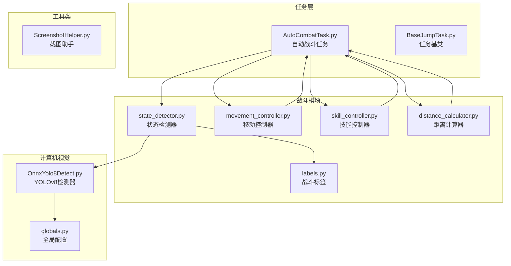

**图表来源**
- [AutoCombatTask.py:1-639](file://src/task/AutoCombatTask.py#L1-L639)
- [state_detector.py:1-446](file://src/combat/state_detector.py#L1-L446)
- [OnnxYolo8Detect.py:1-311](file://src/OnnxYolo8Detect.py#L1-L311)

**章节来源**
- [AutoCombatTask.py:1-639](file://src/task/AutoCombatTask.py#L1-L639)
- [requirements.txt:1-13](file://requirements.txt#L1-L13)

## 核心组件

### 战斗状态检测器
负责实时监控战场环境，通过YOLOv8模型检测玩家、友方单位、敌方单位和死亡状态。系统现在支持并行死亡监控线程，能够快速响应死亡状态变化。

### 移动控制器
实现跨平台的移动控制逻辑，支持PC端WASD键盘和移动端虚拟摇杆操作。新增了后台输入支持，能够在游戏窗口最小化时继续发送按键。

### 技能控制器
管理技能释放策略，支持普通攻击、技能1、技能2和终极技能的自动释放。技能释放严格遵循GUI配置，支持后台模式下的按键发送。

### 距离计算器
提供精确的距离计算和最优位置判断，确保战斗单位保持在最佳攻击范围内。支持多种移动策略：靠近、远离或停止。

**章节来源**
- [state_detector.py:23-446](file://src/combat/state_detector.py#L23-L446)
- [movement_controller.py:11-447](file://src/combat/movement_controller.py#L11-L447)
- [skill_controller.py:12-349](file://src/combat/skill_controller.py#L12-L349)
- [distance_calculator.py:10-139](file://src/combat/distance_calculator.py#L10-L139)

## 架构概览

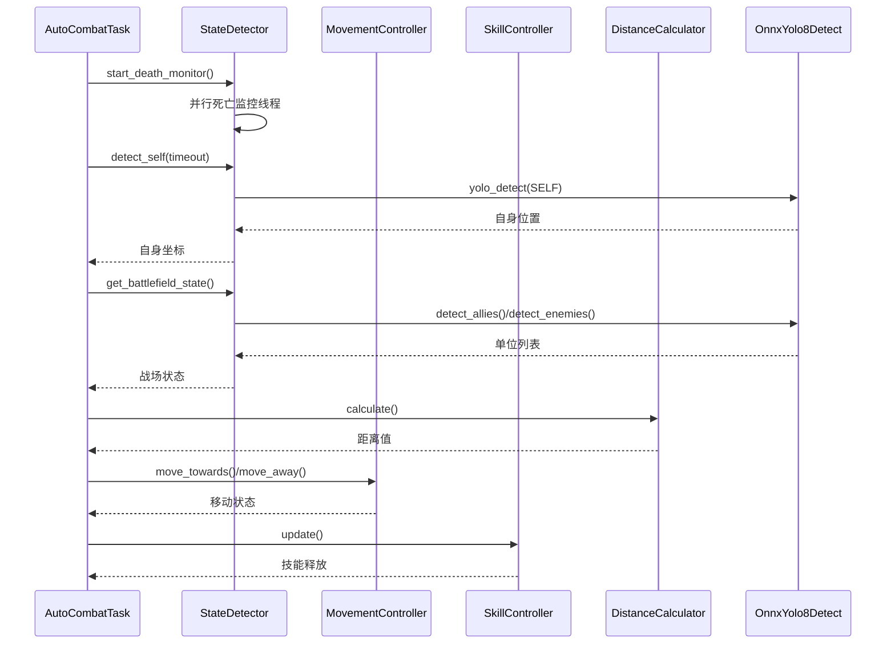

**图表来源**
- [AutoCombatTask.py:191-265](file://src/task/AutoCombatTask.py#L191-L265)
- [state_detector.py:72-185](file://src/combat/state_detector.py#L72-L185)
- [OnnxYolo8Detect.py:230-254](file://src/OnnxYolo8Detect.py#L230-L254)

## 详细组件分析

### 战斗状态检测算法

#### 战场状态枚举设计
系统定义了四种基本战场状态，为战斗决策提供明确的输入条件：

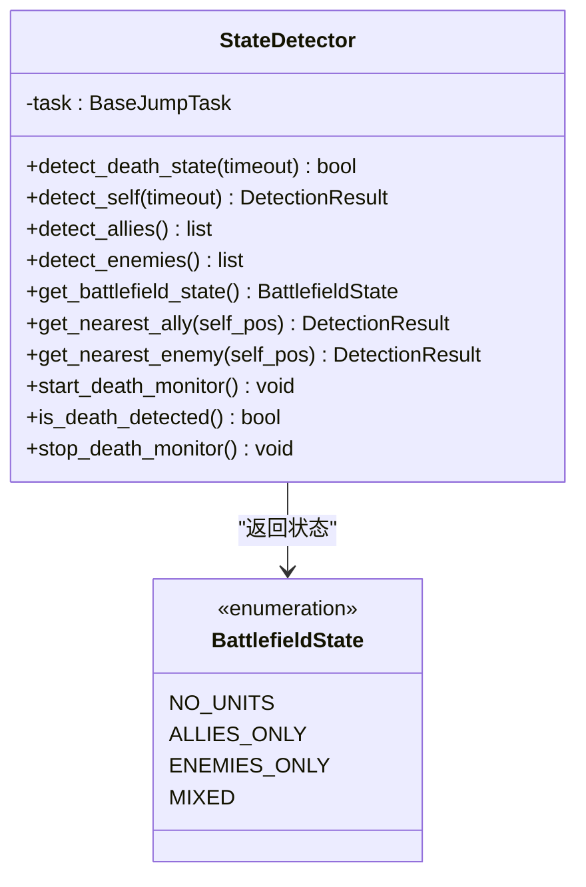

**图表来源**
- [state_detector.py:15-21](file://src/combat/state_detector.py#L15-L21)
- [state_detector.py:23-446](file://src/combat/state_detector.py#L23-L446)

#### 死亡状态检测机制
系统现在提供两种死亡检测方式：并行监控和同步检测。并行监控使用独立线程持续检测死亡状态，响应速度更快：

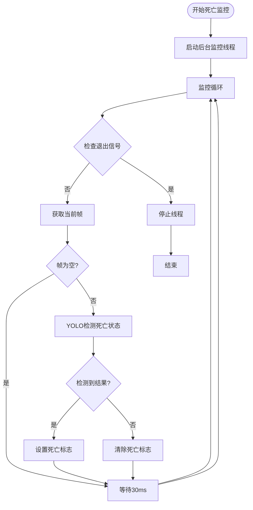

**图表来源**
- [state_detector.py:118-185](file://src/combat/state_detector.py#L118-L185)

**章节来源**
- [state_detector.py:72-185](file://src/combat/state_detector.py#L72-L185)
- [state_detector.py:194-214](file://src/combat/state_detector.py#L194-L214)

### 移动控制策略

#### 跨平台移动控制架构
系统支持PC端和移动端两种控制模式，通过统一的接口实现。新增了后台输入支持，能够在游戏窗口最小化时继续发送按键：

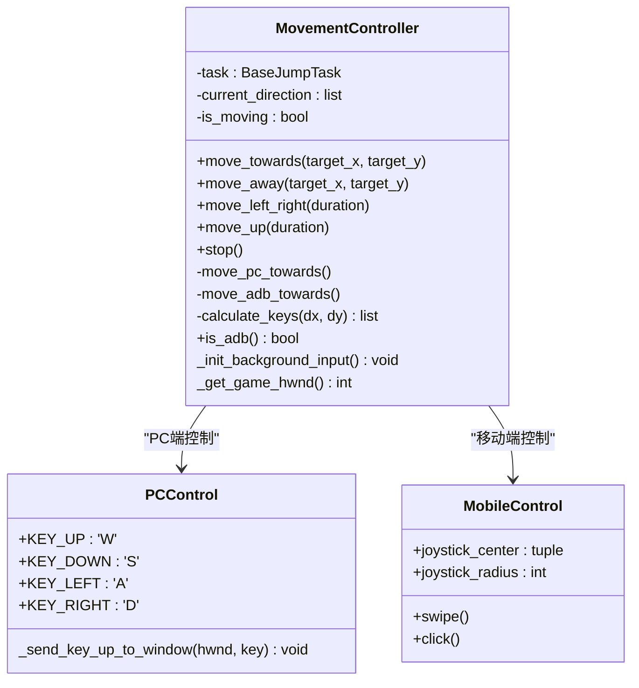

**图表来源**
- [movement_controller.py:11-447](file://src/combat/movement_controller.py#L11-L447)

#### 方向计算算法
基于八方向移动设计，实现精确的方向控制。系统现在支持更精细的按键组合：

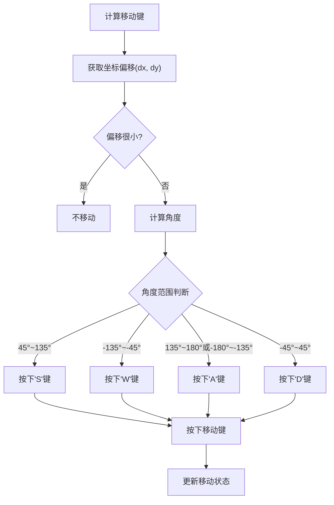

**图表来源**
- [movement_controller.py:242-292](file://src/combat/movement_controller.py#L242-L292)

**章节来源**
- [movement_controller.py:45-104](file://src/combat/movement_controller.py#L45-L104)
- [movement_controller.py:242-292](file://src/combat/movement_controller.py#L242-L292)

### 技能释放机制

#### 技能冷却管理系统
实现多技能的独立冷却控制和自动释放策略。技能释放严格遵循GUI配置，支持后台模式：

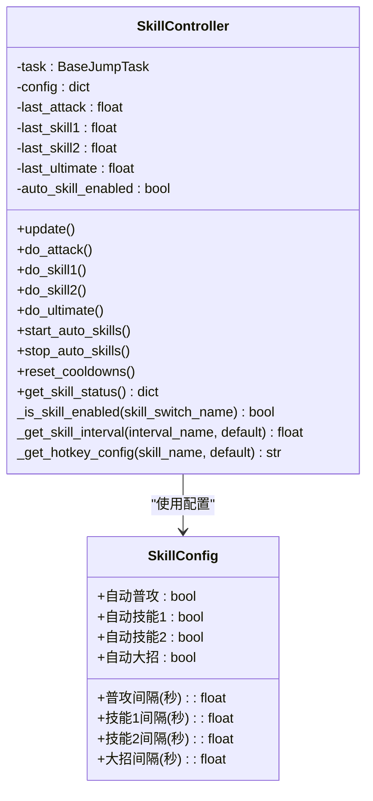

**图表来源**
- [skill_controller.py:12-349](file://src/combat/skill_controller.py#L12-L349)

#### 技能释放决策流程
基于距离和状态的智能技能释放策略。系统现在支持更精细的技能状态管理：

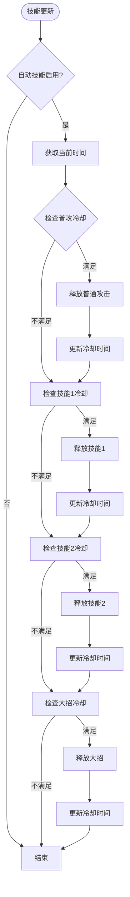

**图表来源**
- [skill_controller.py:213-252](file://src/combat/skill_controller.py#L213-L252)

**章节来源**
- [skill_controller.py:213-252](file://src/combat/skill_controller.py#L213-L252)
- [skill_controller.py:314-349](file://src/combat/skill_controller.py#L314-L349)

### 距离计算逻辑

#### 最优攻击距离模型
建立基于像素距离的战斗策略基础。系统现在提供更精确的距离计算和移动策略：

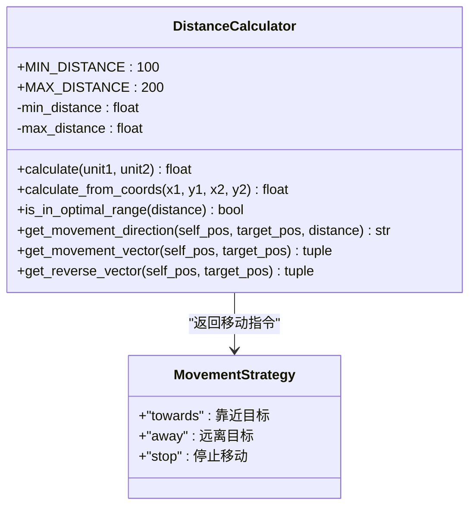

**图表来源**
- [distance_calculator.py:10-139](file://src/combat/distance_calculator.py#L10-L139)

#### 距离决策算法
基于最优距离范围的动态移动策略。系统现在支持更精确的移动控制：

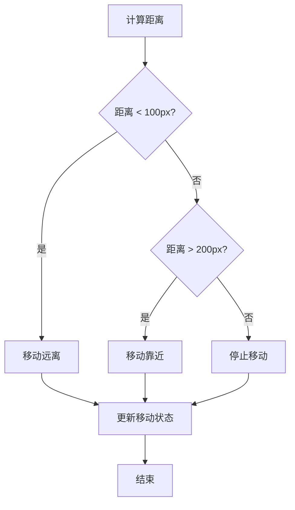

**图表来源**
- [distance_calculator.py:79-104](file://src/combat/distance_calculator.py#L79-L104)

**章节来源**
- [distance_calculator.py:67-104](file://src/combat/distance_calculator.py#L67-L104)
- [distance_calculator.py:106-139](file://src/combat/distance_calculator.py#L106-L139)

### 战斗标签系统和状态枚举

#### YOLO标签映射体系
建立标准化的战斗单位识别标签。系统现在支持5种不同的战斗标签：

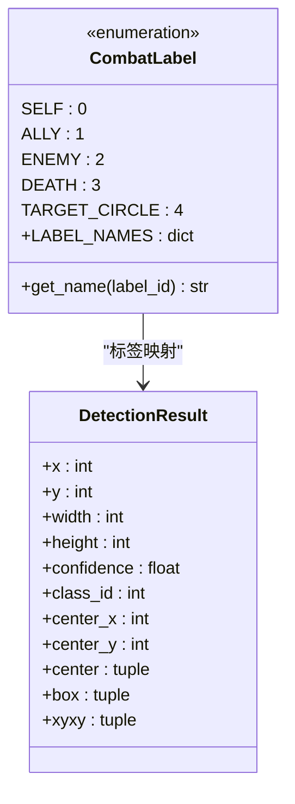

**图表来源**
- [labels.py:8-51](file://src/combat/labels.py#L8-L51)
- [OnnxYolo8Detect.py:257-311](file://src/OnnxYolo8Detect.py#L257-L311)

**章节来源**
- [labels.py:15-37](file://src/combat/labels.py#L15-L37)
- [OnnxYolo8Detect.py:257-311](file://src/OnnxYolo8Detect.py#L257-L311)

### 计算机视觉应用

#### YOLOv8检测器实现
集成高性能目标检测模型，支持GPU加速和后台模式。系统现在提供更完善的错误处理和性能优化：

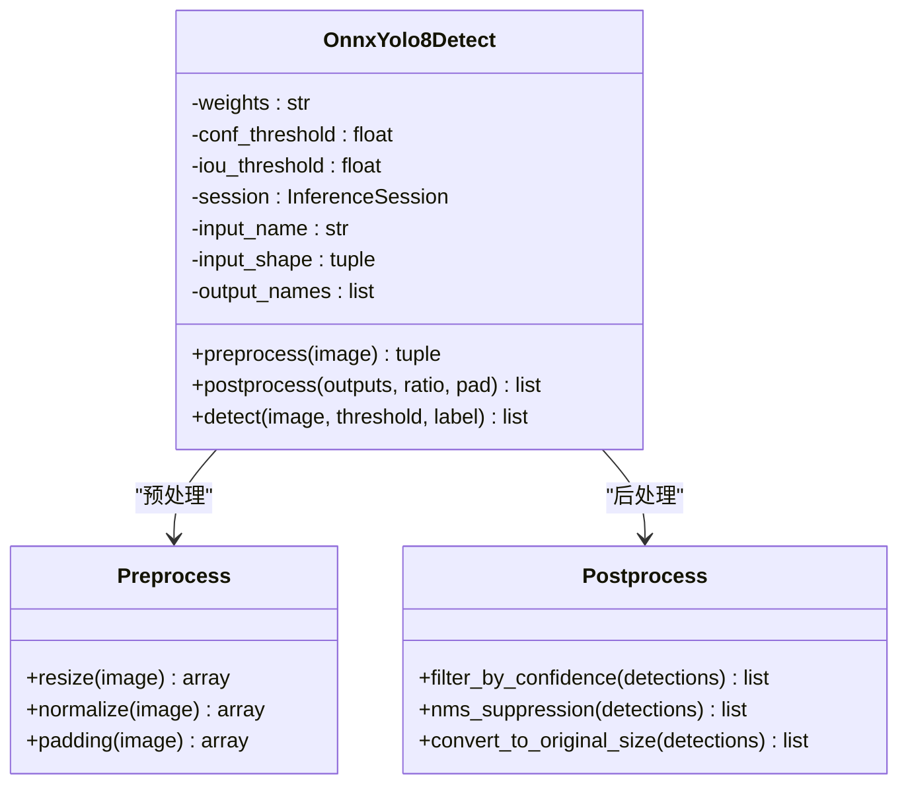

**图表来源**
- [OnnxYolo8Detect.py:17-63](file://src/OnnxYolo8Detect.py#L17-L63)
- [OnnxYolo8Detect.py:106-182](file://src/OnnxYolo8Detect.py#L106-L182)

#### 检测流程优化
实现高效的图像预处理和后处理管道。系统现在支持更灵活的GPU/CPU执行提供程序选择：

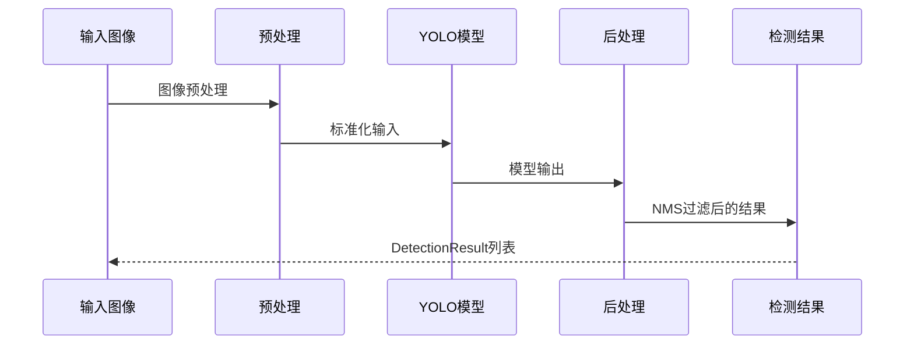

**图表来源**
- [OnnxYolo8Detect.py:242-254](file://src/OnnxYolo8Detect.py#L242-L254)

**章节来源**
- [OnnxYolo8Detect.py:64-104](file://src/OnnxYolo8Detect.py#L64-L104)
- [OnnxYolo8Detect.py:184-228](file://src/OnnxYolo8Detect.py#L184-L228)

## 依赖关系分析

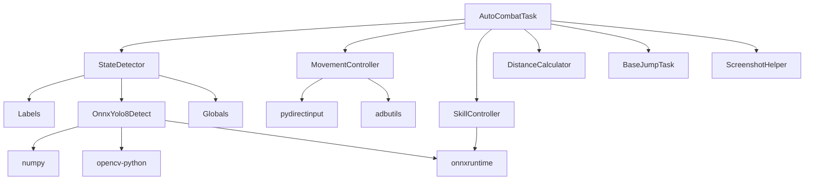

**图表来源**
- [requirements.txt:1-13](file://requirements.txt#L1-L13)
- [AutoCombatTask.py:16-22](file://src/task/AutoCombatTask.py#L16-L22)

**章节来源**
- [requirements.txt:1-13](file://requirements.txt#L1-L13)
- [globals.py:190-227](file://src/globals.py#L190-L227)

## 性能考虑

### 计算机视觉优化
- **GPU加速**: 自动检测CUDA执行提供，优先使用GPU进行推理
- **预处理优化**: 使用向量化操作减少CPU负担
- **内存管理**: 检测失败时优雅降级，避免程序崩溃

### 算法复杂度分析
- **距离计算**: O(n) - 需要遍历所有目标计算距离
- **最近目标选择**: O(n) - 线性扫描最优目标
- **NMS后处理**: O(n²) - 二次复杂度，但实际应用中常数较小

### 内存使用优化
- 检测器实例化延迟，仅在需要时创建
- 模型权重缓存，避免重复加载
- 异常处理确保资源正确释放

## 故障排除指南

### 常见问题诊断

#### YOLO模型加载失败
**症状**: 检测结果为空，控制台显示模型加载错误
**解决方案**: 
1. 确认ONNX模型文件存在且完整
2. 检查onnxruntime版本兼容性
3. 验证GPU驱动是否正确安装

#### 移动控制失效
**症状**: 角色无法移动或移动方向错误
**解决方案**:
1. 检查ADB连接状态（移动端）
2. 验证键盘映射配置
3. 确认游戏窗口处于激活状态

#### 技能释放异常
**症状**: 技能冷却时间不准确或技能不释放
**解决方案**:
1. 检查技能配置参数
2. 验证游戏热键设置
3. 确认自动技能开关状态

### 调试技巧

#### 日志分析
系统提供详细的日志记录，包括：
- 检测结果统计
- 移动控制状态
- 技能释放记录
- 错误异常信息

#### 截图功能
内置截图助手支持：
- 战斗场景截图保存
- 特征模板提取
- COCO格式标注生成

**章节来源**
- [ScreenshotHelper.py:17-44](file://src/utils/ScreenshotHelper.py#L17-L44)
- [AutoCombatTask.py:195-198](file://src/task/AutoCombatTask.py#L195-L198)

## 结论

自动战斗系统通过模块化的架构设计，实现了高度智能化的战斗辅助功能。经过大幅增强后，系统现在具备以下核心优势：

1. **多平台支持**: 统一的API设计支持PC端和移动端
2. **智能决策**: 基于计算机视觉的实时环境感知
3. **灵活配置**: 可定制的技能释放策略和移动参数
4. **稳定可靠**: 完善的错误处理和资源管理机制
5. **后台支持**: 支持游戏窗口最小化时继续运行
6. **实时监控**: 并行死亡状态监控，快速响应战斗变化

该系统为开发者提供了清晰的扩展接口，可以轻松添加新的战斗策略和自定义行为。

## 附录

### 配置参数说明

| 参数名称 | 数据类型 | 默认值 | 描述 |
|---------|---------|--------|------|
| 测试模式 | bool | False | 启用后跳过场景检测 |
| 自动普攻 | bool | True | 是否自动释放普通攻击 |
| 自动技能1 | bool | True | 是否自动释放技能1 |
| 自动技能2 | bool | True | 是否自动释放技能2 |
| 自动大招 | bool | True | 是否自动释放终极技能 |
| 普攻间隔(秒) | float | 0.5 | 普通攻击冷却时间 |
| 技能1间隔(秒) | float | 2.0 | 技能1冷却时间 |
| 技能2间隔(秒) | float | 3.0 | 技能2冷却时间 |
| 大招间隔(秒) | float | 5.0 | 终极技能冷却时间 |

### 开发者扩展指南

#### 添加新的战斗策略
1. 在AutoCombatTask中添加新的状态处理方法
2. 实现相应的决策逻辑
3. 更新配置参数以支持新策略

#### 自定义技能行为
1. 修改SkillController中的技能释放逻辑
2. 添加新的技能类型和冷却参数
3. 实现对应的按键或点击操作

#### 优化距离计算
1. 调整最优距离范围参数
2. 实现更复杂的移动策略
3. 添加地形影响因素