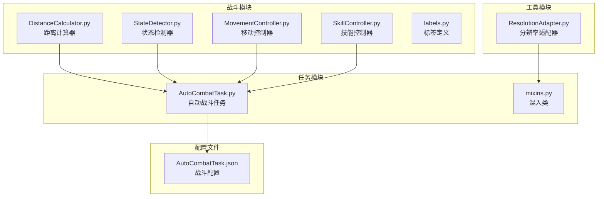
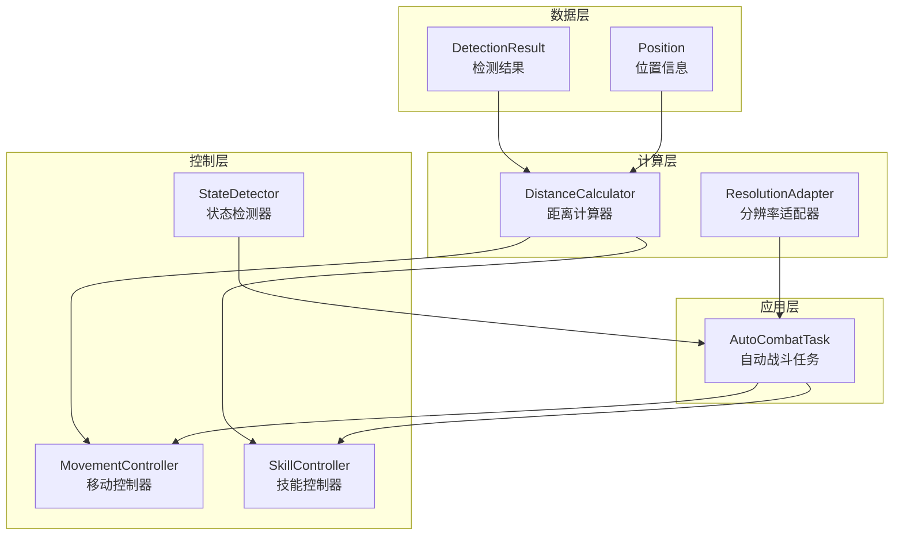
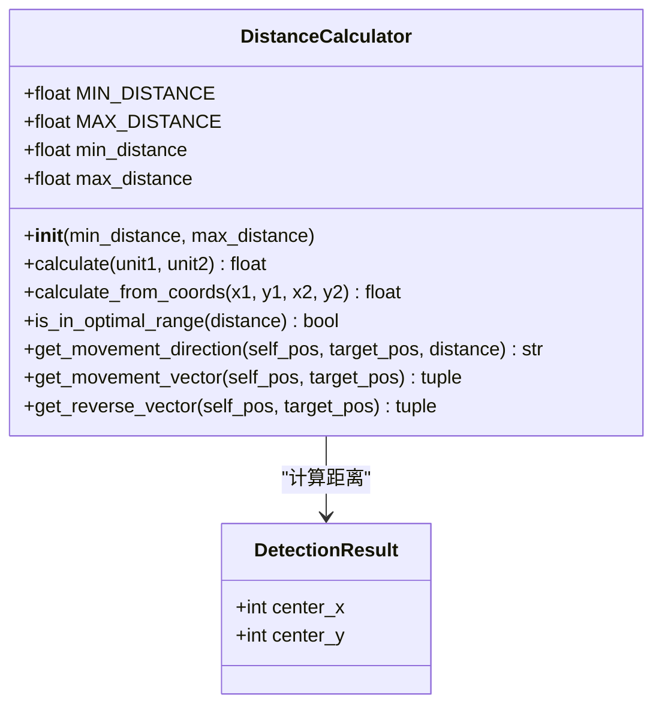
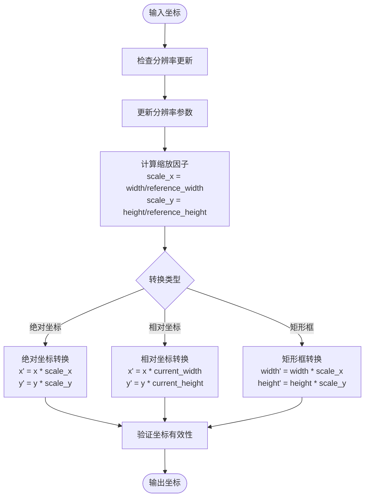
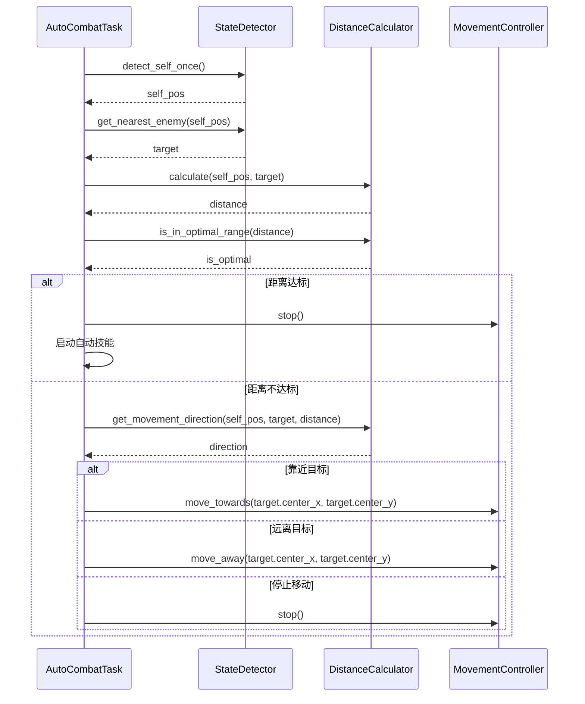
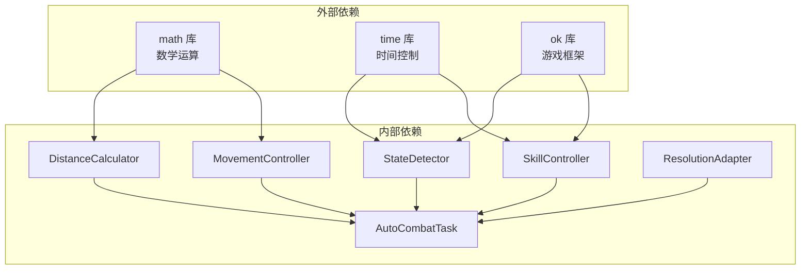

# 距离计算

<cite>
**本文档引用的文件**
- [distance_calculator.py](file://src/combat/distance_calculator.py)
- [ResolutionAdapter.py](file://src/utils/ResolutionAdapter.py)
- [AutoCombatTask.py](file://src/task/AutoCombatTask.py)
- [movement_controller.py](file://src/combat/movement_controller.py)
- [state_detector.py](file://src/combat/state_detector.py)
- [labels.py](file://src/combat/labels.py)
- [mixins.py](file://src/task/mixins.py)
- [AutoCombatTask.json](file://configs/AutoCombatTask.json)
</cite>

## 目录
1. [简介](#简介)
2. [项目结构](#项目结构)
3. [核心组件](#核心组件)
4. [架构概览](#架构概览)
5. [详细组件分析](#详细组件分析)
6. [依赖关系分析](#依赖关系分析)
7. [性能考虑](#性能考虑)
8. [故障排除指南](#故障排除指南)
9. [结论](#结论)

## 简介

本文件为距离计算模块的专业技术文档，专注于欧几里得距离计算算法的数学原理与实现细节。文档详细阐述了以下内容：

- 欧几里得距离计算的数学基础与实现方式
- 曼哈顿距离等其他距离度量的应用场景对比
- 坐标转换、像素密度适配和分辨率缩放对距离计算的影响
- 精度优化、浮点数误差处理和边界条件判断
- 距离计算在战斗决策中的具体应用示例
- 性能优化和缓存策略

该模块在自动战斗系统中扮演关键角色，通过精确的距离计算为移动控制和技能释放提供决策依据。

## 项目结构

距离计算模块位于 `src/combat/` 目录下，主要包含以下文件：

**图表来源**
- [distance_calculator.py:1-139](file://src/combat/distance_calculator.py#L1-L139)
- [ResolutionAdapter.py:1-163](file://src/utils/ResolutionAdapter.py#L1-L163)
- [AutoCombatTask.py:350-431](file://src/task/AutoCombatTask.py#L350-L431)

**章节来源**
- [distance_calculator.py:1-139](file://src/combat/distance_calculator.py#L1-L139)
- [ResolutionAdapter.py:1-163](file://src/utils/ResolutionAdapter.py#L1-L163)
- [AutoCombatTask.py:350-431](file://src/task/AutoCombatTask.py#L350-L431)

## 核心组件

### 距离计算器 (DistanceCalculator)

距离计算器是距离计算模块的核心组件，提供以下功能：

- **欧几里得距离计算**：基于勾股定理计算两点间的直线距离
- **最佳攻击距离判断**：根据预设范围判断是否达到攻击条件
- **移动方向建议**：根据距离关系提供移动方向指导
- **单位向量计算**：提供从自身到目标的标准化方向向量

### 分辨率适配器 (ResolutionAdapter)

负责处理不同分辨率和纵横比下的坐标转换：

- **比例缩放**：根据参考分辨率进行坐标缩放
- **纵横比检查**：验证当前分辨率是否符合支持的比例
- **相对坐标转换**：支持相对坐标与绝对坐标的相互转换

### 自动战斗任务 (AutoCombatTask)

集成距离计算模块，实现完整的战斗决策流程：

- **状态检测**：检测战场状态并确定目标
- **距离维护**：保持最佳攻击距离
- **移动控制**：根据距离计算结果控制角色移动
- **技能释放**：在合适时机释放技能

**章节来源**
- [distance_calculator.py:10-139](file://src/combat/distance_calculator.py#L10-L139)
- [ResolutionAdapter.py:4-163](file://src/utils/ResolutionAdapter.py#L4-L163)
- [AutoCombatTask.py:350-431](file://src/task/AutoCombatTask.py#L350-L431)

## 架构概览

距离计算模块采用分层架构设计，各组件职责明确且耦合度低：

**图表来源**
- [distance_calculator.py:35-139](file://src/combat/distance_calculator.py#L35-L139)
- [ResolutionAdapter.py:34-163](file://src/utils/ResolutionAdapter.py#L34-L163)
- [AutoCombatTask.py:350-431](file://src/task/AutoCombatTask.py#L350-L431)

## 详细组件分析

### 距离计算器深度分析

#### 数学原理与实现

距离计算器基于欧几里得几何学，使用勾股定理计算两点间直线距离：

**公式**：距离 = √[(x₂-x₁)² + (y₂-y₁)²]

**图表来源**
- [distance_calculator.py:10-139](file://src/combat/distance_calculator.py#L10-L139)

#### 算法复杂度分析

- **时间复杂度**：O(1) - 基本数学运算，不随输入规模变化
- **空间复杂度**：O(1) - 使用常量级额外空间
- **计算开销**：主要来源于平方根运算，属于轻量级计算

#### 边界条件处理

距离计算器实现了完善的边界条件处理：

1. **除零保护**：在计算单位向量时检查长度小于阈值的情况
2. **数值稳定性**：使用适当的阈值避免浮点数精度问题
3. **范围检查**：确保距离值在合理范围内

**章节来源**
- [distance_calculator.py:35-139](file://src/combat/distance_calculator.py#L35-L139)

### 分辨率适配器深度分析

#### 坐标转换机制

分辨率适配器提供了多维度的坐标转换能力：

**图表来源**
- [ResolutionAdapter.py:34-93](file://src/utils/ResolutionAdapter.py#L34-L93)

#### 精度优化策略

1. **整数转换**：所有缩放结果转换为整数，避免浮点数误差累积
2. **阈值比较**：纵横比检查使用容差值（0.01）处理浮点数比较
3. **边界检查**：防止负数和零值导致的异常

**章节来源**
- [ResolutionAdapter.py:19-163](file://src/utils/ResolutionAdapter.py#L19-L163)

### 自动战斗任务集成分析

#### 距离驱动的战斗决策流程

**图表来源**
- [AutoCombatTask.py:350-431](file://src/task/AutoCombatTask.py#L350-L431)
- [distance_calculator.py:79-104](file://src/combat/distance_calculator.py#L79-L104)

#### 距离维护策略

自动战斗任务实现了统一的距离维护逻辑：

1. **距离范围设定**：100-200像素的最佳攻击距离
2. **动态调整**：根据距离差异实时调整移动策略
3. **状态同步**：距离达标时启动技能，不达标时保持移动

**章节来源**
- [AutoCombatTask.py:396-420](file://src/task/AutoCombatTask.py#L396-L420)
- [distance_calculator.py:67-104](file://src/combat/distance_calculator.py#L67-L104)

## 依赖关系分析

### 组件间依赖关系

**图表来源**
- [distance_calculator.py:7](file://src/combat/distance_calculator.py#L7)
- [movement_controller.py:7-8](file://src/combat/movement_controller.py#L7-L8)
- [state_detector.py:10](file://src/combat/state_detector.py#L10)

### 循环依赖检查

经过分析，距离计算模块不存在循环依赖：

- **DistanceCalculator**：独立的纯计算类，无外部依赖
- **ResolutionAdapter**：独立的工具类，无循环引用
- **AutoCombatTask**：通过组合关系使用其他组件，无反向依赖

**章节来源**
- [distance_calculator.py:1-139](file://src/combat/distance_calculator.py#L1-L139)
- [ResolutionAdapter.py:1-163](file://src/utils/ResolutionAdapter.py#L1-L163)
- [AutoCombatTask.py:1-431](file://src/task/AutoCombatTask.py#L1-L431)

## 性能考虑

### 算法性能优化

#### 时间复杂度优化

1. **避免重复计算**：`get_movement_direction` 方法支持传入已计算的距离值
2. **早期退出**：在距离计算中使用短路逻辑
3. **批量处理**：状态检测器使用单次检测方法减少重复计算

#### 内存使用优化

1. **常量存储**：距离范围使用类变量避免实例化开销
2. **静态方法**：大量使用静态方法减少对象创建
3. **原地操作**：避免不必要的数据复制

### 缓存策略

虽然当前实现未实现显式的缓存机制，但可以通过以下方式优化：

1. **距离结果缓存**：缓存最近的几个距离计算结果
2. **向量缓存**：缓存单位向量以避免重复计算
3. **目标跟踪**：跟踪最近的目标以减少搜索开销

### 浮点数精度处理

1. **阈值比较**：使用适当的容差值处理浮点数比较
2. **数值范围检查**：确保输入值在合理范围内
3. **单位向量归一化**：使用安全的归一化方法

## 故障排除指南

### 常见问题及解决方案

#### 距离计算异常

**问题**：距离计算结果异常或为负值
**原因**：坐标值异常或分辨率适配错误
**解决方案**：
1. 检查输入坐标的有效性
2. 验证分辨率适配器的正确性
3. 添加边界条件检查

#### 移动控制失效

**问题**：角色无法正确移动到目标位置
**原因**：距离计算错误或移动方向判断失误
**解决方案**：
1. 检查 `get_movement_direction` 方法的逻辑
2. 验证 `get_movement_vector` 的归一化处理
3. 确认移动控制器的坐标转换

#### 分辨率适配问题

**问题**：在不同分辨率下坐标不匹配
**原因**：纵横比不支持或缩放因子计算错误
**解决方案**：
1. 检查 `check_aspect_ratio` 方法
2. 验证 `update_resolution` 的计算逻辑
3. 确认参考分辨率的配置

**章节来源**
- [distance_calculator.py:120-123](file://src/combat/distance_calculator.py#L120-L123)
- [ResolutionAdapter.py:41-42](file://src/utils/ResolutionAdapter.py#L41-L42)
- [AutoCombatTask.py:408-419](file://src/task/AutoCombatTask.py#L408-L419)

## 结论

距离计算模块通过简洁而高效的实现，为自动战斗系统提供了可靠的数学基础。其设计特点包括：

1. **数学严谨性**：基于欧几里得几何学的精确距离计算
2. **实用性导向**：针对游戏场景优化的参数配置
3. **扩展性强**：清晰的接口设计便于功能扩展
4. **稳定性好**：完善的边界条件处理和错误防护

该模块的成功实施证明了在自动化游戏中，精确的数学计算与智能的决策逻辑相结合能够产生高效稳定的系统表现。未来可以在缓存策略、批量处理和更复杂的距离度量方面进一步优化，以适应更复杂的游戏场景需求。