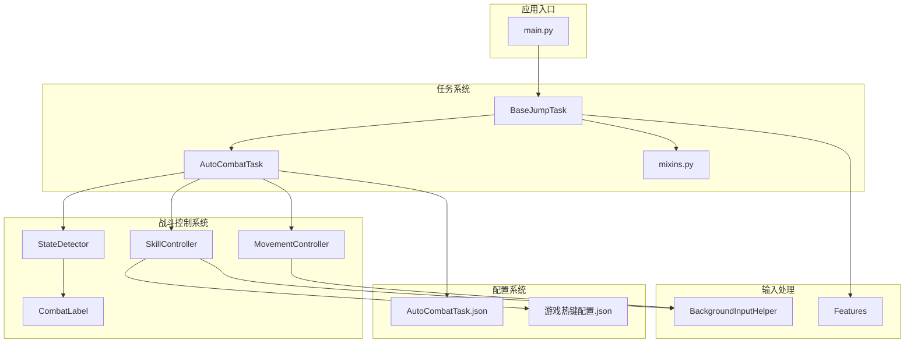
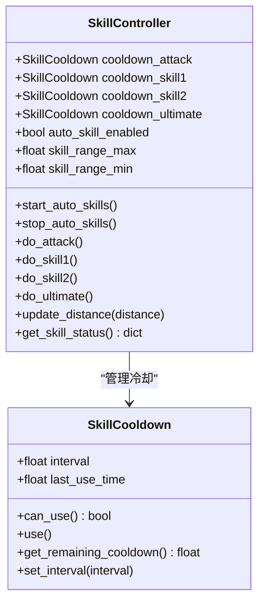
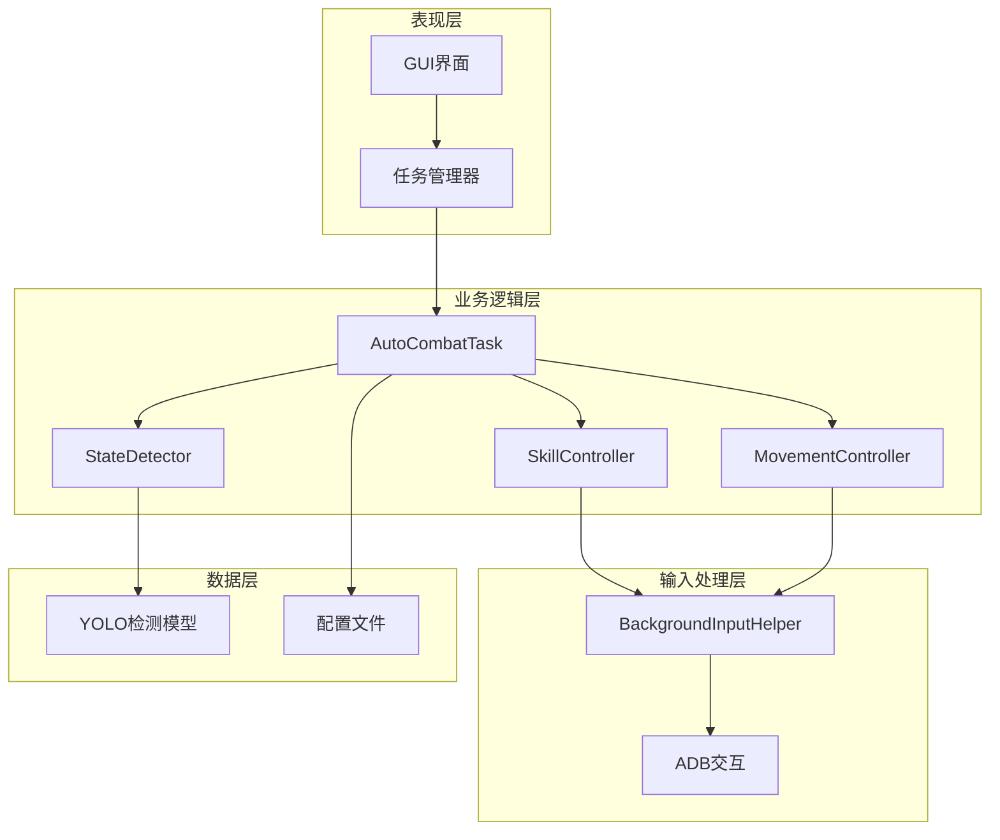
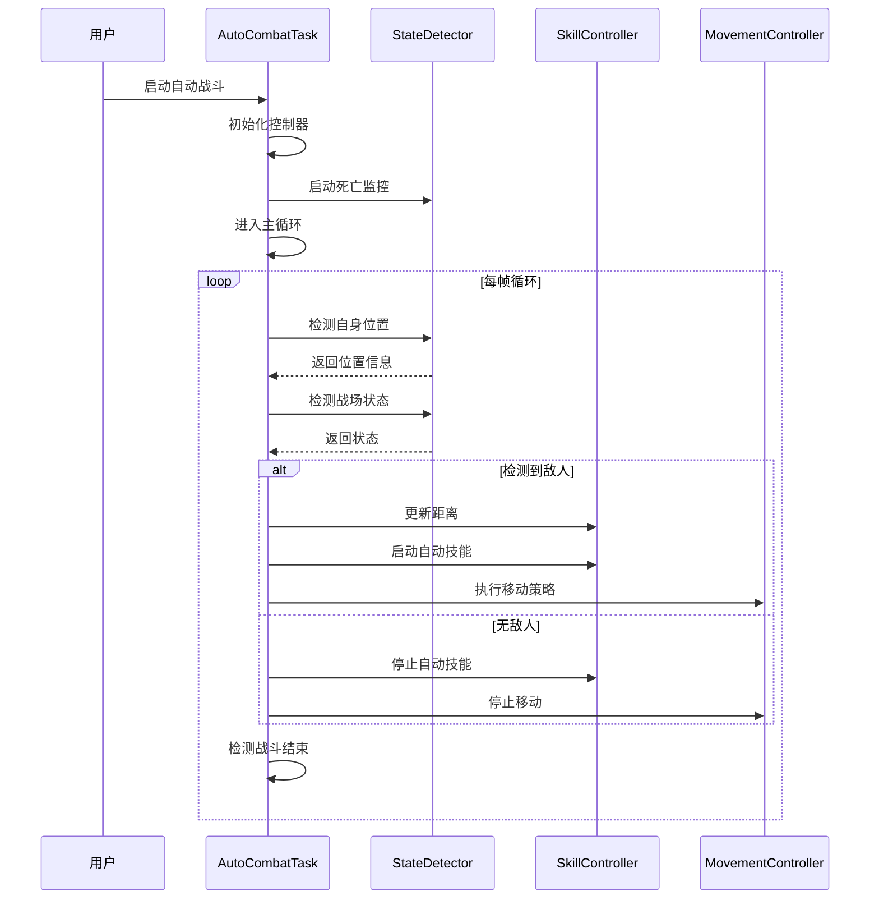
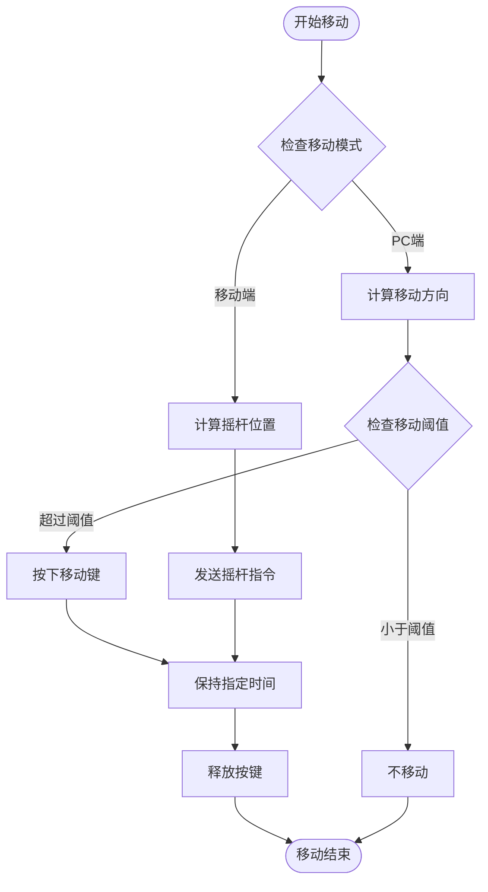
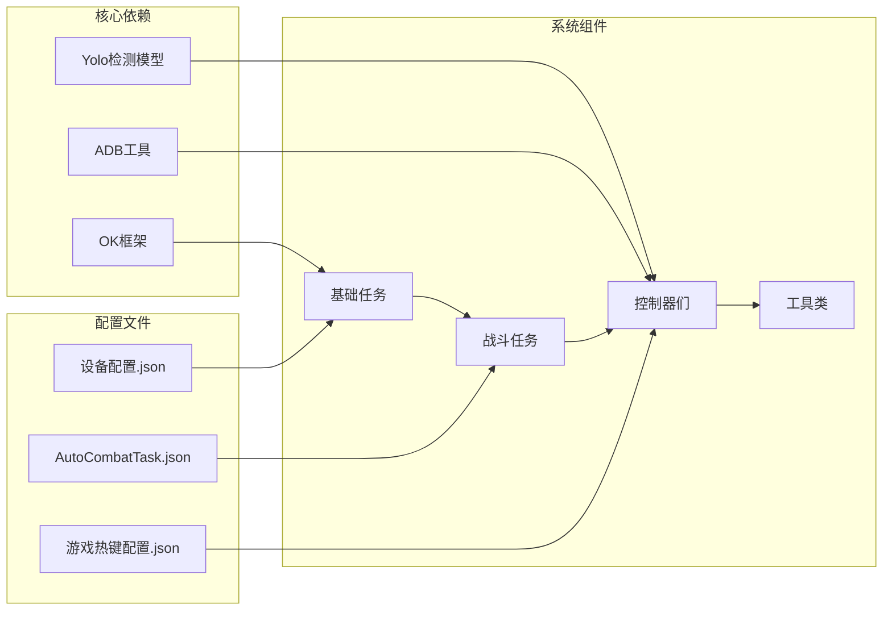

# 规划技能

<cite>
**本文档引用的文件**
- [main.py](file://main.py)
- [skill_controller.py](file://src/combat/skill_controller.py)
- [AutoCombatTask.py](file://src/task/AutoCombatTask.py)
- [state_detector.py](file://src/combat/state_detector.py)
- [movement_controller.py](file://src/combat/movement_controller.py)
- [BaseJumpTask.py](file://src/task/BaseJumpTask.py)
- [mixins.py](file://src/task/mixins.py)
- [BackgroundInputHelper.py](file://src/utils/BackgroundInputHelper.py)
- [features.py](file://src/constants/features.py)
- [labels.py](file://src/combat/labels.py)
- [AutoCombatTask.json](file://configs/AutoCombatTask.json)
- [游戏热键配置.json](file://configs/游戏热键配置.json)
- [state_machine.py](file://src/tutorial/state_machine.py)
</cite>

## 目录
1. [简介](#简介)
2. [项目结构](#项目结构)
3. [核心组件](#核心组件)
4. [架构概览](#架构概览)
5. [详细组件分析](#详细组件分析)
6. [依赖分析](#依赖分析)
7. [性能考虑](#性能考虑)
8. [故障排除指南](#故障排除指南)
9. [结论](#结论)

## 简介

这是一个基于Python的自动化战斗系统，专为游戏《Wuthering Waves》设计的智能规划技能系统。该系统实现了完整的自动战斗逻辑，包括技能释放、移动控制、状态检测等功能，支持PC端和移动端两种运行模式。

系统的核心特色包括：
- **智能技能规划**：基于距离和状态的动态技能释放
- **多模式支持**：PC端键盘输入和移动端ADB交互
- **后台模式**：支持游戏窗口最小化时的技能执行
- **状态感知**：实时检测战斗状态并做出相应反应
- **配置驱动**：通过JSON配置文件灵活调整技能行为

## 项目结构

**图表来源**
- [main.py:659-693](file://main.py#L659-L693)
- [AutoCombatTask.py:35-141](file://src/task/AutoCombatTask.py#L35-L141)
- [skill_controller.py:82-149](file://src/combat/skill_controller.py#L82-L149)

**章节来源**
- [main.py:1-693](file://main.py#L1-L693)
- [AutoCombatTask.py:1-800](file://src/task/AutoCombatTask.py#L1-L800)

## 核心组件

### 技能控制器 (SkillController)

技能控制器是整个系统的"大脑"，负责智能规划和执行技能释放。其核心特性包括：

- **独立冷却系统**：每个技能拥有独立的冷却计时器
- **动态距离检测**：实时监控与目标的距离
- **多模式支持**：支持PC端键盘和移动端ADB交互
- **后台模式**：通过SendInput实现Unity游戏的后台技能释放

**图表来源**
- [skill_controller.py:29-81](file://src/combat/skill_controller.py#L29-L81)
- [skill_controller.py:82-589](file://src/combat/skill_controller.py#L82-L589)

### 战斗状态检测器 (StateDetector)

状态检测器负责实时监控游戏状态，包括死亡检测、自身检测、友方和敌方检测：

- **并行死亡监控**：独立线程持续检测死亡状态
- **多标签检测**：支持自身、友方、敌方、死亡状态检测
- **状态感知**：通过YOLO模型判断战斗状态

**章节来源**
- [skill_controller.py:1-589](file://src/combat/skill_controller.py#L1-L589)
- [state_detector.py:24-589](file://src/combat/state_detector.py#L24-L589)

## 架构概览

系统采用分层架构设计，从底层的输入处理到顶层的任务协调：

**图表来源**
- [AutoCombatTask.py:199-263](file://src/task/AutoCombatTask.py#L199-L263)
- [state_detector.py:16-589](file://src/combat/state_detector.py#L16-L589)

## 详细组件分析

### 自动战斗任务 (AutoCombatTask)

AutoCombatTask是整个系统的协调中心，负责：

- **状态管理**：管理战斗生命周期和状态转换
- **任务编排**：协调各个子系统的协作
- **配置管理**：读取和应用技能配置
- **异常处理**：处理各种异常情况并进行恢复

**图表来源**
- [AutoCombatTask.py:357-451](file://src/task/AutoCombatTask.py#L357-L451)
- [AutoCombatTask.py:561-648](file://src/task/AutoCombatTask.py#L561-L648)

### 移动控制器 (MovementController)

移动控制器提供智能的移动策略：

- **方向计算**：根据目标位置计算移动方向
- **多模式支持**：支持PC端WASD和移动端虚拟摇杆
- **防抖动机制**：避免频繁的按键切换
- **后台支持**：支持游戏窗口最小化时的移动

**图表来源**
- [movement_controller.py:106-165](file://src/combat/movement_controller.py#L106-L165)
- [movement_controller.py:461-512](file://src/combat/movement_controller.py#L461-L512)

### 后台输入助手 (BackgroundInputHelper)

后台输入助手是系统的核心技术组件，解决了Unity游戏的后台输入问题：

- **SendInput技术**：使用Windows API直接发送输入事件
- **窗口管理**：支持窗口伪最小化和焦点管理
- **多模式支持**：前台模式和后台模式自动切换
- **稳定性保证**：提供可靠的输入服务

**章节来源**
- [movement_controller.py:1-687](file://src/combat/movement_controller.py#L1-L687)
- [BackgroundInputHelper.py:99-800](file://src/utils/BackgroundInputHelper.py#L99-L800)

## 依赖分析

系统采用松耦合的设计，主要依赖关系如下：

**图表来源**
- [mixins.py:400-444](file://src/task/mixins.py#L400-L444)
- [AutoCombatTask.json:1-14](file://configs/AutoCombatTask.json#L1-L14)

**章节来源**
- [mixins.py:1-784](file://src/task/mixins.py#L1-L784)
- [features.py:9-100](file://src/constants/features.py#L9-L100)

## 性能考虑

系统在设计时充分考虑了性能优化：

### 冷却系统优化
- **独立冷却**：每个技能独立冷却，避免相互影响
- **线程安全**：使用锁机制保证并发安全
- **内存优化**：合理的数据结构设计

### 检测效率优化
- **并行检测**：死亡状态检测使用独立线程
- **阈值优化**：移动阈值避免频繁按键切换
- **缓存机制**：ADB模式检测结果缓存

### 内存管理
- **资源清理**：及时释放线程和资源
- **垃圾回收**：防止内存泄漏
- **配置热更新**：支持运行时配置修改

## 故障排除指南

### 常见问题及解决方案

**问题1：技能释放不生效**
- 检查技能配置文件中的按键映射
- 确认游戏窗口处于前台或启用后台模式
- 验证ADB连接状态（移动端）

**问题2：移动控制异常**
- 检查分辨率适配设置
- 确认移动阈值设置合理
- 验证窗口句柄获取是否成功

**问题3：检测精度问题**
- 调整YOLO检测阈值
- 检查图像质量
- 确认标签定义正确

**章节来源**
- [state_detector.py:199-242](file://src/combat/state_detector.py#L199-L242)
- [mixins.py:258-306](file://src/task/mixins.py#L258-L306)

## 结论

规划技能系统是一个高度模块化的自动化战斗解决方案，具有以下特点：

### 技术优势
- **架构清晰**：分层设计便于维护和扩展
- **性能优秀**：多线程和优化算法提升执行效率
- **兼容性强**：支持多种运行环境和设备
- **配置灵活**：通过JSON配置实现个性化定制

### 应用价值
- **自动化程度高**：减少人工干预，提高效率
- **稳定性好**：完善的异常处理和恢复机制
- **可扩展性**：模块化设计支持功能扩展
- **易用性强**：简洁的配置接口和使用体验

该系统为游戏自动化提供了完整的解决方案，不仅适用于《Wuthering Waves》，也可以扩展到其他类似的游戏场景。通过持续的优化和功能增强，可以进一步提升用户体验和系统性能。