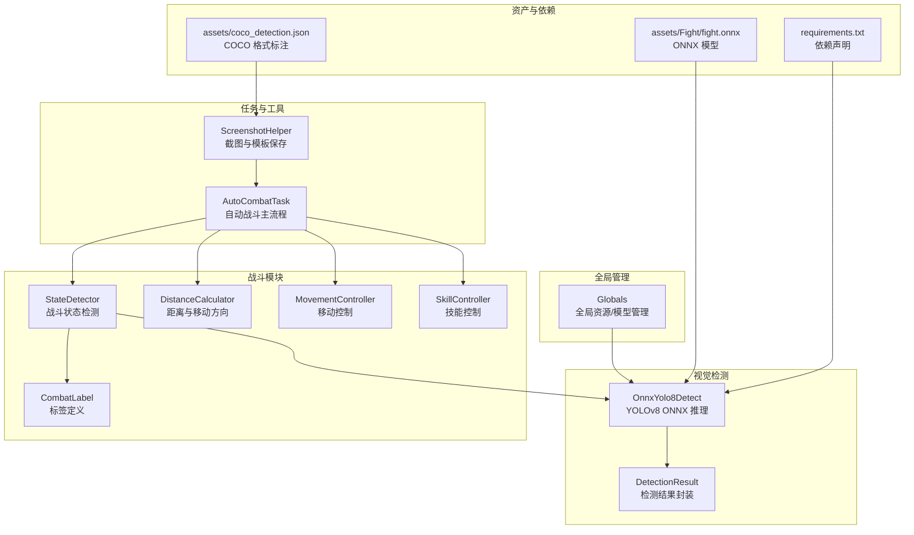
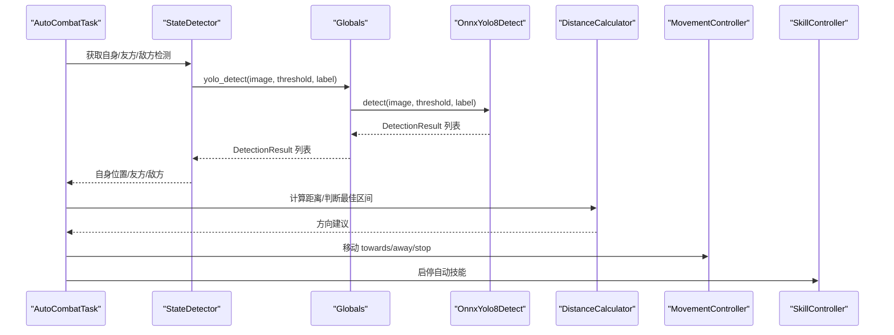
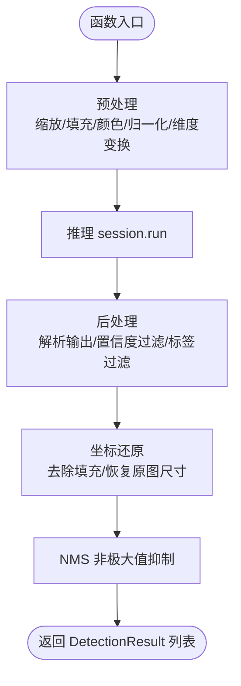
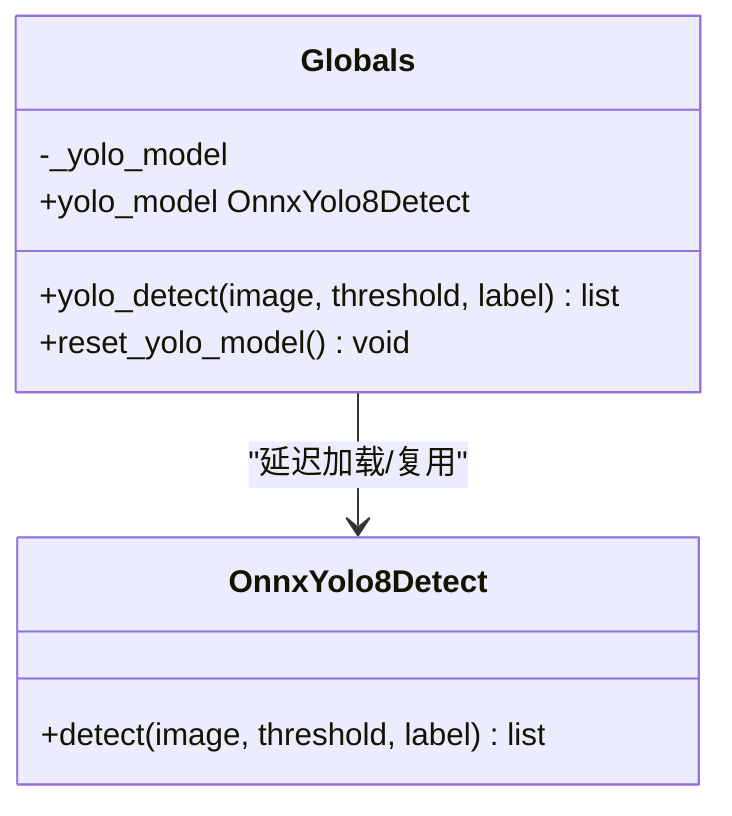
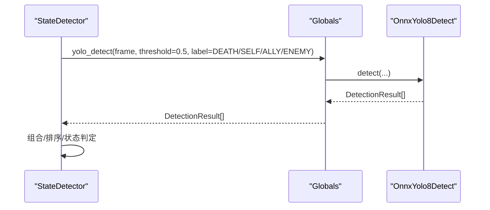
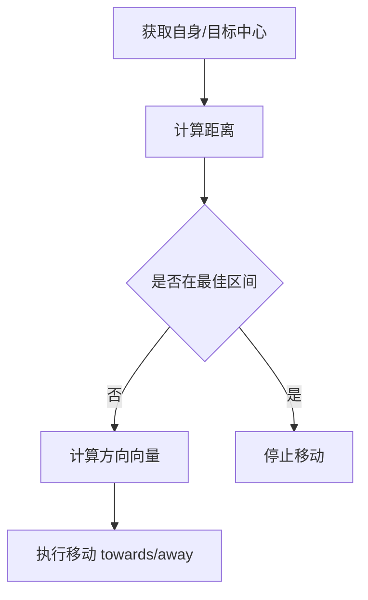
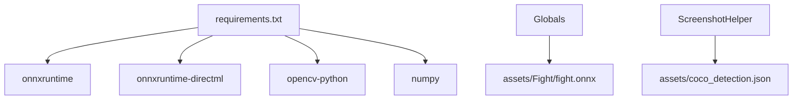

# 计算机视觉引擎

<cite>
**本文引用的文件**
- [src/OnnxYolo8Detect.py](file://src/OnnxYolo8Detect.py)
- [src/globals.py](file://src/globals.py)
- [src/combat/state_detector.py](file://src/combat/state_detector.py)
- [src/combat/labels.py](file://src/combat/labels.py)
- [src/combat/distance_calculator.py](file://src/combat/distance_calculator.py)
- [src/combat/movement_controller.py](file://src/combat/movement_controller.py)
- [src/combat/skill_controller.py](file://src/combat/skill_controller.py)
- [src/tas/AutoCombatTask.py](file://src/task/AutoCombatTask.py)
- [src/utils/ScreenshotHelper.py](file://src/utils/ScreenshotHelper.py)
- [requirements.txt](file://requirements.txt)
- [assets/coco_detection.json](file://assets/coco_detection.json)
- [assets/Fight/fight.onnx](file://assets/Fight/fight.onnx)
</cite>

## 目录
1. [引言](#引言)
2. [项目结构](#项目结构)
3. [核心组件](#核心组件)
4. [架构总览](#架构总览)
5. [详细组件分析](#详细组件分析)
6. [依赖关系分析](#依赖关系分析)
7. [性能考量](#性能考量)
8. [故障排查指南](#故障排查指南)
9. [结论](#结论)
10. [附录](#附录)

## 引言
本技术文档面向计算机视觉引擎，聚焦于基于 ONNX 的 YOLOv8 目标检测系统，系统性阐述模型加载、图像预处理、推理执行、后处理与误检过滤、以及在自动战斗任务中的集成与应用。文档同时提供模型训练与部署的最佳实践、性能调优与硬件加速建议，并给出扩展视觉检测能力与集成新模型的技术指导。

## 项目结构
项目采用模块化组织，核心视觉检测位于 src/OnnxYolo8Detect.py，全局资源与模型管理位于 src/globals.py，战斗相关检测与控制位于 src/combat/*，自动战斗主流程位于 src/task/AutoCombatTask.py，工具类位于 src/utils/*，模型权重与标注数据位于 assets/*。

**图表来源**
- [src/OnnxYolo8Detect.py:17-254](file://src/OnnxYolo8Detect.py#L17-L254)
- [src/globals.py:172-226](file://src/globals.py#L172-L226)
- [src/combat/state_detector.py:23-192](file://src/combat/state_detector.py#L23-L192)
- [src/combat/labels.py:8-50](file://src/combat/labels.py#L8-L50)
- [src/combat/distance_calculator.py:10-139](file://src/combat/distance_calculator.py#L10-L139)
- [src/combat/movement_controller.py:11-311](file://src/combat/movement_controller.py#L11-L311)
- [src/combat/skill_controller.py:12-181](file://src/combat/skill_controller.py#L12-L181)
- [src/task/AutoCombatTask.py:25-357](file://src/task/AutoCombatTask.py#L25-L357)
- [src/utils/ScreenshotHelper.py:7-68](file://src/utils/ScreenshotHelper.py#L7-L68)
- [assets/Fight/fight.onnx](file://assets/Fight/fight.onnx)
- [assets/coco_detection.json:1-384](file://assets/coco_detection.json#L1-L384)
- [requirements.txt:1-13](file://requirements.txt#L1-L13)

**章节来源**
- [src/OnnxYolo8Detect.py:1-311](file://src/OnnxYolo8Detect.py#L1-L311)
- [src/globals.py:1-227](file://src/globals.py#L1-L227)
- [src/combat/state_detector.py:1-274](file://src/combat/state_detector.py#L1-L274)
- [src/combat/labels.py:1-51](file://src/combat/labels.py#L1-L51)
- [src/combat/distance_calculator.py:1-139](file://src/combat/distance_calculator.py#L1-L139)
- [src/combat/movement_controller.py:1-311](file://src/combat/movement_controller.py#L1-L311)
- [src/combat/skill_controller.py:1-181](file://src/combat/skill_controller.py#L1-L181)
- [src/task/AutoCombatTask.py:1-357](file://src/task/AutoCombatTask.py#L1-L357)
- [src/utils/ScreenshotHelper.py:1-68](file://src/utils/ScreenshotHelper.py#L1-L68)
- [requirements.txt:1-13](file://requirements.txt#L1-L13)
- [assets/coco_detection.json:1-384](file://assets/coco_detection.json#L1-L384)
- [assets/Fight/fight.onnx](file://assets/Fight/fight.onnx)

## 核心组件
- OnnxYolo8Detect：封装 ONNXRuntime 推理会话、图像预处理、模型输出后处理与 NMS 非极大值抑制，提供 detect 接口。
- Globals：延迟加载 fight.onnx 模型，提供 yolo_detect 统一入口与模型重置。
- StateDetector：围绕 YOLO 检测构建战斗状态判断，支持死亡状态、自身、友方、敌方检测与最近目标选择。
- DistanceCalculator：计算单位间距离、判断最佳攻击距离区间、提供移动方向建议。
- MovementController：根据目标位置与屏幕中心计算方向，支持 PC 键盘 WASD 与手机虚拟摇杆两种模式。
- SkillController：按配置周期性触发普通攻击、技能1/2、大招，支持 PC 键盘与手机点击。
- AutoCombatTask：自动战斗主流程，串联状态检测、距离控制、移动与技能释放。
- ScreenshotHelper：截图保存、特征模板提取、COCO 注解生成辅助。

**章节来源**
- [src/OnnxYolo8Detect.py:17-254](file://src/OnnxYolo8Detect.py#L17-L254)
- [src/globals.py:172-226](file://src/globals.py#L172-L226)
- [src/combat/state_detector.py:23-192](file://src/combat/state_detector.py#L23-L192)
- [src/combat/distance_calculator.py:10-139](file://src/combat/distance_calculator.py#L10-L139)
- [src/combat/movement_controller.py:11-311](file://src/combat/movement_controller.py#L11-L311)
- [src/combat/skill_controller.py:12-181](file://src/combat/skill_controller.py#L12-L181)
- [src/task/AutoCombatTask.py:25-357](file://src/task/AutoCombatTask.py#L25-L357)
- [src/utils/ScreenshotHelper.py:7-68](file://src/utils/ScreenshotHelper.py#L7-L68)

## 架构总览
系统以 Globals 为中心协调全局资源，AutoCombatTask 作为主控调度各子模块；视觉检测通过 OnnxYolo8Detect 提供统一接口，StateDetector 基于检测结果进行状态决策，DistanceCalculator/MovementController/SkillController 实现闭环控制。

**图表来源**
- [src/task/AutoCombatTask.py:147-357](file://src/task/AutoCombatTask.py#L147-L357)
- [src/combat/state_detector.py:182-274](file://src/combat/state_detector.py#L182-L274)
- [src/globals.py:200-222](file://src/globals.py#L200-L222)
- [src/OnnxYolo8Detect.py:230-254](file://src/OnnxYolo8Detect.py#L230-L254)
- [src/combat/distance_calculator.py:35-139](file://src/combat/distance_calculator.py#L35-L139)
- [src/combat/movement_controller.py:45-103](file://src/combat/movement_controller.py#L45-L103)
- [src/combat/skill_controller.py:53-102](file://src/combat/skill_controller.py#L53-L102)

## 详细组件分析

### YOLOv8 ONNX 检测器（OnnxYolo8Detect）
- 模型加载：构造 InferenceSession，尝试 CUDAExecutionProvider，回退 CPUExecutionProvider；记录输入输出名称与形状，推断输入宽高。
- 预处理：等比缩放至模型输入尺寸，计算填充，BGR->RGB，归一化到 [0,1]，HWC->CHW，增加 batch 维度。
- 推理：session.run 执行前向。
- 后处理：动态适配输出维度，分离 bbox 与类别分数，按置信度阈值过滤，按标签过滤，还原到原图坐标，NMS 去重。
- NMS：按类别与 IOU 阈值迭代剔除重叠框。

**图表来源**
- [src/OnnxYolo8Detect.py:64-104](file://src/OnnxYolo8Detect.py#L64-L104)
- [src/OnnxYolo8Detect.py:106-182](file://src/OnnxYolo8Detect.py#L106-L182)
- [src/OnnxYolo8Detect.py:184-228](file://src/OnnxYolo8Detect.py#L184-L228)
- [src/OnnxYolo8Detect.py:230-254](file://src/OnnxYolo8Detect.py#L230-L254)

**章节来源**
- [src/OnnxYolo8Detect.py:17-254](file://src/OnnxYolo8Detect.py#L17-L254)

### 全局资源与模型管理（Globals）
- 延迟加载 fight.onnx，若不存在抛出 FileNotFoundError。
- 提供 yolo_detect 统一入口，捕获异常并返回空列表，避免主线程中断。
- 提供 reset_yolo_model 释放模型以节省内存。

**图表来源**
- [src/globals.py:172-226](file://src/globals.py#L172-L226)
- [src/OnnxYolo8Detect.py:29-62](file://src/OnnxYolo8Detect.py#L29-L62)

**章节来源**
- [src/globals.py:172-226](file://src/globals.py#L172-L226)

### 战斗状态检测（StateDetector）
- 死亡状态检测：10 秒内持续检测 label=DEATH，任一帧命中即返回真。
- 自身检测：15 秒超时，返回第一个 label=SELF 的 DetectionResult。
- 友方/敌方检测：按标签过滤返回列表。
- 战场状态：综合友方/敌方是否存在，返回 NO_UNITS/ALLIES_ONLY/ENEMIES_ONLY/MIXED。
- 最近目标：基于 DetectionResult.center 计算欧氏距离，返回最近者。

**图表来源**
- [src/combat/state_detector.py:51-192](file://src/combat/state_detector.py#L51-L192)
- [src/globals.py:200-222](file://src/globals.py#L200-L222)
- [src/OnnxYolo8Detect.py:230-254](file://src/OnnxYolo8Detect.py#L230-L254)

**章节来源**
- [src/combat/state_detector.py:23-274](file://src/combat/state_detector.py#L23-L274)
- [src/combat/labels.py:8-50](file://src/combat/labels.py#L8-L50)

### 距离与移动控制（DistanceCalculator/MovementController）
- DistanceCalculator：提供距离计算、最佳区间判断、移动方向（靠近/远离/停止）、单位向量。
- MovementController：根据目标与屏幕中心计算方向，PC 模式下发 WASD 键，手机模式通过虚拟摇杆滑动。

**图表来源**
- [src/combat/distance_calculator.py:35-139](file://src/combat/distance_calculator.py#L35-L139)
- [src/combat/movement_controller.py:45-103](file://src/combat/movement_controller.py#L45-L103)

**章节来源**
- [src/combat/distance_calculator.py:10-139](file://src/combat/distance_calculator.py#L10-L139)
- [src/combat/movement_controller.py:11-311](file://src/combat/movement_controller.py#L11-L311)

### 技能控制（SkillController）
- 自动技能：按配置周期触发普通攻击、技能1/2、大招，记录上次释放时间，避免频繁触发。
- PC 模式：发送键盘按键；手机模式：根据相对坐标点击技能按钮区域。

**章节来源**
- [src/combat/skill_controller.py:12-181](file://src/combat/skill_controller.py#L12-L181)

### 自动战斗主流程（AutoCombatTask）
- 生命周期：等待进入游戏、初始化控制器、主循环（死亡检测→自身检测→状态判断→移动/技能）。
- 状态分支：无单位、仅友方、仅敌方、混合四类场景，分别执行不同策略。
- 资源清理：停止移动与技能，打印清理完成。

**章节来源**
- [src/task/AutoCombatTask.py:25-357](file://src/task/AutoCombatTask.py#L25-L357)

### 截图与标注工具（ScreenshotHelper）
- 截图保存：按时间戳命名，PNG 格式。
- 特征模板提取：从帧中裁剪指定区域保存为模板。
- COCO 注解生成：提供图片与标注条目构造辅助方法。

**章节来源**
- [src/utils/ScreenshotHelper.py:7-68](file://src/utils/ScreenshotHelper.py#L7-L68)

## 依赖关系分析
- 运行时依赖：onnxruntime、onnxruntime-directml、opencv-python、numpy、PySide6 等。
- 模型依赖：assets/Fight/fight.onnx。
- 数据标注：assets/coco_detection.json（通用 COCO 格式，非战斗模型标注）。

**图表来源**
- [requirements.txt:1-13](file://requirements.txt#L1-L13)
- [src/globals.py:182-196](file://src/globals.py#L182-L196)
- [assets/Fight/fight.onnx](file://assets/Fight/fight.onnx)
- [assets/coco_detection.json:1-384](file://assets/coco_detection.json#L1-L384)

**章节来源**
- [requirements.txt:1-13](file://requirements.txt#L1-L13)
- [src/globals.py:182-196](file://src/globals.py#L182-L196)

## 性能考量
- 硬件加速
  - 优先使用 CUDAExecutionProvider；若不可用回退 CPUExecutionProvider。
  - 可考虑 DirectML Provider（requirements 中已包含 onnxruntime-directml）以在 Windows 上利用 GPU。
- 输入尺寸与预处理
  - 固定模型输入尺寸（如 640x640），采用等比缩放+中心填充，减少形变。
  - 预处理阶段一次性完成颜色空间转换与归一化，避免重复计算。
- 推理优化
  - 使用 Numpy 数组与 OpenCV 向量化操作，避免 Python 循环。
  - 模型复用：通过 Globals 延迟加载与复用，减少反复初始化开销。
- 后处理优化
  - NMS 采用按类别与 IOU 过滤，复杂度与候选框数量线性相关，建议在预处理阶段先做置信度阈值过滤。
- 控制频率
  - AutoCombatTask 主循环 sleep 0.1 秒，平衡实时性与性能；可根据帧率与目标刷新率调整。

[本节为通用性能建议，无需具体文件引用]

## 故障排查指南
- 模型加载失败
  - 现象：抛出 ImportError 或 FileNotFoundError。
  - 排查：确认 onnxruntime 安装；确认 assets/Fight/fight.onnx 存在；检查路径拼接逻辑。
- 推理异常
  - 现象：yolo_detect 返回空列表并打印错误日志。
  - 排查：检查输入图像格式（BGR）、尺寸与通道；确认 ONNX 模型与预处理一致。
- 检测结果为空
  - 现象：自身/友方/敌方检测不到。
  - 排查：降低 threshold；确认 label 参数正确；检查帧是否为 None；确认摄像头/ADB 截图可用。
- 移动/技能无效
  - 现象：PC 模式无按键输入，手机模式点击无效。
  - 排查：ADB 模式下确保设备连接；PC 模式确认热键配置；检查分辨率与缩放比例影响的坐标换算。

**章节来源**
- [src/OnnxYolo8Detect.py:38-53](file://src/OnnxYolo8Detect.py#L38-L53)
- [src/globals.py:189-196](file://src/globals.py#L189-L196)
- [src/globals.py:217-222](file://src/globals.py#L217-L222)
- [src/combat/movement_controller.py:41-43](file://src/combat/movement_controller.py#L41-L43)
- [src/combat/skill_controller.py:49-51](file://src/combat/skill_controller.py#L49-L51)

## 结论
本视觉引擎以 OnnxYolo8Detect 为核心，结合 Globals 的统一管理与 AutoCombatTask 的闭环控制，实现了从图像采集到战斗决策与执行的完整链路。通过合理的预处理、推理与后处理策略，配合 NMS 与阈值过滤，系统在保证稳定性的同时具备良好的可扩展性。建议在实际部署中优先启用 GPU 加速、合理设置阈值与控制频率，并针对具体游戏场景微调模型与参数。

[本节为总结性内容，无需具体文件引用]

## 附录

### 模型训练与部署最佳实践
- 数据准备
  - 使用 COCO 格式标注，确保类别映射与 CombatLabel 一致。
  - 采集多分辨率、多光照、多姿态样本，提升鲁棒性。
- 训练建议
  - 采用 YOLOv8 系列模型，使用官方训练脚本或生态工具。
  - 预处理与推理保持一致（颜色空间、归一化、输入尺寸）。
- 部署建议
  - 导出为 ONNX 并校验输入输出张量形状。
  - 在生产环境启用 CUDA/DirectML Provider，并进行性能基准测试。
  - 通过 Globals 延迟加载与缓存模型，避免重复初始化。

**章节来源**
- [src/combat/labels.py:8-50](file://src/combat/labels.py#L8-L50)
- [assets/coco_detection.json:1-384](file://assets/coco_detection.json#L1-L384)
- [requirements.txt:10-11](file://requirements.txt#L10-L11)

### 硬件加速建议
- Windows 平台优先使用 onnxruntime-directml，兼容性好。
- NVIDIA GPU 使用 CUDAExecutionProvider，确保驱动与 CUDA 版本匹配。
- 通过 ONNXRuntime Providers 列表顺序控制优先级，自动回退。

**章节来源**
- [src/OnnxYolo8Detect.py:46-53](file://src/OnnxYolo8Detect.py#L46-L53)
- [requirements.txt:10-11](file://requirements.txt#L10-L11)

### 扩展视觉检测能力与集成新模型
- 新增标签
  - 在 CombatLabel 中添加新类别常量与名称映射。
  - 在 OnnxYolo8Detect 后处理中确保输出维度与类别数一致。
- 新模型接入
  - 确保新模型输入形状与预处理一致；更新 Globals 中模型路径与阈值。
  - 在 AutoCombatTask 中按需调整检测频率与阈值。
- 可视化与调试
  - 使用 ScreenshotHelper 保存截图与特征模板，辅助定位问题。
  - 在 StateDetector 中增加日志级别，便于追踪检测流程。

**章节来源**
- [src/combat/labels.py:8-50](file://src/combat/labels.py#L8-L50)
- [src/globals.py:182-196](file://src/globals.py#L182-L196)
- [src/utils/ScreenshotHelper.py:17-44](file://src/utils/ScreenshotHelper.py#L17-L44)