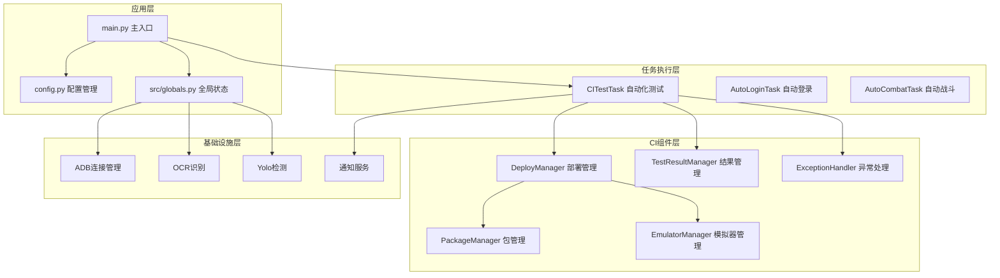
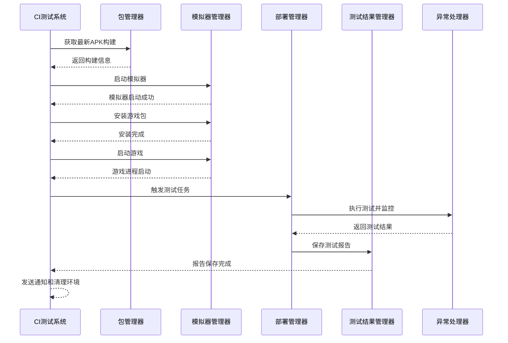
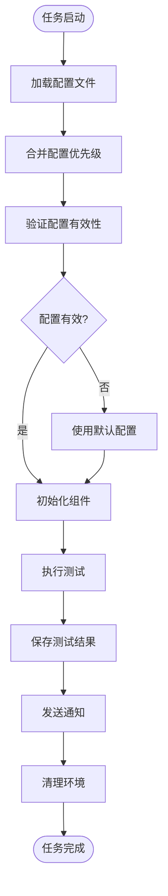
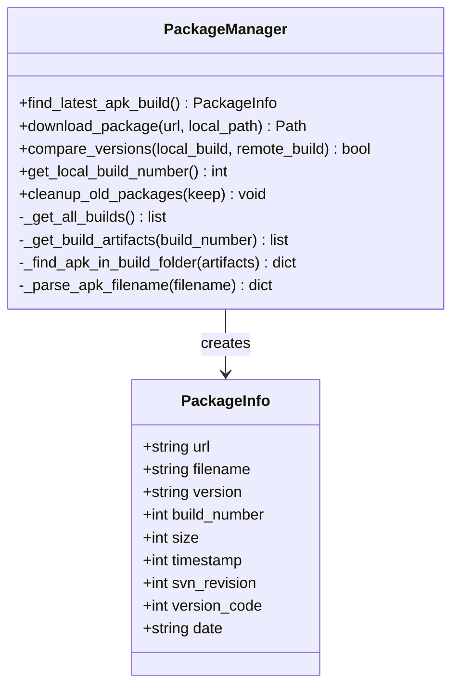
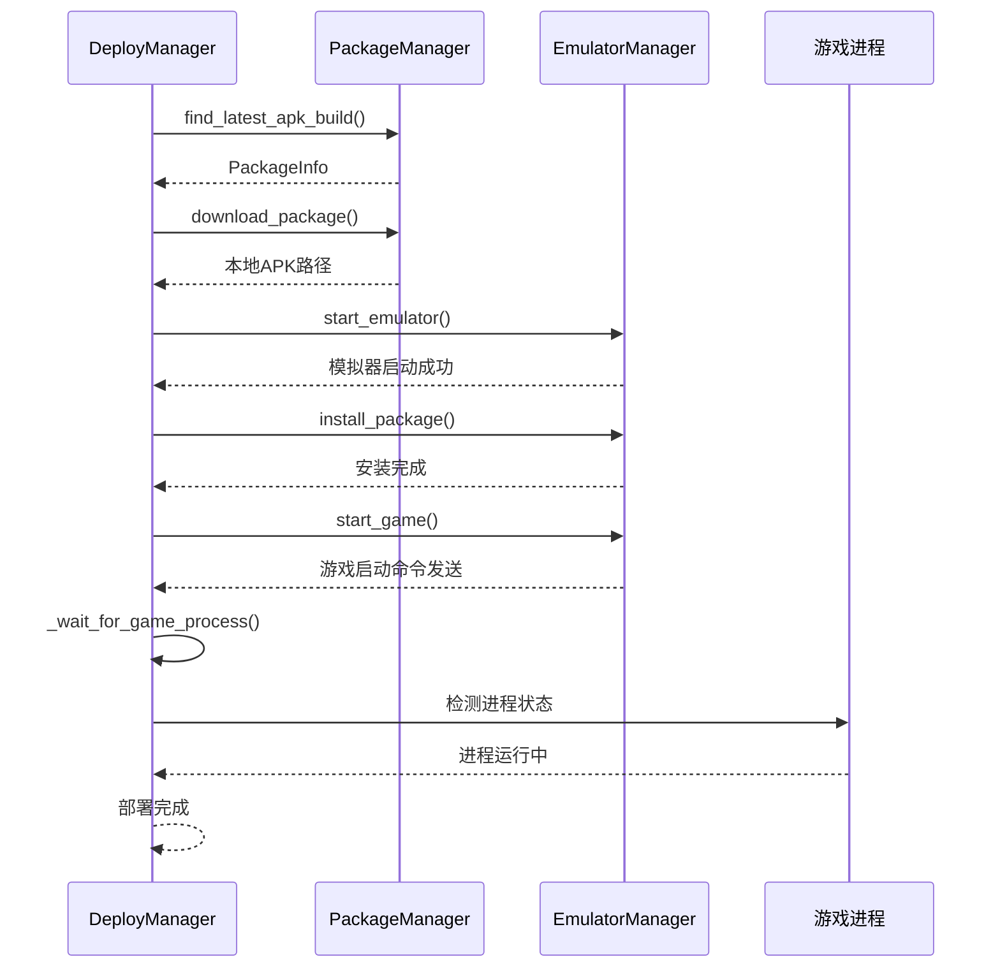
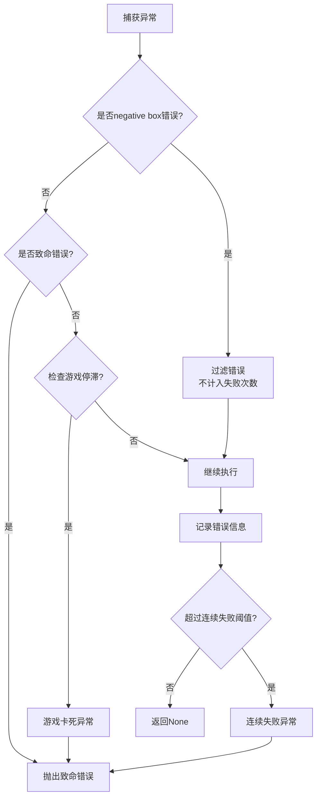
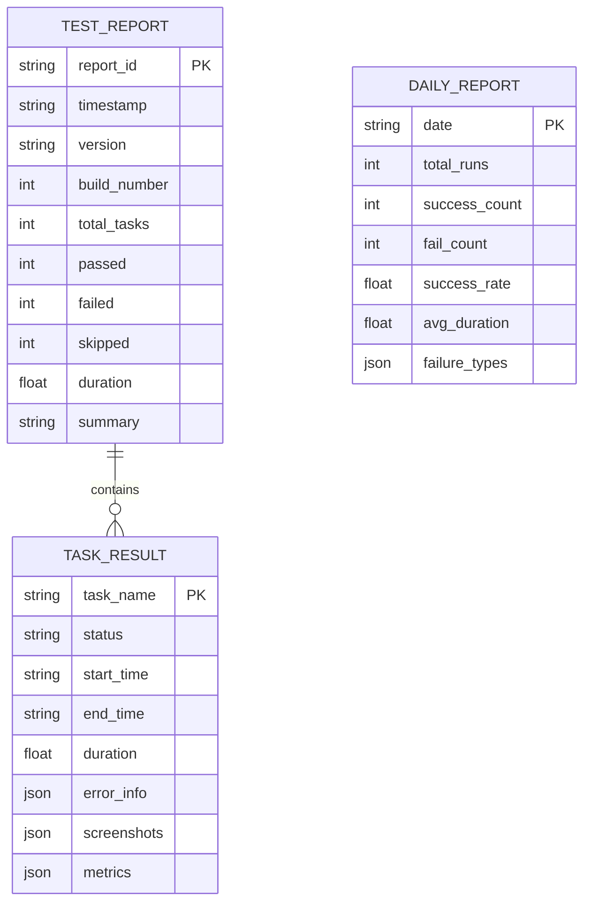
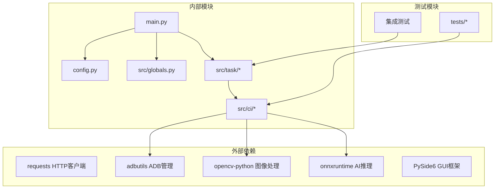

# 质量保证技能

<cite>
**本文档引用的文件**
- [README.md](file://README.md)
- [main.py](file://main.py)
- [config.py](file://config.py)
- [requirements.txt](file://requirements.txt)
- [src/globals.py](file://src/globals.py)
- [src/task/CITestTask.py](file://src/task/CITestTask.py)
- [src/ci/deploy_manager.py](file://src/ci/deploy_manager.py)
- [src/ci/package_manager.py](file://src/ci/package_manager.py)
- [src/ci/emulator_manager.py](file://src/ci/emulator_manager.py)
- [src/ci/test_result_manager.py](file://src/ci/test_result_manager.py)
- [src/ci/exception_handler.py](file://src/ci/exception_handler.py)
- [src/ci/exceptions.py](file://src/ci/exceptions.py)
- [configs/CITestTask.json](file://configs/CITestTask.json)
- [tests/test_autologin_task.py](file://tests/test_autologin_task.py)
- [tests/test_ci_modules.py](file://tests/test_ci_modules.py)
</cite>

## 目录
1. [简介](#简介)
2. [项目结构](#项目结构)
3. [核心组件](#核心组件)
4. [架构概览](#架构概览)
5. [详细组件分析](#详细组件分析)
6. [依赖关系分析](#依赖关系分析)
7. [性能考虑](#性能考虑)
8. [故障排除指南](#故障排除指南)
9. [结论](#结论)
10. [附录](#附录)

## 简介

ok-jump是一个基于ok-script框架开发的自动化测试工具，专注于游戏自动化测试和质量保证。该项目实现了完整的CI/CD测试流水线，包括模拟器管理、包下载、游戏启动、自动化测试执行和结果报告等功能。

该项目的核心价值在于提供了一套完整的质量保证解决方案，能够自动化执行测试任务、监控测试结果、处理异常情况，并通过企业微信通知机制及时反馈测试状态。

## 项目结构

项目采用模块化的架构设计，主要分为以下几个核心部分：

**图表来源**
- [main.py:1-693](file://main.py#L1-L693)
- [config.py:1-146](file://config.py#L1-L146)

**章节来源**
- [README.md:1-8](file://README.md#L1-L8)
- [main.py:1-693](file://main.py#L1-L693)
- [config.py:1-146](file://config.py#L1-L146)

## 核心组件

### 1. 主应用程序入口

主程序负责初始化整个系统，包括配置加载、补丁应用、设备管理和任务调度等核心功能。

**关键特性：**
- 智能设备选择机制
- 多种系统补丁修复
- 定时任务调度器
- 日志管理系统

### 2. CI自动化测试系统

CITestTask是整个质量保证系统的核心组件，实现了完整的CI流程：

**主要功能：**
- Jenkins集成和APK下载
- 雷电模拟器管理
- 游戏安装和启动
- 自动化测试执行
- 测试结果收集和报告

### 3. 部署管理器

DeployManager协调整个部署流程，确保测试环境的正确配置和准备。

**核心流程：**
1. 从Jenkins获取最新构建
2. 启动模拟器实例
3. 安装游戏包
4. 启动游戏进程
5. 触发测试任务

### 4. 异常处理系统

SmartTaskExecutor提供了智能的异常处理机制，能够区分致命错误和可恢复错误。

**处理策略：**
- 过滤无害的OCR错误
- 检测游戏卡死状态
- 连续失败阈值控制
- 自动恢复机制

**章节来源**
- [main.py:659-693](file://main.py#L659-L693)
- [src/task/CITestTask.py:26-273](file://src/task/CITestTask.py#L26-L273)
- [src/ci/deploy_manager.py:38-428](file://src/ci/deploy_manager.py#L38-L428)
- [src/ci/exception_handler.py:165-329](file://src/ci/exception_handler.py#L165-L329)

## 架构概览

系统采用分层架构设计，确保各组件间的松耦合和高内聚：

**图表来源**
- [src/task/CITestTask.py:146-273](file://src/task/CITestTask.py#L146-L273)
- [src/ci/deploy_manager.py:123-308](file://src/ci/deploy_manager.py#L123-L308)
- [src/ci/test_result_manager.py:102-131](file://src/ci/test_result_manager.py#L102-L131)

## 详细组件分析

### CI测试任务系统

CITestTask实现了完整的自动化测试流程，具有以下特点：

#### 1. 配置管理系统

系统支持多种配置来源，确保灵活性和可维护性：

**图表来源**
- [src/task/CITestTask.py:274-342](file://src/task/CITestTask.py#L274-L342)

#### 2. 重试机制设计

系统实现了智能的重试机制，能够在测试失败时自动恢复：

**重试策略：**
- 支持多次重试配置
- 账号递增机制
- 重试间隔控制
- 连续失败阈值

#### 3. 环境隔离机制

为了确保测试的独立性和可靠性，系统实现了完善的环境隔离：

**隔离措施：**
- 设备连接状态重置
- AutoCombatTask状态清理
- 临时文件清理
- 环境变量重置

**章节来源**
- [src/task/CITestTask.py:146-273](file://src/task/CITestTask.py#L146-L273)
- [src/task/CITestTask.py:648-747](file://src/task/CITestTask.py#L648-L747)

### 部署管理器分析

DeployManager是系统的核心协调组件，负责整个部署流程的管理：

#### 1. 包管理流程

**图表来源**
- [src/ci/package_manager.py:37-380](file://src/ci/package_manager.py#L37-L380)

#### 2. 模拟器管理功能

EmulatorManager提供了完整的模拟器生命周期管理：

**核心功能：**
- 模拟器启动和停止
- ADB设备连接管理
- 游戏包安装和卸载
- 游戏进程监控

#### 3. 部署流程控制

**图表来源**
- [src/ci/deploy_manager.py:123-246](file://src/ci/deploy_manager.py#L123-L246)
- [src/ci/emulator_manager.py:90-158](file://src/ci/emulator_manager.py#L90-L158)

**章节来源**
- [src/ci/deploy_manager.py:38-428](file://src/ci/deploy_manager.py#L38-L428)
- [src/ci/emulator_manager.py:39-457](file://src/ci/emulator_manager.py#L39-L457)
- [src/ci/package_manager.py:37-380](file://src/ci/package_manager.py#L37-L380)

### 异常处理系统

SmartTaskExecutor提供了智能的异常处理机制：

#### 1. 错误分类和处理

**图表来源**
- [src/ci/exception_handler.py:190-239](file://src/ci/exception_handler.py#L190-L239)

#### 2. 游戏状态监控

GameActivityDetector通过帧哈希技术监控游戏状态：

**监控机制：**
- 帧哈希计算
- 相似度比较
- 停滞时间检测
- 自适应阈值调整

#### 3. 失败报告生成

ExceptionHandler提供了完整的失败信息收集和报告生成功能：

**报告内容：**
- 错误类型和消息
- 堆栈跟踪信息
- 截图和日志
- 执行上下文

**章节来源**
- [src/ci/exception_handler.py:165-493](file://src/ci/exception_handler.py#L165-L493)
- [src/ci/exceptions.py:8-46](file://src/ci/exceptions.py#L8-L46)

### 测试结果管理系统

TestResultManager负责测试结果的存储、查询和报告生成：

#### 1. 数据结构设计

**图表来源**
- [src/ci/test_result_manager.py:22-72](file://src/ci/test_result_manager.py#L22-L72)

#### 2. 报告生成流程

系统支持多种报告格式和输出方式：

**报告类型：**
- 详细测试报告
- 每日汇总报告
- 历史趋势分析
- 失败原因统计

**章节来源**
- [src/ci/test_result_manager.py:73-327](file://src/ci/test_result_manager.py#L73-L327)

## 依赖关系分析

项目采用了模块化的依赖设计，确保各组件间的清晰边界：

**图表来源**
- [requirements.txt:1-17](file://requirements.txt#L1-L17)
- [main.py:17-19](file://main.py#L17-L19)

**章节来源**
- [requirements.txt:1-17](file://requirements.txt#L1-L17)
- [main.py:1-693](file://main.py#L1-L693)

## 性能考虑

### 1. 资源管理优化

系统实现了多种资源管理策略：

**内存管理：**
- YOLO模型的延迟加载
- OCR缓存的有效期控制
- 全局状态的及时清理

**I/O优化：**
- 日志文件的异步写入
- 截图文件的压缩存储
- 结果数据的批量处理

### 2. 并发处理机制

系统支持多任务并发执行：

**任务调度：**
- 定时任务的精确控制
- 任务间的资源隔离
- 执行状态的实时监控

**资源竞争：**
- ADB连接的互斥访问
- 文件系统的锁机制
- 内存使用的监控

### 3. 性能监控

系统内置了性能监控和诊断功能：

**监控指标：**
- CPU和内存使用率
- 网络I/O统计
- 磁盘空间监控
- 网络连接状态

## 故障排除指南

### 1. 常见问题诊断

#### ADB连接问题

**症状：** 模拟器无法连接或设备状态异常

**解决步骤：**
1. 检查ADB服务状态
2. 验证端口配置正确性
3. 重启ADB服务
4. 检查防火墙设置

#### 模拟器启动失败

**症状：** 模拟器无法启动或启动后立即退出

**排查方法：**
1. 验证模拟器路径配置
2. 检查系统兼容性
3. 确认端口未被占用
4. 查看模拟器日志

#### 测试任务超时

**症状：** 测试任务执行超时或中途失败

**处理方案：**
1. 增加超时配置
2. 检查网络连接稳定性
3. 验证Jenkins服务可用性
4. 清理临时文件

### 2. 日志分析技巧

系统提供了丰富的日志信息用于问题诊断：

**日志级别：**
- DEBUG: 详细的技术信息
- INFO: 一般操作信息
- WARNING: 需要注意的问题
- ERROR: 错误和异常

**分析要点：**
1. 关注异常堆栈信息
2. 检查时间戳和顺序
3. 分析错误频率和模式
4. 对比正常和异常场景

### 3. 系统恢复机制

系统具备自动恢复能力：

**自动重试：**
- 支持配置化的重试次数
- 指数退避策略
- 失败阈值控制

**环境恢复：**
- 自动清理临时文件
- 状态重置机制
- 资源释放检查

**章节来源**
- [src/ci/exception_handler.py:240-299](file://src/ci/exception_handler.py#L240-L299)
- [src/task/CITestTask.py:166-212](file://src/task/CITestTask.py#L166-L212)

## 结论

ok-jump项目提供了一个完整的游戏自动化测试解决方案，具有以下优势：

### 核心价值

1. **完整的CI/CD集成**：从Jenkins到测试执行的全流程自动化
2. **智能异常处理**：能够区分和处理不同类型的问题
3. **灵活的配置管理**：支持多种配置来源和动态更新
4. **强大的监控能力**：实时监控测试状态和系统健康度

### 技术特色

1. **模块化设计**：清晰的组件分离和职责划分
2. **可扩展性**：易于添加新的测试任务和功能
3. **稳定性**：完善的错误处理和恢复机制
4. **可观测性**：全面的日志记录和状态监控

### 应用前景

该系统适用于各种游戏和应用的自动化测试场景，能够显著提高测试效率和质量保证水平。通过持续改进和功能扩展，可以进一步提升系统的智能化程度和自动化水平。

## 附录

### 配置文件说明

系统使用多个配置文件来管理不同的设置：

**核心配置文件：**
- `configs/CITestTask.json`: CI测试任务配置
- `configs/devices.json`: 设备配置
- `configs/_ok.json`: ok-script框架配置

**配置优先级：**
1. 环境变量
2. 配置文件
3. 程序默认值

### 测试策略

项目包含了完整的测试体系：

**单元测试：**
- CI模块的单元测试
- 业务逻辑的测试覆盖
- 边界条件的验证

**集成测试：**
- 端到端的流程测试
- 外部系统集成测试
- 性能和压力测试

**章节来源**
- [configs/CITestTask.json:1-29](file://configs/CITestTask.json#L1-L29)
- [tests/test_ci_modules.py:1-469](file://tests/test_ci_modules.py#L1-L469)
- [tests/test_autologin_task.py:1-407](file://tests/test_autologin_task.py#L1-L407)