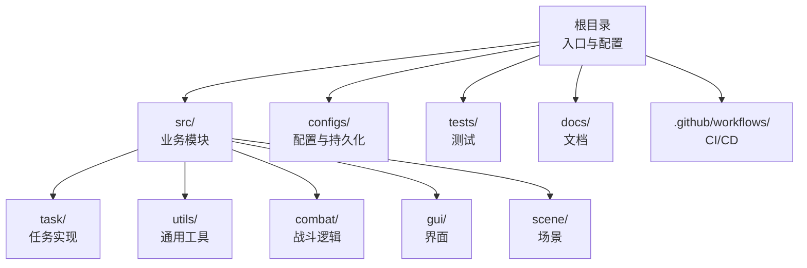
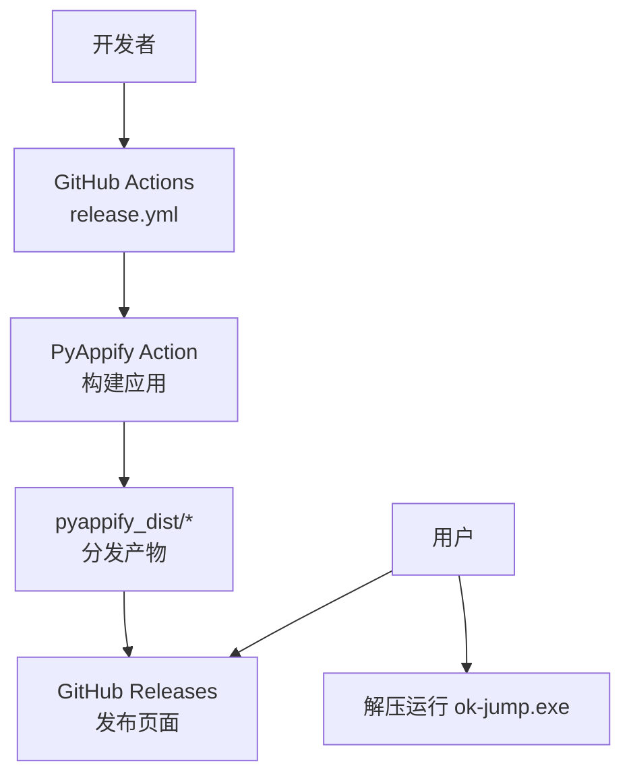
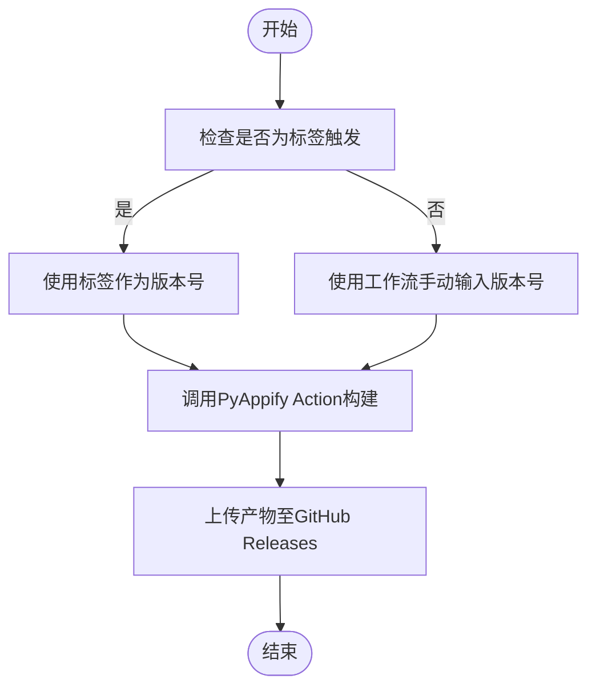
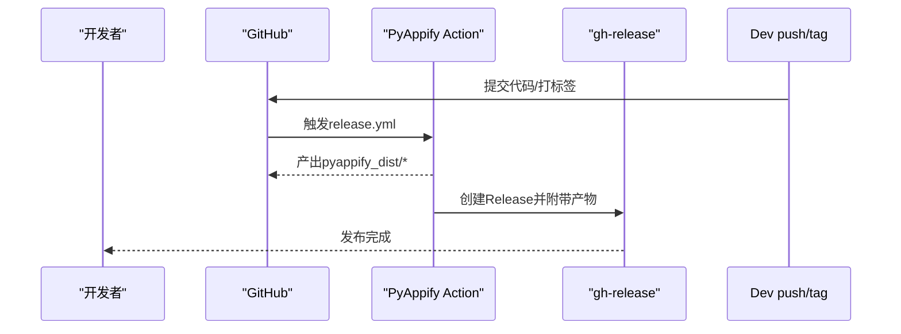
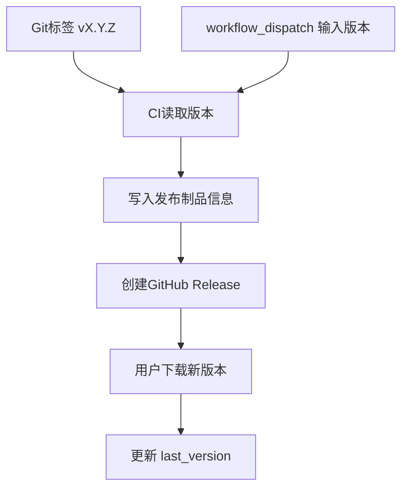
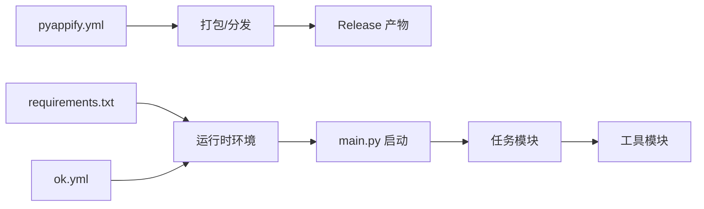

# 部署与分发

<cite>
**本文引用的文件**
- [requirements.txt](file://requirements.txt)
- [ok.yml](file://ok.yml)
- [pyappify.yml](file://pyappify.yml)
- [main.py](file://main.py)
- [main_debug.py](file://main_debug.py)
- [config.py](file://config.py)
- [.github/workflows/release.yml](file://.github/workflows/release.yml)
- [configs/_ok.json](file://configs/_ok.json)
- [configs/devices.json](file://configs/devices.json)
- [configs/main_window.json](file://configs/main_window.json)
- [src/utils/DeviceDetector.py](file://src/utils/DeviceDetector.py)
- [src/task/AutoLoginTask.py](file://src/task/AutoLoginTask.py)
- [tests/test_autologin_task.py](file://tests/test_autologin_task.py)
- [README.md](file://README.md)
- [docs/AutoLoginTask.md](file://docs/AutoLoginTask.md)
</cite>

## 目录
1. [简介](#简介)
2. [项目结构](#项目结构)
3. [核心组件](#核心组件)
4. [架构总览](#架构总览)
5. [详细组件分析](#详细组件分析)
6. [依赖分析](#依赖分析)
7. [性能考虑](#性能考虑)
8. [故障排查指南](#故障排查指南)
9. [结论](#结论)
10. [附录](#附录)

## 简介
本文件面向OK-Jump项目的部署与分发，围绕依赖包管理策略与版本控制、打包配置与构建流程、分发策略与实施方法、版本管理与更新机制、跨平台部署注意事项与最佳实践，以及发布流程、质量保证与用户支持建议展开。目标是帮助维护者与使用者以一致、可靠的方式交付与升级应用。

## 项目结构
OK-Jump采用“框架+业务模块”的组织方式：
- 根目录包含入口脚本、配置文件、依赖清单与CI工作流
- src目录按功能域划分：task（任务）、utils（工具）、combat（战斗）、controller/gui（界面）、scene（场景）
- configs目录存放运行期配置与持久化数据
- tests目录提供单元测试样例
- docs目录包含使用与开发文档

**图表来源**
- [main.py](file://main.py)
- [config.py](file://config.py)
- [requirements.txt](file://requirements.txt)

**章节来源**
- [README.md](file://README.md)
- [main.py](file://main.py)
- [config.py](file://config.py)

## 核心组件
- 入口与启动
  - main.py负责智能设备选择、启动控制器补丁、日志导出与OK框架初始化
  - main_debug.py提供无GUI调试模式
- 配置中心
  - config.py集中定义全局配置、窗口参数、OCR/模板匹配、ADB与分辨率适配、任务注册等
- 设备检测
  - DeviceDetector提供PC端与模拟器ADB连接状态检测，支撑智能默认设备选择
- 任务与测试
  - AutoLoginTask实现登录全流程；tests/test_autologin_task.py提供覆盖样例

**章节来源**
- [main.py](file://main.py)
- [main_debug.py](file://main_debug.py)
- [config.py](file://config.py)
- [src/utils/DeviceDetector.py](file://src/utils/DeviceDetector.py)
- [src/task/AutoLoginTask.py](file://src/task/AutoLoginTask.py)
- [tests/test_autologin_task.py](file://tests/test_autologin_task.py)

## 架构总览
OK-Jump的部署与分发围绕以下关键点：
- 依赖管理：通过requirements.txt统一声明，ok.yml与pyappify.yml分别定义运行时与打包时的Python版本与依赖来源
- 构建与打包：使用PyAppify Action在CI中生成可执行分发包
- 分发策略：GitHub Releases发布，区分“中国版”（国内镜像源）与“Debug”版本
- 版本管理：通过Git标签驱动发布版本号，配合配置文件记录最后版本

**图表来源**
- [.github/workflows/release.yml](file://.github/workflows/release.yml)
- [pyappify.yml](file://pyappify.yml)

**章节来源**
- [.github/workflows/release.yml](file://.github/workflows/release.yml)
- [pyappify.yml](file://pyappify.yml)

## 详细组件分析

### 依赖包管理与版本控制
- Python版本
  - 运行时要求：3.12（ok.yml）
  - 打包时要求：3.12（pyappify.yml）
- 依赖清单
  - requirements.txt声明核心依赖（图形识别、OCR、GUI、ADB、输入模拟、ONNX推理、剪贴板、繁简转换等）
  - pyappify.yml通过pip_args指定国内镜像源，提升安装速度
- 版本控制策略
  - 通过Git标签（如vX.Y.Z）驱动CI发布流程，版本号来源于标签或手动输入
  - 应用内部版本号在config.py中维护，便于运行期展示与更新判断

**图表来源**
- [.github/workflows/release.yml](file://.github/workflows/release.yml)

**章节来源**
- [requirements.txt](file://requirements.txt)
- [ok.yml](file://ok.yml)
- [pyappify.yml](file://pyappify.yml)
- [config.py](file://config.py)
- [.github/workflows/release.yml](file://.github/workflows/release.yml)

### 打包配置与构建流程
- ok.yml
  - profiles定义默认与调试两种构建档案：main_script、admin权限、requirements来源
- pyappify.yml
  - 定义“China”与“Debug”两个打包档案
  - 指定main_script、requires_python、requirements、pip镜像源、是否使用pythonw等
  - 通过环境变量GITHUB_TOKEN访问私有仓库（若适用）
- 构建产物
  - CI工作流将产物输出到pyappify_dist/*，并通过gh-release发布

**图表来源**
- [.github/workflows/release.yml](file://.github/workflows/release.yml)
- [pyappify.yml](file://pyappify.yml)

**章节来源**
- [ok.yml](file://ok.yml)
- [pyappify.yml](file://pyappify.yml)
- [.github/workflows/release.yml](file://.github/workflows/release.yml)

### 分发策略与实施
- 发布渠道
  - GitHub Releases：提供下载说明、安装说明与更新内容
- 版本区分
  - China版：使用国内镜像源，适合国内网络环境
  - Debug版：启用调试模式，便于问题定位
- 用户交付
  - 解压后运行ok-jump.exe即可启动

**章节来源**
- [.github/workflows/release.yml](file://.github/workflows/release.yml)

### 版本管理与更新机制
- 版本来源
  - Git标签：vX.Y.Z
  - 工作流手动输入：workflow_dispatch
- 应用内版本
  - config.py中的version字段用于显示与更新判断
  - configs/main_window.json记录last_version，可用于“上次版本”比较与引导更新

**图表来源**
- [.github/workflows/release.yml](file://.github/workflows/release.yml)
- [config.py](file://config.py)
- [configs/main_window.json](file://configs/main_window.json)

**章节来源**
- [.github/workflows/release.yml](file://.github/workflows/release.yml)
- [config.py](file://config.py)
- [configs/main_window.json](file://configs/main_window.json)

### 跨平台部署注意事项与最佳实践
- 平台与环境
  - 运行时要求：Windows 10/11，Python 3.12
  - GUI与输入：PySide6、pywin32、pydirectinput
  - 图像与OCR：OpenCV、onnxruntime、onnxruntime-directml、onnxocr
- 设备与ADB
  - ADB连接用于模拟器自动化；DeviceDetector提供PC与ADB状态检测
- 后台模式与窗口交互
  - 支持伪最小化、后台静音、窗口标题/类名识别与交互方式选择
- 镜像源与网络
  - pyappify.yml使用阿里云镜像源，提升依赖安装稳定性

**章节来源**
- [README.md](file://README.md)
- [config.py](file://config.py)
- [src/utils/DeviceDetector.py](file://src/utils/DeviceDetector.py)
- [pyappify.yml](file://pyappify.yml)

### 发布流程、质量保证与用户支持建议
- 发布流程
  - 本地验证通过后打标签或手动触发工作流
  - CI自动构建并发布Release
- 质量保证
  - 单元测试：tests/test_autologin_task.py提供典型场景断言与异常路径覆盖思路
  - 文档：docs/AutoLoginTask.md提供任务配置与运行流程说明
- 用户支持
  - README提供快速开始、环境要求与配置说明
  - 应用内日志导出（main.py导出logs压缩包）便于问题定位

**章节来源**
- [.github/workflows/release.yml](file://.github/workflows/release.yml)
- [tests/test_autologin_task.py](file://tests/test_autologin_task.py)
- [docs/AutoLoginTask.md](file://docs/AutoLoginTask.md)
- [README.md](file://README.md)
- [main.py](file://main.py)

## 依赖分析
OK-Jump的依赖关系主要体现在运行时与打包时的双通道配置：
- 运行时依赖：requirements.txt
- 打包时依赖：ok.yml与pyappify.yml共同约束Python版本与依赖来源
- 关键外部能力：ADB（设备连接）、OCR（文字识别）、GUI（界面）、ONNX（推理）

**图表来源**
- [requirements.txt](file://requirements.txt)
- [ok.yml](file://ok.yml)
- [pyappify.yml](file://pyappify.yml)
- [main.py](file://main.py)

**章节来源**
- [requirements.txt](file://requirements.txt)
- [ok.yml](file://ok.yml)
- [pyappify.yml](file://pyappify.yml)
- [main.py](file://main.py)

## 性能考虑
- 后台模式与窗口交互
  - 通过伪最小化与后台输入减少前台干扰，降低CPU/GPU占用
- OCR与模板匹配
  - 合理设置阈值与缓存，避免重复OCR开销
- 加载检测与容错
  - AutoLoginTask内置加载百分比检测与停滞超时，避免无效点击与资源浪费
- 分辨率与窗口大小
  - config.py中支持参考分辨率与窗口尺寸，有助于稳定识别

**章节来源**
- [config.py](file://config.py)
- [src/task/AutoLoginTask.py](file://src/task/AutoLoginTask.py)

## 故障排查指南
- 日志导出
  - main.py提供导出logs为zip的功能，便于收集问题证据
- 设备选择异常
  - 检查configs/devices.json的preferred与selected字段，必要时通过智能设备选择逻辑切换
- 登录流程异常
  - 参考AutoLoginTask的场景识别与OCR回退逻辑，结合测试用例定位问题
- CI构建失败
  - 检查GITHUB_TOKEN权限、镜像源可达性与依赖版本兼容性

**章节来源**
- [main.py](file://main.py)
- [configs/devices.json](file://configs/devices.json)
- [src/task/AutoLoginTask.py](file://src/task/AutoLoginTask.py)
- [tests/test_autologin_task.py](file://tests/test_autologin_task.py)
- [.github/workflows/release.yml](file://.github/workflows/release.yml)

## 结论
OK-Jump的部署与分发体系以清晰的依赖管理、稳定的CI构建与明确的版本控制为核心，辅以设备检测与后台模式优化，满足自动化任务在Windows平台上的高效运行。通过规范化的发布流程与质量保障措施，可确保用户获得一致、可靠的使用体验。

## 附录
- 快速开始与配置说明参见README与AutoLoginTask文档
- 配置持久化示例：_ok.json、devices.json、main_window.json

**章节来源**
- [README.md](file://README.md)
- [docs/AutoLoginTask.md](file://docs/AutoLoginTask.md)
- [configs/_ok.json](file://configs/_ok.json)
- [configs/devices.json](file://configs/devices.json)
- [configs/main_window.json](file://configs/main_window.json)