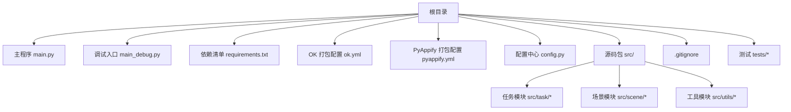
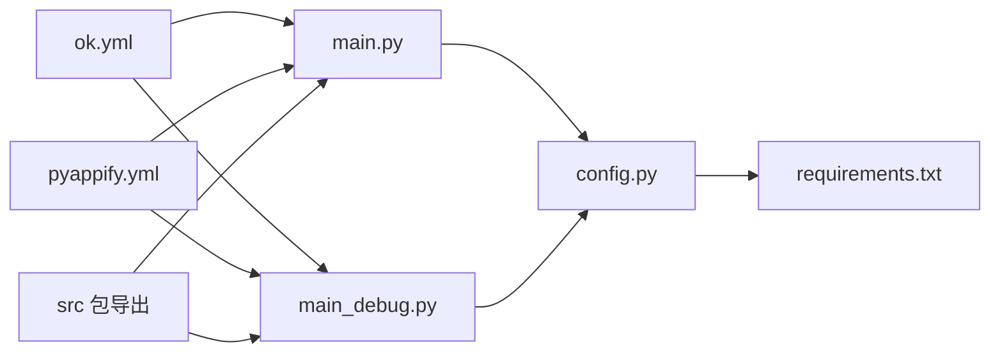
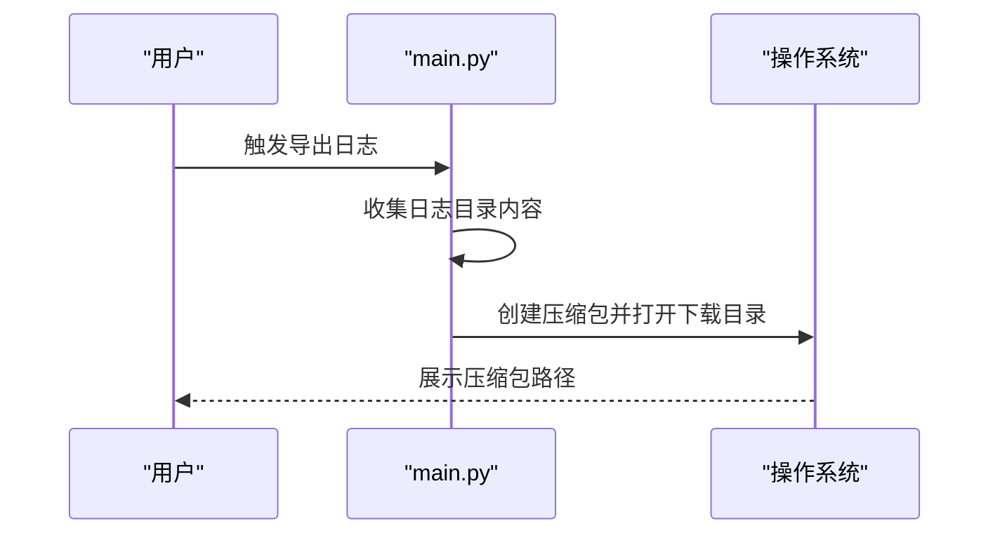
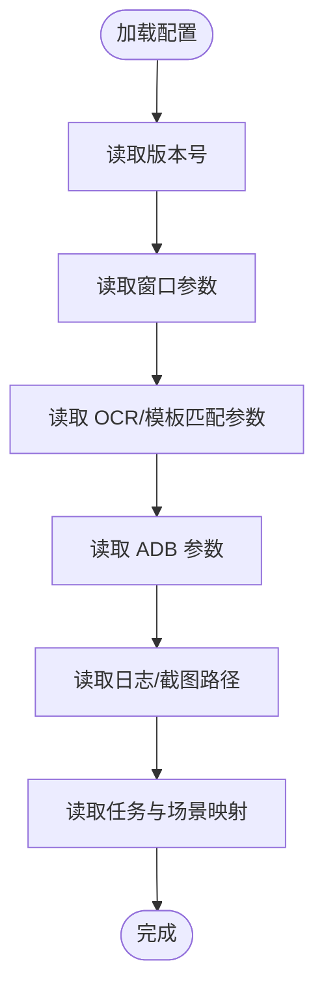
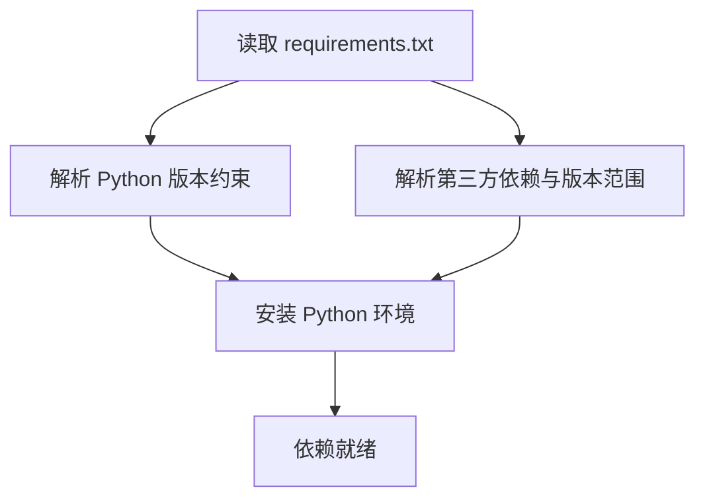
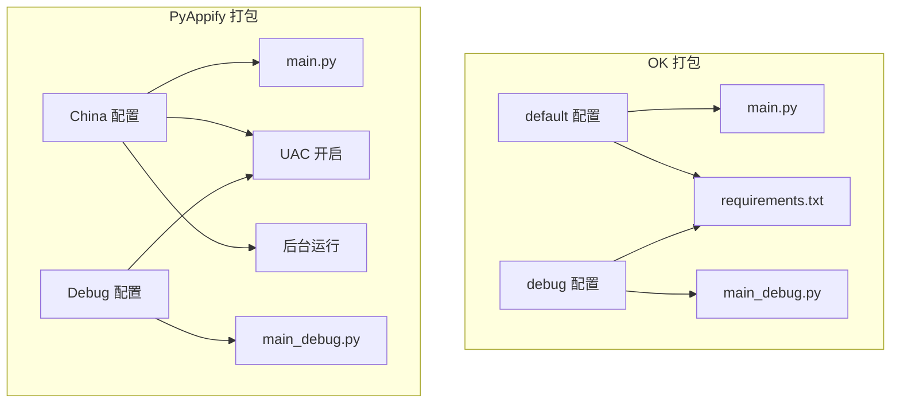
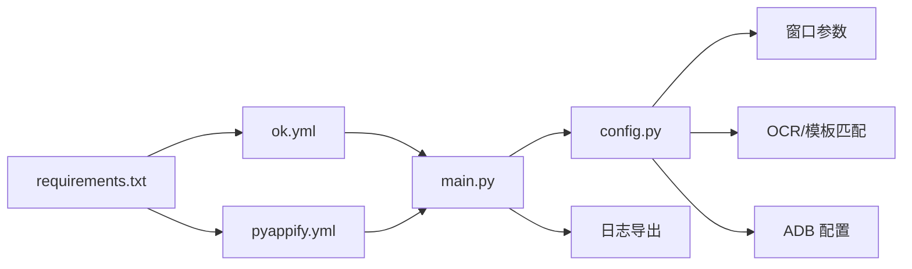

# 部署和分发

<cite>
**本文引用的文件**
- [requirements.txt](file://requirements.txt)
- [ok.yml](file://ok.yml)
- [pyappify.yml](file://pyappify.yml)
- [main.py](file://main.py)
- [main_debug.py](file://main_debug.py)
- [config.py](file://config.py)
- [.gitignore](file://.gitignore)
- [src/__init__.py](file://src/__init__.py)
- [src/task/BaseJumpTask.py](file://src/task/BaseJumpTask.py)
- [tests/test_autologin_task.py](file://tests/test_autologin_task.py)
</cite>

## 目录
1. [简介](#简介)
2. [项目结构](#项目结构)
3. [核心组件](#核心组件)
4. [架构总览](#架构总览)
5. [详细组件分析](#详细组件分析)
6. [依赖分析](#依赖分析)
7. [性能考虑](#性能考虑)
8. [故障排查指南](#故障排查指南)
9. [结论](#结论)
10. [附录](#附录)

## 简介
本文件面向“部署与分发”主题，基于仓库中的配置与入口文件，系统梳理打包配置、依赖管理策略、版本发布流程、自动化部署机制、多平台分发与安装包制作、更新机制与版本兼容性处理、部署优化与性能监控建议，以及扩展部署流程与优化分发效率的技术指导。文档严格依据仓库中现有文件进行分析与说明。

## 项目结构
本项目采用以应用入口为中心的组织方式，核心运行入口位于根目录的主程序与调试入口；打包与分发相关的关键配置集中在顶层 YAML 文件；依赖声明集中于 requirements.txt；配置中心位于 config.py；日志导出逻辑集成在主程序中；全局模块导出位于 src 包初始化文件；测试覆盖了关键业务流程。

图表来源
- [main.py:1-33](file://main.py#L1-L33)
- [main_debug.py:1-16](file://main_debug.py#L1-L16)
- [requirements.txt:1-13](file://requirements.txt#L1-L13)
- [ok.yml:1-12](file://ok.yml#L1-L12)
- [pyappify.yml:1-19](file://pyappify.yml#L1-L19)
- [config.py:1-138](file://config.py#L1-L138)
- [src/__init__.py:1-31](file://src/__init__.py#L1-L31)
- [.gitignore:1-56](file://.gitignore#L1-L56)
- [tests/test_autologin_task.py:1-407](file://tests/test_autologin_task.py#L1-L407)

章节来源
- [main.py:1-33](file://main.py#L1-L33)
- [main_debug.py:1-16](file://main_debug.py#L1-L16)
- [requirements.txt:1-13](file://requirements.txt#L1-L13)
- [ok.yml:1-12](file://ok.yml#L1-L12)
- [pyappify.yml:1-19](file://pyappify.yml#L1-L19)
- [config.py:1-138](file://config.py#L1-L138)
- [src/__init__.py:1-31](file://src/__init__.py#L1-L31)
- [.gitignore:1-56](file://.gitignore#L1-L56)
- [tests/test_autologin_task.py:1-407](file://tests/test_autologin_task.py#L1-L407)

## 核心组件
- 运行入口与日志导出
  - 主程序入口负责启动框架并扩展日志导出功能，便于问题定位与交付支持。
  - 调试入口用于非 GUI 场景下的快速验证与问题隔离。
- 配置中心
  - 提供版本号、窗口参数、OCR/模板匹配参数、ADB 配置、分辨率与窗口尺寸等关键参数，支撑跨平台适配与运行环境差异。
- 依赖管理
  - 明确声明 Python 版本要求与第三方库版本范围，确保安装一致性与可复现性。
- 打包配置
  - ok.yml 定义默认与调试两种运行配置，指定主脚本、管理员权限与依赖文件。
  - pyappify.yml 定义多地区/渠道打包配置，包含 UAC、主脚本、Python 版本、依赖文件、后台运行等参数。
- 源码包导出
  - src 包导出全局任务与场景类，便于统一导入与扩展。

章节来源
- [main.py:10-28](file://main.py#L10-L28)
- [main_debug.py:6-15](file://main_debug.py#L6-L15)
- [config.py:65-137](file://config.py#L65-L137)
- [requirements.txt:1-13](file://requirements.txt#L1-L13)
- [ok.yml:3-11](file://ok.yml#L3-L11)
- [pyappify.yml:3-19](file://pyappify.yml#L3-L19)
- [src/__init__.py:7-11](file://src/__init__.py#L7-L11)

## 架构总览
下图展示从入口到打包配置与依赖声明的整体关系，体现“入口脚本 → 配置中心 → 依赖声明 → 打包配置”的分层关系。

图表来源
- [main.py:30-33](file://main.py#L30-L33)
- [main_debug.py:6-15](file://main_debug.py#L6-L15)
- [config.py:1-138](file://config.py#L1-L138)
- [requirements.txt:1-13](file://requirements.txt#L1-L13)
- [ok.yml:3-11](file://ok.yml#L3-L11)
- [pyappify.yml:1-19](file://pyappify.yml#L1-L19)
- [src/__init__.py:7-11](file://src/__init__.py#L7-L11)

## 详细组件分析

### 组件一：入口与日志导出
- 功能要点
  - 主程序入口启动框架并注入日志导出方法，支持一键压缩并打开日志目录，便于用户反馈与问题定位。
  - 调试入口关闭 GUI，便于在命令行环境下快速验证核心流程。
- 关键路径
  - 日志导出函数定义与注册：[export_logs 与注册位置:10-28](file://main.py#L10-L28)
  - 主程序启动流程：[入口与框架启动:30-33](file://main.py#L30-L33)
  - 调试入口启动流程：[调试入口启动:6-15](file://main_debug.py#L6-L15)

图表来源
- [main.py:10-28](file://main.py#L10-L28)

章节来源
- [main.py:10-28](file://main.py#L10-L28)
- [main_debug.py:6-15](file://main_debug.py#L6-L15)

### 组件二：配置中心与版本管理
- 功能要点
  - 集中管理版本号、窗口标题与 EXE 名称、窗口交互参数、OCR 与模板匹配参数、ADB 配置、分辨率与窗口尺寸、日志与截图路径、一次性任务与触发任务列表、场景映射等。
  - 版本号位于配置中心，便于统一管理与发布标记。
- 关键路径
  - 版本号与全局配置项：[配置中心关键字段:65-73](file://config.py#L65-L73)
  - Windows 窗口参数与捕获方法：[Windows 配置:88-94](file://config.py#L88-L94)
  - OCR 参数与模板匹配参数：[OCR 与模板匹配:75-86](file://config.py#L75-L86)
  - 日志与截图路径：[日志与截图配置:119-122](file://config.py#L119-L122)

图表来源
- [config.py:65-137](file://config.py#L65-L137)

章节来源
- [config.py:65-137](file://config.py#L65-L137)

### 组件三：依赖管理策略
- 功能要点
  - 明确 Python 版本要求与第三方库版本范围，确保安装一致性与可复现性。
  - 依赖清单集中维护，便于 CI/CD 与本地开发环境同步。
- 关键路径
  - Python 版本与依赖声明：[依赖清单:1-13](file://requirements.txt#L1-L13)

图表来源
- [requirements.txt:1-13](file://requirements.txt#L1-L13)

章节来源
- [requirements.txt:1-13](file://requirements.txt#L1-L13)

### 组件四：打包配置与多渠道分发
- 功能要点
  - ok.yml 定义默认与调试两种运行配置，指定主脚本、管理员权限与依赖文件，便于区分生产与调试环境。
  - pyappify.yml 定义多地区/渠道打包配置，包含 UAC、主脚本、Python 版本、依赖文件、后台运行等参数，支持不同平台与分发渠道的差异化需求。
- 关键路径
  - OK 打包配置（默认/调试）：[ok.yml:3-11](file://ok.yml#L3-L11)
  - PyAppify 多渠道配置（含 UAC、后台运行等）：[pyappify.yml:3-19](file://pyappify.yml#L3-L19)

图表来源
- [ok.yml:3-11](file://ok.yml#L3-L11)
- [pyappify.yml:3-19](file://pyappify.yml#L3-L19)

章节来源
- [ok.yml:3-11](file://ok.yml#L3-L11)
- [pyappify.yml:3-19](file://pyappify.yml#L3-L19)

### 组件五：源码包导出与模块化
- 功能要点
  - src 包导出全局任务与场景类，便于统一导入与扩展，提升模块化与可维护性。
- 关键路径
  - 模块导出列表与全局实例：[src/__init__.py:7-11](file://src/__init__.py#L7-L11)

章节来源
- [src/__init__.py:7-11](file://src/__init__.py#L7-L11)

### 组件六：伪最小化与后台运行支持
- 功能要点
  - 通过任务基类方法访问后台管理器，实现伪最小化、恢复与可见性保障，支持后台截图与低占用运行。
- 关键路径
  - 伪最小化相关方法：[BaseJumpTask 伪最小化接口:276-294](file://src/task/BaseJumpTask.py#L276-L294)

章节来源
- [src/task/BaseJumpTask.py:276-294](file://src/task/BaseJumpTask.py#L276-L294)

## 依赖分析
- 依赖耦合与内聚
  - 入口脚本依赖配置中心与框架；配置中心集中管理运行参数；打包配置分别驱动 OK 与 PyAppify 的构建；依赖清单为安装阶段提供约束。
- 直接与间接依赖
  - 直接依赖：入口脚本直接依赖配置中心；配置中心依赖 OCR/模板匹配与窗口参数；打包配置依赖入口脚本与依赖清单。
  - 间接依赖：日志导出依赖操作系统文件系统；调试入口依赖 Qt 应用实例。
- 外部依赖与集成点
  - 第三方库通过 requirements.txt 管理；打包工具通过 ok.yml 与 pyappify.yml 驱动。
- 接口契约
  - 配置中心提供统一参数契约；入口脚本通过框架启动；打包配置通过主脚本与依赖清单落地。

图表来源
- [main.py:30-33](file://main.py#L30-L33)
- [config.py:88-122](file://config.py#L88-L122)
- [ok.yml:3-11](file://ok.yml#L3-L11)
- [pyappify.yml:3-19](file://pyappify.yml#L3-L19)
- [requirements.txt:1-13](file://requirements.txt#L1-L13)

章节来源
- [main.py:30-33](file://main.py#L30-L33)
- [config.py:88-122](file://config.py#L88-L122)
- [ok.yml:3-11](file://ok.yml#L3-L11)
- [pyappify.yml:3-19](file://pyappify.yml#L3-L19)
- [requirements.txt:1-13](file://requirements.txt#L1-L13)

## 性能考虑
- 后台模式与伪最小化
  - 通过伪最小化减少窗口交互开销，支持后台截图与低占用运行，适合长时间自动化任务。
- 触发间隔与资源占用
  - 配置中心提供触发间隔参数，适当增大可降低 CPU/GPU 使用率，平衡响应速度与资源消耗。
- 截图与 OCR
  - 合理设置模板匹配阈值与 OCR 参数，避免频繁高成本操作；必要时启用缓存与预处理以降低重复计算。
- 日志与磁盘 IO
  - 控制日志级别与轮转策略，避免大量小文件写入；导出日志时批量压缩，减少 IO 峰值。

章节来源
- [config.py:48-62](file://config.py#L48-L62)
- [config.py:83-86](file://config.py#L83-L86)
- [src/task/BaseJumpTask.py:276-294](file://src/task/BaseJumpTask.py#L276-L294)

## 故障排查指南
- 日志导出
  - 使用主程序的日志导出功能，一键生成压缩包并打开下载目录，便于收集问题证据。
- 调试入口
  - 在命令行环境下使用调试入口，关闭 GUI，快速验证核心流程与外部依赖。
- 依赖问题
  - 对照依赖清单核对安装环境与版本；确保 Python 版本满足要求。
- 打包问题
  - 根据 ok.yml 与 pyappify.yml 的配置核对主脚本、管理员权限、后台运行与 UAC 设置。
- 测试验证
  - 参考测试用例覆盖的关键流程，定位登录、问卷、OCR 识别等环节的异常。

章节来源
- [main.py:10-28](file://main.py#L10-L28)
- [main_debug.py:6-15](file://main_debug.py#L6-L15)
- [requirements.txt:1-13](file://requirements.txt#L1-L13)
- [ok.yml:3-11](file://ok.yml#L3-L11)
- [pyappify.yml:3-19](file://pyappify.yml#L3-L19)
- [tests/test_autologin_task.py:1-407](file://tests/test_autologin_task.py#L1-L407)

## 结论
本项目以清晰的入口脚本、集中式配置中心、明确的依赖清单与两套打包配置为核心，形成“入口 → 配置 → 依赖 → 打包”的标准化分发链路。结合伪最小化、触发间隔与日志导出等机制，可在保证稳定性的同时兼顾性能与可维护性。后续可在 CI/CD 中固化打包流程，并引入版本号自增与变更记录，进一步完善自动化发布与回滚能力。

## 附录

### 版本发布流程与自动化部署建议
- 版本号管理
  - 在配置中心统一维护版本号，发布前更新并提交变更记录。
- 自动化打包
  - 使用 ok.yml 与 pyappify.yml 驱动多渠道打包，结合 CI/CD 平台执行安装与回归测试。
- 发布物归档
  - 将安装包与日志导出工具一并归档，便于问题追踪与回溯。

章节来源
- [config.py:71-71](file://config.py#L71-L71)
- [ok.yml:3-11](file://ok.yml#L3-L11)
- [pyappify.yml:3-19](file://pyappify.yml#L3-L19)

### 不同平台的分发方式与安装包制作
- Windows 平台
  - 利用打包配置启用 UAC 与后台运行，适配不同地区/渠道的差异化需求。
- 安装包制作
  - 以主脚本与依赖清单为基础，结合打包配置生成可执行安装包，确保管理员权限与运行时环境一致。

章节来源
- [pyappify.yml:2-19](file://pyappify.yml#L2-L19)
- [ok.yml:3-11](file://ok.yml#L3-L11)

### 更新机制与版本兼容性处理
- 版本标记
  - 通过配置中心版本号统一标识发布版本，便于客户端检测与提示升级。
- 兼容性策略
  - 在依赖清单中保留兼容版本范围，避免因次要版本升级导致的不兼容；在打包配置中针对不同渠道设置差异化参数。

章节来源
- [config.py:71-71](file://config.py#L71-L71)
- [requirements.txt:1-13](file://requirements.txt#L1-L13)

### 部署优化与性能监控建议
- 部署优化
  - 合理设置触发间隔与后台模式，减少资源占用；启用伪最小化以提升后台运行稳定性。
- 性能监控
  - 结合日志导出与测试用例，持续监控关键流程耗时与失败率，及时发现性能退化与回归问题。

章节来源
- [config.py:48-62](file://config.py#L48-L62)
- [main.py:10-28](file://main.py#L10-L28)
- [tests/test_autologin_task.py:1-407](file://tests/test_autologin_task.py#L1-L407)