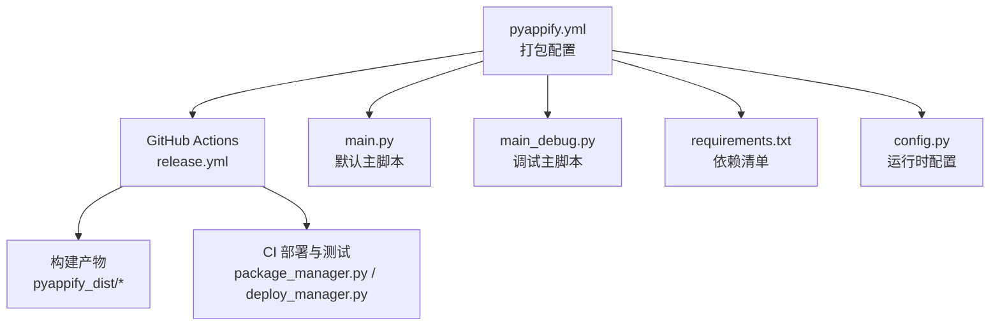
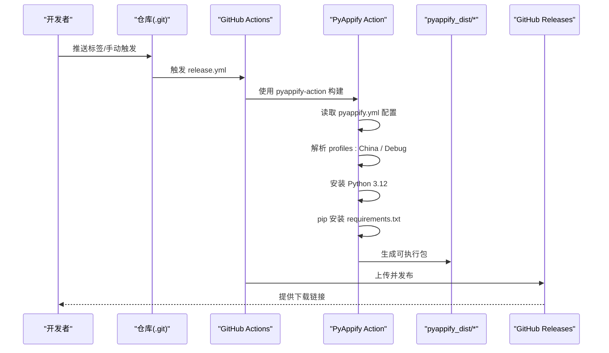
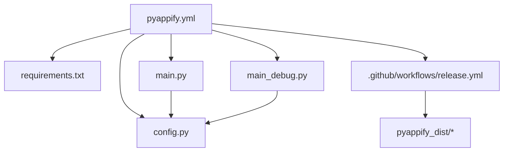

# 打包配置

<cite>
**本文引用的文件**
- [pyappify.yml](file://pyappify.yml)
- [requirements.txt](file://requirements.txt)
- [main.py](file://main.py)
- [main_debug.py](file://main_debug.py)
- [config.py](file://config.py)
- [.github/workflows/release.yml](file://.github/workflows/release.yml)
- [src/ci/exception_handler.py](file://src/ci/exception_handler.py)
- [src/ci/exceptions.py](file://src/ci/exceptions.py)
- [src/task/CITestTask.py](file://src/task/CITestTask.py)
- [src/ci/package_manager.py](file://src/ci/package_manager.py)
- [src/ci/deploy_manager.py](file://src/ci/deploy_manager.py)
- [.gitignore](file://.gitignore)
</cite>

## 目录
1. [简介](#简介)
2. [项目结构](#项目结构)
3. [核心组件](#核心组件)
4. [架构总览](#架构总览)
5. [详细组件分析](#详细组件分析)
6. [依赖关系分析](#依赖关系分析)
7. [性能考量](#性能考量)
8. [故障排除指南](#故障排除指南)
9. [结论](#结论)
10. [附录](#附录)

## 简介
本文件面向 ok-jump 项目的打包配置，重点解析 pyappify.yml 配置文件的各项参数，说明应用名称、UAC 设置、Git 仓库配置、主脚本选择、Python 版本要求、依赖管理、镜像源与 pip 参数、以及不同配置文件（China 与 Debug）的区别与用途。同时给出打包流程的完整步骤、最佳实践、常见问题与故障排除建议，帮助开发者高效稳定地产出可分发的 Windows 可执行程序。

## 项目结构
ok-jump 项目采用“配置驱动 + 主脚本入口”的打包方式，核心打包配置集中在 pyappify.yml 中，并通过 GitHub Actions 自动化构建发布。关键目录与文件如下：
- 配置层：pyappify.yml（打包配置）、requirements.txt（依赖清单）、config.py（运行时配置）
- 应用入口：main.py（默认主脚本）、main_debug.py（调试主脚本）
- CI/CD：.github/workflows/release.yml（构建与发布工作流）
- 日志与异常：src/ci/exception_handler.py、src/ci/exceptions.py
- CI 部署：src/ci/package_manager.py、src/ci/deploy_manager.py、src/task/CITestTask.py
- 忽略规则：.gitignore（含打包产物目录）

图表来源
- [pyappify.yml:1-18](file://pyappify.yml#L1-L18)
- [.github/workflows/release.yml:1-65](file://.github/workflows/release.yml#L1-L65)

章节来源
- [pyappify.yml:1-18](file://pyappify.yml#L1-L18)
- [.github/workflows/release.yml:1-65](file://.github/workflows/release.yml#L1-L65)
- [.gitignore:27-31](file://.gitignore#L27-L31)

## 核心组件
- 打包配置文件：pyappify.yml
  - 应用名称、UAC 权限、Git 仓库、主脚本、Python 版本、依赖文件、是否使用 pythonw、是否显示 Defender 添加提示、pip 参数等。
- 依赖清单：requirements.txt
  - 定义项目运行所需的第三方库及其版本范围。
- 运行时配置：config.py
  - 定义窗口、ADB、OCR、模板匹配、日志、任务列表等运行期参数。
- 主脚本：main.py（默认）、main_debug.py（调试）
  - main.py 启动 GUI 并进行多项框架补丁；main_debug.py 关闭 GUI，便于命令行调试。
- CI/CD：release.yml
  - 使用 pyappify-action 执行打包，自动发布到 GitHub Releases。

章节来源
- [pyappify.yml:1-18](file://pyappify.yml#L1-L18)
- [requirements.txt:1-17](file://requirements.txt#L1-L17)
- [config.py:68-145](file://config.py#L68-L145)
- [main.py:659-693](file://main.py#L659-L693)
- [main_debug.py:1-16](file://main_debug.py#L1-L16)
- [.github/workflows/release.yml:26-31](file://.github/workflows/release.yml#L26-L31)

## 架构总览
下图展示从配置到构建、再到发布的整体流程，以及不同打包配置文件（China 与 Debug）的差异与用途。

图表来源
- [.github/workflows/release.yml:14-65](file://.github/workflows/release.yml#L14-L65)
- [pyappify.yml:3-18](file://pyappify.yml#L3-L18)

## 详细组件分析

### pyappify.yml 配置项详解
- 应用名称与 UAC
  - name：应用名称，用于生成可执行文件名与安装标识。
  - uac：是否以管理员权限运行（true/false）。
- profiles 配置
  - China 配置
    - git_url：Git 仓库地址，用于构建时拉取源码。
    - admin：是否需要管理员权限（与 uac 类似）。
    - main_script：主脚本选择（main.py）。
    - requires_python：Python 版本要求（3.12）。
    - requirements：依赖清单文件（requirements.txt）。
    - use_pythonw：是否使用 pythonw（隐藏控制台，适合 GUI 应用）。
    - show_add_defender：是否显示添加 Windows Defender 白名单提示。
    - pip_args：pip 安装参数，包含镜像源、超时与重试策略。
  - Debug 配置
    - main_script：主脚本选择（main_debug.py）。
    - use_pythonw：false（显示控制台，便于调试输出）。
- 其他字段
  - 未显式设置的字段遵循 pyappify 默认行为（例如未设置时默认使用 pythonw，未设置镜像源时使用 pypi.org）。

章节来源
- [pyappify.yml:1-18](file://pyappify.yml#L1-L18)

### 依赖管理与 pip 参数
- 依赖清单
  - requirements.txt 定义了项目运行所需的核心库，如 PySide6、OpenCV、onnxruntime、adbutils 等。
- pip 参数与镜像源
  - pip_args 中包含：
    - --index-url：国内镜像源（腾讯云镜像），加速依赖下载。
    - --extra-index-url：备用官方源（pypi.org），确保兼容性。
    - --timeout：网络请求超时时间（秒）。
    - --retries：网络重试次数。
  - CI 环境变量
    - PIP_TIMEOUT：在 GitHub Actions 中通过环境变量设置超时，与 pip_args 的 --timeout 协同。

章节来源
- [requirements.txt:1-17](file://requirements.txt#L1-L17)
- [pyappify.yml:12](file://pyappify.yml#L12)
- [.github/workflows/release.yml:31](file://.github/workflows/release.yml#L31)

### 不同配置文件（China 与 Debug）的区别与用途
- China 配置
  - 适用于中国大陆用户，使用国内镜像源加速依赖安装，适合发布标准版。
  - 使用 pythonw 隐藏控制台，提升用户体验。
- Debug 配置
  - 适用于开发调试，使用控制台输出，便于查看日志与排查问题。
  - 主脚本指向 main_debug.py，关闭 GUI，便于快速验证逻辑。

章节来源
- [pyappify.yml:3-18](file://pyappify.yml#L3-L18)
- [main_debug.py:1-16](file://main_debug.py#L1-L16)

### 打包流程与最佳实践
- 流程步骤
  1. 准备 pyappify.yml、requirements.txt、main.py/main_debug.py、config.py 等文件。
  2. 推送标签或手动触发 GitHub Actions。
  3. Actions 使用 pyappify-action 读取配置，按 profiles 生成两套产物。
  4. 构建完成后上传至 GitHub Releases。
- 最佳实践
  - 固定 Python 版本（3.12）并在 CI 中严格校验。
  - 使用国内镜像源与超时/重试参数，提高稳定性。
  - 为 China 与 Debug 分别提供清晰的说明与使用场景。
  - 在 .gitignore 中忽略打包产物目录，避免污染仓库。

章节来源
- [.github/workflows/release.yml:14-65](file://.github/workflows/release.yml#L14-L65)
- [pyappify.yml:1-18](file://pyappify.yml#L1-L18)
- [.gitignore:27-31](file://.gitignore#L27-L31)

### 运行时配置与打包的关系
- config.py 决定运行期行为（窗口、ADB、OCR、任务列表等），与打包配置相互独立但共同决定最终用户体验。
- main.py 与 main_debug.py 分别对应 GUI 与控制台两种运行模式，与 pyappify 的 use_pythonw/main_script 配置一一对应。

章节来源
- [config.py:68-145](file://config.py#L68-L145)
- [main.py:659-693](file://main.py#L659-L693)
- [main_debug.py:1-16](file://main_debug.py#L1-L16)

## 依赖关系分析
下图展示打包配置与运行时配置、主脚本及 CI 的依赖关系。

图表来源
- [pyappify.yml:1-18](file://pyappify.yml#L1-L18)
- [requirements.txt:1-17](file://requirements.txt#L1-L17)
- [main.py:659-693](file://main.py#L659-L693)
- [main_debug.py:1-16](file://main_debug.py#L1-L16)
- [config.py:68-145](file://config.py#L68-L145)
- [.github/workflows/release.yml:14-65](file://.github/workflows/release.yml#L14-L65)

章节来源
- [pyappify.yml:1-18](file://pyappify.yml#L1-L18)
- [requirements.txt:1-17](file://requirements.txt#L1-L17)
- [config.py:68-145](file://config.py#L68-L145)
- [.github/workflows/release.yml:14-65](file://.github/workflows/release.yml#L14-L65)

## 性能考量
- 依赖安装性能
  - 使用国内镜像源可显著减少依赖下载时间，建议在 CI 中固定镜像源与超时参数。
  - 合理设置 --retries，平衡成功率与等待时间。
- 运行时性能
  - main.py 中对日志、设备连接、OCR 等进行了多项优化与降噪，有助于减少不必要的 I/O 与错误日志，提升稳定性。
  - CI 异常处理模块提供了“非致命错误继续执行”“连续失败检测”“游戏画面停滞检测”等能力，有助于在不稳定环境下保持任务执行的鲁棒性。

章节来源
- [pyappify.yml:12](file://pyappify.yml#L12)
- [main.py:22-329](file://main.py#L22-L329)
- [src/ci/exception_handler.py:165-328](file://src/ci/exception_handler.py#L165-L328)

## 故障排除指南
- 依赖安装失败或超时
  - 检查 pip_args 中的镜像源与超时/重试参数是否合理。
  - 在 CI 中确认 PIP_TIMEOUT 环境变量是否正确传递。
  - 若使用代理或受限网络，考虑切换镜像源或增加重试次数。
- Python 版本不匹配
  - 确认 pyappify.yml 中 requires_python 与实际构建环境一致。
  - 在 CI 中明确指定 Python 版本，避免默认环境差异。
- 控制台与 GUI 行为不符
  - China 配置应使用 pythonw；Debug 配置应使用控制台。
  - 如出现控制台闪现或消失，检查 use_pythonw 与 main_script 的对应关系。
- 日志与异常定位
  - 使用 CI 异常处理模块提供的失败截图、上下文收集与报告保存能力，辅助定位问题。
  - 关注 main.py 中的日志降噪补丁，避免干扰信息影响排查。
- CI 构建产物缺失
  - 确认 .github/workflows/release.yml 中的文件上传路径与打包产物目录一致。
  - 检查 .gitignore 是否误排除了 pyappify_dist/*。

章节来源
- [pyappify.yml:12](file://pyappify.yml#L12)
- [.github/workflows/release.yml:31](file://.github/workflows/release.yml#L31)
- [src/ci/exception_handler.py:338-492](file://src/ci/exception_handler.py#L338-L492)
- [main.py:22-329](file://main.py#L22-L329)
- [.github/workflows/release.yml:60](file://.github/workflows/release.yml#L60)
- [.gitignore:27-31](file://.gitignore#L27-L31)

## 结论
pyappify.yml 作为 ok-jump 的打包核心配置，通过 profiles 为不同用户场景提供定制化的构建方案。结合 requirements.txt 的依赖管理、CI/CD 的自动化流程以及运行时配置与异常处理模块，项目实现了稳定、可复现且易于维护的打包与发布体系。遵循本文的最佳实践与故障排除建议，可有效提升打包效率与产物质量。

## 附录
- 常用参考路径
  - 打包配置：[pyappify.yml](file://pyappify.yml)
  - 依赖清单：[requirements.txt](file://requirements.txt)
  - 运行时配置：[config.py](file://config.py)
  - 默认主脚本：[main.py](file://main.py)
  - 调试主脚本：[main_debug.py](file://main_debug.py)
  - CI 工作流：[release.yml](file://.github/workflows/release.yml)
  - 异常处理模块：[src/ci/exception_handler.py](file://src/ci/exception_handler.py)
  - CI 异常类型：[src/ci/exceptions.py](file://src/ci/exceptions.py)
  - CI 部署与包管理：[src/ci/deploy_manager.py](file://src/ci/deploy_manager.py)、[src/ci/package_manager.py](file://src/ci/package_manager.py)
  - CI 测试任务配置：[src/task/CITestTask.py](file://src/task/CITestTask.py)
  - 忽略规则：[.gitignore](file://.gitignore)