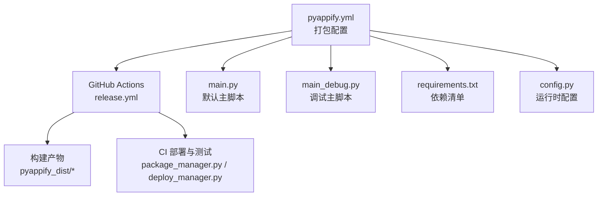
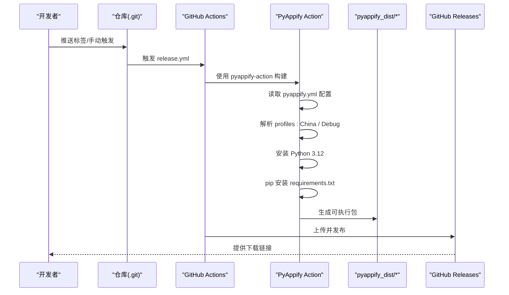
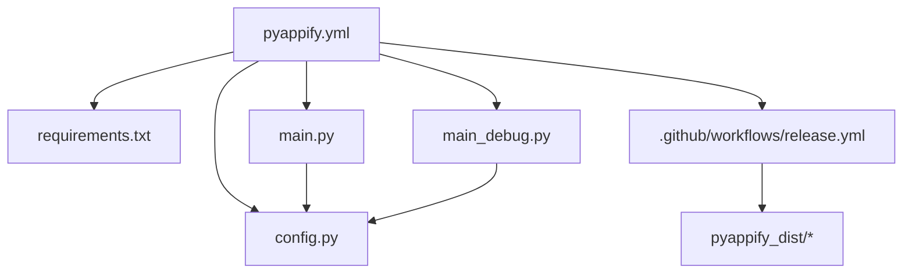

# 打包配置

<cite>
**本文引用的文件**
- [pyappify.yml](file://pyappify.yml)
- [requirements.txt](file://requirements.txt)
- [main.py](file://main.py)
- [main_debug.py](file://main_debug.py)
- [config.py](file://config.py)
- [.github/workflows/release.yml](file://.github/workflows/release.yml)
- [src/ci/package_manager.py](file://src/ci/package_manager.py)
- [src/ci/deploy_manager.py](file://src/ci/deploy_manager.py)
- [.gitignore](file://.gitignore)
</cite>

## 更新摘要
**变更内容**
- 从PyInstaller完全迁移到pyappify打包系统
- CI/CD管道简化，移除复杂的多阶段构建流程
- 移除旧的认证机制和复杂的打包配置文件
- 保留China和Debug两个profile配置，但简化实现
- 更新GitHub Actions工作流以适配新的打包工具

## 目录
1. [简介](#简介)
2. [项目结构](#项目结构)
3. [核心组件](#核心组件)
4. [架构总览](#架构总览)
5. [详细组件分析](#详细组件分析)
6. [依赖关系分析](#依赖关系分析)
7. [性能考量](#性能考量)
8. [故障排除指南](#故障排除指南)
9. [结论](#结论)
10. [附录](#附录)

## 简介
本文档详细介绍ok-jump项目的打包配置，重点解析pyappify.yml配置文件的各项参数。项目已从传统的PyInstaller迁移到现代化的pyappify打包系统，通过GitHub Actions实现自动化构建和发布。文档涵盖应用名称、UAC设置、Git仓库配置、主脚本选择、Python版本要求、依赖管理、镜像源与pip参数配置，以及China与Debug配置文件的区别与用途。同时提供完整的打包流程步骤、最佳实践和常见问题解决方案。

## 项目结构
ok-jump项目采用简洁的"配置驱动 + 主脚本入口"打包方式，核心打包配置集中在pyappify.yml中，通过GitHub Actions自动化构建发布。项目结构经过简化，移除了复杂的多阶段构建流程：

- **配置层**：pyappify.yml（打包配置）、requirements.txt（依赖清单）、config.py（运行时配置）
- **应用入口**：main.py（默认主脚本）、main_debug.py（调试主脚本）
- **CI/CD**：.github/workflows/release.yml（构建与发布工作流）
- **CI部署**：src/ci/package_manager.py、src/ci/deploy_manager.py（游戏包管理与部署）
- **忽略规则**：.gitignore（含打包产物目录）

```mermaid
graph TB
A["pyappify.yml<br/>打包配置"] --> B["GitHub Actions<br/>release.yml"]
B --> C["构建产物<br/>pyappify_dist/*"]
A --> D["main.py<br/>默认主脚本"]
A --> E["main_debug.py<br/>调试主脚本"]
A --> F["requirements.txt<br/>依赖清单"]
A --> G["config.py<br/>运行时配置"]
B --> H["CI 部署与测试<br/>package_manager.py / deploy_manager.py"]
```

**图表来源**
- [pyappify.yml:1-18](file://pyappify.yml#L1-L18)
- [.github/workflows/release.yml:1-65](file://.github/workflows/release.yml#L1-L65)

**章节来源**
- [pyappify.yml:1-18](file://pyappify.yml#L1-L18)
- [.github/workflows/release.yml:1-65](file://.github/workflows/release.yml#L1-L65)
- [.gitignore:27-31](file://.gitignore#L27-L31)

## 核心组件
- **打包配置文件**：pyappify.yml
  - 应用名称、UAC权限、Git仓库、主脚本、Python版本、依赖文件、是否使用pythonw、是否显示Defender提示、pip参数等
- **依赖清单**：requirements.txt
  - 定义项目运行所需的第三方库及其版本范围
- **运行时配置**：config.py
  - 定义窗口、ADB、OCR、模板匹配、日志、任务列表等运行期参数
- **主脚本**：main.py（默认）、main_debug.py（调试）
  - main.py启动GUI并进行多项框架补丁；main_debug.py关闭GUI，便于命令行调试
- **CI/CD**：release.yml
  - 使用pyappify-action执行打包，自动发布到GitHub Releases

**章节来源**
- [pyappify.yml:1-18](file://pyappify.yml#L1-L18)
- [requirements.txt:1-17](file://requirements.txt#L1-L17)
- [config.py:68-145](file://config.py#L68-L145)
- [main.py:659-693](file://main.py#L659-L693)
- [main_debug.py:1-16](file://main_debug.py#L1-L16)
- [.github/workflows/release.yml:26-31](file://.github/workflows/release.yml#L26-L31)

## 架构总览
下图展示从配置到构建、再到发布的整体流程，以及不同打包配置文件（China与Debug）的差异与用途。

```mermaid
sequenceDiagram
participant Dev as "开发者"
participant Repo as "仓库(.git)"
participant GH as "GitHub Actions"
participant PA as "PyAppify Action"
participant Dist as "pyappify_dist/*"
participant Rel as "GitHub Releases"
Dev->>Repo : 推送标签/手动触发
Repo->>GH : 触发 release.yml
GH->>PA : 使用 pyappify-action 构建
PA->>PA : 读取 pyappify.yml 配置
PA->>PA : 解析 profiles : China / Debug
PA->>PA : 安装 Python 3.12
PA->>PA : pip 安装 requirements.txt
PA->>Dist : 生成可执行包
GH->>Rel : 上传并发布
Rel-->>Dev : 提供下载链接
```

**图表来源**
- [.github/workflows/release.yml:14-65](file://.github/workflows/release.yml#L14-L65)
- [pyappify.yml:3-18](file://pyappify.yml#L3-L18)

## 详细组件分析

### pyappify.yml 配置项详解
- **应用名称与UAC**
  - name：应用名称，用于生成可执行文件名与安装标识
  - uac：是否以管理员权限运行（true/false）
- **profiles配置**
  - **China配置**
    - git_url：Git仓库地址，用于构建时拉取源码
    - admin：是否需要管理员权限（与uac类似）
    - main_script：主脚本选择（main.py）
    - requires_python：Python版本要求（3.12）
    - requirements：依赖清单文件（requirements.txt）
    - use_pythonw：是否使用pythonw（隐藏控制台，适合GUI应用）
    - show_add_defender：是否显示添加Windows Defender白名单提示
    - pip_args：pip安装参数，包含镜像源、超时与重试策略
  - **Debug配置**
    - main_script：主脚本选择（main_debug.py）
    - use_pythonw：false（显示控制台，便于调试输出）
- **其他字段**
  - 未显式设置的字段遵循pyappify默认行为（例如未设置时默认使用pythonw，未设置镜像源时使用pypi.org）

**章节来源**
- [pyappify.yml:1-18](file://pyappify.yml#L1-L18)

### 依赖管理与pip参数
- **依赖清单**
  - requirements.txt定义了项目运行所需的核心库，如PySide6、OpenCV、onnxruntime、adbutils等
- **pip参数与镜像源**
  - pip_args中包含：
    - --index-url：国内镜像源（腾讯云镜像），加速依赖下载
    - --extra-index-url：备用官方源（pypi.org），确保兼容性
    - --timeout：网络请求超时时间（秒）
    - --retries：网络重试次数
  - **CI环境变量**
    - PIP_TIMEOUT：在GitHub Actions中通过环境变量设置超时，与pip_args的--timeout协同

**章节来源**
- [requirements.txt:1-17](file://requirements.txt#L1-L17)
- [pyappify.yml:12](file://pyappify.yml#L12)
- [.github/workflows/release.yml:31](file://.github/workflows/release.yml#L31)

### 不同配置文件（China与Debug）的区别与用途
- **China配置**
  - 适用于中国大陆用户，使用国内镜像源加速依赖安装，适合发布标准版
  - 使用pythonw隐藏控制台，提升用户体验
- **Debug配置**
  - 适用于开发调试，使用控制台输出，便于查看日志与排查问题
  - 主脚本指向main_debug.py，关闭GUI，便于快速验证逻辑

**章节来源**
- [pyappify.yml:3-18](file://pyappify.yml#L3-L18)
- [main_debug.py:1-16](file://main_debug.py#L1-L16)

### 打包流程与最佳实践
- **流程步骤**
  1. 准备pyappify.yml、requirements.txt、main.py/main_debug.py、config.py等文件
  2. 推送标签或手动触发GitHub Actions
  3. Actions使用pyappify-action读取配置，按profiles生成两套产物
  4. 构建完成后上传至GitHub Releases
- **最佳实践**
  - 固定Python版本（3.12）并在CI中严格校验
  - 使用国内镜像源与超时/重试参数，提高稳定性
  - 为China与Debug分别提供清晰的说明与使用场景
  - 在.gitignore中忽略打包产物目录，避免污染仓库

**章节来源**
- [.github/workflows/release.yml:14-65](file://.github/workflows/release.yml#L14-L65)
- [pyappify.yml:1-18](file://pyappify.yml#L1-L18)
- [.gitignore:27-31](file://.gitignore#L27-L31)

### 运行时配置与打包的关系
- **config.py**决定运行期行为（窗口、ADB、OCR、任务列表等），与打包配置相互独立但共同决定最终用户体验
- **main.py**与**main_debug.py**分别对应GUI与控制台两种运行模式，与pyappify的use_pythonw/main_script配置一一对应

**章节来源**
- [config.py:68-145](file://config.py#L68-L145)
- [main.py:659-693](file://main.py#L659-L693)
- [main_debug.py:1-16](file://main_debug.py#L1-L16)

## 依赖关系分析
下图展示打包配置与运行时配置、主脚本及CI的依赖关系。

```mermaid
graph TB
P["pyappify.yml"] --> R["requirements.txt"]
P --> M["main.py"]
P --> MD["main_debug.py"]
P --> C["config.py"]
P --> A[".github/workflows/release.yml"]
A --> O["pyappify_dist/*"]
M --> C
MD --> C
```

**图表来源**
- [pyappify.yml:1-18](file://pyappify.yml#L1-L18)
- [requirements.txt:1-17](file://requirements.txt#L1-L17)
- [main.py:659-693](file://main.py#L659-L693)
- [main_debug.py:1-16](file://main_debug.py#L1-L16)
- [config.py:68-145](file://config.py#L68-L145)
- [.github/workflows/release.yml:14-65](file://.github/workflows/release.yml#L14-L65)

**章节来源**
- [pyappify.yml:1-18](file://pyappify.yml#L1-L18)
- [requirements.txt:1-17](file://requirements.txt#L1-L17)
- [config.py:68-145](file://config.py#L68-L145)
- [.github/workflows/release.yml:14-65](file://.github/workflows/release.yml#L14-L65)

## 性能考量
- **依赖安装性能**
  - 使用国内镜像源可显著减少依赖下载时间，建议在CI中固定镜像源与超时参数
  - 合理设置--retries，平衡成功率与等待时间
- **运行时性能**
  - main.py中对日志、设备连接、OCR等进行了多项优化与降噪，有助于减少不必要的I/O与错误日志，提升稳定性
  - CI异常处理模块提供了"非致命错误继续执行""连续失败检测""游戏画面停滞检测"等能力，有助于在不稳定环境下保持任务执行的鲁棒性

**章节来源**
- [pyappify.yml:12](file://pyappify.yml#L12)
- [main.py:22-329](file://main.py#L22-L329)
- [src/ci/package_manager.py:1-380](file://src/ci/package_manager.py#L1-L380)
- [src/ci/deploy_manager.py:1-428](file://src/ci/deploy_manager.py#L1-L428)

## 故障排除指南
- **依赖安装失败或超时**
  - 检查pip_args中的镜像源与超时/重试参数是否合理
  - 在CI中确认PIP_TIMEOUT环境变量是否正确传递
  - 若使用代理或受限网络，考虑切换镜像源或增加重试次数
- **Python版本不匹配**
  - 确认pyappify.yml中requires_python与实际构建环境一致
  - 在CI中明确指定Python版本，避免默认环境差异
- **控制台与GUI行为不符**
  - China配置应使用pythonw；Debug配置应使用控制台
  - 如出现控制台闪现或消失，检查use_pythonw与main_script的对应关系
- **CI构建产物缺失**
  - 确认.github/workflows/release.yml中的文件上传路径与打包产物目录一致
  - 检查.gitignore是否误排除了pyappify_dist/*
- **打包配置文件问题**
  - 确认pyappify.yml语法正确，缩进规范
  - 验证requirements.txt中的依赖版本兼容性
  - 检查main.py和main_debug.py的导入路径是否正确

**章节来源**
- [pyappify.yml:12](file://pyappify.yml#L12)
- [.github/workflows/release.yml:31](file://.github/workflows/release.yml#L31)
- [main.py:22-329](file://main.py#L22-L329)
- [.github/workflows/release.yml:60](file://.github/workflows/release.yml#L60)
- [.gitignore:27-31](file://.gitignore#L27-L31)

## 结论
pyappify.yml作为ok-jump的打包核心配置，通过profiles为不同用户场景提供定制化的构建方案。项目已从复杂的PyInstaller配置迁移到简化的pyappify系统，配合requirements.txt的依赖管理和CI/CD的自动化流程，实现了更加稳定、可复现且易于维护的打包与发布体系。遵循本文的最佳实践与故障排除建议，可有效提升打包效率与产物质量。

## 附录
- **常用参考路径**
  - 打包配置：[pyappify.yml](file://pyappify.yml)
  - 依赖清单：[requirements.txt](file://requirements.txt)
  - 运行时配置：[config.py](file://config.py)
  - 默认主脚本：[main.py](file://main.py)
  - 调试主脚本：[main_debug.py](file://main_debug.py)
  - CI工作流：[release.yml](file://.github/workflows/release.yml)
  - CI包管理：[src/ci/package_manager.py](file://src/ci/package_manager.py)
  - CI部署管理：[src/ci/deploy_manager.py](file://src/ci/deploy_manager.py)
  - 忽略规则：[.gitignore](file://.gitignore)