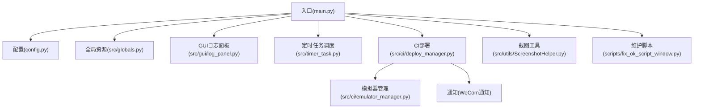
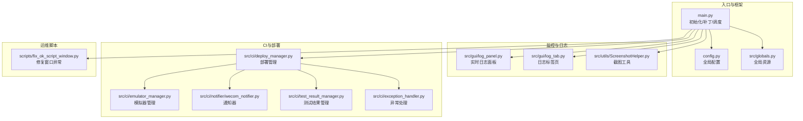
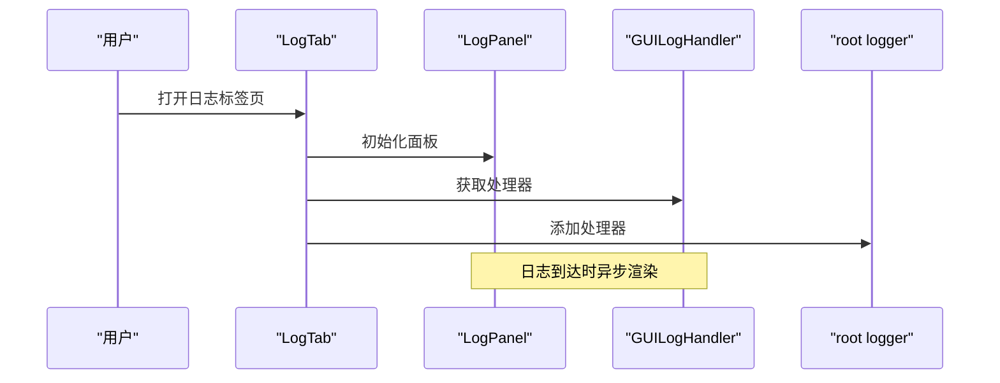
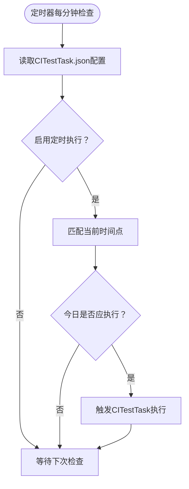
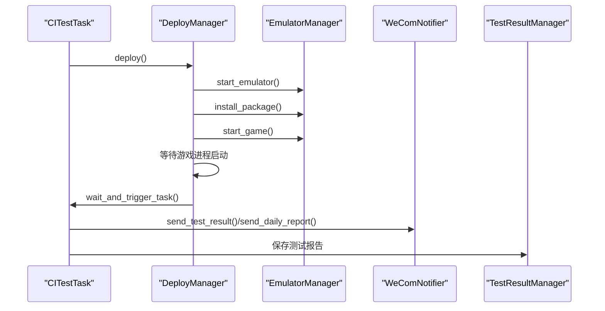
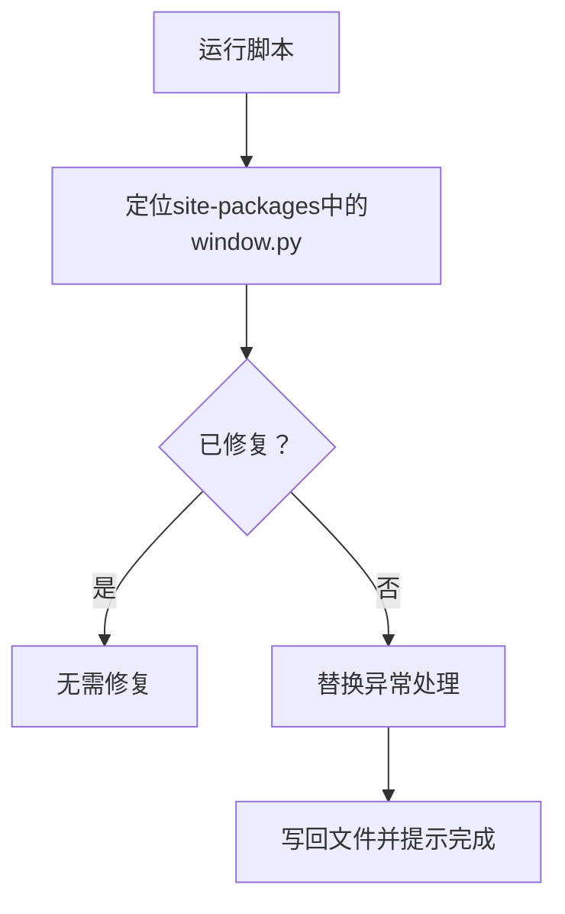
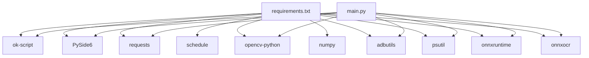
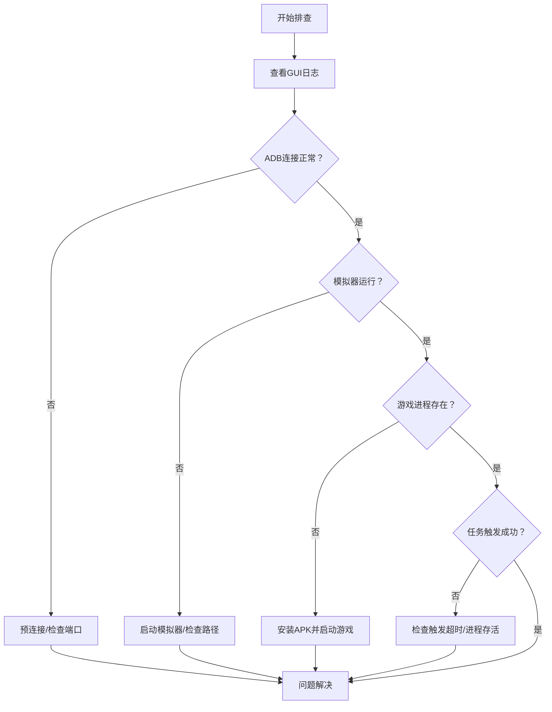

# 监控维护

<cite>
**本文档引用的文件**
- [README.md](file://README.md)
- [main.py](file://main.py)
- [config.py](file://config.py)
- [scripts/fix_ok_script_window.py](file://scripts/fix_ok_script_window.py)
- [src/globals.py](file://src/globals.py)
- [src/gui/log_panel.py](file://src/gui/log_panel.py)
- [src/gui/log_tab.py](file://src/gui/log_tab.py)
- [src/timer_task.py](file://src/timer_task.py)
- [src/ci/deploy_manager.py](file://src/ci/deploy_manager.py)
- [src/ci/emulator_manager.py](file://src/ci/emulator_manager.py)
- [src/ci/notifier/wecom_notifier.py](file://src/ci/notifier/wecom_notifier.py)
- [src/ci/test_result_manager.py](file://src/ci/test_result_manager.py)
- [src/ci/exception_handler.py](file://src/ci/exception_handler.py)
- [src/utils/ScreenshotHelper.py](file://src/utils/ScreenshotHelper.py)
- [requirements.txt](file://requirements.txt)
</cite>

## 目录
1. [简介](#简介)
2. [项目结构](#项目结构)
3. [核心组件](#核心组件)
4. [架构总览](#架构总览)
5. [详细组件分析](#详细组件分析)
6. [依赖分析](#依赖分析)
7. [性能考虑](#性能考虑)
8. [故障排查指南](#故障排查指南)
9. [结论](#结论)
10. [附录](#附录)

## 简介
本文件面向运维与开发团队，提供 ok-jump 项目的监控与维护指导。内容涵盖健康检查机制、性能监控指标、日志分析方法、异常检测与告警、维护脚本使用、故障诊断流程、预防性维护策略与应急响应流程，并给出运维工具的使用与配置建议。

## 项目结构
ok-jump 是基于 ok-script 框架的自动化测试工具，围绕“自动战斗”“自动登录”“自动匹配”“日常任务”等任务模块构建，同时提供 CI 部署、模拟器管理、日志监控与通知能力。

图表来源
- [main.py:659-693](file://main.py#L659-L693)
- [config.py:68-145](file://config.py#L68-L145)
- [src/globals.py:16-406](file://src/globals.py#L16-L406)
- [src/gui/log_panel.py:58-388](file://src/gui/log_panel.py#L58-L388)
- [src/ci/deploy_manager.py:38-428](file://src/ci/deploy_manager.py#L38-L428)
- [src/ci/emulator_manager.py:39-457](file://src/ci/emulator_manager.py#L39-L457)
- [src/ci/notifier/wecom_notifier.py:21-288](file://src/ci/notifier/wecom_notifier.py#L21-L288)
- [src/utils/ScreenshotHelper.py:7-68](file://src/utils/ScreenshotHelper.py#L7-L68)
- [scripts/fix_ok_script_window.py:15-84](file://scripts/fix_ok_script_window.py#L15-L84)

章节来源
- [README.md:1-8](file://README.md#L1-L8)
- [main.py:659-693](file://main.py#L659-L693)
- [config.py:68-145](file://config.py#L68-L145)

## 核心组件
- 入口与框架集成：入口负责框架初始化、日志处理补丁、设备选择、ADB 预连接、定时任务调度与 GUI 日志面板注册。
- 全局资源管理：集中管理登录状态、OCR 缓存、YOLO 模型、CI 状态等全局对象。
- 日志监控：提供 GUI 实时日志面板，支持级别过滤、关键词搜索、自动滚动、暂停/恢复、清空。
- CI 部署与模拟器管理：封装 Jenkins 下载、模拟器启动/安装/启动游戏、进程存活检测、任务触发与清理。
- 通知与报告：企业微信通知器支持 Markdown 与图片发送；测试结果管理器支持报告生成与每日汇总。
- 维护脚本：修复 ok-script 框架中的窗口处理异常，减少日志噪音。

章节来源
- [main.py:22-693](file://main.py#L22-L693)
- [src/globals.py:16-406](file://src/globals.py#L16-L406)
- [src/gui/log_panel.py:58-388](file://src/gui/log_panel.py#L58-L388)
- [src/ci/deploy_manager.py:38-428](file://src/ci/deploy_manager.py#L38-L428)
- [src/ci/emulator_manager.py:39-457](file://src/ci/emulator_manager.py#L39-L457)
- [src/ci/notifier/wecom_notifier.py:21-288](file://src/ci/notifier/wecom_notifier.py#L21-L288)
- [src/ci/test_result_manager.py:73-214](file://src/ci/test_result_manager.py#L73-L214)
- [scripts/fix_ok_script_window.py:15-84](file://scripts/fix_ok_script_window.py#L15-L84)

## 架构总览
ok-jump 的监控与维护体系由“日志采集—异常检测—告警通知—运维处置—预防维护”闭环构成。入口层负责初始化与补丁注入；业务层包含任务与 CI；监控层提供日志面板与定时任务；通知层负责对外告警。

图表来源
- [main.py:659-693](file://main.py#L659-L693)
- [config.py:68-145](file://config.py#L68-L145)
- [src/globals.py:16-406](file://src/globals.py#L16-L406)
- [src/gui/log_panel.py:58-388](file://src/gui/log_panel.py#L58-L388)
- [src/gui/log_tab.py:15-70](file://src/gui/log_tab.py#L15-L70)
- [src/utils/ScreenshotHelper.py:7-68](file://src/utils/ScreenshotHelper.py#L7-L68)
- [src/ci/deploy_manager.py:38-428](file://src/ci/deploy_manager.py#L38-L428)
- [src/ci/emulator_manager.py:39-457](file://src/ci/emulator_manager.py#L39-L457)
- [src/ci/notifier/wecom_notifier.py:21-288](file://src/ci/notifier/wecom_notifier.py#L21-L288)
- [src/ci/test_result_manager.py:73-214](file://src/ci/test_result_manager.py#L73-L214)
- [src/ci/exception_handler.py:331-420](file://src/ci/exception_handler.py#L331-L420)
- [scripts/fix_ok_script_window.py:15-84](file://scripts/fix_ok_script_window.py#L15-L84)

## 详细组件分析

### 日志监控与分析
- 实时日志面板：支持按级别过滤、关键词搜索、自动滚动、暂停/恢复、清空、计数统计与颜色标记。
- GUI 注册：日志标签页将面板处理器注册到 root logger，确保所有日志可见。
- 日志文件：配置中定义了日志文件路径与错误日志文件路径，便于离线分析与归档。

图表来源
- [src/gui/log_tab.py:15-70](file://src/gui/log_tab.py#L15-L70)
- [src/gui/log_panel.py:58-388](file://src/gui/log_panel.py#L58-L388)

章节来源
- [src/gui/log_panel.py:58-388](file://src/gui/log_panel.py#L58-L388)
- [src/gui/log_tab.py:15-70](file://src/gui/log_tab.py#L15-L70)
- [config.py:121-122](file://config.py#L121-L122)

### 定时任务与健康检查
- 定时任务调度器：读取 CI 定时配置文件，支持每天/工作日/周末/特定星期几执行；支持配置热更新与去重执行。
- 健康检查：模拟器状态检测、ADB 设备连接、游戏进程存活检测、任务触发超时检测。

图表来源
- [main.py:482-657](file://main.py#L482-L657)

章节来源
- [main.py:482-657](file://main.py#L482-L657)

### CI 部署与异常检测
- 部署流程：下载 APK → 启动模拟器 → 安装 APK → 启动游戏 → 等待进程 → 触发任务。
- 异常检测：游戏进程存活检测、任务触发超时、游戏进程意外退出、ADB 连接异常等。
- 通知与报告：测试报告与每日报告通过企业微信发送，支持 Markdown 与图片。

图表来源
- [src/ci/deploy_manager.py:123-428](file://src/ci/deploy_manager.py#L123-L428)
- [src/ci/emulator_manager.py:90-457](file://src/ci/emulator_manager.py#L90-L457)
- [src/ci/notifier/wecom_notifier.py:87-164](file://src/ci/notifier/wecom_notifier.py#L87-L164)
- [src/ci/test_result_manager.py:102-214](file://src/ci/test_result_manager.py#L102-L214)

章节来源
- [src/ci/deploy_manager.py:123-428](file://src/ci/deploy_manager.py#L123-L428)
- [src/ci/emulator_manager.py:90-457](file://src/ci/emulator_manager.py#L90-L457)
- [src/ci/notifier/wecom_notifier.py:87-164](file://src/ci/notifier/wecom_notifier.py#L87-L164)
- [src/ci/test_result_manager.py:102-214](file://src/ci/test_result_manager.py#L102-L214)

### 维护脚本：修复 ok-script 窗口异常
- 场景：模拟器关闭后，窗口处理模块仍尝试获取进程信息，产生 NoSuchProcess 异常日志。
- 方案：定位 ok-script 的 util/window.py，替换异常处理，捕获 NoSuchProcess，避免日志噪音。
- 使用：确保 ok-script 已安装，脚本会自动查找并修复。

图表来源
- [scripts/fix_ok_script_window.py:15-84](file://scripts/fix_ok_script_window.py#L15-L84)

章节来源
- [scripts/fix_ok_script_window.py:15-84](file://scripts/fix_ok_script_window.py#L15-L84)

### 全局资源与性能监控
- 全局资源：登录状态、OCR 缓存（带 TTL）、YOLO 模型（延迟加载）、CI 状态等。
- 性能要点：YOLO 模型按需加载与释放；OCR 缓存 TTL 控制；日志过滤与降噪补丁减少 I/O 与噪音。

章节来源
- [src/globals.py:16-406](file://src/globals.py#L16-L406)
- [main.py:22-47](file://main.py#L22-L47)
- [main.py:332-366](file://main.py#L332-L366)

## 依赖分析
- 外部依赖：ok-script、PySide6、requests、schedule、opencv-python、numpy、adbutils、psutil、onnxruntime、onnxocr 等。
- 内部耦合：入口对配置、全局资源、日志面板、定时任务、CI 模块均有强依赖；CI 模块内部又依赖模拟器管理与通知模块。

图表来源
- [requirements.txt:1-17](file://requirements.txt#L1-L17)
- [main.py:17-18](file://main.py#L17-L18)

章节来源
- [requirements.txt:1-17](file://requirements.txt#L1-L17)
- [main.py:17-18](file://main.py#L17-L18)

## 性能考虑
- 日志降噪：对 ADB 连接超时、OCR negative box、捕获模块进程不存在等噪音日志进行过滤，减少 I/O 与噪音。
- 资源管理：YOLO 模型延迟加载与释放；OCR 缓存 TTL 控制；截图工具按需保存。
- 后台模式：伪最小化与后台静音，降低 CPU/GPU 占用。
- 定时任务：每分钟检查，避免高频轮询造成负载。

章节来源
- [main.py:22-47](file://main.py#L22-L47)
- [main.py:258-301](file://main.py#L258-L301)
- [main.py:303-330](file://main.py#L303-L330)
- [main.py:332-366](file://main.py#L332-L366)
- [src/globals.py:236-341](file://src/globals.py#L236-L341)
- [src/utils/ScreenshotHelper.py:7-68](file://src/utils/ScreenshotHelper.py#L7-L68)

## 故障排查指南
- 日志分析
  - 使用 GUI 日志面板进行实时观察，按级别与关键词过滤定位问题。
  - 导出日志压缩包以便离线分析。
- 常见问题
  - ADB 连接超时：检查模拟器端口与连接状态，必要时预连接。
  - 模拟器启动失败：检查路径与实例索引，确认 ldconsole 可用。
  - 游戏进程未启动：等待超时或进程异常退出，检查安装与启动命令。
  - 日志噪音：使用维护脚本修复窗口异常处理，或启用日志过滤补丁。
- 截图与证据
  - 使用截图工具保存关键帧与特征模板，便于问题复现与定位。
- 异常处理
  - 统一异常处理器捕获异常、收集上下文、生成失败信息并触发回调。

图表来源
- [main.py:437-480](file://main.py#L437-L480)
- [src/ci/deploy_manager.py:247-308](file://src/ci/deploy_manager.py#L247-L308)
- [src/ci/emulator_manager.py:90-158](file://src/ci/emulator_manager.py#L90-L158)
- [src/utils/ScreenshotHelper.py:17-44](file://src/utils/ScreenshotHelper.py#L17-L44)
- [src/ci/exception_handler.py:331-420](file://src/ci/exception_handler.py#L331-L420)

章节来源
- [src/gui/log_panel.py:58-388](file://src/gui/log_panel.py#L58-L388)
- [main.py:69-85](file://main.py#L69-L85)
- [main.py:437-480](file://main.py#L437-L480)
- [src/ci/deploy_manager.py:247-308](file://src/ci/deploy_manager.py#L247-L308)
- [src/ci/emulator_manager.py:90-158](file://src/ci/emulator_manager.py#L90-L158)
- [src/utils/ScreenshotHelper.py:17-44](file://src/utils/ScreenshotHelper.py#L17-L44)
- [src/ci/exception_handler.py:331-420](file://src/ci/exception_handler.py#L331-L420)

## 结论
ok-jump 的监控与维护体系以“日志可观测、异常可捕获、告警可触达、处置可追溯”为目标，结合定时任务、CI 部署、模拟器管理与企业微信通知，形成闭环运维能力。通过维护脚本与日志降噪补丁，显著提升稳定性与可维护性。

## 附录

### 健康检查清单
- 日志面板可用且可过滤
- ADB 连接正常（端口、设备列表）
- 模拟器运行且可启动游戏
- 游戏进程存活检测通过
- 定时任务配置正确并可热更新
- 通知通道可用（企业微信）

章节来源
- [src/gui/log_panel.py:58-388](file://src/gui/log_panel.py#L58-L388)
- [main.py:437-480](file://main.py#L437-L480)
- [src/ci/emulator_manager.py:232-275](file://src/ci/emulator_manager.py#L232-L275)
- [main.py:482-657](file://main.py#L482-L657)
- [src/ci/notifier/wecom_notifier.py:21-288](file://src/ci/notifier/wecom_notifier.py#L21-L288)

### 告警与通知配置
- 企业微信 Webhook：在通知器中配置 webhook 地址，支持 Markdown 与图片发送。
- 告警类型：测试报告、每日报告、告警通知（可 @ 指定人员）。

章节来源
- [src/ci/notifier/wecom_notifier.py:21-288](file://src/ci/notifier/wecom_notifier.py#L21-L288)

### 维护脚本使用说明
- 适用场景：模拟器关闭后出现 NoSuchProcess 异常日志。
- 使用方法：确保 ok-script 已安装，运行脚本自动修复 site-packages 中的 window.py。
- 注意事项：修复前请备份原文件，确保权限足够写入。

章节来源
- [scripts/fix_ok_script_window.py:15-84](file://scripts/fix_ok_script_window.py#L15-L84)