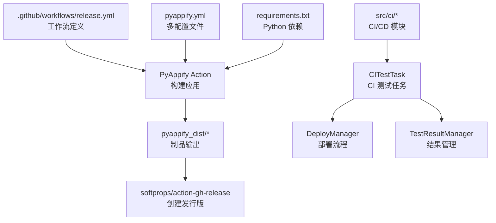
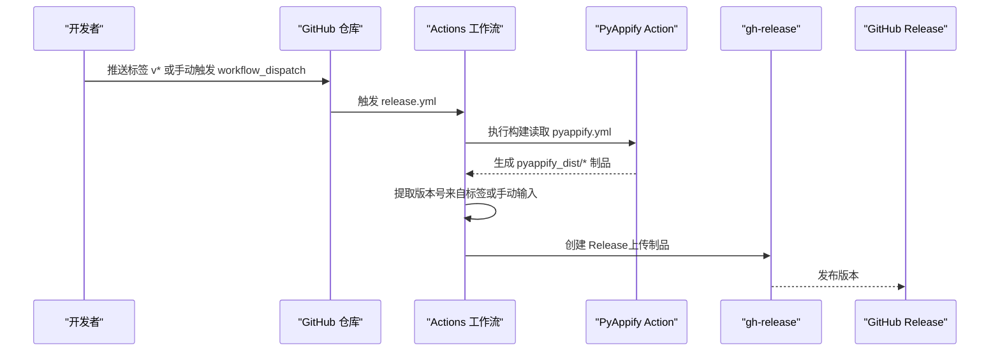
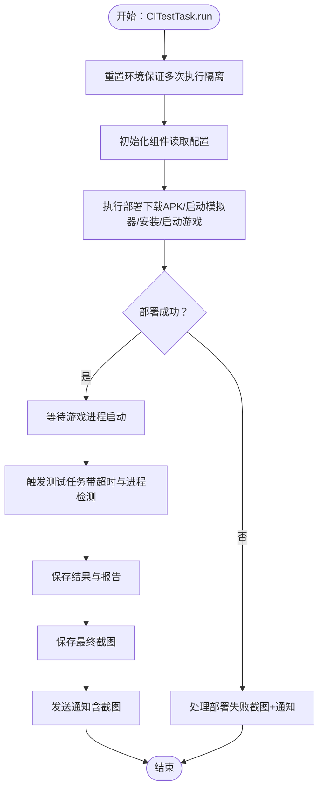
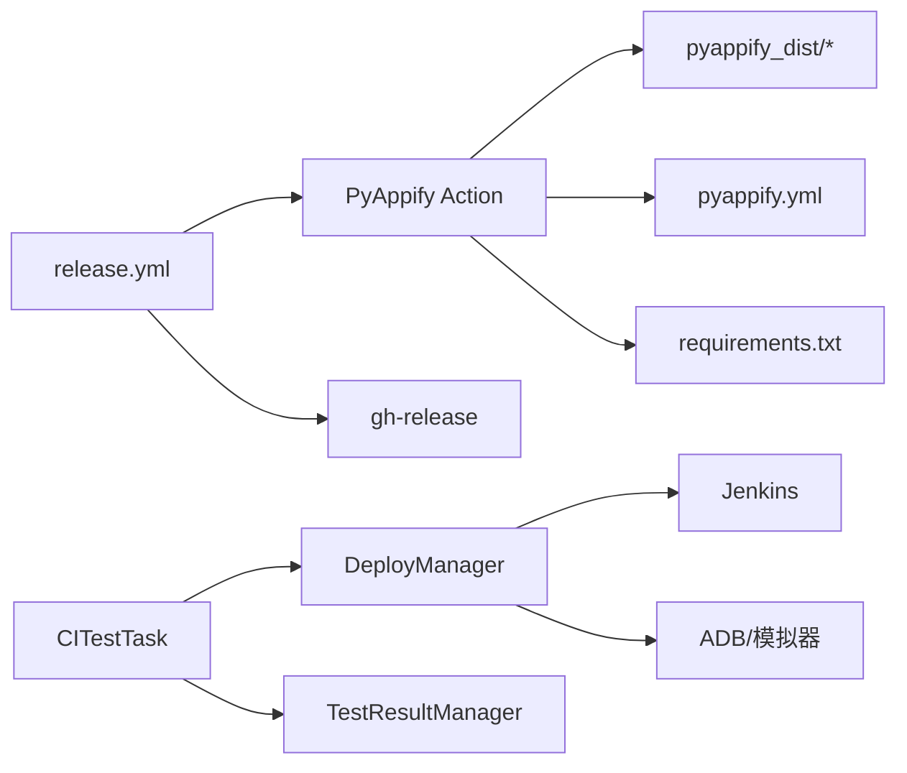

# 自动化发布

<cite>
**本文引用的文件**
- [release.yml](file://.github/workflows/release.yml)
- [pyappify.yml](file://pyappify.yml)
- [requirements.txt](file://requirements.txt)
- [README.md](file://README.md)
- [config.py](file://config.py)
- [main.py](file://main.py)
- [main_debug.py](file://main_debug.py)
- [CITestTask.py](file://src/task/CITestTask.py)
- [deploy_manager.py](file://src/ci/deploy_manager.py)
- [test_result_manager.py](file://src/ci/test_result_manager.py)
- [CITestTask.json](file://configs/CITestTask.json)
- [test_ci_modules.py](file://tests/test_ci_modules.py)
</cite>

## 目录
1. [简介](#简介)
2. [项目结构](#项目结构)
3. [核心组件](#核心组件)
4. [架构总览](#架构总览)
5. [详细组件分析](#详细组件分析)
6. [依赖关系分析](#依赖关系分析)
7. [性能考量](#性能考量)
8. [故障排查指南](#故障排查指南)
9. [结论](#结论)
10. [附录](#附录)

## 简介
本文件面向 ok-jump 项目的自动化发布流程，系统性解析 GitHub Actions 工作流配置与发布过程，覆盖触发条件、构建步骤、测试流程、打包过程、版本发布、分支与标签策略、版本号生成规则、手动与自动触发方式、发布监控与回滚策略，以及 CI/CD 最佳实践与安全建议。文档同时结合项目内的 CI/CD 相关模块（如部署管理、测试结果管理、任务调度等），帮助读者理解从源码到制品的全链路。

## 项目结构
ok-jump 的自动化发布主要由以下部分组成：
- GitHub Actions 工作流：定义触发条件、作业与步骤、制品上传与发布。
- PyAppify 配置：定义应用名称、多配置文件（中国版/调试版）、依赖与构建参数。
- 依赖清单：Python 依赖与版本约束。
- CI/CD 核心模块：部署管理、测试结果管理、异常处理与通知等。
- 配置文件：CI 测试任务的 Jenkins 地址、模拟器路径、超时参数、账号递增等。
- 测试用例：对 CI 模块进行单元测试与集成测试，保障发布质量。

图表来源
- [.github/workflows/release.yml:1-65](file://.github/workflows/release.yml#L1-L65)
- [pyappify.yml:1-18](file://pyappify.yml#L1-L18)
- [requirements.txt:1-17](file://requirements.txt#L1-L17)
- [deploy_manager.py:1-428](file://src/ci/deploy_manager.py#L1-L428)
- [test_result_manager.py:1-327](file://src/ci/test_result_manager.py#L1-L327)
- [CITestTask.py:146-506](file://src/task/CITestTask.py#L146-L506)

章节来源
- [.github/workflows/release.yml:1-65](file://.github/workflows/release.yml#L1-L65)
- [pyappify.yml:1-18](file://pyappify.yml#L1-L18)
- [requirements.txt:1-17](file://requirements.txt#L1-L17)

## 核心组件
- GitHub Actions 工作流：定义触发条件（推送标签、手动触发）、作业权限、构建步骤、版本号提取与发布。
- PyAppify Action：基于 pyappify.yml 配置，生成 Windows 可执行包，并产出多配置文件的制品。
- CI/CD 模块：负责从 Jenkins 下载 APK、启动模拟器、安装与启动游戏、触发自动化测试、保存结果与通知。
- 配置与测试：CITestTask.json 提供 CI 运行所需的关键参数；单元测试保障模块稳定性。

章节来源
- [.github/workflows/release.yml:1-65](file://.github/workflows/release.yml#L1-L65)
- [pyappify.yml:1-18](file://pyappify.yml#L1-L18)
- [deploy_manager.py:1-428](file://src/ci/deploy_manager.py#L1-L428)
- [test_result_manager.py:1-327](file://src/ci/test_result_manager.py#L1-L327)
- [CITestTask.json:1-29](file://configs/CITestTask.json#L1-L29)
- [test_ci_modules.py:1-469](file://tests/test_ci_modules.py#L1-L469)

## 架构总览
下图展示从触发到发布的整体流程，包括自动触发与手动触发两种入口，以及版本号来源与制品发布。

图表来源
- [.github/workflows/release.yml:3-65](file://.github/workflows/release.yml#L3-L65)
- [pyappify.yml:1-18](file://pyappify.yml#L1-L18)

## 详细组件分析

### GitHub Actions 工作流（release.yml）
- 触发条件
  - 推送标签：仅匹配以 v 开头的标签，例如 v1.0.0。
  - 手动触发：通过 workflow_dispatch 输入 version 字段，允许自定义版本号。
- 作业与权限
  - 作业在 windows-latest 上运行，授予 contents: write 权限以便创建发布。
- 步骤详解
  - 代码检出：fetch-depth 设置为 0，确保完整历史。
  - 构建应用：使用 PyAppify Action，传入 GITHUB_TOKEN 与 PIP 超时。
  - 版本号提取：若手动输入 version，则使用该值；否则从标签引用中提取。
  - 创建发布：使用 gh-release，按版本号命名，上传 pyappify_dist/* 中的制品，并设置为正式发布。
- 关键点
  - 条件发布：仅当 ref 以 refs/tags/ 开头或通过手动触发时才创建发布。
  - 制品来源：由 PyAppify Action 生成的 pyappify_dist/*。

章节来源
- [.github/workflows/release.yml:1-65](file://.github/workflows/release.yml#L1-L65)

### PyAppify 配置（pyappify.yml）
- 应用名称与多配置文件
  - 名称：ok-jump。
  - 配置文件：包含 China 与 Debug 两套配置，分别指向同一 Git 仓库，主脚本分别为 main.py 与 main_debug.py。
- Python 环境与依赖
  - Python 版本要求：3.12。
  - 依赖文件：requirements.txt。
  - 中国镜像加速：通过 pip 参数配置国内镜像源与超时重试。
- 运行参数
  - China 配置：启用管理员权限、使用 pythonw 隐藏控制台、启用 Defender 提示。
  - Debug 配置：不使用 pythonw，便于查看控制台输出。

章节来源
- [pyappify.yml:1-18](file://pyappify.yml#L1-L18)
- [requirements.txt:1-17](file://requirements.txt#L1-L17)

### 版本号与标签策略
- 标签规范：使用以 v 开头的语义化版本标签，如 v1.0.0、v1.4.30。
- 版本号来源：
  - 自动触发：从标签引用中提取版本号。
  - 手动触发：通过 workflow_dispatch 的 version 输入指定版本号。
- 版本一致性：
  - 项目配置中也维护了 version 字段，建议在发布前保持与标签一致，避免混淆。

章节来源
- [.github/workflows/release.yml:33-41](file://.github/workflows/release.yml#L33-L41)
- [config.py:74-74](file://config.py#L74-L74)

### 构建与打包流程
- 构建入口：PyAppify Action 依据 pyappify.yml 执行构建。
- 制品位置：生成的制品位于 pyappify_dist/*，工作流将其作为发布附件上传。
- 多配置文件：China 与 Debug 两个配置文件分别生成不同运行模式的制品。

章节来源
- [.github/workflows/release.yml:26-62](file://.github/workflows/release.yml#L26-L62)
- [pyappify.yml:3-17](file://pyappify.yml#L3-L17)

### CI/CD 测试与部署（CITestTask 与 DeployManager）
- CITestTask
  - 支持失败自动重试、账号递增、截图与通知。
  - 通过配置文件 CITestTask.json 控制 Jenkins 地址、模拟器路径、超时参数、账号模板等。
- DeployManager
  - 从 Jenkins 下载最新 APK，启动模拟器、安装 APK、启动游戏进程。
  - 提供等待与触发测试任务的方法，具备超时与进程退出检测。
- TestResultManager
  - 保存测试报告与任务结果，生成每日报告与历史记录，支持清理旧数据。

图表来源
- [CITestTask.py:146-506](file://src/task/CITestTask.py#L146-L506)
- [deploy_manager.py:123-307](file://src/ci/deploy_manager.py#L123-L307)
- [test_result_manager.py:102-130](file://src/ci/test_result_manager.py#L102-L130)

章节来源
- [CITestTask.py:146-506](file://src/task/CITestTask.py#L146-L506)
- [deploy_manager.py:123-307](file://src/ci/deploy_manager.py#L123-L307)
- [test_result_manager.py:102-130](file://src/ci/test_result_manager.py#L102-L130)
- [CITestTask.json:1-29](file://configs/CITestTask.json#L1-L29)

### 测试与验证（单元测试与集成测试）
- 单元测试覆盖
  - 异常类、包管理、模拟器管理、测试结果管理、异常处理、通知模块等。
- 集成测试要点
  - 验证 CITestTask 配置文件存在与有效。
  - 验证版本号与配置一致。
  - 验证 ADB 设备列表使用 device_list 而非 list。

章节来源
- [test_ci_modules.py:1-469](file://tests/test_ci_modules.py#L1-L469)

## 依赖关系分析
- 工作流对构建工具与发布工具的依赖：PyAppify Action、gh-release。
- 构建对配置与依赖的依赖：pyappify.yml、requirements.txt。
- CI/CD 模块对第三方服务与库的依赖：Jenkins、ADB、模拟器、通知服务。
- 任务对配置文件的依赖：CITestTask.json。

图表来源
- [.github/workflows/release.yml:1-65](file://.github/workflows/release.yml#L1-L65)
- [pyappify.yml:1-18](file://pyappify.yml#L1-L18)
- [requirements.txt:1-17](file://requirements.txt#L1-L17)
- [deploy_manager.py:1-428](file://src/ci/deploy_manager.py#L1-L428)
- [test_result_manager.py:1-327](file://src/ci/test_result_manager.py#L1-L327)
- [CITestTask.py:146-506](file://src/task/CITestTask.py#L146-L506)

章节来源
- [.github/workflows/release.yml:1-65](file://.github/workflows/release.yml#L1-L65)
- [pyappify.yml:1-18](file://pyappify.yml#L1-L18)
- [requirements.txt:1-17](file://requirements.txt#L1-L17)
- [deploy_manager.py:1-428](file://src/ci/deploy_manager.py#L1-L428)
- [test_result_manager.py:1-327](file://src/ci/test_result_manager.py#L1-L327)
- [CITestTask.py:146-506](file://src/task/CITestTask.py#L146-L506)

## 性能考量
- 构建性能
  - 使用国内镜像源与超时重试参数，减少依赖下载耗时。
  - 合理设置 PIP 超时，避免长时间卡顿。
- CI 执行效率
  - 通过 DeployManager 的超时参数与进程检测，避免无效等待。
  - 任务触发前的延迟等待，确保游戏进程稳定后再执行测试。
- 存储与清理
  - TestResultManager 支持清理旧数据，避免磁盘占用增长。
  - DeployManager 限制保留旧包数量，减少本地空间占用。

## 故障排查指南
- 发布失败（标签未触发）
  - 确认推送标签符合 v* 规范；或使用 workflow_dispatch 手动触发。
- 版本号不一致
  - 检查标签与 workflow 中的版本号提取逻辑；核对项目配置中的 version。
- 构建失败（依赖下载超时）
  - 检查网络与镜像源配置；适当提高 PIP 超时。
- CI 测试失败
  - 检查 CITestTask.json 中的 Jenkins 地址、模拟器路径、ADB 端口等配置。
  - 查看 DeployManager 的超时参数与进程检测日志。
- 通知未发送
  - 确认企业微信 Webhook 配置有效；检查通知模块日志。

章节来源
- [.github/workflows/release.yml:3-65](file://.github/workflows/release.yml#L3-L65)
- [CITestTask.json:1-29](file://configs/CITestTask.json#L1-L29)
- [deploy_manager.py:209-223](file://src/ci/deploy_manager.py#L209-L223)
- [test_result_manager.py:276-298](file://src/ci/test_result_manager.py#L276-L298)

## 结论
ok-jump 的自动化发布以 GitHub Actions 为核心，结合 PyAppify 实现跨平台构建与多配置文件打包，并通过 CI/CD 模块实现从 Jenkins 下载 APK、模拟器部署、游戏启动与自动化测试的闭环。工作流支持自动与手动两种触发方式，版本号来源于标签或手动输入，发布流程简洁可靠。配合完善的测试与结果管理，能够有效保障发布质量与可追溯性。

## 附录

### 使用说明：自动触发与手动触发
- 自动触发
  - 推送以 v 开头的标签，例如 v1.0.0，工作流将自动构建并创建对应版本的 Release。
- 手动触发
  - 在 Actions 页面选择 release.yml，填写 version 字段（如 v1.0.0），点击“运行工作流”。

章节来源
- [.github/workflows/release.yml:3-12](file://.github/workflows/release.yml#L3-L12)

### 分支策略与版本管理建议
- 分支策略
  - 主分支用于稳定发布，特性开发在功能分支进行合并。
- 标签管理
  - 使用语义化版本标签，遵循 vMAJOR.MINOR.PATCH 格式。
- 版本同步
  - 建议在创建标签前更新项目配置中的 version，确保版本一致性。

章节来源
- [.github/workflows/release.yml:3-65](file://.github/workflows/release.yml#L3-L65)
- [config.py:74-74](file://config.py#L74-L74)

### 发布流程监控与回滚策略
- 监控
  - 关注 Actions 日志与发布页面制品完整性。
  - CI 测试报告与每日报告可用于质量趋势分析。
- 回滚
  - 若发现问题，可创建新标签并重新发布；或在 Release 页面编辑版本说明与附件。
  - 历史测试报告与截图可用于问题定位与复现。

章节来源
- [test_result_manager.py:155-214](file://src/ci/test_result_manager.py#L155-L214)
- [.github/workflows/release.yml:43-62](file://.github/workflows/release.yml#L43-L62)

### CI/CD 最佳实践与安全考虑
- 最佳实践
  - 明确触发条件与版本号来源，统一标签规范。
  - 在构建前校验关键配置（Jenkins 地址、模拟器路径、ADB 端口）。
  - 使用超时与重试机制，提升稳定性。
  - 保留有限的历史测试数据，定期清理旧数据。
- 安全考虑
  - 严格管理 GITHUB_TOKEN 权限，仅授予必要的 contents: write。
  - 企业微信 Webhook 等外部接口需妥善保管，避免泄露。
  - 依赖下载使用可信镜像源，关注依赖安全公告。