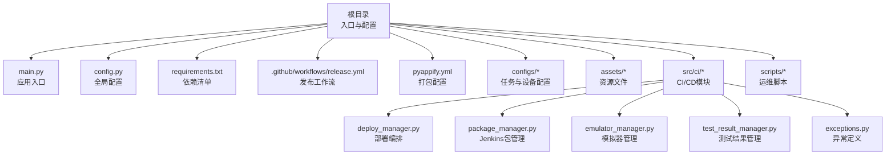
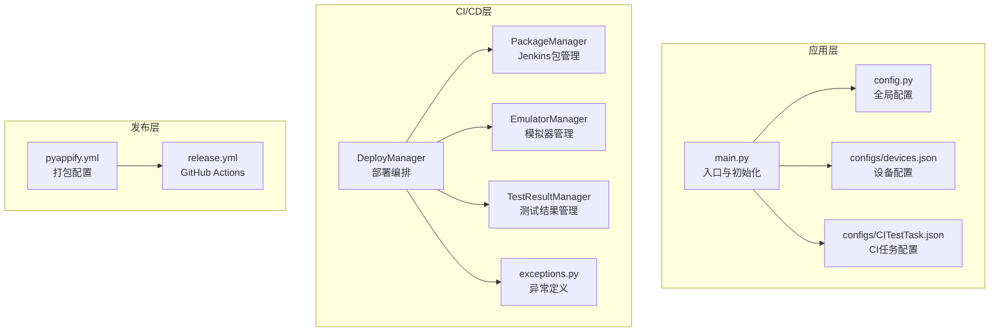
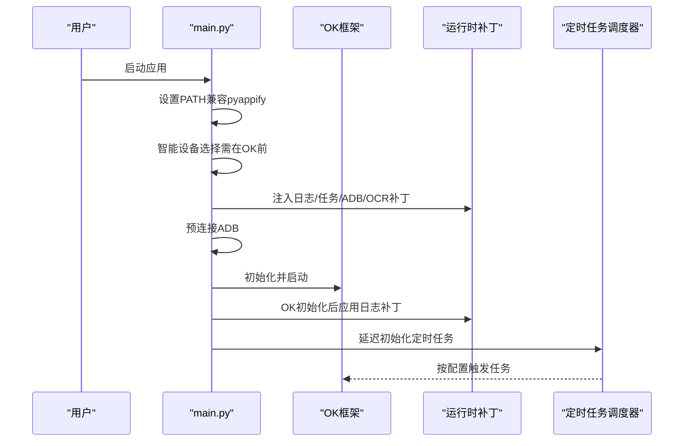
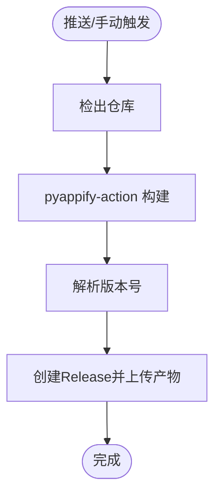
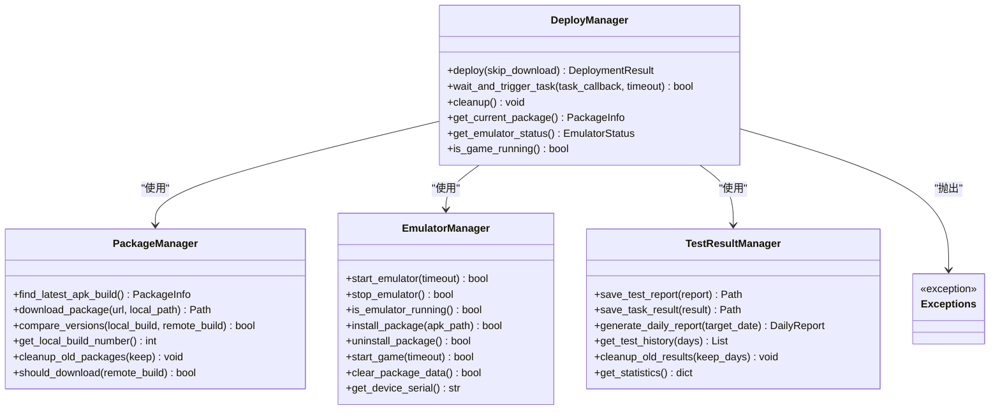
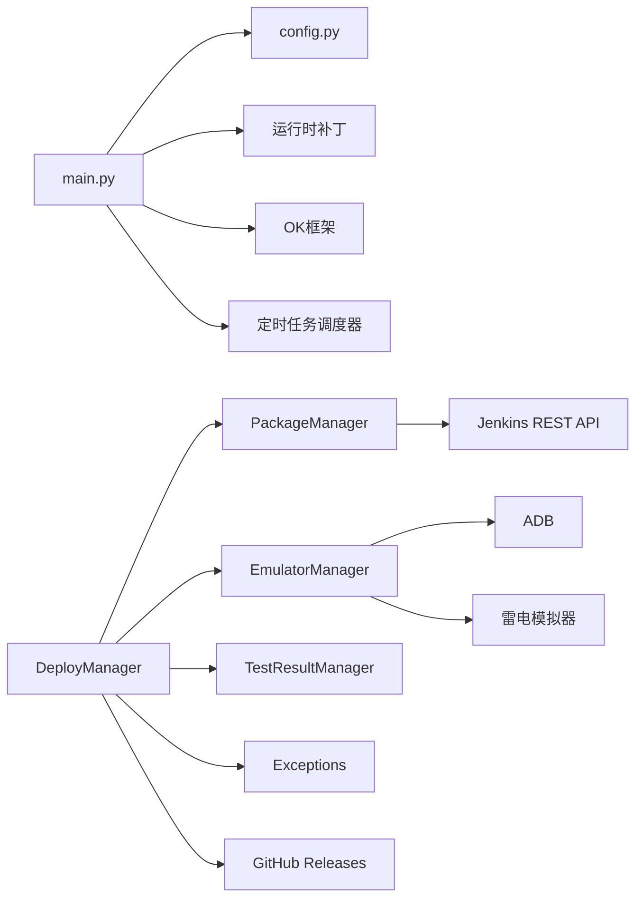

# 部署运维

<cite>
**本文档引用的文件**
- [README.md](file://README.md)
- [pyappify.yml](file://pyappify.yml)
- [requirements.txt](file://requirements.txt)
- [main.py](file://main.py)
- [main_debug.py](file://main_debug.py)
- [config.py](file://config.py)
- [.github/workflows/release.yml](file://.github/workflows/release.yml)
- [src/ci/deploy_manager.py](file://src/ci/deploy_manager.py)
- [src/ci/package_manager.py](file://src/ci/package_manager.py)
- [src/ci/emulator_manager.py](file://src/ci/emulator_manager.py)
- [src/ci/test_result_manager.py](file://src/ci/test_result_manager.py)
- [src/ci/exceptions.py](file://src/ci/exceptions.py)
- [scripts/fix_ok_script_window.py](file://scripts/fix_ok_script_window.py)
- [configs/CITestTask.json](file://configs/CITestTask.json)
- [configs/devices.json](file://configs/devices.json)
- [test_results/2026-03-31/21-51-28/report.json](file://test_results/2026-03-31/21-51-28/report.json)
</cite>

## 目录
1. [简介](#简介)
2. [项目结构](#项目结构)
3. [核心组件](#核心组件)
4. [架构总览](#架构总览)
5. [详细组件分析](#详细组件分析)
6. [依赖关系分析](#依赖关系分析)
7. [性能考虑](#性能考虑)
8. [故障排除指南](#故障排除指南)
9. [结论](#结论)
10. [附录](#附录)

## 简介
本文件面向运维工程师，提供 ok-jump 项目的部署与运维全生命周期指导。内容涵盖环境配置、依赖管理、启动脚本、打包与分发（含 pyappify 配置与 GitHub Actions 工作流）、自动化发布、监控与维护策略、故障排除、版本管理与更新机制等，帮助确保项目在 Windows 环境下的稳定运行。

## 项目结构
项目采用“应用入口 + 配置 + CI/CD + 资源”的组织方式，核心入口位于根目录，配置集中于 configs 目录，CI/CD 相关逻辑位于 src/ci 子模块，打包与发布由 pyappify 与 GitHub Actions 驱动。

图表来源
- [main.py:659-693](file://main.py#L659-L693)
- [config.py:68-146](file://config.py#L68-L146)
- [requirements.txt:1-17](file://requirements.txt#L1-L17)
- [.github/workflows/release.yml:1-65](file://.github/workflows/release.yml#L1-L65)
- [pyappify.yml:1-18](file://pyappify.yml#L1-L18)
- [src/ci/deploy_manager.py:38-428](file://src/ci/deploy_manager.py#L38-L428)
- [src/ci/package_manager.py:37-380](file://src/ci/package_manager.py#L37-L380)
- [src/ci/emulator_manager.py:39-457](file://src/ci/emulator_manager.py#L39-L457)
- [src/ci/test_result_manager.py:73-327](file://src/ci/test_result_manager.py#L73-L327)

章节来源
- [README.md:1-8](file://README.md#L1-L8)
- [main.py:659-693](file://main.py#L659-L693)
- [config.py:68-146](file://config.py#L68-L146)
- [requirements.txt:1-17](file://requirements.txt#L1-L17)
- [.github/workflows/release.yml:1-65](file://.github/workflows/release.yml#L1-L65)
- [pyappify.yml:1-18](file://pyappify.yml#L1-L18)

## 核心组件
- 应用入口与启动流程
  - main.py 提供应用初始化、补丁注入、ADB 预连接、定时任务调度、日志导出等能力，并在末尾启动 OK 框架。
- 配置中心
  - config.py 定义全局配置项，包括 OCR、模板匹配、窗口交互、ADB、分辨率适配、窗口尺寸、日志路径、一次性任务与触发任务列表、自定义标签页等。
- 依赖管理
  - requirements.txt 声明运行所需第三方库，覆盖图形界面、网络请求、图像处理、ADB、日志轮转、OCR 等。
- 打包与分发
  - pyappify.yml 定义两个打包配置文件（中国镜像加速与 Debug 控制台输出），配合 GitHub Actions release.yml 实现自动化发布。
- CI/CD 编排
  - src/ci 子模块提供 Jenkins 包下载、模拟器管理、游戏安装与启动、任务触发与等待、测试结果管理等能力。

章节来源
- [main.py:22-693](file://main.py#L22-L693)
- [config.py:68-146](file://config.py#L68-L146)
- [requirements.txt:1-17](file://requirements.txt#L1-L17)
- [pyappify.yml:1-18](file://pyappify.yml#L1-L18)
- [.github/workflows/release.yml:1-65](file://.github/workflows/release.yml#L1-L65)
- [src/ci/deploy_manager.py:38-428](file://src/ci/deploy_manager.py#L38-L428)
- [src/ci/package_manager.py:37-380](file://src/ci/package_manager.py#L37-L380)
- [src/ci/emulator_manager.py:39-457](file://src/ci/emulator_manager.py#L39-L457)
- [src/ci/test_result_manager.py:73-327](file://src/ci/test_result_manager.py#L73-L327)

## 架构总览
整体架构分为三层：
- 应用层：main.py 作为入口，负责初始化、打补丁、调度定时任务、启动 GUI。
- 配置层：config.py 提供统一配置；configs/* 提供任务与设备配置；assets/* 提供资源。
- CI/CD 层：src/ci/* 提供包下载、模拟器管理、游戏启动、任务触发与结果管理；GitHub Actions 负责打包与发布。

图表来源
- [main.py:659-693](file://main.py#L659-L693)
- [config.py:68-146](file://config.py#L68-L146)
- [configs/devices.json:1-7](file://configs/devices.json#L1-L7)
- [configs/CITestTask.json:1-29](file://configs/CITestTask.json#L1-L29)
- [src/ci/deploy_manager.py:38-428](file://src/ci/deploy_manager.py#L38-L428)
- [src/ci/package_manager.py:37-380](file://src/ci/package_manager.py#L37-L380)
- [src/ci/emulator_manager.py:39-457](file://src/ci/emulator_manager.py#L39-L457)
- [src/ci/test_result_manager.py:73-327](file://src/ci/test_result_manager.py#L73-L327)
- [src/ci/exceptions.py:8-46](file://src/ci/exceptions.py#L8-L46)
- [pyappify.yml:1-18](file://pyappify.yml#L1-L18)
- [.github/workflows/release.yml:1-65](file://.github/workflows/release.yml#L1-L65)

## 详细组件分析

### 应用入口与启动流程（main.py）
- 关键职责
  - 设置 PATH 环境变量以兼容 pyappify 启动行为。
  - 注入多个运行时补丁：日志处理器、任务按钮停止逻辑、设备检查策略、ADB 连接错误级别调整、OCR 与捕获模块噪声过滤、按钮对齐修复。
  - 预连接 ADB，智能选择设备（PC 或模拟器），延迟初始化定时任务调度器。
  - 启动 OK 框架并进入 GUI 循环。
- 启动顺序要点
  - 智能设备选择必须在 OK 初始化前执行。
  - 日志补丁在 OK 初始化后应用，确保日志句柄已建立。
  - 定时任务调度器在 GUI 启动后延迟初始化，确保 StartController 可用。

图表来源
- [main.py:659-693](file://main.py#L659-L693)

章节来源
- [main.py:22-693](file://main.py#L22-L693)

### 配置中心（config.py）
- 全局配置项
  - OCR 参数（ONNX-OCR，OpenVINO/NPU 选项）
  - 模板匹配参数（coco 特征 JSON、默认阈值）
  - 窗口参数（标题、可执行文件名、窗口类名、交互方式、截图方法、最小化/离屏允许）
  - ADB 参数（启用、包名）
  - 分辨率与窗口尺寸
  - 日志文件路径、截图目录
  - 一次性任务与触发任务列表
  - 自定义标签页（实时日志监控）
  - 场景与全局对象（YOLO 等）
- 配置读取与路径
  - 提供获取资源与配置路径的辅助函数，便于跨模块使用。

章节来源
- [config.py:68-146](file://config.py#L68-L146)

### 依赖管理（requirements.txt）
- 核心依赖类别
  - 图形界面与主题：PySide6-Essentials、PySide6-Fluent-Widgets
  - 网络与调度：requests、schedule
  - 图像与 OCR：opencv-python、numpy、onnxruntime、onnxruntime-directml、onnxocr
  - 设备与系统：adbutils、pywin32、psutil、pydirectinput
  - 剪贴板与繁简转换：pyperclip、opencc
  - 脚本框架：ok-script
- 安装建议
  - 使用 pyappify 的 pip 参数（镜像源、超时与重试）进行稳定安装。

章节来源
- [requirements.txt:1-17](file://requirements.txt#L1-L17)
- [pyappify.yml:10-12](file://pyappify.yml#L10-L12)

### 打包与分发（pyappify.yml + release.yml）
- pyappify 配置
  - 定义两个打包配置文件：中国镜像加速版（use_pythonw、pip 参数）与 Debug 版（控制台输出）。
  - 指定主脚本、Python 版本要求、依赖文件。
- GitHub Actions 工作流
  - 触发条件：推送标签（v*）或手动触发。
  - 步骤：检出仓库、使用 pyappify-action 构建、获取版本号、创建发布并上传 pyappify_dist/* 产物。
  - 权限：允许写入 Release。

图表来源
- [.github/workflows/release.yml:1-65](file://.github/workflows/release.yml#L1-L65)
- [pyappify.yml:1-18](file://pyappify.yml#L1-L18)

章节来源
- [pyappify.yml:1-18](file://pyappify.yml#L1-L18)
- [.github/workflows/release.yml:1-65](file://.github/workflows/release.yml#L1-L65)

### CI/CD 编排（src/ci/*）
- DeployManager
  - 整合包下载、模拟器启动、APK 安装、游戏启动、任务触发与等待、清理等流程。
  - 提供部署结果封装与超时/进程退出异常处理。
- PackageManager
  - 从 Jenkins REST API 获取构建列表，定位 Build 文件夹下的 APK，解析版本信息，支持断点续传与重试。
- EmulatorManager
  - 启停模拟器、安装/卸载 APK、启动游戏、检测进程、清理数据、刷新 ok 框架设备连接。
- TestResultManager
  - 保存测试报告与任务结果，生成每日报告、历史记录查询、统计数据与清理策略。
- 异常体系
  - 定义包下载、模拟器启动、游戏启动超时、任务触发超时、游戏停滞、连续失败、进程退出等异常类型。

图表来源
- [src/ci/deploy_manager.py:38-428](file://src/ci/deploy_manager.py#L38-L428)
- [src/ci/package_manager.py:37-380](file://src/ci/package_manager.py#L37-L380)
- [src/ci/emulator_manager.py:39-457](file://src/ci/emulator_manager.py#L39-L457)
- [src/ci/test_result_manager.py:73-327](file://src/ci/test_result_manager.py#L73-L327)
- [src/ci/exceptions.py:8-46](file://src/ci/exceptions.py#L8-L46)

章节来源
- [src/ci/deploy_manager.py:38-428](file://src/ci/deploy_manager.py#L38-L428)
- [src/ci/package_manager.py:37-380](file://src/ci/package_manager.py#L37-L380)
- [src/ci/emulator_manager.py:39-457](file://src/ci/emulator_manager.py#L39-L457)
- [src/ci/test_result_manager.py:73-327](file://src/ci/test_result_manager.py#L73-L327)
- [src/ci/exceptions.py:8-46](file://src/ci/exceptions.py#L8-L46)

### 运维脚本（scripts/fix_ok_script_window.py）
- 作用：修复 ok-script 框架中 window.py 的 NoSuchProcess 异常处理问题，避免模拟器关闭后产生噪声日志。
- 使用场景：在 CI 或本地环境中，若出现大量 NoSuchProcess 错误日志，可运行该脚本对 site-packages 中的 window.py 进行修补。

章节来源
- [scripts/fix_ok_script_window.py:1-84](file://scripts/fix_ok_script_window.py#L1-L84)

## 依赖关系分析
- 组件耦合
  - main.py 依赖 config.py、多个补丁模块与 OK 框架；与定时任务调度器存在延迟初始化依赖。
  - CI/CD 模块之间高内聚：DeployManager 组合 PackageManager 与 EmulatorManager，二者分别负责包与设备侧能力。
- 外部依赖
  - Jenkins（REST API）、ADB、雷电模拟器、GitHub Releases。
- 潜在风险
  - ADB 连接超时与设备状态不稳定；模拟器启动超时；Jenkins 构建产物缺失；日志噪声影响可观测性。

图表来源
- [main.py:659-693](file://main.py#L659-L693)
- [config.py:68-146](file://config.py#L68-L146)
- [src/ci/deploy_manager.py:38-428](file://src/ci/deploy_manager.py#L38-L428)
- [src/ci/package_manager.py:37-380](file://src/ci/package_manager.py#L37-L380)
- [src/ci/emulator_manager.py:39-457](file://src/ci/emulator_manager.py#L39-L457)
- [src/ci/test_result_manager.py:73-327](file://src/ci/test_result_manager.py#L73-L327)
- [.github/workflows/release.yml:1-65](file://.github/workflows/release.yml#L1-L65)

章节来源
- [main.py:659-693](file://main.py#L659-L693)
- [src/ci/deploy_manager.py:38-428](file://src/ci/deploy_manager.py#L38-L428)
- [src/ci/package_manager.py:37-380](file://src/ci/package_manager.py#L37-L380)
- [src/ci/emulator_manager.py:39-457](file://src/ci/emulator_manager.py#L39-L457)
- [src/ci/test_result_manager.py:73-327](file://src/ci/test_result_manager.py#L73-L327)
- [.github/workflows/release.yml:1-65](file://.github/workflows/release.yml#L1-L65)

## 性能考虑
- CPU/GPU 使用率
  - 通过 config.basic_config_option 中的“触发间隔”参数增加任务间延迟，可显著降低资源占用。
- OCR 与图像处理
  - 合理设置 OCR 的 OpenVINO/NPU 选项，平衡准确度与性能。
- 日志与 I/O
  - 通过日志补丁抑制常见噪声（负框、进程不存在），减少磁盘写入与日志解析开销。
- ADB 连接稳定性
  - 使用预连接与重试策略，避免频繁超时造成的阻塞。

章节来源
- [config.py:40-66](file://config.py#L40-L66)
- [main.py:22-693](file://main.py#L22-L693)

## 故障排除指南
- 常见问题与定位
  - ADB 连接超时/错误：检查模拟器端口与实例索引配置，确认 ldconsole 可用；参考 adb_connect 补丁的日志级别调整。
  - 模拟器启动超时：增大模拟器启动超时配置，检查模拟器路径与权限。
  - 游戏进程未启动：确认 APK 安装成功、包名正确、启动命令发送成功。
  - 任务触发超时：检查任务触发延迟与超时配置，确认游戏进程在等待期间未退出。
  - 日志噪声：使用日志补丁与修复脚本减少无关错误日志。
- 诊断步骤
  - 查看 logs 目录与导出日志压缩包。
  - 检查 test_results 历史报告，定位失败类型与趋势。
  - 核对 configs/CITestTask.json 与 configs/devices.json 的配置项。
- 相关实现参考
  - 日志补丁与噪声过滤：[main.py:22-693](file://main.py#L22-L693)
  - 任务触发与等待：[src/ci/deploy_manager.py:247-308](file://src/ci/deploy_manager.py#L247-L308)
  - 异常类型定义：[src/ci/exceptions.py:8-46](file://src/ci/exceptions.py#L8-L46)
  - 历史报告示例：[test_results/2026-03-31/21-51-28/report.json:1-27](file://test_results/2026-03-31/21-51-28/report.json#L1-L27)

章节来源
- [main.py:22-693](file://main.py#L22-L693)
- [src/ci/deploy_manager.py:247-308](file://src/ci/deploy_manager.py#L247-L308)
- [src/ci/exceptions.py:8-46](file://src/ci/exceptions.py#L8-L46)
- [test_results/2026-03-31/21-51-28/report.json:1-27](file://test_results/2026-03-31/21-51-28/report.json#L1-L27)

## 结论
通过规范化的环境配置、严格的依赖管理、完善的启动流程与日志补丁、以及基于 pyappify 与 GitHub Actions 的自动化打包发布，ok-jump 项目具备了稳定的部署与运维基础。结合 CI/CD 模块的部署编排、模拟器管理与测试结果管理，可实现从包下载到任务触发的全链路自动化与可观测性保障。建议在生产环境中持续关注 ADB 与模拟器稳定性、日志噪声治理与资源占用优化，并定期审查配置与异常处理策略。

## 附录
- 启动脚本
  - 生产版：main.py
  - Debug 版：main_debug.py（禁用 GUI，开启 debug）
- 配置文件
  - 全局配置：config.py
  - 设备配置：configs/devices.json
  - CI 任务配置：configs/CITestTask.json
- 运维脚本
  - 修复 ok-script window.py 异常处理：scripts/fix_ok_script_window.py
- 发布流程
  - pyappify.yml + .github/workflows/release.yml

章节来源
- [main.py:659-693](file://main.py#L659-L693)
- [main_debug.py:1-16](file://main_debug.py#L1-L16)
- [config.py:68-146](file://config.py#L68-L146)
- [configs/devices.json:1-7](file://configs/devices.json#L1-L7)
- [configs/CITestTask.json:1-29](file://configs/CITestTask.json#L1-L29)
- [scripts/fix_ok_script_window.py:1-84](file://scripts/fix_ok_script_window.py#L1-L84)
- [pyappify.yml:1-18](file://pyappify.yml#L1-L18)
- [.github/workflows/release.yml:1-65](file://.github/workflows/release.yml#L1-L65)