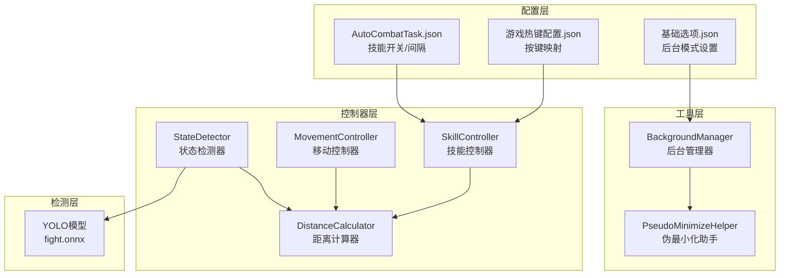
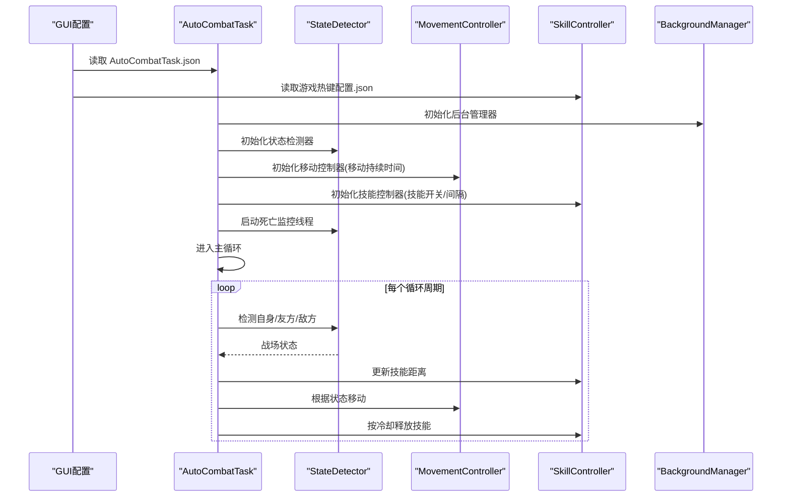
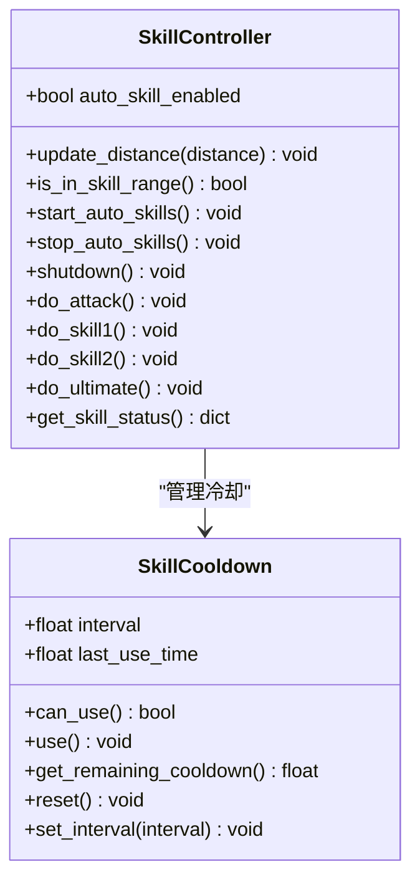
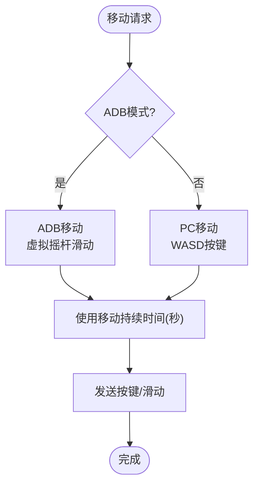
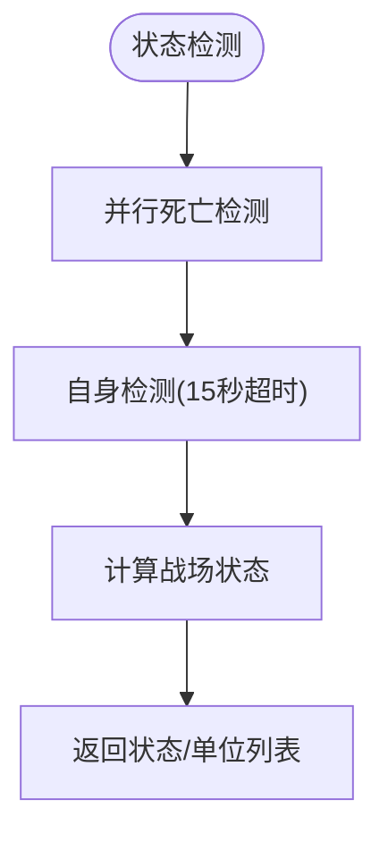
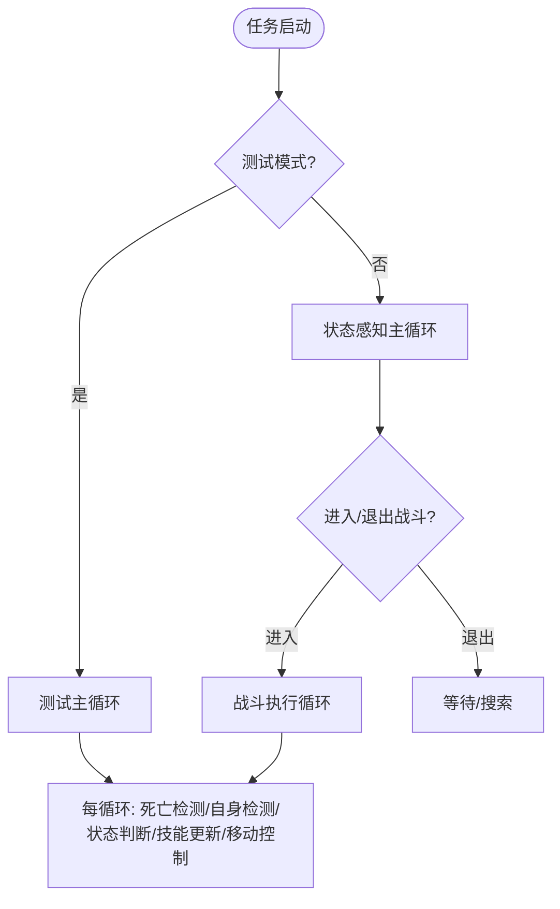
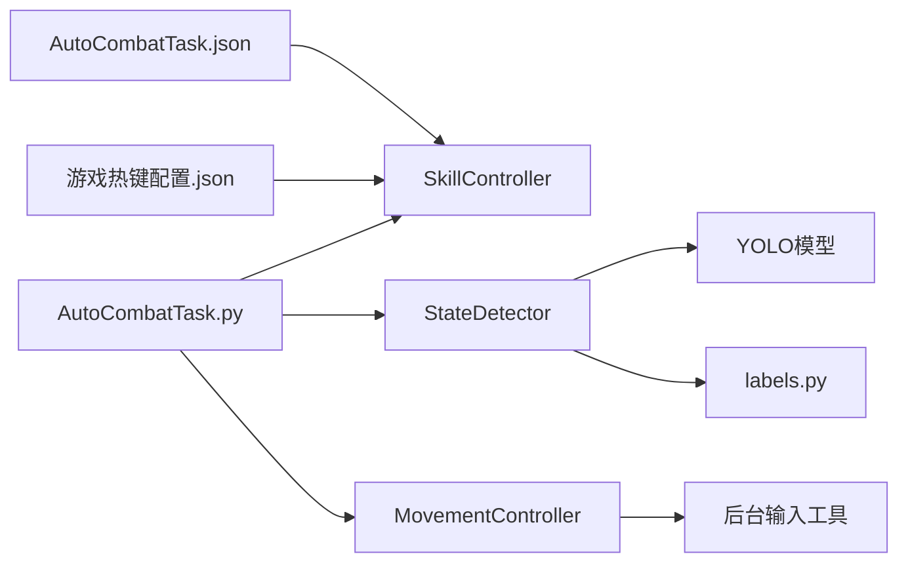

# 战斗系统配置

<cite>
**本文档引用的文件**
- [AutoCombatTask.json](file://configs/AutoCombatTask.json)
- [游戏热键配置.json](file://configs/游戏热键配置.json)
- [AutoCombatTask.py](file://src/task/AutoCombatTask.py)
- [skill_controller.py](file://src/combat/skill_controller.py)
- [movement_controller.py](file://src/combat/movement_controller.py)
- [state_detector.py](file://src/combat/state_detector.py)
- [自动战斗系统流程图.md](file://docs/自动战斗系统流程图.md)
- [labels.py](file://src/combat/labels.py)
- [features.py](file://src/constants/features.py)
</cite>

## 目录
1. [简介](#简介)
2. [项目结构](#项目结构)
3. [核心组件](#核心组件)
4. [架构总览](#架构总览)
5. [详细组件分析](#详细组件分析)
6. [依赖关系分析](#依赖关系分析)
7. [性能考虑](#性能考虑)
8. [故障排除指南](#故障排除指南)
9. [结论](#结论)

## 简介
本文件面向 ok-jump 项目的自动战斗系统，围绕 AutoCombatTask.json 配置文件进行深入解析，涵盖基础配置、攻击控制、技能释放间隔、移动控制等关键参数，并结合实际代码实现提供优化建议与性能调优指导。读者无需深厚的编程背景，即可通过本指南理解并合理配置自动战斗功能。

## 项目结构
自动战斗系统由配置层、控制器层、检测层与工具层组成，配置文件通过 GUI 驱动控制器，控制器再通过 YOLO 检测与后台输入实现战斗自动化。

图表来源
- [自动战斗系统流程图.md:7-39](file://docs/自动战斗系统流程图.md#L7-L39)

章节来源
- [自动战斗系统流程图.md:1-39](file://docs/自动战斗系统流程图.md#L1-L39)

## 核心组件
- AutoCombatTask.json：定义自动战斗的基础配置与技能释放间隔，包括启用状态、测试模式、详细日志、技能开关与间隔、移动持续时间等。
- 游戏热键配置.json：定义普通攻击、技能1、技能2、大招对应的按键映射。
- AutoCombatTask.py：主任务逻辑，负责初始化控制器、状态检测、主循环与异常处理。
- SkillController：技能控制器，负责按键发送、冷却管理与技能释放。
- MovementController：移动控制器，负责键盘/虚拟摇杆移动与后台输入。
- StateDetector：状态检测器，负责 YOLO 检测自身、友方、敌方与死亡状态，并提供战斗状态判断。
- labels.py：YOLO 检测标签定义，明确各类别含义。
- features.py：特征常量定义，统一管理各类 UI/场景特征名称。

章节来源
- [AutoCombatTask.json:1-14](file://configs/AutoCombatTask.json#L1-L14)
- [游戏热键配置.json:1-6](file://configs/游戏热键配置.json#L1-L6)
- [AutoCombatTask.py:143-198](file://src/task/AutoCombatTask.py#L143-L198)
- [skill_controller.py:82-149](file://src/combat/skill_controller.py#L82-L149)
- [movement_controller.py:24-61](file://src/combat/movement_controller.py#L24-L61)
- [state_detector.py:24-63](file://src/combat/state_detector.py#L24-L63)
- [labels.py:8-37](file://src/combat/labels.py#L8-L37)
- [features.py:9-99](file://src/constants/features.py#L9-L99)

## 架构总览
自动战斗系统采用“配置驱动 + 控制器分层”的设计，配置文件通过 GUI 与任务配置共同驱动控制器，控制器通过 YOLO 检测与后台输入实现战斗自动化。系统支持后台模式与伪最小化，具备并行死亡检测与状态感知主循环。

图表来源
- [AutoCombatTask.py:199-263](file://src/task/AutoCombatTask.py#L199-L263)
- [skill_controller.py:226-252](file://src/combat/skill_controller.py#L226-L252)
- [movement_controller.py:106-165](file://src/combat/movement_controller.py#L106-L165)
- [state_detector.py:83-128](file://src/combat/state_detector.py#L83-L128)

## 详细组件分析

### AutoCombatTask.json 配置详解
AutoCombatTask.json 提供自动战斗的核心参数，包括基础配置与技能释放间隔。以下为各项参数的说明与建议：

- 基础配置
  - _enabled：任务启用状态（由框架控制）
  - 测试模式：启用后跳过场景检测，直接进入战斗主循环，适合调试
  - 详细日志：启用后输出 YOLO 检测结果、位置、距离等详细信息，便于排障
- 攻击控制配置
  - 自动普攻：启用后自动释放普通攻击
  - 自动技能1：启用后自动释放技能1
  - 自动技能2：启用后自动释放技能2
  - 自动大招：启用后自动释放大招
- 技能释放间隔配置（秒）
  - 普攻间隔(秒)：普通攻击冷却时间，建议根据角色普攻节奏与帧率调整
  - 技能1间隔(秒)：技能1冷却时间，建议与技能实际冷却一致
  - 技能2间隔(秒)：技能2冷却时间，建议与技能实际冷却一致
  - 大招间隔(秒)：大招冷却时间，建议与大招实际冷却一致
- 移动控制配置
  - 移动持续时间(秒)：每次移动按键持续的时间，值越大移动距离越长；建议根据分辨率与角色移动速度调整

章节来源
- [AutoCombatTask.json:1-14](file://configs/AutoCombatTask.json#L1-L14)
- [AutoCombatTask.py:148-172](file://src/task/AutoCombatTask.py#L148-L172)
- [skill_controller.py:356-369](file://src/combat/skill_controller.py#L356-L369)
- [movement_controller.py:39-70](file://src/combat/movement_controller.py#L39-L70)

### 技能控制器（SkillController）
技能控制器负责按键发送与冷却管理，支持后台模式与独立冷却机制。其关键点如下：
- 独立冷却：每个技能拥有独立冷却计时器，互不影响
- 配置驱动：技能开关与间隔从 AutoCombatTask.json 读取，按键映射从游戏热键配置.json 读取
- 后台支持：使用 SendInput 发送按键，支持 Unity 游戏后台操作
- 监控线程：独立线程持续监控距离并在范围内释放技能

图表来源
- [skill_controller.py:29-80](file://src/combat/skill_controller.py#L29-L80)
- [skill_controller.py:82-149](file://src/combat/skill_controller.py#L82-L149)

章节来源
- [skill_controller.py:82-149](file://src/combat/skill_controller.py#L82-L149)
- [skill_controller.py:226-370](file://src/combat/skill_controller.py#L226-L370)
- [skill_controller.py:463-507](file://src/combat/skill_controller.py#L463-L507)

### 移动控制器（MovementController）
移动控制器负责角色移动，支持 PC 端 WASD 键盘与手机端虚拟摇杆，具备后台输入能力与伪最小化支持：
- PC 端：WASD 键盘控制，支持后台窗口按键发送
- 手机端：虚拟摇杆滑动控制，基于分辨率适配
- 后台支持：使用 SendInput 与 pydirectinput 的智能适配
- 移动持续时间：由 AutoCombatTask.json 的移动持续时间(秒)控制

图表来源
- [movement_controller.py:106-165](file://src/combat/movement_controller.py#L106-L165)
- [movement_controller.py:426-461](file://src/combat/movement_controller.py#L426-L461)
- [movement_controller.py:461-512](file://src/combat/movement_controller.py#L461-L512)

章节来源
- [movement_controller.py:24-61](file://src/combat/movement_controller.py#L24-L61)
- [movement_controller.py:106-165](file://src/combat/movement_controller.py#L106-L165)
- [movement_controller.py:426-512](file://src/combat/movement_controller.py#L426-L512)

### 状态检测器（StateDetector）
状态检测器使用 YOLO 模型进行战场状态判断与单位检测：
- 死亡状态检测：并行后台线程持续监控，快速响应
- 自身检测：15 秒超时检测自身位置
- 战场状态：根据友方/敌方是否存在，判断 NO_UNITS/ALLIES_ONLY/ENEMIES_ONLY/MIXED
- 战斗状态感知：通过自身检测判断是否进入/退出战斗场景

图表来源
- [state_detector.py:83-128](file://src/combat/state_detector.py#L83-L128)
- [state_detector.py:243-324](file://src/combat/state_detector.py#L243-L324)
- [state_detector.py:394-447](file://src/combat/state_detector.py#L394-L447)

章节来源
- [state_detector.py:24-63](file://src/combat/state_detector.py#L24-L63)
- [state_detector.py:83-128](file://src/combat/state_detector.py#L83-L128)
- [state_detector.py:394-447](file://src/combat/state_detector.py#L394-L447)

### AutoCombatTask 主循环与状态处理
AutoCombatTask 的主循环根据测试模式与状态感知主循环决定运行方式：
- 测试模式：跳过场景检测，直接进入战斗主循环
- 正常模式：通过 YOLO 自身检测动态启停战斗，具备防抖动机制
- 战场状态处理：根据 NO_UNITS/ALLIES_ONLY/ENEMIES_ONLY/MIXED 执行不同策略

图表来源
- [AutoCombatTask.py:199-263](file://src/task/AutoCombatTask.py#L199-L263)
- [AutoCombatTask.py:357-451](file://src/task/AutoCombatTask.py#L357-L451)
- [AutoCombatTask.py:452-516](file://src/task/AutoCombatTask.py#L452-L516)

章节来源
- [AutoCombatTask.py:199-263](file://src/task/AutoCombatTask.py#L199-L263)
- [AutoCombatTask.py:357-451](file://src/task/AutoCombatTask.py#L357-L451)
- [AutoCombatTask.py:452-516](file://src/task/AutoCombatTask.py#L452-L516)

## 依赖关系分析
- AutoCombatTask.json 与 游戏热键配置.json 作为配置源，分别驱动 SkillController 的技能开关/间隔与按键映射
- AutoCombatTask.py 作为主任务，依赖 StateDetector、MovementController、SkillController、DistanceCalculator
- StateDetector 依赖 YOLO 模型与 labels.py 中的标签定义
- MovementController 依赖后台输入工具与分辨率适配
- 技能释放逻辑与移动控制逻辑相互解耦，通过距离与状态进行协调

图表来源
- [AutoCombatTask.py:265-279](file://src/task/AutoCombatTask.py#L265-L279)
- [skill_controller.py:375-425](file://src/combat/skill_controller.py#L375-L425)
- [state_detector.py:163-167](file://src/combat/state_detector.py#L163-L167)
- [labels.py:8-37](file://src/combat/labels.py#L8-L37)

章节来源
- [AutoCombatTask.py:265-279](file://src/task/AutoCombatTask.py#L265-L279)
- [skill_controller.py:375-425](file://src/combat/skill_controller.py#L375-L425)
- [state_detector.py:163-167](file://src/combat/state_detector.py#L163-L167)
- [labels.py:8-37](file://src/combat/labels.py#L8-L37)

## 性能考虑
- 死亡检测频率：并行后台线程以 30ms 间隔检测死亡状态，显著提升响应速度
- 主循环延迟：在非测试模式下为 50ms，测试模式下为 100ms，兼顾实时性与稳定性
- 后台支持：支持伪后台模式，避免窗口激活导致的性能损耗
- 技能冷却：独立冷却计时器避免技能间互相干扰，提高释放精度
- 移动控制：移动持续时间可调，建议根据分辨率与角色移动速度进行优化

章节来源
- [state_detector.py:52-53](file://src/combat/state_detector.py#L52-L53)
- [state_detector.py:129-195](file://src/combat/state_detector.py#L129-L195)
- [AutoCombatTask.py:192-193](file://src/task/AutoCombatTask.py#L192-L193)
- [movement_controller.py:426-461](file://src/combat/movement_controller.py#L426-L461)

## 故障排除指南
- 自身检测超时：若 15 秒内未检测到自身，系统会记录帧信息并抛出异常。建议检查 YOLO 模型与摄像头/窗口状态
- 战斗结束检测：通过模板匹配 fight_end.png 与 OCR 检测“对战结束”文字判断战斗结束
- 死亡状态误判：死亡检测具备防抖动机制，连续多次检测结果才会确认状态变化
- 后台模式异常：确保后台管理器已正确初始化，并检查伪最小化流程
- 技能释放异常：检查 AutoCombatTask.json 中技能开关与间隔配置，以及游戏热键配置.json 中按键映射

章节来源
- [AutoCombatTask.py:323-355](file://src/task/AutoCombatTask.py#L323-L355)
- [state_detector.py:169-194](file://src/combat/state_detector.py#L169-L194)
- [state_detector.py:510-553](file://src/combat/state_detector.py#L510-L553)

## 结论
AutoCombatTask.json 为自动战斗系统提供了灵活且强大的配置能力，配合 SkillController、MovementController 与 StateDetector 的协同工作，实现了稳定高效的自动化战斗体验。通过合理设置技能开关与间隔、移动持续时间，并结合后台模式与伪最小化支持，可在保证性能的同时获得良好的战斗效果。建议在实际使用中根据角色特性与游戏环境逐步微调参数，以达到最优表现。