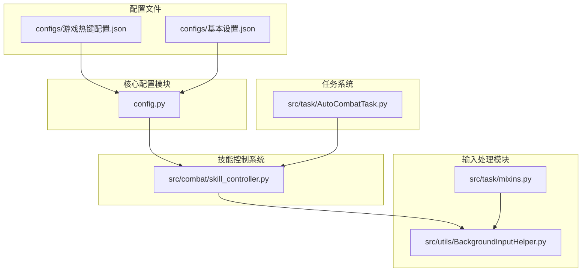
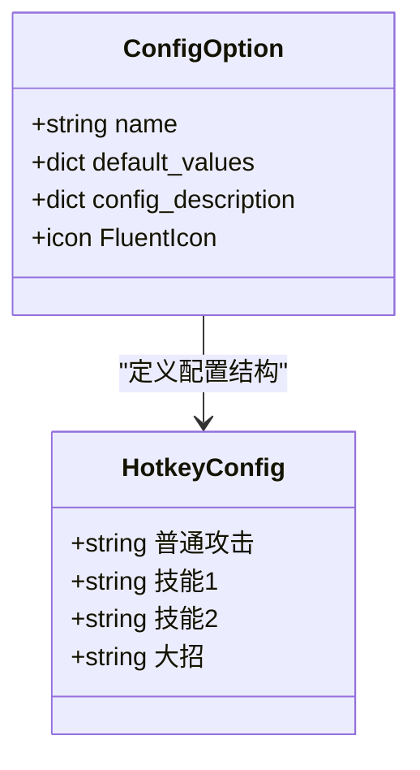
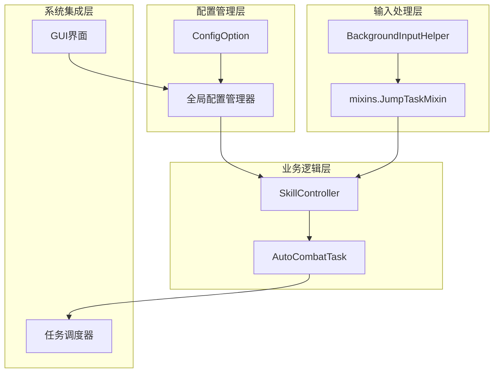
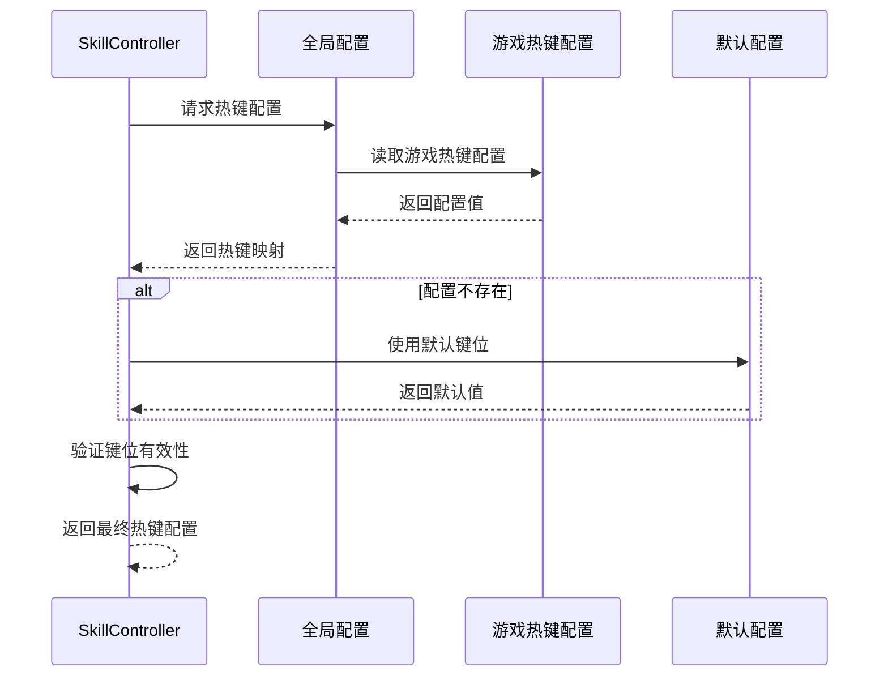
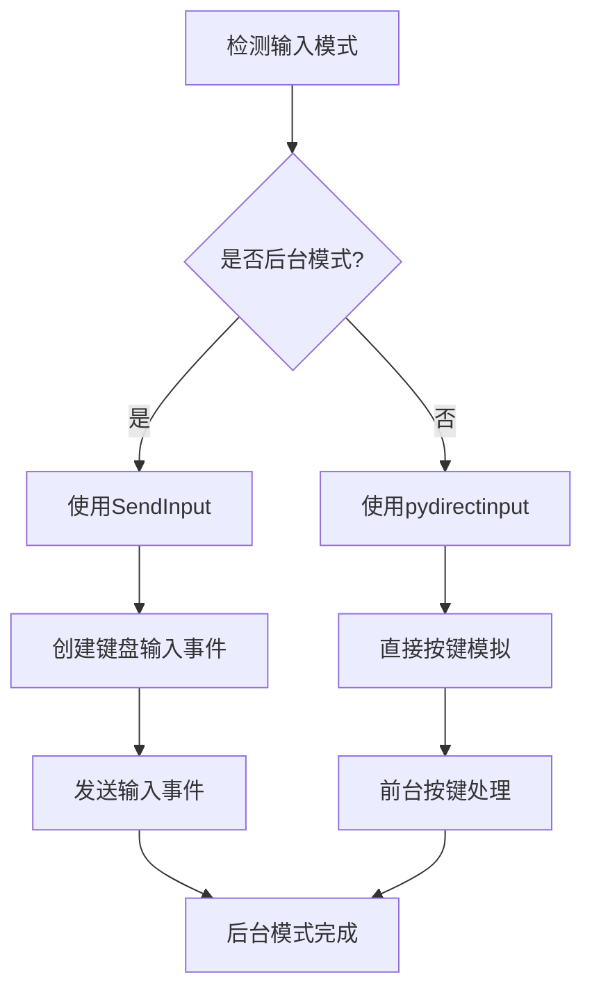
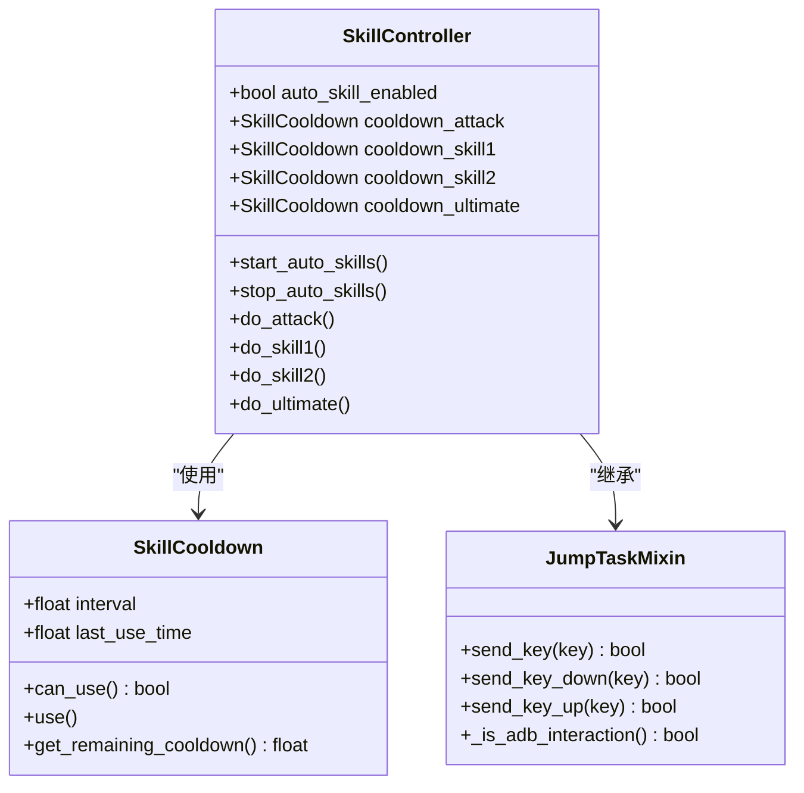
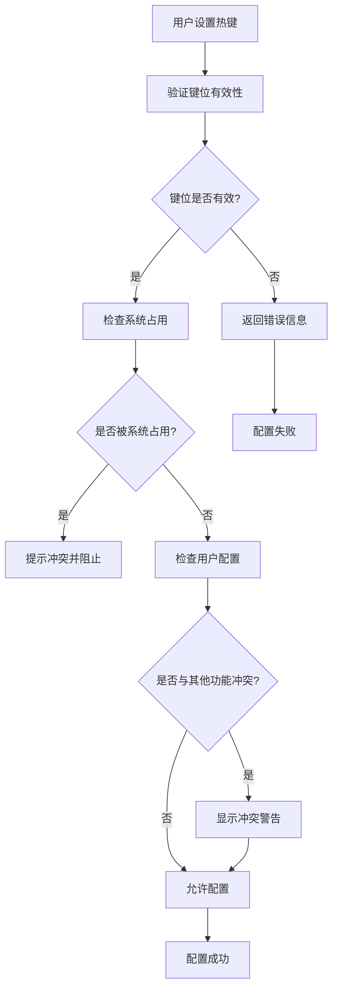
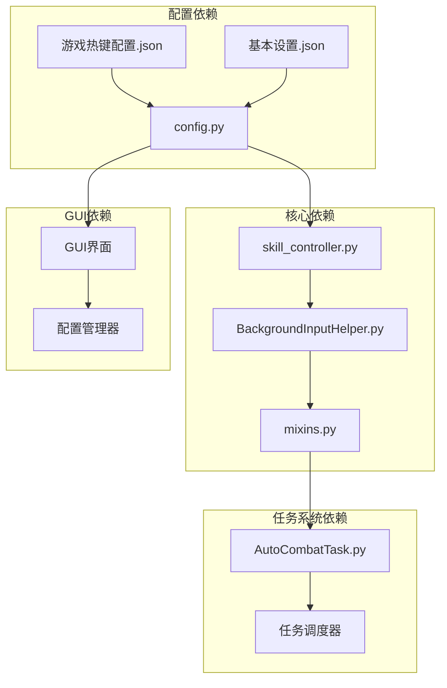

# 热键配置管理

<cite>
**本文档引用的文件**
- [游戏热键配置.json](file://configs/游戏热键配置.json)
- [config.py](file://config.py)
- [skill_controller.py](file://src/combat/skill_controller.py)
- [BackgroundInputHelper.py](file://src/utils/BackgroundInputHelper.py)
- [mixins.py](file://src/task/mixins.py)
- [AutoCombatTask.py](file://src/task/AutoCombatTask.py)
- [基本设置.json](file://configs/基本设置.json)
</cite>

## 目录
1. [简介](#简介)
2. [项目结构](#项目结构)
3. [核心组件](#核心组件)
4. [架构概览](#架构概览)
5. [详细组件分析](#详细组件分析)
6. [依赖关系分析](#依赖关系分析)
7. [性能考虑](#性能考虑)
8. [故障排除指南](#故障排除指南)
9. [结论](#结论)
10. [附录](#附录)

## 简介

ok-jump 项目的热键配置管理系统为游戏自动化提供了灵活的按键绑定机制。该系统支持多种功能键配置，包括普通攻击、技能释放、暂停/继续等操作，并具备智能的后台模式适配能力。

系统采用配置驱动的设计理念，通过 JSON 文件存储热键配置，结合 Python 后台输入助手实现跨平台的按键模拟。热键配置支持动态修改和实时生效，为用户提供了个性化的游戏自动化体验。

## 项目结构

热键配置系统主要分布在以下目录和文件中：

**图表来源**
- [游戏热键配置.json:1-6](file://configs/游戏热键配置.json#L1-L6)
- [config.py:23-38](file://config.py#L23-L38)
- [skill_controller.py:1-50](file://src/combat/skill_controller.py#L1-L50)

**章节来源**
- [游戏热键配置.json:1-6](file://configs/游戏热键配置.json#L1-L6)
- [config.py:23-38](file://config.py#L23-L38)
- [AutoCombatTask.py:143-163](file://src/task/AutoCombatTask.py#L143-L163)

## 核心组件

### 热键配置文件结构

游戏热键配置采用 JSON 格式存储，包含以下核心键值对：

| 功能 | 默认键位 | 配置键名 |
|------|----------|----------|
| 普通攻击 | J | 普通攻击 |
| 技能1 | K | 技能1 |
| 技能2 | U | 技能2 |
| 大招 | L | 大招 |

### 配置选项定义

系统通过 `ConfigOption` 类定义了完整的配置结构：

**图表来源**
- [config.py:23-38](file://config.py#L23-L38)

**章节来源**
- [config.py:23-38](file://config.py#L23-L38)
- [游戏热键配置.json:1-6](file://configs/游戏热键配置.json#L1-L6)

## 架构概览

热键配置系统采用分层架构设计，实现了配置管理、技能控制和输入处理的解耦：

**图表来源**
- [skill_controller.py:82-120](file://src/combat/skill_controller.py#L82-L120)
- [mixins.py:456-520](file://src/task/mixins.py#L456-L520)

## 详细组件分析

### 热键配置读取机制

技能控制器通过 `_get_hotkey_config` 方法实现热键配置的动态读取：

**图表来源**
- [skill_controller.py:408-425](file://src/combat/skill_controller.py#L408-L425)

### 后台输入处理机制

系统支持智能的后台模式适配，通过 `BackgroundInputHelper` 实现跨平台的按键模拟：

**图表来源**
- [BackgroundInputHelper.py:436-462](file://src/utils/BackgroundInputHelper.py#L436-L462)

### 技能控制集成

技能控制器与任务系统的深度集成，实现了热键配置的实时应用：

**图表来源**
- [skill_controller.py:82-150](file://src/combat/skill_controller.py#L82-L150)
- [mixins.py:456-520](file://src/task/mixins.py#L456-L520)

**章节来源**
- [skill_controller.py:226-253](file://src/combat/skill_controller.py#L226-L253)
- [BackgroundInputHelper.py:172-200](file://src/utils/BackgroundInputHelper.py#L172-L200)

### 热键冲突检测与解决方案

系统实现了多层次的热键冲突检测机制：

**图表来源**
- [BackgroundInputHelper.py:424-427](file://src/utils/BackgroundInputHelper.py#L424-L427)

**章节来源**
- [BackgroundInputHelper.py:424-427](file://src/utils/BackgroundInputHelper.py#L424-L427)

## 依赖关系分析

热键配置系统的核心依赖关系如下：

**图表来源**
- [config.py:23-38](file://config.py#L23-L38)
- [skill_controller.py:22-23](file://src/combat/skill_controller.py#L22-L23)

**章节来源**
- [config.py:1-53](file://config.py#L1-L53)
- [skill_controller.py:1-50](file://src/combat/skill_controller.py#L1-L50)

## 性能考虑

### 热键处理性能优化

系统在热键处理方面采用了多项性能优化策略：

1. **异步处理机制**：技能释放采用独立线程处理，避免阻塞主线程
2. **智能缓存策略**：热键配置采用延迟加载和缓存机制
3. **后台模式优化**：SendInput 方案相比 pydirectinput 具有更好的性能表现
4. **批量处理**：支持多个按键的批量处理，减少系统调用次数

### 内存管理

- 技能冷却器使用独立的锁机制，避免并发访问问题
- 后台输入助手支持资源的及时释放和清理
- 配置管理器提供内存使用情况的监控

## 故障排除指南

### 常见问题及解决方案

| 问题类型 | 症状描述 | 解决方案 |
|----------|----------|----------|
| 热键不响应 | 按键无反应 | 检查后台模式设置，确认游戏窗口在前台 |
| 键位冲突 | 系统快捷键失效 | 修改热键配置，避开系统默认快捷键 |
| 后台模式失效 | 最小化后按键无效 | 检查伪最小化功能，确认 SendInput 权限 |
| 配置不生效 | 修改后重启仍无效 | 清理配置缓存，重新加载配置文件 |

### 调试工具

系统提供了完善的调试功能：

- 详细日志输出，包含热键执行过程
- 配置验证机制，自动检测无效配置
- 性能监控，跟踪热键处理耗时
- 错误追踪，定位配置加载问题

**章节来源**
- [BackgroundInputHelper.py:465-473](file://src/utils/BackgroundInputHelper.py#L465-L473)

## 结论

ok-jump 项目的热键配置管理系统展现了优秀的架构设计和实现质量。系统通过配置驱动的方式实现了高度的灵活性和可扩展性，同时保证了良好的性能表现和用户体验。

主要特点包括：
- 灵活的配置管理机制
- 智能的后台模式适配
- 完善的冲突检测和解决方案
- 高效的性能优化策略
- 丰富的调试和故障排除工具

该系统为游戏自动化提供了坚实的技术基础，用户可以根据自己的需求进行个性化的配置和定制。

## 附录

### 热键配置最佳实践

#### 常用快捷键推荐

| 功能类别 | 推荐键位 | 说明 |
|----------|----------|------|
| 基础操作 | F9 | 启动/停止快捷键，避免与游戏冲突 |
| 普通攻击 | J | 便于右手操作，避免误触 |
| 技能1 | K | 与普通攻击相邻，便于连击 |
| 技能2 | U | 与技能1错开，减少误触 |
| 大招 | L | 位于右侧，便于快速释放 |

#### 个性化设置指导

1. **手型适配**：根据个人手型选择合适的键位组合
2. **游戏习惯**：结合游戏中的操作习惯进行调整
3. **避免冲突**：确保热键不与系统或其他软件冲突
4. **测试验证**：修改后进行充分测试，确保功能正常

#### 配置文件维护

- 定期备份配置文件
- 使用版本控制管理配置变更
- 建立配置模板，便于团队共享
- 定期清理无效或过时的配置项