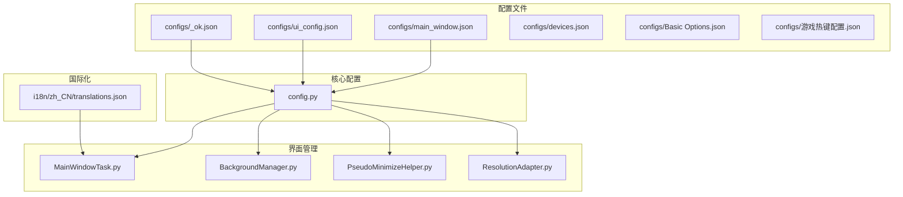
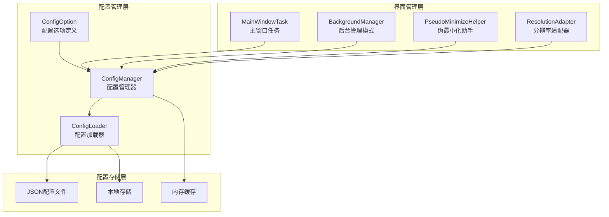
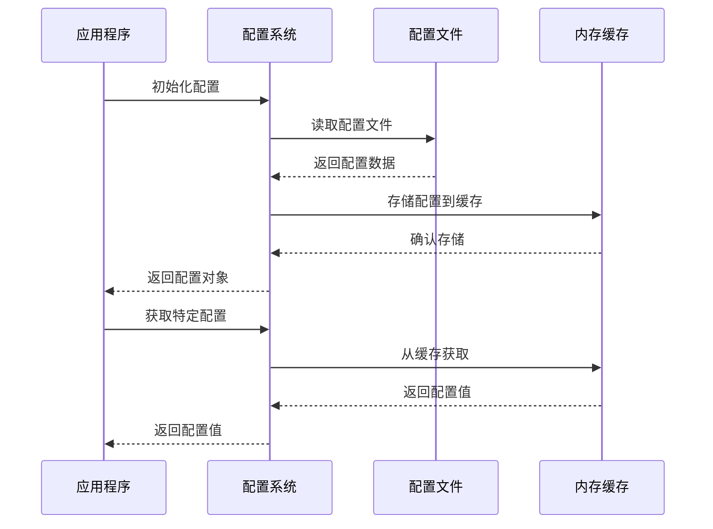
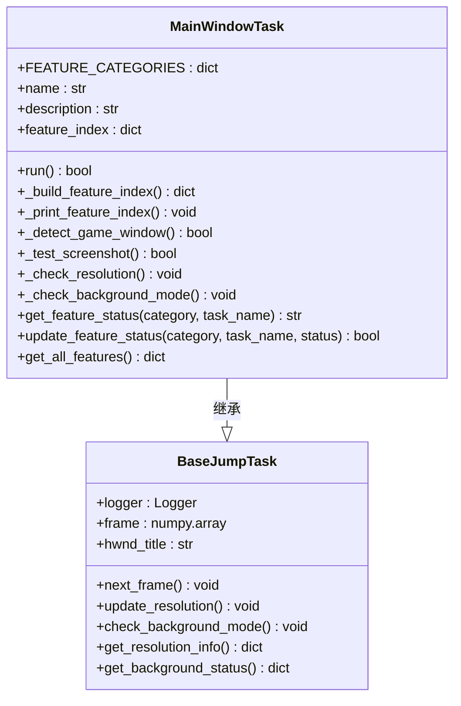
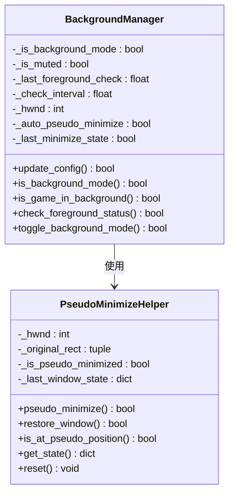
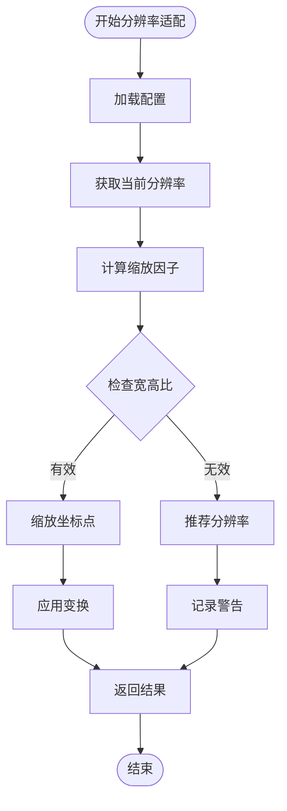
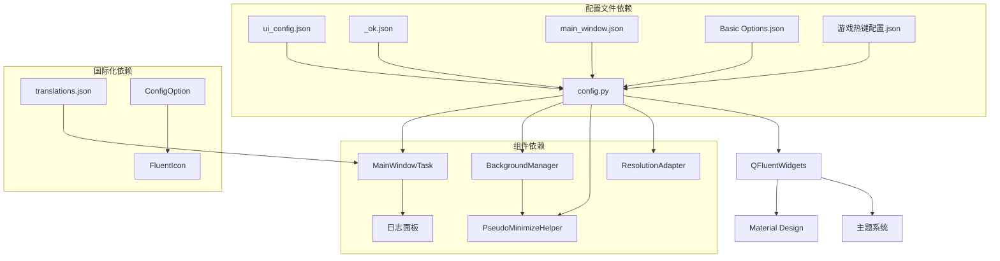

# 界面配置管理

<cite>
**本文档引用的文件**
- [main_window.json](file://configs/main_window.json)
- [ui_config.json](file://configs/ui_config.json)
- [_ok.json](file://configs/_ok.json)
- [config.py](file://config.py)
- [MainWindowTask.py](file://src/task/MainWindowTask.py)
- [BackgroundManager.py](file://src/utils/BackgroundManager.py)
- [PseudoMinimizeHelper.py](file://src/utils/PseudoMinimizeHelper.py)
- [ResolutionAdapter.py](file://src/utils/ResolutionAdapter.py)
- [translations.json](file://i18n/zh_CN/translations.json)
- [globals.py](file://src/globals.py)
</cite>

## 目录
1. [简介](#简介)
2. [项目结构](#项目结构)
3. [核心组件](#核心组件)
4. [架构概览](#架构概览)
5. [详细组件分析](#详细组件分析)
6. [依赖关系分析](#依赖关系分析)
7. [性能考虑](#性能考虑)
8. [故障排除指南](#故障排除指南)
9. [结论](#结论)

## 简介

ok-jump 项目的界面配置管理系统负责管理应用程序的视觉外观、用户界面设置以及界面状态。该系统采用分层配置架构，通过多个配置文件协同工作，实现灵活的界面定制和用户偏好管理。

系统主要包含三个层面的配置：
- **全局配置**：应用程序的基础设置和行为参数
- **界面配置**：UI外观和视觉效果设置
- **窗口状态**：窗口位置、尺寸和可见性状态

## 项目结构

界面配置管理涉及以下关键文件和目录：

**图表来源**
- [config.py:68-145](file://config.py#L68-L145)
- [ui_config.json:1-17](file://configs/ui_config.json#L1-L17)
- [main_window.json:1-3](file://configs/main_window.json#L1-L3)

**章节来源**
- [config.py:1-146](file://config.py#L1-L146)
- [configs/main_window.json:1-3](file://configs/main_window.json#L1-L3)
- [configs/ui_config.json:1-17](file://configs/ui_config.json#L1-L17)
- [configs/_ok.json:1-7](file://configs/_ok.json#L1-L7)

## 核心组件

### 配置文件层次结构

系统采用分层配置架构，每个配置文件承担不同的职责：

#### 全局配置文件
- **config.py**：定义应用程序的核心配置选项和默认值
- **devices.json**：设备选择和连接配置
- **Basic Options.json**：基本设置选项
- **游戏热键配置.json**：键盘快捷键映射

#### 界面配置文件
- **main_window.json**：主窗口版本信息
- **ui_config.json**：UI外观和主题设置
- **_ok.json**：窗口状态持久化

#### 国际化配置
- **translations.json**：翻译字典和本地化支持

**章节来源**
- [config.py:68-145](file://config.py#L68-L145)
- [ui_config.json:8-16](file://configs/ui_config.json#L8-L16)
- [main_window.json:1-3](file://configs/main_window.json#L1-L3)

### 配置参数详解

#### UI外观配置
UI配置系统提供了丰富的外观定制选项：

| 配置类别 | 参数名称 | 默认值 | 描述 |
|---------|----------|--------|------|
| Material | AcrylicBlurRadius | 15 | 毛玻璃模糊半径 |
| Update | CheckUpdateAtStartUp | true | 启动时检查更新 |
| MainWindow | DpiScale | Auto | DPI缩放设置 |
| MainWindow | Language | zh_CN | 界面语言 |
| MainWindow | MicaEnabled | false | 微软马赛克效果 |
| QFluentWidgets | ThemeColor | #ff009faa | 主题色彩 |
| QFluentWidgets | ThemeMode | Dark | 主题模式 |

#### 窗口状态配置
窗口状态管理包括位置、尺寸和可见性控制：

| 状态参数 | 类型 | 描述 |
|---------|------|------|
| window_x | 数值 | 窗口X坐标 |
| window_y | 数值 | 窗口Y坐标 |
| window_width | 数值 | 窗口宽度 |
| window_height | 数值 | 窗口高度 |
| window_maximized | 布尔值 | 最大化状态 |

**章节来源**
- [ui_config.json:1-17](file://configs/ui_config.json#L1-L17)
- [_ok.json:1-7](file://configs/_ok.json#L1-L7)

## 架构概览

界面配置管理采用模块化架构，通过配置文件、管理类和工具类协同工作：

**图表来源**
- [config.py:23-66](file://config.py#L23-L66)
- [MainWindowTask.py:49-53](file://src/task/MainWindowTask.py#L49-L53)
- [BackgroundManager.py:7-23](file://src/utils/BackgroundManager.py#L7-L23)

### 配置加载流程

**图表来源**
- [config.py:68-145](file://config.py#L68-L145)
- [ui_config.json:1-17](file://configs/ui_config.json#L1-L17)

## 详细组件分析

### MainWindowTask 组件

MainWindowTask 作为主窗口任务管理器，负责界面状态的检测和验证：

**图表来源**
- [MainWindowTask.py:5-215](file://src/task/MainWindowTask.py#L5-L215)

#### 功能分类系统

系统实现了四类功能分类，每类都有对应的中文和英文名称：

| 分类键 | 中文名称 | 英文名称 | 包含功能 |
|-------|---------|---------|---------|
| core | 核心功能 | Core Features | WindowCapture, ResolutionAdapter, BackgroundMode |
| game | 游戏功能 | Game Features | AutoLogin, AutoMatch, AutoCombat, AutoSkill |
| moba | MOBA功能 | MOBA Features | LaneControl, JunglePath, TeamFight, TowerPush |
| utility | 实用工具 | Utility Tools | DailyTask, ResourceCollector, EventHelper |

**章节来源**
- [MainWindowTask.py:7-47](file://src/task/MainWindowTask.py#L7-L47)

### BackgroundManager 组件

后台管理模式管理器负责处理窗口的后台运行状态：

**图表来源**
- [BackgroundManager.py:7-49](file://src/utils/BackgroundManager.py#L7-L49)
- [PseudoMinimizeHelper.py:219-237](file://src/utils/PseudoMinimizeHelper.py#L219-L237)

#### 后台模式配置

后台模式提供了灵活的窗口管理选项：

| 配置项 | 类型 | 默认值 | 描述 |
|-------|------|--------|------|
| 后台模式 | 布尔值 | True | 允许窗口在后台运行 |
| 最小化时伪最小化 | 布尔值 | True | 窗口最小化时移动到屏幕外 |
| 后台时静音游戏 | 布尔值 | False | 后台运行时自动静音 |
| 关闭时最小化到系统托盘 | 布尔值 | False | 关闭窗口时最小化到托盘 |

**章节来源**
- [BackgroundManager.py:18-23](file://src/utils/BackgroundManager.py#L18-L23)
- [config.py:40-66](file://config.py#L40-L66)

### ResolutionAdapter 组件

分辨率适配器负责处理不同分辨率下的坐标转换：

**图表来源**
- [ResolutionAdapter.py:19-124](file://src/utils/ResolutionAdapter.py#L19-L124)

#### 分辨率配置参数

| 参数 | 默认值 | 描述 |
|-----|--------|------|
| REFERENCE_WIDTH | 1920 | 参考宽度 |
| REFERENCE_HEIGHT | 1080 | 参考高度 |
| SUPPORTED_RATIO | 16:9 | 支持的宽高比 |
| min_size | (1280, 720) | 最小支持分辨率 |
| resize_to | [(2560, 1440), (1920, 1080), (1600, 900), (1280, 720)] | 推荐分辨率列表 |

**章节来源**
- [ResolutionAdapter.py:4-43](file://src/utils/ResolutionAdapter.py#L4-L43)
- [config.py:108-112](file://config.py#L108-L112)

## 依赖关系分析

界面配置管理系统涉及多个组件间的复杂依赖关系：

**图表来源**
- [config.py:68-145](file://config.py#L68-L145)
- [MainWindowTask.py:1-215](file://src/task/MainWindowTask.py#L1-L215)

### 配置加载顺序

系统按照特定的顺序加载配置，确保依赖关系得到正确处理：

1. **基础配置加载**：config.py 中定义的核心配置
2. **界面配置加载**：ui_config.json 和 main_window.json
3. **窗口状态加载**：_ok.json 中的窗口位置和尺寸
4. **功能配置加载**：Basic Options.json 和游戏热键配置.json
5. **国际化配置加载**：translations.json 中的翻译字典

**章节来源**
- [config.py:68-145](file://config.py#L68-L145)
- [translations.json:1-75](file://i18n/zh_CN/translations.json#L1-L75)

## 性能考虑

界面配置管理系统在性能方面采用了多项优化措施：

### 内存管理
- **延迟加载**：配置文件采用按需加载策略，避免不必要的内存占用
- **缓存机制**：频繁访问的配置项存储在内存缓存中，减少磁盘I/O操作
- **对象复用**：全局配置对象在应用程序生命周期内复用

### 界面渲染优化
- **DPI感知**：支持自动DPI缩放，确保界面在不同分辨率下的一致性
- **主题切换**：快速的主题切换机制，避免重新渲染整个界面
- **透明度优化**：合理的透明度设置，平衡视觉效果和性能

### 配置更新策略
- **增量更新**：只更新发生变化的配置项，减少不必要的重绘
- **批量操作**：支持配置项的批量更新，提高效率
- **异步处理**：配置更新采用异步方式，避免阻塞主线程

## 故障排除指南

### 常见配置问题

#### 界面显示异常
**症状**：界面元素显示错位或比例不正确
**解决方案**：
1. 检查 ui_config.json 中的 DPI 设置
2. 验证 main_window.json 中的版本兼容性
3. 确认 _ok.json 中的窗口尺寸配置

#### 窗口位置错误
**症状**：应用程序启动时出现在屏幕外
**解决方案**：
1. 删除 _ok.json 文件重置窗口状态
2. 检查显示器配置和分辨率设置
3. 验证多显示器环境下的窗口管理

#### 主题显示问题
**症状**：主题颜色或样式不符合预期
**解决方案**：
1. 检查 ui_config.json 中的主题配置
2. 验证 QFluentWidgets 的主题设置
3. 确认操作系统主题兼容性

### 配置重置方法

系统提供了多种配置重置方式：

1. **完全重置**：删除所有配置文件，重启应用程序
2. **部分重置**：只删除特定配置文件，保留其他设置
3. **恢复默认**：通过应用程序界面恢复默认配置

**章节来源**
- [config.py:126-134](file://config.py#L126-L134)
- [ui_config.json:1-17](file://configs/ui_config.json#L1-L17)

## 结论

ok-jump 项目的界面配置管理系统展现了现代应用程序配置管理的最佳实践。通过分层架构、模块化设计和完善的错误处理机制，系统实现了灵活的界面定制和稳定的用户体验。

### 主要优势

1. **模块化设计**：清晰的配置文件层次结构，便于维护和扩展
2. **国际化支持**：完整的多语言支持和本地化机制
3. **性能优化**：高效的配置加载和缓存策略
4. **错误处理**：完善的异常处理和故障恢复机制

### 改进建议

1. **配置验证**：增加配置文件格式验证机制
2. **配置备份**：实现自动配置备份和版本管理
3. **动态配置**：支持运行时配置的动态更新
4. **配置导出**：提供配置文件的导入导出功能

该系统为开发者提供了强大的界面定制能力，同时保证了良好的用户体验和系统稳定性。