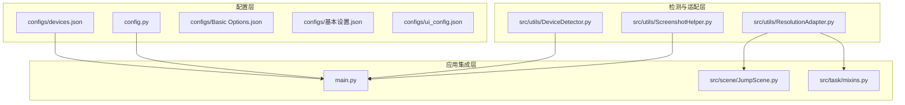
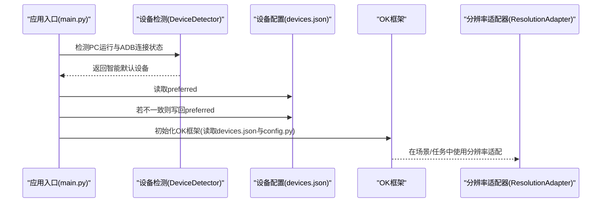
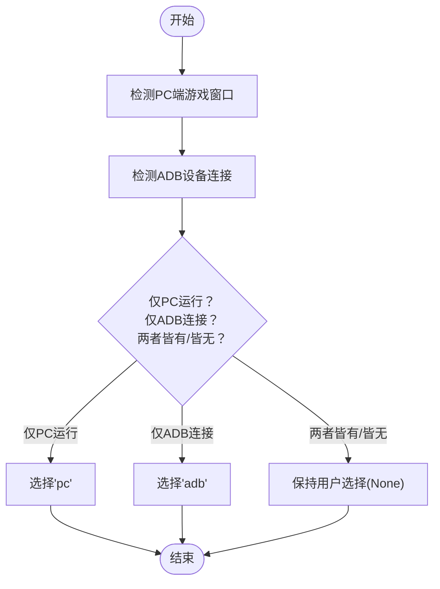
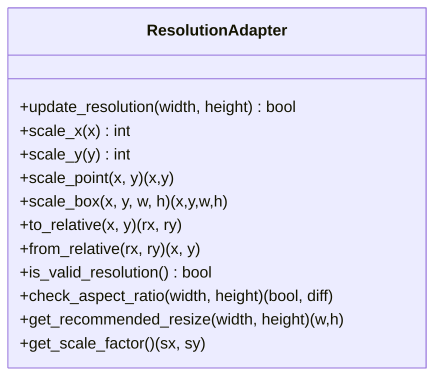
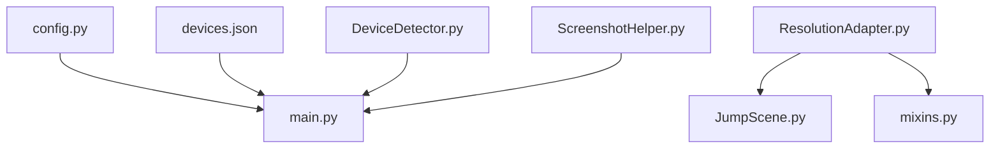

# 设备配置管理

<cite>
**本文档引用的文件**
- [devices.json](file://configs/devices.json)
- [DeviceDetector.py](file://src/utils/DeviceDetector.py)
- [ResolutionAdapter.py](file://src/utils/ResolutionAdapter.py)
- [config.py](file://config.py)
- [main.py](file://main.py)
- [JumpScene.py](file://src/scene/JumpScene.py)
- [mixins.py](file://src/task/mixins.py)
- [ScreenshotHelper.py](file://src/utils/ScreenshotHelper.py)
- [Basic Options.json](file://configs/Basic Options.json)
- [基本设置.json](file://configs/基本设置.json)
- [ui_config.json](file://configs/ui_config.json)
</cite>

## 目录
1. [简介](#简介)
2. [项目结构](#项目结构)
3. [核心组件](#核心组件)
4. [架构总览](#架构总览)
5. [详细组件分析](#详细组件分析)
6. [依赖关系分析](#依赖关系分析)
7. [性能考虑](#性能考虑)
8. [故障排除指南](#故障排除指南)
9. [结论](#结论)
10. [附录](#附录)

## 简介
本文件面向 ok-jump 项目的设备配置管理，系统性阐述 devices.json 配置文件的结构与设备信息管理，详解设备类型识别（PC 端游戏与 Android 模拟器）、设备连接参数设置（ADB 连接配置、设备分辨率适配）、设备选择策略与智能设备检测机制、设备配置的热更新与动态切换，以及多设备环境下的配置管理最佳实践与故障排除。

## 项目结构
设备配置管理涉及以下关键文件与模块：
- 配置文件层：devices.json、config.py、Basic Options.json、基本设置.json、ui_config.json
- 检测与适配层：DeviceDetector.py、ResolutionAdapter.py、ScreenshotHelper.py
- 应用入口与集成：main.py、JumpScene.py、mixins.py

**图表来源**
- [devices.json](file://configs/devices.json)
- [config.py](file://config.py)
- [DeviceDetector.py](file://src/utils/DeviceDetector.py)
- [ResolutionAdapter.py](file://src/utils/ResolutionAdapter.py)
- [main.py](file://main.py)
- [JumpScene.py](file://src/scene/JumpScene.py)
- [mixins.py](file://src/task/mixins.py)
- [ScreenshotHelper.py](file://src/utils/ScreenshotHelper.py)

**章节来源**
- [devices.json](file://configs/devices.json)
- [config.py](file://config.py)
- [DeviceDetector.py](file://src/utils/DeviceDetector.py)
- [ResolutionAdapter.py](file://src/utils/ResolutionAdapter.py)
- [main.py](file://main.py)
- [JumpScene.py](file://src/scene/JumpScene.py)
- [mixins.py](file://src/task/mixins.py)
- [ScreenshotHelper.py](file://src/utils/ScreenshotHelper.py)

## 核心组件
- devices.json：设备首选项与捕获方式的持久化配置，包含 preferred、pc_full_path、capture、selected_exe、selected_hwnd 等字段。
- DeviceDetector：负责检测 PC 端游戏窗口与 ADB 设备连接状态，提供智能默认设备选择。
- ResolutionAdapter：基于参考分辨率与支持比例进行坐标缩放与分辨率有效性校验。
- config.py：全局配置中心，包含窗口、ADB、分辨率支持等配置项。
- main.py：应用入口，执行智能设备选择、ADB 预连接、OK 框架初始化等。
- JumpScene 与 mixins：在场景检测与任务执行中使用分辨率适配器，保障跨分辨率一致性。
- ScreenshotHelper：提供截图与特征模板保存能力，辅助配置验证与问题定位。

**章节来源**
- [devices.json](file://configs/devices.json)
- [DeviceDetector.py](file://src/utils/DeviceDetector.py)
- [ResolutionAdapter.py](file://src/utils/ResolutionAdapter.py)
- [config.py](file://config.py)
- [main.py](file://main.py)
- [JumpScene.py](file://src/scene/JumpScene.py)
- [mixins.py](file://src/task/mixins.py)
- [ScreenshotHelper.py](file://src/utils/ScreenshotHelper.py)

## 架构总览
设备配置管理的总体流程如下：
- 启动阶段：main.py 中先执行智能设备选择，根据 DeviceDetector 的检测结果更新 devices.json 的 preferred 字段；随后进行 ADB 预连接，最后初始化 OK 框架读取 devices.json 与 config.py。
- 运行阶段：ResolutionAdapter 在场景检测与任务执行中动态更新当前分辨率，保证坐标与区域的正确性；DeviceDetector 的状态可用于调试与日志输出。

**图表来源**
- [main.py](file://main.py)
- [DeviceDetector.py](file://src/utils/DeviceDetector.py)
- [devices.json](file://configs/devices.json)
- [config.py](file://config.py)
- [ResolutionAdapter.py](file://src/utils/ResolutionAdapter.py)

## 详细组件分析

### devices.json 配置文件结构与管理
- 字段说明
  - preferred：首选设备类型，'pc' 或 'adb'。智能设备选择会根据当前环境自动更新该值。
  - pc_full_path：PC 端游戏可执行文件路径，用于窗口识别与交互。
  - capture：捕获方式，如 'adb' 表示使用 ADB 截图/交互。
  - selected_exe、selected_hwnd：当前选定的可执行文件与窗口句柄，便于快速定位目标窗口。
- 写入时机
  - main.py 在智能设备选择阶段，若检测到更优设备类型，则更新 devices.json 的 preferred 并持久化。
- 读取时机
  - OK 框架初始化时会读取 devices.json，作为设备选择与交互方式的基础依据。

**章节来源**
- [devices.json](file://configs/devices.json)
- [main.py](file://main.py)

### 设备类型识别与智能选择策略
- PC 端识别
  - 通过枚举窗口标题，匹配游戏关键词并排除模拟器与工具窗口，判断 PC 端游戏是否正在运行。
- ADB 连接检测
  - 优先使用 adbutils 包列出设备；若不可用则回退到系统 adb devices 命令解析。
- 智能默认策略
  - 仅 PC 运行：选择 'pc'
  - 仅 ADB 连接：选择 'adb'
  - 两者都运行或都未运行：保持用户选择（返回 None）

**图表来源**
- [DeviceDetector.py](file://src/utils/DeviceDetector.py)

**章节来源**
- [DeviceDetector.py](file://src/utils/DeviceDetector.py)
- [main.py](file://main.py)

### ADB 连接参数设置与预连接
- ADB 启用与包名
  - config.py 中的 'adb' 配置包含 enabled 与 packages 字段，决定是否启用 ADB 以及目标包名。
- 预连接流程
  - main.py 读取 CITestTask.json 中的 ADB端口，尝试连接 127.0.0.1:端口 与 emulator-端口 两种地址，记录连接结果并输出日志。
- 与设备选择的关系
  - 预连接成功可使 OK 框架初始化时正确识别 ADB 设备，从而影响 preferred 的最终选择。

**章节来源**
- [config.py](file://config.py)
- [main.py](file://main.py)

### 设备分辨率适配与坐标缩放
- 参考分辨率与比例
  - ResolutionAdapter 以 1920x1080 为参考分辨率，默认 16:9 比例；支持从 config.py 的 supported_resolution 读取比例与推荐尺寸列表。
- 动态更新
  - JumpScene 与 mixins 在每次检测/操作前更新分辨率，计算缩放因子与比例偏差，并提供 scale_point/scale_box 等缩放方法。
- 有效性校验
  - 提供 is_valid_resolution 与 check_aspect_ratio，结合 get_recommended_resize 建议调整分辨率以提升识别稳定性。

**图表来源**
- [ResolutionAdapter.py](file://src/utils/ResolutionAdapter.py)
- [config.py](file://config.py)

**章节来源**
- [ResolutionAdapter.py](file://src/utils/ResolutionAdapter.py)
- [config.py](file://config.py)
- [JumpScene.py](file://src/scene/JumpScene.py)
- [mixins.py](file://src/task/mixins.py)

### 设备选择策略与智能设备检测机制
- 策略决策
  - main.py 在 OK 初始化前执行智能设备选择，读取 devices.json 的 preferred，结合 DeviceDetector 的状态进行比较与更新。
- 日志与调试
  - 输出 PC 运行与 ADB 连接状态，便于排查设备选择问题。
- 与 OK 框架的集成
  - devices.json 与 config.py 的读取顺序严格要求：智能选择必须在 OK(config) 之前执行，以确保配置变更生效。

**章节来源**
- [main.py](file://main.py)
- [DeviceDetector.py](file://src/utils/DeviceDetector.py)
- [config.py](file://config.py)

### 设备配置的热更新与动态切换
- devices.json 的动态更新
  - 智能设备选择会在 preferred 与当前环境不一致时写回 devices.json，实现设备类型的动态切换。
- 定时任务配置的热更新（参考）
  - main.py 中的定时任务调度器展示了配置热更新的通用模式：使用 QFileSystemWatcher 监听配置文件变化，触发回调重新加载配置并重置执行键，支持配置修改后立即生效。

**章节来源**
- [main.py](file://main.py)

### 多设备环境下的配置管理最佳实践
- 统一配置来源
  - 优先通过 devices.json 与 config.py 管理设备与分辨率相关配置，避免分散在多处。
- 明确设备类型
  - 在 PC 与 ADB 之间明确区分，避免两者同时运行导致的冲突；必要时通过智能选择自动切换。
- 分辨率一致性
  - 使用 ResolutionAdapter 统一缩放坐标与区域，确保在不同分辨率下行为一致。
- 截图与特征保存
  - 使用 ScreenshotHelper 保存截图与特征模板，便于验证识别效果与问题定位。

**章节来源**
- [devices.json](file://configs/devices.json)
- [config.py](file://config.py)
- [ResolutionAdapter.py](file://src/utils/ResolutionAdapter.py)
- [ScreenshotHelper.py](file://src/utils/ScreenshotHelper.py)

## 依赖关系分析
- 配置依赖
  - devices.json 与 config.py 是设备选择与交互方式的核心依据。
- 检测依赖
  - DeviceDetector 依赖系统窗口枚举与 adb 命令/库，提供智能默认设备选择。
- 适配依赖
  - ResolutionAdapter 依赖 config.py 中的 supported_resolution，为场景与任务提供坐标缩放能力。
- 应用集成依赖
  - main.py 串联智能设备选择、ADB 预连接与 OK 初始化；JumpScene 与 mixins 在运行期使用分辨率适配器。

**图表来源**
- [config.py](file://config.py)
- [devices.json](file://configs/devices.json)
- [DeviceDetector.py](file://src/utils/DeviceDetector.py)
- [ResolutionAdapter.py](file://src/utils/ResolutionAdapter.py)
- [JumpScene.py](file://src/scene/JumpScene.py)
- [mixins.py](file://src/task/mixins.py)
- [ScreenshotHelper.py](file://src/utils/ScreenshotHelper.py)

**章节来源**
- [config.py](file://config.py)
- [devices.json](file://configs/devices.json)
- [DeviceDetector.py](file://src/utils/DeviceDetector.py)
- [ResolutionAdapter.py](file://src/utils/ResolutionAdapter.py)
- [JumpScene.py](file://src/scene/JumpScene.py)
- [mixins.py](file://src/task/mixins.py)
- [ScreenshotHelper.py](file://src/utils/ScreenshotHelper.py)

## 性能考虑
- 检测开销控制
  - DeviceDetector 的窗口枚举与 ADB 设备查询应避免频繁调用；可在任务执行周期内复用状态或增加缓存。
- 分辨率更新频率
  - ResolutionAdapter 的 update_resolution 应仅在分辨率变化时触发，减少不必要的缩放计算。
- 截图与识别
  - 合理设置触发间隔与截图频率，避免过度占用 CPU/GPU 资源；必要时启用后台模式与伪最小化以降低交互成本。

## 故障排除指南
- ADB 无法连接
  - 检查 CITestTask.json 中的 ADB端口 是否正确；确认模拟器已启动并监听对应端口；查看 main.py 的 ADB 预连接日志。
- 设备选择不符合预期
  - 查看 main.py 输出的 PC 运行与 ADB 连接状态；确认 devices.json 的 preferred 是否被智能选择覆盖；检查 config.py 中的 'adb' 配置。
- 分辨率识别异常
  - 使用 JumpScene 的 check_resolution_warning 输出建议调整分辨率；核对 config.py 中 supported_resolution 的 ratio 与 resize_to 设置。
- 截图或特征保存失败
  - 检查 ScreenshotHelper 的截图目录权限与磁盘空间；确认截图命名与扩展名规范。

**章节来源**
- [main.py](file://main.py)
- [JumpScene.py](file://src/scene/JumpScene.py)
- [config.py](file://config.py)
- [ScreenshotHelper.py](file://src/utils/ScreenshotHelper.py)

## 结论
ok-jump 的设备配置管理通过 devices.json 与 config.py 提供稳定的配置基础，借助 DeviceDetector 的智能设备选择与 ResolutionAdapter 的分辨率适配，实现了在 PC 与 ADB 环境下的无缝切换与跨分辨率一致性。配合 main.py 的初始化流程与日志输出，能够有效支撑多设备环境下的自动化任务执行。

## 附录
- 相关配置文件
  - devices.json：设备首选项与捕获方式
  - config.py：全局配置（窗口、ADB、分辨率支持等）
  - Basic Options.json、基本设置.json：界面与基本行为设置
  - ui_config.json：UI 主题与外观配置

**章节来源**
- [devices.json](file://configs/devices.json)
- [config.py](file://config.py)
- [Basic Options.json](file://configs/Basic Options.json)
- [基本设置.json](file://configs/基本设置.json)
- [ui_config.json](file://configs/ui_config.json)