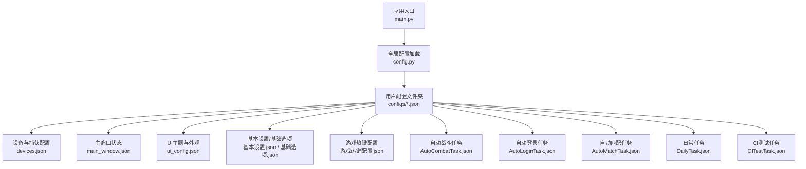
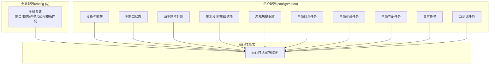
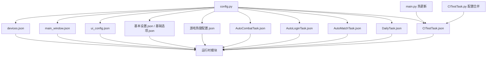

# 配置文件结构

<cite>
**本文引用的文件**
- [config.py](file://config.py)
- [_ok.json](file://configs/_ok.json)
- [devices.json](file://configs/devices.json)
- [main_window.json](file://configs/main_window.json)
- [ui_config.json](file://configs/ui_config.json)
- [基本设置.json](file://configs/基本设置.json)
- [基础选项.json](file://configs/基础选项.json)
- [游戏热键配置.json](file://configs/游戏热键配置.json)
- [AutoCombatTask.json](file://configs/AutoCombatTask.json)
- [AutoLoginTask.json](file://configs/AutoLoginTask.json)
- [AutoMatchTask.json](file://configs/AutoMatchTask.json)
- [DailyTask.json](file://configs/DailyTask.json)
- [CITestTask.json](file://configs/CITestTask.json)
- [main.py](file://main.py)
- [src/task/CITestTask.py](file://src/task/CITestTask.py)
- [src/utils/ResolutionAdapter.py](file://src/utils/ResolutionAdapter.py)
- [src/globals.py](file://src/globals.py)
</cite>

## 目录
1. [简介](#简介)
2. [项目结构](#项目结构)
3. [核心组件](#核心组件)
4. [架构总览](#架构总览)
5. [详细组件分析](#详细组件分析)
6. [依赖分析](#依赖分析)
7. [性能考虑](#性能考虑)
8. [故障排查指南](#故障排查指南)
9. [结论](#结论)
10. [附录](#附录)

## 简介
本文件系统性梳理 ok-jump 项目的配置文件结构与规范，涵盖 JSON 配置文件的标准格式、字段定义、数据类型、参数范围、默认值、命名约定、组织结构、层级关系与嵌套结构，并给出面向开发者的编写指南与最佳实践，帮助快速上手并避免常见错误。

## 项目结构
ok-jump 的配置体系由两类构成：
- 应用级全局配置：集中于 [config.py](file://config.py)，定义全局行为、资源路径、窗口尺寸、任务清单、OCR/模板匹配参数等。
- 用户/任务级配置：位于 [configs/](file://configs/) 目录下的多个 JSON 文件，按功能域划分，如设备与捕获、UI 主题、基本设置、各类任务配置等。

图表来源
- [config.py:68-145](file://config.py#L68-L145)
- [main.py:530-562](file://main.py#L530-L562)

章节来源
- [config.py:68-145](file://config.py#L68-L145)
- [main.py:530-562](file://main.py#L530-L562)

## 核心组件
- 全局配置中心：集中定义窗口标题、图标、版本、日志路径、截图目录、一次性任务与触发任务清单、Windows 游戏窗口交互策略、ADB 包名、分辨率支持策略、窗口尺寸约束、OCR 与模板匹配参数等。
- 配置文件集合：按功能域拆分，便于维护与热更新；部分配置项支持通过热更新机制动态生效。

章节来源
- [config.py:68-145](file://config.py#L68-L145)

## 架构总览
配置系统采用“全局配置 + 多文件配置”的分层架构：
- 全局配置决定框架行为与资源定位；
- 各功能域 JSON 配置负责具体业务参数；
- 部分配置支持热更新，减少重启成本。

图表来源
- [config.py:68-145](file://config.py#L68-L145)
- [main.py:530-562](file://main.py#L530-L562)

## 详细组件分析

### 全局配置（config.py）
- 作用：定义项目运行所需的全局参数，如 GUI 标题、图标、版本、日志与截图路径、任务清单、窗口交互策略、OCR/模板匹配参数、ADB 配置、分辨率支持策略、窗口尺寸约束等。
- 关键点：
  - 全局对象 my_app 指向 src/globals.py 中的 Globals 单例，用于统一管理登录状态、OCR 缓存、YOLO 模型等。
  - windows 字段定义了 Unity 游戏的窗口标题、可选交互方式与捕获方法列表。
  - supported_resolution 定义支持的宽高比与目标分辨率列表，配合 ResolutionAdapter 使用。
  - window_size 定义窗口初始尺寸与最小尺寸。
  - ocr 与 template_matching 提供 OCR 引擎与模板匹配特征文件路径及阈值。
  - global_configs 注册了“基本设置”和“游戏热键配置”两个配置项组，供 GUI 展示与编辑。

章节来源
- [config.py:68-145](file://config.py#L68-L145)

### 设备与捕获配置（devices.json）
- 用途：定义首选设备、PC 可执行文件路径、捕获方式（如 ADB）、当前选择的可执行文件与窗口句柄等。
- 数据类型与默认值：
  - preferred: 字符串，示例值为某模拟器标识。
  - pc_full_path: 字符串，示例为某 PC 客户端完整路径。
  - capture: 字符串，示例为 adb。
  - selected_exe: 字符串，示例为空字符串。
  - selected_hwnd: 数字，示例为 0。
- 参数范围与约束：
  - capture 建议使用 adb；若非 adb，需确保对应捕获方式可用。
  - selected_hwnd 为 0 表示未绑定窗口句柄。

章节来源
- [devices.json:1-7](file://configs/devices.json#L1-L7)

### 主窗口状态（main_window.json）
- 用途：记录上次使用的版本号，便于版本提示与兼容性判断。
- 数据类型与默认值：
  - last_version: 字符串，示例为 1.4.x 版本号。

章节来源
- [main_window.json:1-3](file://configs/main_window.json#L1-L3)

### UI 主题与外观（ui_config.json）
- 用途：控制 UI 外观与行为，如材质模糊半径、启动时检查更新、主窗口 DPI 缩放、语言、Mica 启用、主题色与主题模式等。
- 数据类型与默认值：
  - Material.AcrylicBlurRadius: 数字，示例为 15。
  - Update.CheckUpdateAtStartUp: 布尔值，示例为 true。
  - MainWindow.DpiScale: 字符串，示例为 "Auto"。
  - MainWindow.Language: 字符串，示例为 "zh_CN"。
  - MainWindow.MicaEnabled: 布尔值，示例为 false。
  - QFluentWidgets.ThemeColor: 字符串（十六进制颜色码），示例为 "#ff009faa"。
  - QFluentWidgets.ThemeMode: 字符串，示例为 "Dark"。

章节来源
- [ui_config.json:1-17](file://configs/ui_config.json#L1-L17)

### 基本设置与基础选项（基本设置.json / 基础选项.json）
- 用途：控制程序行为与用户体验，如最小化到托盘、后台模式、伪最小化、静音、自动调整窗口大小、退出时关闭程序、游戏文本语言、触发间隔、启动/停止快捷键等。
- 数据类型与默认值：
  - 关闭时最小化到系统托盘: 布尔值，示例为 false。
  - 后台模式: 布尔值，示例为 true。
  - 最小化时伪最小化: 布尔值，示例为 true。
  - 后台时静音游戏: 布尔值，示例为 false。
  - 自动调整游戏窗口大小: 布尔值，示例为 false。
  - 游戏退出时关闭程序: 布尔值，示例为 false。
  - 游戏文本语言: 字符串，示例为 "繁体中文" 或 "简体中文"。
  - 触发间隔: 数字，示例为 1。
  - 启动/停止快捷键: 字符串，示例为 "F9"。
- 参数范围与约束：
  - 触发间隔建议为正整数或合理小数，过大将导致响应迟滞，过小会增加 CPU/GPU 占用。
  - 快捷键建议使用 F9-F12，避免与系统快捷键冲突。

章节来源
- [基本设置.json:1-11](file://configs/基本设置.json#L1-L11)
- [基础选项.json:1-11](file://configs/基础选项.json#L1-L11)

### 游戏热键配置（游戏热键配置.json）
- 用途：定义自动战斗中的按键映射，如普通攻击、技能1、技能2、大招。
- 数据类型与默认值：
  - 普通攻击: 字符串，示例为 "J"。
  - 技能1: 字符串，示例为 "K"。
  - 技能2: 字符串，示例为 "U"。
  - 大招: 字符串，示例为 "L"。
- 参数范围与约束：
  - 建议使用单字符键位，避免组合键；确保与游戏内按键布局一致。

章节来源
- [游戏热键配置.json:1-6](file://configs/游戏热键配置.json#L1-L6)

### 自动战斗任务（AutoCombatTask.json）
- 用途：控制自动战斗的行为，如是否启用、测试模式、日志级别、自动普攻/技能/大招、各技能间隔、移动持续时间等。
- 数据类型与默认值：
  - _enabled: 布尔值，示例为 true。
  - 测试模式: 布尔值，示例为 false。
  - 详细日志: 布尔值，示例为 true。
  - 自动普攻: 布尔值，示例为 true。
  - 自动技能1: 布尔值，示例为 true。
  - 自动技能2: 布尔值，示例为 true。
  - 自动大招: 布尔值，示例为 true。
  - 普攻间隔(秒): 数字，示例为 0.1。
  - 技能1间隔(秒): 数字，示例为 2.0。
  - 技能2间隔(秒): 数字，示例为 3.0。
  - 大招间隔(秒): 数字，示例为 5.0。
  - 移动持续时间(秒): 数字，示例为 1.5。
- 参数范围与约束：
  - 间隔建议大于等于 0.1 秒，避免过于频繁触发。
  - 移动持续时间建议与场景节奏匹配，避免卡顿。

章节来源
- [AutoCombatTask.json:1-14](file://configs/AutoCombatTask.json#L1-L14)

### 自动登录任务（AutoLoginTask.json）
- 用途：控制自动登录流程，如是否自动启动游戏、等待时间、最大尝试次数、账号输入与校验超时、加载检测与状态容错等。
- 数据类型与默认值：
  - 自动启动游戏: 布尔值，示例为 false。
  - 等待游戏启动(秒): 数字，示例为 120。
  - 最大登录尝试次数: 数字，示例为 5。
  - 输入账号: 布尔值，示例为 true。
  - 账号: 字符串，示例为 "qwer991"。
  - 账号输入重试次数: 数字，示例为 2。
  - 输入校验超时(秒): 数字，示例为 1.0。
  - 登录等待超时(秒): 数字，示例为 60。
  - 点击后等待时间(秒): 数字，示例为 3。
  - 加载停滞超时(秒): 数字，示例为 60。
  - 启用加载检测: 布尔值，示例为 true。
  - 启用状态容错: 布尔值，示例为 true。
- 参数范围与约束：
  - 超时参数需根据网络与设备性能适当调整，避免过短导致失败，过长影响效率。

章节来源
- [AutoLoginTask.json:1-14](file://configs/AutoLoginTask.json#L1-L14)

### 自动匹配任务（AutoMatchTask.json）
- 用途：控制自动匹配流程，如游戏模式、是否自动接受匹配、最大等待时间等。
- 数据类型与默认值：
  - 游戏模式: 字符串，示例为 "排位赛"。
  - 自动接受匹配: 布尔值，示例为 true。
  - 最大等待时间(秒): 数字，示例为 300。
- 参数范围与约束：
  - 最大等待时间建议与网络稳定性匹配，避免长时间空等。

章节来源
- [AutoMatchTask.json:1-5](file://configs/AutoMatchTask.json#L1-L5)

### 日常任务（DailyTask.json）
- 用途：控制日常任务的执行，如完成日常任务、收集奖励、使用体力、体力阈值等。
- 数据类型与默认值：
  - 完成日常任务: 布尔值，示例为 true。
  - 收集奖励: 布尔值，示例为 true。
  - 使用体力: 布尔值，示例为 true。
  - 体力阈值: 数字，示例为 50。
- 参数范围与约束：
  - 体力阈值建议根据实际体力上限与消耗速度设定。

章节来源
- [DailyTask.json:1-6](file://configs/DailyTask.json#L1-L6)

### CI 测试任务（CITestTask.json）
- 用途：控制 CI 测试流程，如 Jenkins 地址与 Job 名称、模拟器路径、APK 下载目录、包名、ADB 端口、实例索引、企业微信 Webhook、任务触发延迟、连续失败阈值、定时执行开关与时间、模拟器/游戏启动超时、任务触发超时、最大查找构建数、下载超时、保留旧包数量、账号递增启用与模式、账号模板与序号、失败自动重试与重试次数与间隔等。
- 数据类型与默认值：
  - Jenkins服务器地址: 字符串。
  - Jenkins Job名称: 字符串。
  - 模拟器路径: 字符串。
  - APK下载目录: 字符串。
  - 游戏包名: 字符串。
  - ADB端口: 数字。
  - 模拟器实例索引: 数字。
  - 企业微信Webhook: 字符串。
  - 任务触发延迟(秒): 数字。
  - 连续失败阈值: 数字。
  - 启用定时执行: 布尔值。
  - 定时执行时间(时): 数字。
  - 定时执行时间(分): 数字。
  - 定时执行日期: 字符串。
  - 模拟器启动超时(秒): 数字。
  - 游戏启动超时(秒): 数字。
  - 任务触发超时(秒): 数字。
  - 最大查找构建数: 数字。
  - 下载超时(秒): 数字。
  - 保留旧包数量: 数字。
  - 账号递增启用: 布尔值。
  - 账号递增模式: 字符串。
  - 账号模板: 字符串。
  - 账号当前序号: 数字。
  - 失败自动重试: 布尔值。
  - 重试次数: 数字。
  - 重试间隔(秒): 数字。
- 参数范围与约束：
  - ADB端口与实例索引需与实际环境一致。
  - 超时参数需结合网络与磁盘性能调优。
  - 重试次数与间隔需平衡稳定性与资源占用。

章节来源
- [CITestTask.json:1-29](file://configs/CITestTask.json#L1-L29)

### 热更新与运行时集成（main.py 与 src/task/CITestTask.py）
- 热更新机制：当定时执行相关配置发生变化时，通过回调函数重新加载并应用新配置，无需重启应用。
- 配置合并：CI 测试任务支持从 ci_config.json 加载补充配置，仅填充缺失项，不覆盖 GUI 配置。

章节来源
- [main.py:530-562](file://main.py#L530-L562)
- [src/task/CITestTask.py:322-350](file://src/task/CITestTask.py#L322-L350)

### 分辨率适配（src/utils/ResolutionAdapter.py）
- 用途：根据全局配置中的 reference_resolution 与 supported_resolution，计算缩放比例与有效性，保障不同分辨率下操作精度。
- 关键点：
  - 支持从全局配置读取参考分辨率与宽高比。
  - 维护当前分辨率与缩放因子，判断是否为支持分辨率。

章节来源
- [src/utils/ResolutionAdapter.py:1-43](file://src/utils/ResolutionAdapter.py#L1-L43)

### 全局状态与资源（src/globals.py）
- 用途：提供全局资源统一访问接口，包括登录状态、OCR 缓存、YOLO 模型等，供各任务与模块共享。
- 关键点：
  - 登录状态与教程完成状态用于协调任务执行顺序。
  - OCR 缓存提供 TTL 控制，避免重复识别。
  - YOLO 模型延迟加载，节省内存与启动时间。

章节来源
- [src/globals.py:16-406](file://src/globals.py#L16-L406)

## 依赖分析
- 配置文件之间的依赖关系主要体现在“全局配置 -> 功能域配置”的单向依赖，以及“功能域配置 -> 运行时模块”的双向使用关系。
- 热更新依赖 main.py 的回调机制与 CITestTask 的配置合并逻辑。

图表来源
- [config.py:68-145](file://config.py#L68-L145)
- [main.py:530-562](file://main.py#L530-L562)
- [src/task/CITestTask.py:322-350](file://src/task/CITestTask.py#L322-L350)

章节来源
- [config.py:68-145](file://config.py#L68-L145)
- [main.py:530-562](file://main.py#L530-L562)
- [src/task/CITestTask.py:322-350](file://src/task/CITestTask.py#L322-L350)

## 性能考虑
- 触发间隔：增大触发间隔可显著降低 CPU/GPU 占用，但会增加响应延迟；建议在后台模式下适当增大。
- OCR 与模板匹配：开启 OpenVINO/NPU 可提升推理速度，但需确保硬件与驱动支持。
- 分辨率适配：保持支持分辨率与参考分辨率一致，避免频繁缩放带来的额外开销。
- 日志与截图：合理设置日志级别与截图频率，避免磁盘 IO 压力过大。

## 故障排查指南
- JSON 语法错误：检查配置文件是否为合法 JSON，注意逗号、括号与引号。
- 键名拼写错误：严格遵循配置文件中的键名，大小写与空格敏感。
- 类型不匹配：确保布尔值、数字、字符串类型与预期一致。
- 路径与权限：模拟器路径、APK 下载目录、截图目录需存在且具备读写权限。
- 热更新未生效：确认 main.py 回调逻辑与 CITestTask 的配置合并逻辑正常执行。
- 分辨率异常：检查 supported_resolution 与 reference_resolution 配置，确保宽高比与目标分辨率合理。

## 结论
ok-jump 的配置体系通过“全局配置 + 多文件配置 + 热更新”的架构实现了清晰的职责分离与灵活的运行时调整能力。遵循本文档的命名约定、数据类型与参数范围规范，可有效提升配置质量与系统稳定性。

## 附录

### 配置文件命名约定与组织结构
- 命名约定：使用中文语义化命名，文件名末尾可带“任务”“设置”等后缀以明确用途。
- 组织结构：按功能域分组存放，便于维护与扩展；全局配置集中于 config.py，用户配置集中于 configs/ 目录。

### 配置项层级关系与嵌套结构
- 全局配置（config.py）为顶层，包含多组子配置（如 windows、supported_resolution、window_size、ocr、template_matching 等）。
- 用户配置文件为独立 JSON 对象，部分文件内部可包含子对象（如 ui_config.json 中的 Material、Update、MainWindow、QFluentWidgets）。

### 数据类型与默认值对照表（节选）
- 布尔值：用于开关类参数，如后台模式、静音、启用加载检测等。
- 数值：用于计时、阈值、端口等，如等待时间、超时、ADB 端口、实例索引等。
- 字符串：用于路径、语言、快捷键、包名等，如 pc_full_path、语言、快捷键、包名等。

### 编写指南与最佳实践
- 语法规范：使用合法 JSON，避免尾随逗号；字符串必须加双引号；布尔值与数字不加引号。
- 字段命名：保持键名稳定，避免频繁变更；新增字段时提供默认值并在文档中标注。
- 参数范围：为关键参数提供合理的默认值与边界说明；对超时、间隔等参数给出推荐范围。
- 组织结构：按功能域拆分配置文件，避免单文件过大；必要时在文件内使用子对象组织相关参数。
- 热更新：对可能动态变化的配置提供热更新回调；对 CI 测试任务支持补充配置文件，仅填充缺失项。
- 常见错误避免：严格区分布尔值与字符串；确保路径与端口正确；避免在后台模式下设置过小的触发间隔。