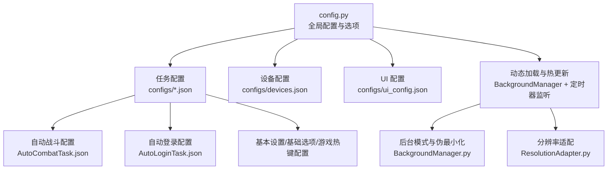
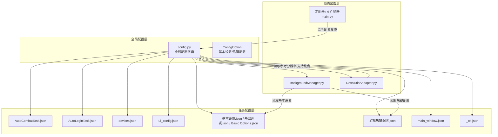
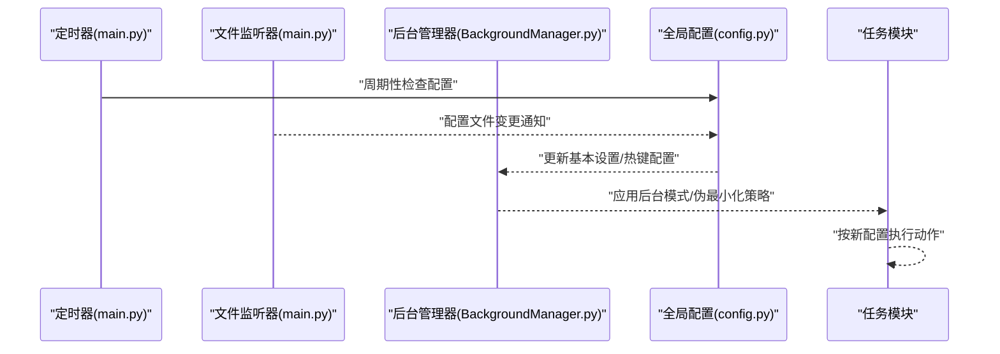
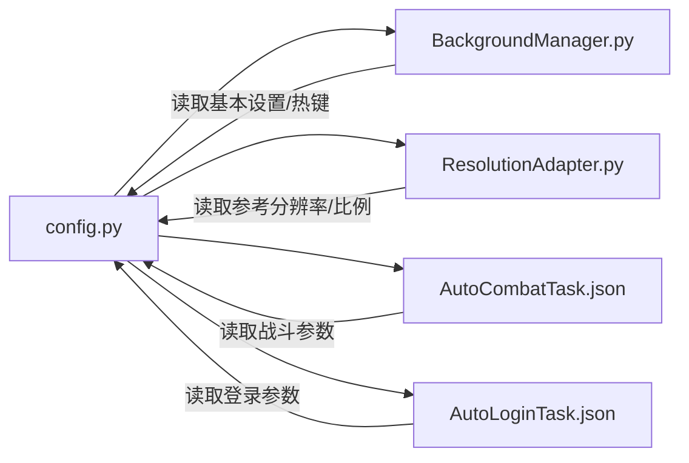

# 配置管理

<cite>
**本文档引用的文件**
- [config.py](file://config.py)
- [AutoCombatTask.json](file://configs/AutoCombatTask.json)
- [AutoLoginTask.json](file://configs/AutoLoginTask.json)
- [devices.json](file://configs/devices.json)
- [main_window.json](file://configs/main_window.json)
- [Basic Options.json](file://configs/Basic Options.json)
- [基础选项.json](file://configs/基础选项.json)
- [基本设置.json](file://configs/基本设置.json)
- [游戏热键配置.json](file://configs/游戏热键配置.json)
- [ui_config.json](file://configs/ui_config.json)
- [_ok.json](file://configs/_ok.json)
- [BackgroundManager.py](file://src/utils/BackgroundManager.py)
- [BaseJumpTask.py](file://src/task/BaseJumpTask.py)
- [AutoLoginTask.py](file://src/task/AutoLoginTask.py)
- [phase1_handler.py](file://src/tutorial/phase1_handler.py)
- [ResolutionAdapter.py](file://src/utils/ResolutionAdapter.py)
- [main.py](file://main.py)
</cite>

## 目录
1. [简介](#简介)
2. [项目结构](#项目结构)
3. [核心组件](#核心组件)
4. [架构总览](#架构总览)
5. [详细组件分析](#详细组件分析)
6. [依赖分析](#依赖分析)
7. [性能考虑](#性能考虑)
8. [故障排除指南](#故障排除指南)
9. [结论](#结论)
10. [附录](#附录)

## 简介
本文件系统性梳理 ok-jump 项目的配置管理体系，涵盖配置文件结构与格式、各类配置的作用与参数、热更新与动态加载机制、配置验证与错误处理、默认值与继承策略，以及面向用户的定制指导。目标是帮助不同技术背景的用户快速理解并安全地定制配置，以适配多样的使用场景。

## 项目结构
配置系统围绕“全局配置 + 任务配置 + 设备配置 + UI 配置”的分层设计展开：
- 全局配置：集中于 config.py，定义 OCR、模板匹配、窗口交互、ADB、分辨率支持、窗口尺寸、日志与截图目录、一次性任务与触发任务列表、自定义标签页与场景等。
- 任务配置：位于 configs/ 目录，按功能拆分，如自动战斗、自动登录、设备选择、主界面版本记录、UI 主题与语言等。
- 动态加载与热更新：通过后台管理器与定时器监听实现，支持配置变更后的即时生效。
- 验证与回退：采用多级回退策略（中文/英文/拼音键名）、默认值注入与容错处理，确保稳定性。

图表来源
- [config.py:68-145](file://config.py#L68-L145)
- [BackgroundManager.py:18-41](file://src/utils/BackgroundManager.py#L18-L41)
- [main.py:648-655](file://main.py#L648-L655)

章节来源
- [config.py:68-145](file://config.py#L68-L145)
- [Basic Options.json:1-13](file://configs/Basic Options.json#L1-L13)
- [基础选项.json:1-11](file://configs/基础选项.json#L1-L11)
- [基本设置.json:1-11](file://configs/基本设置.json#L1-L11)
- [游戏热键配置.json:1-6](file://configs/游戏热键配置.json#L1-L6)
- [ui_config.json:1-17](file://configs/ui_config.json#L1-L17)
- [devices.json:1-7](file://configs/devices.json#L1-L7)
- [main_window.json:1-3](file://configs/main_window.json#L1-L3)
- [AutoCombatTask.json:1-14](file://configs/AutoCombatTask.json#L1-L14)
- [AutoLoginTask.json:1-14](file://configs/AutoLoginTask.json#L1-L14)

## 核心组件
- 全局配置中心：集中定义 OCR 参数、模板匹配阈值、窗口交互方式、ADB 包名、支持的分辨率与窗口尺寸、日志与截图路径、一次性任务与触发任务清单、自定义标签页与场景等。
- 配置选项对象：通过 ConfigOption 定义“基本设置”“游戏热键配置”等，包含默认值、类型约束、描述与图标，便于 GUI 展示与编辑。
- 任务配置文件：JSON 文件按功能划分，如自动战斗、自动登录、设备选择、主界面版本等，字段明确、层级清晰。
- 动态加载与热更新：后台管理器根据配置切换后台模式与伪最小化；定时器与文件系统监听器实现配置热更新。

章节来源
- [config.py:23-66](file://config.py#L23-L66)
- [config.py:68-145](file://config.py#L68-L145)
- [BackgroundManager.py:18-41](file://src/utils/BackgroundManager.py#L18-L41)
- [main.py:648-655](file://main.py#L648-L655)

## 架构总览
配置系统采用“集中式全局配置 + 分散式任务配置 + 动态加载与热更新”的架构。全局配置决定底层能力与行为边界，任务配置聚焦具体业务参数，动态加载保障运行期可调整。

图表来源
- [config.py:68-145](file://config.py#L68-L145)
- [BackgroundManager.py:18-41](file://src/utils/BackgroundManager.py#L18-L41)
- [ResolutionAdapter.py:19-43](file://src/utils/ResolutionAdapter.py#L19-L43)
- [main.py:648-655](file://main.py#L648-L655)

## 详细组件分析

### 全局配置中心（config.py）
- 职责：统一声明 OCR、模板匹配、窗口交互、ADB、分辨率支持、窗口尺寸、日志与截图路径、一次性/触发任务清单、自定义标签页与场景等。
- 关键点：
  - OCR 参数：ONNX 引擎、OpenVINO/NPU 开关。
  - 模板匹配：coco 特征 JSON 路径与默认阈值。
  - 窗口交互：标题、EXE 名、窗口类名、交互方式（Unity 需 PyDirect）、捕获方法序列、允许最小化/屏幕外窗口。
  - ADB：开关与包名。
  - 分辨率支持：宽高比、最小尺寸、可重定尺寸列表。
  - 窗口尺寸：默认宽高与最小宽高。
  - 日志与截图：日志文件路径、错误日志路径、截图目录。
  - 任务清单：一次性任务与触发任务。
  - 自定义 UI：日志标签页、场景。
- 默认值与类型：通过 ConfigOption 提供默认值与类型约束，GUI 层据此渲染下拉框与描述。

章节来源
- [config.py:68-145](file://config.py#L68-L145)
- [config.py:23-66](file://config.py#L23-L66)

### 自动战斗配置（AutoCombatTask.json）
- 作用：控制自动战斗的开关与节奏，包括普攻、技能、大招的启用与间隔，移动持续时间等。
- 关键字段：
  - 启用标志：_enabled、测试模式、详细日志。
  - 自动动作：自动普攻、自动技能1、自动技能2、自动大招。
  - 间隔：普攻间隔、技能1间隔、技能2间隔、大招间隔（单位：秒）。
  - 移动：移动持续时间（单位：秒）。
- 使用场景：在副本、活动等需要自动输出的场景提升效率；测试模式用于调试与验证。

章节来源
- [AutoCombatTask.json:1-14](file://configs/AutoCombatTask.json#L1-L14)

### 自动登录配置（AutoLoginTask.json）
- 作用：控制自动登录流程，包括启动游戏、账号输入、登录等待与超时、加载检测与容错等。
- 关键字段：
  - 启动与等待：自动启动游戏、等待游戏启动、登录等待超时。
  - 账号与输入：输入账号、账号、输入校验超时、点击后等待时间。
  - 重试与超时：最大登录尝试次数、输入账号重试次数、加载停滞超时。
  - 检测与容错：启用加载检测、启用状态容错。
- 使用场景：多账号轮换、长时间挂机、CI 环境下的稳定登录。

章节来源
- [AutoLoginTask.json:1-14](file://configs/AutoLoginTask.json#L1-L14)
- [AutoLoginTask.py:136-156](file://src/task/AutoLoginTask.py#L136-L156)

### 设备配置（devices.json）
- 作用：选择首选模拟器/设备、PC 可执行文件路径、截图方式（ADB/WGC/BitBlt）、当前选中的 EXE/HWND。
- 关键字段：
  - preferred：首选设备标识。
  - pc_full_path：PC 端可执行文件完整路径。
  - capture：截图方式（adb）。
  - selected_exe / selected_hwnd：当前选中的 EXE 与窗口句柄。
- 使用场景：多设备/多模拟器环境下的灵活切换与定位。

章节来源
- [devices.json:1-7](file://configs/devices.json#L1-L7)

### 主界面配置（main_window.json）
- 作用：记录主界面最后版本号，用于版本兼容与升级提示。
- 关键字段：
  - last_version：上次运行版本号。
- 使用场景：版本迁移与兼容性检查。

章节来源
- [main_window.json:1-3](file://configs/main_window.json#L1-L3)

### 基本设置与热键配置
- 基本设置（基本设置.json / 基础选项.json / Basic Options.json）：
  - 后台模式、最小化时伪最小化、后台时静音游戏、自动调整游戏窗口大小、触发间隔、启动/停止快捷键、语言等。
  - 多语言回退策略：优先中文键名，其次英文键名，保证兼容。
- 游戏热键配置（游戏热键配置.json）：
  - 普通攻击、技能1、技能2、大招对应的按键映射。
- 使用场景：后台运行、伪最小化支持、按键自定义。

章节来源
- [基本设置.json:1-11](file://configs/基本设置.json#L1-L11)
- [基础选项.json:1-11](file://configs/基础选项.json#L1-L11)
- [Basic Options.json:1-13](file://configs/Basic Options.json#L1-L13)
- [游戏热键配置.json:1-6](file://configs/游戏热键配置.json#L1-L6)
- [BackgroundManager.py:18-41](file://src/utils/BackgroundManager.py#L18-L41)

### UI 配置（ui_config.json）
- 作用：控制 UI 材质、更新策略、主窗口 DPI/语言/Mica、主题色与主题模式等。
- 关键字段：
  - Material：AcrylicBlurRadius。
  - Update：CheckUpdateAtStartUp。
  - MainWindow：DpiScale、Language、MicaEnabled。
  - QFluentWidgets：ThemeColor、ThemeMode。
- 使用场景：个性化外观与语言设置。

章节来源
- [ui_config.json:1-17](file://configs/ui_config.json#L1-L17)

### _ok.json（窗口状态）
- 作用：记录主窗口的位置、尺寸与最大化状态，便于下次启动恢复。
- 关键字段：
  - window_x、window_y、window_width、window_height、window_maximized。
- 使用场景：窗口状态持久化。

章节来源
- [_ok.json:1-7](file://configs/_ok.json#L1-L7)

### 动态加载与热更新机制
- 定时器与文件监听：通过定时器每分钟检查配置变化，并使用文件系统监听器对配置目录进行监听，实现热更新。
- 后台模式与伪最小化：后台管理器根据基本设置动态切换后台模式与伪最小化策略，确保后台截图与交互稳定。
- 分辨率适配：根据全局配置中的参考分辨率与支持比例，计算缩放因子并判断分辨率有效性。
- 任务配置读取：部分模块（如教程阶段处理器）直接读取 AutoCombatTask.json 并回退到默认值，保证健壮性。

图表来源
- [main.py:648-655](file://main.py#L648-L655)
- [BackgroundManager.py:18-41](file://src/utils/BackgroundManager.py#L18-L41)
- [config.py:68-145](file://config.py#L68-L145)

章节来源
- [main.py:648-655](file://main.py#L648-L655)
- [BackgroundManager.py:18-41](file://src/utils/BackgroundManager.py#L18-L41)
- [ResolutionAdapter.py:19-43](file://src/utils/ResolutionAdapter.py#L19-L43)
- [phase1_handler.py:559-595](file://src/tutorial/phase1_handler.py#L559-L595)

### 配置验证与错误处理
- 多级回退：后台管理器优先尝试中文键名，再回退至英文键名，最后回退到默认值，确保在不同语言环境下稳定运行。
- 容错处理：读取配置文件时捕获异常并记录警告，避免因单个配置项损坏导致整体失败。
- 默认值注入：任务配置读取时若缺少键，使用默认值，保证流程可控。
- CI 专用配置：CI 配置文件仅补充缺失项，不覆盖 GUI 配置，避免 CI 环境污染本地配置。

章节来源
- [BackgroundManager.py:25-41](file://src/utils/BackgroundManager.py#L25-L41)
- [AutoLoginTask.py:136-156](file://src/task/AutoLoginTask.py#L136-L156)
- [phase1_handler.py:559-595](file://src/tutorial/phase1_handler.py#L559-L595)

### 默认值管理与继承机制
- 全局默认值：通过 ConfigOption 定义默认值与类型约束，GUI 层据此渲染。
- 任务配置默认值：任务内部对缺失键进行默认值注入，保证运行时一致性。
- 继承与回退：后台管理器对配置键名进行多语言回退，形成“中文→英文→默认值”的继承链。
- CI 配置补充：CI 配置文件仅在 GUI 配置缺失时补充，不覆盖既有配置。

章节来源
- [config.py:23-66](file://config.py#L23-L66)
- [BackgroundManager.py:25-41](file://src/utils/BackgroundManager.py#L25-L41)
- [AutoLoginTask.py:136-156](file://src/task/AutoLoginTask.py#L136-L156)

### 配置定制指导
- 自动战斗
  - 调整普攻/技能/大招间隔以平衡效率与稳定性。
  - 在测试模式下验证动作序列，确认移动持续时间满足场景需求。
- 自动登录
  - 根据网络状况调整登录等待与加载停滞超时。
  - 在 CI 环境下通过 og.config 注入账号与输入开关，避免本地配置污染。
- 后台模式与伪最小化
  - 启用“后台模式”与“最小化时伪最小化”，确保后台截图可用。
  - 根据实际窗口交互方式选择合适的捕获方法与交互方式。
- 分辨率适配
  - 在全局配置中设置支持的比例与最小尺寸，确保识别与点击精度。
  - 使用分辨率适配器计算缩放因子，避免坐标偏移。
- UI 个性化
  - 调整主题色与主题模式，设置语言与 DPI 缩放，提升使用体验。

章节来源
- [AutoCombatTask.json:1-14](file://configs/AutoCombatTask.json#L1-L14)
- [AutoLoginTask.json:1-14](file://configs/AutoLoginTask.json#L1-L14)
- [config.py:94-101](file://config.py#L94-L101)
- [ResolutionAdapter.py:19-43](file://src/utils/ResolutionAdapter.py#L19-L43)
- [ui_config.json:1-17](file://configs/ui_config.json#L1-L17)

## 依赖分析
- 配置到模块的耦合：
  - BackgroundManager 依赖基本设置与热键配置，影响后台模式与伪最小化。
  - 分辨率适配器依赖全局配置中的参考分辨率与支持比例。
  - 任务模块通过统一的配置读取接口获取参数，减少对具体文件的耦合。
- 外部依赖：
  - 文件系统监听器用于热更新。
  - GUI 配置项通过 ConfigOption 定义，便于渲染与校验。

图表来源
- [config.py:68-145](file://config.py#L68-L145)
- [BackgroundManager.py:18-41](file://src/utils/BackgroundManager.py#L18-L41)
- [ResolutionAdapter.py:19-43](file://src/utils/ResolutionAdapter.py#L19-L43)

章节来源
- [config.py:68-145](file://config.py#L68-L145)
- [BackgroundManager.py:18-41](file://src/utils/BackgroundManager.py#L18-L41)
- [ResolutionAdapter.py:19-43](file://src/utils/ResolutionAdapter.py#L19-L43)

## 性能考虑
- 触发间隔：增大触发间隔可降低 CPU/GPU 占用，适合低性能设备或后台模式。
- 捕获方法：优先选择 WGC 或 BitBlt_RenderFull，必要时回退至 BitBlt，权衡性能与稳定性。
- 后台模式：启用后台模式与伪最小化可减少窗口交互开销，但需确保截图可用性。
- 分辨率适配：合理设置参考分辨率与支持比例，避免频繁缩放带来的性能损耗。

## 故障排除指南
- 配置文件损坏
  - 现象：读取失败或参数缺失。
  - 处理：回退到默认值；检查文件编码与 JSON 语法；必要时删除文件让系统重建。
- 键名不匹配
  - 现象：配置未生效。
  - 处理：确认键名是否为中文或英文版本；后台管理器会自动回退到默认值。
- 后台截图异常
  - 现象：后台模式下无法截图或点击无效。
  - 处理：检查“后台模式”“最小化时伪最小化”“后台时静音游戏”设置；确认捕获方法与交互方式。
- 分辨率不支持
  - 现象：识别与点击偏差。
  - 处理：调整全局配置中的参考分辨率与支持比例；使用分辨率适配器重新计算缩放。

章节来源
- [BackgroundManager.py:25-41](file://src/utils/BackgroundManager.py#L25-L41)
- [config.py:94-101](file://config.py#L94-L101)
- [ResolutionAdapter.py:19-43](file://src/utils/ResolutionAdapter.py#L19-L43)

## 结论
ok-jump 的配置管理以全局配置为中心，结合任务配置与动态加载机制，实现了灵活、稳定且可扩展的配置体系。通过多级回退与默认值注入，系统在不同语言与环境下均能保持一致的行为；通过热更新与后台管理策略，满足了后台运行与自动化场景的需求。建议用户在定制配置时遵循“先理解全局边界，再细化任务参数，最后验证热更新”的步骤，以获得最佳体验。

## 附录
- 配置文件命名规范：中文键名优先，英文键名作为回退；GUI 层通过 ConfigOption 统一渲染。
- 任务配置读取：优先从 og.config 获取，其次从本地 JSON 文件读取，最后回退到默认值。
- CI 环境：通过 og.config 注入账号与输入开关，避免污染本地配置；CI 额外配置仅补充缺失项。