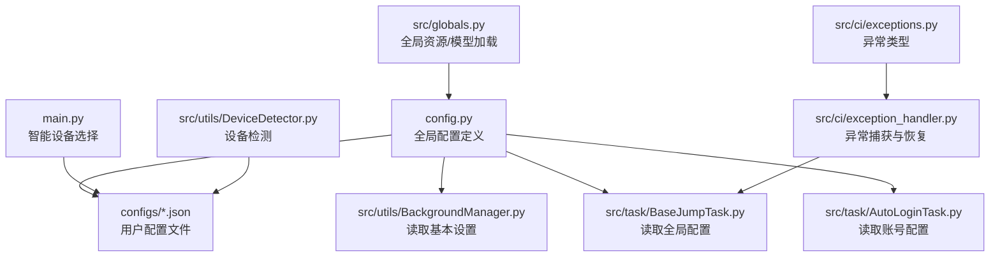
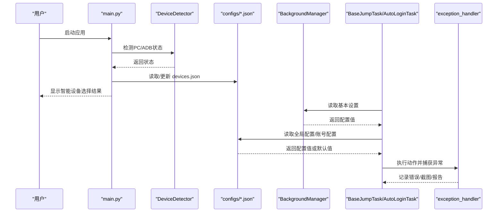
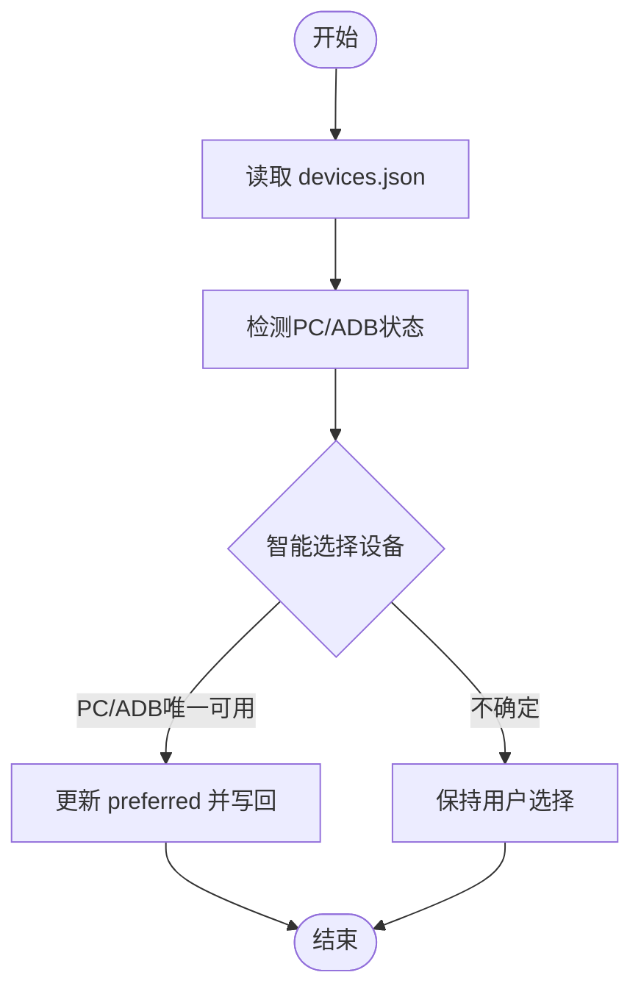
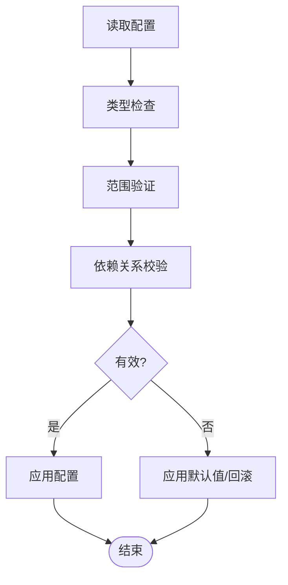
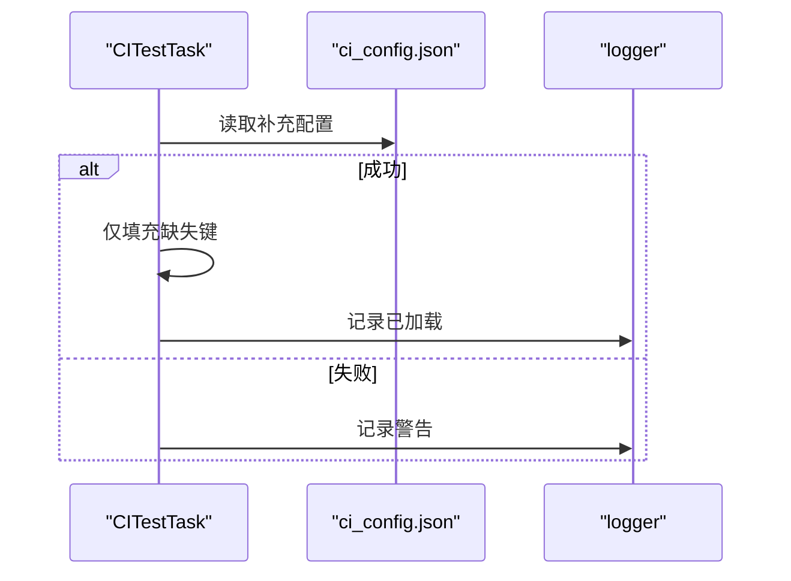
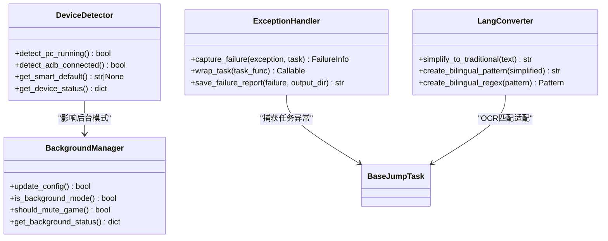
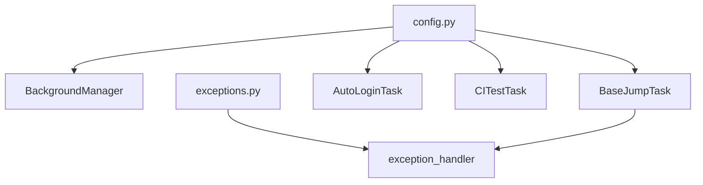

# 配置验证与错误处理

<cite>
**本文档引用的文件**
- [config.py](file://config.py)
- [main.py](file://main.py)
- [src/globals.py](file://src/globals.py)
- [src/utils/BackgroundManager.py](file://src/utils/BackgroundManager.py)
- [src/utils/DeviceDetector.py](file://src/utils/DeviceDetector.py)
- [src/utils/LangConverter.py](file://src/utils/LangConverter.py)
- [src/tas/BaseJumpTask.py](file://src/task/BaseJumpTask.py)
- [src/tas/AutoLoginTask.py](file://src/task/AutoLoginTask.py)
- [src/tas/CITestTask.py](file://src/task/CITestTask.py)
- [src/ci/exception_handler.py](file://src/ci/exception_handler.py)
- [src/ci/exceptions.py](file://src/ci/exceptions.py)
- [configs/_ok.json](file://configs/_ok.json)
- [configs/devices.json](file://configs/devices.json)
- [configs/main_window.json](file://configs/main_window.json)
- [configs/ui_config.json](file://configs/ui_config.json)
- [configs/Basic Options.json](file://configs/Basic Options.json)
- [configs/基本设置.json](file://configs/基本设置.json)
</cite>

## 目录
1. [简介](#简介)
2. [项目结构](#项目结构)
3. [核心组件](#核心组件)
4. [架构总览](#架构总览)
5. [详细组件分析](#详细组件分析)
6. [依赖分析](#依赖分析)
7. [性能考虑](#性能考虑)
8. [故障排除指南](#故障排除指南)
9. [结论](#结论)
10. [附录](#附录)

## 简介
本文件聚焦于 ok-jump 项目的“配置验证与错误处理”主题，系统梳理配置文件的有效性检查机制、数据验证规则、类型与范围校验、依赖关系校验、加载过程中的异常处理与恢复策略、配置回滚与默认值应用逻辑，以及配置错误的日志记录与用户提示机制，并提供实用的调试与故障排除工具与方法。

## 项目结构
ok-jump 的配置体系由“全局配置对象 + 多源配置文件 + 运行时配置读取与校验 + 异常处理与恢复”构成。核心文件包括：
- 全局配置定义与默认值：config.py
- 运行时配置读取与设备智能选择：main.py、src/utils/DeviceDetector.py
- 配置读取与语言/背景模式适配：src/utils/BackgroundManager.py、src/task/BaseJumpTask.py、src/task/AutoLoginTask.py
- 配置文件样例：configs/*.json
- 全局资源与模型加载：src/globals.py
- CI 异常处理与恢复：src/ci/exception_handler.py、src/ci/exceptions.py

**图表来源**
- [config.py:68-145](file://config.py#L68-L145)
- [main.py:393-423](file://main.py#L393-L423)
- [src/utils/BackgroundManager.py:18-41](file://src/utils/BackgroundManager.py#L18-L41)
- [src/task/BaseJumpTask.py:496-504](file://src/task/BaseJumpTask.py#L496-L504)
- [src/task/AutoLoginTask.py:136-156](file://src/task/AutoLoginTask.py#L136-L156)
- [src/utils/DeviceDetector.py:113-134](file://src/utils/DeviceDetector.py#L113-L134)
- [src/globals.py:238-262](file://src/globals.py#L238-L262)
- [src/ci/exception_handler.py:331-492](file://src/ci/exception_handler.py#L331-L492)
- [src/ci/exceptions.py:8-45](file://src/ci/exceptions.py#L8-L45)

**章节来源**
- [config.py:68-145](file://config.py#L68-L145)
- [main.py:393-423](file://main.py#L393-L423)
- [src/utils/DeviceDetector.py:113-134](file://src/utils/DeviceDetector.py#L113-L134)

## 核心组件
- 全局配置对象与默认值：集中定义全局配置键、默认值、类型与描述等，作为配置校验与 UI 展示的基础。
- 配置文件层：用户在 configs 目录下维护各类 JSON 配置文件，支持覆盖与扩展。
- 运行时读取与适配：通过工具模块读取配置并进行类型、范围与依赖校验，必要时应用默认值或回滚策略。
- 异常处理与恢复：在 CI 与任务执行过程中，对异常进行分类、记录、截图与报告生成，并提供恢复策略。

**章节来源**
- [config.py:23-80](file://config.py#L23-L80)
- [configs/基本设置.json:1-11](file://configs/基本设置.json#L1-L11)
- [configs/Basic Options.json:1-13](file://configs/Basic Options.json#L1-L13)

## 架构总览
配置验证与错误处理的整体流程如下：

**图表来源**
- [main.py:393-423](file://main.py#L393-L423)
- [src/utils/DeviceDetector.py:113-134](file://src/utils/DeviceDetector.py#L113-L134)
- [src/utils/BackgroundManager.py:18-41](file://src/utils/BackgroundManager.py#L18-L41)
- [src/task/BaseJumpTask.py:496-504](file://src/task/BaseJumpTask.py#L496-L504)
- [src/ci/exception_handler.py:331-492](file://src/ci/exception_handler.py#L331-L492)

## 详细组件分析

### 全局配置与默认值（config.py）
- 全局配置对象包含：
  - 基本设置与热键配置项（含类型与描述）
  - OCR、模板匹配、窗口、ADB、分辨率、窗口尺寸、日志、截图、一次性任务、触发任务、自定义标签页、场景等键
- 默认值与类型约束：
  - 通过配置对象定义键的默认值与 UI 类型（下拉框等）
  - 运行时读取时可结合 UI 与 JSON 文件进行覆盖
- 关键点：
  - 全局配置对象作为配置校验与 UI 展示的权威来源
  - 配置键的类型与取值范围在定义阶段即得到约束

**章节来源**
- [config.py:23-80](file://config.py#L23-L80)
- [config.py:68-145](file://config.py#L68-L145)

### 配置文件有效性检查与加载
- 基本设置与 UI 配置：
  - 基本设置与英文选项文件分别提供中文与英文键名，确保兼容性
  - 值域示例：布尔值、下拉选项、数值等
- 设备配置与智能选择：
  - devices.json 记录首选设备、捕获方式、窗口句柄等
  - main.py 在 OK(config) 之前执行智能设备选择，若与当前配置不一致则写回 devices.json
- 主窗口与 UI 配置：
  - main_window.json 记录上次版本号
  - ui_config.json 记录主题、语言、缩放等 UI 参数

**图表来源**
- [main.py:393-423](file://main.py#L393-L423)
- [src/utils/DeviceDetector.py:113-134](file://src/utils/DeviceDetector.py#L113-L134)
- [configs/devices.json:1-7](file://configs/devices.json#L1-L7)

**章节来源**
- [configs/基本设置.json:1-11](file://configs/基本设置.json#L1-L11)
- [configs/Basic Options.json:1-13](file://configs/Basic Options.json#L1-L13)
- [configs/main_window.json:1-3](file://configs/main_window.json#L1-L3)
- [configs/ui_config.json:1-17](file://configs/ui_config.json#L1-L17)
- [configs/devices.json:1-7](file://configs/devices.json#L1-L7)
- [main.py:393-423](file://main.py#L393-L423)

### 类型检查、范围验证与依赖关系校验
- 类型检查：
  - 基本设置中的布尔值、下拉选项（如语言、快捷键）在配置对象中定义
  - 运行时读取时建议进行类型转换与校验（如将字符串转为布尔或枚举）
- 范围验证：
  - 数值型配置（如触发间隔）应在合理范围内（如大于等于 0）
- 依赖关系校验：
  - 后台模式与静音、伪最小化之间存在依赖关系，需保证开启后台模式时才生效
  - 窗口尺寸与最小尺寸存在依赖关系，防止非法配置

**图表来源**
- [config.py:53-66](file://config.py#L53-L66)
- [src/utils/BackgroundManager.py:18-23](file://src/utils/BackgroundManager.py#L18-L23)
- [src/task/BaseJumpTask.py:496-504](file://src/task/BaseJumpTask.py#L496-L504)

**章节来源**
- [config.py:53-66](file://config.py#L53-L66)
- [src/utils/BackgroundManager.py:18-23](file://src/utils/BackgroundManager.py#L18-L23)

### 配置加载过程中的异常处理与错误恢复
- 设备智能选择：
  - 若读取/写入 devices.json 发生异常，记录警告并保持现状
- 任务配置加载：
  - 从 ci_config.json 加载补充配置时，仅在缺失键时填充，避免覆盖已有配置
  - 加载失败时记录警告并继续执行

**图表来源**
- [src/task/CITestTask.py:328-342](file://src/task/CITestTask.py#L328-L342)

**章节来源**
- [src/task/CITestTask.py:328-342](file://src/task/CITestTask.py#L328-L342)

### 配置回滚机制与默认值应用逻辑
- 回滚策略：
  - 当配置文件损坏或字段缺失时，回退到全局配置对象的默认值
  - 设备智能选择仅在与当前配置不一致时更新，避免错误写入导致回滚
- 默认值应用：
  - 基本设置与热键配置的默认值在配置对象中定义
  - 运行时读取时若缺省，使用默认值并记录日志

**章节来源**
- [config.py:23-80](file://config.py#L23-L80)
- [main.py:405-423](file://main.py#L405-L423)

### 配置错误的日志记录与用户提示机制
- 日志记录：
  - 任务执行异常时记录错误类型、消息与堆栈
  - 截图保存与失败报告生成，便于问题定位
- 用户提示：
  - 设备智能选择在控制台输出当前状态与切换结果
  - 任务执行中对关键配置项进行日志输出，便于用户核对

**章节来源**
- [src/ci/exception_handler.py:339-492](file://src/ci/exception_handler.py#L339-L492)
- [main.py:393-423](file://main.py#L393-L423)

### 配置调试与故障排除工具与方法
- 设备检测与智能选择：
  - 使用 DeviceDetector 获取 PC/ADB 连接状态与智能默认设备
- 配置读取验证：
  - 在任务中读取基本设置与全局配置，检查键是否存在与类型是否正确
- 异常捕获与报告：
  - 使用 ExceptionHandler 捕获失败、截图保存、生成失败报告
- 语言与 OCR 适配：
  - 使用 LangConverter 进行简繁转换，确保 OCR 匹配正确

**图表来源**
- [src/utils/DeviceDetector.py:11-149](file://src/utils/DeviceDetector.py#L11-L149)
- [src/utils/BackgroundManager.py:7-155](file://src/utils/BackgroundManager.py#L7-L155)
- [src/ci/exception_handler.py:331-492](file://src/ci/exception_handler.py#L331-L492)
- [src/utils/LangConverter.py:155-338](file://src/utils/LangConverter.py#L155-L338)

**章节来源**
- [src/utils/DeviceDetector.py:11-149](file://src/utils/DeviceDetector.py#L11-L149)
- [src/utils/BackgroundManager.py:7-155](file://src/utils/BackgroundManager.py#L7-L155)
- [src/ci/exception_handler.py:331-492](file://src/ci/exception_handler.py#L331-L492)
- [src/utils/LangConverter.py:155-338](file://src/utils/LangConverter.py#L155-L338)

## 依赖分析
- 配置对象与文件：
  - config.py 定义全局配置对象，configs/*.json 提供用户覆盖
- 运行时依赖：
  - BackgroundManager 依赖基本设置配置
  - BaseJumpTask 依赖全局配置与语言转换
  - AutoLoginTask 依赖账号配置与模板路径解析
  - CITestTask 依赖 CI 额外配置文件
- 异常处理：
  - exception_handler 依赖异常类型定义与任务上下文

**图表来源**
- [config.py:68-145](file://config.py#L68-L145)
- [src/utils/BackgroundManager.py:18-41](file://src/utils/BackgroundManager.py#L18-L41)
- [src/task/BaseJumpTask.py:496-504](file://src/task/BaseJumpTask.py#L496-L504)
- [src/task/AutoLoginTask.py:136-156](file://src/task/AutoLoginTask.py#L136-L156)
- [src/task/CITestTask.py:328-342](file://src/task/CITestTask.py#L328-L342)
- [src/ci/exceptions.py:8-45](file://src/ci/exceptions.py#L8-L45)
- [src/ci/exception_handler.py:331-492](file://src/ci/exception_handler.py#L331-L492)

**章节来源**
- [config.py:68-145](file://config.py#L68-L145)
- [src/ci/exception_handler.py:331-492](file://src/ci/exception_handler.py#L331-L492)

## 性能考虑
- 配置读取频率与缓存：
  - 基本设置与语言配置可采用短期缓存，减少重复读取
- 后台模式与伪最小化：
  - 后台模式下的窗口可见性检查与静音逻辑应避免频繁调用
- OCR 与模型加载：
  - YOLO 模型延迟加载，失败时返回空结果并记录错误，避免阻塞主线程

**章节来源**
- [src/utils/BackgroundManager.py:18-23](file://src/utils/BackgroundManager.py#L18-L23)
- [src/globals.py:238-262](file://src/globals.py#L238-L262)

## 故障排除指南
- 设备选择异常：
  - 检查 PC/ADB 连接状态与 devices.json 内容
  - 如需强制回滚，删除 devices.json 或重置 preferred 字段
- 配置文件损坏：
  - 删除或重命名损坏的配置文件，系统将回退到默认值
- 任务执行失败：
  - 查看失败报告与截图，定位具体步骤
  - 检查 CI 额外配置文件的键是否缺失或类型不匹配
- 语言与 OCR 匹配问题：
  - 确认游戏文本语言设置与 OCR 结果一致性
  - 使用 LangConverter 的双语模式增强匹配鲁棒性

**章节来源**
- [src/utils/DeviceDetector.py:113-134](file://src/utils/DeviceDetector.py#L113-L134)
- [src/ci/exception_handler.py:339-492](file://src/ci/exception_handler.py#L339-L492)
- [src/utils/LangConverter.py:284-338](file://src/utils/LangConverter.py#L284-L338)

## 结论
ok-jump 的配置验证与错误处理通过“全局配置对象 + 多源配置文件 + 运行时校验 + 异常捕获与恢复”的闭环实现，既保证了配置的灵活性与可维护性，又提供了完善的错误处理与恢复能力。建议在实际使用中：
- 严格遵循配置对象的类型与取值范围
- 在关键配置变更前后进行日志核对
- 使用提供的工具进行设备与配置状态检查
- 在 CI 环境中利用异常处理模块生成可追溯的失败报告

## 附录
- 配置文件样例路径与用途：
  - configs/_ok.json：窗口位置与尺寸
  - configs/devices.json：设备首选项与捕获方式
  - configs/main_window.json：主窗口版本信息
  - configs/ui_config.json：UI 主题与语言
  - configs/基本设置.json / Basic Options.json：基本设置与 UI 选项

**章节来源**
- [configs/_ok.json:1-7](file://configs/_ok.json#L1-L7)
- [configs/devices.json:1-7](file://configs/devices.json#L1-L7)
- [configs/main_window.json:1-3](file://configs/main_window.json#L1-L3)
- [configs/ui_config.json:1-17](file://configs/ui_config.json#L1-L17)
- [configs/基本设置.json:1-11](file://configs/基本设置.json#L1-L11)
- [configs/Basic Options.json:1-13](file://configs/Basic Options.json#L1-L13)