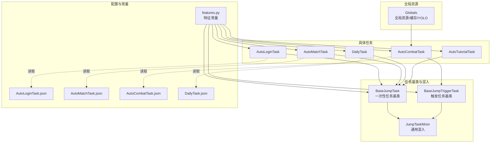
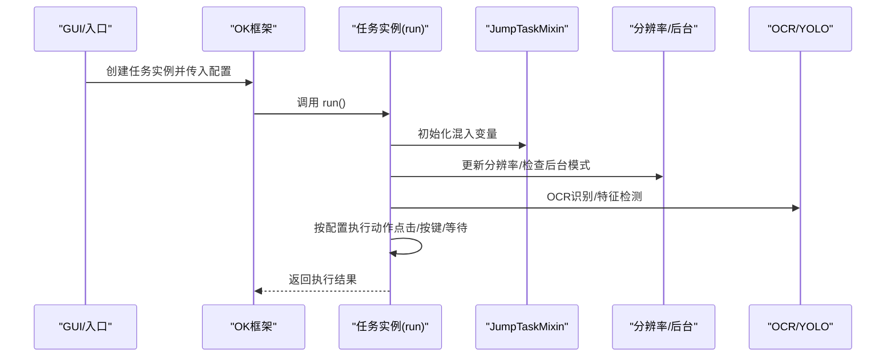
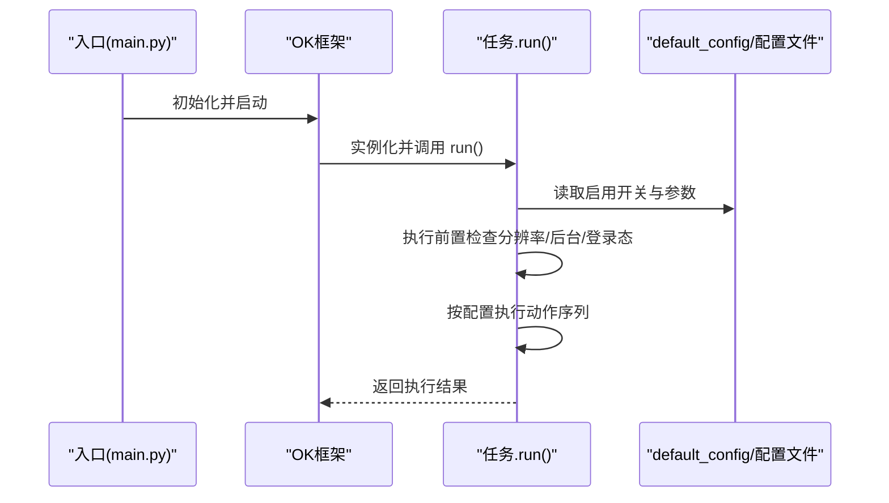
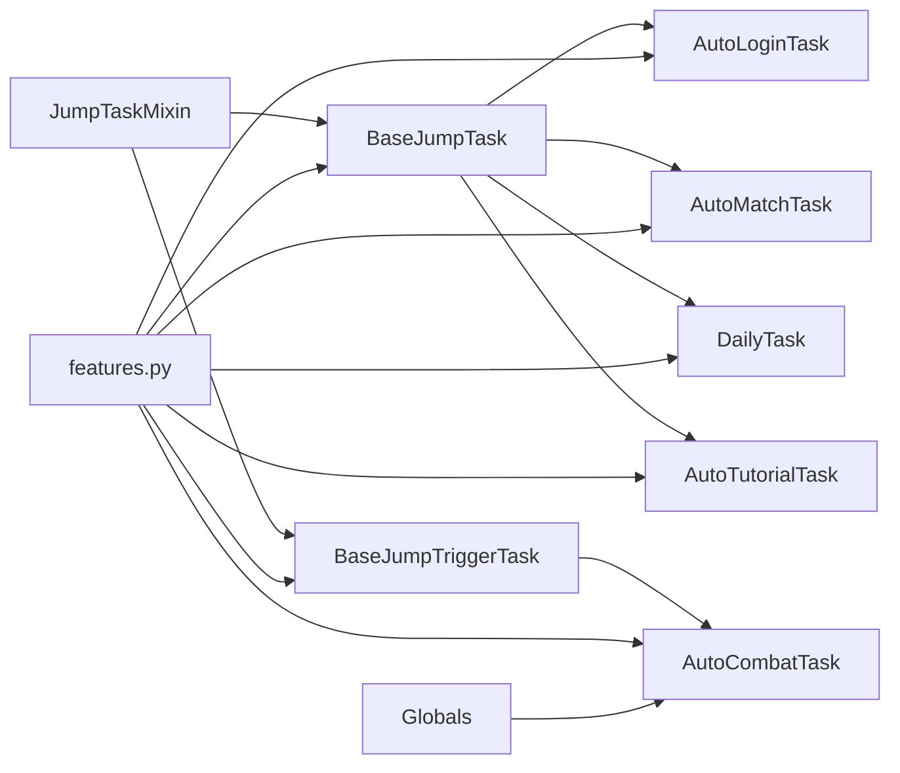

# 任务配置

<cite>
**本文引用的文件**
- [main.py](file://main.py)
- [src/task/BaseJumpTask.py](file://src/task/BaseJumpTask.py)
- [src/task/BaseJumpTriggerTask.py](file://src/task/BaseJumpTriggerTask.py)
- [src/task/mixins.py](file://src/task/mixins.py)
- [src/task/AutoLoginTask.py](file://src/task/AutoLoginTask.py)
- [src/task/AutoMatchTask.py](file://src/task/AutoMatchTask.py)
- [src/task/DailyTask.py](file://src/task/DailyTask.py)
- [src/task/AutoTutorialTask.py](file://src/task/AutoTutorialTask.py)
- [src/task/AutoCombatTask.py](file://src/task/AutoCombatTask.py)
- [src/constants/features.py](file://src/constants/features.py)
- [src/globals.py](file://src/globals.py)
- [configs/AutoLoginTask.json](file://configs/AutoLoginTask.json)
- [configs/AutoMatchTask.json](file://configs/AutoMatchTask.json)
- [configs/AutoCombatTask.json](file://configs/AutoCombatTask.json)
- [configs/DailyTask.json](file://configs/DailyTask.json)
</cite>

## 目录
1. [简介](#简介)
2. [项目结构](#项目结构)
3. [核心组件](#核心组件)
4. [架构总览](#架构总览)
5. [详细组件分析](#详细组件分析)
6. [依赖分析](#依赖分析)
7. [性能考虑](#性能考虑)
8. [故障排查指南](#故障排查指南)
9. [结论](#结论)
10. [附录](#附录)

## 简介
本文件面向“任务配置模块”，系统性说明一次性任务与触发任务的配置结构与管理机制，覆盖任务注册、启动与停止的流程；阐述任务优先级与执行顺序的配置策略；提供动态更新与热重载的技术方案；并给出配置的验证、备份与恢复机制建议。文档以仓库中的任务实现与配置文件为依据，结合架构图与流程图帮助读者快速理解与落地。

## 项目结构
任务配置模块由“任务基类 + 任务实现 + 配置文件 + 常量与全局资源”构成，采用“一次性任务（继承基础任务）”与“触发任务（继承触发任务）”两类模式，配合混入类复用通用能力（分辨率、后台模式、OCR/YOLO等）。

图表来源
- [src/task/BaseJumpTask.py:10-295](file://src/task/BaseJumpTask.py#L10-L295)
- [src/task/BaseJumpTriggerTask.py:13-30](file://src/task/BaseJumpTriggerTask.py#L13-L30)
- [src/task/mixins.py:12-301](file://src/task/mixins.py#L12-L301)
- [src/task/AutoLoginTask.py:18-142](file://src/task/AutoLoginTask.py#L18-L142)
- [src/task/AutoMatchTask.py:5-54](file://src/task/AutoMatchTask.py#L5-L54)
- [src/task/AutoCombatTask.py:25-113](file://src/task/AutoCombatTask.py#L25-L113)
- [src/task/DailyTask.py:5-44](file://src/task/DailyTask.py#L5-L44)
- [src/task/AutoTutorialTask.py:5-58](file://src/task/AutoTutorialTask.py#L5-L58)
- [src/constants/features.py:9-86](file://src/constants/features.py#L9-L86)
- [src/globals.py:16-227](file://src/globals.py#L16-L227)
- [configs/AutoLoginTask.json:1-12](file://configs/AutoLoginTask.json#L1-L12)
- [configs/AutoMatchTask.json:1-6](file://configs/AutoMatchTask.json#L1-L6)
- [configs/AutoCombatTask.json:1-13](file://configs/AutoCombatTask.json#L1-L13)
- [configs/DailyTask.json:1-7](file://configs/DailyTask.json#L1-L7)

章节来源
- [src/task/__init__.py:1-19](file://src/task/__init__.py#L1-L19)
- [main.py:30-33](file://main.py#L30-L33)

## 核心组件
- 一次性任务基类：负责登录等待、场景检测、截图与相对坐标点击、伪最小化等通用能力。
- 触发任务基类：面向周期性检查与触发的场景（如自动战斗），复用通用混入能力。
- 通用混入：统一提供分辨率适配、后台模式、语言检测、日志封装、特征检测等。
- 具体任务：
  - AutoLoginTask：自动登录与账号输入（一次性任务）
  - AutoMatchTask：自动匹配（一次性任务）
  - AutoCombatTask：自动战斗（触发任务）
  - DailyTask：日常任务（一次性任务）
  - AutoTutorialTask：新手引导（一次性任务）
- 配置文件：每个任务对应独立 JSON，包含启用开关、行为参数与间隔控制。
- 常量与全局：特征名称集中于常量类；全局资源提供 OCR 缓存与 YOLO 检测。

章节来源
- [src/task/BaseJumpTask.py:10-295](file://src/task/BaseJumpTask.py#L10-L295)
- [src/task/BaseJumpTriggerTask.py:13-30](file://src/task/BaseJumpTriggerTask.py#L13-L30)
- [src/task/mixins.py:12-301](file://src/task/mixins.py#L12-L301)
- [src/task/AutoLoginTask.py:18-142](file://src/task/AutoLoginTask.py#L18-L142)
- [src/task/AutoMatchTask.py:5-54](file://src/task/AutoMatchTask.py#L5-L54)
- [src/task/AutoCombatTask.py:25-113](file://src/task/AutoCombatTask.py#L25-L113)
- [src/task/DailyTask.py:5-44](file://src/task/DailyTask.py#L5-L44)
- [src/task/AutoTutorialTask.py:5-58](file://src/task/AutoTutorialTask.py#L5-L58)
- [src/constants/features.py:9-86](file://src/constants/features.py#L9-L86)
- [src/globals.py:16-227](file://src/globals.py#L16-L227)
- [configs/AutoLoginTask.json:1-12](file://configs/AutoLoginTask.json#L1-L12)
- [configs/AutoMatchTask.json:1-6](file://configs/AutoMatchTask.json#L1-L6)
- [configs/AutoCombatTask.json:1-13](file://configs/AutoCombatTask.json#L1-L13)
- [configs/DailyTask.json:1-7](file://configs/DailyTask.json#L1-L7)

## 架构总览
任务配置遵循“配置驱动 + 基类复用”的架构：
- 配置文件以键值形式描述任务行为（启用、间隔、阈值等）
- 任务类在构造时维护 default_config，并在 run 中按配置执行
- 通用混入提供跨任务的能力（分辨率、后台、日志、特征检测）
- 触发任务通过周期性检查与动作触发，一次性任务在进入目标场景后执行

图表来源
- [src/task/BaseJumpTask.py:22-295](file://src/task/BaseJumpTask.py#L22-L295)
- [src/task/BaseJumpTriggerTask.py:25-30](file://src/task/BaseJumpTriggerTask.py#L25-L30)
- [src/task/mixins.py:29-301](file://src/task/mixins.py#L29-L301)
- [src/globals.py:107-162](file://src/globals.py#L107-L162)

## 详细组件分析

### 一次性任务与触发任务的配置结构
- 一次性任务（BaseJumpTask）：适用于“进入某场景后执行一段流程”的任务，如登录、匹配、日常、新手引导。
- 触发任务（BaseJumpTriggerTask）：适用于“周期性检测并触发”的任务，如自动战斗。
- 配置结构：
  - 启用开关：决定任务是否执行
  - 行为参数：如间隔、阈值、等待时间
  - 任务特有参数：如自动技能间隔、体力阈值、游戏模式等

章节来源
- [src/task/BaseJumpTask.py:22-295](file://src/task/BaseJumpTask.py#L22-L295)
- [src/task/BaseJumpTriggerTask.py:25-30](file://src/task/BaseJumpTriggerTask.py#L25-L30)
- [configs/AutoLoginTask.json:1-12](file://configs/AutoLoginTask.json#L1-L12)
- [configs/AutoMatchTask.json:1-6](file://configs/AutoMatchTask.json#L1-L6)
- [configs/AutoCombatTask.json:1-13](file://configs/AutoCombatTask.json#L1-L13)
- [configs/DailyTask.json:1-7](file://configs/DailyTask.json#L1-L7)

### 任务注册、启动与停止的配置流程
- 注册：任务类在模块导出清单中注册，供框架发现与实例化。
- 启动：框架调用任务实例的 run 方法；任务内部读取 default_config 并按配置执行。
- 停止：一次性任务通常在流程完成后自然结束；触发任务可通过请求退出信号或场景变化退出。

图表来源
- [main.py:30-33](file://main.py#L30-L33)
- [src/task/AutoLoginTask.py:96-141](file://src/task/AutoLoginTask.py#L96-L141)
- [src/task/AutoMatchTask.py:21-54](file://src/task/AutoMatchTask.py#L21-L54)
- [src/task/DailyTask.py:19-44](file://src/task/DailyTask.py#L19-L44)
- [src/task/AutoTutorialTask.py:20-58](file://src/task/AutoTutorialTask.py#L20-L58)
- [src/task/AutoCombatTask.py:71-113](file://src/task/AutoCombatTask.py#L71-L113)

章节来源
- [src/task/__init__.py:1-19](file://src/task/__init__.py#L1-L19)
- [main.py:30-33](file://main.py#L30-L33)

### 任务优先级与执行顺序的配置策略
- 任务间优先级：通过配置文件的启用顺序与依赖关系进行编排（例如先登录再匹配再战斗）。
- 任务内顺序：任务内部通过步骤化流程控制（如登录任务的界面检测顺序、战斗任务的状态机）。
- 建议：
  - 将“一次性任务”放在“触发任务”之前执行，确保前置条件就绪。
  - 触发任务应具备“退出条件”（如不在游戏场景、收到退出请求），避免无限循环。

章节来源
- [src/task/AutoLoginTask.py:196-271](file://src/task/AutoLoginTask.py#L196-L271)
- [src/task/AutoMatchTask.py:56-103](file://src/task/AutoMatchTask.py#L56-L103)
- [src/task/AutoCombatTask.py:165-242](file://src/task/AutoCombatTask.py#L165-L242)

### 动态更新与热重载技术
- 配置热重载：
  - 任务在 run 前后可重新读取配置（default_config 与外部 JSON），实现参数变更即时生效。
  - 对于频繁读取的参数（如间隔、阈值），可在任务内部缓存并在必要时刷新。
- 资源热重载：
  - YOLO 模型与 OCR 缓存可通过全局资源管理器按需重置与重建，避免重启应用。
- 建议：
  - 提供“刷新配置”按钮，触发任务重新读取配置并更新内部状态。
  - 对于 YOLO 模型，提供“重置模型”接口，释放内存并按需重建。

章节来源
- [src/globals.py:164-227](file://src/globals.py#L164-L227)
- [src/task/AutoCombatTask.py:115-128](file://src/task/AutoCombatTask.py#L115-L128)

### 验证、备份与恢复机制
- 验证：
  - 配置键存在性与类型校验（启用开关布尔、数值范围校验）。
  - 关键参数（如间隔、阈值）在合理区间内。
- 备份：
  - 将配置文件复制到备份目录，命名包含时间戳。
- 恢复：
  - 从备份文件回滚到上一个稳定配置。
- 建议：
  - 在 UI 中提供“验证配置”按钮，输出校验结果。
  - 提供“导出配置”与“导入配置”功能，便于迁移与恢复。

章节来源
- [configs/AutoLoginTask.json:1-12](file://configs/AutoLoginTask.json#L1-L12)
- [configs/AutoMatchTask.json:1-6](file://configs/AutoMatchTask.json#L1-L6)
- [configs/AutoCombatTask.json:1-13](file://configs/AutoCombatTask.json#L1-L13)
- [configs/DailyTask.json:1-7](file://configs/DailyTask.json#L1-L7)

## 依赖分析
- 任务与混入：所有任务均依赖 JumpTaskMixin 提供的通用能力。
- 任务与特征：通过 features.py 中的特征常量统一引用 coco_detection.json 的类别名称。
- 任务与全局：AutoCombatTask 使用全局 YOLO 检测器；各任务使用混入提供的分辨率与后台能力。
- 配置与任务：任务类在构造时维护 default_config，并在 run 中读取配置执行。

图表来源
- [src/task/mixins.py:12-301](file://src/task/mixins.py#L12-L301)
- [src/task/BaseJumpTask.py:10-295](file://src/task/BaseJumpTask.py#L10-L295)
- [src/task/BaseJumpTriggerTask.py:13-30](file://src/task/BaseJumpTriggerTask.py#L13-L30)
- [src/task/AutoLoginTask.py:18-142](file://src/task/AutoLoginTask.py#L18-L142)
- [src/task/AutoMatchTask.py:5-54](file://src/task/AutoMatchTask.py#L5-L54)
- [src/task/AutoCombatTask.py:25-113](file://src/task/AutoCombatTask.py#L25-L113)
- [src/task/DailyTask.py:5-44](file://src/task/DailyTask.py#L5-L44)
- [src/task/AutoTutorialTask.py:5-58](file://src/task/AutoTutorialTask.py#L5-L58)
- [src/constants/features.py:9-86](file://src/constants/features.py#L9-L86)
- [src/globals.py:16-227](file://src/globals.py#L16-L227)

章节来源
- [src/task/__init__.py:1-19](file://src/task/__init__.py#L1-L19)

## 性能考虑
- OCR/YOLO 调用频率：在高频循环中建议缓存 OCR 结果（如登录任务的 OCR 缓存管理），减少重复计算。
- 分辨率适配：仅在分辨率变化时更新，避免每次循环都进行缩放计算。
- 后台模式：在后台模式下适当降低检测频率或暂停非必要操作，节省资源。
- 触发任务循环节流：为触发任务设置最小间隔与退出条件，防止 CPU 占用过高。

章节来源
- [src/task/AutoLoginTask.py:180-193](file://src/task/AutoLoginTask.py#L180-L193)
- [src/task/mixins.py:101-180](file://src/task/mixins.py#L101-L180)
- [src/task/AutoCombatTask.py:165-242](file://src/task/AutoCombatTask.py#L165-L242)

## 故障排查指南
- 登录任务常见问题：
  - 登录界面识别不稳定：检查 OCR 缓存是否过期，适当缩短验证超时。
  - 账号输入失败：核对输入框模板路径与匹配阈值，确认输入重试次数与校验超时。
- 匹配与战斗：
  - 匹配按钮未识别：尝试使用相对坐标点击作为后备方案。
  - 战斗状态异常：检查分辨率与后台模式，确认 YOLO 模型可用。
- 日常任务与新手引导：
  - 任务项未找到：确认特征名称与配置文件一致，检查场景是否正确进入。

章节来源
- [src/task/AutoLoginTask.py:196-271](file://src/task/AutoLoginTask.py#L196-L271)
- [src/task/AutoMatchTask.py:69-103](file://src/task/AutoMatchTask.py#L69-L103)
- [src/task/AutoCombatTask.py:274-430](file://src/task/AutoCombatTask.py#L274-L430)
- [src/task/DailyTask.py:46-132](file://src/task/DailyTask.py#L46-L132)
- [src/task/AutoTutorialTask.py:60-153](file://src/task/AutoTutorialTask.py#L60-L153)
- [src/constants/features.py:9-86](file://src/constants/features.py#L9-L86)

## 结论
本模块通过“配置驱动 + 基类复用 + 通用混入”的架构，实现了对一次性任务与触发任务的统一管理。配置文件提供了灵活的行为开关与参数控制，结合全局资源与特征常量，既保证了可维护性，也兼顾了性能与稳定性。建议在实际使用中完善配置验证、备份与热重载机制，以提升运维效率与用户体验。

## 附录
- 配置文件示例路径：
  - [configs/AutoLoginTask.json:1-12](file://configs/AutoLoginTask.json#L1-L12)
  - [configs/AutoMatchTask.json:1-6](file://configs/AutoMatchTask.json#L1-L6)
  - [configs/AutoCombatTask.json:1-13](file://configs/AutoCombatTask.json#L1-L13)
  - [configs/DailyTask.json:1-7](file://configs/DailyTask.json#L1-L7)
- 任务类与入口：
  - [main.py:30-33](file://main.py#L30-L33)
  - [src/task/__init__.py:1-19](file://src/task/__init__.py#L1-L19)