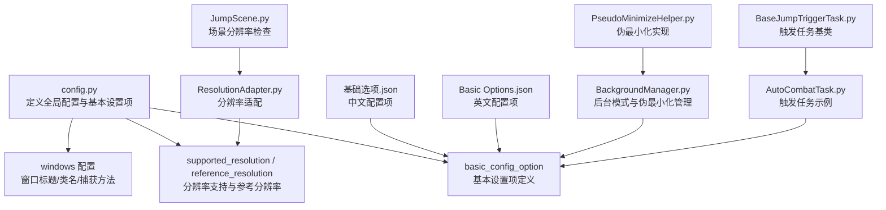
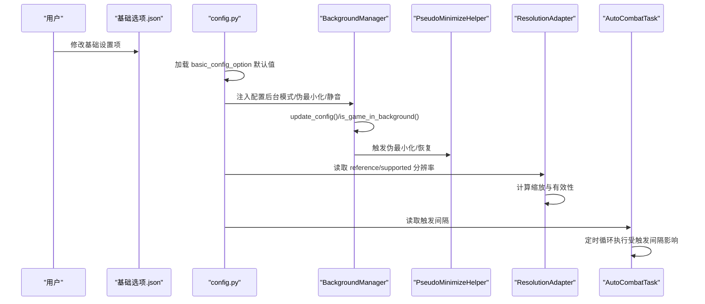
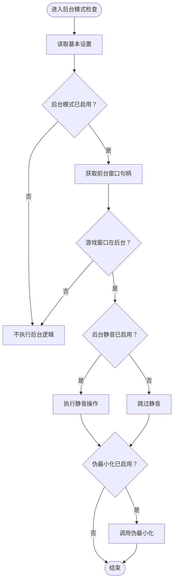
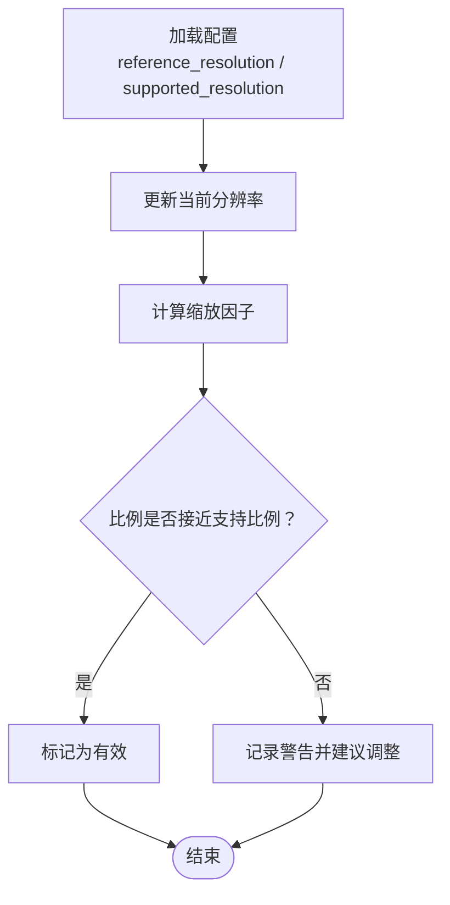
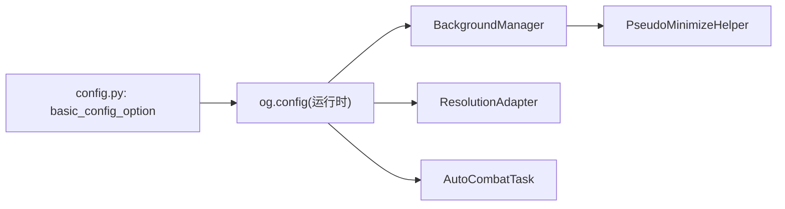

# 基础配置

<cite>
**本文引用的文件**
- [config.py](file://config.py)
- [Basic Options.json](file://configs/Basic Options.json)
- [基础选项.json](file://configs/基础选项.json)
- [BackgroundManager.py](file://src/utils/BackgroundManager.py)
- [PseudoMinimizeHelper.py](file://src/utils/PseudoMinimizeHelper.py)
- [ResolutionAdapter.py](file://src/utils/ResolutionAdapter.py)
- [JumpScene.py](file://src/scene/JumpScene.py)
- [AutoCombatTask.py](file://src/task/AutoCombatTask.py)
- [BaseJumpTriggerTask.py](file://src/task/BaseJumpTriggerTask.py)
- [main_window.json](file://configs/main_window.json)
- [ui_config.json](file://configs/ui_config.json)
</cite>

## 目录
1. [简介](#简介)
2. [项目结构](#项目结构)
3. [核心组件](#核心组件)
4. [架构总览](#架构总览)
5. [详细组件分析](#详细组件分析)
6. [依赖分析](#依赖分析)
7. [性能考虑](#性能考虑)
8. [故障排查指南](#故障排查指南)
9. [结论](#结论)
10. [附录](#附录)

## 简介
本章节面向“基础配置”模块，系统性阐述窗口管理、后台模式、触发间隔等关键配置项的设计理念、参数语义、数据类型与取值范围、验证与错误处理策略，并提供优化建议与常见问题排查方法。目标读者既包括一线使用者，也包括需要集成或二次开发的工程师。

## 项目结构
基础配置模块由“配置定义（Python）+ 多语言配置文件（JSON）+ 运行时管理器（Python）”三部分组成，贯穿于窗口管理、后台模式、分辨率适配与触发任务调度等环节。



图表来源
- [config.py:40-137](file://config.py#L40-L137)
- [基础选项.json:1-11](file://configs/基础选项.json#L1-L11)
- [Basic Options.json:1-13](file://configs/Basic Options.json#L1-L13)
- [BackgroundManager.py:1-144](file://src/utils/BackgroundManager.py#L1-L144)
- [PseudoMinimizeHelper.py:1-193](file://src/utils/PseudoMinimizeHelper.py#L1-L193)
- [ResolutionAdapter.py:1-43](file://src/utils/ResolutionAdapter.py#L1-L43)
- [JumpScene.py:197-215](file://src/scene/JumpScene.py#L197-L215)
- [AutoCombatTask.py:1-200](file://src/task/AutoCombatTask.py#L1-L200)
- [BaseJumpTriggerTask.py:1-30](file://src/task/BaseJumpTriggerTask.py#L1-L30)

章节来源
- [config.py:40-137](file://config.py#L40-L137)
- [基础选项.json:1-11](file://configs/基础选项.json#L1-L11)
- [Basic Options.json:1-13](file://configs/Basic Options.json#L1-L13)

## 核心组件
- 基本设置项定义（Python）：集中声明“基本设置”的键名、默认值、UI 类型与描述，形成统一的配置契约。
- 基本设置项文件（JSON）：提供多语言配置文件，承载用户实际修改后的持久化配置。
- 后台模式与伪最小化管理：根据基本设置动态控制窗口后台行为与音频静音。
- 分辨率适配与校验：依据配置中的参考分辨率与支持比例，进行缩放与有效性校验。
- 触发任务与触发间隔：触发型任务按“触发间隔”进行周期性检查与执行。

章节来源
- [config.py:40-63](file://config.py#L40-L63)
- [BackgroundManager.py:18-82](file://src/utils/BackgroundManager.py#L18-L82)
- [PseudoMinimizeHelper.py:78-148](file://src/utils/PseudoMinimizeHelper.py#L78-L148)
- [ResolutionAdapter.py:19-43](file://src/utils/ResolutionAdapter.py#L19-L43)
- [AutoCombatTask.py:65-107](file://src/task/AutoCombatTask.py#L65-L107)

## 架构总览
基础配置在运行时通过“配置读取—状态更新—行为执行”的闭环工作：



图表来源
- [config.py:40-63](file://config.py#L40-L63)
- [BackgroundManager.py:18-129](file://src/utils/BackgroundManager.py#L18-L129)
- [PseudoMinimizeHelper.py:78-164](file://src/utils/PseudoMinimizeHelper.py#L78-L164)
- [ResolutionAdapter.py:19-43](file://src/utils/ResolutionAdapter.py#L19-L43)
- [AutoCombatTask.py:147-198](file://src/task/AutoCombatTask.py#L147-L198)

## 详细组件分析

### 基本设置项定义与数据模型
- 键名与默认值
  - 关闭时最小化到系统托盘：布尔，默认关闭
  - 后台模式：布尔，默认开启
  - 最小化时伪最小化：布尔，默认开启
  - 后台时静音游戏：布尔，默认关闭
  - 自动调整游戏窗口大小：布尔，默认关闭
  - 游戏退出时关闭程序：布尔，默认关闭
  - 触发间隔：整数，单位毫秒，默认1
  - 启动/停止快捷键：字符串，枚举值来自下拉框，默认F9
- 数据类型与取值范围
  - 布尔：true/false
  - 整数：触发间隔建议≥1（毫秒），过大将导致响应迟滞
  - 字符串：快捷键限定在预设集合中
- UI 类型与描述
  - 快捷键采用下拉选择框，确保合法输入
  - 描述字段用于界面提示与帮助信息

章节来源
- [config.py:40-63](file://config.py#L40-L63)

### 配置文件映射与多语言支持
- 中文配置文件与英文配置文件分别维护相同键名，便于国际化展示
- 运行时从 JSON 文件读取用户实际配置，与 Python 默认值合并或覆盖

章节来源
- [基础选项.json:1-11](file://configs/基础选项.json#L1-L11)
- [Basic Options.json:1-13](file://configs/Basic Options.json#L1-L13)

### 后台模式与窗口管理
- 后台模式判定：通过前台窗口句柄对比，判断游戏窗口是否处于后台
- 伪最小化：当窗口最小化时，将其移动至屏幕外坐标，以支持后台截图与继续运行
- 静音控制：后台时根据配置自动静音
- 自动伪最小化：在后台模式开启时，对最小化事件进行响应



图表来源
- [BackgroundManager.py:36-129](file://src/utils/BackgroundManager.py#L36-L129)
- [PseudoMinimizeHelper.py:78-164](file://src/utils/PseudoMinimizeHelper.py#L78-L164)

章节来源
- [BackgroundManager.py:18-129](file://src/utils/BackgroundManager.py#L18-L129)
- [PseudoMinimizeHelper.py:78-164](file://src/utils/PseudoMinimizeHelper.py#L78-L164)

### 分辨率适配与校验
- 参考分辨率与支持比例：从配置读取参考宽高与支持比例（如16:9）
- 当前分辨率更新：计算缩放因子与比例一致性
- 场景层警告：若当前分辨率非支持比例，记录日志并给出推荐尺寸



图表来源
- [ResolutionAdapter.py:19-43](file://src/utils/ResolutionAdapter.py#L19-L43)
- [JumpScene.py:197-215](file://src/scene/JumpScene.py#L197-L215)

章节来源
- [ResolutionAdapter.py:19-43](file://src/utils/ResolutionAdapter.py#L19-L43)
- [JumpScene.py:197-215](file://src/scene/JumpScene.py#L197-L215)

### 触发间隔与任务调度
- 触发间隔：单位毫秒，用于触发型任务的轮询节拍
- AutoCombatTask 示例：主循环中按固定节奏执行检测与处理
- 性能权衡：增大间隔可降低CPU/GPU占用，但会增加响应延迟

```mermaid
sequenceDiagram
participant T as "触发任务(AutoCombatTask)"
participant Cfg as "基本设置(触发间隔)"
participant Loop as "主循环"
T->>Cfg : 读取触发间隔(ms)
loop 每个触发间隔
T->>Loop : 执行一次检测/处理
Loop-->>T : 返回状态
end
```

图表来源
- [AutoCombatTask.py:147-198](file://src/task/AutoCombatTask.py#L147-L198)
- [config.py:49](file://config.py#L49)

章节来源
- [AutoCombatTask.py:65-107](file://src/task/AutoCombatTask.py#L65-L107)
- [AutoCombatTask.py:147-198](file://src/task/AutoCombatTask.py#L147-L198)
- [config.py:49](file://config.py#L49)

## 依赖分析
- 配置来源与耦合
  - Python 层定义的 basic_config_option 与 JSON 层的“基础选项.json/Basic Options.json”双向映射
  - 运行时通过 og.config 获取配置，BackgroundManager 与 ResolutionAdapter 依赖该通道
- 组件内聚与解耦
  - BackgroundManager 与 PseudoMinimizeHelper 解耦，前者负责策略与状态，后者负责具体窗口操作
  - AutoCombatTask 仅依赖触发间隔配置，不直接耦合窗口管理细节



图表来源
- [config.py:40-63](file://config.py#L40-L63)
- [BackgroundManager.py:25-31](file://src/utils/BackgroundManager.py#L25-L31)
- [ResolutionAdapter.py:20-27](file://src/utils/ResolutionAdapter.py#L20-L27)
- [AutoCombatTask.py:147-198](file://src/task/AutoCombatTask.py#L147-L198)

章节来源
- [config.py:40-63](file://config.py#L40-L63)
- [BackgroundManager.py:25-31](file://src/utils/BackgroundManager.py#L25-L31)
- [ResolutionAdapter.py:20-27](file://src/utils/ResolutionAdapter.py#L20-L27)
- [AutoCombatTask.py:147-198](file://src/task/AutoCombatTask.py#L147-L198)

## 性能考虑
- 触发间隔调优
  - CPU/GPU 占用与响应速度的平衡：数值越大，占用越低，但交互越迟钝
  - 建议从默认值起步，结合实际场景逐步增大
- 后台模式与伪最小化
  - 后台模式开启时，建议启用“后台时静音游戏”，避免音频回环与系统资源浪费
  - “最小化时伪最小化”可提升后台截图稳定性，但需注意窗口位置保存与恢复
- 分辨率与缩放
  - 保持 16:9 比例与推荐分辨率，减少算法误判与重采样开销
  - 若必须使用非标准分辨率，优先选择接近参考分辨率的尺寸

章节来源
- [config.py:59](file://config.py#L59)
- [BackgroundManager.py:67-70](file://src/utils/BackgroundManager.py#L67-L70)
- [JumpScene.py:206-215](file://src/scene/JumpScene.py#L206-L215)

## 故障排查指南
- 后台模式无效
  - 确认“后台模式”已启用；检查前台窗口句柄获取是否成功
  - 若窗口未被正确识别，请确认游戏窗口类名与标题匹配
- 伪最小化失败
  - 检查窗口句柄是否已设置；查看窗口是否处于最小化状态
  - 若窗口位于屏幕外，尝试先恢复再伪最小化
- 静音未生效
  - 确认“后台时静音游戏”已启用；检查系统音频设备状态
- 触发任务过于频繁或卡顿
  - 调整“触发间隔”；适当增大可降低资源占用
- 分辨率告警
  - 日志提示当前分辨率非 16:9 比例时，建议调整为推荐尺寸
- 快捷键冲突
  - 更换“启动/停止快捷键”为未被系统或其他应用占用的组合

章节来源
- [BackgroundManager.py:36-129](file://src/utils/BackgroundManager.py#L36-L129)
- [PseudoMinimizeHelper.py:78-164](file://src/utils/PseudoMinimizeHelper.py#L78-L164)
- [JumpScene.py:206-215](file://src/scene/JumpScene.py#L206-L215)
- [config.py:52-54](file://config.py#L52-L54)

## 结论
基础配置模块通过清晰的键名、默认值与描述，配合运行时的后台模式、伪最小化与分辨率适配能力，实现了稳定可靠的自动化执行环境。合理设置触发间隔与窗口管理策略，可在性能与体验之间取得最佳平衡。

## 附录
- 配置文件位置
  - 中文基础设置：configs/基础选项.json
  - 英文基础设置：configs/Basic Options.json
  - 主窗口版本：configs/main_window.json
  - UI 配置：configs/ui_config.json
- 相关任务与场景
  - 触发任务基类：src/task/BaseJumpTriggerTask.py
  - 自动战斗任务：src/task/AutoCombatTask.py
  - 场景分辨率检查：src/scene/JumpScene.py

章节来源
- [main_window.json:1-3](file://configs/main_window.json#L1-L3)
- [ui_config.json:1-17](file://configs/ui_config.json#L1-L17)
- [BaseJumpTriggerTask.py:1-30](file://src/task/BaseJumpTriggerTask.py#L1-L30)
- [AutoCombatTask.py:1-200](file://src/task/AutoCombatTask.py#L1-L200)
- [JumpScene.py:197-215](file://src/scene/JumpScene.py#L197-L215)