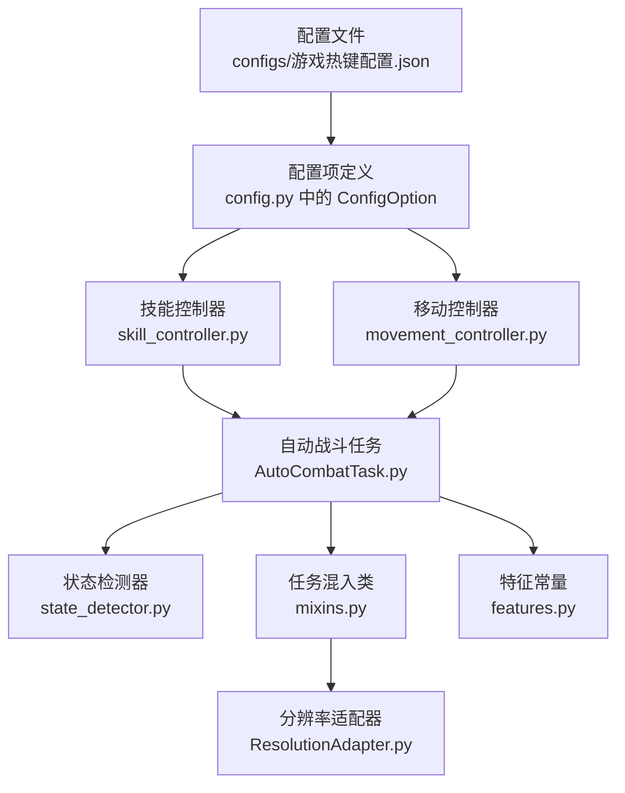
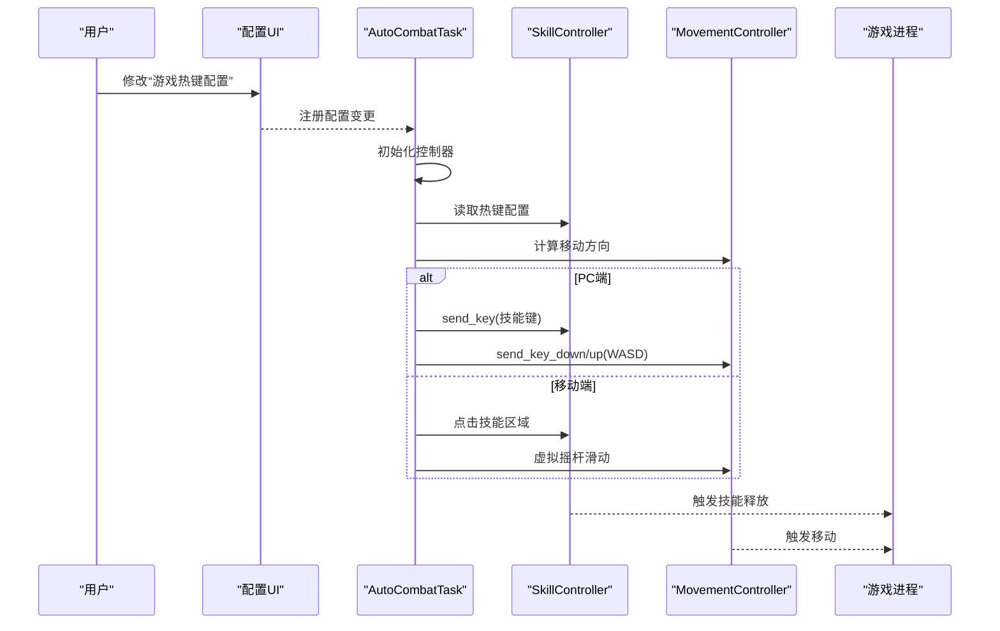
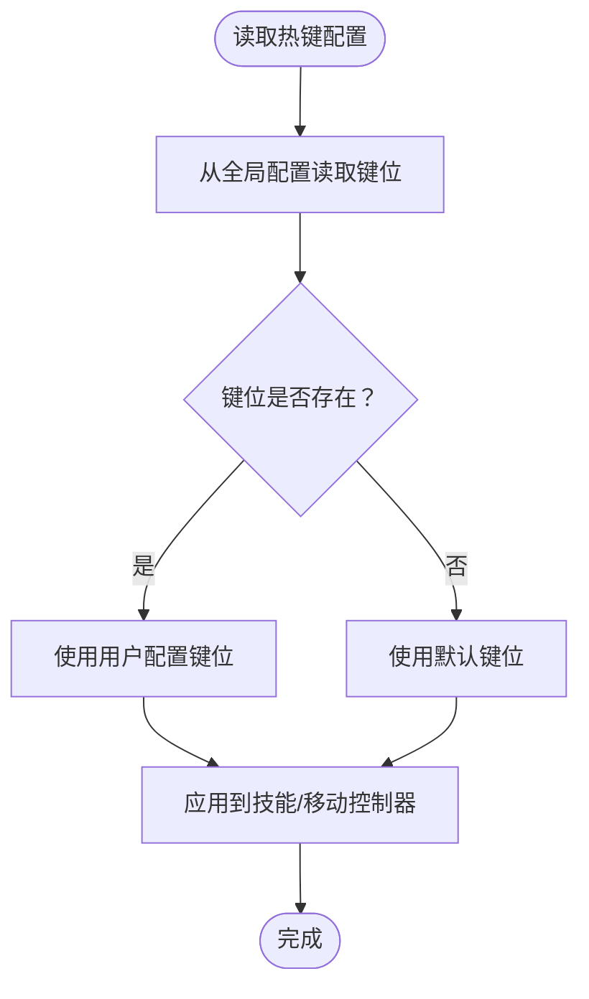
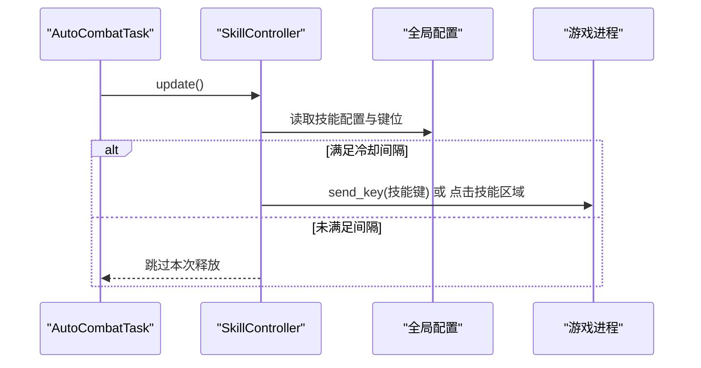
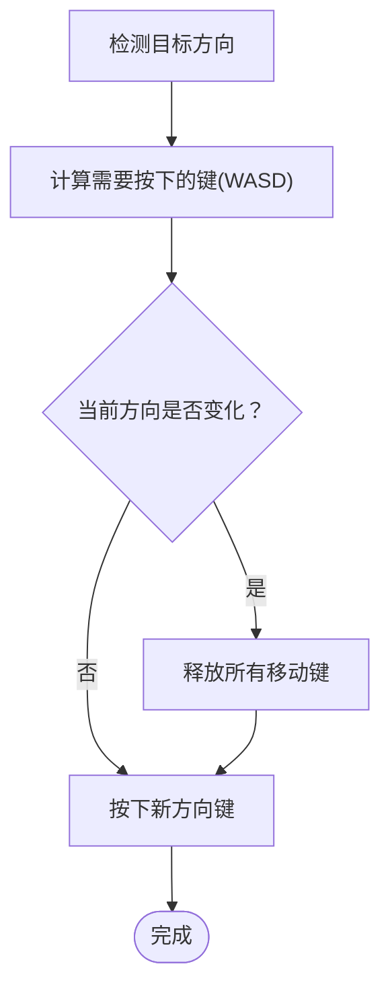
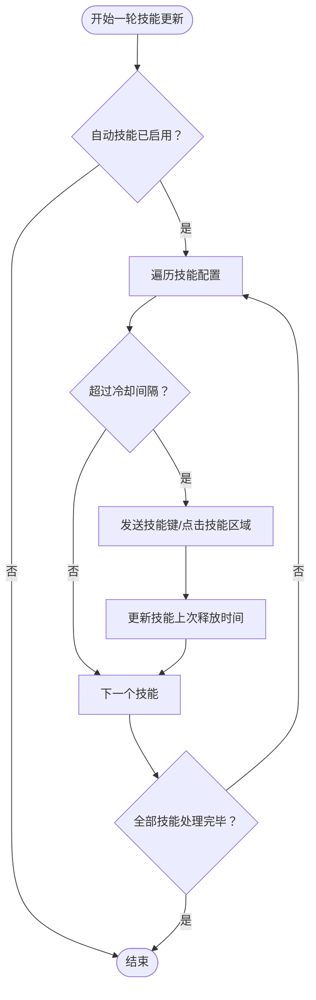
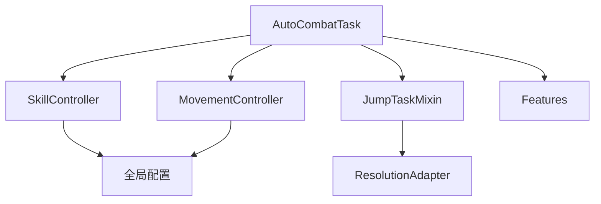

# 游戏热键配置

<cite>
**本文引用的文件**
- [config.py](file://config.py)
- [游戏热键配置.json](file://configs/游戏热键配置.json)
- [skill_controller.py](file://src/combat/skill_controller.py)
- [movement_controller.py](file://src/combat/movement_controller.py)
- [AutoCombatTask.py](file://src/task/AutoCombatTask.py)
- [state_detector.py](file://src/combat/state_detector.py)
- [mixins.py](file://src/task/mixins.py)
- [ResolutionAdapter.py](file://src/utils/ResolutionAdapter.py)
- [features.py](file://src/constants/features.py)
</cite>

## 目录
1. [简介](#简介)
2. [项目结构](#项目结构)
3. [核心组件](#核心组件)
4. [架构总览](#架构总览)
5. [详细组件分析](#详细组件分析)
6. [依赖分析](#依赖分析)
7. [性能考虑](#性能考虑)
8. [故障排查指南](#故障排查指南)
9. [结论](#结论)
10. [附录](#附录)

## 简介
本技术文档围绕“游戏热键配置”模块展开，系统性阐述热键配置的结构设计、按键映射机制、普通攻击、技能释放、大招等按键绑定的实现原理，并给出热键冲突检测与避免策略、热键自定义与扩展的技术指导，以及最佳实践与用户体验优化建议。读者无需深入编程背景即可理解热键系统的运作方式。

## 项目结构
热键配置模块由“配置文件 + 配置项定义 + 控制器读取 + 任务调度”四部分组成：
- 配置文件：以 JSON 存储默认热键映射，便于用户修改。
- 配置项定义：在 Python 中以 ConfigOption 声明热键配置项及其描述与图标。
- 控制器读取：技能控制器从全局配置读取热键，PC 端通过键盘模拟发送按键，移动端通过虚拟点击实现。
- 任务调度：自动战斗任务在合适时机调用控制器执行技能释放与移动。

**图表来源**
- [config.py:23-38](file://config.py#L23-L38)
- [游戏热键配置.json:1-6](file://configs/游戏热键配置.json#L1-L6)
- [skill_controller.py:12-181](file://src/combat/skill_controller.py#L12-L181)
- [movement_controller.py:11-223](file://src/combat/movement_controller.py#L11-L223)
- [AutoCombatTask.py:25-431](file://src/task/AutoCombatTask.py#L25-L431)
- [state_detector.py:23-315](file://src/combat/state_detector.py#L23-L315)
- [mixins.py:12-301](file://src/task/mixins.py#L12-L301)
- [ResolutionAdapter.py:4-43](file://src/utils/ResolutionAdapter.py#L4-L43)
- [features.py:9-86](file://src/constants/features.py#L9-L86)

**章节来源**
- [config.py:23-38](file://config.py#L23-L38)
- [游戏热键配置.json:1-6](file://configs/游戏热键配置.json#L1-L6)
- [skill_controller.py:12-181](file://src/combat/skill_controller.py#L12-L181)
- [movement_controller.py:11-223](file://src/combat/movement_controller.py#L11-L223)
- [AutoCombatTask.py:25-431](file://src/task/AutoCombatTask.py#L25-L431)
- [state_detector.py:23-315](file://src/combat/state_detector.py#L23-L315)
- [mixins.py:12-301](file://src/task/mixins.py#L12-L301)
- [ResolutionAdapter.py:4-43](file://src/utils/ResolutionAdapter.py#L4-L43)
- [features.py:9-86](file://src/constants/features.py#L9-L86)

## 核心组件
- 配置项定义（ConfigOption）
  - 在 config.py 中声明“游戏热键配置”，包含普通攻击、技能1、技能2、大招四个键位，默认值与描述。
  - 该配置项通过框架注册，可在 UI 中展示与编辑。
- 配置文件（JSON）
  - configs/游戏热键配置.json 提供默认热键映射，便于用户直接修改。
- 技能控制器（SkillController）
  - 从全局配置读取热键，PC 端通过 send_key 发送按键；移动端通过虚拟点击对应技能区域。
  - 支持自动技能释放与冷却控制。
- 移动控制器（MovementController）
  - PC 端使用 WASD 键位控制移动；移动端使用虚拟摇杆。
  - 提供方向计算与按键按下/抬起的统一接口。
- 自动战斗任务（AutoCombatTask）
  - 调度状态检测、移动与技能释放，依据战场状态决定是否启用自动技能。
- 状态检测器（StateDetector）
  - 基于 YOLO 检测自身、友方、敌方与死亡状态，为自动战斗提供决策依据。
- 任务混入类（JumpTaskMixin）
  - 提供分辨率适配、后台模式、日志封装等通用能力，间接影响热键执行环境。
- 分辨率适配器（ResolutionAdapter）
  - 统一分辨率缩放，保证移动端点击与 PC 端按键在不同分辨率下稳定工作。
- 特征常量（Features）
  - 统一管理场景检测特征名称，确保任务在正确场景下执行热键操作。

**章节来源**
- [config.py:23-38](file://config.py#L23-L38)
- [游戏热键配置.json:1-6](file://configs/游戏热键配置.json#L1-L6)
- [skill_controller.py:12-181](file://src/combat/skill_controller.py#L12-L181)
- [movement_controller.py:11-223](file://src/combat/movement_controller.py#L11-L223)
- [AutoCombatTask.py:25-431](file://src/task/AutoCombatTask.py#L25-L431)
- [state_detector.py:23-315](file://src/combat/state_detector.py#L23-L315)
- [mixins.py:12-301](file://src/task/mixins.py#L12-L301)
- [ResolutionAdapter.py:4-43](file://src/utils/ResolutionAdapter.py#L4-L43)
- [features.py:9-86](file://src/constants/features.py#L9-L86)

## 架构总览
热键配置的执行链路如下：
- 用户在 UI 中修改“游戏热键配置”。
- AutoCombatTask 初始化控制器（技能/移动），并在主循环中根据状态检测结果调用控制器。
- 技能控制器从全局配置读取键位，PC 端通过 send_key 发送按键，移动端通过虚拟点击。
- 移动控制器根据目标位置计算方向，PC 端发送 WASD 键，移动端通过虚拟摇杆滑动。
- 任务混入类负责分辨率适配与后台模式，间接影响热键执行的稳定性。

**图表来源**
- [config.py:23-38](file://config.py#L23-L38)
- [AutoCombatTask.py:115-125](file://src/task/AutoCombatTask.py#L115-L125)
- [skill_controller.py:104-138](file://src/combat/skill_controller.py#L104-L138)
- [movement_controller.py:143-169](file://src/combat/movement_controller.py#L143-L169)

**章节来源**
- [config.py:23-38](file://config.py#L23-L38)
- [AutoCombatTask.py:115-125](file://src/task/AutoCombatTask.py#L115-L125)
- [skill_controller.py:104-138](file://src/combat/skill_controller.py#L104-L138)
- [movement_controller.py:143-169](file://src/combat/movement_controller.py#L143-L169)

## 详细组件分析

### 配置结构与读取机制
- 配置项定义
  - 通过 ConfigOption 声明“游戏热键配置”，包含键位名称与默认值，同时提供描述与图标，便于在 UI 中展示。
- 配置文件
  - JSON 文件提供默认热键映射，字段包括普通攻击、技能1、技能2、大招。
- 控制器读取
  - 技能控制器通过全局配置读取键位，若未设置则回退到默认值。
  - 移动控制器在 PC 端使用预设 WASD 键位，不依赖用户自定义。

**图表来源**
- [config.py:23-38](file://config.py#L23-L38)
- [skill_controller.py:140-151](file://src/combat/skill_controller.py#L140-L151)
- [movement_controller.py:20-24](file://src/combat/movement_controller.py#L20-L24)

**章节来源**
- [config.py:23-38](file://config.py#L23-L38)
- [游戏热键配置.json:1-6](file://configs/游戏热键配置.json#L1-L6)
- [skill_controller.py:140-151](file://src/combat/skill_controller.py#L140-L151)
- [movement_controller.py:20-24](file://src/combat/movement_controller.py#L20-L24)

### 普通攻击、技能释放、大招绑定实现
- 普通攻击
  - PC 端：从配置读取键位后通过 send_key 发送按键。
  - 移动端：点击技能区域（相对坐标）。
- 技能1/技能2/大招
  - 与普通攻击类似，分别读取对应键位或点击对应技能区域。
  - 控制器内部维护各技能的冷却时间戳，按配置间隔自动释放。

**图表来源**
- [AutoCombatTask.py:370-382](file://src/task/AutoCombatTask.py#L370-L382)
- [skill_controller.py:65-102](file://src/combat/skill_controller.py#L65-L102)
- [skill_controller.py:104-138](file://src/combat/skill_controller.py#L104-L138)

**章节来源**
- [AutoCombatTask.py:370-382](file://src/task/AutoCombatTask.py#L370-L382)
- [skill_controller.py:65-102](file://src/combat/skill_controller.py#L65-L102)
- [skill_controller.py:104-138](file://src/combat/skill_controller.py#L104-L138)

### 移动控制与热键协同
- PC 端移动
  - 根据目标方向计算需要按下的键（WASD），先释放旧方向键再按下新方向键，避免键位冲突。
- 移动端移动
  - 使用虚拟摇杆，根据目标位置计算滑动方向与距离，避免与技能键位冲突。

**图表来源**
- [movement_controller.py:170-223](file://src/combat/movement_controller.py#L170-L223)

**章节来源**
- [movement_controller.py:170-223](file://src/combat/movement_controller.py#L170-L223)

### 热键冲突检测与避免策略
- 键位冲突避免
  - 移动控制在切换方向前会先释放所有移动键，防止同时按下多个方向键导致的冲突。
  - 技能释放与移动控制分别独立执行，避免在同一时刻同时触发多个动作。
- 冷却与节流
  - 技能控制器维护各技能上次释放时间戳，按配置间隔限制释放频率。
  - 自动战斗主循环中对技能释放进行条件判断，仅在满足距离与状态条件下才释放。
- 分辨率与后台模式
  - 通过分辨率适配与后台模式，确保热键在不同环境下稳定执行，减少误触与无效操作。

**图表来源**
- [skill_controller.py:65-102](file://src/combat/skill_controller.py#L65-L102)

**章节来源**
- [movement_controller.py:206-223](file://src/combat/movement_controller.py#L206-L223)
- [skill_controller.py:65-102](file://src/combat/skill_controller.py#L65-L102)
- [AutoCombatTask.py:370-382](file://src/task/AutoCombatTask.py#L370-L382)

### 热键自定义与扩展技术指导
- 自定义步骤
  - 在 UI 中修改“游戏热键配置”，或直接编辑 configs/游戏热键配置.json。
  - 新增键位时，需在配置项定义中添加对应键位名称与默认值。
- 扩展建议
  - 新增技能键位时，同步在技能控制器中添加对应的 do_skillX 方法与冷却控制。
  - 移动端新增技能时，补充相对坐标以保证点击准确性。
  - 为避免冲突，建议为不同功能分配不相邻的键位（例如将攻击与技能分散开）。

**章节来源**
- [config.py:23-38](file://config.py#L23-L38)
- [游戏热键配置.json:1-6](file://configs/游戏热键配置.json#L1-L6)
- [skill_controller.py:12-181](file://src/combat/skill_controller.py#L12-L181)

### 最佳实践与用户体验优化
- 键位布局
  - 攻击键与技能键尽量分布在不同手区，减少误触概率。
  - 大招键建议与常用技能键分离，避免连点时误触。
- 冷却与节奏
  - 合理设置技能间隔，避免频繁释放导致资源不足或判定异常。
  - 在复杂场景下适当提高技能间隔，提升稳定性。
- 环境适配
  - 使用分辨率适配与后台模式，确保热键在不同分辨率与窗口状态下稳定工作。
  - 在移动端使用虚拟摇杆时，注意摇杆半径与滑动精度，避免误触。

**章节来源**
- [mixins.py:120-143](file://src/task/mixins.py#L120-L143)
- [ResolutionAdapter.py:34-43](file://src/utils/ResolutionAdapter.py#L34-L43)
- [skill_controller.py:74-102](file://src/combat/skill_controller.py#L74-L102)

## 依赖分析
- 组件耦合
  - AutoCombatTask 依赖 SkillController 与 MovementController，二者均依赖全局配置读取键位。
  - SkillController 与 MovementController 与任务混入类解耦，通过任务提供的接口进行交互。
- 外部依赖
  - 分辨率适配器与后台管理器通过混入类注入，间接影响热键执行环境。
  - 特征常量用于场景检测，确保热键在正确场景下执行。

**图表来源**
- [AutoCombatTask.py:115-125](file://src/task/AutoCombatTask.py#L115-L125)
- [skill_controller.py:12-181](file://src/combat/skill_controller.py#L12-L181)
- [movement_controller.py:11-223](file://src/combat/movement_controller.py#L11-L223)
- [mixins.py:12-301](file://src/task/mixins.py#L12-L301)
- [ResolutionAdapter.py:4-43](file://src/utils/ResolutionAdapter.py#L4-L43)
- [features.py:9-86](file://src/constants/features.py#L9-L86)

**章节来源**
- [AutoCombatTask.py:115-125](file://src/task/AutoCombatTask.py#L115-L125)
- [skill_controller.py:12-181](file://src/combat/skill_controller.py#L12-L181)
- [movement_controller.py:11-223](file://src/combat/movement_controller.py#L11-L223)
- [mixins.py:12-301](file://src/task/mixins.py#L12-L301)
- [ResolutionAdapter.py:4-43](file://src/utils/ResolutionAdapter.py#L4-L43)
- [features.py:9-86](file://src/constants/features.py#L9-L86)

## 性能考虑
- 技能释放频率
  - 合理设置技能间隔，避免过高频率导致 CPU/GPU 占用上升。
- 移动控制
  - 移动键释放与按下采用差量更新，减少不必要的键盘事件。
- 分辨率与后台
  - 启用后台模式与分辨率适配可减少因窗口状态变化导致的无效操作与重试。

[本节为通用建议，无需具体文件分析]

## 故障排查指南
- 热键无效
  - 检查 UI 中“游戏热键配置”是否正确保存。
  - 确认任务处于正确场景（通过状态检测器确认自身、友方、敌方与死亡状态）。
- 键位冲突
  - 观察移动控制是否在切换方向时释放了旧键。
  - 检查技能冷却时间戳是否被意外重置。
- 移动端点击不准确
  - 检查分辨率适配与坐标缩放是否生效。
  - 确认虚拟摇杆半径与目标位置计算是否合理。

**章节来源**
- [state_detector.py:62-103](file://src/combat/state_detector.py#L62-L103)
- [movement_controller.py:161-169](file://src/combat/movement_controller.py#L161-L169)
- [skill_controller.py:175-181](file://src/combat/skill_controller.py#L175-L181)
- [mixins.py:120-143](file://src/task/mixins.py#L120-L143)

## 结论
热键配置模块通过清晰的配置结构、稳定的控制器实现与完善的任务调度，实现了普通攻击、技能释放与大招的灵活绑定。配合冲突避免策略、冷却控制与环境适配，能够在不同平台与分辨率下稳定运行。建议在实际使用中遵循最佳实践，合理分配键位、设置技能间隔，并结合场景检测确保热键在正确时机执行，从而获得更佳的自动化体验。

[本节为总结性内容，无需具体文件分析]

## 附录
- 相关文件路径
  - 配置项定义：[config.py:23-38](file://config.py#L23-L38)
  - 配置文件：[configs/游戏热键配置.json:1-6](file://configs/游戏热键配置.json#L1-L6)
  - 技能控制器：[src/combat/skill_controller.py:12-181](file://src/combat/skill_controller.py#L12-L181)
  - 移动控制器：[src/combat/movement_controller.py:11-223](file://src/combat/movement_controller.py#L11-L223)
  - 自动战斗任务：[src/task/AutoCombatTask.py:25-431](file://src/task/AutoCombatTask.py#L25-L431)
  - 状态检测器：[src/combat/state_detector.py:23-315](file://src/combat/state_detector.py#L23-L315)
  - 任务混入类：[src/task/mixins.py:12-301](file://src/task/mixins.py#L12-L301)
  - 分辨率适配器：[src/utils/ResolutionAdapter.py:4-43](file://src/utils/ResolutionAdapter.py#L4-L43)
  - 特征常量：[src/constants/features.py:9-86](file://src/constants/features.py#L9-L86)

[本节为索引性内容，无需具体文件分析]