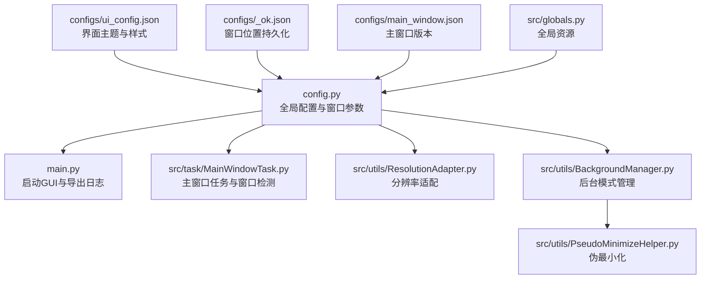
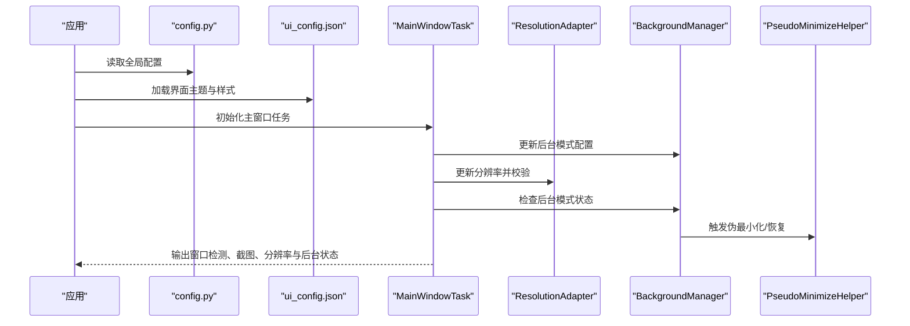
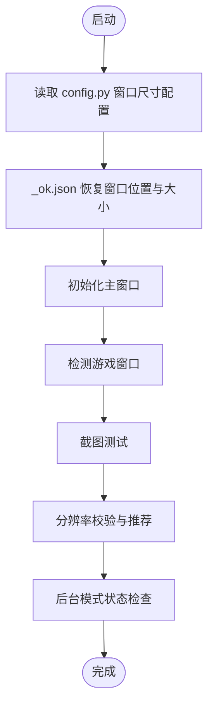
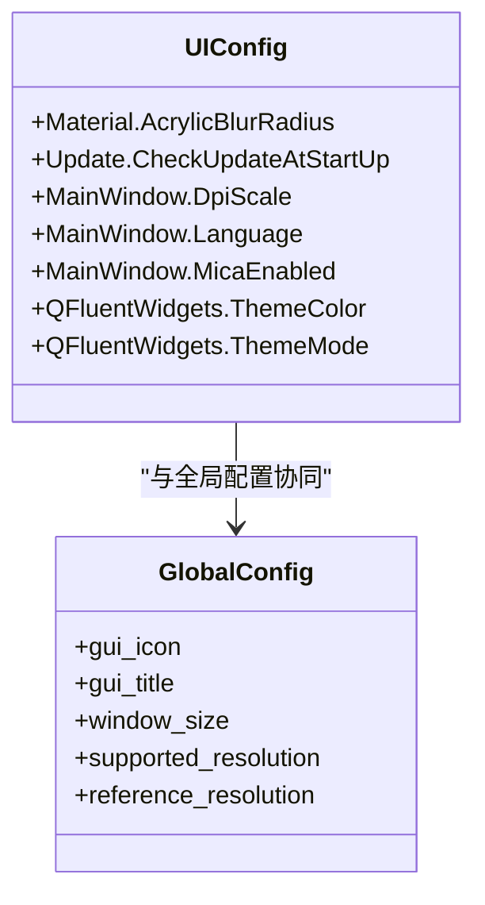
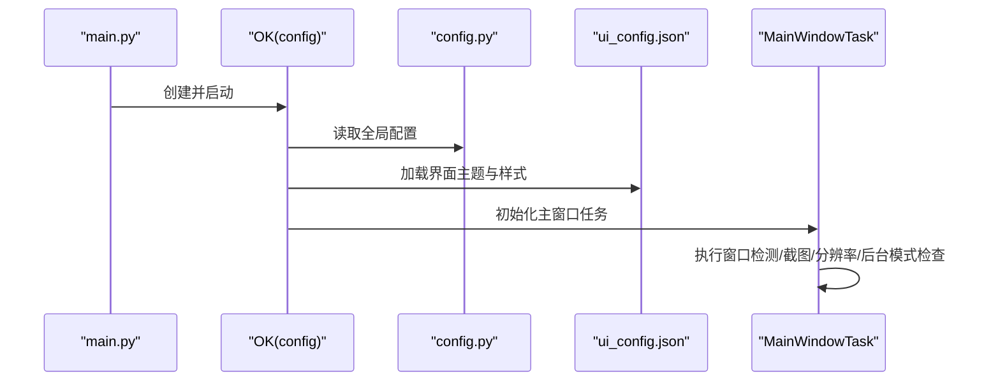
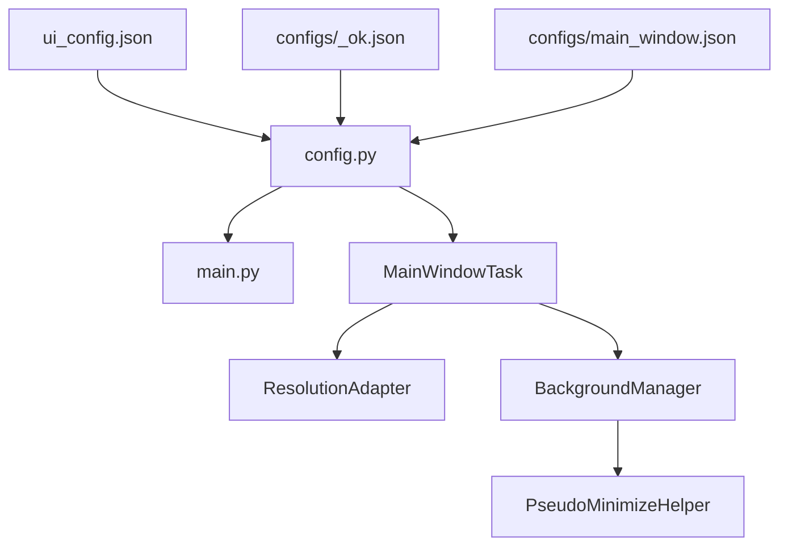

# 界面配置

<cite>
**本文引用的文件**
- [config.py](file://config.py)
- [main.py](file://main.py)
- [src/tas/MainWindowTask.py](file://src/task/MainWindowTask.py)
- [src/utils/BackgroundManager.py](file://src/utils/BackgroundManager.py)
- [src/utils/PseudoMinimizeHelper.py](file://src/utils/PseudoMinimizeHelper.py)
- [src/utils/ResolutionAdapter.py](file://src/utils/ResolutionAdapter.py)
- [src/globals.py](file://src/globals.py)
- [configs/ui_config.json](file://configs/ui_config.json)
- [configs/main_window.json](file://configs/main_window.json)
- [configs/_ok.json](file://configs/_ok.json)
- [configs/基础选项.json](file://configs/基础选项.json)
- [configs/Basic Options.json](file://configs/Basic Options.json)
</cite>

## 目录
1. [简介](#简介)
2. [项目结构](#项目结构)
3. [核心组件](#核心组件)
4. [架构总览](#架构总览)
5. [详细组件分析](#详细组件分析)
6. [依赖分析](#依赖分析)
7. [性能考虑](#性能考虑)
8. [故障排查指南](#故障排查指南)
9. [结论](#结论)
10. [附录](#附录)

## 简介
本文件面向“界面配置模块”的技术文档，聚焦于主窗口配置与 UI 元素布局设置、界面主题与样式配置、配置文件的加载与应用流程，以及界面定制与扩展的技术指导。同时提供性能优化与用户体验改进建议，帮助开发者与使用者高效地理解与维护界面配置体系。

## 项目结构
界面配置相关的核心位置包括：
- 配置定义与入口：config.py 定义全局配置、窗口尺寸、主题与语言等；main.py 启动 GUI 并注册导出日志能力。
- 主窗口任务：src/task/MainWindowTask.py 提供主窗口功能索引与窗口检测、截图、分辨率与后台模式检查。
- 界面主题与样式：configs/ui_config.json 提供 Material、更新、主窗口 DPI/语言/Mica、QFluentWidgets 主题色与明暗模式等配置项。
- 分辨率适配：src/utils/ResolutionAdapter.py 根据参考分辨率与支持比例进行坐标/区域缩放，并给出推荐分辨率。
- 后台模式与伪最小化：src/utils/BackgroundManager.py 与 src/utils/PseudoMinimizeHelper.py 协助在后台运行时维持可见性与音频静音。
- 全局状态与资源：src/globals.py 提供全局资源访问接口，便于在界面层按需调用。
- 窗口位置持久化：configs/_ok.json 记录上次主窗口位置与最大化状态；configs/main_window.json 记录版本信息。

图表来源
- [config.py:65-141](file://config.py#L65-L141)
- [main.py:30-33](file://main.py#L30-L33)
- [src/task/MainWindowTask.py:49-80](file://src/task/MainWindowTask.py#L49-L80)
- [src/utils/ResolutionAdapter.py:19-44](file://src/utils/ResolutionAdapter.py#L19-L44)
- [src/utils/BackgroundManager.py:18-23](file://src/utils/BackgroundManager.py#L18-L23)
- [src/utils/PseudoMinimizeHelper.py:21-26](file://src/utils/PseudoMinimizeHelper.py#L21-L26)
- [configs/ui_config.json:1-17](file://configs/ui_config.json#L1-L17)
- [configs/_ok.json:1-7](file://configs/_ok.json#L1-L7)
- [configs/main_window.json:1-3](file://configs/main_window.json#L1-L3)
- [src/globals.py:43-46](file://src/globals.py#L43-L46)

章节来源
- [config.py:65-141](file://config.py#L65-L141)
- [main.py:30-33](file://main.py#L30-L33)
- [configs/ui_config.json:1-17](file://configs/ui_config.json#L1-L17)
- [configs/_ok.json:1-7](file://configs/_ok.json#L1-L7)
- [configs/main_window.json:1-3](file://configs/main_window.json#L1-L3)

## 核心组件
- 全局配置中心：集中定义 GUI 标题、图标、窗口尺寸、日志路径、OCR/模板匹配参数、窗口标题与捕获方法、ADB 包名、分辨率支持策略、参考分辨率、窗口大小与最小尺寸等。
- 主窗口任务：负责打印功能索引、检测游戏窗口、截图测试、分辨率校验与推荐、后台模式状态检查与提示。
- 分辨率适配器：根据参考分辨率与支持比例计算缩放因子，提供坐标/区域缩放与相对坐标转换，输出推荐分辨率。
- 后台管理模式：基于前台窗口句柄判断游戏是否在后台，决定是否静音与伪最小化策略。
- 伪最小化助手：将窗口移动至虚拟不可见位置以支持后台截图，同时保存原始位置以便恢复。
- 界面主题与样式：通过 ui_config.json 控制 Material 模糊半径、更新检查、主窗口 DPI/语言/Mica、QFluentWidgets 主题色与明暗模式。
- 窗口位置持久化：_ok.json 记录上次主窗口位置、宽高与最大化状态；main_window.json 记录主窗口版本信息。

章节来源
- [config.py:65-141](file://config.py#L65-L141)
- [src/task/MainWindowTask.py:49-80](file://src/task/MainWindowTask.py#L49-L80)
- [src/utils/ResolutionAdapter.py:34-44](file://src/utils/ResolutionAdapter.py#L34-L44)
- [src/utils/BackgroundManager.py:33-34](file://src/utils/BackgroundManager.py#L33-L34)
- [src/utils/PseudoMinimizeHelper.py:78-114](file://src/utils/PseudoMinimizeHelper.py#L78-L114)
- [configs/ui_config.json:1-17](file://configs/ui_config.json#L1-L17)
- [configs/_ok.json:1-7](file://configs/_ok.json#L1-L7)
- [configs/main_window.json:1-3](file://configs/main_window.json#L1-L3)

## 架构总览
界面配置的总体流程如下：
- 应用启动时读取 config.py 中的全局配置，初始化 GUI 标题、图标、窗口尺寸、日志路径等。
- 从 configs/ui_config.json 加载界面主题、语言、DPI、Mica 与 QFluentWidgets 主题色/明暗模式。
- 主窗口任务在运行时检测游戏窗口、截图、校验分辨率并报告后台模式状态。
- 分辨率适配器根据参考分辨率与支持比例进行缩放，提供推荐分辨率。
- 后台管理模式与伪最小化助手协同工作，确保后台截图与静音需求得到满足。
- 窗口位置持久化由 _ok.json 维护，主窗口版本由 main_window.json 维护。

图表来源
- [config.py:65-141](file://config.py#L65-L141)
- [configs/ui_config.json:1-17](file://configs/ui_config.json#L1-L17)
- [src/task/MainWindowTask.py:121-196](file://src/task/MainWindowTask.py#L121-L196)
- [src/utils/ResolutionAdapter.py:34-44](file://src/utils/ResolutionAdapter.py#L34-L44)
- [src/utils/BackgroundManager.py:18-23](file://src/utils/BackgroundManager.py#L18-L23)
- [src/utils/PseudoMinimizeHelper.py:100-114](file://src/utils/PseudoMinimizeHelper.py#L100-L114)

## 详细组件分析

### 主窗口配置与 UI 元素布局
- 主窗口尺寸与最小尺寸：在 config.py 的 window_size 中定义默认宽高与最小宽高，用于约束主窗口初始尺寸与最小化行为。
- 窗口位置持久化：_ok.json 记录上次窗口位置、宽高与最大化状态，启动时可用于恢复窗口位置。
- 主窗口版本：main_window.json 记录 last_version，用于版本迁移或兼容性判断。
- 主窗口任务：MainWindowTask 在运行时检测游戏窗口、截图、校验分辨率并报告后台模式状态，便于用户了解当前运行环境。

图表来源
- [config.py:112-117](file://config.py#L112-L117)
- [configs/_ok.json:1-7](file://configs/_ok.json#L1-L7)
- [configs/main_window.json:1-3](file://configs/main_window.json#L1-L3)
- [src/task/MainWindowTask.py:121-196](file://src/task/MainWindowTask.py#L121-L196)

章节来源
- [config.py:112-117](file://config.py#L112-L117)
- [configs/_ok.json:1-7](file://configs/_ok.json#L1-L7)
- [configs/main_window.json:1-3](file://configs/main_window.json#L1-L3)
- [src/task/MainWindowTask.py:121-196](file://src/task/MainWindowTask.py#L121-L196)

### 界面主题、图标与样式配置
- 界面主题与样式：ui_config.json 提供 Material 模糊半径、更新检查、主窗口 DPI/语言/Mica、QFluentWidgets 主题色与明暗模式等配置项，直接影响界面外观与交互体验。
- 图标与标题：config.py 中 gui_icon 与 gui_title 决定 GUI 的图标与标题，影响用户第一印象。
- 语言与 DPI：ui_config.json 的 Language 与 DpiScale 影响界面文本渲染与缩放策略，建议根据系统语言与显示密度选择合适配置。

图表来源
- [configs/ui_config.json:1-17](file://configs/ui_config.json#L1-L17)
- [config.py:69-71](file://config.py#L69-L71)
- [config.py:112-117](file://config.py#L112-L117)
- [config.py:101-110](file://config.py#L101-L110)

章节来源
- [configs/ui_config.json:1-17](file://configs/ui_config.json#L1-L17)
- [config.py:69-71](file://config.py#L69-L71)
- [config.py:101-110](file://config.py#L101-L110)

### 配置文件的加载与应用流程
- 启动阶段：main.py 创建 OK(config) 并启动 GUI，同时注册导出日志功能。
- 全局配置：config.py 定义全局参数，包括 OCR、模板匹配、窗口捕获方法、ADB、分辨率策略、窗口尺寸与日志路径等。
- 界面配置：ui_config.json 提供界面主题、语言、DPI、Mica 与 QFluentWidgets 主题色/明暗模式。
- 运行阶段：MainWindowTask 在运行时调用分辨率适配器与后台管理模式，输出诊断信息并提示用户。

图表来源
- [main.py:30-33](file://main.py#L30-L33)
- [config.py:65-141](file://config.py#L65-L141)
- [configs/ui_config.json:1-17](file://configs/ui_config.json#L1-L17)
- [src/task/MainWindowTask.py:55-80](file://src/task/MainWindowTask.py#L55-L80)

章节来源
- [main.py:30-33](file://main.py#L30-L33)
- [config.py:65-141](file://config.py#L65-L141)
- [configs/ui_config.json:1-17](file://configs/ui_config.json#L1-L17)
- [src/task/MainWindowTask.py:55-80](file://src/task/MainWindowTask.py#L55-L80)

### 界面定制与扩展的技术指导
- 主题与样式扩展：通过 ui_config.json 调整 QFluentWidgets 的 ThemeColor 与 ThemeMode，实现明暗主题切换；调整 Material 的 AcrylicBlurRadius 与 MainWindow 的 MicaEnabled 控制背景虚化与材质效果。
- 语言与 DPI：根据系统语言与显示密度设置 Language 与 DpiScale，确保文本清晰与控件比例协调。
- 窗口尺寸与位置：在 config.py 的 window_size 中设定默认尺寸，在 _ok.json 中持久化位置，结合 main_window.json 的版本信息进行兼容性管理。
- 后台模式与伪最小化：通过基础选项配置后台模式、最小化时伪最小化与后台静音，配合 BackgroundManager 与 PseudoMinimizeHelper 实现稳定的后台截图与音频控制。
- 分辨率适配：利用 ResolutionAdapter 的缩放与推荐逻辑，确保不同分辨率下 UI 与识别区域的准确性。

章节来源
- [configs/ui_config.json:1-17](file://configs/ui_config.json#L1-L17)
- [config.py:101-117](file://config.py#L101-L117)
- [configs/_ok.json:1-7](file://configs/_ok.json#L1-L7)
- [configs/main_window.json:1-3](file://configs/main_window.json#L1-L3)
- [src/utils/BackgroundManager.py:18-23](file://src/utils/BackgroundManager.py#L18-L23)
- [src/utils/PseudoMinimizeHelper.py:78-114](file://src/utils/PseudoMinimizeHelper.py#L78-L114)
- [src/utils/ResolutionAdapter.py:34-44](file://src/utils/ResolutionAdapter.py#L34-L44)

## 依赖分析
- 组件耦合关系
  - config.py 作为全局配置中心，被 main.py 与 MainWindowTask 引用。
  - MainWindowTask 依赖 ResolutionAdapter 与 BackgroundManager，间接依赖 PseudoMinimizeHelper。
  - ui_config.json 与 _ok.json、main_window.json 作为外部配置文件，分别影响界面主题、窗口位置与版本信息。
- 外部依赖
  - QFluentWidgets 用于界面主题与控件样式。
  - Windows API（ctypes、win32gui、win32con）用于窗口状态与位置操作。

图表来源
- [config.py:65-141](file://config.py#L65-L141)
- [main.py:30-33](file://main.py#L30-L33)
- [src/task/MainWindowTask.py:162-169](file://src/task/MainWindowTask.py#L162-L169)
- [src/utils/BackgroundManager.py:49-53](file://src/utils/BackgroundManager.py#L49-L53)
- [src/utils/PseudoMinimizeHelper.py:21-26](file://src/utils/PseudoMinimizeHelper.py#L21-L26)
- [configs/ui_config.json:1-17](file://configs/ui_config.json#L1-L17)
- [configs/_ok.json:1-7](file://configs/_ok.json#L1-L7)
- [configs/main_window.json:1-3](file://configs/main_window.json#L1-L3)

章节来源
- [config.py:65-141](file://config.py#L65-L141)
- [src/task/MainWindowTask.py:162-169](file://src/task/MainWindowTask.py#L162-L169)
- [src/utils/BackgroundManager.py:49-53](file://src/utils/BackgroundManager.py#L49-L53)
- [src/utils/PseudoMinimizeHelper.py:21-26](file://src/utils/PseudoMinimizeHelper.py#L21-L26)
- [configs/ui_config.json:1-17](file://configs/ui_config.json#L1-L17)
- [configs/_ok.json:1-7](file://configs/_ok.json#L1-L7)
- [configs/main_window.json:1-3](file://configs/main_window.json#L1-L3)

## 性能考虑
- 触发间隔与资源占用：config.py 的触发间隔参数可降低 CPU/GPU 使用率，建议在后台模式下适当增大该值以减少资源消耗。
- 分辨率缩放成本：ResolutionAdapter 的缩放计算开销较小，但在高频识别场景下仍应避免重复计算，可在任务层缓存缩放结果。
- 后台截图与静音：BackgroundManager 与 PseudoMinimizeHelper 的状态检查与窗口操作应限制频率，避免频繁调用导致系统开销。
- 界面主题与模糊：ui_config.json 的 AcrylicBlurRadius 与 MicaEnabled 会增加 GPU 负担，建议在低端设备上适度降低模糊半径或禁用 Mica。

章节来源
- [config.py:49,59:49-59](file://config.py#L49-L59)
- [src/utils/ResolutionAdapter.py:34-44](file://src/utils/ResolutionAdapter.py#L34-L44)
- [src/utils/BackgroundManager.py:40-65](file://src/utils/BackgroundManager.py#L40-L65)
- [configs/ui_config.json:2-4](file://configs/ui_config.json#L2-L4)

## 故障排查指南
- 窗口检测失败
  - 确认游戏窗口标题关键词与模拟器包名配置正确。
  - 检查 MainWindowTask 的窗口检测与截图测试日志，定位异常原因。
- 分辨率不匹配
  - 使用 ResolutionAdapter 的推荐分辨率进行调整，确保 16:9 比例。
  - 检查 config.py 的 supported_resolution 与 reference_resolution 配置。
- 后台模式异常
  - 检查基础选项中的后台模式、最小化时伪最小化与后台静音设置。
  - 通过 BackgroundManager 的状态输出确认当前后台状态与伪最小化状态。
- 界面主题与样式异常
  - 检查 ui_config.json 的主题色、明暗模式与 Mica 设置。
  - 确认 config.py 的 gui_icon 与 gui_title 是否正确加载。

章节来源
- [src/task/MainWindowTask.py:121-135](file://src/task/MainWindowTask.py#L121-L135)
- [src/utils/ResolutionAdapter.py:107-119](file://src/utils/ResolutionAdapter.py#L107-L119)
- [src/utils/BackgroundManager.py:67-70](file://src/utils/BackgroundManager.py#L67-L70)
- [configs/ui_config.json:8-16](file://configs/ui_config.json#L8-L16)
- [config.py:88-94](file://config.py#L88-L94)

## 结论
界面配置模块通过 config.py 的全局配置、ui_config.json 的主题与样式、以及 MainWindowTask 的运行时检查，实现了主窗口的稳定运行与良好的用户体验。结合分辨率适配、后台模式与伪最小化策略，能够在多场景下保证识别精度与资源效率。建议在实际部署中根据硬件与使用场景调整触发间隔、主题模糊与 DPI 设置，以获得更佳的性能与视觉体验。

## 附录
- 基础选项配置（中/英双语）
  - configs/基础选项.json：中文界面的基础选项集合。
  - configs/Basic Options.json：英文界面的基础选项集合。
- 全局资源与状态
  - src/globals.py 提供全局状态与资源访问接口，便于在界面层按需调用。

章节来源
- [configs/基础选项.json:1-11](file://configs/基础选项.json#L1-L11)
- [configs/Basic Options.json:1-13](file://configs/Basic Options.json#L1-L13)
- [src/globals.py:43-46](file://src/globals.py#L43-L46)