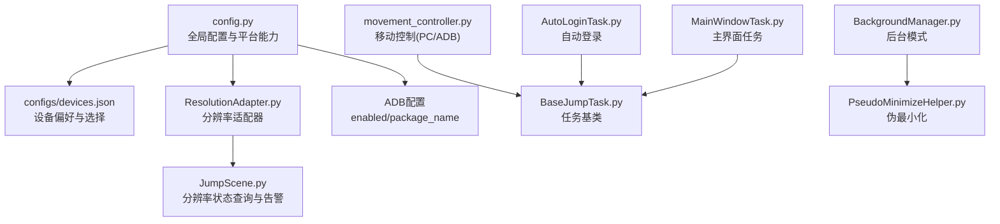
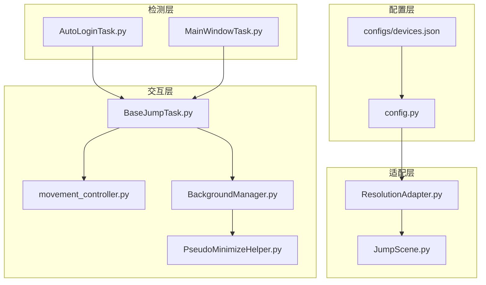
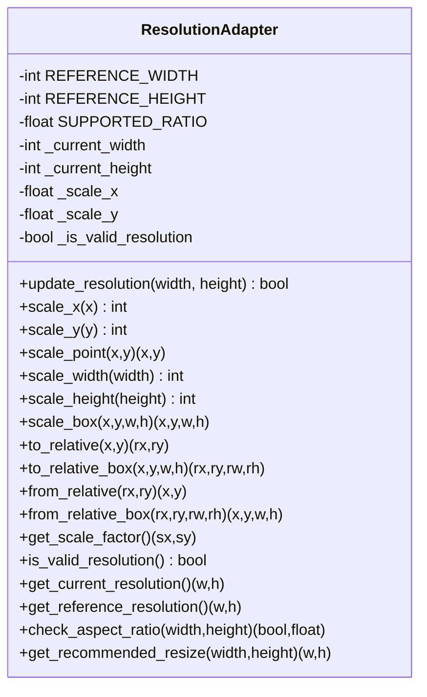
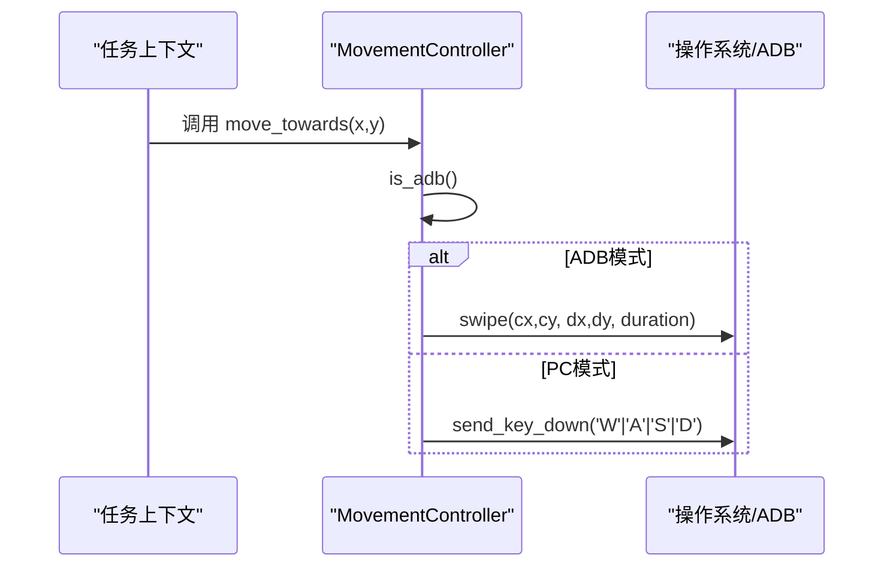
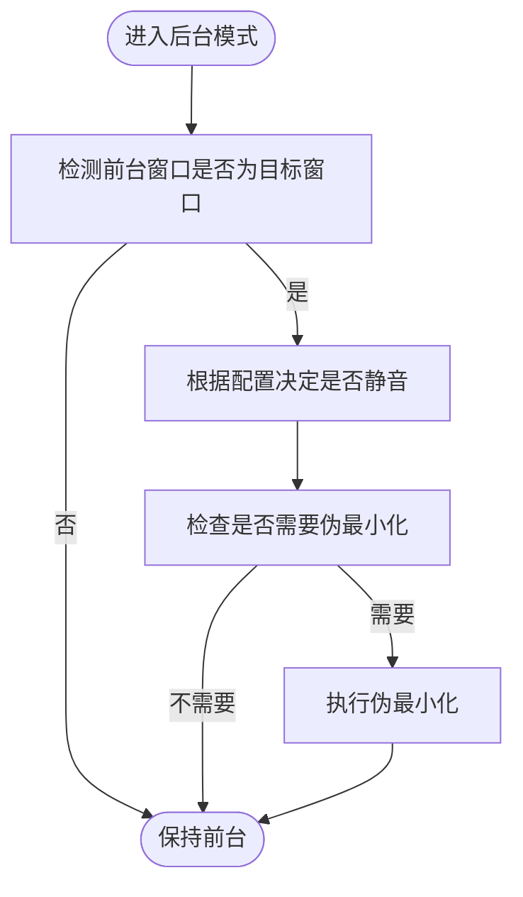
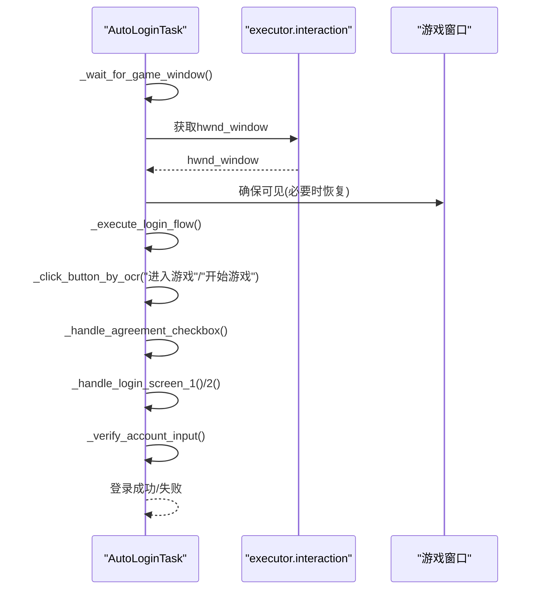
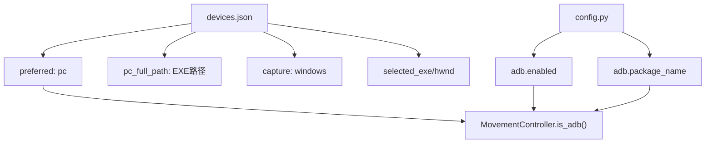
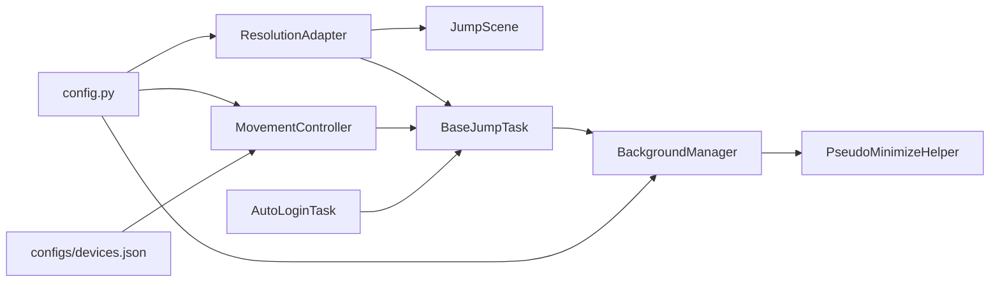

# 设备配置

<cite>
**本文引用的文件**
- [config.py](file://config.py)
- [devices.json](file://configs/devices.json)
- [ResolutionAdapter.py](file://src/utils/ResolutionAdapter.py)
- [movement_controller.py](file://src/combat/movement_controller.py)
- [BaseJumpTask.py](file://src/task/BaseJumpTask.py)
- [AutoLoginTask.py](file://src/task/AutoLoginTask.py)
- [BackgroundManager.py](file://src/utils/BackgroundManager.py)
- [PseudoMinimizeHelper.py](file://src/utils/PseudoMinimizeHelper.py)
- [JumpScene.py](file://src/scene/JumpScene.py)
- [MainWindowTask.py](file://src/task/MainWindowTask.py)
</cite>

## 目录
1. [简介](#简介)
2. [项目结构](#项目结构)
3. [核心组件](#核心组件)
4. [架构总览](#架构总览)
5. [详细组件分析](#详细组件分析)
6. [依赖分析](#依赖分析)
7. [性能考虑](#性能考虑)
8. [故障排除指南](#故障排除指南)
9. [结论](#结论)
10. [附录](#附录)

## 简介
本技术文档聚焦于“设备配置”模块，系统性阐述以下主题：
- PC端与移动端设备的配置差异与适配机制
- ADB连接配置与设备检测流程
- 不同分辨率与设备规格的支持策略
- 设备配置的验证方法与故障排除指南
- 多设备管理与设备切换的技术实现思路

文档以仓库现有实现为依据，结合配置文件与源码中的关键逻辑进行深入分析，并提供可视化图示帮助理解。

## 项目结构
围绕“设备配置”的关键文件与职责如下：
- 配置入口与平台能力
  - config.py：定义全局配置、窗口交互参数、ADB开关与包名、分辨率支持策略等
  - configs/devices.json：设备偏好与选择（PC优先、捕获方式、所选EXE与窗口句柄）
- 分辨率适配
  - src/utils/ResolutionAdapter.py：基于参考分辨率与宽高比的缩放与推荐调整策略
  - src/scene/JumpScene.py：读取分辨率适配器状态并给出警告
- 输入与交互
  - src/combat/movement_controller.py：PC端WASD与移动端虚拟摇杆的统一抽象
  - src/task/BaseJumpTask.py：任务基类，提供后台模式、伪最小化、分辨率自适应等能力
  - src/utils/BackgroundManager.py、src/utils/PseudoMinimizeHelper.py：后台模式与窗口伪最小化的实现
- 登录与设备检测
  - src/task/AutoLoginTask.py：自动登录流程，包含窗口等待、OCR缓存、按钮识别等
  - src/task/MainWindowTask.py：主界面任务，展示“窗口识别与截图”“自适应分辨率”“后台模式”等能力项

**图表来源**
- [config.py:65-137](file://config.py#L65-L137)
- [devices.json:1-7](file://configs/devices.json#L1-L7)
- [ResolutionAdapter.py:4-162](file://src/utils/ResolutionAdapter.py#L4-L162)
- [JumpScene.py:197-215](file://src/scene/JumpScene.py#L197-L215)
- [movement_controller.py:11-310](file://src/combat/movement_controller.py#L11-L310)
- [BaseJumpTask.py:10-295](file://src/task/BaseJumpTask.py#L10-L295)
- [BackgroundManager.py:7-145](file://src/utils/BackgroundManager.py#L7-L145)
- [PseudoMinimizeHelper.py:13-193](file://src/utils/PseudoMinimizeHelper.py#L13-L193)
- [AutoLoginTask.py:18-142](file://src/task/AutoLoginTask.py#L18-L142)
- [MainWindowTask.py:5-33](file://src/task/MainWindowTask.py#L5-L33)

**章节来源**
- [config.py:65-137](file://config.py#L65-L137)
- [devices.json:1-7](file://configs/devices.json#L1-L7)
- [ResolutionAdapter.py:4-162](file://src/utils/ResolutionAdapter.py#L4-L162)
- [movement_controller.py:11-310](file://src/combat/movement_controller.py#L11-L310)
- [BaseJumpTask.py:10-295](file://src/task/BaseJumpTask.py#L10-L295)
- [BackgroundManager.py:7-145](file://src/utils/BackgroundManager.py#L7-L145)
- [PseudoMinimizeHelper.py:13-193](file://src/utils/PseudoMinimizeHelper.py#L13-L193)
- [AutoLoginTask.py:18-142](file://src/task/AutoLoginTask.py#L18-L142)
- [MainWindowTask.py:5-33](file://src/task/MainWindowTask.py#L5-L33)

## 核心组件
- 全局配置与平台能力
  - Windows窗口交互参数、捕获方法、ADB开关与包名、分辨率支持策略、参考分辨率等
- 分辨率适配器
  - 基于参考分辨率与宽高比进行坐标/尺寸缩放；提供比例校验与推荐调整
- 输入与交互
  - 移动控制：PC端WASD键盘与移动端虚拟摇杆；统一通过任务上下文调用
  - 后台模式与伪最小化：窗口前后台检测、静音控制、最小化时移出屏幕外
- 登录与设备检测
  - 自动登录流程：等待窗口、OCR缓存、按钮识别、问卷处理、账号输入
  - 主界面任务：展示窗口识别、分辨率自适应、后台模式等能力项

**章节来源**
- [config.py:88-137](file://config.py#L88-L137)
- [ResolutionAdapter.py:4-162](file://src/utils/ResolutionAdapter.py#L4-L162)
- [movement_controller.py:11-310](file://src/combat/movement_controller.py#L11-L310)
- [BaseJumpTask.py:270-295](file://src/task/BaseJumpTask.py#L270-L295)
- [BackgroundManager.py:7-145](file://src/utils/BackgroundManager.py#L7-L145)
- [PseudoMinimizeHelper.py:13-193](file://src/utils/PseudoMinimizeHelper.py#L13-L193)
- [AutoLoginTask.py:18-142](file://src/task/AutoLoginTask.py#L18-L142)
- [MainWindowTask.py:5-33](file://src/task/MainWindowTask.py#L5-L33)

## 架构总览
设备配置贯穿“配置—适配—交互—检测—验证”的闭环：
- 配置层：config.py与devices.json提供平台能力与设备偏好
- 适配层：ResolutionAdapter根据当前分辨率与参考分辨率进行缩放与比例校验
- 交互层：MovementController在PC与ADB之间切换；BaseJumpTask提供后台模式与伪最小化
- 检测层：AutoLoginTask负责窗口等待与界面识别；JumpScene提供分辨率告警
- 验证层：MainWindowTask展示能力项，BackgroundManager/PseudoMinimizeHelper保障后台截图可用

**图表来源**
- [config.py:65-137](file://config.py#L65-L137)
- [devices.json:1-7](file://configs/devices.json#L1-L7)
- [ResolutionAdapter.py:4-162](file://src/utils/ResolutionAdapter.py#L4-L162)
- [JumpScene.py:197-215](file://src/scene/JumpScene.py#L197-L215)
- [movement_controller.py:11-310](file://src/combat/movement_controller.py#L11-L310)
- [BaseJumpTask.py:10-295](file://src/task/BaseJumpTask.py#L10-L295)
- [BackgroundManager.py:7-145](file://src/utils/BackgroundManager.py#L7-L145)
- [PseudoMinimizeHelper.py:13-193](file://src/utils/PseudoMinimizeHelper.py#L13-L193)
- [AutoLoginTask.py:18-142](file://src/task/AutoLoginTask.py#L18-L142)
- [MainWindowTask.py:5-33](file://src/task/MainWindowTask.py#L5-L33)

## 详细组件分析

### 分辨率适配器（ResolutionAdapter）
- 功能要点
  - 加载参考分辨率与支持宽高比
  - 更新当前分辨率并计算缩放因子
  - 比例校验与推荐调整尺寸
  - 提供相对/绝对坐标转换与矩形缩放
- 关键行为
  - update_resolution：更新当前宽高并计算缩放与比例校验
  - scale_*：坐标与尺寸缩放
  - to/from_relative：相对/绝对坐标互转
  - check_aspect_ratio：比例差值与阈值比较
  - get_recommended_resize：按配置与宽度阈值推荐目标分辨率

**图表来源**
- [ResolutionAdapter.py:4-162](file://src/utils/ResolutionAdapter.py#L4-L162)

**章节来源**
- [ResolutionAdapter.py:19-162](file://src/utils/ResolutionAdapter.py#L19-L162)
- [JumpScene.py:197-215](file://src/scene/JumpScene.py#L197-L215)

### 移动控制（PC端与ADB）
- 功能要点
  - PC端：通过WASD键盘按键驱动移动
  - 移动端：通过虚拟摇杆滑动控制，使用相对坐标与半径
  - 统一入口：MovementController根据任务上下文判断是否ADB模式
- 关键行为
  - is_adb：通过任务暴露的ADB标志判断
  - _move_pc_*：计算方向并发送按键
  - _move_adb_*：计算方向向量并执行滑动

**图表来源**
- [movement_controller.py:41-104](file://src/combat/movement_controller.py#L41-L104)
- [movement_controller.py:237-310](file://src/combat/movement_controller.py#L237-L310)

**章节来源**
- [movement_controller.py:11-310](file://src/combat/movement_controller.py#L11-L310)

### 后台模式与伪最小化
- 功能要点
  - 后台模式：检测前台窗口是否为目标游戏窗口
  - 伪最小化：将窗口移动至(-32000,-32000)以支持后台截图
  - 静音控制：后台时静音游戏音频
- 关键行为
  - is_game_in_background：前后台检测
  - pseudo_minimize/pseudo_restore：窗口伪最小化/恢复
  - ensure_visible_for_capture：保证截图可见性

**图表来源**
- [BackgroundManager.py:36-118](file://src/utils/BackgroundManager.py#L36-L118)
- [PseudoMinimizeHelper.py:78-148](file://src/utils/PseudoMinimizeHelper.py#L78-L148)

**章节来源**
- [BackgroundManager.py:7-145](file://src/utils/BackgroundManager.py#L7-L145)
- [PseudoMinimizeHelper.py:13-193](file://src/utils/PseudoMinimizeHelper.py#L13-L193)

### 自动登录与设备检测
- 功能要点
  - 等待游戏窗口出现
  - OCR缓存与按钮识别
  - 问卷调查处理与账号输入（可选）
- 关键行为
  - _wait_for_game_window：轮询帧直到检测到窗口
  - _click_button_by_ocr：OCR定位并点击按钮
  - _input_account：剪贴板+按键序列输入账号并校验

**图表来源**
- [AutoLoginTask.py:162-176](file://src/task/AutoLoginTask.py#L162-L176)
- [AutoLoginTask.py:412-455](file://src/task/AutoLoginTask.py#L412-L455)
- [AutoLoginTask.py:504-566](file://src/task/AutoLoginTask.py#L504-L566)
- [AutoLoginTask.py:642-701](file://src/task/AutoLoginTask.py#L642-L701)

**章节来源**
- [AutoLoginTask.py:18-142](file://src/task/AutoLoginTask.py#L18-L142)
- [AutoLoginTask.py:412-455](file://src/task/AutoLoginTask.py#L412-L455)
- [AutoLoginTask.py:504-566](file://src/task/AutoLoginTask.py#L504-L566)
- [AutoLoginTask.py:642-701](file://src/task/AutoLoginTask.py#L642-L701)

### 设备偏好与ADB配置
- 设备偏好
  - preferred：首选设备类型（如pc）
  - pc_full_path：PC可执行文件路径
  - capture：捕获方式（如windows）
  - selected_exe/selected_hwnd：当前选择的EXE与窗口句柄
- ADB配置
  - enabled：是否启用ADB
  - package_name：目标应用包名

**图表来源**
- [devices.json:1-7](file://configs/devices.json#L1-L7)
- [config.py:96-99](file://config.py#L96-L99)
- [movement_controller.py:41-44](file://src/combat/movement_controller.py#L41-L44)

**章节来源**
- [devices.json:1-7](file://configs/devices.json#L1-L7)
- [config.py:96-99](file://config.py#L96-L99)
- [movement_controller.py:41-44](file://src/combat/movement_controller.py#L41-L44)

## 依赖分析
- 组件耦合
  - ResolutionAdapter被JumpScene与任务基类使用，提供分辨率状态查询
  - MovementController依赖任务上下文（frame、swipe、send_key等）以区分PC/ADB
  - BaseJumpTask依赖BackgroundManager与PseudoMinimizeHelper实现后台模式
  - AutoLoginTask依赖executor.interaction与窗口可见性控制
- 外部依赖
  - Windows窗口交互参数来自config.py
  - ADB能力来自config.py的adb.enabled与adb.package_name
  - 设备偏好来自configs/devices.json

**图表来源**
- [ResolutionAdapter.py:4-162](file://src/utils/ResolutionAdapter.py#L4-L162)
- [JumpScene.py:197-215](file://src/scene/JumpScene.py#L197-L215)
- [movement_controller.py:11-310](file://src/combat/movement_controller.py#L11-L310)
- [BaseJumpTask.py:10-295](file://src/task/BaseJumpTask.py#L10-L295)
- [BackgroundManager.py:7-145](file://src/utils/BackgroundManager.py#L7-L145)
- [PseudoMinimizeHelper.py:13-193](file://src/utils/PseudoMinimizeHelper.py#L13-L193)
- [AutoLoginTask.py:18-142](file://src/task/AutoLoginTask.py#L18-L142)
- [config.py:65-137](file://config.py#L65-L137)
- [devices.json:1-7](file://configs/devices.json#L1-L7)

**章节来源**
- [config.py:65-137](file://config.py#L65-L137)
- [devices.json:1-7](file://configs/devices.json#L1-L7)
- [ResolutionAdapter.py:4-162](file://src/utils/ResolutionAdapter.py#L4-L162)
- [movement_controller.py:11-310](file://src/combat/movement_controller.py#L11-L310)
- [BaseJumpTask.py:10-295](file://src/task/BaseJumpTask.py#L10-L295)
- [BackgroundManager.py:7-145](file://src/utils/BackgroundManager.py#L7-L145)
- [PseudoMinimizeHelper.py:13-193](file://src/utils/PseudoMinimizeHelper.py#L13-L193)
- [AutoLoginTask.py:18-142](file://src/task/AutoLoginTask.py#L18-L142)
- [JumpScene.py:197-215](file://src/scene/JumpScene.py#L197-L215)

## 性能考虑
- 触发间隔与资源占用
  - config.py提供“触发间隔”配置，用于降低CPU/GPU占用
- 后台模式与截图
  - 伪最小化使窗口在后台仍可截图，减少前台切换开销
- 分辨率缩放
  - 通过相对坐标与缩放因子减少模板匹配对分辨率的敏感度

**章节来源**
- [config.py:40-63](file://config.py#L40-L63)
- [BackgroundManager.py:91-118](file://src/utils/BackgroundManager.py#L91-L118)
- [ResolutionAdapter.py:69-93](file://src/utils/ResolutionAdapter.py#L69-L93)

## 故障排除指南
- 分辨率不匹配导致识别失败
  - 现象：场景识别不稳定、点击位置偏移
  - 排查：查看JumpScene的分辨率告警；使用ResolutionAdapter的推荐调整尺寸
  - 处置：调整游戏窗口分辨率至推荐值或启用自动调整
- 后台截图不可用
  - 现象：后台模式下无法截图
  - 排查：确认后台模式与伪最小化配置；检查窗口是否被前台遮挡
  - 处置：启用“最小化时伪最小化”，确保窗口可见性
- ADB模式无法移动
  - 现象：移动端滑动无效
  - 排查：确认任务上下文是否暴露is_adb；检查虚拟摇杆中心与半径
  - 处置：确保任务上下文正确返回ADB模式；校准相对坐标
- 登录流程卡住
  - 现象：长时间等待窗口或按钮未识别
  - 排查：检查窗口标题/类名、捕获方法；确认OCR缓存与按钮阈值
  - 处置：调整等待超时与阈值；必要时手动恢复窗口

**章节来源**
- [JumpScene.py:206-215](file://src/scene/JumpScene.py#L206-L215)
- [BackgroundManager.py:72-82](file://src/utils/BackgroundManager.py#L72-L82)
- [movement_controller.py:226-261](file://src/combat/movement_controller.py#L226-L261)
- [AutoLoginTask.py:162-176](file://src/task/AutoLoginTask.py#L162-L176)
- [AutoLoginTask.py:412-455](file://src/task/AutoLoginTask.py#L412-L455)

## 结论
本模块通过“配置—适配—交互—检测—验证”的闭环实现了对PC端与移动端设备的差异化支持：
- 以config.py与devices.json为配置中枢，统一平台能力与设备偏好
- 以ResolutionAdapter实现跨分辨率的稳定识别与交互
- 以MovementController抽象PC/ADB输入差异
- 以后台模式与伪最小化保障后台截图与稳定性
- 以AutoLoginTask与JumpScene形成设备检测与验证闭环

## 附录
- 多设备管理与设备切换
  - 当前实现通过devices.json的preferred与selected_*字段表达设备偏好与当前选择
  - ADB模式由任务上下文的is_adb标志决定
  - 建议扩展：在UI中提供设备列表与切换入口，动态更新selected_exe/selected_hwnd与ADB状态

**章节来源**
- [devices.json:1-7](file://configs/devices.json#L1-L7)
- [movement_controller.py:41-44](file://src/combat/movement_controller.py#L41-L44)
- [MainWindowTask.py:7-16](file://src/task/MainWindowTask.py#L7-L16)