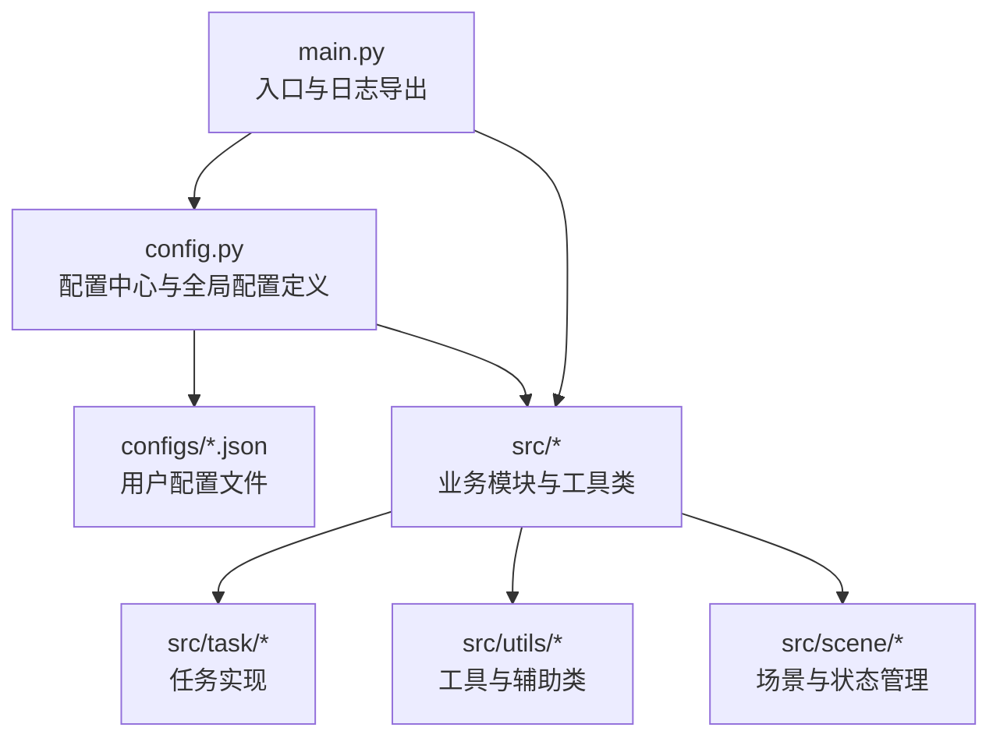
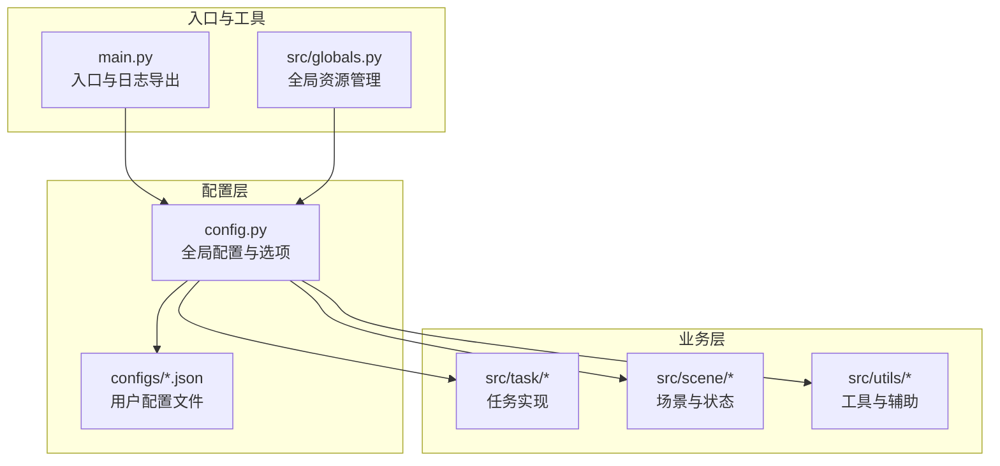
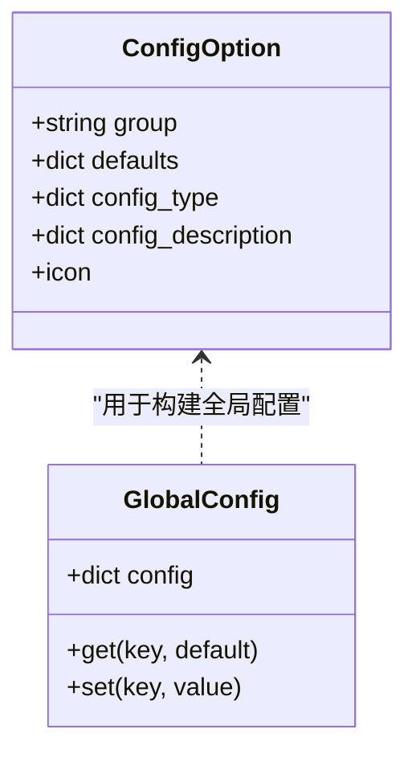
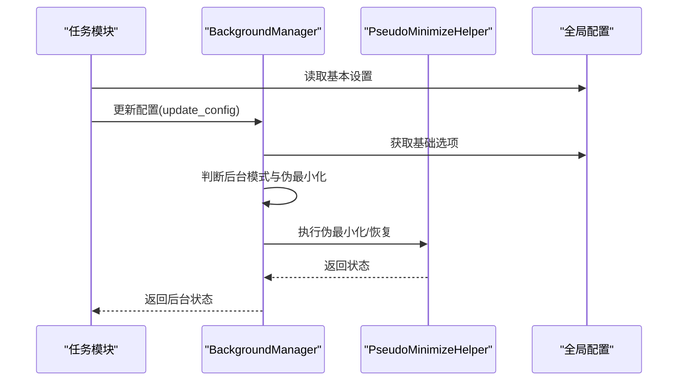
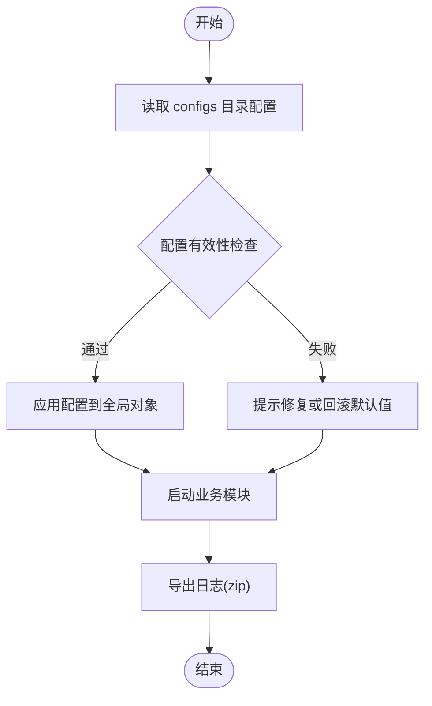
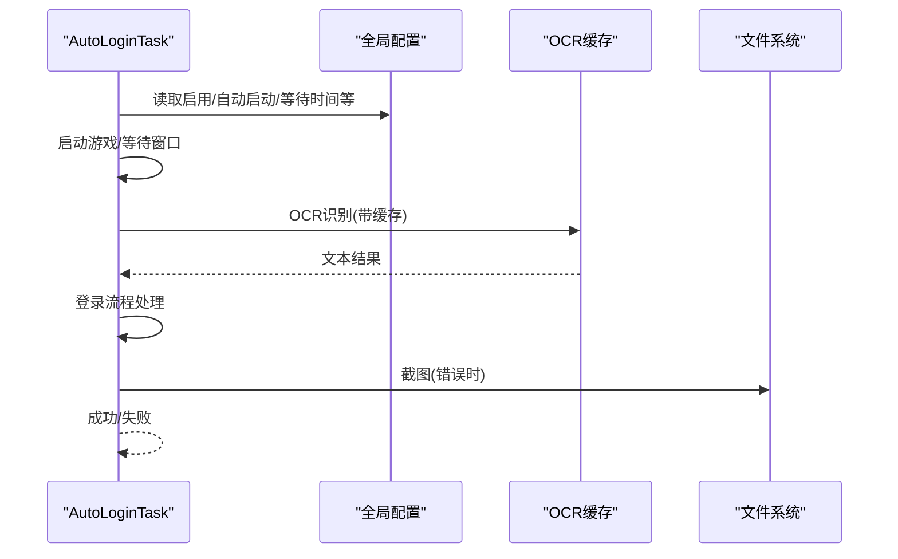
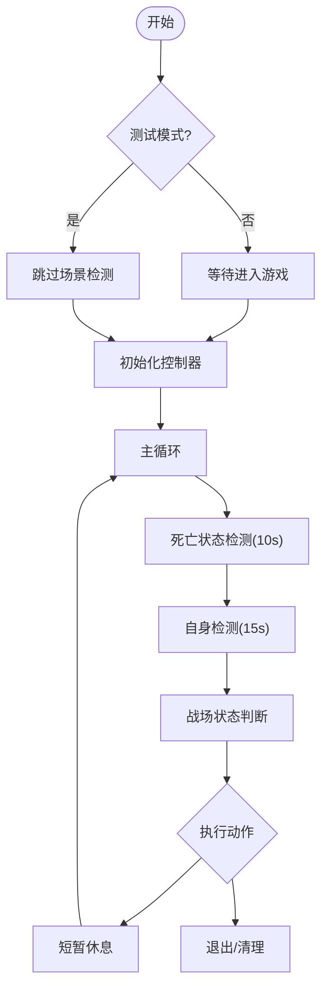
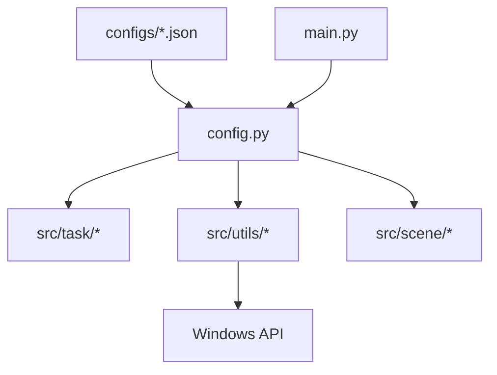

# 配置管理系统

<cite>
**本文档引用的文件**
- [config.py](file://config.py)
- [main.py](file://main.py)
- [src/globals.py](file://src/globals.py)
- [src/utils/BackgroundManager.py](file://src/utils/BackgroundManager.py)
- [src/utils/PseudoMinimizeHelper.py](file://src/utils/PseudoMinimizeHelper.py)
- [src/utils/ResolutionAdapter.py](file://src/utils/ResolutionAdapter.py)
- [src/scene/JumpScene.py](file://src/scene/JumpScene.py)
- [src/task/AutoLoginTask.py](file://src/task/AutoLoginTask.py)
- [src/task/AutoCombatTask.py](file://src/task/AutoCombatTask.py)
- [configs/_ok.json](file://configs/_ok.json)
- [configs/devices.json](file://configs/devices.json)
- [configs/Basic Options.json](file://configs/Basic Options.json)
- [configs/基础选项.json](file://configs/基础选项.json)
- [configs/游戏热键配置.json](file://configs/游戏热键配置.json)
- [configs/ui_config.json](file://configs/ui_config.json)
</cite>

## 目录
1. [简介](#简介)
2. [项目结构](#项目结构)
3. [核心组件](#核心组件)
4. [架构总览](#架构总览)
5. [详细组件分析](#详细组件分析)
6. [依赖关系分析](#依赖关系分析)
7. [性能考虑](#性能考虑)
8. [故障排除指南](#故障排除指南)
9. [结论](#结论)
10. [附录](#附录)

## 简介
本项目是一个基于 Python 的自动化工具配置管理系统，围绕配置文件结构、参数验证、动态更新与持久化、导入导出与备份恢复、分类管理与默认值处理等方面进行设计与实现。系统通过集中式配置对象与 JSON 文件相结合的方式，提供灵活的配置读取、校验与应用能力，并支持运行时动态调整与持久化保存。

## 项目结构
项目采用模块化组织，核心配置集中在 config.py 中，实际配置数据以 JSON 文件形式存储于 configs 目录，业务模块按功能划分在 src 下，日志与截图等资源位于项目根目录。

图表来源
- [config.py:65-137](file://config.py#L65-L137)
- [main.py:30-32](file://main.py#L30-L32)

章节来源
- [config.py:1-138](file://config.py#L1-L138)
- [main.py:1-33](file://main.py#L1-L33)

## 核心组件
- 配置中心与全局配置
  - 通过集中式字典定义全局配置项，包含调试开关、GUI 参数、日志路径、截图目录、任务映射、窗口与设备参数等。
  - 提供工具函数用于计算可执行文件路径、获取资源与配置文件路径。
- 配置选项对象
  - 使用 ConfigOption 定义“基本设置”和“游戏热键配置”，包含默认值、类型约束、描述信息与图标，便于 GUI 展示与校验。
- 任务与场景配置
  - 一次性任务与触发式任务的类路径映射，场景模块负责分辨率与窗口状态的适配与校验。
- 工具与辅助类
  - 背景管理模式、伪最小化辅助、分辨率适配器等，均从全局配置读取参数并动态生效。

章节来源
- [config.py:23-63](file://config.py#L23-L63)
- [config.py:65-137](file://config.py#L65-L137)
- [src/utils/BackgroundManager.py:18-31](file://src/utils/BackgroundManager.py#L18-L31)
- [src/utils/ResolutionAdapter.py:19-43](file://src/utils/ResolutionAdapter.py#L19-L43)

## 架构总览
系统采用“配置中心 + JSON 文件 + 动态读取”的架构。config.py 定义默认配置与配置选项对象，业务模块通过全局配置对象读取参数；JSON 文件作为用户配置持久化载体，支持导入导出与备份恢复。

图表来源
- [config.py:65-137](file://config.py#L65-L137)
- [main.py:30-32](file://main.py#L30-L32)
- [src/globals.py:43-58](file://src/globals.py#L43-L58)

## 详细组件分析

### 配置文件结构与参数验证机制
- 结构设计
  - 全局配置字典包含调试、GUI、日志、截图、任务映射、窗口与设备参数等键值。
  - 配置选项对象包含默认值、类型约束、描述信息与图标，便于 GUI 展示与校验。
- 参数验证
  - 类型约束：通过配置类型字段限制下拉选项等。
  - 默认值处理：当 JSON 文件缺失键时，使用配置选项对象中的默认值。
  - 描述信息：为每个配置项提供说明，便于用户理解与正确配置。

图表来源
- [config.py:23-63](file://config.py#L23-L63)
- [config.py:65-137](file://config.py#L65-L137)

章节来源
- [config.py:23-63](file://config.py#L23-L63)
- [config.py:65-137](file://config.py#L65-L137)

### 动态配置更新与持久化存储策略
- 动态更新
  - 业务模块通过全局配置对象读取参数，背景管理模式与分辨率适配器在运行时读取配置并动态生效。
  - 伪最小化辅助类根据窗口状态动态调整窗口位置，支持恢复原位。
- 持久化存储
  - 用户配置以 JSON 文件形式存储于 configs 目录，包含窗口位置、设备选择、基本选项、热键配置与 UI 配置等。
  - 日志导出功能支持将日志文件打包下载，便于备份与问题排查。

图表来源
- [src/utils/BackgroundManager.py:18-31](file://src/utils/BackgroundManager.py#L18-L31)
- [src/utils/PseudoMinimizeHelper.py:78-118](file://src/utils/PseudoMinimizeHelper.py#L78-L118)

章节来源
- [src/utils/BackgroundManager.py:18-31](file://src/utils/BackgroundManager.py#L18-L31)
- [src/utils/PseudoMinimizeHelper.py:78-118](file://src/utils/PseudoMinimizeHelper.py#L78-L118)
- [configs/_ok.json:1-7](file://configs/_ok.json#L1-L7)
- [configs/devices.json:1-7](file://configs/devices.json#L1-L7)

### 配置导入导出功能与备份恢复机制
- 导入
  - 用户将外部 JSON 配置文件放置于 configs 目录，系统启动时自动读取。
  - 支持多语言配置文件，如基础选项与热键配置等。
- 导出与备份
  - 日志导出：入口脚本提供导出日志功能，将 logs 目录压缩并打开所在位置。
  - 配置备份：用户可复制 configs 目录进行备份，恢复时替换对应文件即可。

图表来源
- [main.py:10-28](file://main.py#L10-L28)
- [configs/基础选项.json:1-11](file://configs/基础选项.json#L1-L11)
- [configs/游戏热键配置.json:1-6](file://configs/游戏热键配置.json#L1-L6)

章节来源
- [main.py:10-28](file://main.py#L10-L28)
- [configs/基础选项.json:1-11](file://configs/基础选项.json#L1-L11)
- [configs/游戏热键配置.json:1-6](file://configs/游戏热键配置.json#L1-L6)

### 配置项分类管理与默认值处理
- 分类管理
  - 基本设置：窗口行为、后台模式、触发间隔、快捷键等。
  - 热键配置：普通攻击、技能1、技能2、大招等按键映射。
  - UI 配置：主题色、主题模式、DPI 缩放、语言等。
  - 设备与窗口：设备选择、窗口标题、捕获方式等。
- 默认值处理
  - 配置选项对象提供默认值与类型约束，JSON 文件缺失键时使用默认值。
  - 业务模块在读取配置时提供合理的默认值，确保系统稳定运行。

章节来源
- [config.py:40-63](file://config.py#L40-L63)
- [config.py:23-38](file://config.py#L23-L38)
- [configs/ui_config.json:1-17](file://configs/ui_config.json#L1-L17)
- [configs/devices.json:1-7](file://configs/devices.json#L1-L7)

### 关键业务模块的配置交互

#### 自动登录任务
- 配置读取
  - 通过默认配置字典与任务内部配置读取方法获取各项参数。
- 功能实现
  - 自动启动游戏、等待窗口、登录流程处理、问卷调查处理、账号输入与校验等。
- 错误处理
  - 超时与异常捕获，错误截图与日志记录。

图表来源
- [src/task/AutoLoginTask.py:45-73](file://src/task/AutoLoginTask.py#L45-L73)
- [src/task/AutoLoginTask.py:96-141](file://src/task/AutoLoginTask.py#L96-L141)
- [src/task/AutoLoginTask.py:178-193](file://src/task/AutoLoginTask.py#L178-L193)

章节来源
- [src/task/AutoLoginTask.py:45-73](file://src/task/AutoLoginTask.py#L45-L73)
- [src/task/AutoLoginTask.py:96-141](file://src/task/AutoLoginTask.py#L96-L141)
- [src/task/AutoLoginTask.py:178-193](file://src/task/AutoLoginTask.py#L178-L193)

#### 自动战斗任务
- 配置读取
  - 通过默认配置字典读取自动技能开关、间隔等参数。
- 功能实现
  - 死亡状态检测、自身检测、战场状态判断、移动与技能控制。
- 性能优化
  - 合理的循环间隔与状态检测超时，避免过度占用 CPU/GPU。

图表来源
- [src/task/AutoCombatTask.py:65-107](file://src/task/AutoCombatTask.py#L65-L107)
- [src/task/AutoCombatTask.py:147-199](file://src/task/AutoCombatTask.py#L147-L199)

章节来源
- [src/task/AutoCombatTask.py:65-107](file://src/task/AutoCombatTask.py#L65-L107)
- [src/task/AutoCombatTask.py:147-199](file://src/task/AutoCombatTask.py#L147-L199)

#### 分辨率适配与窗口状态
- 分辨率适配
  - 从全局配置读取参考分辨率与支持比例，动态计算缩放因子并校验当前分辨率是否有效。
- 窗口状态
  - 背景管理模式与伪最小化辅助协同工作，根据配置自动调整窗口位置以支持后台截图。

章节来源
- [src/utils/ResolutionAdapter.py:19-43](file://src/utils/ResolutionAdapter.py#L19-L43)
- [src/scene/JumpScene.py:197-215](file://src/scene/JumpScene.py#L197-L215)
- [src/utils/BackgroundManager.py:91-118](file://src/utils/BackgroundManager.py#L91-L118)

## 依赖关系分析
- 配置中心依赖
  - 业务模块依赖全局配置对象读取参数。
  - 工具类依赖全局配置进行动态行为调整。
- 文件依赖
  - JSON 配置文件作为持久化存储，入口脚本负责日志导出。
- 运行时依赖
  - 伪最小化辅助依赖 Windows API 进行窗口位置调整。

图表来源
- [config.py:65-137](file://config.py#L65-L137)
- [main.py:30-32](file://main.py#L30-L32)
- [src/utils/PseudoMinimizeHelper.py:78-118](file://src/utils/PseudoMinimizeHelper.py#L78-L118)

章节来源
- [config.py:65-137](file://config.py#L65-L137)
- [main.py:30-32](file://main.py#L30-L32)
- [src/utils/PseudoMinimizeHelper.py:78-118](file://src/utils/PseudoMinimizeHelper.py#L78-L118)

## 性能考虑
- 触发间隔与延迟
  - 通过配置项调节任务间延迟，降低 CPU/GPU 使用率。
- OCR 缓存
  - 全局资源管理器提供 OCR 缓存与 TTL 控制，减少重复识别开销。
- 后台模式与伪最小化
  - 后台模式与伪最小化配合，确保后台截图与操作的稳定性。

章节来源
- [config.py:49, 59:49-59](file://config.py#L49-L59)
- [src/globals.py:107-134](file://src/globals.py#L107-L134)
- [src/utils/BackgroundManager.py:91-118](file://src/utils/BackgroundManager.py#L91-L118)

## 故障排除指南
- 配置读取失败
  - 检查 JSON 文件格式与键名是否正确，必要时回退到默认值。
- 日志导出问题
  - 确认 logs 目录存在且有写权限，使用入口脚本导出日志。
- 窗口状态异常
  - 检查后台模式与伪最小化配置，确认窗口句柄有效。
- OCR 识别不稳定
  - 调整 OCR 缓存 TTL 与识别阈值，确保图像清晰度。

章节来源
- [main.py:10-28](file://main.py#L10-L28)
- [src/utils/BackgroundManager.py:18-31](file://src/utils/BackgroundManager.py#L18-L31)
- [src/globals.py:107-134](file://src/globals.py#L107-L134)

## 结论
该配置管理系统通过集中式配置中心与 JSON 文件持久化相结合，实现了灵活的配置管理、动态更新与可视化展示。系统在参数验证、默认值处理、导入导出与备份恢复方面具备完整能力，并通过工具类与业务模块的协同，提供了稳定的运行保障。建议在扩展新配置项时遵循现有结构与命名规范，确保一致性与可维护性。

## 附录
- 配置文件示例
  - 基础选项：包含窗口行为、后台模式、触发间隔、快捷键等。
  - 热键配置：包含普通攻击、技能1、技能2、大招等按键映射。
  - UI 配置：包含主题色、主题模式、DPI 缩放、语言等。
  - 设备与窗口：包含设备选择、窗口标题、捕获方式等。
- 扩展建议
  - 新增配置项时，优先使用配置选项对象定义默认值与类型约束。
  - 在业务模块中提供合理的默认值与容错处理，避免因配置缺失导致异常。

章节来源
- [configs/基础选项.json:1-11](file://configs/基础选项.json#L1-L11)
- [configs/游戏热键配置.json:1-6](file://configs/游戏热键配置.json#L1-L6)
- [configs/ui_config.json:1-17](file://configs/ui_config.json#L1-L17)
- [configs/devices.json:1-7](file://configs/devices.json#L1-L7)