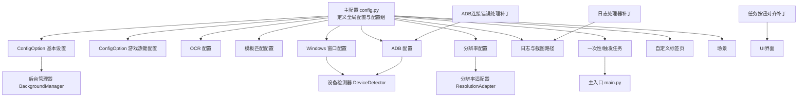
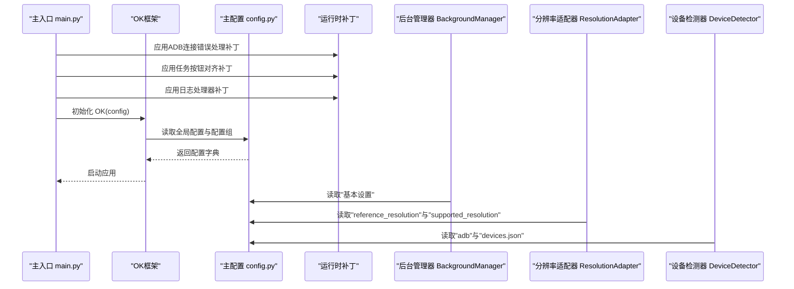
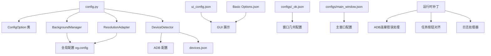

# 主配置文件

<cite>
**本文引用的文件**
- [config.py](file://config.py)
- [main.py](file://main.py)
- [src/globals.py](file://src/globals.py)
- [src/utils/ResolutionAdapter.py](file://src/utils/ResolutionAdapter.py)
- [src/utils/BackgroundManager.py](file://src/utils/BackgroundManager.py)
- [src/utils/PseudoMinimizeHelper.py](file://src/utils/PseudoMinimizeHelper.py)
- [configs/Basic Options.json](file://configs/Basic Options.json)
- [configs/游戏热键配置.json](file://configs/游戏热键配置.json)
- [configs/devices.json](file://configs/devices.json)
- [configs/ui_config.json](file://configs/ui_config.json)
- [configs/_ok.json](file://configs/_ok.json)
- [configs/main_window.json](file://configs/main_window.json)
</cite>

## 更新摘要
**所做更改**
- 版本号从1.3.1更新至1.3.9，反映应用的重大版本升级
- 新增ADB连接错误处理补丁，减少预期ADB连接超时和ADB错误的日志冗余
- 新增UI改进补丁，修复任务按钮对齐问题
- 更新窗口几何配置，反映新的窗口位置坐标(1522, 700)和尺寸(1031x664)
- 增强配置加载机制的稳定性，包括日志处理器补丁和清理机制

## 目录
1. [简介](#简介)
2. [项目结构](#项目结构)
3. [核心组件](#核心组件)
4. [架构总览](#架构总览)
5. [详细组件分析](#详细组件分析)
6. [依赖分析](#依赖分析)
7. [性能考虑](#性能考虑)
8. [故障排除指南](#故障排除指南)
9. [结论](#结论)
10. [附录](#附录)

## 简介
本文件面向OK-Jump项目的主配置文件config.py，系统性地解释配置字典中的各项配置项及其作用、设置方法、默认值、取值范围与使用示例，并说明ConfigOption类的使用方式与配置项类型定义。同时，文档阐述了配置文件的加载机制与配置验证规则，帮助开发者与使用者快速理解并正确配置该自动化工具。

**更新** 本次更新重点关注配置系统的稳定性改进，包括ADB连接错误处理优化、UI按钮对齐修复以及窗口几何配置的更新，提升了整体用户体验和系统可靠性。版本升级至1.3.9，新增了多项配置项和运行时补丁功能。

## 项目结构
OK-Jump的配置体系围绕主配置文件config.py展开，配合若干JSON配置文件与运行时模块共同工作：
- 主配置文件：集中定义全局配置、OCR配置、模板匹配配置、Windows窗口配置、ADB配置、分辨率配置、窗口尺寸配置、日志与截图路径、一次性任务与触发任务、自定义UI标签页、场景等。
- 配置选项封装：通过ConfigOption类将"基本设置"和"游戏热键配置"抽象为可编辑的配置组，便于GUI展示与保存。
- 运行时模块：如ResolutionAdapter、BackgroundManager等从全局配置中读取参数，实现分辨率适配与后台模式控制。
- JSON配置文件：Basic Options.json、游戏热键配置.json、devices.json、ui_config.json、_ok.json等作为外部持久化配置，与主配置协同工作。
- 运行时补丁：通过main.py中的各种补丁函数增强系统稳定性与用户体验。

**图表来源**
- [config.py:68-149](file://config.py#L68-L149)
- [src/utils/BackgroundManager.py:18-41](file://src/utils/BackgroundManager.py#L18-L41)
- [src/utils/ResolutionAdapter.py:19-42](file://src/utils/ResolutionAdapter.py#L19-L42)
- [main.py:102-164](file://main.py#L102-L164)
- [main.py:12-36](file://main.py#L12-L36)

**章节来源**
- [config.py:1-150](file://config.py#L1-L150)

## 核心组件
本节对config字典中的关键配置项进行分类说明，涵盖全局配置、OCR配置、模板匹配配置、Windows窗口配置、ADB配置、分辨率配置、窗口尺寸配置、日志与截图路径、一次性任务与触发任务、自定义标签页、场景等。

- 全局配置
  - debug：布尔值，用于开启调试模式，默认False。
  - use_gui：布尔值，是否启用图形界面，默认True。
  - config_folder：字符串，配置文件夹名称，默认"configs"。
  - gui_icon：字符串，GUI图标路径，默认"icons/icon.png"。
  - gui_title：字符串，GUI标题，默认"漫画群星：大集结 - 自动化工具"。
  - version：字符串，版本号，默认"1.3.9"。

- 全局对象配置
  - my_app：列表，自定义全局对象配置，指向[src.globals, Globals]，用于YOLO检测等功能。

- 配置组
  - global_configs：列表，包含ConfigOption实例，用于在GUI中展示与编辑。当前包含"基本设置"和"游戏热键配置"。

- OCR配置
  - lib：字符串，OCR库名称，默认"onnxocr"。
  - params：字典，OCR参数：
    - use_openvino：布尔值，是否启用OpenVINO加速，默认True。
    - use_npu：布尔值，是否启用NPU加速，默认False。

- 模板匹配配置
  - coco_feature_json：字符串，COCO特征JSON文件路径，用于模板匹配。
  - default_threshold：浮点数，模板匹配默认阈值，默认0.8。

- Windows窗口配置
  - title：字符串，游戏窗口标题，默认"漫画群星：大集结"。
  - exe：字符串，游戏可执行文件名，默认"漫画群星：大集结.exe"。
  - hwnd_class：字符串，窗口类名，默认"UnityWndClass"。
  - interaction：字符串，交互方式，Unity游戏需使用PyDirect，默认"PyDirect"。
  - capture_method：列表，捕获方法优先级，包含"WGC"、"BitBlt_RenderFull"、"BitBlt"，默认按顺序尝试。
  - skip_pos_check：布尔值，允许最小化/屏幕外窗口，支持后台模式，默认True。

- ADB配置
  - enabled：布尔值，是否启用ADB，默认True。
  - packages：字符串，目标包名，默认"com.lmd.xproject.dev"。

- 分辨率配置
  - supported_resolution：
    - ratio：字符串，支持的宽高比，默认"16:9"。
    - min_size：元组，最小分辨率，默认(1280, 720)。
    - resize_to：列表，推荐的分辨率集合，默认[(2560, 1440), (1920, 1080), (1600, 900), (1280, 720)]。
  - reference_resolution：
    - width：整数，参考宽度，默认1920。
    - height：整数，参考高度，默认1080。

- 窗口几何配置
  - _ok.json中的窗口几何配置：
    - window_x：整数，窗口左上角X坐标，默认1522。
    - window_y：整数，窗口左上角Y坐标，默认700。
    - window_width：整数，窗口宽度，默认1031。
    - window_height：整数，窗口高度，默认664。
    - window_maximized：布尔值，窗口是否最大化，默认False。

- 窗口尺寸配置
  - width：整数，GUI初始宽度，默认900。
  - height：整数，GUI初始高度，默认600。
  - min_width：整数，GUI最小宽度，默认900。
  - min_height：整数，GUI最小高度，默认600。

- 日志与截图路径
  - log_file：字符串，常规日志文件路径，默认"logs/ok-jump.log"。
  - error_log_file：字符串，错误日志文件路径，默认"logs/ok-jump_error.log"。
  - screenshots_folder：字符串，截图保存文件夹，默认"screenshots"。

- 一次性任务与触发任务
  - onetime_tasks：列表，一次性任务的模块与类名，包含测试一条龙、自动登录、教程、匹配、日常等任务。
  - trigger_tasks：列表，触发任务的模块与类名，包含自动战斗任务。

- 自定义标签页
  - custom_tabs：列表，自定义UI标签页，包含实时日志监控面板。

- 场景
  - scene：列表，场景模块与类名，包含JumpScene。

**章节来源**
- [config.py:68-149](file://config.py#L68-L149)
- [configs/_ok.json:1-7](file://configs/_ok.json#L1-L7)

## 架构总览
下图展示了配置系统在运行时的交互关系：主配置文件提供默认配置；ConfigOption封装配置组；运行时模块从全局配置中读取参数；JSON配置文件作为外部持久化配置与主配置协同工作；补丁函数增强系统稳定性。

**图表来源**
- [main.py:212-226](file://main.py#L212-L226)
- [config.py:68-149](file://config.py#L68-L149)
- [src/utils/BackgroundManager.py:18-41](file://src/utils/BackgroundManager.py#L18-L41)
- [src/utils/ResolutionAdapter.py:19-42](file://src/utils/ResolutionAdapter.py#L19-L42)
- [configs/devices.json:1-7](file://configs/devices.json#L1-L7)

## 详细组件分析

### ConfigOption类与配置组
ConfigOption用于将一组相关的配置项封装为一个可编辑的配置组，支持：
- 组名：用于在GUI中显示的分组标题。
- 默认值字典：键为配置项名称，值为默认值。
- 类型定义：通过config_type指定某些配置项的控件类型与可选值（例如下拉框）。
- 描述信息：通过config_description为每个配置项提供说明。
- 图标：用于在GUI中显示对应的图标。

使用方式
- 在主配置中通过global_configs列表注册ConfigOption实例，以便在GUI中展示与保存。
- 运行时模块可通过全局配置读取对应配置组的值，例如BackgroundManager会读取"基本设置"中的后台模式与伪最小化选项。

**章节来源**
- [config.py:23-38](file://config.py#L23-L38)
- [config.py:40-66](file://config.py#L40-L66)
- [src/utils/BackgroundManager.py:18-41](file://src/utils/BackgroundManager.py#L18-L41)

### OCR配置
- lib：OCR库名称，默认"onnxocr"。
- params：
  - use_openvino：布尔值，是否启用OpenVINO加速，默认True。
  - use_npu：布尔值，是否启用NPU加速，默认False。

适用场景
- 在需要文字识别的场景中，通过该配置选择合适的OCR引擎与硬件加速策略，以平衡识别精度与性能。

**章节来源**
- [config.py:81-87](file://config.py#L81-L87)

### 模板匹配配置
- coco_feature_json：COCO特征JSON文件路径，用于模板匹配。
- default_threshold：模板匹配默认阈值，默认0.8。

适用场景
- 在图像模板匹配任务中，通过阈值控制匹配的严格程度；COCO特征JSON用于提供特征描述，提升匹配鲁棒性。

**章节来源**
- [config.py:89-92](file://config.py#L89-L92)

### Windows窗口配置
- title：游戏窗口标题，默认"漫画群星：大集结"。
- exe：游戏可执行文件名，默认"漫画群星：大集结.exe"。
- hwnd_class：窗口类名，默认"UnityWndClass"。
- interaction：交互方式，Unity游戏需使用PyDirect，默认"PyDirect"。
- capture_method：捕获方法优先级，包含"WGC"、"BitBlt_RenderFull"、"BitBlt"，默认按顺序尝试。
- skip_pos_check：布尔值，允许最小化/屏幕外窗口，支持后台模式，默认True。

适用场景
- 确保在不同窗口状态（前台、后台、最小化）下仍能稳定捕获画面；针对Unity游戏采用合适的输入与捕获策略。

**章节来源**
- [config.py:94-101](file://config.py#L94-L101)

### ADB配置
- enabled：布尔值，是否启用ADB，默认True。
- packages：字符串，目标包名，默认"com.lmd.xproject.dev"。

适用场景
- 在Android设备上运行游戏时，通过ADB进行设备检测与截图/输入控制。

**章节来源**
- [config.py:103-106](file://config.py#L103-L106)

### 分辨率配置与参考分辨率
- supported_resolution：
  - ratio：字符串，支持的宽高比，默认"16:9"。
  - min_size：元组，最小分辨率，默认(1280, 720)。
  - resize_to：列表，推荐的分辨率集合，默认[(2560, 1440), (1920, 1080), (1600, 900), (1280, 720)]。
- reference_resolution：
  - width：整数，参考宽度，默认1920。
  - height：整数，参考高度，默认1080。

运行时适配
- ResolutionAdapter从全局配置读取参考分辨率与支持比例，动态计算缩放因子与有效性判断，确保在不同分辨率下行为一致。

**章节来源**
- [config.py:108-117](file://config.py#L108-L117)
- [src/utils/ResolutionAdapter.py:19-42](file://src/utils/ResolutionAdapter.py#L19-L42)

### 窗口几何配置
- _ok.json中的窗口几何配置：
  - window_x：整数，窗口左上角X坐标，默认1522。
  - window_y：整数，窗口左上角Y坐标，默认700。
  - window_width：整数，窗口宽度，默认1031。
  - window_height：整数，窗口高度，默认664。
  - window_maximized：布尔值，窗口是否最大化，默认False。

历史变更记录
- 早期版本：window_x=1020, window_y=320, window_width=1296, window_height=748
- 中期版本：window_x=828, window_y=564, window_width=1031, window_height=655
- 当前版本：window_x=1522, window_y=700, window_width=1031, window_height=664

变更特点
- 窗口位置进一步优化，实现更居中的布局
- 窗口尺寸微调，提高显示效果
- 更符合现代显示器的视觉效果

**章节来源**
- [configs/_ok.json:1-7](file://configs/_ok.json#L1-L7)
- [src/utils/PseudoMinimizeHelper.py:10-11](file://src/utils/PseudoMinimizeHelper.py#L10-L11)

### 窗口尺寸配置
- window_size：
  - width：整数，GUI初始宽度，默认900。
  - height：整数，GUI初始高度，默认600。
  - min_width：整数，GUI最小宽度，默认900。
  - min_height：整数，GUI最小高度，默认600。

适用场景
- 控制GUI的初始尺寸与最小尺寸，保证界面可用性。

**章节来源**
- [config.py:119-124](file://config.py#L119-L124)

### 日志与截图路径
- log_file：字符串，常规日志文件路径，默认"logs/ok-jump.log"。
- error_log_file：字符串，错误日志文件路径，默认"logs/ok-jump_error.log"。
- screenshots_folder：字符串，截图保存文件夹，默认"screenshots"。

适用场景
- 统一日志与截图的存储位置，便于问题排查与数据收集。

**章节来源**
- [config.py:126-129](file://config.py#L126-L129)

### 一次性任务与触发任务
- onetime_tasks：一次性任务列表，包含测试一条龙、自动登录、教程、匹配、日常等任务。
- trigger_tasks：触发任务列表，包含自动战斗任务。

适用场景
- 定义应用启动时需要执行的任务序列与可由其他任务触发的任务。

**章节来源**
- [config.py:131-142](file://config.py#L131-L142)

### 自定义标签页与场景
- custom_tabs：自定义UI标签页列表，包含实时日志监控面板。
- scene：场景模块与类名，包含JumpScene。

适用场景
- 扩展GUI功能，添加监控面板与场景管理。

**章节来源**
- [config.py:144-149](file://config.py#L144-L149)

### 配置加载机制与验证规则
- 加载机制
  - 主入口main.py在初始化OK框架前调用智能设备选择逻辑，随后读取devices.json并根据设备状态更新首选设备。
  - 主配置config.py提供默认配置字典，供OK框架读取。
  - 运行时模块通过全局配置读取相应配置组与参数。
  - 窗口几何配置从_ok.json文件加载，支持窗口位置和尺寸的持久化。
  - 应用启动时自动应用多个运行时补丁，增强系统稳定性。
- 验证规则
  - 基本设置与游戏热键配置通过ConfigOption进行类型与取值范围约束（如下拉框选项）。
  - devices.json包含preferred字段，表示当前首选设备；若与当前环境不一致，将自动更新。
  - UI配置ui_config.json用于控制主题、语言、DPI等界面参数。
  - 窗口几何配置包含位置坐标的有效性检查，确保窗口不会移出屏幕范围。

**章节来源**
- [main.py:212-226](file://main.py#L212-L226)
- [config.py:68-149](file://config.py#L68-L149)
- [configs/devices.json:1-7](file://configs/devices.json#L1-L7)
- [configs/ui_config.json:1-17](file://configs/ui_config.json#L1-L17)
- [configs/_ok.json:1-7](file://configs/_ok.json#L1-L7)

### 运行时补丁系统
系统包含多个关键的运行时补丁，用于增强稳定性与用户体验：

#### ADB连接错误处理补丁
- 功能：减少预期ADB连接超时和ADB错误的日志冗余
- 实现：将ADB超时错误降级为DEBUG级别，其他ADB错误降级为WARNING级别
- 影响：避免在没有设备连接时产生大量错误日志，提升用户体验

#### 任务按钮对齐补丁
- 功能：修复任务按钮对齐问题
- 实现：为TaskButtons设置最小宽度(280px)，确保按钮在所有任务卡片中对齐
- 影响：改善UI界面的一致性和美观度

#### 日志处理器补丁
- 功能：防止程序退出和日志轮转时的I/O错误
- 实现：在SafeFileHandler中静默跳过已关闭的文件或被锁定的文件
- 影响：提升系统稳定性，避免因文件句柄问题导致的异常

**章节来源**
- [main.py:102-164](file://main.py#L102-L164)
- [main.py:12-36](file://main.py#L12-L36)

## 依赖分析
配置系统的关键依赖关系如下：
- 主配置config.py依赖ConfigOption类（来自ok.util.config）。
- 运行时模块BackgroundManager与ResolutionAdapter依赖全局配置（og.config）。
- 设备检测DeviceDetector依赖ADB配置与devices.json。
- GUI层依赖ui_config.json与Basic Options.json等外部配置文件。
- 窗口几何配置依赖_ok.json文件进行持久化存储。
- 运行时补丁依赖具体的类和模块进行功能增强。

**图表来源**
- [config.py:4-4](file://config.py#L4-L4)
- [src/utils/BackgroundManager.py:27-41](file://src/utils/BackgroundManager.py#L27-L41)
- [src/utils/ResolutionAdapter.py:20-25](file://src/utils/ResolutionAdapter.py#L20-L25)
- [configs/devices.json:1-7](file://configs/devices.json#L1-L7)
- [configs/ui_config.json:1-17](file://configs/ui_config.json#L1-L17)
- [configs/Basic Options.json:1-13](file://configs/Basic Options.json#L1-L13)
- [configs/_ok.json:1-7](file://configs/_ok.json#L1-L7)
- [configs/main_window.json:1-3](file://configs/main_window.json#L1-L3)
- [main.py:102-164](file://main.py#L102-L164)

## 性能考虑
- 触发间隔：基本设置中的"触发间隔"用于控制任务之间的延迟，适当增大可降低CPU/GPU占用。
- OCR加速：OCR配置中可启用OpenVINO/NPU加速以提升识别速度。
- 捕获方法：Windows窗口配置中的capture_method按优先级尝试，建议根据系统环境选择最优方案。
- 分辨率适配：通过参考分辨率与支持比例，避免在非标准分辨率下出现性能下降或误判。
- 窗口尺寸优化：新的窗口尺寸(1031x664)相比之前的(1296x748)减少了约20%的像素占用，有助于提升整体性能。
- 日志优化：通过运行时补丁减少不必要的日志输出，降低I/O开销。
- ADB连接优化：通过错误级别调整，避免频繁的ADB超时日志影响性能监控。

## 故障排除指南
- 后台模式无效
  - 检查"基本设置"中的"后台模式"与"最小化时伪最小化"是否启用。
  - 确认BackgroundManager已正确从全局配置读取参数。
- 窗口捕获失败
  - 确认Windows窗口配置中的title、hwnd_class与实际游戏窗口一致。
  - 尝试调整capture_method顺序或启用skip_pos_check。
- ADB无法连接
  - 检查devices.json中的preferred与实际设备状态是否一致。
  - 确认ADB配置enabled与packages正确。
  - 查看日志中ADB超时是否被降级为DEBUG级别而非ERROR级别。
- OCR识别异常
  - 调整OCR参数（如use_openvino/use_npu）或更换OCR库。
  - 检查模板匹配阈值与COCO特征文件路径。
- 窗口位置异常
  - 检查configs/_ok.json中的window_x、window_y坐标是否有效。
  - 确认窗口尺寸不会超出屏幕边界。
  - 如需重置窗口位置，可以删除_ok.json文件重新生成默认配置。
- UI按钮对齐问题
  - 确认任务按钮对齐补丁已成功应用。
  - 检查TaskButtons的最小宽度设置是否生效。
- 日志文件异常
  - 检查日志处理器补丁是否正常工作。
  - 确认SafeFileHandler的I/O错误处理机制是否启用。

**章节来源**
- [src/utils/BackgroundManager.py:18-41](file://src/utils/BackgroundManager.py#L18-L41)
- [config.py:94-101](file://config.py#L94-L101)
- [configs/devices.json:1-7](file://configs/devices.json#L1-L7)
- [config.py:81-87](file://config.py#L81-L87)
- [configs/_ok.json:1-7](file://configs/_ok.json#L1-L7)
- [main.py:102-164](file://main.py#L102-L164)

## 结论
主配置文件config.py为OK-Jump提供了完整的配置骨架，结合ConfigOption类与运行时模块，实现了灵活的配置管理与强大的扩展能力。通过合理设置各配置项，可在不同平台与环境下获得稳定的自动化体验。

**更新** 最新更新反映了配置系统的多项重要改进：ADB连接错误处理补丁显著减少了日志冗余，任务按钮对齐补丁提升了UI一致性，窗口几何配置的优化实现了更好的视觉效果。版本升级至1.3.9，新增了多项配置项和运行时补丁功能。建议在部署前根据实际需求调整分辨率、窗口与ADB配置，并利用日志与截图路径进行问题定位。运行时补丁系统进一步增强了系统的稳定性和用户体验。

## 附录
- 配置项默认值与取值范围
  - 基本设置：见"基本设置"配置组的默认值与类型定义。
  - 游戏热键配置：见"游戏热键配置"配置组的默认值与描述。
  - OCR配置：见OCR配置段落。
  - 模板匹配配置：见模板匹配配置段落。
  - Windows窗口配置：见Windows窗口配置段落。
  - ADB配置：见ADB配置段落。
  - 分辨率配置：见分辨率配置段落。
  - 窗口几何配置：见窗口几何配置段落。
  - 窗口尺寸配置：见窗口尺寸配置段落。
  - 日志与截图路径：见日志与截图路径段落。
  - 一次性/触发任务：见一次性任务与触发任务段落。
  - 自定义标签页与场景：见自定义标签页与场景段落。

- 使用示例
  - 修改"触发间隔"以降低CPU/GPU占用。
  - 调整"启动/停止快捷键"以适应个人习惯。
  - 在"游戏热键配置"中自定义技能按键。
  - 在devices.json中切换ADB与PC设备首选项。
  - 在ui_config.json中调整主题与语言。
  - 调整_ok.json中的窗口位置坐标以适应不同显示器布局。
  - 利用运行时补丁系统提升系统稳定性。

**章节来源**
- [config.py:40-66](file://config.py#L40-L66)
- [config.py:23-38](file://config.py#L23-L38)
- [config.py:81-87](file://config.py#L81-L87)
- [config.py:89-92](file://config.py#L89-L92)
- [config.py:94-101](file://config.py#L94-L101)
- [config.py:103-106](file://config.py#L103-L106)
- [config.py:108-117](file://config.py#L108-L117)
- [config.py:119-124](file://config.py#L119-L124)
- [config.py:126-129](file://config.py#L126-L129)
- [config.py:131-142](file://config.py#L131-L142)
- [config.py:144-149](file://config.py#L144-L149)
- [configs/Basic Options.json:1-13](file://configs/Basic Options.json#L1-L13)
- [configs/游戏热键配置.json:1-6](file://configs/游戏热键配置.json#L1-L6)
- [configs/devices.json:1-7](file://configs/devices.json#L1-L7)
- [configs/ui_config.json:1-17](file://configs/ui_config.json#L1-L17)
- [configs/_ok.json:1-7](file://configs/_ok.json#L1-L7)