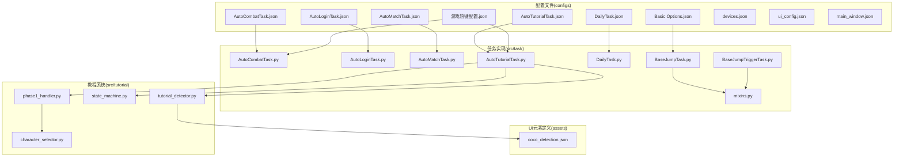
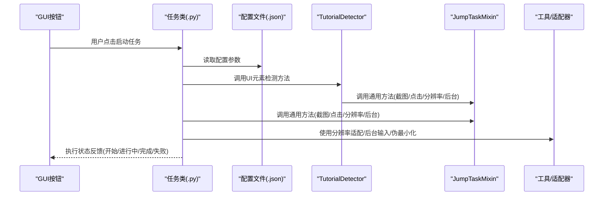
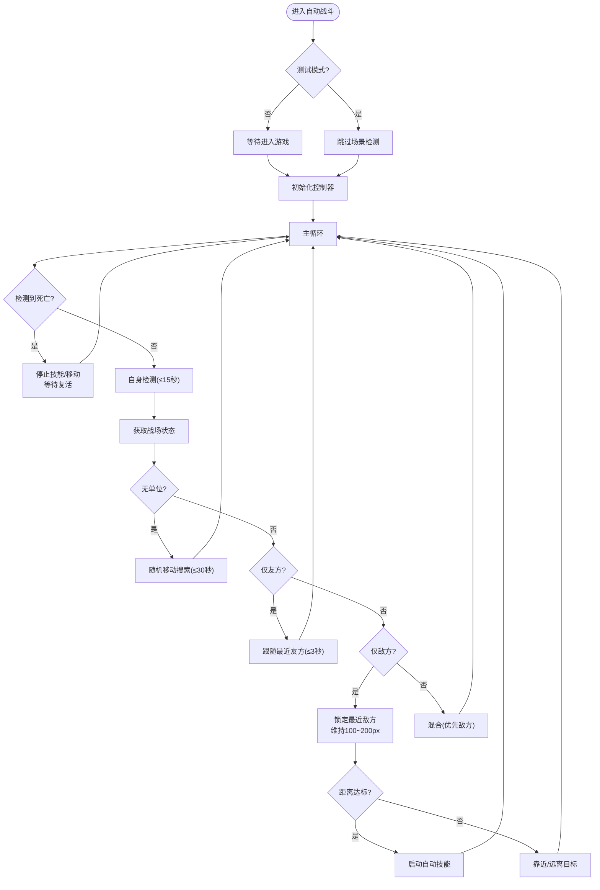
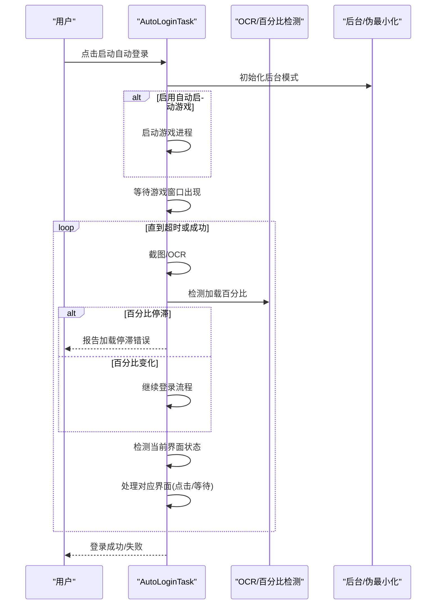
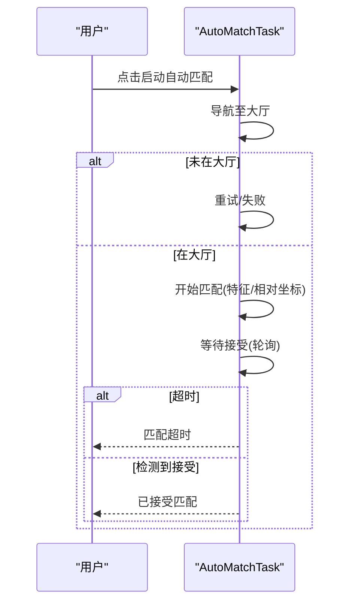
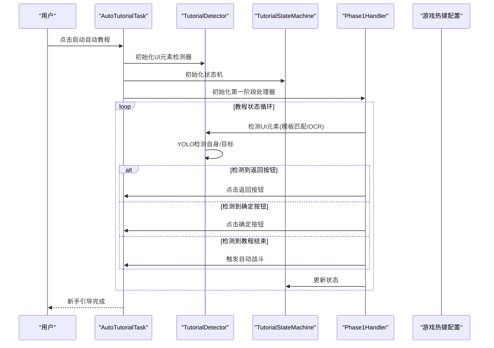
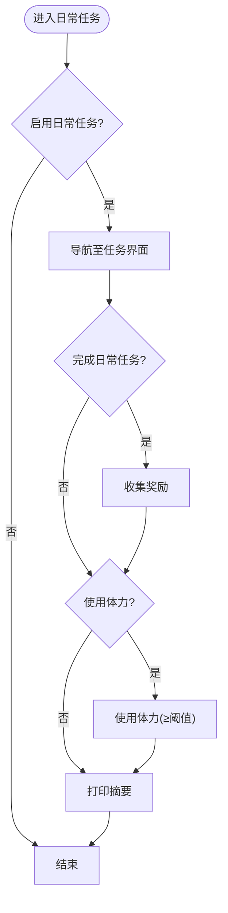
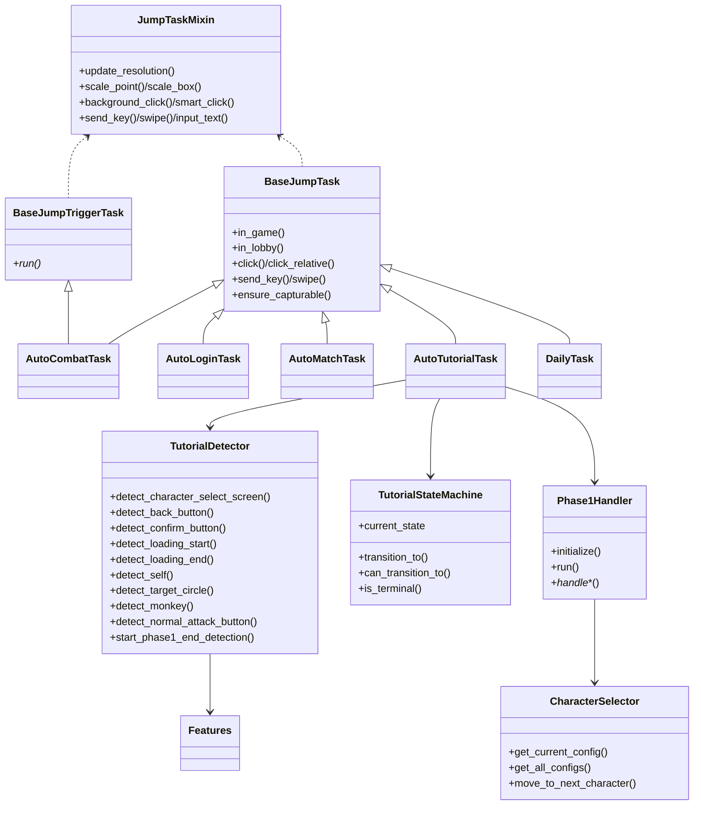

# 任务配置

<cite>
**本文档引用的文件**
- [AutoCombatTask.json](file://configs/AutoCombatTask.json)
- [AutoLoginTask.json](file://configs/AutoLoginTask.json)
- [AutoMatchTask.json](file://configs/AutoMatchTask.json)
- [AutoTutorialTask.json](file://configs/AutoTutorialTask.json)
- [DailyTask.json](file://configs/DailyTask.json)
- [Basic Options.json](file://configs/Basic Options.json)
- [游戏热键配置.json](file://configs/游戏热键配置.json)
- [AutoCombatTask.py](file://src/task/AutoCombatTask.py)
- [AutoLoginTask.py](file://src/task/AutoLoginTask.py)
- [AutoMatchTask.py](file://src/task/AutoMatchTask.py)
- [AutoTutorialTask.py](file://src/task/AutoTutorialTask.py)
- [DailyTask.py](file://src/task/DailyTask.py)
- [BaseJumpTask.py](file://src/task/BaseJumpTask.py)
- [BaseJumpTriggerTask.py](file://src/task/BaseJumpTriggerTask.py)
- [mixins.py](file://src/task/mixins.py)
- [devices.json](file://configs/devices.json)
- [ui_config.json](file://configs/ui_config.json)
- [main_window.json](file://configs/main_window.json)
- [tutorial_detector.py](file://src/tutorial/tutorial_detector.py)
- [state_machine.py](file://src/tutorial/state_machine.py)
- [phase1_handler.py](file://src/tutorial/phase1_handler.py)
- [features.py](file://src/constants/features.py)
- [character_selector.py](file://src/tutorial/character_selector.py)
- [coco_detection.json](file://assets/coco_detection.json)
</cite>

## 更新摘要
**所做更改**
- 新增UI元素识别系统相关配置项说明
- 更新自动教程任务配置，反映新增的UI元素检测功能
- 添加教程系统状态机和角色选择器的配置说明
- 更新UI配置文件结构，反映新增的教程UI元素

## 目录
1. [简介](#简介)
2. [项目结构](#项目结构)
3. [核心组件](#核心组件)
4. [架构总览](#架构总览)
5. [详细组件分析](#详细组件分析)
6. [依赖分析](#依赖分析)
7. [性能考虑](#性能考虑)
8. [故障排查指南](#故障排查指南)
9. [结论](#结论)
10. [附录](#附录)

## 简介
本文件系统性梳理仓库中的各类"任务配置"与对应实现，覆盖以下任务类型：
- 自动战斗任务
- 自动登录任务
- 自动匹配任务
- 自动教程任务
- 日常任务
- 基础选项与热键配置

内容包含：
- 配置文件结构与参数说明
- 参数含义与设置方法
- 触发条件、等待时间、技能释放参数等关键点
- 最佳实践与优化建议
- 与实现代码的映射关系与可视化图示

**重要更新**：任务配置系统已简化架构，移除了各任务模块中重复的'启用'配置选项，强调通过GUI按钮直接控制任务执行的设计理念。新增了UI元素识别系统，支持教程界面的智能检测。

## 项目结构
任务配置主要位于 configs 目录，任务实现位于 src/task 目录；两者通过 default_config 与 config 文件联动。新增的教程系统包含独立的检测器、状态机和处理器模块。

**图表来源**
- [AutoCombatTask.json:1-13](file://configs/AutoCombatTask.json#L1-L13)
- [AutoLoginTask.json:1-14](file://configs/AutoLoginTask.json#L1-L14)
- [AutoMatchTask.json:1-5](file://configs/AutoMatchTask.json#L1-L5)
- [AutoTutorialTask.json:1-13](file://configs/AutoTutorialTask.json#L1-L13)
- [DailyTask.json:1-6](file://configs/DailyTask.json#L1-L6)
- [Basic Options.json:1-13](file://configs/Basic Options.json#L1-L13)
- [游戏热键配置.json:1-6](file://configs/游戏热键配置.json#L1-L6)
- [AutoCombatTask.py:40-83](file://src/task/AutoCombatTask.py#L40-L83)
- [AutoLoginTask.py:82-96](file://src/task/AutoLoginTask.py#L82-L96)
- [AutoMatchTask.py:14-19](file://src/task/AutoMatchTask.py#L14-L19)
- [AutoTutorialTask.py:11-18](file://src/task/AutoTutorialTask.py#L11-L18)
- [DailyTask.py:7-17](file://src/task/DailyTask.py#L7-L17)
- [BaseJumpTask.py:14-31](file://src/task/BaseJumpTask.py#L14-L31)
- [BaseJumpTriggerTask.py:13-29](file://src/task/BaseJumpTriggerTask.py#L13-L29)
- [mixins.py:15-28](file://src/task/mixins.py#L15-L28)
- [tutorial_detector.py:21-694](file://src/tutorial/tutorial_detector.py#L21-L694)
- [state_machine.py:10-210](file://src/tutorial/state_machine.py#L10-L210)
- [phase1_handler.py:21-724](file://src/tutorial/phase1_handler.py#L21-L724)
- [character_selector.py:69-232](file://src/tutorial/character_selector.py#L69-L232)
- [coco_detection.json:1-460](file://assets/coco_detection.json#L1-L460)

## 核心组件
- 任务基类与混入
  - BaseJumpTask：提供游戏状态检测、分辨率适配、后台模式支持、登录等待、伪最小化等通用能力。
  - BaseJumpTriggerTask：触发型任务基类，复用 JumpTaskMixin。
  - JumpTaskMixin：统一注入通用方法，避免重复代码。
- 任务实现
  - AutoCombatTask：自动战斗，包含死亡检测、自身检测、战场状态判断、技能释放与移动控制。
  - AutoLoginTask：自动登录，包含适龄提示、账户登录、问卷调查、加载界面检测与状态容错。
  - AutoMatchTask：自动匹配，导航至大厅、开始匹配、自动接受。
  - AutoTutorialTask：自动教程，跳过对话、点击引导、完成教学战斗。**更新**：新增完整的UI元素识别系统，支持返回按钮、确定按钮、教程结束标志等UI元素的智能检测。
  - DailyTask：日常任务，完成日常、收集奖励、使用体力。
- 教程系统组件
  - TutorialDetector：统一的教程检测器，封装YOLO、OCR和模板匹配检测方法。
  - TutorialStateMachine：教程状态机，管理教程流程的状态转换。
  - Phase1Handler：第一阶段处理器，处理教程第一阶段的完整流程。
  - CharacterSelector：角色选择器，管理角色配置和点击区域计算。

**更新**：任务执行控制已简化，移除了各任务模块中的'启用'配置选项，改为通过GUI按钮直接控制任务执行。新增的UI元素识别系统提供了更强大的教程自动化能力。

**章节来源**
- [BaseJumpTask.py:14-31](file://src/task/BaseJumpTask.py#L14-L31)
- [BaseJumpTriggerTask.py:13-29](file://src/task/BaseJumpTriggerTask.py#L13-L29)
- [mixins.py:15-28](file://src/task/mixins.py#L15-L28)
- [AutoCombatTask.py:32-83](file://src/task/AutoCombatTask.py#L32-L83)
- [AutoLoginTask.py:21-96](file://src/task/AutoLoginTask.py#L21-L96)
- [AutoMatchTask.py:5-19](file://src/task/AutoMatchTask.py#L5-L19)
- [AutoTutorialTask.py:5-18](file://src/task/AutoTutorialTask.py#L5-L18)
- [DailyTask.py:5-17](file://src/task/DailyTask.py#L5-L17)
- [tutorial_detector.py:21-694](file://src/tutorial/tutorial_detector.py#L21-L694)
- [state_machine.py:10-210](file://src/tutorial/state_machine.py#L10-L210)
- [phase1_handler.py:21-724](file://src/tutorial/phase1_handler.py#L21-L724)
- [character_selector.py:69-232](file://src/tutorial/character_selector.py#L69-L232)

## 架构总览
任务配置与实现的交互关系如下：

**更新**：架构已简化，移除了配置文件中的'启用'选项，改为GUI按钮直接控制任务执行。新增的TutorialDetector提供了统一的UI元素检测接口。

**图表来源**
- [mixins.py:104-202](file://src/task/mixins.py#L104-L202)
- [BaseJumpTask.py:61-130](file://src/task/BaseJumpTask.py#L61-L130)
- [AutoCombatTask.py:136-150](file://src/task/AutoCombatTask.py#L136-L150)
- [AutoLoginTask.py:512-530](file://src/task/AutoLoginTask.py#L512-L530)
- [AutoMatchTask.py:21-54](file://src/task/AutoMatchTask.py#L21-L54)
- [AutoTutorialTask.py:20-58](file://src/task/AutoTutorialTask.py#L20-L58)
- [DailyTask.py:19-44](file://src/task/DailyTask.py#L19-L44)
- [tutorial_detector.py:21-694](file://src/tutorial/tutorial_detector.py#L21-L694)

## 详细组件分析

### 自动战斗任务配置与实现
- 配置文件结构与参数
  - 测试模式：启用后跳过场景检测，直接进入战斗逻辑（用于调试）。
  - 详细日志：启用后输出YOLO检测、位置、距离等详细信息。
  - 自动普攻/技能1/技能2/大招：分别控制是否启用对应技能的自动释放。
  - 普攻间隔/技能间隔/大招间隔：控制技能释放的最小间隔时间。
  - 移动持续时间：每次移动按键的持续时间，值越大移动距离越长。
- 关键实现要点
  - 初始化控制器：移动控制、技能控制、距离计算、状态检测器。
  - 死亡状态并行监控：独立线程持续监控，快速响应。
  - 主循环流程：死亡检测 → 自身检测（15秒超时）→ 战场状态判断（4种情况）→ 技能与移动控制。
  - 距离维持策略：保持100~200像素范围，达标后释放技能，移动中停止技能。
- 触发条件与等待
  - 非测试模式下需等待进入游戏场景；测试模式下直接启动。
  - 退出条件：收到退出请求或不再处于游戏场景。
- 最佳实践
  - 适当增大移动持续时间以提升寻路效率，但需避免过度导致越界。
  - 合理设置技能间隔，避免频繁释放导致CD冲突。
  - 开启详细日志便于定位问题，生产环境可关闭以减少开销。

**图表来源**
- [AutoCombatTask.py:84-134](file://src/task/AutoCombatTask.py#L84-L134)
- [AutoCombatTask.py:197-271](file://src/task/AutoCombatTask.py#L197-L271)
- [AutoCombatTask.py:346-414](file://src/task/AutoCombatTask.py#L346-L414)
- [AutoCombatTask.py:415-491](file://src/task/AutoCombatTask.py#L415-L491)
- [AutoCombatTask.py:492-630](file://src/task/AutoCombatTask.py#L492-L630)
- [AutoCombatTask.py:631-647](file://src/task/AutoCombatTask.py#L631-L647)

**章节来源**
- [AutoCombatTask.json:1-13](file://configs/AutoCombatTask.json#L1-L13)
- [AutoCombatTask.py:40-83](file://src/task/AutoCombatTask.py#L40-L83)
- [AutoCombatTask.py:136-150](file://src/task/AutoCombatTask.py#L136-L150)
- [AutoCombatTask.py:208-271](file://src/task/AutoCombatTask.py#L208-L271)
- [AutoCombatTask.py:302-345](file://src/task/AutoCombatTask.py#L302-L345)
- [AutoCombatTask.py:492-630](file://src/task/AutoCombatTask.py#L492-L630)

### 自动登录任务配置与实现
- 配置文件结构与参数
  - 自动启动游戏：是否在启动时自动打开游戏进程。
  - 等待游戏启动：等待游戏窗口出现的最大时间。
  - 最大登录尝试次数：登录流程的最大尝试次数。
  - 输入账号：是否自动输入账号（当前配置文件未启用）。
  - 账号/账号输入重试次数/输入校验超时：账号输入相关参数（当前配置文件未启用）。
  - 登录等待超时：登录流程整体超时时间。
  - 点击后等待时间：每次点击后的等待时间。
  - 加载停滞超时：加载界面百分比长时间不变的超时阈值。
  - 启用加载检测：是否启用加载界面百分比检测。
  - 启用状态容错：在判定失败后的一小段时间内再次确认成功。
- 关键实现要点
  - 状态机：适龄提示 → 账户登录 → 开始游戏 → 加载界面 → 问卷调查 → 角色选择。
  - 加载界面检测：右下角百分比OCR检测，停滞超时处理。
  - 状态容错：在失败后的缓冲期内再次检查成功条件。
  - 后台模式：支持后台/伪最小化下的截图与点击。
- 触发条件与等待
  - 若启用自动启动游戏，则先启动进程，再等待窗口出现。
  - 登录流程按界面状态推进，遇到加载界面时暂停计时并扣除加载占用时间。
- 最佳实践
  - 启用加载检测与状态容错可显著提升稳定性。
  - 合理设置点击后等待时间，避免界面未刷新导致的误判。
  - 如需账号输入，建议在本地安全环境下谨慎启用。

**更新**：移除了'启用'配置选项，改为通过GUI按钮直接控制任务执行。

**图表来源**
- [AutoLoginTask.py:205-267](file://src/task/AutoLoginTask.py#L205-L267)
- [AutoLoginTask.py:512-681](file://src/task/AutoLoginTask.py#L512-L681)
- [AutoLoginTask.py:704-768](file://src/task/AutoLoginTask.py#L704-L768)
- [AutoLoginTask.py:403-456](file://src/task/AutoLoginTask.py#L403-L456)

**章节来源**
- [AutoLoginTask.json:1-14](file://configs/AutoLoginTask.json#L1-L14)
- [AutoLoginTask.py:82-96](file://src/task/AutoLoginTask.py#L82-L96)
- [AutoLoginTask.py:205-267](file://src/task/AutoLoginTask.py#L205-L267)
- [AutoLoginTask.py:512-681](file://src/task/AutoLoginTask.py#L512-L681)
- [AutoLoginTask.py:704-768](file://src/task/AutoLoginTask.py#L704-L768)

### 自动匹配任务配置与实现
- 配置文件结构与参数
  - 游戏模式：当前选择的游戏模式（如排位赛）。
  - 自动接受匹配：是否自动接受匹配成功。
  - 最大等待时间：等待匹配成功的最长秒数。
- 关键实现要点
  - 导航至大厅：多次检测是否在大厅，确保前置条件。
  - 开始匹配：优先使用特征匹配定位按钮，否则使用相对坐标点击。
  - 接受匹配：轮询检测接受按钮，超时则失败。
- 触发条件与等待
  - 必须在大厅内才能开始匹配。
  - 接受匹配采用轮询等待，超时即视为失败。
- 最佳实践
  - 保证大厅检测的稳定性，必要时增加等待时间。
  - 相对坐标点击作为兜底方案，建议优先使用特征匹配。

**图表来源**
- [AutoMatchTask.py:21-54](file://src/task/AutoMatchTask.py#L21-L54)
- [AutoMatchTask.py:56-81](file://src/task/AutoMatchTask.py#L56-L81)
- [AutoMatchTask.py:83-104](file://src/task/AutoMatchTask.py#L83-L104)

**章节来源**
- [AutoMatchTask.json:1-5](file://configs/AutoMatchTask.json#L1-L5)
- [AutoMatchTask.py:14-19](file://src/task/AutoMatchTask.py#L14-L19)
- [AutoMatchTask.py:21-54](file://src/task/AutoMatchTask.py#L21-L54)
- [AutoMatchTask.py:56-81](file://src/task/AutoMatchTask.py#L56-L81)
- [AutoMatchTask.py:83-104](file://src/task/AutoMatchTask.py#L83-L104)

### 自动教程任务配置与实现
- 配置文件结构与参数
  - 角色选择：要执行新手教程的角色（悟空、路飞、小鸣人、全部）。
  - 选角界面检测超时：检测选角界面的最长等待时间。
  - 自身检测超时：YOLO检测自身的最长等待时间。
  - 目标检测超时：检测目标圈/猴子的最长等待时间。
  - 普攻检测超时：OCR检测普攻按钮的最长等待时间。
  - 第一阶段结束检测超时：检测第一阶段结束标志的最长等待时间。
  - 加载后等待时间：加载完成后等待游戏稳定的缓冲时间。
  - 向下移动时间：检测到普攻按钮后向下移动的时间。
  - 移动持续时间：每次移动按键的持续时间。
  - 点击后等待时间：点击操作后的等待时间。
  - 详细日志：启用后输出详细的调试日志。
- 关键实现要点
  - **新增UI元素识别系统**：TutorialDetector提供统一的检测接口，支持模板匹配、OCR和YOLO检测。
  - **教程状态机**：TutorialStateMachine管理完整的教程流程，包含50个状态和复杂的转换逻辑。
  - **角色选择器**：支持悟空、路飞、小鸣人三种角色，每种角色有不同的点击区域和目标检测方式。
  - **第一阶段处理器**：处理完整的教程第一阶段流程，从选角到自动战斗触发。
- 触发条件与等待
  - 逐步检测并处理对话、引导、战斗，每步完成后等待指定时间。
  - **新增**：UI元素检测支持模板匹配和OCR双重保障，提高识别准确率。
- 最佳实践
  - 确保热键配置正确，避免教学战斗无效。
  - 合理设置等待时间，避免过快导致识别失败。
  - **新增**：利用UI元素识别系统的详细日志功能进行调试。

**更新**：大幅增强了教程系统的自动化能力，新增了完整的UI元素识别系统和状态机管理。

**图表来源**
- [AutoTutorialTask.py:20-58](file://src/task/AutoTutorialTask.py#L20-L58)
- [AutoTutorialTask.py:73-94](file://src/task/AutoTutorialTask.py#L73-L94)
- [AutoTutorialTask.py:96-127](file://src/task/AutoTutorialTask.py#L96-L127)
- [AutoTutorialTask.py:129-153](file://src/task/AutoTutorialTask.py#L129-L153)
- [tutorial_detector.py:21-694](file://src/tutorial/tutorial_detector.py#L21-L694)
- [state_machine.py:54-210](file://src/tutorial/state_machine.py#L54-L210)
- [phase1_handler.py:21-724](file://src/tutorial/phase1_handler.py#L21-L724)
- [character_selector.py:69-232](file://src/tutorial/character_selector.py#L69-L232)
- [游戏热键配置.json:1-6](file://configs/游戏热键配置.json#L1-L6)

**章节来源**
- [AutoTutorialTask.json:1-13](file://configs/AutoTutorialTask.json#L1-L13)
- [AutoTutorialTask.py:11-18](file://src/task/AutoTutorialTask.py#L11-L18)
- [AutoTutorialTask.py:20-58](file://src/task/AutoTutorialTask.py#L20-L58)
- [AutoTutorialTask.py:129-153](file://src/task/AutoTutorialTask.py#L129-L153)
- [tutorial_detector.py:21-694](file://src/tutorial/tutorial_detector.py#L21-L694)
- [state_machine.py:10-210](file://src/tutorial/state_machine.py#L10-L210)
- [phase1_handler.py:21-724](file://src/tutorial/phase1_handler.py#L21-L724)
- [character_selector.py:69-232](file://src/tutorial/character_selector.py#L69-L232)
- [features.py:83-88](file://src/constants/features.py#L83-L88)
- [coco_detection.json:269-287](file://assets/coco_detection.json#L269-L287)
- [游戏热键配置.json:1-6](file://configs/游戏热键配置.json#L1-L6)

### 日常任务配置与实现
- 配置文件结构与参数
  - 完成日常任务：是否自动完成日常任务。
  - 收集奖励：是否自动收集奖励。
  - 使用体力：是否使用体力。
  - 体力阈值：使用体力的阈值。
- 关键实现要点
  - 导航至任务界面，点击日常任务并执行。
  - 收集奖励：循环点击领取按钮直至无可领取。
  - 使用体力：在满足阈值条件下使用体力。
- 触发条件与等待
  - 任务界面检测成功后执行相应步骤。
- 最佳实践
  - 合理设置体力阈值，避免浪费体力。
  - 收集奖励时注意网络波动，必要时增加等待时间。

**图表来源**
- [DailyTask.py:19-44](file://src/task/DailyTask.py#L19-L44)
- [DailyTask.py:46-73](file://src/task/DailyTask.py#L46-L73)
- [DailyTask.py:89-108](file://src/task/DailyTask.py#L89-L108)
- [DailyTask.py:110-123](file://src/task/DailyTask.py#L110-L123)

**章节来源**
- [DailyTask.json:1-6](file://configs/DailyTask.json#L1-L6)
- [DailyTask.py:7-17](file://src/task/DailyTask.py#L7-L17)
- [DailyTask.py:19-44](file://src/task/DailyTask.py#L19-L44)
- [DailyTask.py:110-123](file://src/task/DailyTask.py#L110-L123)

### 基础选项与设备/UI配置
- 基础选项
  - Auto Start Game When App Starts：应用启动时自动启动游戏。
  - Minimize Window to System Tray when Closing：关闭时最小化到托盘。
  - Mute Game while in Background：后台时静音游戏。
  - Auto Resize Game Window：自动调整游戏窗口大小。
  - Exit App when Game Exits：游戏退出时退出应用。
  - Use DirectML：是否使用DirectML加速。
  - Trigger Interval：触发任务的轮询间隔。
  - Start/Stop：开始/停止快捷键。
  - Kill Launcher after Start：启动后关闭启动器。
  - Launch with DX11：使用DX11启动。
  - Windows Capture：捕获方式（WGC等）。
- 设备配置
  - preferred：首选设备。
  - pc_full_path：PC端游戏可执行文件路径。
  - capture：捕获方式（adb等）。
  - selected_exe/selected_hwnd：当前选择的可执行文件与窗口句柄。
- UI配置
  - Material、Update、MainWindow、QFluentWidgets：界面主题、语言、DPI等。

**章节来源**
- [Basic Options.json:1-13](file://configs/Basic Options.json#L1-L13)
- [devices.json:1-7](file://configs/devices.json#L1-L7)
- [ui_config.json:1-17](file://configs/ui_config.json#L1-L17)
- [main_window.json:1-3](file://configs/main_window.json#L1-L3)

### UI元素识别系统配置
- **新增**：TutorialDetector提供统一的UI元素检测接口
  - 模板匹配：使用coco_detection.json中定义的UI元素特征进行检测。
  - OCR检测：支持中文简繁体转换，检测返回按钮、确定按钮等文字。
  - YOLO检测：检测自身、目标圈、猴子等游戏元素。
- **新增**：教程UI元素特征定义
  - tutorial_back_button：返回按钮（images/new/back.png）
  - tutorial_confirm_button：确定按钮（images/new/comfirm.png）
  - tutorial_end01：第一阶段结束标志（images/new/end01.png）
  - tutorial_end02：开始对战按钮（images/new/end02.png）
- **新增**：教程状态机
  - 50个状态：从IDLE到COMPLETED的完整流程。
  - 复杂的转换逻辑：支持失败重试和状态回退。
  - 详细的状态历史记录：便于调试和问题追踪。

**章节来源**
- [tutorial_detector.py:21-694](file://src/tutorial/tutorial_detector.py#L21-L694)
- [state_machine.py:10-210](file://src/tutorial/state_machine.py#L10-L210)
- [features.py:83-88](file://src/constants/features.py#L83-L88)
- [coco_detection.json:269-287](file://assets/coco_detection.json#L269-L287)

## 依赖分析
- 任务与混入
  - 所有任务均继承自 BaseJumpTask 或 BaseJumpTriggerTask，并混入 JumpTaskMixin，获得统一的截图、点击、分辨率、后台模式等能力。
- 任务间耦合
  - 各任务相对独立，通过配置文件驱动；AutoCombatTask 依赖技能与移动控制模块，AutoLoginTask 依赖加载检测与OCR。
- 外部依赖
  - 分辨率适配器、后台管理器、伪最小化助手、热键配置等。
- **新增**：教程系统依赖
  - TutorialDetector依赖Features常量类和coco_detection.json中的UI元素定义。
  - TutorialStateMachine提供状态管理，与Phase1Handler配合实现完整的教程流程。

**图表来源**
- [BaseJumpTask.py:14-31](file://src/task/BaseJumpTask.py#L14-L31)
- [BaseJumpTriggerTask.py:13-29](file://src/task/BaseJumpTriggerTask.py#L13-L29)
- [mixins.py:15-28](file://src/task/mixins.py#L15-L28)
- [AutoCombatTask.py:32-43](file://src/task/AutoCombatTask.py#L32-L43)
- [AutoLoginTask.py:21-30](file://src/task/AutoLoginTask.py#L21-L30)
- [AutoMatchTask.py:5-13](file://src/task/AutoMatchTask.py#L5-L13)
- [AutoTutorialTask.py:5-10](file://src/task/AutoTutorialTask.py#L5-L10)
- [DailyTask.py:5-10](file://src/task/DailyTask.py#L5-L10)
- [tutorial_detector.py:21-694](file://src/tutorial/tutorial_detector.py#L21-L694)
- [state_machine.py:54-210](file://src/tutorial/state_machine.py#L54-L210)
- [phase1_handler.py:21-724](file://src/tutorial/phase1_handler.py#L21-L724)
- [character_selector.py:69-232](file://src/tutorial/character_selector.py#L69-L232)
- [features.py:9-93](file://src/constants/features.py#L9-L93)

**章节来源**
- [BaseJumpTask.py:14-31](file://src/task/BaseJumpTask.py#L14-L31)
- [BaseJumpTriggerTask.py:13-29](file://src/task/BaseJumpTriggerTask.py#L13-L29)
- [mixins.py:15-28](file://src/task/mixins.py#L15-L28)
- [AutoCombatTask.py:32-43](file://src/task/AutoCombatTask.py#L32-L43)
- [AutoLoginTask.py:21-30](file://src/task/AutoLoginTask.py#L21-L30)
- [AutoMatchTask.py:5-13](file://src/task/AutoMatchTask.py#L5-L13)
- [AutoTutorialTask.py:5-10](file://src/task/AutoTutorialTask.py#L5-L10)
- [DailyTask.py:5-10](file://src/task/DailyTask.py#L5-L10)
- [tutorial_detector.py:21-694](file://src/tutorial/tutorial_detector.py#L21-L694)
- [state_machine.py:54-210](file://src/tutorial/state_machine.py#L54-L210)
- [phase1_handler.py:21-724](file://src/tutorial/phase1_handler.py#L21-L724)
- [character_selector.py:69-232](file://src/tutorial/character_selector.py#L69-L232)
- [features.py:9-93](file://src/constants/features.py#L9-L93)

## 性能考虑
- 后台模式与伪最小化
  - 在后台或伪最小化状态下，使用SendInput进行点击与按键，避免前台模式的性能损耗。
- 分辨率适配
  - 统一使用分辨率适配器缩放坐标，避免不同分辨率导致的点击误差。
- 轮询与等待
  - 合理设置轮询间隔与等待时间，避免过于频繁的截图与点击造成CPU占用过高。
- 加载检测
  - 加载界面百分比检测可减少无效点击，提高稳定性；同时扣除加载占用时间，避免超时误判。
- **新增**：UI元素检测优化
  - TutorialDetector使用OCR缓存机制，避免重复OCR调用。
  - 多重检测方法（模板匹配、OCR、YOLO）提供容错机制。
  - 独立线程处理第一阶段结束检测，避免阻塞主线程。

**更新**：简化后的架构减少了配置文件的复杂性，通过GUI按钮直接控制任务执行，提升了用户体验。新增的UI元素识别系统提供了更高效的检测机制。

## 故障排查指南
- 自动战斗
  - 症状：自身检测超时或无法进入战斗。
  - 排查：检查测试模式设置、分辨率适配、后台模式是否启用。
  - 参考实现：自身检测超时处理、主循环异常处理。
- 自动登录
  - 症状：加载停滞、登录超时、界面识别失败。
  - 排查：启用加载检测与状态容错；检查OCR缓存与截图有效性；调整点击后等待时间。
  - 参考实现：加载百分比检测、状态容错、登录流程主循环。
- 自动匹配
  - 症状：无法进入大厅或找不到匹配按钮。
  - 排查：确认大厅检测逻辑；优先使用特征匹配，必要时使用相对坐标。
  - 参考实现：大厅检测、开始匹配、接受匹配。
- **新增**：自动教程
  - 症状：UI元素检测失败、状态转换异常。
  - 排查：检查coco_detection.json中的UI元素定义；确认OCR语言设置；查看详细日志。
  - 参考实现：TutorialDetector的多层检测机制、TutorialStateMachine的状态转换。
- 日常任务
  - 症状：奖励无法领取或体力未使用。
  - 排查：检查任务界面特征；确认体力阈值设置。
  - 参考实现：奖励领取循环、体力使用。

**章节来源**
- [AutoCombatTask.py:240-271](file://src/task/AutoCombatTask.py#L240-L271)
- [AutoLoginTask.py:531-681](file://src/task/AutoLoginTask.py#L531-L681)
- [AutoMatchTask.py:56-104](file://src/task/AutoMatchTask.py#L56-L104)
- [tutorial_detector.py:21-694](file://src/tutorial/tutorial_detector.py#L21-L694)
- [state_machine.py:54-210](file://src/tutorial/state_machine.py#L54-L210)
- [phase1_handler.py:21-724](file://src/tutorial/phase1_handler.py#L21-L724)
- [DailyTask.py:89-123](file://src/task/DailyTask.py#L89-L123)

## 结论
- 任务配置文件与实现紧密耦合，default_config与配置文件共同决定任务行为。
- 通过统一的混入类提供跨任务的通用能力，降低重复代码与维护成本。
- 针对不同任务场景，合理设置等待时间、触发条件与间隔参数，可显著提升稳定性与效率。
- **更新**：简化后的架构移除了各任务模块中的'启用'配置选项，通过GUI按钮直接控制任务执行，提升了用户体验和系统简洁性。
- **新增**：UI元素识别系统的引入大幅提升了教程自动化的准确性和稳定性，支持多种检测方法的智能切换。
- 建议在生产环境中启用加载检测与状态容错，并结合分辨率适配与后台模式优化体验。

## 附录
- 配置项速查
  - 自动战斗：测试模式、详细日志、技能开关、技能间隔、移动持续时间。
  - 自动登录：自动启动游戏、等待时间、尝试次数、加载检测、状态容错。
  - 自动匹配：游戏模式、自动接受、最大等待时间。
  - **新增**：自动教程：角色选择、检测超时、移动时间、点击间隔、详细日志。
  - 日常任务：完成日常、收集奖励、使用体力、体力阈值。
  - 基础选项：应用启动、托盘、静音、窗口调整、DirectML、触发间隔、快捷键、DX11、捕获方式。
  - 设备配置：首选设备、游戏路径、捕获方式、选择的可执行文件与窗口句柄。
  - UI配置：主题、语言、DPI、更新策略。
  - **新增**：UI元素识别：教程UI元素特征、检测方法、状态机配置。
- **更新**：任务执行控制已简化，移除了各任务模块中的'启用'配置选项，改为通过GUI按钮直接控制任务执行。
- **新增**：教程系统提供了完整的UI元素识别解决方案，支持模板匹配、OCR和YOLO检测的智能组合使用。