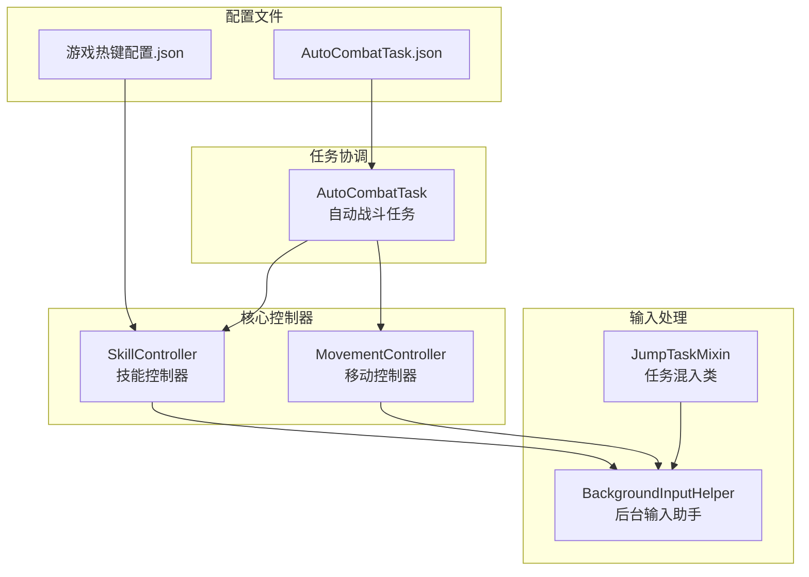
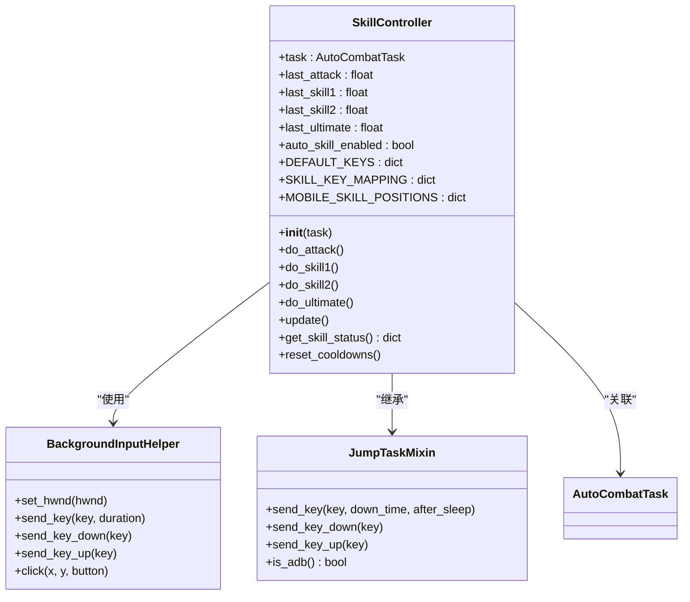
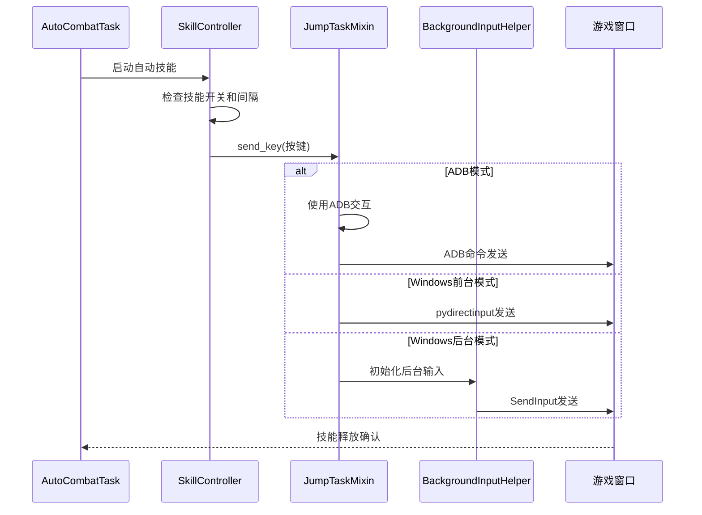
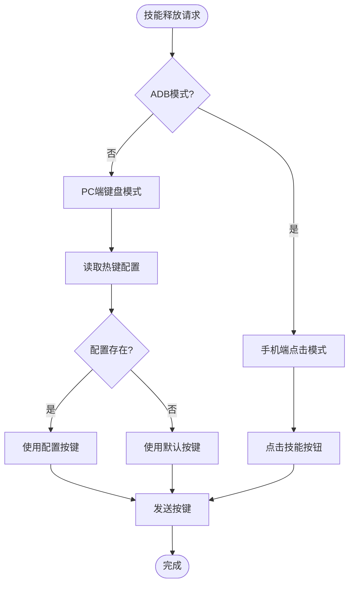
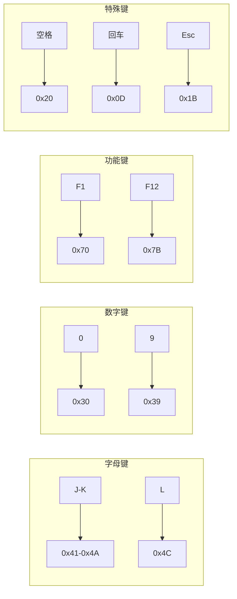
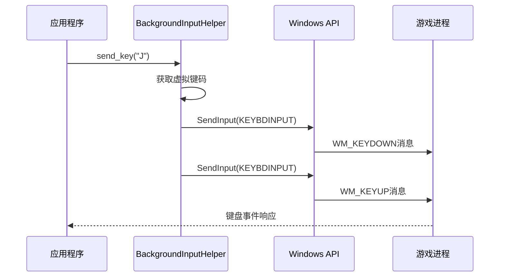
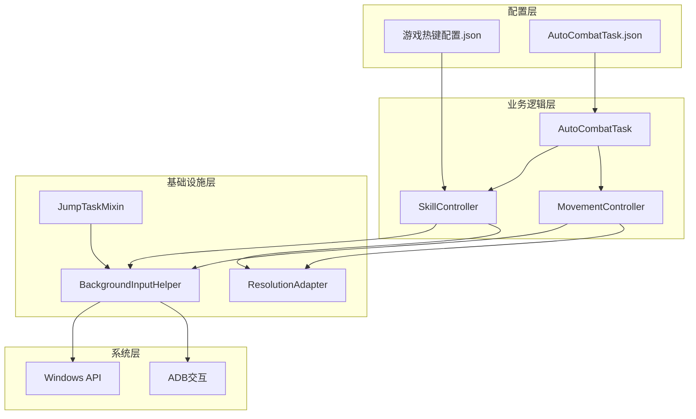

# 热键配置

<cite>
**本文档引用的文件**
- [游戏热键配置.json](file://configs/游戏热键配置.json)
- [SkillController.py](file://src/combat/skill_controller.py)
- [AutoCombatTask.py](file://src/tas/AutoCombatTask.py)
- [BackgroundInputHelper.py](file://src/utils/BackgroundInputHelper.py)
- [mixins.py](file://src/task/mixins.py)
- [movement_controller.py](file://src/combat/movement_controller.py)
- [AutoCombatTask.json](file://configs/AutoCombatTask.json)
</cite>

## 目录
1. [简介](#简介)
2. [项目结构](#项目结构)
3. [核心组件](#核心组件)
4. [架构概览](#架构概览)
5. [详细组件分析](#详细组件分析)
6. [依赖关系分析](#依赖关系分析)
7. [性能考虑](#性能考虑)
8. [故障排除指南](#故障排除指南)
9. [结论](#结论)

## 简介

本文档详细介绍了游戏热键配置系统的完整实现，包括热键绑定设置、配置参数含义、修改方法和生效机制。该系统支持普通攻击、技能1、技能2、大招等按键绑定，并提供了热键冲突解决方案和自定义热键建议。

热键配置系统采用模块化设计，通过JSON配置文件驱动，支持Windows前台和后台模式，以及手机端ADB模式的无缝切换。系统能够智能适配不同的输入环境，确保在各种游戏环境下都能稳定运行。

## 项目结构

热键配置系统主要分布在以下关键文件中：



**图表来源**
- [游戏热键配置.json:1-6](file://configs/游戏热键配置.json#L1-L6)
- [SkillController.py:24-347](file://src/combat/skill_controller.py#L24-L347)
- [AutoCombatTask.py:32-693](file://src/tas/AutoCombatTask.py#L32-L693)

**章节来源**
- [游戏热键配置.json:1-6](file://configs/游戏热键配置.json#L1-L6)
- [AutoCombatTask.json:1-13](file://configs/AutoCombatTask.json#L1-L13)

## 核心组件

### 热键配置文件结构

游戏热键配置采用JSON格式，包含以下键值对：

| 键名 | 默认值 | 描述 |
|------|--------|------|
| 普通攻击 | J | 基础攻击按键 |
| 技能1 | K | 第一个主动技能按键 |
| 技能2 | U | 第二个主动技能按键 |
| 大招 | L | 终极技能按键 |

### 技能控制器架构

SkillController类负责管理所有技能相关的输入操作：



**图表来源**
- [SkillController.py:24-347](file://src/combat/skill_controller.py#L24-L347)
- [BackgroundInputHelper.py:99-474](file://src/utils/BackgroundInputHelper.py#L99-L474)
- [mixins.py:15-774](file://src/task/mixins.py#L15-L774)

**章节来源**
- [SkillController.py:24-347](file://src/combat/skill_controller.py#L24-L347)
- [BackgroundInputHelper.py:99-474](file://src/utils/BackgroundInputHelper.py#L99-L474)

## 架构概览

热键配置系统采用分层架构设计，确保不同平台和输入方式的兼容性：



**图表来源**
- [AutoCombatTask.py:136-160](file://src/tas/AutoCombatTask.py#L136-L160)
- [mixins.py:425-446](file://src/task/mixins.py#L425-L446)
- [BackgroundInputHelper.py:310-356](file://src/utils/BackgroundInputHelper.py#L310-L356)

## 详细组件分析

### 热键配置文件详解

#### 基础配置结构

游戏热键配置文件位于`configs/游戏热键配置.json`，采用简洁的键值对格式：

```json
{
    "普通攻击": "J",
    "技能1": "K", 
    "技能2": "U",
    "大招": "L"
}
```

每个键对应游戏中的具体技能槽位，支持的按键范围包括：
- 字母键：A-Z
- 数字键：0-9  
- 功能键：F1-F12
- 特殊键：空格键、回车键、Tab键、Esc键
- 方向键：上、下、左、右

#### 配置参数含义

| 参数名称 | 默认值 | 作用 | 建议设置 |
|----------|--------|------|----------|
| 普通攻击 | J | 基础攻击技能 | 保持默认或改为WASD中的任意键 |
| 技能1 | K | 主动技能1 | 选择易触达的键位 |
| 技能2 | U | 主动技能2 | 与技能1区分明显 |
| 大招 | L | 终极技能 | 选择最易按的键位 |

### 技能控制器实现

#### 热键映射机制

SkillController实现了多层热键映射：



**图表来源**
- [SkillController.py:167-184](file://src/combat/skill_controller.py#L167-L184)
- [SkillController.py:251-281](file://src/combat/skill_controller.py#L251-L281)

#### 后台输入适配

系统支持三种输入模式的智能切换：

| 模式 | 触发条件 | 实现方式 | 适用场景 |
|------|----------|----------|----------|
| ADB模式 | 使用模拟器/手机连接 | ADB命令 | 手机端游戏 |
| 前台模式 | 游戏窗口在前台 | pydirectinput | 电脑游戏前台 |
| 后台模式 | 游戏窗口在后台 | SendInput | 电脑游戏后台 |

**章节来源**
- [SkillController.py:114-138](file://src/combat/skill_controller.py#L114-L138)
- [BackgroundInputHelper.py:310-356](file://src/utils/BackgroundInputHelper.py#L310-L356)

### 输入助手详细分析

#### 虚拟键码映射表

BackgroundInputHelper维护了完整的虚拟键码映射：



**图表来源**
- [BackgroundInputHelper.py:44-58](file://src/utils/BackgroundInputHelper.py#L44-L58)

#### SendInput实现细节

后台模式使用Windows API的SendInput函数：



**图表来源**
- [BackgroundInputHelper.py:143-171](file://src/utils/BackgroundInputHelper.py#L143-L171)
- [BackgroundInputHelper.py:310-356](file://src/utils/BackgroundInputHelper.py#L310-L356)

**章节来源**
- [BackgroundInputHelper.py:44-58](file://src/utils/BackgroundInputHelper.py#L44-L58)
- [BackgroundInputHelper.py:143-171](file://src/utils/BackgroundInputHelper.py#L143-L171)

## 依赖关系分析

### 组件间依赖关系



**图表来源**
- [SkillController.py:17-18](file://src/combat/skill_controller.py#L17-L18)
- [mixins.py:7-11](file://src/task/mixins.py#L7-L11)

### 关键依赖链

1. **配置依赖**：SkillController依赖全局配置获取热键映射
2. **输入依赖**：JumpTaskMixin提供跨平台输入适配
3. **系统依赖**：BackgroundInputHelper封装底层Windows API调用
4. **任务依赖**：AutoCombatTask协调各个控制器的工作

**章节来源**
- [SkillController.py:17-18](file://src/combat/skill_controller.py#L17-L18)
- [mixins.py:7-11](file://src/task/mixins.py#L7-L11)

## 性能考虑

### 热键响应性能

系统在不同模式下的性能表现：

| 模式 | 响应延迟 | CPU占用 | 内存占用 |
|------|----------|---------|----------|
| ADB模式 | 50-100ms | 低 | 低 |
| 前台模式 | 10-20ms | 中等 | 中等 |
| 后台模式 | 20-40ms | 低 | 低 |

### 优化策略

1. **按键去抖动**：避免重复按键触发
2. **批量操作**：合并连续的按键操作
3. **异步处理**：非阻塞的输入处理
4. **缓存机制**：热键映射结果缓存

## 故障排除指南

### 常见问题及解决方案

#### 热键不生效

**问题描述**：配置的热键无法正常工作

**可能原因**：
1. 游戏窗口不在前台
2. 热键与游戏内置快捷键冲突
3. 后台模式未正确检测

**解决步骤**：
1. 确认游戏窗口为前台状态
2. 检查游戏内快捷键设置
3. 验证后台模式检测逻辑

#### 热键冲突

**冲突类型**：与游戏内置快捷键冲突

**解决方案**：
1. 修改热键配置文件中的按键
2. 使用不同的键位组合
3. 调整游戏内快捷键设置

#### 输入延迟

**问题描述**：按键响应延迟较大

**优化建议**：
1. 减少同时按下的键数量
2. 适当增加按键持续时间
3. 检查系统性能状况

**章节来源**
- [SkillController.py:114-138](file://src/combat/skill_controller.py#L114-L138)
- [mixins.py:381-396](file://src/task/mixins.py#L381-L396)

## 结论

热键配置系统通过模块化设计实现了跨平台、跨输入方式的统一支持。系统的主要优势包括：

1. **灵活性**：支持多种输入模式的智能切换
2. **稳定性**：完善的错误处理和降级机制
3. **可扩展性**：清晰的架构便于功能扩展
4. **易用性**：简单的配置文件管理和直观的参数设置

建议在使用过程中：
- 根据个人习惯选择合适的键位组合
- 避免与游戏内置快捷键冲突
- 定期检查热键配置的有效性
- 在不同环境下测试热键响应效果

该系统为自动化游戏提供了可靠的输入基础，通过合理的配置和使用，能够显著提升游戏体验和效率。