# 界面配置

<cite>
**本文引用的文件**
- [main.py](file://main.py)
- [config.py](file://config.py)
- [configs/main_window.json](file://configs/main_window.json)
- [configs/ui_config.json](file://configs/ui_config.json)
- [configs/Basic Options.json](file://configs/Basic Options.json)
- [configs/基础选项.json](file://configs/基础选项.json)
- [configs/devices.json](file://configs/devices.json)
- [src/gui/log_panel.py](file://src/gui/log_panel.py)
- [src/gui/log_tab.py](file://src/gui/log_tab.py)
- [src/utils/BackgroundManager.py](file://src/utils/BackgroundManager.py)
- [src/utils/PseudoMinimizeHelper.py](file://src/utils/PseudoMinimizeHelper.py)
- [src/utils/ResolutionAdapter.py](file://src/utils/ResolutionAdapter.py)
- [src/utils/DeviceDetector.py](file://src/utils/DeviceDetector.py)
- [src/task/MainWindowTask.py](file://src/task/MainWindowTask.py)
- [src/constants/features.py](file://src/constants/features.py)
- [src/tutorial/tutorial_detector.py](file://src/tutorial/tutorial_detector.py)
- [assets/coco_detection.json](file://assets/coco_detection.json)
</cite>

## 更新摘要
**变更内容**
- 新增新手教程UI元素配置章节，涵盖back.png、comfirm.png、end01.png、end02.png的配置和使用
- 更新UI元素检测机制说明，包括COCO检测框架的应用
- 增强界面元素自定义和优化指南，提供针对新UI元素的最佳实践

## 目录
1. [简介](#简介)
2. [项目结构](#项目结构)
3. [核心组件](#核心组件)
4. [架构总览](#架构总览)
5. [详细组件分析](#详细组件分析)
6. [UI元素检测与配置](#ui元素检测与配置)
7. [依赖关系分析](#依赖关系分析)
8. [性能考量](#性能考量)
9. [故障排查指南](#故障排查指南)
10. [结论](#结论)
11. [附录](#附录)

## 简介
本文件系统性地阐述本项目的界面配置体系，覆盖主窗口配置、基本选项配置、界面元素布局与样式、以及配置的加载与应用机制。内容面向不同技术背景的读者，既提供高层概览，也给出代码级的结构与数据流说明，并辅以可视化图表帮助理解。本次更新特别关注新增的UI元素配置，包括新手教程相关的back.png、comfirm.png、end01.png、end02.png等界面元素的参数调整和优化。

## 项目结构
本项目采用"配置文件 + GUI 组件 + 工具类"的分层组织方式：
- 配置层：集中于 configs 目录，包含主窗口、UI 主题、基本选项、设备偏好等 JSON 配置文件。
- 应用层：通过 config.py 定义全局配置项与默认值，作为 OK 框架的入口配置。
- GUI 层：src/gui 提供日志面板与日志标签页，负责实时日志展示与交互。
- 工具层：src/utils 提供后台模式、伪最小化、分辨率适配、设备检测等能力，支撑界面行为与窗口管理。
- 任务层：src/task 提供主窗口任务等，负责窗口检测、截图、分辨率与后台模式检查等。
- **新增**：UI元素检测层：通过 assets/coco_detection.json 和 src/constants/features.py 管理界面元素的检测配置。

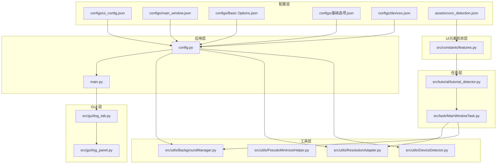

**图表来源**
- [config.py:68-148](file://config.py#L68-L148)
- [main.py:99-107](file://main.py#L99-L107)
- [src/gui/log_tab.py:15-70](file://src/gui/log_tab.py#L15-L70)
- [src/gui/log_panel.py:58-388](file://src/gui/log_panel.py#L58-L388)
- [src/utils/BackgroundManager.py:7-155](file://src/utils/BackgroundManager.py#L7-L155)
- [src/utils/PseudoMinimizeHelper.py:13-238](file://src/utils/PseudoMinimizeHelper.py#L13-L238)
- [src/utils/ResolutionAdapter.py:4-163](file://src/utils/ResolutionAdapter.py#L4-L163)
- [src/utils/DeviceDetector.py:11-149](file://src/utils/DeviceDetector.py#L11-L149)
- [src/task/MainWindowTask.py:49-215](file://src/task/MainWindowTask.py#L49-L215)
- [src/constants/features.py:83-88](file://src/constants/features.py#L83-L88)
- [src/tutorial/tutorial_detector.py:565-694](file://src/tutorial/tutorial_detector.py#L565-L694)

**章节来源**
- [config.py:68-148](file://config.py#L68-L148)
- [main.py:99-107](file://main.py#L99-L107)

## 核心组件
- UI 主题与外观配置：ui_config.json 提供材质、更新、主窗口 DPI/语言/Mica、QFluentWidgets 主题色与主题模式等。
- 主窗口状态：main_window.json 记录上次版本号，用于引导升级提示或迁移逻辑。
- 基本选项：Basic Options.json 与 基础选项.json 提供跨语言的基本行为开关（如后台模式、伪最小化、静音、触发间隔、快捷键等）。
- 设备偏好：devices.json 记录首选设备、PC 可执行路径、捕获方式等。
- **新增**：UI元素检测配置：coco_detection.json 管理界面元素的标注和分类，支持back.png、comfirm.png、end01.png、end02.png等新手教程UI元素的精确检测。
- **新增**：特征常量定义：features.py 提供统一的特征名称常量，确保代码中使用的特征名称与配置文件一致。
- 日志面板：LogPanel 提供实时日志展示、过滤、搜索、暂停/恢复、自动滚动、清空等交互。
- 后台管理：BackgroundManager 与 PseudoMinimizeHelper 协作，实现后台模式、伪最小化、前台检测、静音判断等。
- 分辨率适配：ResolutionAdapter 提供缩放、相对坐标、比例校验与推荐尺寸建议。
- 设备检测：DeviceDetector 提供 PC 游戏窗口与 ADB 设备的智能检测与默认选择。
- 主窗口任务：MainWindowTask 负责窗口检测、截图测试、分辨率与后台模式检查，并输出状态日志。
- **新增**：教程检测器：tutorial_detector.py 实现新手教程阶段的UI元素检测和自动化操作。

**章节来源**
- [configs/ui_config.json:1-17](file://configs/ui_config.json#L1-L17)
- [configs/main_window.json:1-3](file://configs/main_window.json#L1-L3)
- [configs/Basic Options.json:1-13](file://configs/Basic Options.json#L1-L13)
- [configs/基础选项.json:1-11](file://configs/基础选项.json#L1-L11)
- [configs/devices.json:1-7](file://configs/devices.json#L1-L7)
- [assets/coco_detection.json:87-110](file://assets/coco_detection.json#L87-L110)
- [src/constants/features.py:83-88](file://src/constants/features.py#L83-L88)
- [src/gui/log_panel.py:58-388](file://src/gui/log_panel.py#L58-L388)
- [src/utils/BackgroundManager.py:7-155](file://src/utils/BackgroundManager.py#L7-L155)
- [src/utils/PseudoMinimizeHelper.py:13-238](file://src/utils/PseudoMinimizeHelper.py#L13-L238)
- [src/utils/ResolutionAdapter.py:4-163](file://src/utils/ResolutionAdapter.py#L4-L163)
- [src/utils/DeviceDetector.py:11-149](file://src/utils/DeviceDetector.py#L11-L149)
- [src/task/MainWindowTask.py:49-215](file://src/task/MainWindowTask.py#L49-L215)
- [src/tutorial/tutorial_detector.py:565-694](file://src/tutorial/tutorial_detector.py#L565-L694)

## 架构总览
下图展示了从配置文件到 GUI 与工具链的整体调用关系，以及配置如何驱动界面行为与窗口管理。新增的UI元素检测架构通过COCO检测框架实现了对back.png、comfirm.png、end01.png、end02.png等界面元素的精确识别。

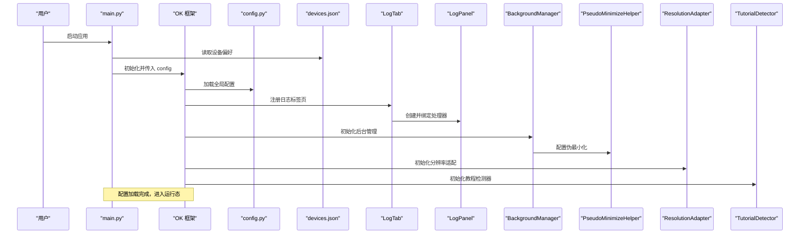

**图表来源**
- [main.py:99-107](file://main.py#L99-L107)
- [config.py:68-148](file://config.py#L68-L148)
- [configs/devices.json:1-7](file://configs/devices.json#L1-L7)
- [src/gui/log_tab.py:15-70](file://src/gui/log_tab.py#L15-L70)
- [src/gui/log_panel.py:58-388](file://src/gui/log_panel.py#L58-L388)
- [src/utils/BackgroundManager.py:7-155](file://src/utils/BackgroundManager.py#L7-L155)
- [src/utils/PseudoMinimizeHelper.py:13-238](file://src/utils/PseudoMinimizeHelper.py#L13-L238)
- [src/utils/ResolutionAdapter.py:4-163](file://src/utils/ResolutionAdapter.py#L4-L163)
- [src/tutorial/tutorial_detector.py:565-694](file://src/tutorial/tutorial_detector.py#L565-L694)

## 详细组件分析

### UI 主题与外观配置（ui_config.json）
- 材质（Material）：包含 AcrylicBlurRadius，用于窗口模糊效果半径。
- 更新（Update）：CheckUpdateAtStartUp 控制启动时检查更新。
- 主窗口（MainWindow）：DpiScale（自动）、Language（语言）、MicaEnabled（是否启用 Mica 背景）。
- QFluentWidgets：ThemeColor（主题色）、ThemeMode（明/暗）。
- 加载与应用：config.py 将这些键映射到 OK 框架的全局配置中，OK 在启动时读取并应用到界面主题与窗口外观。

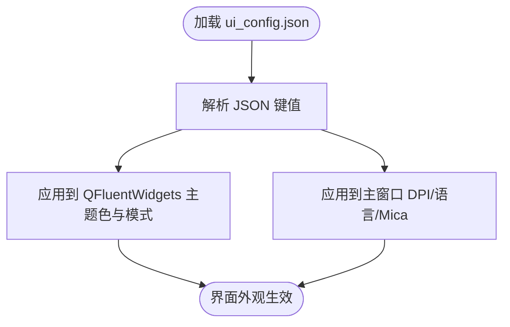

**图表来源**
- [configs/ui_config.json:1-17](file://configs/ui_config.json#L1-L17)
- [config.py:68-148](file://config.py#L68-L148)

**章节来源**
- [configs/ui_config.json:1-17](file://configs/ui_config.json#L1-L17)
- [config.py:68-148](file://config.py#L68-L148)

### 主窗口状态（main_window.json）
- last_version：记录上次版本号，可用于引导升级提示或迁移逻辑。
- 用途：配合版本比较与引导页面，确保用户获得最新特性与修复。

**章节来源**
- [configs/main_window.json:1-3](file://configs/main_window.json#L1-L3)

### 基本选项配置（Basic Options.json 与 基础选项.json）
- 跨语言键名：英文与中文键名并存，便于多语言环境切换。
- 关键项：
  - 后台模式、最小化时伪最小化、后台时静音游戏
  - 自动调整游戏窗口大小、游戏退出时关闭程序
  - 触发间隔（毫秒）、启动/停止快捷键
  - Windows 捕获方式（WGC/Blt）
- 加载与回退：BackgroundManager 支持按中文/英文键名回退读取，提升兼容性。

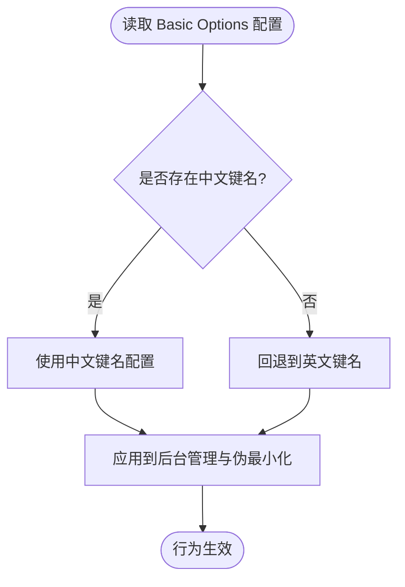

**图表来源**
- [src/utils/BackgroundManager.py:25-41](file://src/utils/BackgroundManager.py#L25-L41)
- [configs/Basic Options.json:1-13](file://configs/Basic Options.json#L1-L13)
- [configs/基础选项.json:1-11](file://configs/基础选项.json#L1-L11)

**章节来源**
- [src/utils/BackgroundManager.py:18-41](file://src/utils/BackgroundManager.py#L18-L41)
- [configs/Basic Options.json:1-13](file://configs/Basic Options.json#L1-L13)
- [configs/基础选项.json:1-11](file://configs/基础选项.json#L1-L11)

### 设备偏好（devices.json）
- preferred：首选设备标识（如 leidian0）。
- pc_full_path：PC 版可执行路径。
- capture：捕获方式（如 adb）。
- selected_exe/selected_hwnd：当前选中的可执行文件与窗口句柄。
- 智能设备选择：main.py 中的 smart_device_selection 会根据 DeviceDetector 的检测结果自动更新 preferred。

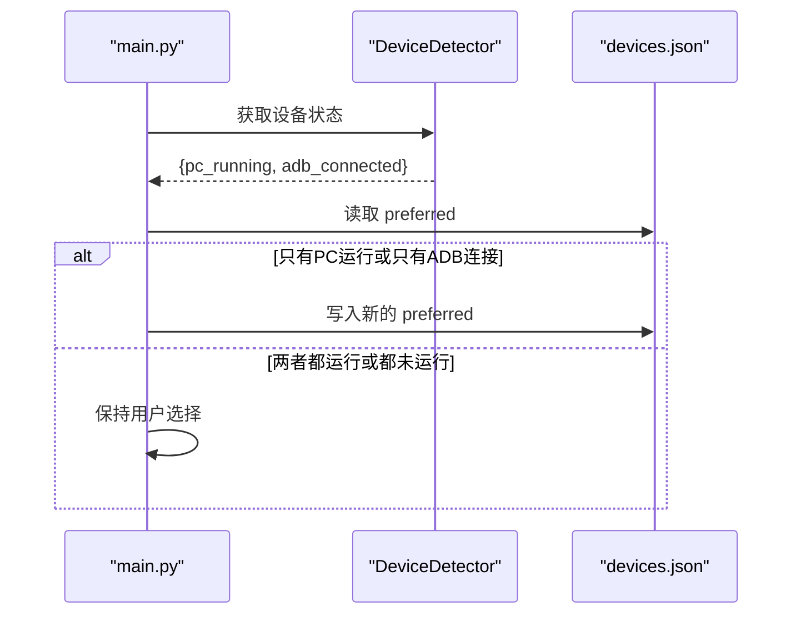

**图表来源**
- [main.py:54-95](file://main.py#L54-L95)
- [src/utils/DeviceDetector.py:112-149](file://src/utils/DeviceDetector.py#L112-L149)
- [configs/devices.json:1-7](file://configs/devices.json#L1-L7)

**章节来源**
- [main.py:54-95](file://main.py#L54-L95)
- [src/utils/DeviceDetector.py:112-149](file://src/utils/DeviceDetector.py#L112-L149)
- [configs/devices.json:1-7](file://configs/devices.json#L1-L7)

### 日志面板与标签页（LogPanel 与 LogTab）
- LogPanel：提供实时日志显示、级别过滤、关键词搜索、暂停/恢复、自动滚动、清空、颜色标记等。
- LogTab：在 OK 框架的导航中注册为底部标签页，嵌入 LogPanel 并设置日志处理器。
- 样式与布局：LogPanel 使用等宽字体、深色背景与彩色级别标记；工具栏包含级别选择、搜索框与控制按钮。

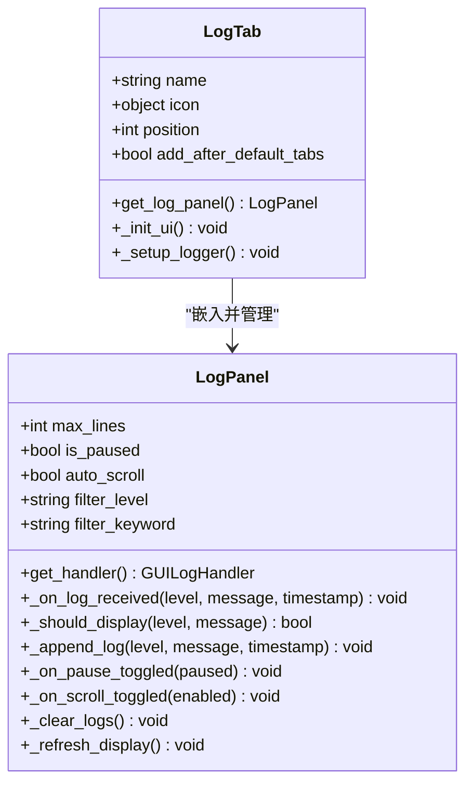

**图表来源**
- [src/gui/log_panel.py:58-388](file://src/gui/log_panel.py#L58-L388)
- [src/gui/log_tab.py:15-70](file://src/gui/log_tab.py#L15-L70)

**章节来源**
- [src/gui/log_panel.py:58-388](file://src/gui/log_panel.py#L58-L388)
- [src/gui/log_tab.py:15-70](file://src/gui/log_tab.py#L15-L70)

### 后台模式与伪最小化（BackgroundManager 与 PseudoMinimizeHelper）
- BackgroundManager：维护后台模式开关、前台检测、静音判断、伪最小化开关与状态。
- PseudoMinimizeHelper：负责窗口伪最小化/还原、位置保存与恢复、前台可见性保障。
- 集成点：MainWindowTask 在运行时调用后台模式检查与截图测试，确保在后台也能稳定工作。

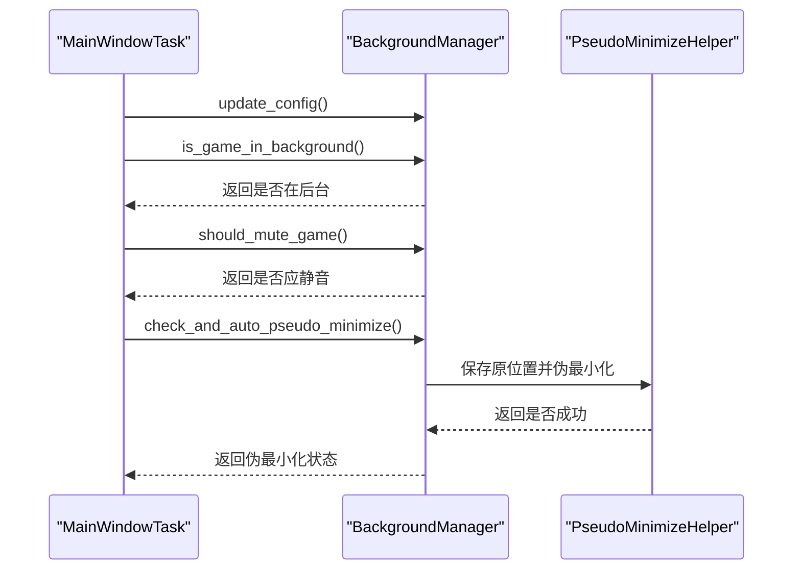

**图表来源**
- [src/task/MainWindowTask.py:167-193](file://src/task/MainWindowTask.py#L167-L193)
- [src/utils/BackgroundManager.py:82-121](file://src/utils/BackgroundManager.py#L82-L121)
- [src/utils/PseudoMinimizeHelper.py:123-163](file://src/utils/PseudoMinimizeHelper.py#L123-L163)

**章节来源**
- [src/task/MainWindowTask.py:167-193](file://src/task/MainWindowTask.py#L167-L193)
- [src/utils/BackgroundManager.py:82-121](file://src/utils/BackgroundManager.py#L82-L121)
- [src/utils/PseudoMinimizeHelper.py:123-163](file://src/utils/PseudoMinimizeHelper.py#L123-L163)

### 分辨率适配（ResolutionAdapter）
- 功能：计算缩放因子、相对坐标、比例校验、推荐尺寸。
- 配置来源：config.py 中 reference_resolution 与 supported_resolution。
- 使用场景：MainWindowTask 输出分辨率信息与建议尺寸，结合 ResolutionAdapter 提供的推荐尺寸进行提示。

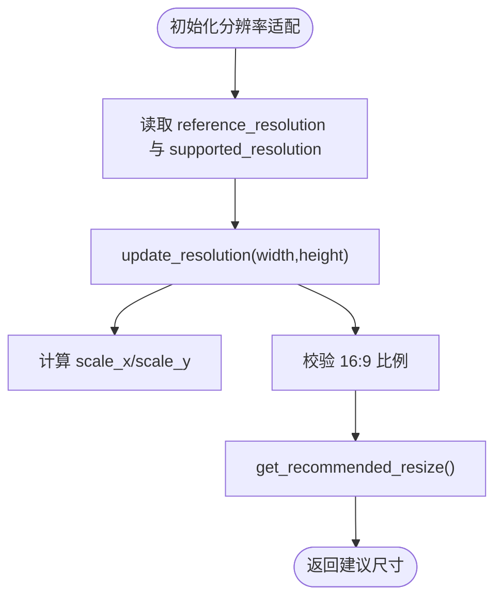

**图表来源**
- [src/utils/ResolutionAdapter.py:19-143](file://src/utils/ResolutionAdapter.py#L19-L143)
- [config.py:108-117](file://config.py#L108-L117)
- [src/task/MainWindowTask.py:149-166](file://src/task/MainWindowTask.py#L149-L166)

**章节来源**
- [src/utils/ResolutionAdapter.py:19-143](file://src/utils/ResolutionAdapter.py#L19-L143)
- [config.py:108-117](file://config.py#L108-L117)
- [src/task/MainWindowTask.py:149-166](file://src/task/MainWindowTask.py#L149-L166)

### 主窗口任务（MainWindowTask）
- 功能：打印功能索引、检测游戏窗口、截图测试、分辨率检查、后台模式检查。
- 日志：输出窗口标题、截图尺寸、分辨率信息、后台模式状态与建议。
- 状态管理：提供功能状态查询与更新接口，便于 UI 展示与控制。

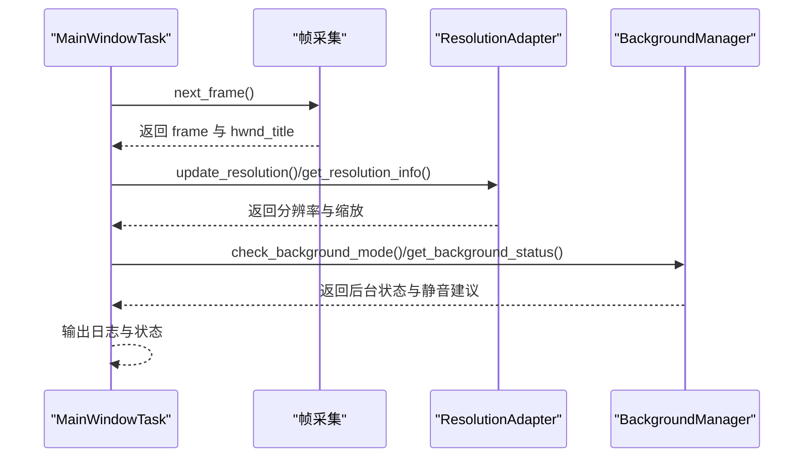

**图表来源**
- [src/task/MainWindowTask.py:121-193](file://src/task/MainWindowTask.py#L121-L193)
- [src/utils/ResolutionAdapter.py:34-99](file://src/utils/ResolutionAdapter.py#L34-L99)
- [src/utils/BackgroundManager.py:82-92](file://src/utils/BackgroundManager.py#L82-L92)

**章节来源**
- [src/task/MainWindowTask.py:121-193](file://src/task/MainWindowTask.py#L121-L193)

## UI元素检测与配置

### COCO检测框架配置
新增的UI元素检测通过COCO检测框架实现，支持back.png、comfirm.png、end01.png、end02.png等新手教程界面元素的精确识别。

- **图像标注**：coco_detection.json 中包含14个新增UI元素的标注信息，每个元素都有对应的ID、文件名、尺寸和边界框。
- **类别定义**：tutorial_ui类别下包含tutorial_back_button、tutorial_confirm_button、tutorial_end01、tutorial_end02四个新类别。
- **边界框标注**：每个UI元素都有精确的边界框坐标，用于目标检测和定位。

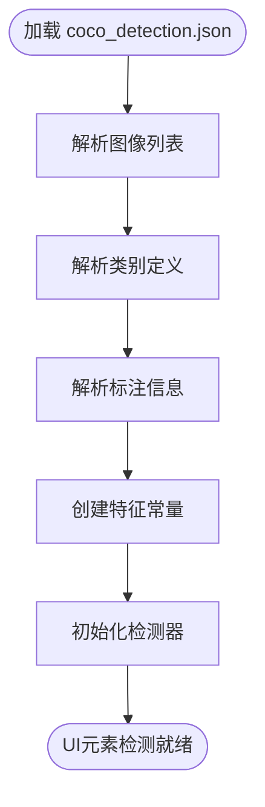

**图表来源**
- [assets/coco_detection.json:87-110](file://assets/coco_detection.json#L87-L110)
- [assets/coco_detection.json:283-287](file://assets/coco_detection.json#L283-L287)
- [assets/coco_detection.json:428-457](file://assets/coco_detection.json#L428-L457)

**章节来源**
- [assets/coco_detection.json:87-110](file://assets/coco_detection.json#L87-L110)
- [assets/coco_detection.json:283-287](file://assets/coco_detection.json#L283-L287)
- [assets/coco_detection.json:428-457](file://assets/coco_detection.json#L428-L457)

### 特征常量定义
src/constants/features.py 提供统一的特征名称常量，确保代码中使用的特征名称与配置文件一致。

- **教程相关特征**：
  - TUTORIAL_BACK_BUTTON：'tutorial_back_button'
  - TUTORIAL_CONFIRM_BUTTON：'tutorial_confirm_button'
  - TUTORIAL_END01：'tutorial_end01'
  - TUTORIAL_END02：'tutorial_end02'

- **统一管理**：所有特征名称必须与 assets/coco_detection.json 中的 categories 定义一致，不可实例化，仅作为常量容器使用。

**章节来源**
- [src/constants/features.py:83-88](file://src/constants/features.py#L83-L88)

### 新手教程UI元素检测
src/tutorial/tutorial_detector.py 实现了对新增UI元素的检测和自动化操作。

- **第一阶段结束检测**：同时检测 end01.png 和 end02.png，实现新手教程的自动化推进。
- **检测阈值**：使用0.6的阈值进行目标检测，平衡准确性和鲁棒性。
- **自动化操作**：检测到 end02.png（开始对战按钮）时自动点击，实现完全自动化的教程流程。

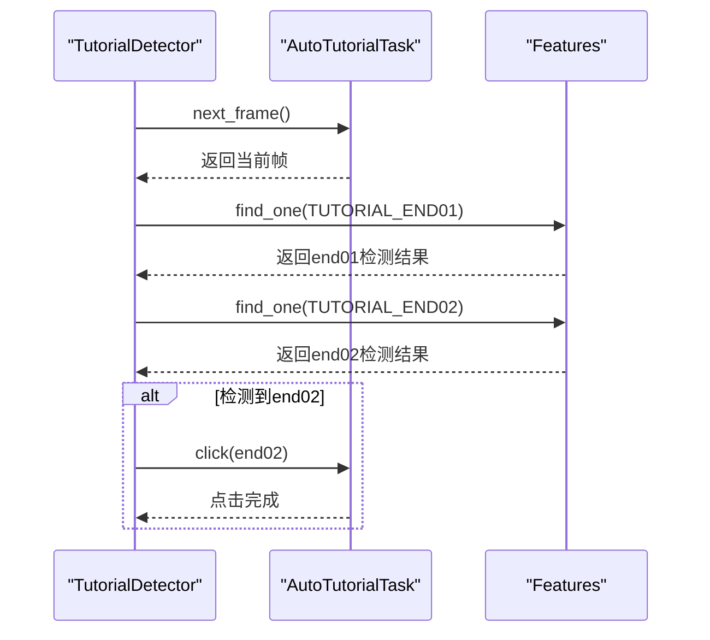

**图表来源**
- [src/tutorial/tutorial_detector.py:628-649](file://src/tutorial/tutorial_detector.py#L628-L649)
- [src/constants/features.py:87-88](file://src/constants/features.py#L87-L88)

**章节来源**
- [src/tutorial/tutorial_detector.py:565-694](file://src/tutorial/tutorial_detector.py#L565-L694)
- [src/constants/features.py:83-88](file://src/constants/features.py#L83-L88)

### UI元素参数优化建议
针对新增的back.png、comfirm.png、end01.png、end02.png等UI元素，建议以下参数优化：

- **检测阈值调整**：根据实际分辨率和游戏窗口缩放比例，适当调整检测阈值（建议0.6-0.8范围）
- **边界框优化**：在coco_detection.json中提供更精确的边界框坐标，提高检测精度
- **多分辨率适配**：为不同分辨率提供对应的UI元素尺寸参数，确保在各种分辨率下都能准确定位
- **容错机制**：实现检测失败时的重试机制和备用检测方案

**章节来源**
- [assets/coco_detection.json:428-457](file://assets/coco_detection.json#L428-L457)
- [src/tutorial/tutorial_detector.py:628-649](file://src/tutorial/tutorial_detector.py#L628-L649)

## 依赖关系分析
- 配置文件到应用层：ui_config.json、main_window.json、Basic Options.json、基础选项.json、devices.json 通过 config.py 聚合为 OK 框架的全局配置。
- 应用层到 GUI：OK 框架读取 config.py 并创建 LogTab 与 LogPanel，后者负责日志渲染与交互。
- 应用层到工具层：OK 框架初始化 BackgroundManager、PseudoMinimizeHelper、ResolutionAdapter，供任务与界面使用。
- **新增**：UI元素检测依赖：coco_detection.json 通过 features.py 提供的特征常量，被 tutorial_detector.py 用于UI元素检测。
- 任务层到工具层：MainWindowTask 依赖 ResolutionAdapter 与 BackgroundManager 输出状态与建议。

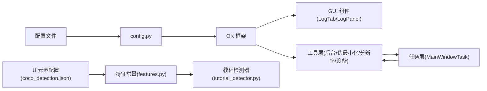

**图表来源**
- [config.py:68-148](file://config.py#L68-L148)
- [src/gui/log_tab.py:15-70](file://src/gui/log_tab.py#L15-L70)
- [src/gui/log_panel.py:58-388](file://src/gui/log_panel.py#L58-L388)
- [src/utils/BackgroundManager.py:7-155](file://src/utils/BackgroundManager.py#L7-L155)
- [src/utils/PseudoMinimizeHelper.py:13-238](file://src/utils/PseudoMinimizeHelper.py#L13-L238)
- [src/utils/ResolutionAdapter.py:4-163](file://src/utils/ResolutionAdapter.py#L4-L163)
- [src/utils/DeviceDetector.py:11-149](file://src/utils/DeviceDetector.py#L11-L149)
- [src/task/MainWindowTask.py:49-215](file://src/task/MainWindowTask.py#L49-L215)
- [assets/coco_detection.json:87-110](file://assets/coco_detection.json#L87-L110)
- [src/constants/features.py:83-88](file://src/constants/features.py#L83-L88)
- [src/tutorial/tutorial_detector.py:565-694](file://src/tutorial/tutorial_detector.py#L565-L694)

**章节来源**
- [config.py:68-148](file://config.py#L68-L148)

## 性能考量
- 触发间隔：Basic Options.json 与 基础选项.json 提供触发间隔配置，增大间隔可降低 CPU/GPU 使用率。
- 捕获方式：devices.json 的 capture 字段可选择 adb 等捕获方式，影响性能与稳定性。
- 日志开销：LogPanel 默认最大行数限制与自动滚动，避免大量日志导致 UI 卡顿。
- 后台模式：启用后台模式与伪最小化可在后台继续运行，但需注意系统策略与权限。
- **新增**：UI元素检测性能：COCO检测框架的性能取决于图像尺寸和检测阈值，建议在高分辨率下适当降低检测频率。

[本节为通用指导，无需具体文件分析]

## 故障排查指南
- 无法检测到游戏窗口
  - 确认游戏标题关键词与模拟器关键词未被排除。
  - 检查 devices.json 的 preferred 与 selected_hwnd 是否正确。
  - 参考 MainWindowTask 的窗口检测与日志输出。
- 后台截图异常
  - 检查 Basic Options 与 基础选项 中的后台模式与伪最小化开关。
  - 确认 BackgroundManager 的 is_game_in_background 与 should_mute_game 返回值。
- 分辨率不匹配
  - 查看 MainWindowTask 输出的分辨率与建议尺寸，结合 ResolutionAdapter 的推荐尺寸进行调整。
- 日志面板无输出
  - 确认 LogTab 已注册并添加了 GUILogHandler。
  - 检查日志级别过滤与关键词过滤设置。
- **新增**：UI元素检测失败
  - 检查coco_detection.json中的标注是否正确，边界框坐标是否准确。
  - 调整检测阈值，确保在当前分辨率下能够准确定位。
  - 确认features.py中的特征名称与coco_detection.json中的类别名称一致。

**章节来源**
- [src/task/MainWindowTask.py:121-193](file://src/task/MainWindowTask.py#L121-L193)
- [src/utils/BackgroundManager.py:43-92](file://src/utils/BackgroundManager.py#L43-L92)
- [src/utils/ResolutionAdapter.py:121-143](file://src/utils/ResolutionAdapter.py#L121-L143)
- [src/gui/log_tab.py:47-66](file://src/gui/log_tab.py#L47-L66)
- [assets/coco_detection.json:428-457](file://assets/coco_detection.json#L428-L457)
- [src/constants/features.py:83-88](file://src/constants/features.py#L83-L88)

## 结论
本项目的界面配置体系以 JSON 配置文件为核心，通过 config.py 聚合并注入 OK 框架，再由 GUI 组件与工具层协同实现主题外观、窗口行为与后台模式等能力。新增的UI元素检测架构通过COCO检测框架实现了对back.png、comfirm.png、end01.png、end02.png等新手教程界面元素的精确识别和自动化操作。基本选项与设备偏好提供了灵活的用户定制空间，而日志面板与任务层则确保了运行时的可观测性与可控性。建议在部署时结合实际硬件与系统策略，合理设置触发间隔、捕获方式与后台模式，同时针对新增UI元素进行参数优化，以获得最佳体验。

[本节为总结，无需具体文件分析]

## 附录
- 配置文件路径与用途
  - configs/ui_config.json：UI 主题与外观配置
  - configs/main_window.json：主窗口状态记录
  - configs/Basic Options.json / 基础选项.json：基本行为选项（多语言键名）
  - configs/devices.json：设备偏好与捕获方式
  - **新增**：assets/coco_detection.json：UI元素检测配置
- 关键类与职责
  - LogPanel：实时日志展示与交互
  - LogTab：日志标签页集成
  - BackgroundManager / PseudoMinimizeHelper：后台模式与伪最小化
  - ResolutionAdapter：分辨率适配与建议
  - DeviceDetector：设备状态检测与智能选择
  - MainWindowTask：窗口检测与状态输出
  - **新增**：TutorialDetector：新手教程UI元素检测与自动化
  - **新增**：Features：UI元素特征常量定义
- **新增**：UI元素检测参数
  - back.png：tutorial_back_button，尺寸177×38像素
  - comfirm.png：tutorial_confirm_button，尺寸166×44像素
  - end01.png：tutorial_end01，尺寸354×32像素
  - end02.png：tutorial_end02，尺寸147×40像素

[本节为概览，无需具体文件分析]