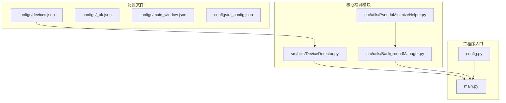
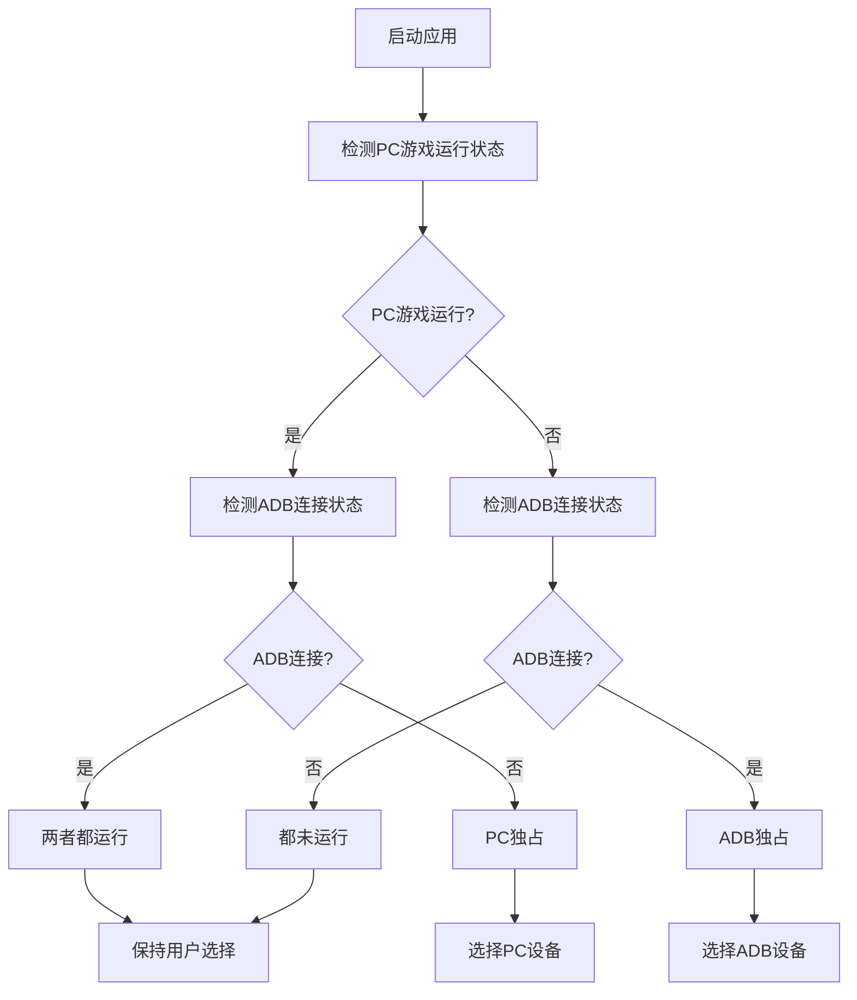
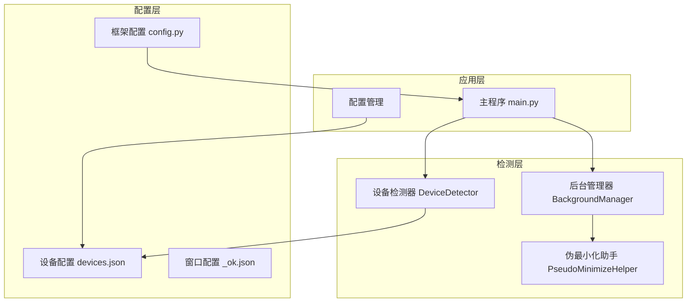
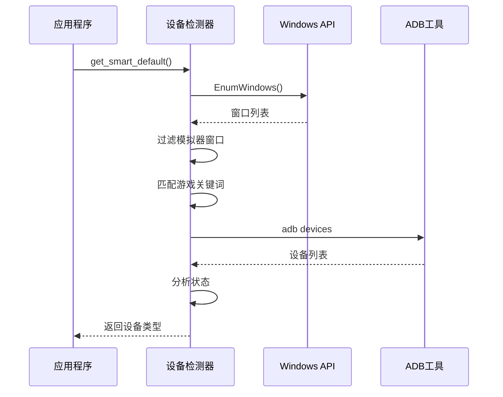
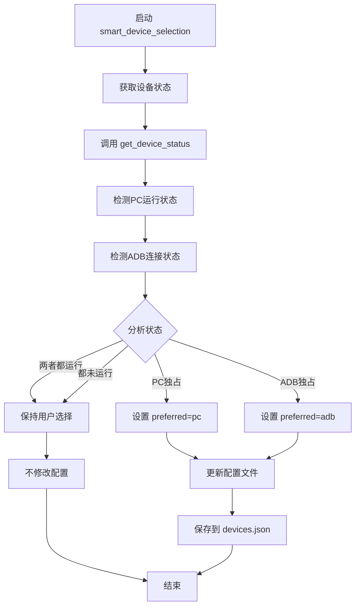
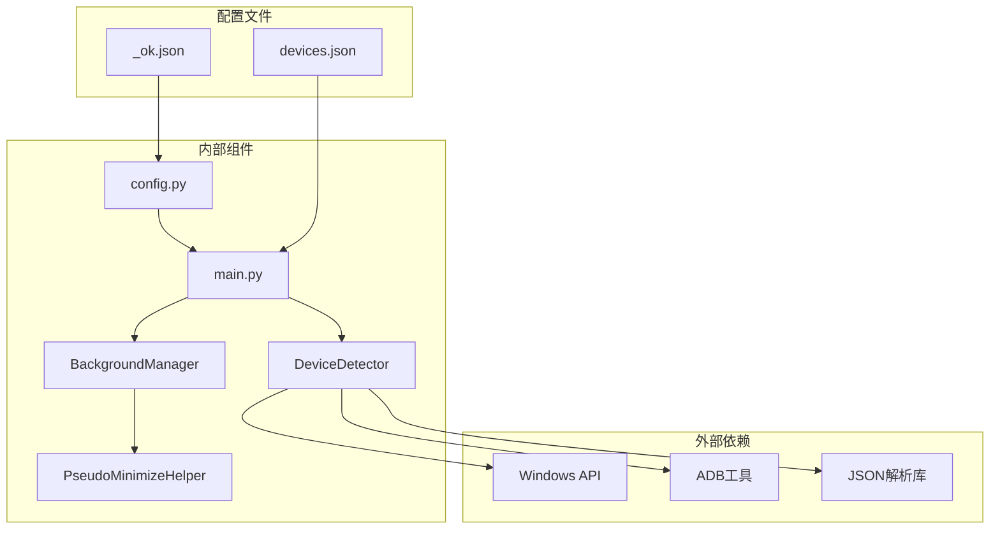

# 设备配置

<cite>
**本文档引用的文件**
- [devices.json](file://configs/devices.json)
- [DeviceDetector.py](file://src/utils/DeviceDetector.py)
- [main.py](file://main.py)
- [config.py](file://config.py)
- [_ok.json](file://configs/_ok.json)
- [BackgroundManager.py](file://src/utils/BackgroundManager.py)
- [PseudoMinimizeHelper.py](file://src/utils/PseudoMinimizeHelper.py)
</cite>

## 目录
1. [简介](#简介)
2. [项目结构](#项目结构)
3. [核心组件](#核心组件)
4. [架构概览](#架构概览)
5. [详细组件分析](#详细组件分析)
6. [依赖关系分析](#依赖关系分析)
7. [性能考虑](#性能考虑)
8. [故障排除指南](#故障排除指南)
9. [结论](#结论)

## 简介

设备配置文件devices.json是漫画群星：大集结自动化工具的核心配置文件，负责管理PC版游戏和Android模拟器的设备选择、截图捕获方式以及相关参数设置。该配置文件支持智能设备检测和自动切换功能，能够根据当前运行环境自动选择最适合的设备类型。

## 项目结构

设备配置相关的文件组织结构如下：



**图表来源**
- [devices.json:1-7](file://configs/devices.json#L1-L7)
- [DeviceDetector.py:1-149](file://src/utils/DeviceDetector.py#L1-L149)
- [main.py:54-106](file://main.py#L54-L106)

**章节来源**
- [devices.json:1-7](file://configs/devices.json#L1-L7)
- [config.py:68-148](file://config.py#L68-L148)

## 核心组件

### 设备配置文件结构

devices.json文件采用JSON格式，包含以下关键字段：

| 字段名称 | 类型 | 必需 | 默认值 | 描述 |
|---------|------|------|--------|------|
| preferred | string | 是 | - | 首选设备类型，可选值：'pc' 或 'adb' |
| pc_full_path | string | 否 | 空字符串 | PC版游戏完整路径 |
| capture | string | 否 | 'adb' | 截图捕获方式，可选值：'adb' 或 'wgc' |
| selected_exe | string | 否 | 空字符串 | 选中的可执行文件路径 |
| selected_hwnd | integer | 否 | 0 | 选中窗口的句柄值 |

### 设备检测机制

系统实现了智能设备检测机制，能够自动判断当前运行环境并选择最优设备：



**图表来源**
- [DeviceDetector.py:113-134](file://src/utils/DeviceDetector.py#L113-L134)

**章节来源**
- [DeviceDetector.py:28-134](file://src/utils/DeviceDetector.py#L28-L134)

## 架构概览

设备配置系统的整体架构采用分层设计，各组件职责明确：



**图表来源**
- [main.py:54-106](file://main.py#L54-L106)
- [DeviceDetector.py:11-17](file://src/utils/DeviceDetector.py#L11-L17)
- [BackgroundManager.py:154-155](file://src/utils/BackgroundManager.py#L154-L155)

## 详细组件分析

### 设备检测器 (DeviceDetector)

设备检测器是整个系统的核心组件，负责检测PC版游戏和模拟器的连接状态：

#### 关键特性

1. **PC游戏检测**：通过Windows API枚举所有窗口，匹配游戏标题关键词
2. **模拟器检测**：使用ADB工具检测Android设备连接状态
3. **智能选择**：根据检测结果自动选择最优设备

#### 检测算法



**图表来源**
- [DeviceDetector.py:28-134](file://src/utils/DeviceDetector.py#L28-L134)

#### 检测关键词配置

| 类型 | 关键词列表 | 用途 |
|------|-----------|------|
| PC游戏 | ['漫画群星：大集结'] | 精确匹配游戏窗口标题 |
| 排除 | ['自动化工具', 'Auto', '自动化', '工具'] | 避免误判工具窗口 |
| 模拟器 | ['MuMu', '雷电', '夜神', 'BlueStacks', 'Nox', 'LDPlayer', '模拟器'] | 识别各种模拟器 |

**章节来源**
- [DeviceDetector.py:19-27](file://src/utils/DeviceDetector.py#L19-L27)

### 主程序集成

主程序实现了智能设备选择功能，在应用启动时自动检测并更新设备配置：

#### 智能选择流程



**图表来源**
- [main.py:54-95](file://main.py#L54-L95)

**章节来源**
- [main.py:54-106](file://main.py#L54-L106)

### 后台管理模式

系统支持复杂的后台管理模式，确保在窗口最小化或被遮挡时仍能正常工作：

#### 后台模式工作原理

```mermaid
stateDiagram-v2
[*] --> 前台模式
前台模式 --> 后台模式 : 启用后台模式
后台模式 --> 前台模式 : 禁用后台模式
state 后台模式 {
[*] --> 窗口最小化检测
窗口最小化检测 --> 伪最小化 : 窗口被最小化
窗口最小化检测 --> 等待 : 窗口正常
伪最小化 --> 窗口还原 : 用户操作
窗口还原 --> 后台模式 : 继续后台
}
```

**图表来源**
- [BackgroundManager.py:110-121](file://src/utils/BackgroundManager.py#L110-L121)

**章节来源**
- [BackgroundManager.py:81-155](file://src/utils/BackgroundManager.py#L81-L155)

## 依赖关系分析

设备配置系统各组件间的依赖关系如下：



**图表来源**
- [DeviceDetector.py:7-8](file://src/utils/DeviceDetector.py#L7-L8)
- [main.py:65-68](file://main.py#L65-L68)

### 关键依赖点

1. **Windows API依赖**：用于窗口枚举和状态检测
2. **ADB工具依赖**：用于Android设备连接检测
3. **JSON配置依赖**：用于设备配置的持久化存储

**章节来源**
- [DeviceDetector.py:7-110](file://src/utils/DeviceDetector.py#L7-L110)

## 性能考虑

### 检测性能优化

1. **异步检测**：设备检测采用异步方式，避免阻塞主线程
2. **缓存机制**：检测结果进行短期缓存，减少重复检测开销
3. **超时控制**：ADB命令执行设置超时时间，防止长时间等待

### 内存管理

1. **延迟加载**：YOLO模型等大型资源采用延迟加载
2. **资源清理**：任务完成后及时释放占用的系统资源
3. **缓存策略**：OCR结果缓存设置合理的过期时间

## 故障排除指南

### 常见问题及解决方案

#### 设备检测失败

**问题症状**：设备检测器无法正确识别当前运行环境

**可能原因**：
1. PC游戏窗口标题发生变化
2. ADB服务未启动
3. 权限不足导致无法枚举窗口

**解决方法**：
1. 检查PC游戏窗口标题是否包含关键词
2. 确认ADB服务正常运行
3. 以管理员权限运行应用程序

#### 配置文件读取错误

**问题症状**：无法读取或写入devices.json文件

**可能原因**：
1. 文件权限不足
2. 文件被其他进程占用
3. JSON格式不正确

**解决方法**：
1. 检查文件权限设置
2. 关闭可能占用文件的其他程序
3. 手动验证JSON格式有效性

#### 后台模式异常

**问题症状**：窗口最小化后无法正常截图

**可能原因**：
1. 伪最小化功能失效
2. 后台输入功能未正确设置
3. 窗口句柄丢失

**解决方法**：
1. 检查伪最小化助手状态
2. 重新初始化后台输入助手
3. 重新获取游戏窗口句柄

**章节来源**
- [DeviceDetector.py:67-110](file://src/utils/DeviceDetector.py#L67-L110)
- [BackgroundManager.py:146-151](file://src/utils/BackgroundManager.py#L146-L151)

## 结论

设备配置系统通过智能化的设计，实现了PC版游戏和Android模拟器的无缝切换。其核心优势包括：

1. **智能检测**：自动识别当前运行环境，选择最优设备
2. **灵活配置**：支持手动和自动两种设备选择模式
3. **稳定可靠**：完善的错误处理和故障恢复机制
4. **性能优化**：高效的检测算法和资源管理策略

该系统为漫画群星：大集结的自动化提供了坚实的技术基础，能够适应不同的运行环境和使用场景。