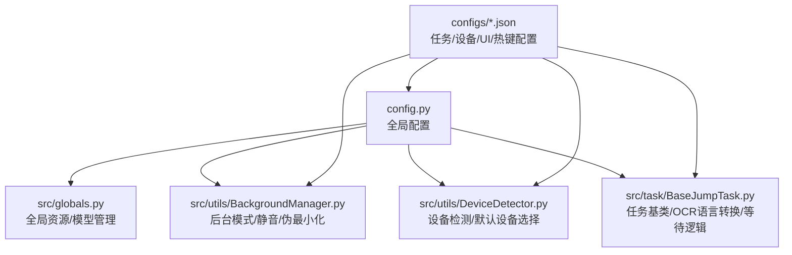
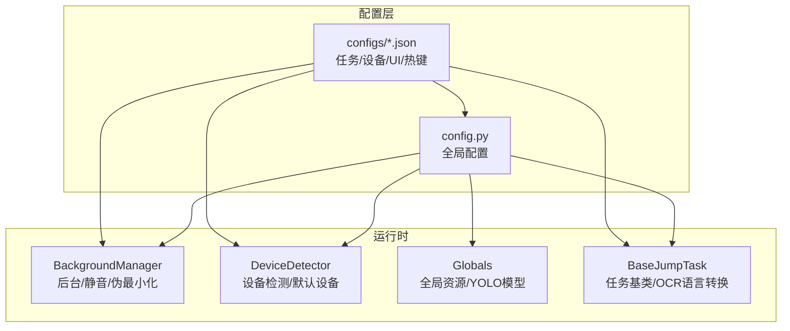
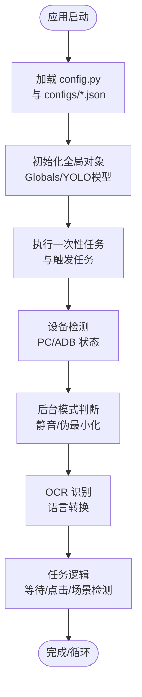
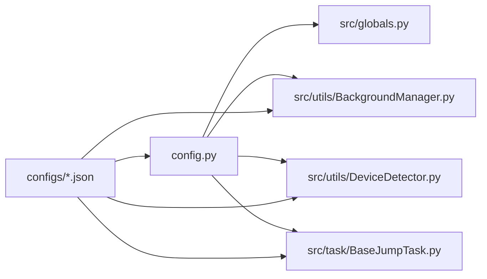

# 配置系统

<cite>
**本文档引用的文件**
- [config.py](file://config.py)
- [main.py](file://main.py)
- [src/globals.py](file://src/globals.py)
- [src/utils/BackgroundManager.py](file://src/utils/BackgroundManager.py)
- [src/utils/DeviceDetector.py](file://src/utils/DeviceDetector.py)
- [src/task/BaseJumpTask.py](file://src/task/BaseJumpTask.py)
- [configs/main_window.json](file://configs/main_window.json)
- [configs/devices.json](file://configs/devices.json)
- [configs/ui_config.json](file://configs/ui_config.json)
- [configs/_ok.json](file://configs/_ok.json)
- [configs/游戏热键配置.json](file://configs/游戏热键配置.json)
- [configs/AutoCombatTask.json](file://configs/AutoCombatTask.json)
- [configs/AutoLoginTask.json](file://configs/AutoLoginTask.json)
- [configs/AutoMatchTask.json](file://configs/AutoMatchTask.json)
- [configs/DailyTask.json](file://configs/DailyTask.json)
- [configs/Basic Options.json](file://configs/Basic Options.json)
- [configs/基础选项.json](file://configs/基础选项.json)
- [configs/基本设置.json](file://configs/基本设置.json)
</cite>

## 目录
1. [简介](#简介)
2. [项目结构](#项目结构)
3. [核心组件](#核心组件)
4. [架构总览](#架构总览)
5. [详细组件分析](#详细组件分析)
6. [依赖分析](#依赖分析)
7. [性能考虑](#性能考虑)
8. [故障排查指南](#故障排查指南)
9. [结论](#结论)
10. [附录](#附录)

## 简介
本文件系统性梳理 OK-Jump 的配置体系，涵盖主配置文件、任务配置文件、设备与 UI 配置、热键配置，以及配置验证、默认值处理与迁移机制，并提供优化建议与最佳实践。目标是帮助不同技术背景的用户快速理解并正确配置系统。

## 项目结构
配置相关的核心位置如下：
- 主配置入口：config.py 定义全局配置、OCR、模板匹配、窗口与捕获策略、分辨率支持、窗口尺寸、日志与截图路径、一次性与触发任务、场景与自定义 UI 标签等。
- 任务配置：位于 configs/ 下的 JSON 文件，分别描述各任务的开关、行为参数与时间间隔。
- 设备与 UI 配置：devices.json、ui_config.json、main_window.json、_ok.json 提供设备选择、窗口状态与外观主题等。
- 热键配置：游戏热键配置文件提供技能与普通攻击的按键映射。

**图表来源**
- [config.py:68-148](file://config.py#L68-L148)
- [src/globals.py:16-257](file://src/globals.py#L16-L257)
- [src/utils/BackgroundManager.py:7-155](file://src/utils/BackgroundManager.py#L7-L155)
- [src/utils/DeviceDetector.py:11-149](file://src/utils/DeviceDetector.py#L11-L149)
- [src/task/BaseJumpTask.py:14-422](file://src/task/BaseJumpTask.py#L14-L422)

**章节来源**
- [config.py:1-149](file://config.py#L1-149)
- [configs/main_window.json:1-3](file://configs/main_window.json#L1-L3)
- [configs/devices.json:1-7](file://configs/devices.json#L1-L7)
- [configs/ui_config.json:1-17](file://configs/ui_config.json#L1-L17)
- [configs/_ok.json:1-7](file://configs/_ok.json#L1-L7)
- [configs/游戏热键配置.json:1-6](file://configs/游戏热键配置.json#L1-L6)

## 核心组件
- 全局配置中心：集中定义 OCR、模板匹配、窗口与捕获策略、分辨率支持、窗口尺寸、日志与截图路径、一次性与触发任务、场景与自定义 UI 标签等。
- 任务配置：以 JSON 形式存储，覆盖自动登录、自动战斗、自动匹配、日常任务等，包含开关、超时、重试、间隔等参数。
- 设备与 UI 配置：设备选择、窗口状态、外观主题、主窗口 DPI/Language/Mica 等。
- 热键配置：技能与普通攻击的按键映射，支持多语言热键配置文件。

**章节来源**
- [config.py:68-148](file://config.py#L68-L148)
- [configs/AutoLoginTask.json:1-15](file://configs/AutoLoginTask.json#L1-L15)
- [configs/AutoCombatTask.json:1-13](file://configs/AutoCombatTask.json#L1-L13)
- [configs/AutoMatchTask.json:1-6](file://configs/AutoMatchTask.json#L1-L6)
- [configs/DailyTask.json:1-7](file://configs/DailyTask.json#L1-L7)
- [configs/devices.json:1-7](file://configs/devices.json#L1-L7)
- [configs/ui_config.json:1-17](file://configs/ui_config.json#L1-L17)
- [configs/游戏热键配置.json:1-6](file://configs/游戏热键配置.json#L1-L6)

## 架构总览
配置系统围绕 config.py 的全局配置展开，任务与工具模块通过框架提供的配置读取接口访问这些配置；设备检测与后台管理模块根据配置决定行为；任务模块在运行时结合 OCR 语言转换与等待逻辑进行自动化操作。

**图表来源**
- [config.py:68-148](file://config.py#L68-L148)
- [src/utils/BackgroundManager.py:7-155](file://src/utils/BackgroundManager.py#L7-L155)
- [src/utils/DeviceDetector.py:11-149](file://src/utils/DeviceDetector.py#L11-L149)
- [src/globals.py:16-257](file://src/globals.py#L16-L257)
- [src/task/BaseJumpTask.py:14-422](file://src/task/BaseJumpTask.py#L14-L422)

## 详细组件分析

### 主配置文件 config.py 的结构与要点
- 全局常量与路径
  - 资源与配置路径函数，便于跨平台定位 assets 与 configs。
  - Windows 可执行路径计算，支持指定安装目录。
- 全局配置项
  - debug/use_gui/version/gui_icon/gui_title 等应用级开关与元信息。
  - global_configs：注册"基本设置""游戏热键配置"两个全局配置项，供 GUI 展示与编辑。
  - my_app：指向 src.globals.Globals，作为全局对象注入。
  - 日志与截图：日志文件、错误日志、截图目录。
  - 一次性任务与触发任务：定义启动即执行的任务与周期性触发的任务。
  - 场景与自定义标签：JumpScene 与日志标签。
- OCR 与模板匹配
  - OCR 引擎与参数（ONNX + OpenVINO/NPU）。
  - 模板匹配：COCO 特征 JSON 与默认阈值。
- 窗口与捕获
  - 窗口标题、EXE 名称、窗口类名、交互方式（Unity 需 PyDirect）。
  - 捕获方法优先级（WGC、BitBlt_RenderFull、BitBlt）。
  - 允许最小化/屏幕外窗口，支持后台模式。
- ADB 与设备
  - ADB 开关与包名。
- 分辨率与参考分辨率
  - 支持的宽高比、最小分辨率、可重采样的目标分辨率列表。
  - 参考分辨率（宽/高）。
- 窗口尺寸
  - 默认窗口宽高与最小宽高。
- 关键配置项说明
  - "基本设置"：最小化到托盘、后台模式、伪最小化、后台静音、自动调整窗口、退出时关闭、语言、触发间隔、启动/停止快捷键等。
  - "游戏热键配置"：普通攻击、技能1、技能2、大招的按键映射。

**章节来源**
- [config.py:1-149](file://config.py#L1-L149)

### 任务配置文件格式与参数
- 自动登录任务 AutoLoginTask.json
  - 启用开关、自动启动游戏、等待启动时间、最大登录尝试次数、账号输入与重试、输入校验与登录等待超时、点击后等待、加载停滞超时、加载检测与状态容错。
- 自动战斗任务 AutoCombatTask.json
  - 测试模式、详细日志、自动普攻/技能1/技能2/大招、各类技能间隔、移动持续时间。
- 自动匹配任务 AutoMatchTask.json
  - 启用开关、游戏模式（如排位赛）、自动接受匹配、最大等待时间。
- 日常任务 DailyTask.json
  - 启用开关、完成日常任务、收集奖励、使用体力、体力阈值。
- 基本选项（英文）Basic Options.json
  - 启动时自动开始游戏、最小化到托盘、后台模式、静音、自动调整窗口、退出时关闭、DirectML、触发间隔、启动/停止、关闭启动器、DX11 启动、Windows 捕获方式。
- 基础选项（中文）基础选项.json
  - 中文本地化的基本选项，字段与含义与英文版本对应。
- 基本设置（中文）基本设置.json
  - 中文本地化的基本设置，包含最小化到托盘、后台模式、伪最小化、后台静音、自动调整窗口、退出时关闭、游戏文本语言、触发间隔、启动/停止快捷键等。

**章节来源**
- [configs/AutoLoginTask.json:1-15](file://configs/AutoLoginTask.json#L1-L15)
- [configs/AutoCombatTask.json:1-13](file://configs/AutoCombatTask.json#L1-L13)
- [configs/AutoMatchTask.json:1-6](file://configs/AutoMatchTask.json#L1-L6)
- [configs/DailyTask.json:1-7](file://configs/DailyTask.json#L1-L7)
- [configs/Basic Options.json:1-13](file://configs/Basic Options.json#L1-L13)
- [configs/基础选项.json:1-11](file://configs/基础选项.json#L1-L11)
- [configs/基本设置.json:1-11](file://configs/基本设置.json#L1-L11)

### 设备配置 devices.json
- preferred：首选设备标识（如 leidian0）。
- pc_full_path：PC 版游戏可执行路径。
- capture：捕获方式（adb）。
- selected_exe：选中的游戏 EXE。
- selected_hwnd：选中的窗口句柄。

**章节来源**
- [configs/devices.json:1-7](file://configs/devices.json#L1-L7)

### UI 配置 ui_config.json
- Material：AcrylicBlurRadius。
- Update：启动时检查更新。
- MainWindow：DPI 缩放、语言、Mica 启用。
- QFluentWidgets：主题色与主题模式。

**章节来源**
- [configs/ui_config.json:1-17](file://configs/ui_config.json#L1-L17)

### 主窗口状态 _ok.json
- window_x/window_y：窗口位置。
- window_width/window_height：窗口尺寸。
- window_maximized：是否最大化。

**更新** 主窗口配置现在包含具体的窗口位置坐标（window_x: 1378, window_y: 570），这反映了 GUI 窗口配置的微调更新。

**章节来源**
- [configs/_ok.json:1-7](file://configs/_ok.json#L1-L7)

### 游戏热键配置 游戏热键配置.json
- 普通攻击、技能1、技能2、大招的按键映射。

**章节来源**
- [configs/游戏热键配置.json:1-6](file://configs/游戏热键配置.json#L1-L6)

### 主配置文件 config.py 的数据流与控制流
- 初始化阶段：config.py 注册全局配置项与全局对象，定义 OCR、模板匹配、窗口与捕获策略、分辨率支持、窗口尺寸、日志与截图路径、一次性与触发任务、场景与自定义标签。
- 运行时阶段：任务模块通过框架接口读取全局配置；后台管理模块根据"基本设置"决定后台模式与静音；设备检测模块根据"设备配置"与当前环境智能选择默认设备；任务模块在运行时结合 OCR 语言转换与等待逻辑进行自动化操作。

**图表来源**
- [config.py:68-148](file://config.py#L68-L148)
- [src/globals.py:204-257](file://src/globals.py#L204-L257)
- [src/utils/BackgroundManager.py:43-92](file://src/utils/BackgroundManager.py#L43-L92)
- [src/utils/DeviceDetector.py:113-134](file://src/utils/DeviceDetector.py#L113-L134)
- [src/task/BaseJumpTask.py:155-227](file://src/task/BaseJumpTask.py#L155-L227)

## 依赖分析
- 配置到模块的依赖
  - config.py 为全局配置中心，被 src/globals.py、src/utils/BackgroundManager.py、src/utils/DeviceDetector.py、src/task/BaseJumpTask.py 等模块读取或间接使用。
  - configs/*.json 为任务与设备/UI/热键配置，被任务与后台管理模块按需读取。
- 模块间的耦合
  - BaseJumpTask 依赖 OCR 语言转换与等待逻辑，间接依赖全局配置。
  - BackgroundManager 依赖"基本设置"配置项。
  - DeviceDetector 依赖设备状态与默认设备选择逻辑。

**图表来源**
- [config.py:68-148](file://config.py#L68-L148)
- [src/globals.py:16-257](file://src/globals.py#L16-L257)
- [src/utils/BackgroundManager.py:7-155](file://src/utils/BackgroundManager.py#L7-L155)
- [src/utils/DeviceDetector.py:11-149](file://src/utils/DeviceDetector.py#L11-L149)
- [src/task/BaseJumpTask.py:14-422](file://src/task/BaseJumpTask.py#L14-L422)

**章节来源**
- [config.py:68-148](file://config.py#L68-L148)
- [src/globals.py:16-257](file://src/globals.py#L16-L257)
- [src/utils/BackgroundManager.py:7-155](file://src/utils/BackgroundManager.py#L7-L155)
- [src/utils/DeviceDetector.py:11-149](file://src/utils/DeviceDetector.py#L11-L149)
- [src/task/BaseJumpTask.py:14-422](file://src/task/BaseJumpTask.py#L14-L422)

## 性能考虑
- 触发间隔与 CPU/GPU 占用
  - "触发间隔"越大，CPU/GPU 使用率越低，但响应速度下降。建议在后台模式下适当增大该值。
- 捕获方法优先级
  - WGC 通常性能最好，BitBlt 作为回退方案。根据系统与显卡能力选择合适的捕获方式。
- OCR 与模板匹配
  - ONNX + OpenVINO/NPU 可显著提升 OCR 性能；模板匹配阈值过高会导致漏检，过低会导致误检，需结合实际场景微调。
- 分辨率与缩放
  - 合理设置参考分辨率与支持分辨率列表，避免频繁缩放带来的性能损耗。
- 后台模式与伪最小化
  - 后台模式与伪最小化可减少窗口管理开销，但需确保窗口可见性与输入事件的正确性。

## 故障排查指南
- 后台模式无效或静音未生效
  - 检查"基本设置"中的"后台模式""后台时静音游戏"是否开启；确认窗口句柄与前台窗口状态检测正常。
- 窗口最小化后无法截图
  - 确认"最小化时伪最小化"已启用；检查伪最小化辅助工具是否正确设置窗口句柄。
- ADB 设备未被识别
  - 检查 devices.json 中的 capture 与包名；确认 adb 服务运行与设备连接状态。
- OCR 文本匹配失败
  - 检查"游戏文本语言"配置；确认 OCR 引擎参数（OpenVINO/NPU）与阈值设置合理。
- 热键不生效
  - 检查"游戏热键配置"中的按键映射是否与游戏内绑定一致；确认启动/停止快捷键未与其他应用冲突。
- GUI 窗口位置异常
  - 检查 _ok.json 中的 window_x/window_y 配置；确认窗口坐标在屏幕范围内且不会被系统任务栏遮挡。

**章节来源**
- [src/utils/BackgroundManager.py:18-92](file://src/utils/BackgroundManager.py#L18-L92)
- [src/utils/DeviceDetector.py:71-110](file://src/utils/DeviceDetector.py#L71-L110)
- [src/task/BaseJumpTask.py:280-333](file://src/task/BaseJumpTask.py#L280-L333)
- [configs/游戏热键配置.json:1-6](file://configs/游戏热键配置.json#L1-L6)
- [configs/_ok.json:1-7](file://configs/_ok.json#L1-L7)

## 结论
OK-Jump 的配置系统以 config.py 为核心，配合任务、设备、UI 与热键配置文件，形成清晰的层次化结构。通过合理的参数设置与优化，可在保证稳定性的同时提升性能与用户体验。建议在部署前完成设备与窗口状态的验证，并针对具体硬件与游戏版本微调 OCR 与模板匹配参数。

## 附录

### 配置验证与默认值处理
- 配置验证
  - 在读取配置时进行类型与范围校验，确保数值参数（如超时、间隔、阈值）在合理范围内。
  - 对关键路径（如 PC 可执行路径、YOLO 模型权重）进行存在性检查。
- 默认值处理
  - 对缺失的配置项采用安全的默认值（如 False、0、空字符串），避免运行时异常。
  - 对多语言配置提供回退策略（先尝试中文配置名，再尝试英文或其他名称）。

**章节来源**
- [src/utils/BackgroundManager.py:25-41](file://src/utils/BackgroundManager.py#L25-L41)
- [src/globals.py:212-227](file://src/globals.py#L212-L227)

### 配置迁移机制
- 版本兼容
  - 在主窗口配置中记录 last_version，升级时比较版本并执行迁移脚本。
- 字段迁移
  - 对新增或废弃的字段进行映射与清理，保留用户历史设置。
- 备份与回滚
  - 迁移前备份原配置文件，失败时自动回滚。

**章节来源**
- [configs/main_window.json:1-3](file://configs/main_window.json#L1-L3)

### 最佳实践
- 任务参数
  - 合理设置超时与重试次数，避免长时间阻塞；为耗时任务预留充足等待时间。
- 窗口与捕获
  - 在支持的前提下优先使用 WGC；确保窗口可见性与前台状态检测准确。
- OCR 与模板匹配
  - 根据分辨率与字体质量调整阈值；必要时启用 OpenVINO/NPU 加速。
- 后台模式
  - 在后台模式下适当增大触发间隔，减少资源占用；启用伪最小化以支持后台截图。
- 设备选择
  - 使用智能默认设备选择逻辑，避免手动切换；在多设备共存时明确首选设备。
- GUI 窗口配置
  - 确保窗口位置坐标在屏幕范围内，避免被系统界面遮挡；定期检查窗口尺寸与 DPI 设置。