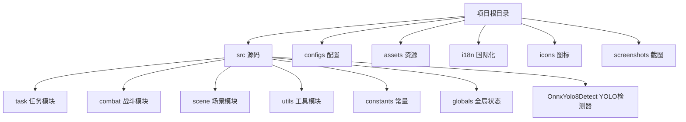
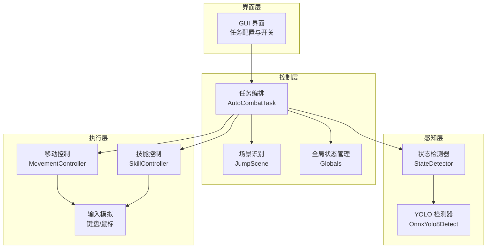
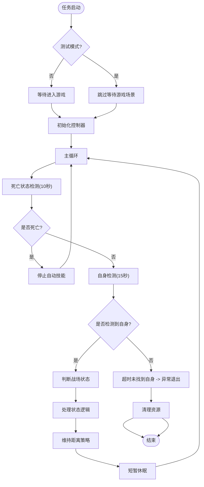
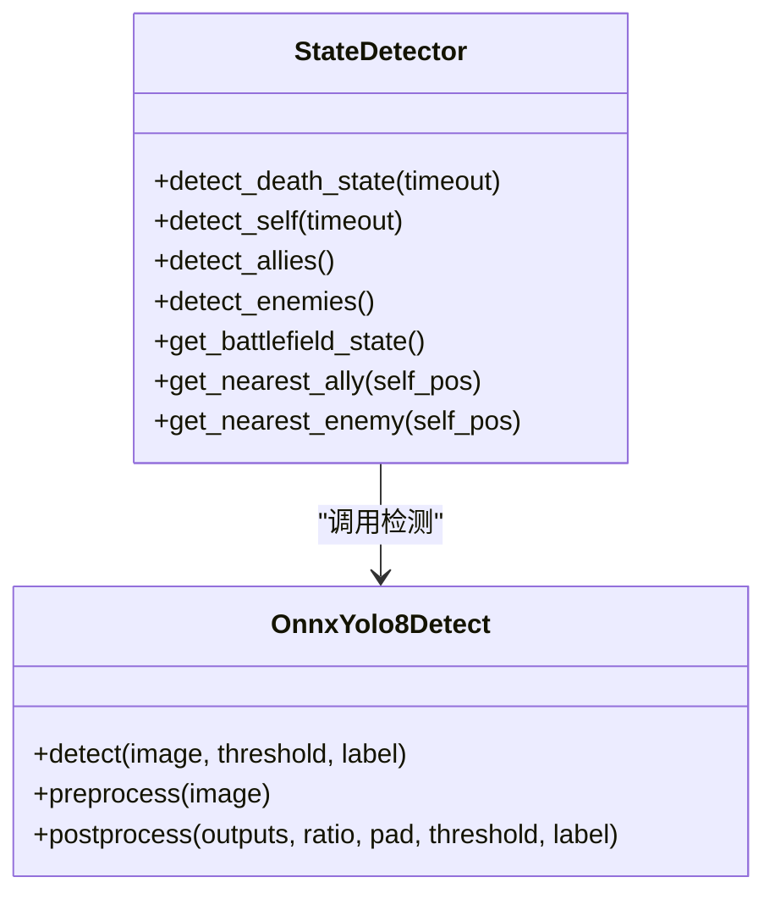
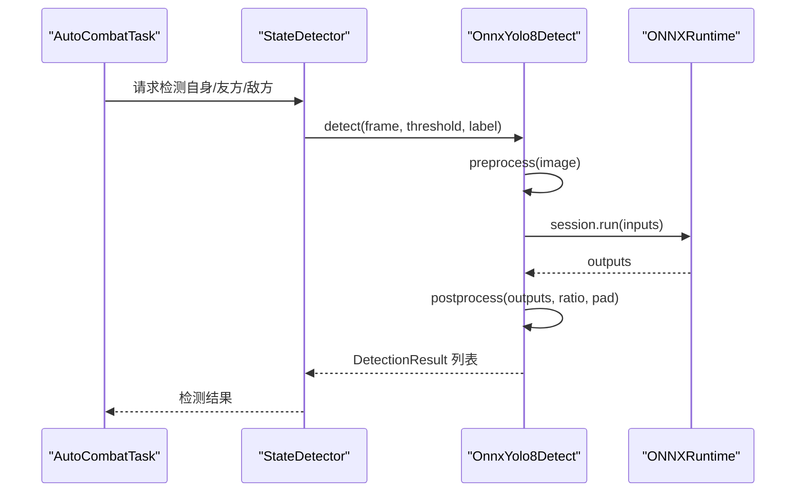
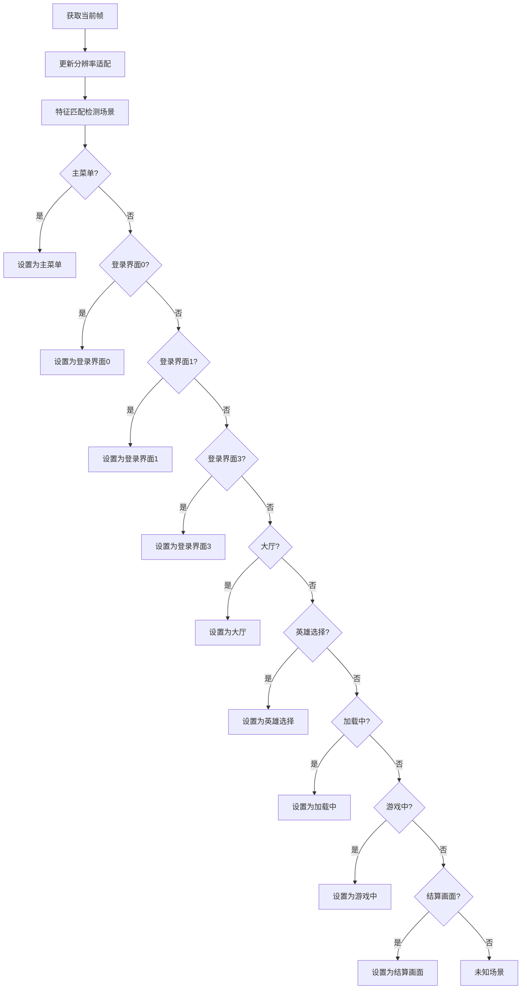
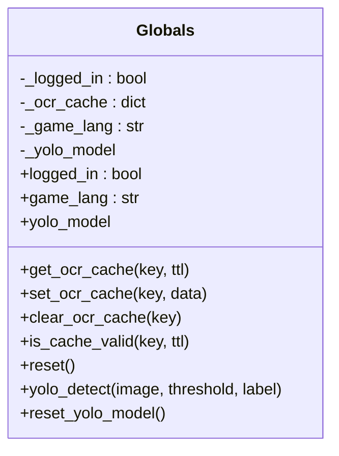
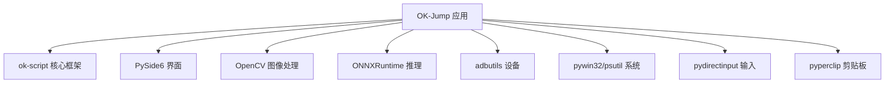

# 项目概述

<cite>
**本文档引用的文件**
- [main.py](file://main.py)
- [config.py](file://config.py)
- [requirements.txt](file://requirements.txt)
- [ok.yml](file://ok.yml)
- [src/__init__.py](file://src/__init__.py)
- [src/globals.py](file://src/globals.py)
- [src/task/AutoCombatTask.py](file://src/task/AutoCombatTask.py)
- [src/combat/state_detector.py](file://src/combat/state_detector.py)
- [src/OnnxYolo8Detect.py](file://src/OnnxYolo8Detect.py)
- [src/scene/JumpScene.py](file://src/scene/JumpScene.py)
- [src/utils/ResolutionAdapter.py](file://src/utils/ResolutionAdapter.py)
- [configs/AutoCombatTask.json](file://configs/AutoCombatTask.json)
- [configs/Basic Options.json](file://configs/Basic Options.json)
</cite>

## 目录
1. [引言](#引言)
2. [项目结构](#项目结构)
3. [核心组件](#核心组件)
4. [架构总览](#架构总览)
5. [详细组件分析](#详细组件分析)
6. [依赖关系分析](#依赖关系分析)
7. [性能考虑](#性能考虑)
8. [故障排除指南](#故障排除指南)
9. [结论](#结论)
10. [附录](#附录)

## 引言
OK-Jump 是一个基于 Python 的桌面自动化游戏辅助工具，专为《漫画群星：大集结》设计。该项目旨在通过计算机视觉与智能控制技术，为玩家提供自动化的登录、匹配、战斗等核心游戏流程辅助，显著降低重复性操作负担，提升游戏体验与效率。

项目采用模块化架构，结合场景识别、YOLO 物体检测、键盘鼠标输入模拟与全局状态管理，形成从“场景感知—状态决策—动作执行”的完整闭环。同时，项目内置 GUI 界面与丰富的配置项，便于不同技术水平的用户快速上手与深度定制。

## 项目结构
项目采用按功能域划分的层次化组织方式：
- 根目录包含入口脚本、配置文件与打包描述，以及第三方依赖声明
- src 目录为核心源码，按领域拆分 combat（战斗）、scene（场景）、task（任务）、utils（工具）、constants（常量）等子模块
- configs 目录存放各类任务与界面配置 JSON 文件
- assets 目录包含战斗模型权重、图像资源与检测特征数据
- i18n、icons、screenshots 等目录分别用于国际化翻译、图标与截图存储

图表来源
- [main.py:1-33](file://main.py#L1-L33)
- [config.py:65-137](file://config.py#L65-L137)

章节来源
- [main.py:1-33](file://main.py#L1-L33)
- [config.py:65-137](file://config.py#L65-L137)

## 核心组件
- 入口与启动
  - main.py 负责初始化日志导出功能，并通过 OK 框架启动应用
  - ok.yml 定义了 Python 版本要求与调试/默认两种运行配置
- 配置系统
  - config.py 提供全局配置，涵盖 OCR、模板匹配、窗口交互、ADB、分辨率适配、日志与截图路径、一次性任务与触发任务清单等
- 全局状态管理
  - src/globals.py 提供全局资源管理器，集中管理登录状态、OCR 缓存、YOLO 模型与语言设置，支持延迟加载与重置
- 战斗自动化
  - src/task/AutoCombatTask.py 实现自动战斗主流程，包含死亡检测、自身定位、战场状态判断与智能移动/技能释放
  - src/combat/state_detector.py 基于 YOLO 检测战场单位，提供状态枚举与最近目标选择
  - src/OnnxYolo8Detect.py 封装 ONNXRuntime 推理，支持 CPU/GPU 加速与 NMS 后处理
- 场景识别
  - src/scene/JumpScene.py 通过特征匹配识别登录、大厅、英雄选择、加载、游戏中、结算等场景
- 分辨率适配
  - src/utils/ResolutionAdapter.py 提供坐标缩放、相对坐标换算与推荐分辨率建议

章节来源
- [main.py:10-33](file://main.py#L10-L33)
- [config.py:23-137](file://config.py#L23-L137)
- [src/globals.py:16-227](file://src/globals.py#L16-L227)
- [src/task/AutoCombatTask.py:25-357](file://src/task/AutoCombatTask.py#L25-L357)
- [src/combat/state_detector.py:23-274](file://src/combat/state_detector.py#L23-L274)
- [src/OnnxYolo8Detect.py:17-311](file://src/OnnxYolo8Detect.py#L17-L311)
- [src/scene/JumpScene.py:8-216](file://src/scene/JumpScene.py#L8-L216)
- [src/utils/ResolutionAdapter.py:4-163](file://src/utils/ResolutionAdapter.py#L4-L163)

## 架构总览
OK-Jump 采用“场景识别 + 智能检测 + 动作控制”的分层架构：
- 表层：GUI 与任务调度（由 OK 框架提供）
- 中层：场景识别与全局状态管理
- 深层：计算机视觉（YOLO）与动作执行（键盘鼠标模拟）

图表来源
- [src/scene/JumpScene.py:39-71](file://src/scene/JumpScene.py#L39-L71)
- [src/task/AutoCombatTask.py:109-146](file://src/task/AutoCombatTask.py#L109-L146)
- [src/combat/state_detector.py:75-180](file://src/combat/state_detector.py#L75-L180)
- [src/OnnxYolo8Detect.py:29-53](file://src/OnnxYolo8Detect.py#L29-L53)

## 详细组件分析

### 自动战斗任务（AutoCombatTask）
AutoCombatTask 是触发式任务，负责在游戏战斗场景中实现智能移动与技能释放。其核心流程包括：
- 等待进入游戏场景（可选测试模式跳过）
- 初始化状态检测器、移动控制器、技能控制器与距离计算器
- 主循环：死亡状态检测（10秒）、自身检测（15秒）、战场状态判断（四种情况）
- 根据状态执行移动策略与技能释放，维持 100~200 像素的最佳战斗距离

图表来源
- [src/task/AutoCombatTask.py:65-198](file://src/task/AutoCombatTask.py#L65-L198)
- [src/task/AutoCombatTask.py:200-321](file://src/task/AutoCombatTask.py#L200-L321)

章节来源
- [src/task/AutoCombatTask.py:25-357](file://src/task/AutoCombatTask.py#L25-L357)

### 战斗状态检测器（StateDetector）
StateDetector 基于 YOLO 检测模型，实时识别以下目标：
- 死亡状态：持续监测指定标签，超时未发现即视为未死亡
- 自身位置：单次或循环检测，超时返回 None
- 友方与敌方单位：返回检测结果列表
- 战场状态：根据友方/敌方是否存在，返回四种状态之一
- 最近目标：计算与自身的欧氏距离，返回最近单位

图表来源
- [src/combat/state_detector.py:23-274](file://src/combat/state_detector.py#L23-L274)
- [src/OnnxYolo8Detect.py:17-311](file://src/OnnxYolo8Detect.py#L17-L311)

章节来源
- [src/combat/state_detector.py:23-274](file://src/combat/state_detector.py#L23-L274)

### YOLO 检测器（OnnxYolo8Detect）
OnnxYolo8Detect 封装 ONNXRuntime 推理流程，支持：
- 输入预处理：等比缩放、填充、RGB 转置与归一化
- 推理执行：优先 CUDA，回退 CPU
- 后处理：置信度过滤、类别筛选、NMS 非极大值抑制
- 结果封装：DetectionResult 类，提供中心点、边界框等属性

图表来源
- [src/combat/state_detector.py:75-180](file://src/combat/state_detector.py#L75-L180)
- [src/OnnxYolo8Detect.py:29-53](file://src/OnnxYolo8Detect.py#L29-L53)
- [src/OnnxYolo8Detect.py:230-254](file://src/OnnxYolo8Detect.py#L230-L254)

章节来源
- [src/OnnxYolo8Detect.py:17-311](file://src/OnnxYolo8Detect.py#L17-L311)

### 场景识别（JumpScene）
JumpScene 通过特征匹配识别游戏各阶段场景：
- 登录界面（多阶段）、主菜单、大厅、英雄选择、加载中、游戏中、结算画面
- 提供场景切换历史记录、分辨率更新与校验、等待场景切换等能力

图表来源
- [src/scene/JumpScene.py:39-71](file://src/scene/JumpScene.py#L39-L71)
- [src/scene/JumpScene.py:171-177](file://src/scene/JumpScene.py#L171-L177)

章节来源
- [src/scene/JumpScene.py:8-216](file://src/scene/JumpScene.py#L8-L216)

### 全局状态管理（Globals）
Globals 提供全局资源统一访问接口：
- 登录状态管理：读取/设置/重置
- OCR 缓存：带 TTL 的键值缓存，支持查询与清理
- YOLO 模型：延迟加载，按需初始化并缓存
- 语言设置：默认 zh_CN，支持外部设置

图表来源
- [src/globals.py:16-227](file://src/globals.py#L16-L227)

章节来源
- [src/globals.py:16-227](file://src/globals.py#L16-L227)

## 依赖关系分析
- 运行环境与框架
  - Python 3.12（ok.yml）
  - ok-script>=1.0.0（核心自动化框架）
- GUI 与界面
  - PySide6-Essentials、PySide6-Fluent-Widgets（界面与控件）
- 计算机视觉与推理
  - opencv-python（图像处理）
  - onnxruntime、onnxruntime-directml（ONNX 推理，DirectML 可选加速）
- 系统与设备
  - adbutils（Android 设备支持）
  - pywin32、psutil（Windows 平台交互与进程管理）
  - pydirectinput（键盘鼠标输入模拟）
  - pyperclip（剪贴板操作）

图表来源
- [requirements.txt:1-13](file://requirements.txt#L1-L13)
- [ok.yml:1-12](file://ok.yml#L1-L12)

章节来源
- [requirements.txt:1-13](file://requirements.txt#L1-L13)
- [ok.yml:1-12](file://ok.yml#L1-L12)

## 性能考虑
- 推理加速
  - 优先使用 CUDA 执行提供 GPU 加速；若不可用则回退 CPU
  - DirectML 可选启用以优化部分硬件平台性能
- 资源复用
  - YOLO 模型延迟加载并在生命周期内复用，避免重复初始化
  - OCR 缓存采用短 TTL，减少重复识别开销
- 分辨率适配
  - 通过统一缩放因子与推荐分辨率，确保检测精度与性能平衡
- 触发间隔
  - 可配置触发间隔（毫秒级），在准确率与资源占用间折中

## 故障排除指南
- 日志导出
  - 通过 GUI 的“导出日志”功能生成压缩包，便于问题排查与反馈
- 常见问题
  - YOLO 模型缺失：确认 assets/Fight 下存在模型文件
  - ONNXRuntime 未安装：按依赖声明安装对应版本
  - 分辨率不匹配：根据提示调整至推荐分辨率
  - 场景识别失败：检查模板匹配特征是否正确加载
- 配置核对
  - 基本设置与热键配置可通过 JSON 文件与 GUI 界面进行调整
  - 战斗任务参数（如技能间隔）可在对应配置文件中修改

章节来源
- [main.py:10-28](file://main.py#L10-L28)
- [src/globals.py:172-198](file://src/globals.py#L172-L198)
- [src/OnnxYolo8Detect.py:38-40](file://src/OnnxYolo8Detect.py#L38-L40)
- [src/scene/JumpScene.py:206-215](file://src/scene/JumpScene.py#L206-L215)
- [configs/Basic Options.json:1-13](file://configs/Basic Options.json#L1-L13)
- [configs/AutoCombatTask.json:1-10](file://configs/AutoCombatTask.json#L1-L10)

## 结论
OK-Jump 通过模块化设计与成熟的计算机视觉技术，为《漫画群星：大集结》提供了稳定可靠的自动化辅助能力。其清晰的架构、完善的配置体系与易用的 GUI，既适合新手快速上手，也为进阶用户提供了充分的扩展空间。未来可进一步完善多语言支持、跨分辨率鲁棒性与更丰富的任务类型，持续提升用户体验与稳定性。

## 附录
- 版本信息
  - 应用版本：1.0.0（config.py）
  - Python 要求：3.12（ok.yml）
- 社区贡献
  - 项目遵循开源协作流程，欢迎通过 Issue 与 Pull Request 参与改进
- 快速定位
  - 入口与启动：[main.py](file://main.py)
  - 全局配置：[config.py](file://config.py)
  - 自动战斗主流程：[src/task/AutoCombatTask.py](file://src/task/AutoCombatTask.py)
  - 场景识别：[src/scene/JumpScene.py](file://src/scene/JumpScene.py)
  - YOLO 检测器：[src/OnnxYolo8Detect.py](file://src/OnnxYolo8Detect.py)
  - 全局状态管理：[src/globals.py](file://src/globals.py)
  - 依赖声明：[requirements.txt](file://requirements.txt)
  - 运行配置：[ok.yml](file://ok.yml)
  - 任务配置示例：[configs/AutoCombatTask.json](file://configs/AutoCombatTask.json)、[configs/Basic Options.json](file://configs/Basic Options.json)