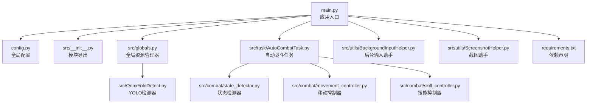
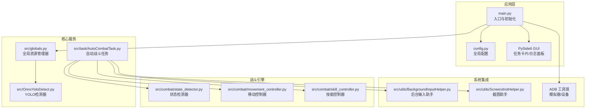
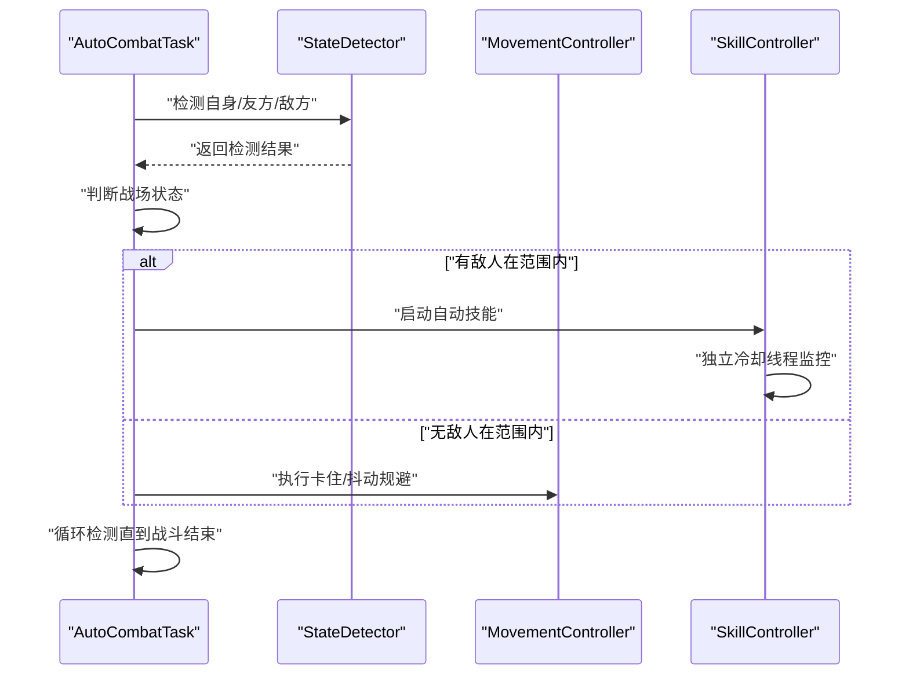
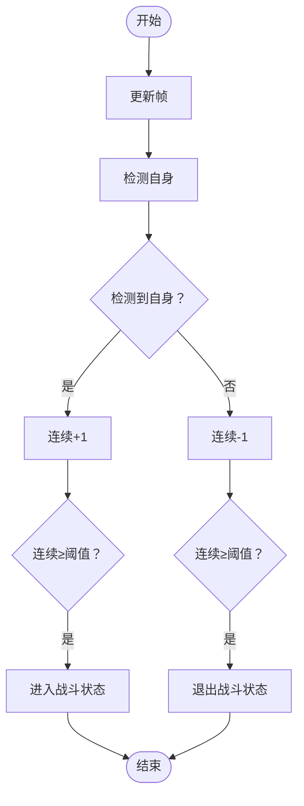
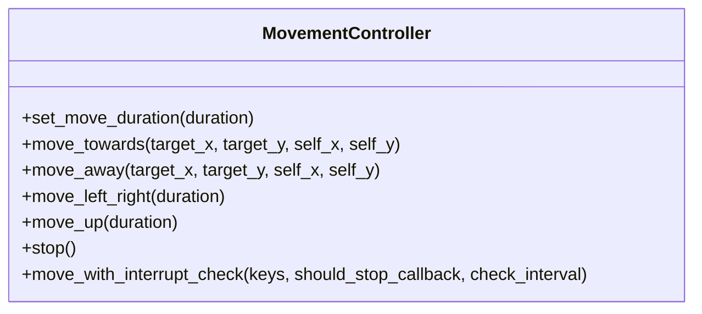
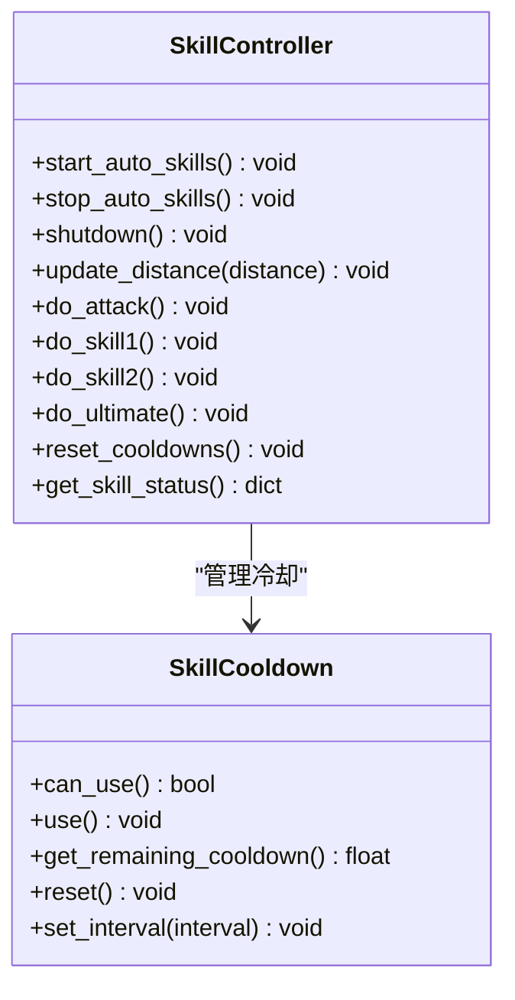
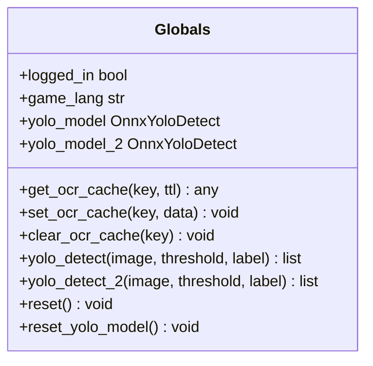
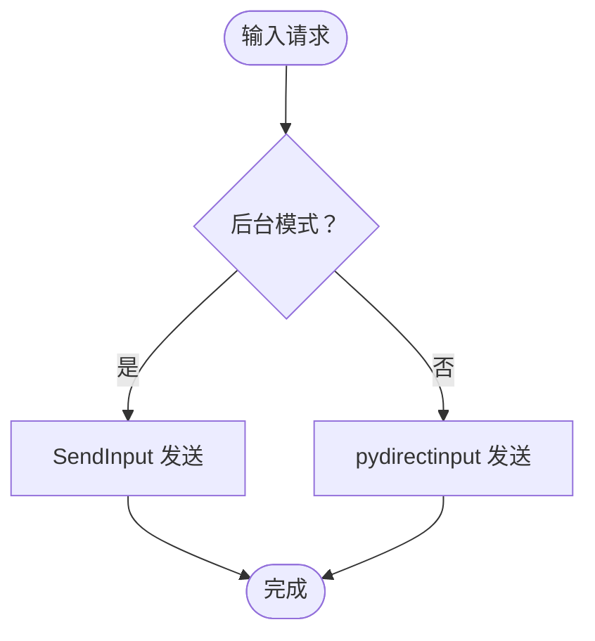
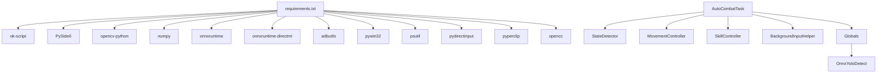

# 项目概述

<cite>
**本文档引用的文件**
- [README.md](file://README.md)
- [main.py](file://main.py)
- [config.py](file://config.py)
- [requirements.txt](file://requirements.txt)
- [src/__init__.py](file://src/__init__.py)
- [src/globals.py](file://src/globals.py)
- [src/OnnxYoloDetect.py](file://src/OnnxYoloDetect.py)
- [src/combat/state_detector.py](file://src/combat/state_detector.py)
- [src/combat/movement_controller.py](file://src/combat/movement_controller.py)
- [src/combat/skill_controller.py](file://src/combat/skill_controller.py)
- [src/utils/BackgroundInputHelper.py](file://src/utils/BackgroundInputHelper.py)
- [src/utils/ScreenshotHelper.py](file://src/utils/ScreenshotHelper.py)
- [src/task/AutoCombatTask.py](file://src/task/AutoCombatTask.py)
- [configs/AutoCombatTask.json](file://configs/AutoCombatTask.json)
- [configs/Basic Options.json](file://configs/Basic Options.json)
</cite>

## 目录
1. [简介](#简介)
2. [项目结构](#项目结构)
3. [核心组件](#核心组件)
4. [架构总览](#架构总览)
5. [详细组件分析](#详细组件分析)
6. [依赖关系分析](#依赖关系分析)
7. [性能考虑](#性能考虑)
8. [故障排除指南](#故障排除指南)
9. [结论](#结论)
10. [附录](#附录)

## 简介
ok-jump 是一个基于 Python 的桌面自动化游戏辅助工具，专为《漫画群星：大集结》设计。该项目采用 ok-script 框架，结合 PySide6 构建图形界面，集成计算机视觉（YOLO 模型）与后台输入控制，实现智能自动战斗、多平台支持（PC 端与 Android 模拟器）、以及后台模式运行等核心功能。

- 项目目标：为玩家提供稳定、可配置、跨平台的自动化游戏辅助能力，重点聚焦自动战斗系统。
- 技术栈：Python + ok-script + PySide6 + OpenCV + ONNXRuntime + ADB 工具链。
- 许可证：MIT License。

**章节来源**
- [README.md:1-8](file://README.md#L1-L8)

## 项目结构
项目采用模块化组织，核心目录与职责如下：
- src：核心业务逻辑与工具模块
  - combat：战斗状态检测、移动控制、技能控制
  - utils：后台输入、截图、设备检测等工具
  - task：各类自动化任务（自动战斗、登录、匹配、日常等）
  - gui：GUI 相关组件（日志面板等）
  - scene：场景管理（跳跃场景等）
  - OnnxYoloDetect.py：YOLO 目标检测封装
  - globals.py：全局资源管理器
- configs：任务与配置文件（JSON）
- assets：资源文件（模型、图片、模板等）
- scripts：辅助脚本
- i18n：国际化翻译
- docs：文档与流程图
- requirements.txt：依赖声明

**图表来源**
- [main.py:659-693](file://main.py#L659-L693)
- [config.py:68-145](file://config.py#L68-L145)
- [src/__init__.py:7-31](file://src/__init__.py#L7-L31)
- [src/globals.py:16-41](file://src/globals.py#L16-L41)
- [src/OnnxYoloDetect.py:17-315](file://src/OnnxYoloDetect.py#L17-L315)
- [src/task/AutoCombatTask.py:35-800](file://src/task/AutoCombatTask.py#L35-L800)
- [src/combat/state_detector.py:24-589](file://src/combat/state_detector.py#L24-L589)
- [src/combat/movement_controller.py:24-687](file://src/combat/movement_controller.py#L24-L687)
- [src/combat/skill_controller.py:82-589](file://src/combat/skill_controller.py#L82-L589)
- [src/utils/BackgroundInputHelper.py:99-841](file://src/utils/BackgroundInputHelper.py#L99-L841)
- [src/utils/ScreenshotHelper.py:7-68](file://src/utils/ScreenshotHelper.py#L7-L68)
- [requirements.txt:1-17](file://requirements.txt#L1-L17)

**章节来源**
- [main.py:659-693](file://main.py#L659-L693)
- [config.py:68-145](file://config.py#L68-L145)

## 核心组件
- 自动战斗任务（AutoCombatTask）
  - 触发式任务，支持测试模式与状态感知模式
  - 集成死亡状态并行监控、自身检测、战场状态判断、技能与移动控制
  - 支持后台模式与伪最小化，具备卡住/抖动检测与规避
- 战斗状态检测器（StateDetector）
  - 基于 YOLO 的实时检测：自身、友方、敌方、死亡状态
  - 提供战斗状态切换的防抖动机制
- 移动控制器（MovementController）
  - PC 端 WASD 键盘移动；手机端虚拟摇杆滑动
  - 支持后台模式下的 SendInput 输入
- 技能控制器（SkillController）
  - 独立冷却线程，四个技能独立冷却
  - 支持后台模式下的按键发送
- 全局资源管理器（Globals）
  - YOLO 模型延迟加载与缓存
  - OCR 缓存、登录状态、CI 测试状态管理
- 后台输入助手（BackgroundInputHelper）
  - 为 Unity 游戏提供可靠的后台输入支持
  - 支持伪最小化与前台模式的智能切换
- 截图助手（ScreenshotHelper）
  - 截图保存与特征模板提取

**章节来源**
- [src/task/AutoCombatTask.py:35-800](file://src/task/AutoCombatTask.py#L35-L800)
- [src/combat/state_detector.py:24-589](file://src/combat/state_detector.py#L24-L589)
- [src/combat/movement_controller.py:24-687](file://src/combat/movement_controller.py#L24-L687)
- [src/combat/skill_controller.py:82-589](file://src/combat/skill_controller.py#L82-L589)
- [src/globals.py:16-406](file://src/globals.py#L16-L406)
- [src/utils/BackgroundInputHelper.py:99-841](file://src/utils/BackgroundInputHelper.py#L99-L841)
- [src/utils/ScreenshotHelper.py:7-68](file://src/utils/ScreenshotHelper.py#L7-L68)

## 架构总览
整体架构围绕 ok-script 框架构建，通过 config.py 统一配置，main.py 进行初始化与补丁注入，随后启动 GUI 与任务执行器。YOLO 模型由全局资源管理器统一加载，战斗任务通过状态检测器与控制器协调执行。

**图表来源**
- [main.py:659-693](file://main.py#L659-L693)
- [config.py:68-145](file://config.py#L68-L145)
- [src/globals.py:236-341](file://src/globals.py#L236-L341)
- [src/OnnxYoloDetect.py:17-67](file://src/OnnxYoloDetect.py#L17-L67)
- [src/task/AutoCombatTask.py:199-264](file://src/task/AutoCombatTask.py#L199-L264)
- [src/combat/state_detector.py:24-63](file://src/combat/state_detector.py#L24-L63)
- [src/combat/movement_controller.py:24-52](file://src/combat/movement_controller.py#L24-L52)
- [src/combat/skill_controller.py:82-139](file://src/combat/skill_controller.py#L82-L139)
- [src/utils/BackgroundInputHelper.py:99-137](file://src/utils/BackgroundInputHelper.py#L99-L137)
- [src/utils/ScreenshotHelper.py:7-16](file://src/utils/ScreenshotHelper.py#L7-L16)

## 详细组件分析

### 自动战斗系统（AutoCombatTask）
- 功能特性
  - 测试模式：跳过场景检测，直接进入战斗循环
  - 状态感知模式：通过 YOLO 自身检测动态启停战斗
  - 死亡状态并行监控：独立线程持续检测，快速响应
  - 战场状态判断：四种状态（无单位、仅友方、仅敌方、混合）
  - 技能与移动控制：基于距离与状态的智能释放
  - 后台模式支持：伪最小化与后台输入
  - 卡住/抖动检测：无敌人在范围内时的规避策略
- 数据流
  - 任务启动后初始化控制器与后台管理器
  - 状态检测器持续获取帧并检测自身/友方/敌方
  - 根据状态与距离更新技能控制器的冷却与释放
  - 移动控制器根据目标与自身位置计算方向并发送输入

**图表来源**
- [src/task/AutoCombatTask.py:357-516](file://src/task/AutoCombatTask.py#L357-L516)
- [src/combat/state_detector.py:394-447](file://src/combat/state_detector.py#L394-L447)
- [src/combat/movement_controller.py:106-165](file://src/combat/movement_controller.py#L106-L165)
- [src/combat/skill_controller.py:226-253](file://src/combat/skill_controller.py#L226-L253)

**章节来源**
- [src/task/AutoCombatTask.py:35-800](file://src/task/AutoCombatTask.py#L35-L800)

### 战斗状态检测器（StateDetector）
- 职责
  - 死亡状态并行监控：后台线程持续检测，快速查询
  - 自身检测：15 秒超时，支持详细日志
  - 友方/敌方检测：单次检测与批量检测
  - 战斗状态判断：基于同一帧的友方/敌方检测结果
  - 防抖动机制：连续 N 次检测确认状态切换
- 复杂度
  - 检测复杂度主要受 YOLO 推理与 NMS 影响，单帧检测时间取决于输入尺寸与硬件加速

**图表来源**
- [src/combat/state_detector.py:510-553](file://src/combat/state_detector.py#L510-L553)

**章节来源**
- [src/combat/state_detector.py:24-589](file://src/combat/state_detector.py#L24-L589)

### 移动控制器（MovementController）
- 职责
  - PC 端：WASD 键盘移动，支持后台模式 SendInput
  - 手机端：虚拟摇杆滑动，支持循环短时 swipe
  - 可中断移动：支持在移动过程中检测停止条件
- 适配
  - 自动检测 ADB 模式并切换输入方式
  - 分辨率适配：基于基准分辨率缩放摇杆参数

**图表来源**
- [src/combat/movement_controller.py:24-687](file://src/combat/movement_controller.py#L24-L687)

**章节来源**
- [src/combat/movement_controller.py:24-687](file://src/combat/movement_controller.py#L24-L687)

### 技能控制器（SkillController）
- 职责
  - 独立冷却线程：四个技能各自独立冷却
  - 距离监控：根据与目标距离决定是否释放
  - 后台模式：使用 SendInput 发送按键
- 配置
  - 技能开关与间隔来自任务配置
  - 按键映射来自全局热键配置

**图表来源**
- [src/combat/skill_controller.py:29-81](file://src/combat/skill_controller.py#L29-L81)
- [src/combat/skill_controller.py:82-589](file://src/combat/skill_controller.py#L82-L589)

**章节来源**
- [src/combat/skill_controller.py:82-589](file://src/combat/skill_controller.py#L82-L589)

### 全局资源管理器（Globals）
- 职责
  - YOLO 模型延迟加载与缓存（fight.onnx 与 fight2.onnx）
  - OCR 缓存管理（带 TTL）
  - 登录状态、CI 测试状态管理
- 使用方式
  - 通过 OK 框架初始化后挂载至全局对象，供任务与检测器使用

**图表来源**
- [src/globals.py:16-406](file://src/globals.py#L16-L406)

**章节来源**
- [src/globals.py:16-406](file://src/globals.py#L16-L406)

### 后台输入助手（BackgroundInputHelper）
- 职责
  - 为 Unity 游戏提供可靠的后台输入支持
  - 伪最小化模式与前台模式的智能切换
  - SendInput 与 pydirectinput 的无缝适配
- 机制
  - 通过窗口句柄与焦点管理实现后台按键发送
  - 支持键盘与鼠标操作（含拖拽）

**图表来源**
- [src/utils/BackgroundInputHelper.py:177-207](file://src/utils/BackgroundInputHelper.py#L177-L207)
- [src/utils/BackgroundInputHelper.py:310-357](file://src/utils/BackgroundInputHelper.py#L310-L357)

**章节来源**
- [src/utils/BackgroundInputHelper.py:99-841](file://src/utils/BackgroundInputHelper.py#L99-L841)

## 依赖关系分析
- 运行时依赖
  - ok-script：框架核心
  - PySide6：GUI 界面
  - OpenCV/numpy：图像处理与基础运算
  - onnxruntime/onnxruntime-directml：YOLO 推理
  - adbutils/pywin32/psutil：设备与系统交互
  - pydirectinput/pyperclip/opencc：输入与剪贴板
- 模块间耦合
  - AutoCombatTask 依赖 StateDetector、MovementController、SkillController
  - 所有组件通过 Globals 访问 YOLO 模型
  - BackgroundInputHelper 为移动与技能控制器提供底层输入支持

**图表来源**
- [requirements.txt:1-17](file://requirements.txt#L1-L17)
- [src/task/AutoCombatTask.py:23-32](file://src/task/AutoCombatTask.py#L23-L32)
- [src/globals.py:236-341](file://src/globals.py#L236-L341)

**章节来源**
- [requirements.txt:1-17](file://requirements.txt#L1-L17)

## 性能考虑
- YOLO 推理
  - 优先使用 CUDAExecutionProvider，若不可用则回落 CPU
  - 输入尺寸与 NMS 参数影响检测延迟
- 后台模式
  - SendInput 避免窗口切换开销，适合长时间后台运行
  - 合理设置触发间隔与移动持续时间以平衡性能与稳定性
- 线程与并发
  - 死亡状态与技能释放采用独立线程，避免阻塞主循环
  - 防抖动与状态切换需合理设置阈值，避免频繁切换

[本节为通用指导，无需具体文件分析]

## 故障排除指南
- 日志导出
  - 通过 StartCard 导出日志压缩包，便于问题定位
- 常见问题
  - ADB 连接失败：检查端口与模拟器状态，必要时预连接
  - OCR 负数框警告：框架内部行为，可忽略
  - 截图进程不存在：模拟器关闭时的预期行为，可忽略
- 任务停止异常
  - 修复了停止任务时的意外重启问题，确保任务被正确禁用

**章节来源**
- [main.py:69-84](file://main.py#L69-L84)
- [main.py:258-301](file://main.py#L258-L301)
- [main.py:332-366](file://main.py#L332-L366)
- [main.py:87-112](file://main.py#L87-L112)

## 结论
ok-jump 通过模块化的架构与成熟的计算机视觉技术，实现了对《漫画群星：大集结》的智能自动战斗辅助。其核心优势在于：
- 稳定的自动战斗系统与后台模式支持
- 基于 YOLO 的实时战场感知
- 跨平台（PC 与 Android 模拟器）的输入控制
- 可配置的任务与丰富的日志体系

对于初学者，建议从 GUI 配置入手，逐步启用自动战斗与后台模式；对于开发者，可基于现有模块扩展更多自动化任务与检测能力。

[本节为总结性内容，无需具体文件分析]

## 附录

### 配置项概览
- 自动战斗任务配置（部分）
  - 自动普攻/技能1/技能2/大招：启用开关
  - 普攻间隔、技能间隔、大招间隔：冷却时间
  - 移动持续时间：单次移动按键持续时间
- 基本设置（部分）
  - 后台模式、最小化时伪最小化、后台时静音
  - 触发间隔、启动/停止快捷键
  - Windows 截图方式与 DirectML 使用

**章节来源**
- [configs/AutoCombatTask.json:1-14](file://configs/AutoCombatTask.json#L1-L14)
- [configs/Basic Options.json:1-13](file://configs/Basic Options.json#L1-L13)
- [config.py:40-66](file://config.py#L40-L66)