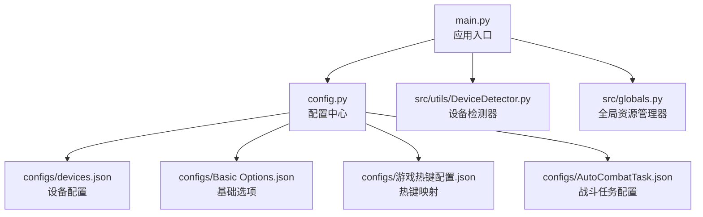

# 安装指南

<cite>
**本文引用的文件**
- [requirements.txt](file://requirements.txt)
- [ok.yml](file://ok.yml)
- [main.py](file://main.py)
- [config.py](file://config.py)
- [src/utils/DeviceDetector.py](file://src/utils/DeviceDetector.py)
- [configs/devices.json](file://configs/devices.json)
- [configs/Basic Options.json](file://configs/Basic Options.json)
- [configs/游戏热键配置.json](file://configs/游戏热键配置.json)
- [configs/_ok.json](file://configs/_ok.json)
- [configs/AutoCombatTask.json](file://configs/AutoCombatTask.json)
- [src/globals.py](file://src/globals.py)
- [README.md](file://README.md)
- [docs/自动战斗系统流程图.md](file://docs/自动战斗系统流程图.md)
</cite>

## 目录
1. [简介](#简介)
2. [系统要求与前置条件](#系统要求与前置条件)
3. [安装步骤](#安装步骤)
4. [不同环境下的安装注意事项](#不同环境下的安装注意事项)
5. [验证安装与基本使用](#验证安装与基本使用)
6. [常见问题与故障排除](#常见问题与故障排除)
7. [架构与配置概览](#架构与配置概览)
8. [结语](#结语)

## 简介
本指南面向首次部署 OK-Jump（漫画群星：大集结 - 自动化工具）的用户，提供从系统准备、依赖安装、配置初始化到运行验证的完整流程。OK-Jump 基于 ok-script 框架，结合图像识别、OCR 与自动化技术，支持自动登录、主界面交互、新手引导、自动匹配、自动战斗与日常任务，并可在后台模式下运行。

## 系统要求与前置条件
- 操作系统
  - Windows 10/11（推荐）
- Python 版本
  - 项目配置要求 Python 3.12（见项目配置）
  - 但 README 中标注了 Python 3.10 或 3.11 的兼容性提示
  - 建议以 ok.yml 中的 3.12 为准；若需兼容 3.10/3.11，请在确认依赖版本兼容后再安装
- 必要系统组件
  - 管理员权限：项目配置要求以管理员身份运行（见 ok.yml）
  - Windows 平台特性：使用 pywin32 与 pydirectinput，确保系统支持 DirectInput
  - 可选：Android 模拟器 ADB 支持（用于模拟器环境）
- 关键依赖（来自 requirements.txt）
  - ok-script、PySide6、OpenCV、numpy、adbutils、pywin32、psutil、pydirectinput、onnxruntime、onnxruntime-directml、pyperclip、opencc

章节来源
- [ok.yml:1-12](file://ok.yml#L1-L12)
- [README.md:29-33](file://README.md#L29-L33)
- [requirements.txt:1-14](file://requirements.txt#L1-L14)

## 安装步骤
1. 克隆代码库
   - 使用 Git 将仓库克隆到本地，进入项目目录
2. 创建并激活虚拟环境（推荐）
   - 建议使用 Python 3.12（与项目配置一致）
   - 在项目根目录创建虚拟环境并激活
3. 安装依赖
   - 在激活的环境中，执行依赖安装命令
4. 初始化配置
   - 首次运行会生成默认配置文件（位于 configs/ 目录）
   - 可通过图形界面或手动编辑 JSON 文件进行配置
5. 运行应用
   - 直接运行主程序入口文件启动图形化界面

章节来源
- [README.md:34-66](file://README.md#L34-L66)
- [requirements.txt:1-14](file://requirements.txt#L1-L14)
- [ok.yml:1-12](file://ok.yml#L1-L12)

## 不同环境下的安装注意事项
- Windows PC 版
  - 确认游戏窗口类名为 UnityWndClass（项目配置中已指定）
  - 启用后台模式与伪最小化支持，允许窗口最小化或移出屏幕
  - 若使用 DirectML 加速，确保系统支持 DirectML（项目配置中已启用）
- Android 模拟器
  - 需要正确安装并运行模拟器，确保 ADB 可用
  - 项目内置智能设备选择逻辑，可自动检测 PC 运行与 ADB 连接状态
  - 如需手动指定设备，可在设备配置文件中设置首选项

章节来源
- [config.py:94-101](file://config.py#L94-L101)
- [src/utils/DeviceDetector.py:113-134](file://src/utils/DeviceDetector.py#L113-L134)
- [configs/devices.json:1-7](file://configs/devices.json#L1-L7)

## 验证安装与基本使用
- 验证安装成功
  - 成功启动图形化界面，显示主控面板与日志区域
  - 日志文件正常生成（默认路径由配置文件指定）
  - 能够导出日志压缩包（程序提供导出功能）
- 基本使用示例
  - 在图形界面中设置“启动/停止快捷键”（默认 F9）
  - 配置“游戏热键配置”，映射普通攻击、技能与大招按键
  - 在“基础选项”中开启“后台模式”，以便窗口最小化或被遮挡时继续运行
  - 运行自动登录任务，验证登录流程是否自动完成
- 验证后台模式
  - 最小化窗口或切换到其他应用，确认程序仍能继续执行任务
  - 若出现窗口位置校验错误，可启用“跳过位置校验”以适配后台模式

章节来源
- [main.py:11-26](file://main.py#L11-L26)
- [config.py:68-78](file://config.py#L68-L78)
- [config.py:108-124](file://config.py#L108-L124)
- [config.py:126-127](file://config.py#L126-L127)
- [configs/游戏热键配置.json:1-6](file://configs/游戏热键配置.json#L1-L6)
- [configs/Basic Options.json:1-13](file://configs/Basic Options.json#L1-L13)

## 常见问题与故障排除
- Python 版本不匹配
  - 症状：安装依赖时报错或运行时报错
  - 解决：使用 Python 3.12（与 ok.yml 一致）；若必须使用 3.10/3.11，请先核对依赖版本兼容性
- 管理员权限不足
  - 症状：无法启动或部分功能不可用
  - 解决：以管理员身份运行命令行或 IDE
- ADB 连接失败（模拟器环境）
  - 症状：无法检测到模拟器设备
  - 解决：确保模拟器已启动且 ADB 可用；检查设备列表；必要时重启 ADB 服务
- 窗口位置校验失败（后台模式）
  - 症状：最小化或移出屏幕时任务无法启动
  - 解决：启用“跳过位置校验”或使用伪最小化功能
- OCR/ONNX 模型相关问题
  - 症状：识别失败或报错
  - 解决：确认 ONNX 模型文件存在；检查 DirectML 支持；适当调整置信度阈值
- 导出日志失败
  - 症状：无法生成日志压缩包
  - 解决：确认 logs 目录存在且可写；检查文件权限

章节来源
- [ok.yml:6-6](file://ok.yml#L6-L6)
- [src/utils/DeviceDetector.py:80-110](file://src/utils/DeviceDetector.py#L80-L110)
- [config.py:94-101](file://config.py#L94-L101)
- [src/globals.py:212-228](file://src/globals.py#L212-L228)
- [main.py:11-26](file://main.py#L11-L26)

## 架构与配置概览
- 核心架构
  - 应用入口负责智能设备选择、补丁注入与框架初始化
  - 配置中心集中管理窗口、ADB、OCR、模板匹配、分辨率与任务列表
  - 设备检测器根据 PC 运行状态与 ADB 连接状态智能选择默认设备
  - 全局资源管理器提供 YOLO 模型与 OCR 缓存等共享资源
- 关键配置要点
  - 窗口与交互：窗口标题、类名、交互方式（DirectInput）、捕获方法
  - ADB：是否启用、目标包名
  - 分辨率与窗口尺寸：支持的宽高比与最小尺寸
  - 日志与截图：日志文件路径、截图保存目录
  - 一次性任务与触发任务：主界面、登录、教程、匹配、日常与自动战斗任务
  - UI 配置：主题、语言、DPI 等

图表来源
- [main.py:99-107](file://main.py#L99-L107)
- [config.py:68-148](file://config.py#L68-L148)
- [src/utils/DeviceDetector.py:11-149](file://src/utils/DeviceDetector.py#L11-L149)
- [src/globals.py:16-257](file://src/globals.py#L16-L257)
- [configs/devices.json:1-7](file://configs/devices.json#L1-L7)
- [configs/Basic Options.json:1-13](file://configs/Basic Options.json#L1-L13)
- [configs/游戏热键配置.json:1-6](file://configs/游戏热键配置.json#L1-L6)
- [configs/AutoCombatTask.json:1-13](file://configs/AutoCombatTask.json#L1-L13)

章节来源
- [main.py:99-107](file://main.py#L99-L107)
- [config.py:68-148](file://config.py#L68-L148)
- [src/utils/DeviceDetector.py:11-149](file://src/utils/DeviceDetector.py#L11-L149)
- [src/globals.py:16-257](file://src/globals.py#L16-L257)

## 结语
按照本指南完成系统准备、依赖安装与基础配置后，即可启动 OK-Jump 并进行基本功能验证。若遇到问题，可依据“常见问题与故障排除”逐项排查。建议在正式使用前，先在模拟器或 PC 环境下完成一次全流程测试，确保设备选择、后台模式与热键映射均符合预期。