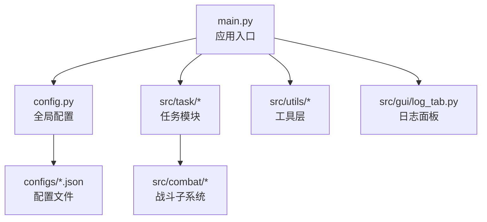
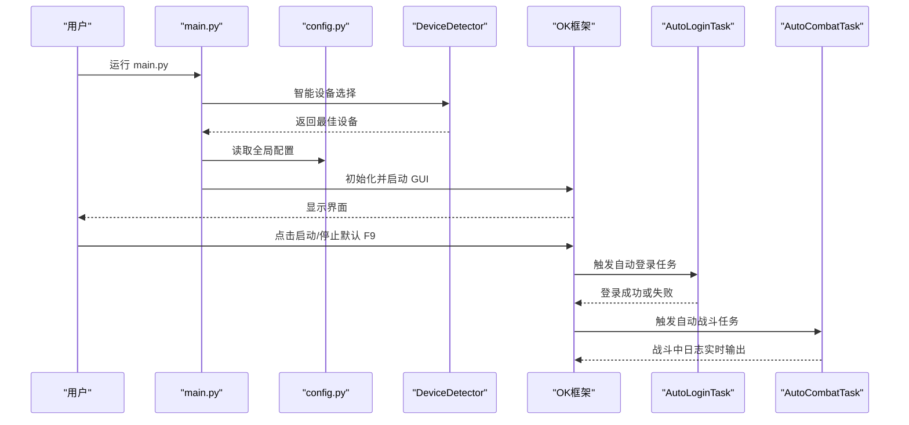
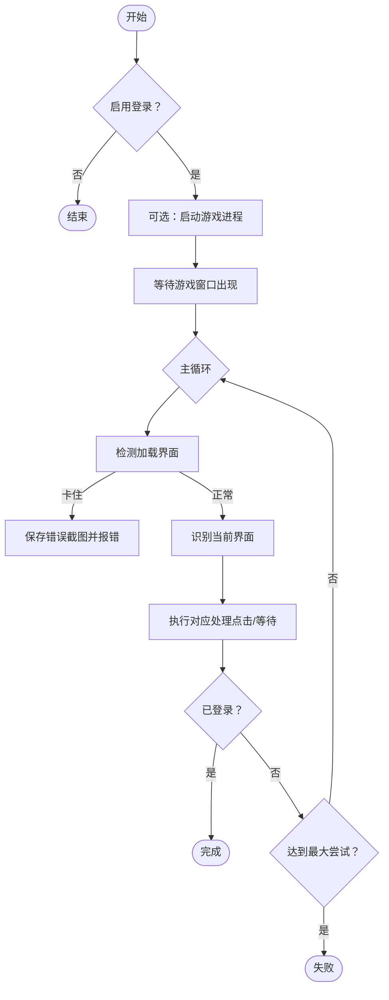
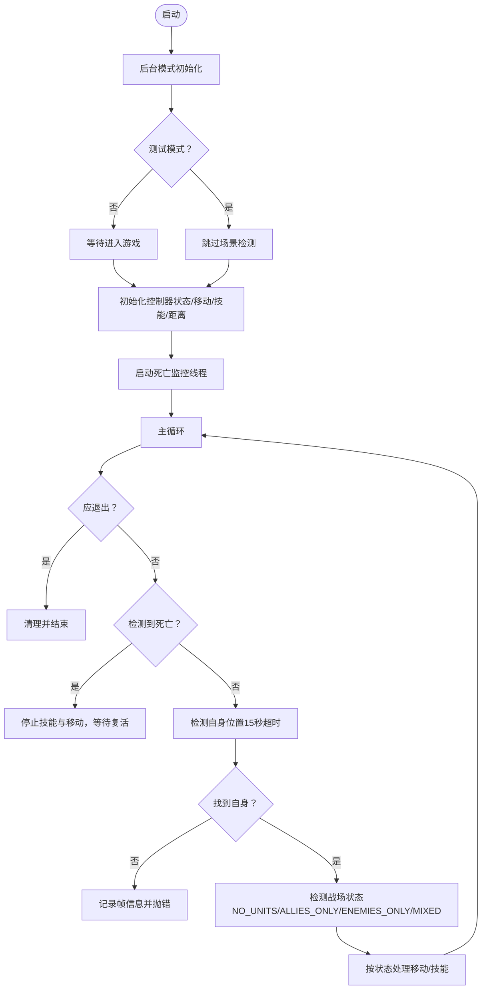
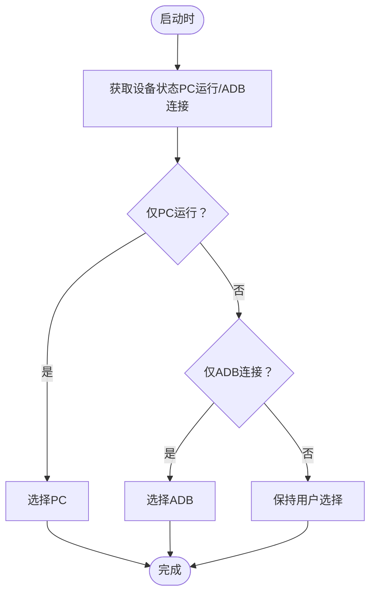
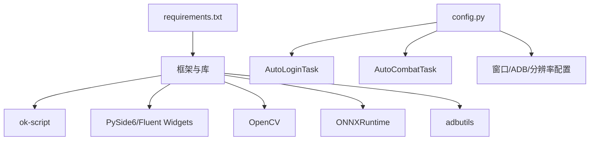

# 快速开始

<cite>
**本文引用的文件**
- [main.py](file://main.py)
- [config.py](file://config.py)
- [requirements.txt](file://requirements.txt)
- [README.md](file://README.md)
- [configs/Basic Options.json](file://configs/Basic%20Options.json)
- [configs/devices.json](file://configs/devices.json)
- [configs/AutoCombatTask.json](file://configs/AutoCombatTask.json)
- [configs/AutoLoginTask.json](file://configs/AutoLoginTask.json)
- [configs/ui_config.json](file://configs/ui_config.json)
- [src/task/AutoCombatTask.py](file://src/task/AutoCombatTask.py)
- [src/task/AutoLoginTask.py](file://src/task/AutoLoginTask.py)
- [src/utils/DeviceDetector.py](file://src/utils/DeviceDetector.py)
- [src/gui/log_tab.py](file://src/gui/log_tab.py)
- [docs/自动战斗系统流程图.md](file://docs/自动战斗系统流程图.md)
</cite>

## 目录
1. [简介](#简介)
2. [项目结构](#项目结构)
3. [核心组件](#核心组件)
4. [架构总览](#架构总览)
5. [详细组件分析](#详细组件分析)
6. [依赖分析](#依赖分析)
7. [性能考虑](#性能考虑)
8. [故障排查指南](#故障排查指南)
9. [结论](#结论)
10. [附录](#附录)

## 简介
本指南面向首次使用者，帮助你在最短时间内完成安装、配置与启动，体验自动登录与自动战斗的核心功能。你将学会：
- 安装与运行环境准备
- 基本配置（设备选择、游戏窗口、基础参数）
- 一键启动与基本操作
- 功能验证（日志检查、战斗测试）
- 常见使用场景的快速配置方案

## 项目结构
项目采用“配置驱动 + 任务模块 + 工具层”的分层组织，核心入口负责初始化配置与启动 GUI；任务模块实现具体自动化流程；工具层提供设备检测、后台管理、截图等通用能力。

图表来源
- [main.py:1-107](file://main.py#L1-L107)
- [config.py:68-148](file://config.py#L68-L148)

章节来源
- [main.py:1-107](file://main.py#L1-L107)
- [config.py:68-148](file://config.py#L68-L148)

## 核心组件
- 应用入口与启动
  - main.py：执行智能设备选择、打补丁、初始化 OK 框架并启动 GUI。
- 全局配置中心
  - config.py：集中定义 OCR、模板匹配、窗口、ADB、分辨率、任务列表、自定义标签页等。
- 任务模块
  - AutoLoginTask：自动启动游戏、处理登录界面、问卷调查、加载检测与状态容错。
  - AutoCombatTask：自动战斗主任务，包含状态检测、移动控制、技能释放、并行死亡监控。
- 工具层
  - DeviceDetector：检测 PC 游戏与模拟器 ADB 连接，提供智能设备选择。
- 配置文件
  - devices.json：首选设备、PC 路径、捕获方式等。
  - AutoLoginTask.json / AutoCombatTask.json：任务行为参数。
  - Basic Options.json / ui_config.json：基础选项与界面主题。

章节来源
- [main.py:99-107](file://main.py#L99-L107)
- [config.py:68-148](file://config.py#L68-L148)
- [src/task/AutoLoginTask.py:205-267](file://src/task/AutoLoginTask.py#L205-L267)
- [src/task/AutoCombatTask.py:84-134](file://src/task/AutoCombatTask.py#L84-L134)
- [src/utils/DeviceDetector.py:112-134](file://src/utils/DeviceDetector.py#L112-L134)
- [configs/devices.json:1-7](file://configs/devices.json#L1-L7)
- [configs/AutoLoginTask.json:1-15](file://configs/AutoLoginTask.json#L1-L15)
- [configs/AutoCombatTask.json:1-13](file://configs/AutoCombatTask.json#L1-L13)
- [configs/Basic Options.json:1-13](file://configs/Basic%20Options.json#L1-L13)
- [configs/ui_config.json:1-17](file://configs/ui_config.json#L1-L17)

## 架构总览
下面的序列图展示了从启动到进入自动战斗的典型流程，以及关键组件之间的交互。

图表来源
- [main.py:99-107](file://main.py#L99-L107)
- [src/utils/DeviceDetector.py:112-134](file://src/utils/DeviceDetector.py#L112-L134)
- [src/task/AutoLoginTask.py:205-267](file://src/task/AutoLoginTask.py#L205-L267)
- [src/task/AutoCombatTask.py:84-134](file://src/task/AutoCombatTask.py#L84-L134)

## 详细组件分析

### 自动登录任务（AutoLoginTask）
- 职责
  - 自动启动游戏（可选）、处理登录界面、问卷调查、加载界面检测与停滞保护、状态容错。
- 关键流程
  - 初始化后台模式与窗口句柄
  - 等待游戏窗口出现
  - 循环检测界面状态（加载/登录/问卷/未知），执行对应处理
  - 加载界面检测：右下角百分比识别，停滞超时保护
  - 状态容错：在判定失败后的一段缓冲期内再次确认成功
- 常用配置项
  - 启用、自动启动游戏、等待超时、最大尝试次数、账号输入、登录等待超时、加载停滞超时、启用加载检测、启用状态容错

图表来源
- [src/task/AutoLoginTask.py:205-267](file://src/task/AutoLoginTask.py#L205-L267)
- [src/task/AutoLoginTask.py:512-681](file://src/task/AutoLoginTask.py#L512-L681)

章节来源
- [src/task/AutoLoginTask.py:205-267](file://src/task/AutoLoginTask.py#L205-L267)
- [src/task/AutoLoginTask.py:512-681](file://src/task/AutoLoginTask.py#L512-L681)
- [configs/AutoLoginTask.json:1-15](file://configs/AutoLoginTask.json#L1-L15)

### 自动战斗任务（AutoCombatTask）
- 职责
  - 在进入游戏后，持续进行状态检测、移动控制、技能释放，并支持后台模式与伪最小化。
- 关键流程
  - 初始化后台管理器、分辨率检查、等待进入游戏（测试模式可跳过）
  - 启动死亡状态并行监控线程
  - 主循环：死亡检测、自身检测、战场状态判断、距离控制、技能释放
  - 情况1-4：无单位、仅友方、仅敌方、混合单位，分别采取不同策略
- 常用配置项
  - 测试模式、详细日志、自动普攻/技能1/技能2/大招、普攻/技能间隔、移动持续时间

图表来源
- [src/task/AutoCombatTask.py:84-134](file://src/task/AutoCombatTask.py#L84-L134)
- [src/task/AutoCombatTask.py:197-271](file://src/task/AutoCombatTask.py#L197-L271)
- [docs/自动战斗系统流程图.md:66-95](file://docs/自动战斗系统流程图.md#L66-L95)

章节来源
- [src/task/AutoCombatTask.py:84-134](file://src/task/AutoCombatTask.py#L84-L134)
- [src/task/AutoCombatTask.py:197-271](file://src/task/AutoCombatTask.py#L197-L271)
- [configs/AutoCombatTask.json:1-13](file://configs/AutoCombatTask.json#L1-L13)

### 设备选择与智能切换
- 功能概述
  - 检测 PC 游戏窗口与模拟器 ADB 连接状态，自动选择最佳设备（PC 或 ADB），并在冲突时保持用户选择。
- 关键点
  - 该逻辑需在 OK(config) 之前执行，以确保配置变更生效
  - 支持跳过窗口位置检查，便于后台运行

图表来源
- [main.py:54-95](file://main.py#L54-L95)
- [src/utils/DeviceDetector.py:112-134](file://src/utils/DeviceDetector.py#L112-L134)

章节来源
- [main.py:54-95](file://main.py#L54-L95)
- [src/utils/DeviceDetector.py:112-134](file://src/utils/DeviceDetector.py#L112-L134)

## 依赖分析
- 运行环境与依赖
  - 基于 ok-script 框架，结合 PySide6、OpenCV、ONNXRuntime、adbutils 等
  - 通过 requirements.txt 统一声明
- 配置与任务耦合
  - config.py 中定义的任务列表决定哪些任务会被注册为一次性任务或触发任务
  - GUI 配置文件（如 Basic Options.json、AutoCombatTask.json、AutoLoginTask.json）驱动任务行为

图表来源
- [requirements.txt:1-14](file://requirements.txt#L1-L14)
- [config.py:131-141](file://config.py#L131-L141)

章节来源
- [requirements.txt:1-14](file://requirements.txt#L1-L14)
- [config.py:131-141](file://config.py#L131-L141)

## 性能考虑
- 后台模式与伪最小化
  - 启用后台模式后，窗口可最小化或被遮挡，系统自动伪最小化以保证截图与输入
- 触发间隔与资源占用
  - 增大触发间隔可降低 CPU/GPU 使用率，适合长时间挂机
- 死亡检测与主循环
  - 死亡检测采用并行线程，主循环延迟优化，提升响应速度与稳定性

章节来源
- [config.py:50-66](file://config.py#L50-L66)
- [config.py:94-101](file://config.py#L94-L101)
- [docs/自动战斗系统流程图.md:156-178](file://docs/自动战斗系统流程图.md#L156-L178)

## 故障排查指南
- 启动与设备选择
  - 若设备选择不符合预期，确认 devices.json 的 preferred 字段与实际运行状态
  - 如需跳过窗口位置检查以支持后台运行，可在 GUI 基础选项中启用相应设置
- 登录问题
  - 检查 AutoLoginTask.json 的等待超时、最大尝试次数、加载停滞超时等参数
  - 若出现加载停滞，系统会保存错误截图，可查看日志定位问题
- 战斗问题
  - 启用“详细日志”，观察日志中的帧尺寸、单位检测与距离信息
  - 若自身检测超时，检查分辨率与窗口状态，必要时调整窗口大小或关闭遮挡
- 日志导出
  - 在 GUI 中使用“导出日志”功能，将 logs 文件夹打包下载，便于问题复现与反馈

章节来源
- [configs/devices.json:1-7](file://configs/devices.json#L1-L7)
- [configs/AutoLoginTask.json:1-15](file://configs/AutoLoginTask.json#L1-L15)
- [src/task/AutoLoginTask.py:512-681](file://src/task/AutoLoginTask.py#L512-L681)
- [src/task/AutoCombatTask.py:166-175](file://src/task/AutoCombatTask.py#L166-L175)
- [main.py:11-26](file://main.py#L11-L26)

## 结论
通过本快速开始指南，你已掌握：
- 安装与运行环境准备
- 基本配置（设备、窗口、基础参数）
- 一键启动与基本操作
- 功能验证（日志检查、战斗测试）
- 常见场景的快速配置方案

建议在正式使用前先完成“自动登录 + 基础战斗测试”，确认设备与窗口状态满足要求后再进入复杂场景。

## 附录

### 快速开始步骤清单
- 环境准备
  - 安装 Python 3.10/3.11，创建并激活虚拟环境
  - 安装依赖：pip install -r requirements.txt
- 启动应用
  - 运行 python main.py 启动图形化界面
- 基本配置
  - 在 GUI 中设置“后台模式”、“启动/停止快捷键”（默认 F9）
  - 在“设备选择”中确认首选设备（PC 或 ADB）
  - 在“游戏热键配置”中设置普通攻击、技能1、技能2、大招按键
- 一键启动
  - 打开游戏，点击 GUI 中的启动按钮或按下 F9
- 验证功能
  - 查看实时日志面板，确认登录与战斗流程正常
  - 导出日志以便问题排查

章节来源
- [README.md:27-81](file://README.md#L27-L81)
- [config.py:40-66](file://config.py#L40-L66)
- [configs/Basic Options.json:1-13](file://configs/Basic%20Options.json#L1-L13)
- [configs/devices.json:1-7](file://configs/devices.json#L1-L7)
- [src/gui/log_tab.py](file://src/gui/log_tab.py)