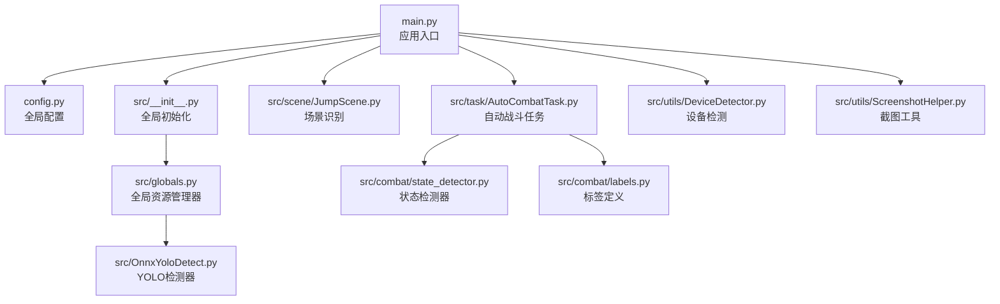
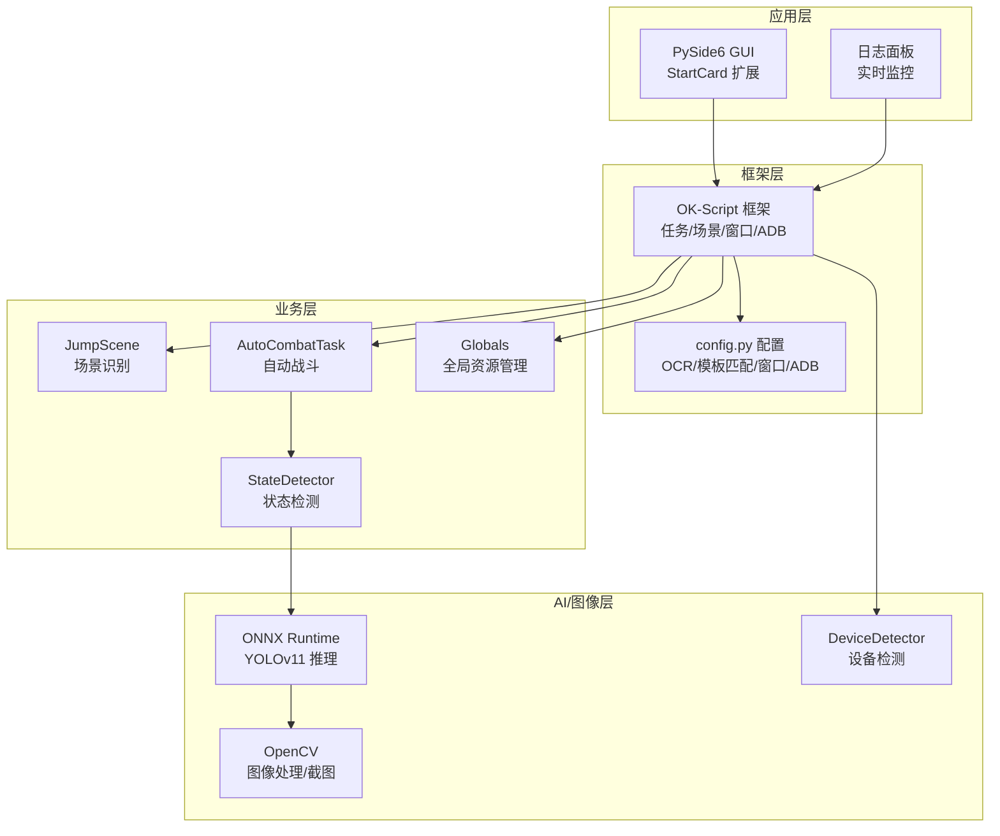
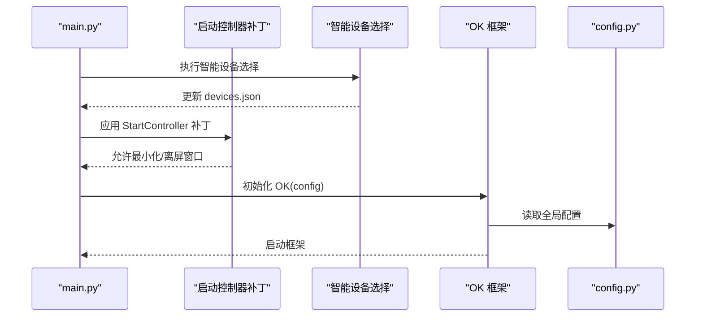
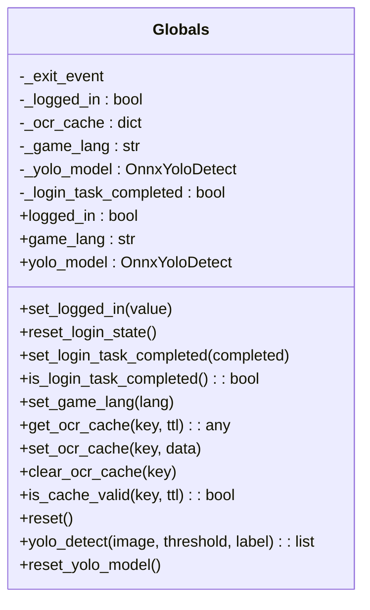
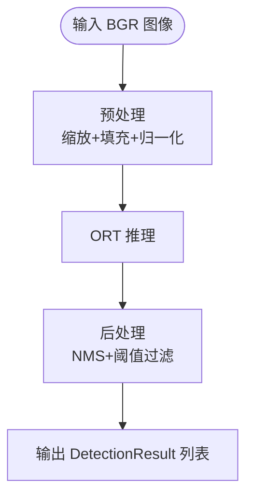
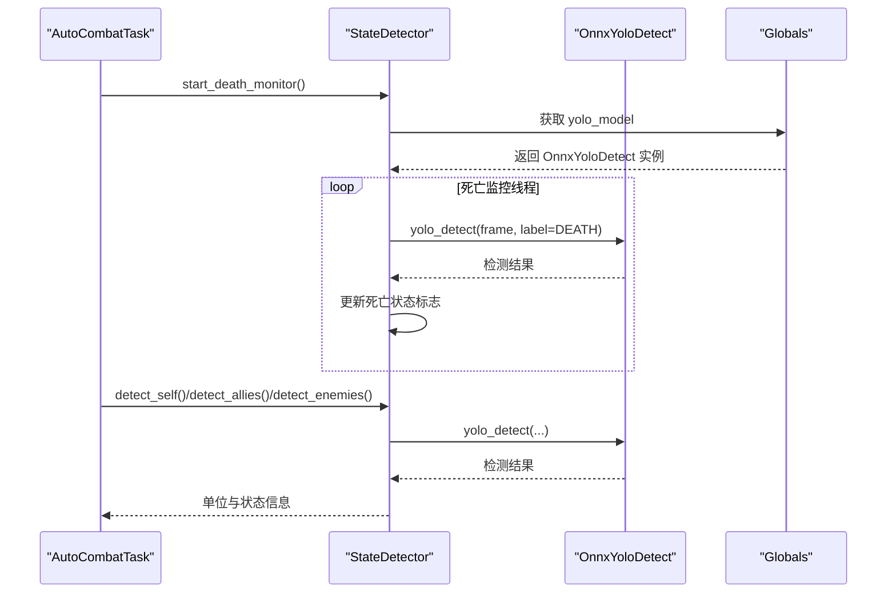
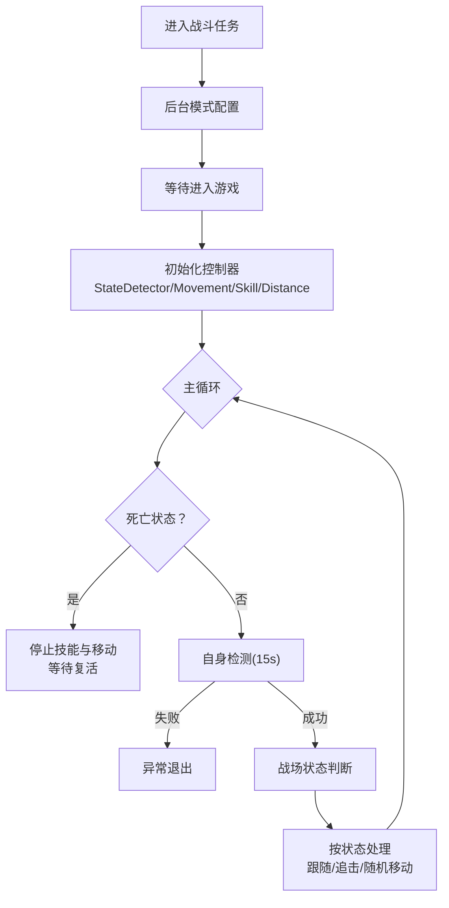
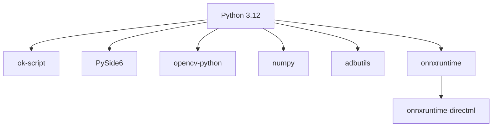

# 技术栈说明

<cite>
**本文档引用的文件**
- [requirements.txt](file://requirements.txt)
- [main.py](file://main.py)
- [config.py](file://config.py)
- [ok.yml](file://ok.yml)
- [pyappify.yml](file://pyappify.yml)
- [src/__init__.py](file://src/__init__.py)
- [src/globals.py](file://src/globals.py)
- [src/OnnxYoloDetect.py](file://src/OnnxYoloDetect.py)
- [src/utils/ScreenshotHelper.py](file://src/utils/ScreenshotHelper.py)
- [src/combat/state_detector.py](file://src/combat/state_detector.py)
- [src/combat/labels.py](file://src/combat/labels.py)
- [src/task/AutoCombatTask.py](file://src/task/AutoCombatTask.py)
- [src/utils/DeviceDetector.py](file://src/utils/DeviceDetector.py)
- [src/scene/JumpScene.py](file://src/scene/JumpScene.py)
</cite>

## 目录
1. [简介](#简介)
2. [项目结构](#项目结构)
3. [核心组件](#核心组件)
4. [架构总览](#架构总览)
5. [详细组件分析](#详细组件分析)
6. [依赖关系分析](#依赖关系分析)
7. [性能考虑](#性能考虑)
8. [故障排查指南](#故障排查指南)
9. [结论](#结论)
10. [附录](#附录)

## 简介
本项目基于 OK-Script 自动化框架，结合 PySide6 GUI、OpenCV 图像处理、ONNX Runtime AI 推理引擎以及 adbutils Android 通信库，构建了面向游戏的自动化战斗系统。技术选型围绕“低耦合、高扩展、跨平台、易维护”的设计理念展开，通过模块化组织实现场景识别、图像采集、AI 检测、任务调度与 GUI 交互的解耦。

## 项目结构
项目采用按功能域划分的模块化组织方式：
- 核心入口与配置：main.py、config.py、ok.yml、pyappify.yml
- 全局资源与工具：src/globals.py、src/utils/*
- 场景识别与任务：src/scene/*、src/task/*
- 战斗子系统：src/combat/*、src/OnnxYoloDetect.py
- 资源与资产：assets/*、configs/*

**图表来源**
- [main.py:1-107](file://main.py#L1-L107)
- [config.py:68-148](file://config.py#L68-L148)
- [src/__init__.py:17-32](file://src/__init__.py#L17-L32)
- [src/globals.py:16-257](file://src/globals.py#L16-L257)
- [src/OnnxYoloDetect.py:17-315](file://src/OnnxYoloDetect.py#L17-L315)
- [src/scene/JumpScene.py:8-216](file://src/scene/JumpScene.py#L8-L216)
- [src/task/AutoCombatTask.py:32-693](file://src/task/AutoCombatTask.py#L32-L693)
- [src/combat/state_detector.py:24-446](file://src/combat/state_detector.py#L24-L446)
- [src/combat/labels.py:8-51](file://src/combat/labels.py#L8-L51)
- [src/utils/DeviceDetector.py:11-149](file://src/utils/DeviceDetector.py#L11-L149)
- [src/utils/ScreenshotHelper.py:7-68](file://src/utils/ScreenshotHelper.py#L7-L68)

**章节来源**
- [main.py:1-107](file://main.py#L1-L107)
- [config.py:68-148](file://config.py#L68-L148)
- [src/__init__.py:17-32](file://src/__init__.py#L17-L32)

## 核心组件
- OK-Script 自动化框架：提供任务调度、场景识别、窗口交互、ADB 通信等基础设施，项目通过其配置项与全局对象集成自定义能力。
- PySide6 GUI 框架：提供桌面端图形界面，配合 Fluent Widgets 实现现代化 UI；项目通过 StartCard 扩展导出日志功能，并对启动控制器进行补丁以支持后台模式。
- OpenCV 图像处理库：用于截图保存、特征模板提取与预处理，支撑场景识别与模板匹配。
- ONNX Runtime AI 推理引擎：YOLOv11 模型推理，实现战场单位识别与状态检测，支持 CPU/GPU 执行提供者。
- adbutils Android 通信库：检测 PC 游戏与模拟器连接状态，实现智能设备选择与 ADB 设备管理。

**章节来源**
- [requirements.txt:1-14](file://requirements.txt#L1-L14)
- [config.py:81-101](file://config.py#L81-L101)
- [src/globals.py:204-257](file://src/globals.py#L204-L257)
- [src/OnnxYoloDetect.py:33-67](file://src/OnnxYoloDetect.py#L33-L67)
- [src/utils/DeviceDetector.py:11-149](file://src/utils/DeviceDetector.py#L11-L149)

## 架构总览
整体架构采用“框架驱动 + 模块化扩展”的设计，OK-Script 提供底层能力，业务逻辑通过任务与场景模块实现，AI 检测与图像处理作为支撑层，GUI 提供可视化控制与日志展示。

**图表来源**
- [main.py:99-107](file://main.py#L99-L107)
- [config.py:68-148](file://config.py#L68-L148)
- [src/scene/JumpScene.py:8-216](file://src/scene/JumpScene.py#L8-L216)
- [src/task/AutoCombatTask.py:32-693](file://src/task/AutoCombatTask.py#L32-L693)
- [src/combat/state_detector.py:24-446](file://src/combat/state_detector.py#L24-L446)
- [src/globals.py:16-257](file://src/globals.py#L16-L257)
- [src/OnnxYoloDetect.py:17-315](file://src/OnnxYoloDetect.py#L17-L315)
- [src/utils/DeviceDetector.py:11-149](file://src/utils/DeviceDetector.py#L11-L149)

## 详细组件分析

### OK-Script 自动化框架与配置
- 入口与启动：main.py 中先执行智能设备选择与启动控制器补丁，随后初始化 OK 框架并启动。
- 全局配置：config.py 定义 OCR、模板匹配、窗口交互、ADB、分辨率与窗口尺寸等关键参数，并注册一次性任务、触发任务、自定义标签页与场景。
- 版本与打包：ok.yml 与 pyappify.yml 指定 Python 版本、主脚本、管理员权限与依赖文件，确保跨平台分发一致性。

**图表来源**
- [main.py:54-107](file://main.py#L54-L107)
- [config.py:68-148](file://config.py#L68-L148)
- [ok.yml:1-12](file://ok.yml#L1-L12)
- [pyappify.yml:1-22](file://pyappify.yml#L1-L22)

**章节来源**
- [main.py:54-107](file://main.py#L54-L107)
- [config.py:68-148](file://config.py#L68-L148)
- [ok.yml:1-12](file://ok.yml#L1-L12)
- [pyappify.yml:1-22](file://pyappify.yml#L1-L22)

### 全局资源管理器（Globals）
- 职责：集中管理登录状态、OCR 缓存、游戏语言与 YOLO 模型的延迟加载与复用。
- 设计要点：使用单例模式与延迟初始化，避免不必要的资源占用；提供缓存 TTL 控制与重置接口。

**图表来源**
- [src/globals.py:16-257](file://src/globals.py#L16-L257)

**章节来源**
- [src/globals.py:16-257](file://src/globals.py#L16-L257)

### ONNX Runtime YOLO 检测器（OnnxYoloDetect）
- 功能：封装 ONNX Runtime 推理会话，提供预处理、推理与后处理（NMS）完整链路。
- 性能：优先尝试 CUDA 执行提供者，回退至 CPU；支持动态输入尺寸与标签过滤。
- 数据流：输入 BGR 图像 → 预处理 → 推理 → 后处理 → DetectionResult 列表。

**图表来源**
- [src/OnnxYoloDetect.py:68-186](file://src/OnnxYoloDetect.py#L68-L186)
- [src/OnnxYoloDetect.py:234-258](file://src/OnnxYoloDetect.py#L234-L258)

**章节来源**
- [src/OnnxYoloDetect.py:17-315](file://src/OnnxYoloDetect.py#L17-L315)

### 战斗状态检测器（StateDetector）
- 功能：基于 YOLO 检测战场单位与状态，支持并行死亡监控线程与同步检测方法。
- 设计：通过 og.my_app.yolo_detect 调用全局 YOLO 模型，结合 CombatLabel 标签进行分类检测。

**图表来源**
- [src/combat/state_detector.py:72-184](file://src/combat/state_detector.py#L72-L184)
- [src/combat/state_detector.py:152-177](file://src/combat/state_detector.py#L152-L177)
- [src/globals.py:204-257](file://src/globals.py#L204-L257)
- [src/OnnxYoloDetect.py:234-258](file://src/OnnxYoloDetect.py#L234-L258)

**章节来源**
- [src/combat/state_detector.py:24-446](file://src/combat/state_detector.py#L24-L446)
- [src/combat/labels.py:8-51](file://src/combat/labels.py#L8-L51)

### 自动战斗任务（AutoCombatTask）
- 流程：并行死亡监控 → 自身检测 → 战场状态判断 → 技能与移动控制。
- 特性：支持测试模式、详细日志、GUI 配置驱动、伪后台模式与分辨率适配。

**图表来源**
- [src/task/AutoCombatTask.py:84-271](file://src/task/AutoCombatTask.py#L84-L271)
- [src/task/AutoCombatTask.py:302-647](file://src/task/AutoCombatTask.py#L302-L647)

**章节来源**
- [src/task/AutoCombatTask.py:32-693](file://src/task/AutoCombatTask.py#L32-L693)

### 场景识别（JumpScene）
- 功能：基于模板匹配与特征检测识别主菜单、登录界面、大厅、英雄选择、加载中、游戏中、结算等场景。
- 适配：结合分辨率适配器，动态更新分辨率并给出不合规警告。

**章节来源**
- [src/scene/JumpScene.py:8-216](file://src/scene/JumpScene.py#L8-L216)

### 截图与特征工具（ScreenshotHelper）
- 功能：保存截图、提取特征模板，生成 COCO 格式标注条目，便于训练与验证。

**章节来源**
- [src/utils/ScreenshotHelper.py:7-68](file://src/utils/ScreenshotHelper.py#L7-L68)

### 设备检测（DeviceDetector）
- 功能：检测 PC 游戏窗口与 ADB 设备连接状态，实现智能默认设备选择（PC 或 ADB）。

**章节来源**
- [src/utils/DeviceDetector.py:11-149](file://src/utils/DeviceDetector.py#L11-L149)

## 依赖关系分析
- Python 版本：要求 Python 3.12，确保与 ONNX Runtime、PySide6 等依赖兼容。
- 核心依赖：ok-script、PySide6、opencv-python、numpy、adbutils、onnxruntime、onnxruntime-directml 等。
- 兼容性：ONNX Runtime 支持 DirectML 与 CUDA 执行提供者；OpenCV 与 numpy 提供稳定的图像处理基础；adbutils 用于 ADB 设备管理。

**图表来源**
- [requirements.txt:1-14](file://requirements.txt#L1-L14)
- [ok.yml:1-2](file://ok.yml#L1-L2)
- [pyappify.yml:8,18](file://pyappify.yml#L8,L18)

**章节来源**
- [requirements.txt:1-14](file://requirements.txt#L1-L14)
- [ok.yml:1-2](file://ok.yml#L1-L2)
- [pyappify.yml:8,18](file://pyappify.yml#L8,L18)

## 性能考虑
- 推理加速：优先使用 CUDA 执行提供者，回退 CPU；合理设置置信度与 NMS 阈值，平衡精度与速度。
- 资源复用：全局 YOLO 模型延迟加载与复用，避免重复初始化；OCR 缓存设置合理 TTL，减少重复识别。
- 后台模式：通过最小化/离屏窗口与伪最小化支持，降低前台占用；后台模式下可静音游戏窗口。
- 图像处理：OpenCV 预处理采用固定输入尺寸策略，减少推理开销；模板匹配阈值与特征命名规范化，提升稳定性。

## 故障排查指南
- 启动异常：检查 Python 版本与依赖安装，确认 requirements.txt 与 ok.yml/pyappify.yml 配置一致。
- 设备选择：若 PC 与模拟器同时运行，保持用户选择；如需自动切换，检查 DeviceDetector 的窗口关键词与 ADB 设备列表。
- YOLO 推理：确认 ONNX 模型路径存在，ORT 执行提供者可用；必要时切换至 CPU 执行提供者。
- 截图与识别：检查截图保存路径与模板特征目录；确保分辨率符合 16:9 比例并满足最小尺寸要求。
- 日志导出：通过 StartCard 扩展导出 logs 目录压缩包，定位问题时优先查看错误日志文件。

**章节来源**
- [main.py:11-26](file://main.py#L11-L26)
- [config.py:108-117](file://config.py#L108-L117)
- [src/utils/DeviceDetector.py:113-134](file://src/utils/DeviceDetector.py#L113-L134)
- [src/OnnxYoloDetect.py:42-57](file://src/OnnxYoloDetect.py#L42-L57)

## 结论
本项目通过 OK-Script 框架整合 GUI、任务调度、场景识别与 AI 推理，形成一套可扩展、可维护的游戏自动化解决方案。技术栈选择兼顾性能与易用性，模块化设计便于功能迭代与问题定位。建议在部署时严格遵循 Python 版本与依赖版本要求，并结合实际硬件环境优化推理提供者与检测阈值。

## 附录
- 版本与依赖要求
  - Python：3.12
  - ok-script：>=1.0.0
  - PySide6-Essentials：>=6.7.0
  - PySide6-Fluent-Widgets：>=1.5.5
  - opencv-python：>=4.9.0.80
  - numpy：>=1.26.4
  - adbutils：>=2.2.1
  - onnxruntime：>=1.16.0
  - onnxruntime-directml：>=1.16.0
  - 其他：pywin32、psutil、pydirectinput、pyperclip、opencc

**章节来源**
- [requirements.txt:1-14](file://requirements.txt#L1-L14)
- [ok.yml:1-2](file://ok.yml#L1-L2)
- [pyappify.yml:8,18](file://pyappify.yml#L8,L18)