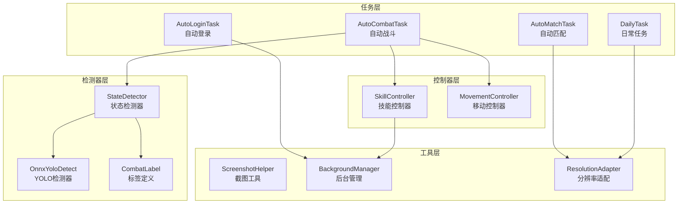
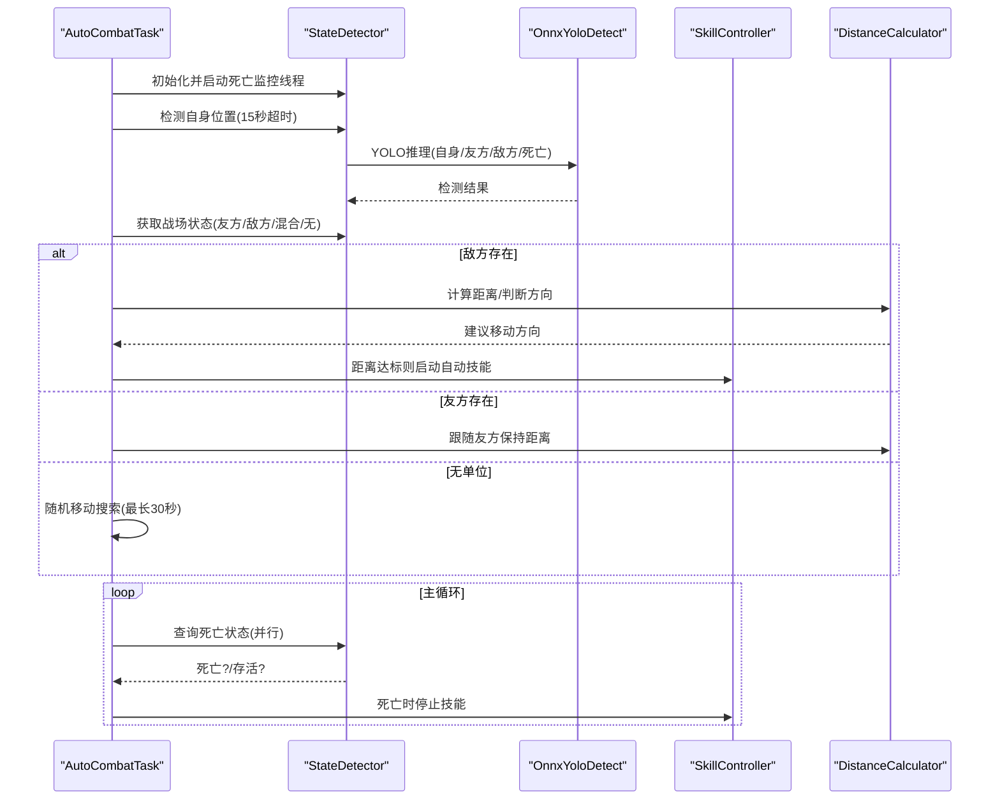
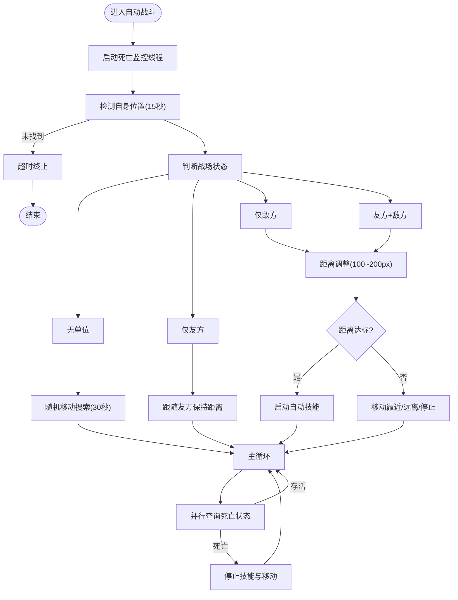
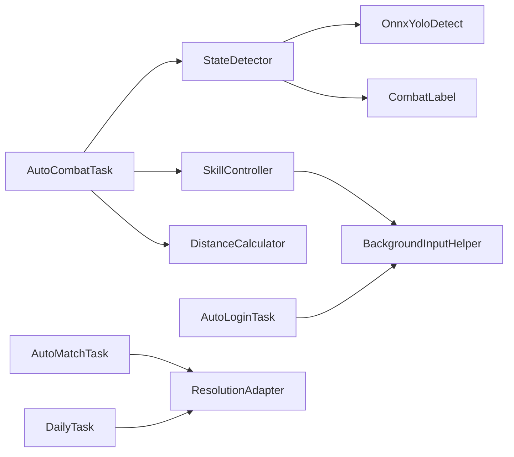

# 核心功能特性

<cite>
**本文档引用的文件**
- [src/task/AutoCombatTask.py](file://src/task/AutoCombatTask.py)
- [src/combat/state_detector.py](file://src/combat/state_detector.py)
- [src/combat/skill_controller.py](file://src/combat/skill_controller.py)
- [src/combat/distance_calculator.py](file://src/combat/distance_calculator.py)
- [src/combat/labels.py](file://src/combat/labels.py)
- [src/OnnxYoloDetect.py](file://src/OnnxYoloDetect.py)
- [src/task/AutoLoginTask.py](file://src/task/AutoLoginTask.py)
- [src/task/AutoMatchTask.py](file://src/task/AutoMatchTask.py)
- [src/task/DailyTask.py](file://src/task/DailyTask.py)
- [configs/AutoCombatTask.json](file://configs/AutoCombatTask.json)
- [configs/AutoLoginTask.json](file://configs/AutoLoginTask.json)
- [configs/AutoMatchTask.json](file://configs/AutoMatchTask.json)
- [configs/DailyTask.json](file://configs/DailyTask.json)
- [requirements.txt](file://requirements.txt)
</cite>

## 目录
1. [简介](#简介)
2. [项目结构](#项目结构)
3. [核心组件](#核心组件)
4. [架构总览](#架构总览)
5. [详细组件分析](#详细组件分析)
6. [依赖关系分析](#依赖关系分析)
7. [性能考量](#性能考量)
8. [故障排查指南](#故障排查指南)
9. [结论](#结论)
10. [附录](#附录)

## 简介
本文件面向OK-Jump项目的核心功能特性进行全面介绍，重点覆盖自动战斗系统的工作原理与实现细节，包括YOLO智能检测、并行死亡检测、技能自动化控制等关键技术；同时涵盖自动登录、自动匹配、日常任务、自动教程等其他核心功能，并提供使用场景、技术实现与配置方法说明，以及功能对比表帮助用户快速选择合适的自动化策略。

## 项目结构
OK-Jump采用模块化设计，围绕“任务-控制器-检测器-工具”四层组织：
- 任务层：负责编排业务流程（自动登录、自动匹配、日常任务、自动战斗）
- 控制器层：封装具体交互行为（技能控制、移动控制、后台输入）
- 检测器层：基于YOLO模型进行视觉识别（自身、友方、敌方、死亡状态）
- 工具层：提供截图、分辨率适配、设备检测、后台管理等基础设施

**图表来源**
- [src/task/AutoLoginTask.py:1-800](file://src/task/AutoLoginTask.py#L1-L800)
- [src/task/AutoMatchTask.py:1-104](file://src/task/AutoMatchTask.py#L1-L104)
- [src/task/DailyTask.py:1-133](file://src/task/DailyTask.py#L1-L133)
- [src/task/AutoCombatTask.py:1-693](file://src/task/AutoCombatTask.py#L1-L693)
- [src/combat/state_detector.py:1-446](file://src/combat/state_detector.py#L1-L446)
- [src/combat/skill_controller.py:1-347](file://src/combat/skill_controller.py#L1-L347)
- [src/OnnxYoloDetect.py:1-315](file://src/OnnxYoloDetect.py#L1-L315)
- [src/combat/labels.py:1-51](file://src/combat/labels.py#L1-L51)

**章节来源**
- [src/task/AutoLoginTask.py:1-800](file://src/task/AutoLoginTask.py#L1-L800)
- [src/task/AutoMatchTask.py:1-104](file://src/task/AutoMatchTask.py#L1-L104)
- [src/task/DailyTask.py:1-133](file://src/task/DailyTask.py#L1-L133)
- [src/task/AutoCombatTask.py:1-693](file://src/task/AutoCombatTask.py#L1-L693)
- [src/combat/state_detector.py:1-446](file://src/combat/state_detector.py#L1-L446)
- [src/combat/skill_controller.py:1-347](file://src/combat/skill_controller.py#L1-L347)
- [src/OnnxYoloDetect.py:1-315](file://src/OnnxYoloDetect.py#L1-L315)
- [src/combat/labels.py:1-51](file://src/combat/labels.py#L1-L51)

## 核心组件
- 自动战斗系统：以YOLO视觉识别为核心，结合并行死亡检测、距离控制与技能自动化，实现全场景智能战斗。
- 自动登录：处理适龄提示、账户登录、问卷调查、加载界面等多阶段流程，具备加载停滞检测与状态容错。
- 自动匹配：定位大厅、发起匹配、自动接受，支持超时控制与相对坐标兜底。
- 日常任务：自动导航至任务界面、批量执行日常任务、收集奖励、使用体力。
- YOLO检测器：通用ONNX推理引擎，支持预处理、NMS后处理与标签过滤。
- 技能控制器：统一按键/点击调度，支持前台/后台模式与ADB模式。
- 距离计算器：带滞后的缓冲区距离控制，避免边界抖动。

**章节来源**
- [src/task/AutoCombatTask.py:1-693](file://src/task/AutoCombatTask.py#L1-L693)
- [src/task/AutoLoginTask.py:1-800](file://src/task/AutoLoginTask.py#L1-L800)
- [src/task/AutoMatchTask.py:1-104](file://src/task/AutoMatchTask.py#L1-L104)
- [src/task/DailyTask.py:1-133](file://src/task/DailyTask.py#L1-L133)
- [src/OnnxYoloDetect.py:1-315](file://src/OnnxYoloDetect.py#L1-L315)
- [src/combat/skill_controller.py:1-347](file://src/combat/skill_controller.py#L1-L347)
- [src/combat/distance_calculator.py:1-197](file://src/combat/distance_calculator.py#L1-L197)

## 架构总览
自动战斗系统采用“任务驱动 + 多控制器协同”的架构：
- AutoCombatTask作为触发任务，协调StateDetector、SkillController、DistanceCalculator与MovementController。
- StateDetector使用OnnxYoloDetect进行YOLO推理，提供自身、友方、敌方与死亡状态检测，并内置并行死亡监控线程。
- SkillController依据配置与热键映射，按技能开关与冷却间隔自动释放技能，支持后台模式。
- DistanceCalculator提供带滞后的距离控制逻辑，指导移动方向与停止时机。

**图表来源**
- [src/task/AutoCombatTask.py:197-271](file://src/task/AutoCombatTask.py#L197-L271)
- [src/combat/state_detector.py:118-184](file://src/combat/state_detector.py#L118-L184)
- [src/OnnxYoloDetect.py:234-258](file://src/OnnxYoloDetect.py#L234-L258)
- [src/combat/skill_controller.py:211-250](file://src/combat/skill_controller.py#L211-L250)
- [src/combat/distance_calculator.py:84-158](file://src/combat/distance_calculator.py#L84-L158)

**章节来源**
- [src/task/AutoCombatTask.py:84-134](file://src/task/AutoCombatTask.py#L84-L134)
- [src/combat/state_detector.py:70-184](file://src/combat/state_detector.py#L70-L184)
- [src/combat/skill_controller.py:139-250](file://src/combat/skill_controller.py#L139-L250)
- [src/combat/distance_calculator.py:84-158](file://src/combat/distance_calculator.py#L84-L158)

## 详细组件分析

### 自动战斗系统
- 核心流程
  - 并行死亡监控：独立线程每30ms轮询死亡状态，连续两次检测到死亡才确认，连续三次未检测到才视为复活。
  - 自身检测：15秒内持续YOLO检测自身，超时则终止。
  - 战场状态判断：根据友方/敌方是否存在，分为“无单位/仅友方/仅敌方/混合”四种状态。
  - 距离控制与移动：基于距离计算器的带滞回环，维持100~200像素最佳距离，自动靠近/远离/停止。
  - 技能自动化：按配置开关与冷却间隔，自动释放普攻/技能1/技能2/大招。
- 关键特性
  - 测试模式：跳过场景检测，直接进入战斗逻辑，便于调试。
  - 详细日志：可输出YOLO检测结果、位置、距离等信息。
  - 后台模式：支持伪最小化与后台输入，确保窗口最小化时仍可运行。
- 使用场景
  - 单人副本/活动挂机：自动跟随/攻击，减少手动操作。
  - 多人组队：在友方存在时跟随，避免无目标移动。
  - 持续挂机：配合后台模式，长时间无人值守。

**图表来源**
- [src/task/AutoCombatTask.py:197-678](file://src/task/AutoCombatTask.py#L197-L678)
- [src/combat/state_detector.py:118-184](file://src/combat/state_detector.py#L118-L184)
- [src/combat/distance_calculator.py:84-158](file://src/combat/distance_calculator.py#L84-L158)

**章节来源**
- [src/task/AutoCombatTask.py:32-134](file://src/task/AutoCombatTask.py#L32-L134)
- [src/combat/state_detector.py:70-184](file://src/combat/state_detector.py#L70-L184)
- [src/combat/distance_calculator.py:84-158](file://src/combat/distance_calculator.py#L84-L158)

### YOLO智能检测与标签体系
- OnnxYoloDetect
  - 支持CPU/GPU执行提供者，自动降级。
  - 预处理：等比缩放+中心填充，BGR->RGB，NCHW格式。
  - 后处理：置信度过滤、NMS非极大值抑制、坐标还原。
  - DetectionResult封装检测框、中心点、置信度与类别ID。
- 战斗标签
  - SELF/ALLY/ENEMY/DEATH/TARGET_CIRCLE五类标签，对应fight.onnx模型输出。
- 使用方式
  - StateDetector通过og.my_app.yolo_detect调用YOLO检测，按标签过滤返回结果。

**章节来源**
- [src/OnnxYoloDetect.py:17-258](file://src/OnnxYoloDetect.py#L17-L258)
- [src/combat/labels.py:8-51](file://src/combat/labels.py#L8-L51)
- [src/combat/state_detector.py:152-156](file://src/combat/state_detector.py#L152-L156)

### 并行死亡检测
- 线程模型：独立守护线程，每30ms轮询一次，降低主线程阻塞。
- 稳健性：采用连续检测阈值（死亡≥2次，复活≥3次）避免误判。
- 状态管理：通过锁保护共享状态，支持启动/停止与状态重置。

**章节来源**
- [src/combat/state_detector.py:72-184](file://src/combat/state_detector.py#L72-L184)

### 技能自动化控制
- 配置驱动：从AutoCombatTask.json读取技能开关与间隔，从游戏热键配置读取按键映射。
- 模式适配：PC前台使用pydirectinput，后台使用SendInput；ADB模式通过框架方法转发。
- 冷却管理：分别维护上次释放时间，按配置间隔触发。
- 状态查询：支持获取当前技能状态与剩余冷却时间。

**章节来源**
- [src/combat/skill_controller.py:61-250](file://src/combat/skill_controller.py#L61-L250)
- [configs/AutoCombatTask.json:1-13](file://configs/AutoCombatTask.json#L1-L13)

### 距离控制与移动策略
- 距离范围：100~200像素为最佳范围，带滞回环避免边界抖动。
- 方向决策：根据当前距离与状态返回“靠近/远离/停止”，并在达标时停止技能。
- 向量计算：提供单位向量与反向向量，便于平滑移动。

**章节来源**
- [src/combat/distance_calculator.py:84-158](file://src/combat/distance_calculator.py#L84-L158)

### 自动登录
- 流程编排：适龄提示→账户登录→开始游戏→问卷调查→加载界面→角色选择→进入游戏。
- 加载检测：右下角百分比OCR检测，支持加载停滞超时与暂停时间补偿。
- 状态容错：失败后在缓冲期内再次确认成功状态。
- 账号输入：可选自动输入账号，含重试与校验超时控制。
- 后台模式：自动伪最小化与窗口句柄绑定，确保后台可截图与输入。

**章节来源**
- [src/task/AutoLoginTask.py:205-681](file://src/task/AutoLoginTask.py#L205-L681)
- [configs/AutoLoginTask.json:1-15](file://configs/AutoLoginTask.json#L1-L15)

### 自动匹配
- 导航至大厅：循环检测是否在大厅，最多尝试10次。
- 发起匹配：优先特征匹配开始按钮，失败则使用相对坐标点击。
- 接受匹配：在超时时间内检测接受按钮并点击。

**章节来源**
- [src/task/AutoMatchTask.py:21-104](file://src/task/AutoMatchTask.py#L21-L104)
- [configs/AutoMatchTask.json:1-6](file://configs/AutoMatchTask.json#L1-L6)

### 日常任务
- 功能清单：完成日常任务、收集奖励、使用体力。
- 导航与点击：通过特征匹配定位任务标签、任务项、领取按钮、使用体力按钮。
- 阈值控制：体力阈值可配置，默认50。

**章节来源**
- [src/task/DailyTask.py:19-133](file://src/task/DailyTask.py#L19-L133)
- [configs/DailyTask.json:1-7](file://configs/DailyTask.json#L1-L7)

## 依赖关系分析
- 运行时依赖：ok-script、opencv-python、numpy、onnxruntime、pydirectinput、adbutils等。
- 模块耦合：
  - AutoCombatTask高度依赖StateDetector与SkillController，耦合度较高但职责清晰。
  - StateDetector依赖OnnxYoloDetect与标签定义，解耦良好。
  - SkillController依赖配置与后台输入助手，支持多平台模式。
- 外部集成：通过og框架的截图、OCR、设备管理与热键转发能力，实现跨平台兼容。

**图表来源**
- [src/task/AutoCombatTask.py:21-29](file://src/task/AutoCombatTask.py#L21-L29)
- [src/combat/state_detector.py:13-14](file://src/combat/state_detector.py#L13-L14)
- [src/combat/skill_controller.py:18-18](file://src/combat/skill_controller.py#L18-L18)
- [src/task/AutoLoginTask.py:11-13](file://src/task/AutoLoginTask.py#L11-L13)
- [requirements.txt:1-14](file://requirements.txt#L1-L14)

**章节来源**
- [requirements.txt:1-14](file://requirements.txt#L1-L14)

## 性能考量
- YOLO推理
  - 优先GPU执行提供者，失败自动回退CPU，保证稳定性。
  - 输入尺寸固定为640x640，预处理与NMS优化检测效率。
- 并行监控
  - 死亡监控线程高频轮询（30ms），降低主线程等待时间。
- 距离控制
  - 带滞回环的缓冲区避免频繁切换，减少无效移动。
- 后台模式
  - 伪最小化与SendInput适配，降低窗口状态切换成本。

[本节为通用性能讨论，无需列出具体文件来源]

## 故障排查指南
- 自动战斗
  - 现象：自身检测超时（15秒内未找到自己）
    - 排查：确认分辨率与缩放比例、窗口可截图、详细日志输出。
    - 处理：提高移动持续时间、检查背景模式、启用测试模式验证流程。
  - 现象：距离调整超时（5秒内未达标）
    - 排查：目标丢失计数、锁定目标偏移阈值、移动持续时间。
    - 处理：适当增大最大等待时间、检查目标锁定逻辑。
  - 现象：死亡状态误判
    - 排查：连续检测阈值、并行监控线程状态。
    - 处理：确认死亡标签正确、检查帧获取与YOLO置信度。
- 自动登录
  - 现象：加载停滞超时
    - 排查：百分比OCR区域、ROI-OCR备选方案、暂停时间补偿。
    - 处理：调整加载停滞超时、检查网络与服务器状态。
  - 现象：账号输入失败
    - 排查：模板路径解析、输入重试次数、输入校验超时。
    - 处理：确认模板文件存在、缩短输入间隔、增加重试次数。
- 自动匹配
  - 现象：无法进入大厅
    - 排查：大厅检测特征、循环尝试次数。
    - 处理：检查特征匹配、使用相对坐标兜底。
- 日常任务
  - 现象：任务项未找到
    - 排查：特征命名一致性、遍历上限。
    - 处理：更新特征模板、增加最大尝试次数。

**章节来源**
- [src/task/AutoCombatTask.py:240-244](file://src/task/AutoCombatTask.py#L240-L244)
- [src/combat/state_detector.py:162-177](file://src/combat/state_detector.py#L162-L177)
- [src/task/AutoLoginTask.py:576-581](file://src/task/AutoLoginTask.py#L576-L581)
- [src/task/AutoMatchTask.py:62-67](file://src/task/AutoMatchTask.py#L62-L67)
- [src/task/DailyTask.py:56-73](file://src/task/DailyTask.py#L56-L73)

## 结论
OK-Jump通过“任务-控制器-检测器-工具”的分层架构，实现了从登录、匹配到战斗、日常任务的全流程自动化。自动战斗系统以YOLO视觉识别为基础，结合并行死亡检测与带滞回环的距离控制，形成稳定高效的智能战斗闭环；其他核心功能同样具备完善的流程编排与容错机制，适合不同场景下的自动化需求。建议用户根据实际游戏版本与设备环境，合理配置参数并启用详细日志以便问题定位。

[本节为总结性内容，无需列出具体文件来源]

## 附录

### 功能对比表
- 自动战斗
  - 场景：挂机刷副本/活动
  - 关键：YOLO检测、并行死亡监控、距离控制、技能冷却
  - 配置：技能开关与间隔、移动持续时间、测试模式、详细日志
- 自动登录
  - 场景：重复登录/问卷/加载处理
  - 关键：OCR百分比检测、加载停滞检测、状态容错
  - 配置：自动启动游戏、等待超时、最大尝试次数、账号输入
- 自动匹配
  - 场景：快速进入排位/活动
  - 关键：大厅导航、按钮特征匹配、超时控制
  - 配置：游戏模式、自动接受、最大等待时间
- 日常任务
  - 场景：每日任务/奖励/体力使用
  - 关键：特征匹配、批量执行、阈值控制
  - 配置：启用开关、体力阈值

**章节来源**
- [src/task/AutoCombatTask.py:46-68](file://src/task/AutoCombatTask.py#L46-L68)
- [src/task/AutoLoginTask.py:82-96](file://src/task/AutoLoginTask.py#L82-L96)
- [src/task/AutoMatchTask.py:14-19](file://src/task/AutoMatchTask.py#L14-L19)
- [src/task/DailyTask.py:11-17](file://src/task/DailyTask.py#L11-L17)