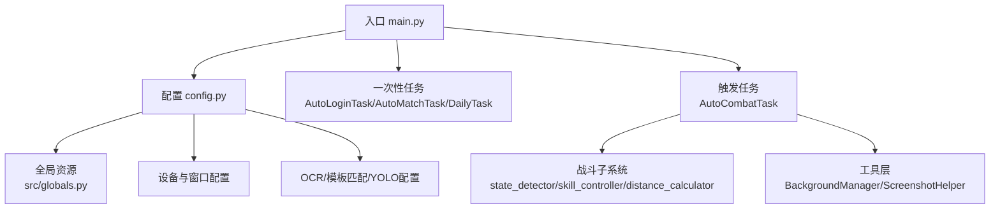
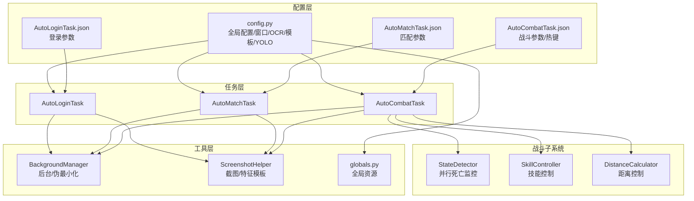
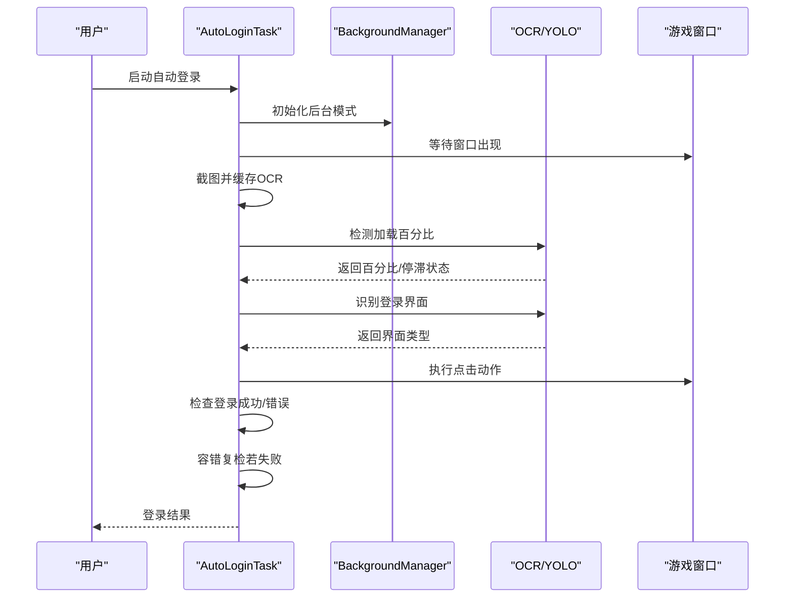
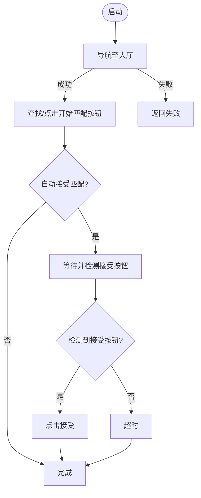
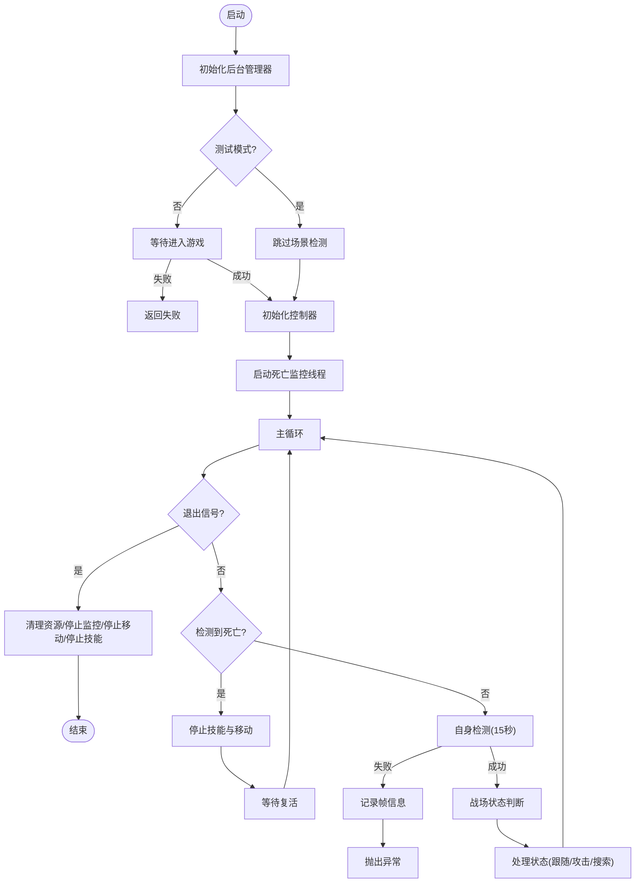
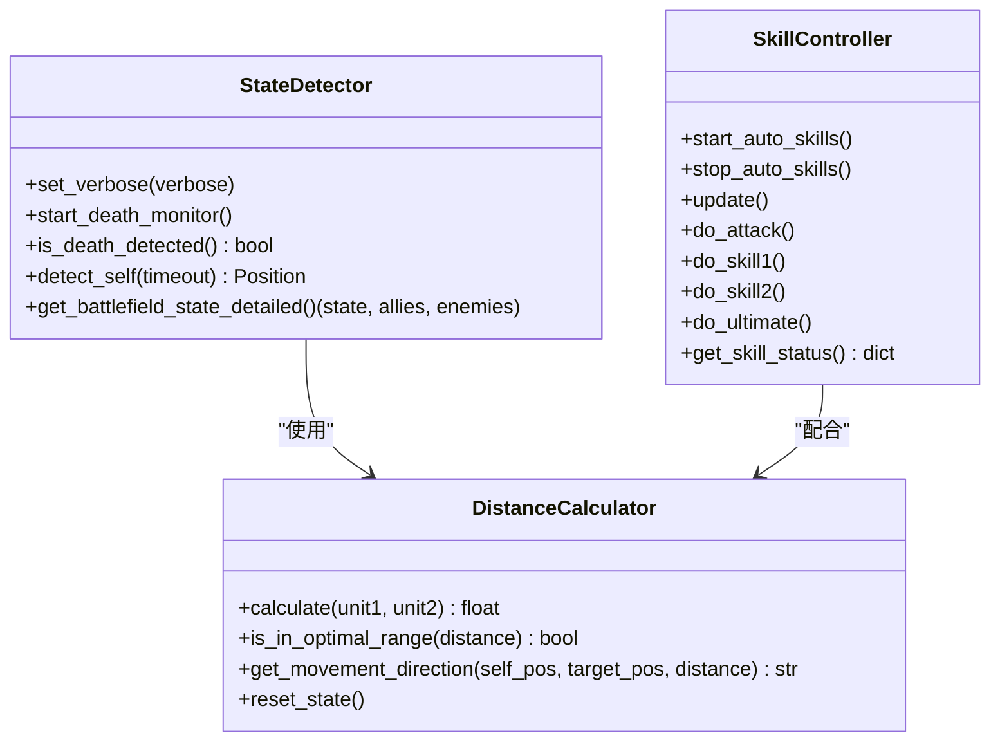
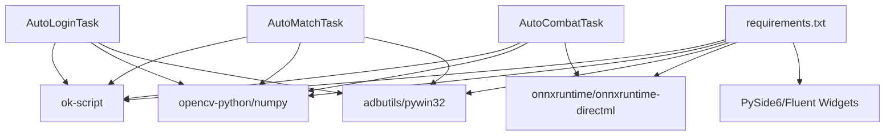

# 项目介绍

<cite>
**本文档引用的文件**
- [main.py](file://main.py)
- [config.py](file://config.py)
- [requirements.txt](file://requirements.txt)
- [AutoCombatTask.py](file://src/task/AutoCombatTask.py)
- [AutoLoginTask.py](file://src/task/AutoLoginTask.py)
- [AutoMatchTask.py](file://src/task/AutoMatchTask.py)
- [skill_controller.py](file://src/combat/skill_controller.py)
- [state_detector.py](file://src/combat/state_detector.py)
- [distance_calculator.py](file://src/combat/distance_calculator.py)
- [BackgroundManager.py](file://src/utils/BackgroundManager.py)
- [ScreenshotHelper.py](file://src/utils/ScreenshotHelper.py)
- [globals.py](file://src/globals.py)
- [自动战斗系统流程图.md](file://docs/自动战斗系统流程图.md)
- [AutoCombatTask.json](file://configs/AutoCombatTask.json)
- [AutoLoginTask.json](file://configs/AutoLoginTask.json)
- [AutoMatchTask.json](file://configs/AutoMatchTask.json)
</cite>

## 目录
1. [引言](#引言)
2. [项目结构](#项目结构)
3. [核心组件](#核心组件)
4. [架构总览](#架构总览)
5. [详细组件分析](#详细组件分析)
6. [依赖分析](#依赖分析)
7. [性能考虑](#性能考虑)
8. [故障排查指南](#故障排查指南)
9. [结论](#结论)
10. [附录](#附录)

## 引言
OK-Jump 是一款面向《漫画群星：大集结》的自动化游戏工具，旨在通过智能化的视觉识别与任务编排，为玩家提供稳定可靠的自动化支持。项目围绕“自动登录、自动匹配、自动战斗”三大核心能力构建，同时兼顾后台模式、伪最小化、加载检测与状态容错等工程细节，帮助用户在复杂的游戏场景中获得更高效、稳定的体验。

项目目标与价值：
- 提升重复性操作效率：自动登录、自动匹配、自动战斗减少人工干预。
- 增强稳定性与容错：加载检测、状态容错、死亡监控等机制降低异常风险。
- 支持多平台与多模式：同时兼容PC原版与模拟器ADB模式，后台模式下也能稳定运行。
- 可配置与可扩展：基于JSON配置与模块化设计，便于用户按需定制与二次开发。

## 项目结构
项目采用“配置驱动 + 模块化任务 + 工具层支撑”的组织方式，核心目录与职责如下：
- src/task：任务层，包含自动登录、自动匹配、自动战斗等核心任务。
- src/combat：战斗子系统，包含状态检测、技能控制、距离计算等模块。
- src/utils：通用工具层，包含后台管理、截图、设备检测等辅助能力。
- configs：配置文件集合，涵盖任务参数、热键映射、窗口与分辨率等。
- assets：资源文件，包含YOLO模型、模板图片与标注数据。
- docs：文档与流程图，指导开发与维护。
- logs/screenshots：运行时日志与截图输出目录。

**图表来源**
- [main.py:1-107](file://main.py#L1-L107)
- [config.py:68-148](file://config.py#L68-L148)

**章节来源**
- [main.py:1-107](file://main.py#L1-L107)
- [config.py:68-148](file://config.py#L68-L148)

## 核心组件
- 自动登录任务（AutoLoginTask）：负责处理登录界面、问卷调查、账号输入与加载检测，具备状态容错与错误截图能力。
- 自动匹配任务（AutoMatchTask）：负责导航至大厅、发起匹配并自动接受，支持超时控制与特征匹配。
- 自动战斗任务（AutoCombatTask）：基于YOLO视觉识别与状态机逻辑，实现智能战斗、技能释放与距离控制，支持后台模式与死亡监控。
- 战斗子系统：包含状态检测器（并行死亡监控）、技能控制器（按键/点击适配）、距离计算器（带滞后的最优距离控制）。
- 工具层：后台管理器（伪最小化、静音、前台检测）、截图助手（截图与特征模板保存）。
- 全局资源：统一管理登录状态、OCR缓存、YOLO模型等全局资源。

**章节来源**
- [AutoLoginTask.py:21-267](file://src/task/AutoLoginTask.py#L21-L267)
- [AutoMatchTask.py:5-54](file://src/task/AutoMatchTask.py#L5-L54)
- [AutoCombatTask.py:32-134](file://src/task/AutoCombatTask.py#L32-L134)
- [skill_controller.py:24-347](file://src/combat/skill_controller.py#L24-L347)
- [state_detector.py:24-185](file://src/combat/state_detector.py#L24-L185)
- [distance_calculator.py:14-197](file://src/combat/distance_calculator.py#L14-L197)
- [BackgroundManager.py:7-155](file://src/utils/BackgroundManager.py#L7-L155)
- [ScreenshotHelper.py:7-68](file://src/utils/ScreenshotHelper.py#L7-L68)
- [globals.py:16-257](file://src/globals.py#L16-L257)

## 架构总览
系统以“配置驱动 + 任务编排 + 视觉识别 + 工具支撑”为核心架构，通过OK框架统一调度，实现跨平台、跨模式的自动化。

**图表来源**
- [config.py:68-148](file://config.py#L68-L148)
- [AutoLoginTask.py:82-96](file://src/task/AutoLoginTask.py#L82-L96)
- [AutoMatchTask.py:14-19](file://src/task/AutoMatchTask.py#L14-L19)
- [AutoCombatTask.py:46-78](file://src/task/AutoCombatTask.py#L46-L78)
- [BackgroundManager.py:18-92](file://src/utils/BackgroundManager.py#L18-L92)
- [ScreenshotHelper.py:17-30](file://src/utils/ScreenshotHelper.py#L17-L30)
- [globals.py:47-61](file://src/globals.py#L47-L61)

## 详细组件分析

### 自动登录任务（AutoLoginTask）
- 功能要点
  - 登录界面识别与处理：适龄提示、账户登录、开始游戏、问卷调查。
  - 账号输入：可选输入账号，具备输入验证与重试机制。
  - 加载检测：右下角百分比识别、停滞检测与超时处理。
  - 状态容错：在判定失败后进行缓冲期内的成功复检。
  - 后台模式：自动伪最小化、窗口句柄绑定与后台输入适配。
- 关键流程
  - 启动/等待游戏窗口 → 截图与OCR缓存 → 加载检测 → 界面识别 → 动作执行 → 成功/失败判定 → 容错复检。

**图表来源**
- [AutoLoginTask.py:205-267](file://src/task/AutoLoginTask.py#L205-L267)
- [AutoLoginTask.py:512-681](file://src/task/AutoLoginTask.py#L512-L681)
- [BackgroundManager.py:18-92](file://src/utils/BackgroundManager.py#L18-L92)

**章节来源**
- [AutoLoginTask.py:21-267](file://src/task/AutoLoginTask.py#L21-L267)
- [AutoLoginTask.py:512-681](file://src/task/AutoLoginTask.py#L512-L681)
- [BackgroundManager.py:18-92](file://src/utils/BackgroundManager.py#L18-L92)

### 自动匹配任务（AutoMatchTask）
- 功能要点
  - 导航至大厅：循环检测是否在大厅。
  - 发起匹配：特征匹配或相对坐标点击开始按钮。
  - 接受匹配：定时轮询接受按钮，超时处理。
- 参数配置
  - 游戏模式、自动接受匹配、最大等待时间等。

**图表来源**
- [AutoMatchTask.py:21-54](file://src/task/AutoMatchTask.py#L21-L54)

**章节来源**
- [AutoMatchTask.py:5-54](file://src/task/AutoMatchTask.py#L5-L54)
- [AutoMatchTask.json:1-6](file://configs/AutoMatchTask.json#L1-L6)

### 自动战斗任务（AutoCombatTask）
- 功能要点
  - 并行死亡监控：独立线程持续检测死亡状态，主线程快速查询。
  - 自身检测：15秒超时内定位自身，超时即终止。
  - 战场状态判断：无单位/仅友方/仅敌方/混合四种情况。
  - 技能控制：基于配置与热键映射，按冷却时间释放普攻/技能/大招。
  - 距离控制：带滞后的最优距离控制，避免边界频繁切换。
  - 后台支持：伪最小化、静音、前台检测。
- 关键流程
  - 初始化后台/分辨率 → 等待进入游戏 → 初始化控制器 → 启动死亡监控 → 主循环（死亡检测/自身检测/状态判断/技能/移动）。

**图表来源**
- [AutoCombatTask.py:84-134](file://src/task/AutoCombatTask.py#L84-L134)
- [AutoCombatTask.py:197-271](file://src/task/AutoCombatTask.py#L197-L271)
- [state_detector.py:72-185](file://src/combat/state_detector.py#L72-L185)
- [distance_calculator.py:84-158](file://src/combat/distance_calculator.py#L84-L158)

**章节来源**
- [AutoCombatTask.py:32-134](file://src/task/AutoCombatTask.py#L32-L134)
- [AutoCombatTask.py:197-271](file://src/task/AutoCombatTask.py#L197-L271)
- [state_detector.py:24-185](file://src/combat/state_detector.py#L24-L185)
- [distance_calculator.py:14-197](file://src/combat/distance_calculator.py#L14-L197)
- [AutoCombatTask.json:1-13](file://configs/AutoCombatTask.json#L1-L13)

### 战斗子系统
- 状态检测器（StateDetector）
  - 并行死亡监控：后台线程以高频检测死亡状态，主线程快速查询。
  - 自身/友方/敌方检测：基于YOLO模型，支持详细日志与超时控制。
- 技能控制器（SkillController）
  - 配置驱动：从任务配置读取开关与间隔，从全局热键配置读取按键映射。
  - 模式适配：PC端键盘按键（支持后台SendInput），移动端点击（预留）。
- 距离计算器（DistanceCalculator）
  - 带滞后的最优距离控制：进入/离开使用不同阈值，避免边界抖动。
  - 移动方向建议：靠近/远离/停止三种状态。

**图表来源**
- [state_detector.py:24-185](file://src/combat/state_detector.py#L24-L185)
- [skill_controller.py:24-347](file://src/combat/skill_controller.py#L24-L347)
- [distance_calculator.py:14-197](file://src/combat/distance_calculator.py#L14-L197)

**章节来源**
- [state_detector.py:24-185](file://src/combat/state_detector.py#L24-L185)
- [skill_controller.py:24-347](file://src/combat/skill_controller.py#L24-L347)
- [distance_calculator.py:14-197](file://src/combat/distance_calculator.py#L14-L197)

### 工具层
- 后台管理器（BackgroundManager）
  - 后台模式开关、前台检测、静音控制、伪最小化与恢复。
- 截图助手（ScreenshotHelper）
  - 保存截图、保存特征模板、生成COCO标注条目。
- 全局资源（globals.py）
  - 登录状态、OCR缓存、YOLO模型延迟加载、登录任务完成状态。

**章节来源**
- [BackgroundManager.py:7-155](file://src/utils/BackgroundManager.py#L7-L155)
- [ScreenshotHelper.py:7-68](file://src/utils/ScreenshotHelper.py#L7-L68)
- [globals.py:16-257](file://src/globals.py#L16-L257)

## 依赖分析
- 外部依赖
  - ok-script：自动化框架核心。
  - OpenCV/Numpy：图像处理与截图。
  - adbutils/pywin32：ADB设备与Windows交互。
  - ONNX Runtime/DirectML：ONNX推理加速。
  - PySide6/Fluent Widgets：GUI界面。
- 内部耦合
  - AutoCombatTask 依赖战斗子系统与工具层；AutoLoginTask/AutoMatchTask 依赖后台管理与截图能力；全局资源为各任务共享。

**图表来源**
- [requirements.txt:1-14](file://requirements.txt#L1-L14)
- [AutoLoginTask.py:1-14](file://src/task/AutoLoginTask.py#L1-L14)
- [AutoMatchTask.py:1-2](file://src/task/AutoMatchTask.py#L1-L2)
- [AutoCombatTask.py:16-29](file://src/task/AutoCombatTask.py#L16-L29)

**章节来源**
- [requirements.txt:1-14](file://requirements.txt#L1-L14)
- [config.py:81-112](file://config.py#L81-L112)

## 性能考虑
- 死亡监控：后台线程以高频（约20Hz）检测死亡状态，避免主线程阻塞。
- 主循环延迟：战斗主循环采用短延迟，保证响应速度。
- 后台支持：伪最小化与前台检测，确保后台截图与输入稳定。
- OCR缓存：登录任务中使用OCR缓存，减少重复识别开销。
- YOLO模型：延迟加载与阈值配置，平衡精度与性能。

[本节为通用性能讨论，无需具体文件分析]

## 故障排查指南
- 登录失败
  - 检查登录界面识别是否正确，查看OCR缓存与截图保存。
  - 关注加载停滞检测与错误截图，定位卡顿原因。
  - 启用状态容错，观察缓冲期内是否自动恢复。
- 自动战斗异常
  - 查看详细日志与帧信息，确认自身检测是否超时。
  - 检查后台模式下的伪最小化与前台检测状态。
  - 核对技能配置与热键映射，确认冷却时间与按键是否正确。
- 匹配失败
  - 检查大厅导航与按钮特征匹配，必要时使用相对坐标点击。
  - 调整最大等待时间，避免过早超时。

**章节来源**
- [AutoLoginTask.py:512-681](file://src/task/AutoLoginTask.py#L512-L681)
- [AutoCombatTask.py:266-271](file://src/task/AutoCombatTask.py#L266-L271)
- [BackgroundManager.py:101-128](file://src/utils/BackgroundManager.py#L101-L128)

## 结论
OK-Jump通过模块化设计与配置驱动，实现了对《漫画群星：大集结》的登录、匹配与战斗自动化。其核心优势在于：
- 稳定性：并行死亡监控、加载检测、状态容错与后台模式支持。
- 可靠性：YOLO视觉识别与特征匹配相结合，降低误判。
- 可扩展性：清晰的模块边界与配置体系，便于功能扩展与定制。

## 附录
- 版本信息
  - 应用版本：1.0.0（来自配置）
  - 开发状态：稳定可用，支持PC原版与模拟器ADB模式
- 未来规划（基于现有架构与配置）
  - 增强战斗策略：引入更复杂的AI决策与目标锁定机制
  - 优化识别鲁棒性：多模型融合与动态阈值调整
  - 扩展任务覆盖：日常任务、活动任务等自动化
  - 用户体验：更丰富的日志与可视化面板

**章节来源**
- [config.py:74](file://config.py#L74)
- [main.py:99-107](file://main.py#L99-L107)