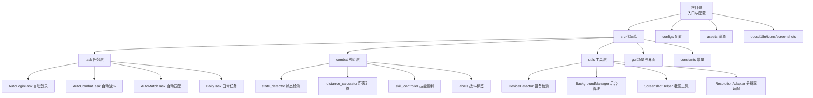
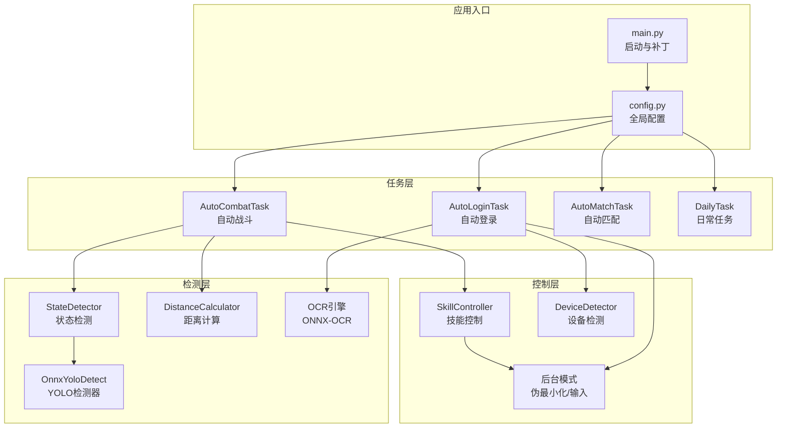
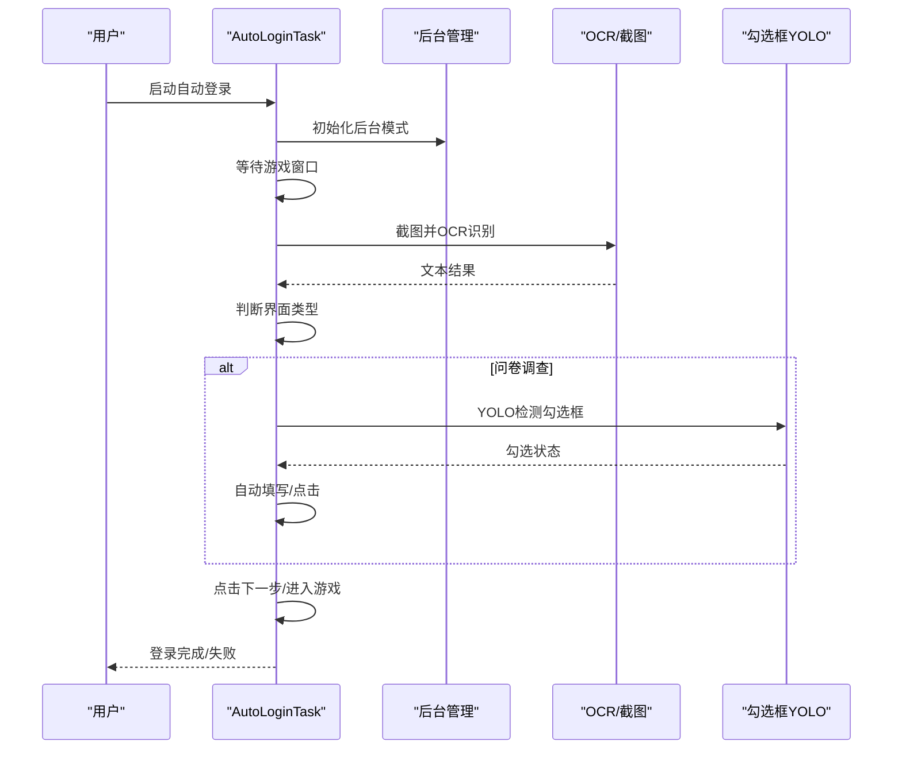
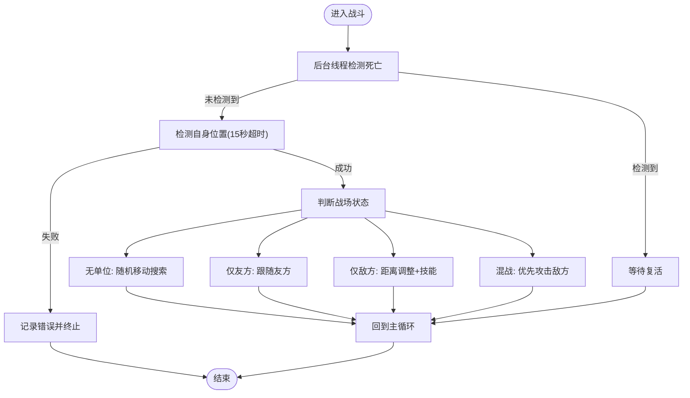
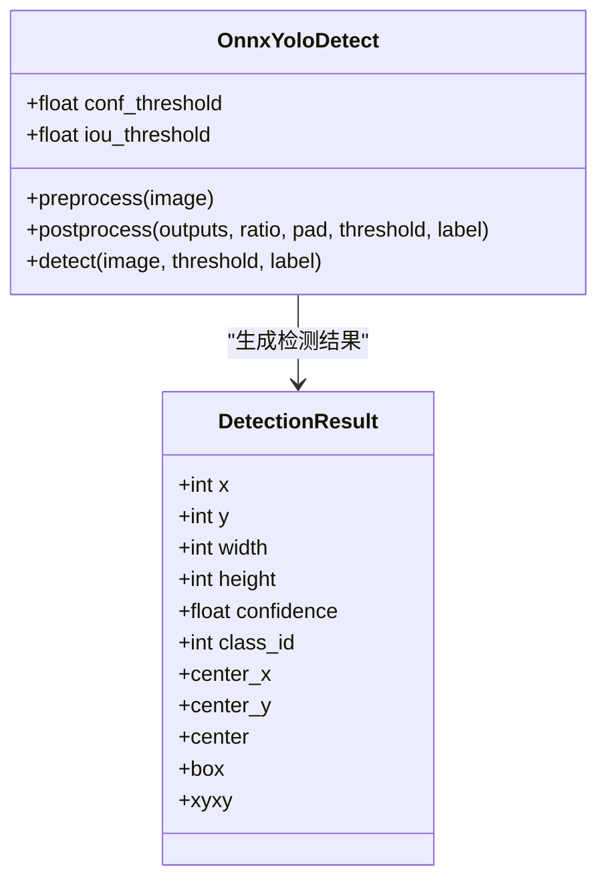
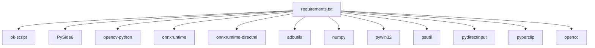

# 项目概述

<cite>
**本文档引用的文件**
- [main.py](file://main.py)
- [config.py](file://config.py)
- [requirements.txt](file://requirements.txt)
- [ok.yml](file://ok.yml)
- [src/globals.py](file://src/globals.py)
- [src/OnnxYoloDetect.py](file://src/OnnxYoloDetect.py)
- [src/task/AutoCombatTask.py](file://src/task/AutoCombatTask.py)
- [src/task/AutoLoginTask.py](file://src/task/AutoLoginTask.py)
- [src/combat/state_detector.py](file://src/combat/state_detector.py)
- [src/combat/distance_calculator.py](file://src/combat/distance_calculator.py)
- [src/combat/skill_controller.py](file://src/combat/skill_controller.py)
- [src/utils/DeviceDetector.py](file://src/utils/DeviceDetector.py)
- [src/utils/ScreenshotHelper.py](file://src/utils/ScreenshotHelper.py)
- [configs/AutoCombatTask.json](file://configs/AutoCombatTask.json)
- [configs/AutoLoginTask.json](file://configs/AutoLoginTask.json)
</cite>

## 目录
1. [简介](#简介)
2. [项目结构](#项目结构)
3. [核心组件](#核心组件)
4. [架构总览](#架构总览)
5. [详细组件分析](#详细组件分析)
6. [依赖分析](#依赖分析)
7. [性能考虑](#性能考虑)
8. [故障排查指南](#故障排查指南)
9. [结论](#结论)
10. [附录](#附录)

## 简介
OK-Jump 是一款面向《漫画群星：大集结》的自动化游戏工具，基于 OK-Script 框架构建，提供自动登录、自动战斗、自动匹配、日常任务等核心能力。项目采用模块化设计，结合 OpenCV、ONNX Runtime、PySide6 等技术栈，实现对游戏界面的 OCR 识别、YOLO 目标检测、后台窗口交互与伪最小化、ADB 模拟器支持等关键技术点，满足用户在不同运行环境下的自动化需求。

## 项目结构
项目采用按功能域划分的层次化组织方式：
- 根目录包含入口脚本、配置文件、依赖清单与构建配置
- src 目录下按领域拆分：task（任务）、combat（战斗）、utils（工具）、gui（界面）、scene（场景）、constants（常量）等
- configs 目录存放各任务的配置文件
- assets 目录存放模型与图片资源
- docs、i18n、icons、screenshots 等辅助目录

**图表来源**
- [main.py:1-107](file://main.py#L1-L107)
- [config.py:68-148](file://config.py#L68-L148)

**章节来源**
- [main.py:1-107](file://main.py#L1-L107)
- [config.py:68-148](file://config.py#L68-L148)

## 核心组件
- OK-Script 框架：提供任务调度、窗口交互、截图、OCR、ADB 等基础设施
- PySide6：构建图形界面与日志监控面板
- OpenCV + ONNX Runtime：实现高性能目标检测与 OCR
- 智能设备选择：自动检测 PC 游戏窗口与 ADB 模拟器连接，动态切换默认设备
- 全局资源管理：统一管理登录状态、OCR 缓存、YOLO 模型等全局资源
- 战斗 AI：基于 YOLO 的战场状态判断、距离控制与技能释放

**章节来源**
- [config.py:81-148](file://config.py#L81-L148)
- [requirements.txt:1-14](file://requirements.txt#L1-L14)
- [src/globals.py:16-257](file://src/globals.py#L16-L257)
- [src/utils/DeviceDetector.py:11-149](file://src/utils/DeviceDetector.py#L11-L149)

## 架构总览
系统以 OK-Script 为核心，围绕“任务-检测-控制”三层架构展开：
- 任务层：负责业务流程编排（登录、战斗、匹配、日常）
- 检测层：负责图像采集、OCR 与 YOLO 目标检测
- 控制层：负责键盘/鼠标输入、ADB 交互与后台模式适配

**图表来源**
- [main.py:99-107](file://main.py#L99-L107)
- [config.py:68-148](file://config.py#L68-L148)
- [src/task/AutoLoginTask.py:21-267](file://src/task/AutoLoginTask.py#L21-L267)
- [src/task/AutoCombatTask.py:32-134](file://src/task/AutoCombatTask.py#L32-L134)
- [src/combat/state_detector.py:24-185](file://src/combat/state_detector.py#L24-L185)
- [src/combat/distance_calculator.py:14-197](file://src/combat/distance_calculator.py#L14-L197)
- [src/combat/skill_controller.py:24-347](file://src/combat/skill_controller.py#L24-L347)
- [src/OnnxYoloDetect.py:17-315](file://src/OnnxYoloDetect.py#L17-L315)

## 详细组件分析

### 自动登录任务（AutoLoginTask）
- 功能要点
  - 启动/等待游戏窗口、处理适龄提示、账户登录、问卷调查、角色选择等多阶段界面
  - 加载界面百分比检测与停滞超时处理
  - OCR 缓存与状态容错，提升鲁棒性
  - 后台模式下的窗口句柄管理与伪最小化支持
- 关键流程

**图表来源**
- [src/task/AutoLoginTask.py:205-267](file://src/task/AutoLoginTask.py#L205-L267)
- [src/task/AutoLoginTask.py:512-681](file://src/task/AutoLoginTask.py#L512-L681)
- [src/utils/DeviceDetector.py:11-149](file://src/utils/DeviceDetector.py#L11-L149)

**章节来源**
- [src/task/AutoLoginTask.py:21-267](file://src/task/AutoLoginTask.py#L21-L267)
- [src/task/AutoLoginTask.py:512-681](file://src/task/AutoLoginTask.py#L512-L681)
- [configs/AutoLoginTask.json:1-15](file://configs/AutoLoginTask.json#L1-L15)

### 自动战斗任务（AutoCombatTask）
- 功能要点
  - 死亡状态并行监控（后台线程）
  - 自身检测、友方/敌方检测、战场状态判断（无单位/仅友方/仅敌方/混战）
  - 基于距离的移动控制与技能释放策略
  - 详细日志与测试模式，便于调试
- 关键流程

**图表来源**
- [src/task/AutoCombatTask.py:84-134](file://src/task/AutoCombatTask.py#L84-L134)
- [src/task/AutoCombatTask.py:197-271](file://src/task/AutoCombatTask.py#L197-L271)
- [src/combat/state_detector.py:16-386](file://src/combat/state_detector.py#L16-L386)
- [src/combat/distance_calculator.py:84-158](file://src/combat/distance_calculator.py#L84-L158)
- [src/combat/skill_controller.py:139-250](file://src/combat/skill_controller.py#L139-L250)

**章节来源**
- [src/task/AutoCombatTask.py:32-134](file://src/task/AutoCombatTask.py#L32-L134)
- [src/task/AutoCombatTask.py:197-271](file://src/task/AutoCombatTask.py#L197-L271)
- [configs/AutoCombatTask.json:1-13](file://configs/AutoCombatTask.json#L1-L13)

### YOLO 检测器（OnnxYoloDetect）
- 功能要点
  - 支持 CPU/GPU 推理（优先 CUDA，回退 CPU）
  - 输入预处理、NMS 后处理、坐标还原
  - 战场单位（自己/友方/敌军/死亡/目标圈）与勾选框识别
- 类关系

**图表来源**
- [src/OnnxYoloDetect.py:17-315](file://src/OnnxYoloDetect.py#L17-L315)

**章节来源**
- [src/OnnxYoloDetect.py:17-315](file://src/OnnxYoloDetect.py#L17-L315)

### 全局资源管理（src/globals.py）
- 功能要点
  - 登录状态、游戏语言、OCR 缓存、YOLO 模型统一管理
  - 延迟加载 YOLO 模型，避免启动时资源占用
  - 提供全局访问接口，供任务与检测器使用
- 关键属性与方法
  - 登录状态：set_logged_in、reset_login_state
  - OCR 缓存：get/set/clear/is_cache_valid
  - YOLO 模型：yolo_model/yolo_detect/reset_yolo_model

**章节来源**
- [src/globals.py:16-257](file://src/globals.py#L16-L257)

### 设备检测与智能选择（DeviceDetector）
- 功能要点
  - 枚举窗口标题识别 PC 游戏窗口，排除模拟器与工具自身窗口
  - ADB 设备检测（adbutils 或系统 adb）
  - 智能默认设备选择：仅 PC 运行选 PC；仅 ADB 连接选 ADB；否则保持用户选择
- 应用场景
  - 启动前自动写入 devices.json 的 preferred 字段
  - 与 OK-Script 配置联动，确保默认交互方式正确

**章节来源**
- [src/utils/DeviceDetector.py:11-149](file://src/utils/DeviceDetector.py#L11-L149)
- [main.py:54-95](file://main.py#L54-L95)

## 依赖分析
- 核心依赖
  - ok-script：任务框架、窗口交互、ADB、OCR、配置管理
  - PySide6：GUI 与日志面板
  - opencv-python：图像处理与截图
  - onnxruntime/onnxruntime-directml：ONNX 推理（GPU/CPU/DML）
  - adbutils：ADB 设备检测
  - numpy、pywin32、psutil、pydirectinput、pyperclip、opencc：辅助库
- 运行时要求
  - Python 3.12
  - Windows 环境（使用 Win32 API 与 DirectInput）

**图表来源**
- [requirements.txt:1-14](file://requirements.txt#L1-L14)
- [ok.yml:1-12](file://ok.yml#L1-L12)

**章节来源**
- [requirements.txt:1-14](file://requirements.txt#L1-L14)
- [ok.yml:1-12](file://ok.yml#L1-L12)

## 性能考虑
- YOLO 推理优化
  - 优先使用 CUDAExecutionProvider，回退 CPU，减少推理延迟
  - 检测结果经 NMS 过滤，降低重复框干扰
- 后台模式优化
  - 死亡状态并行监控（后台线程），主线程快速查询
  - 伪最小化与后台输入适配，降低前台占用
- 资源管理
  - YOLO 模型延迟加载，全局缓存 OCR 结果，减少重复计算
- 配置调节
  - 触发间隔、技能间隔、移动持续时间等参数可在配置文件中精细调整，平衡效率与稳定性

[本节为通用指导，无需具体文件分析]

## 故障排查指南
- 登录卡顿/停滞
  - 检查加载界面百分比检测与停滞超时配置
  - 查看错误截图与日志，定位卡顿节点
- 截图失败/窗口不可捕获
  - 确认后台模式与伪最小化设置
  - 检查窗口标题与类名匹配规则
- YOLO 检测不准
  - 调整置信度阈值与 NMS 阈值
  - 确认模型文件存在且路径正确
- 设备选择异常
  - 检查 PC 窗口标题关键词与排除关键词
  - 确认 ADB 服务可用与设备连接状态

**章节来源**
- [src/task/AutoLoginTask.py:403-456](file://src/task/AutoLoginTask.py#L403-L456)
- [src/combat/state_detector.py:72-185](file://src/combat/state_detector.py#L72-L185)
- [src/utils/DeviceDetector.py:112-149](file://src/utils/DeviceDetector.py#L112-L149)

## 结论
OK-Jump 通过模块化架构与多技术栈融合，为《漫画群星：大集结》提供了稳定可靠的自动化解决方案。其核心优势在于：
- 任务编排清晰、检测与控制分离
- 后台模式与设备自适应，覆盖 PC 与模拟器场景
- YOLO 与 OCR 的结合，提升界面识别准确度
- 可配置性强，便于用户按需调优

[本节为总结性内容，无需具体文件分析]

## 附录

### 安装与快速开始
- 环境要求
  - Python 3.12
  - Windows 系统
- 安装步骤
  - 安装依赖：pip install -r requirements.txt
  - 启动应用：python main.py
- 快速开始
  - 配置游戏路径与热键
  - 运行自动登录任务验证
  - 启用自动战斗任务进行实战测试

**章节来源**
- [requirements.txt:1-14](file://requirements.txt#L1-L14)
- [ok.yml:1-12](file://ok.yml#L1-L12)
- [main.py:99-107](file://main.py#L99-L107)

### 配置说明
- 全局配置（config.py）
  - OCR 引擎与参数、模板匹配、窗口交互方式、ADB 启用、分辨率支持等
- 任务配置（configs/*.json）
  - 自动登录：启用、等待时间、账号输入、加载检测等
  - 自动战斗：技能开关、间隔、移动持续时间、测试模式等

**章节来源**
- [config.py:68-148](file://config.py#L68-L148)
- [configs/AutoLoginTask.json:1-15](file://configs/AutoLoginTask.json#L1-L15)
- [configs/AutoCombatTask.json:1-13](file://configs/AutoCombatTask.json#L1-L13)