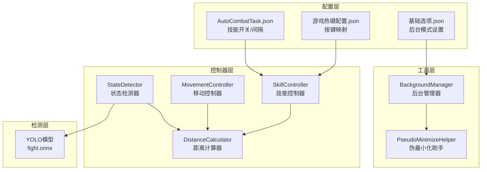
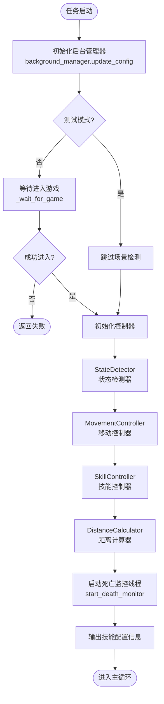
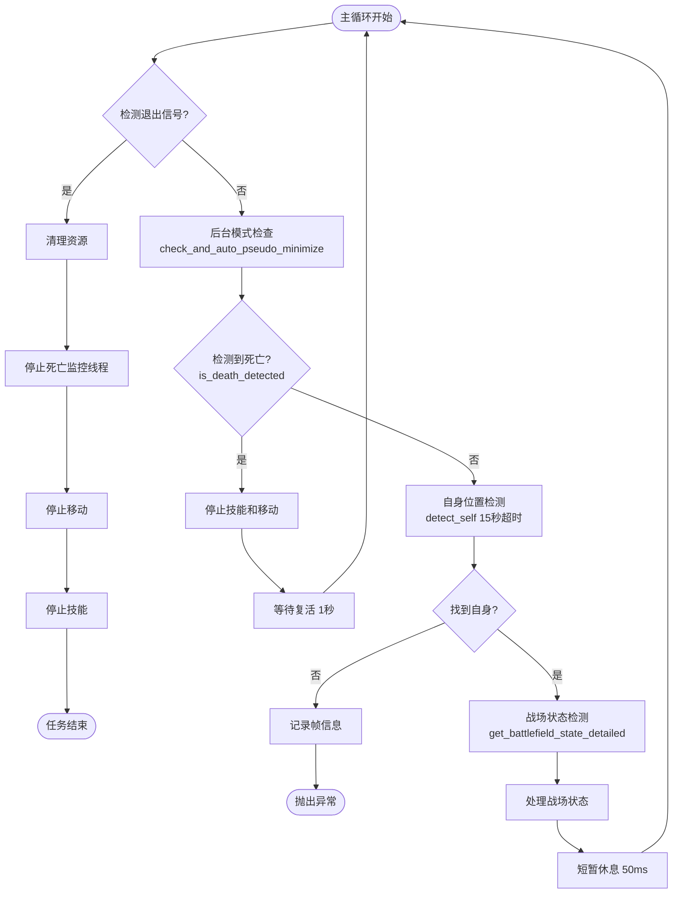
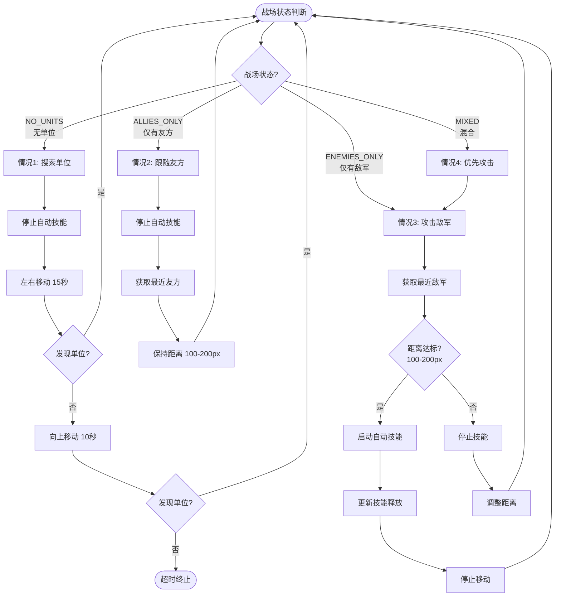
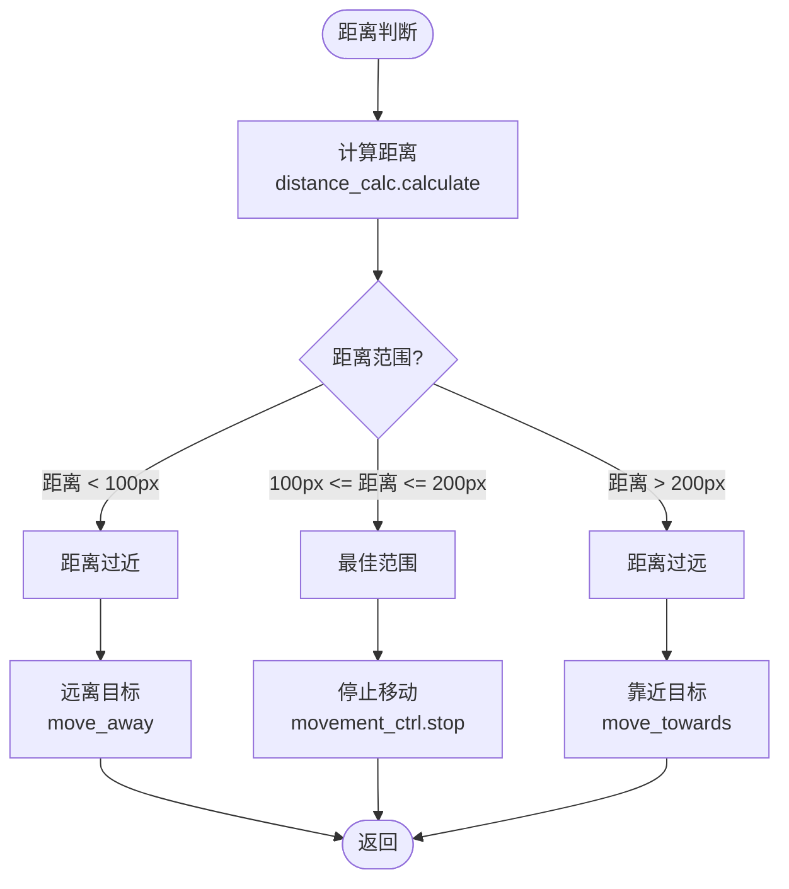
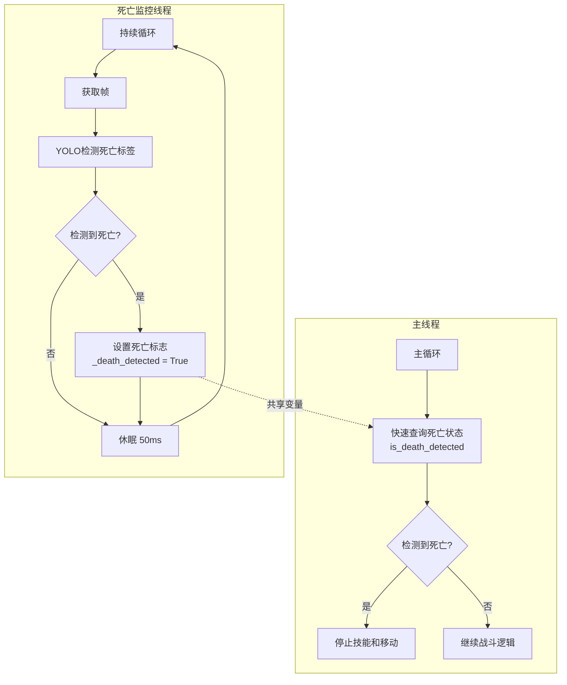
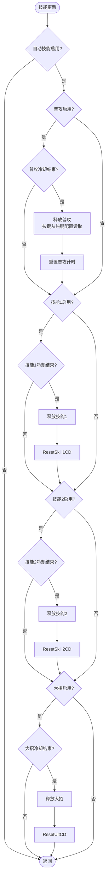
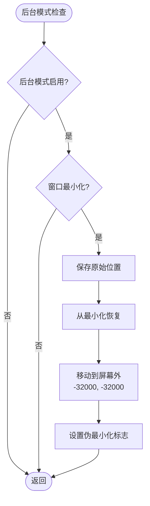
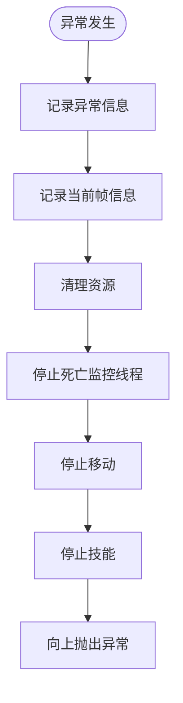
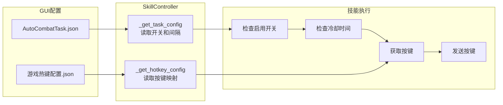

# 自动战斗系统流程图

本文档详细描述自动战斗系统的执行逻辑、状态转换和各模块间的交互关系。

## 一、系统架构概览

## 二、初始化阶段流程

## 三、主循环流程

## 四、战场状态处理流程

## 五、距离控制逻辑

## 六、并行死亡检测机制

## 七、技能释放逻辑

## 八、伪后台模式流程

## 九、异常处理流程

## 十、配置驱动机制

## 十一、关键性能指标

| 指标 | 优化前 | 优化后 |
|------|--------|--------|
| 死亡检测频率 | ~10Hz (100ms间隔) | ~20Hz (50ms间隔) |
| 死亡检测方式 | 同步阻塞 | 并行线程 |
| 主循环延迟 | 100ms | 50ms |
| 后台支持 | 需激活窗口 | 支持伪后台 |

## 十二、相关文件

- [AutoCombatTask.py](file:///d:/Python-wuwa/ok-jump/src/task/AutoCombatTask.py) - 主任务逻辑
- [StateDetector](file:///d:/Python-wuwa/ok-jump/src/combat/state_detector.py) - 状态检测器
- [SkillController](file:///d:/Python-wuwa/ok-jump/src/combat/skill_controller.py) - 技能控制器
- [MovementController](file:///d:/Python-wuwa/ok-jump/src/combat/movement_controller.py) - 移动控制器
- [BackgroundManager](file:///d:/Python-wuwa/ok-jump/src/utils/BackgroundManager.py) - 后台管理器
