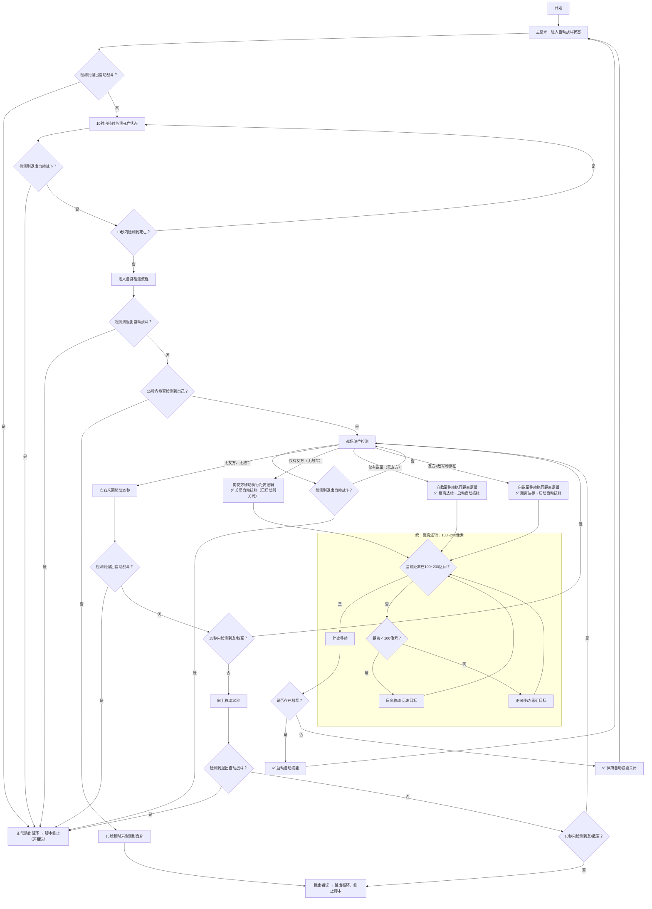

自动化战斗脚本 全逻辑流程图

```mermaid
flowchart TD
    %% 全局主循环 + 退出战斗接口（正常终止）
    A[开始] --> B[主循环：进入自动战斗状态]
    B --> Z0{检测到退出自动战斗？}
    Z0 -->|是| Z1[正常跳出循环 → 脚本终止（非错误）]
    Z0 -->|否| C[10秒内持续监测死亡状态]

    %% 1. 死亡状态监测
    C --> Z2{检测到退出自动战斗？}
    Z2 -->|是| Z1
    Z2 -->|否| D{10秒内检测到死亡？}
    D -->|是| C
    D -->|否| E[进入自身检测流程]

    %% 2. 自身检测（优化：15秒超时保护）
    E --> Z3{检测到退出自动战斗？}
    Z3 -->|是| Z1
    Z3 -->|否| F{15秒内能否检测到自己？}
    F -->|否| G[15秒超时未检测到自身]
    G --> H[抛出错误 → 跳出循环，终止脚本]
    F -->|是| I[战场单位检测]

    %% 3. 战场4种核心状态（技能逻辑终极优化）
    I --> Z4{检测到退出自动战斗？}
    Z4 -->|是| Z1
    Z4 -->|否| I
    %% 无单位
    I -->|无友方、无敌军| J[左右来回移动15秒]
    %% 仅友方：核心优化 → 强制关闭自动技能
    I -->|仅有友方（无敌军）| K[向友方移动执行距离逻辑<br/>✅ 关闭自动技能（已启动则关闭）]
    %% 仅敌军：优化 → 距离达标后启动自动技能
    I -->|仅有敌军（无友方）| L[向敌军移动执行距离逻辑<br/>✅ 距离达标→启动自动技能]
    %% 友方+敌军：优化 → 优先敌军+距离达标启动自动技能
    I -->|友方+敌军均存在| M[向敌军移动执行距离逻辑<br/>✅ 距离达标→启动自动技能]

    %% 4. 无单位移动逻辑（带退出+超时）
    J --> Z5{检测到退出自动战斗？}
    Z5 -->|是| Z1
    Z5 -->|否| N{15秒内检测到友/敌军？}
    N -->|是| I
    N -->|否| O[向上移动10秒]
    O --> Z6{检测到退出自动战斗？}
    Z6 -->|是| Z1
    Z6 -->|否| P{10秒内检测到友/敌军？}
    P -->|是| I
    P -->|否| H

    %% 5. 统一距离逻辑（100~200像素 全场景通用）
    subgraph 距离规则[统一距离逻辑：100~200像素]
        Q{当前距离在100~200区间？}
        %% 距离达标
        Q -->|是| R[停止移动]
        %% 距离不达标
        Q -->|否| S{距离 < 100像素？}
        S -->|是| T[反向移动 远离目标]
        S -->|否| U[正向移动 靠近目标]
        T --> Q
        U --> Q
    end

    %% 绑定距离逻辑
    K --> Q
    L --> Q
    M --> Q
    
    %% 6. 自动技能最终逻辑
    R --> S1{是否存在敌军？}
    S1 -->|是| S2[✅ 启动自动技能]
    S1 -->|否| S3[✅ 保持自动技能关闭]
    
    %% 回归主循环
    S2 --> B
    S3 --> B
```
---
